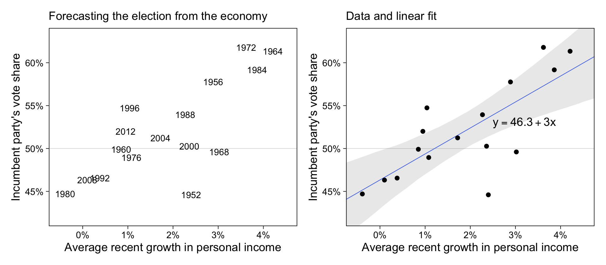
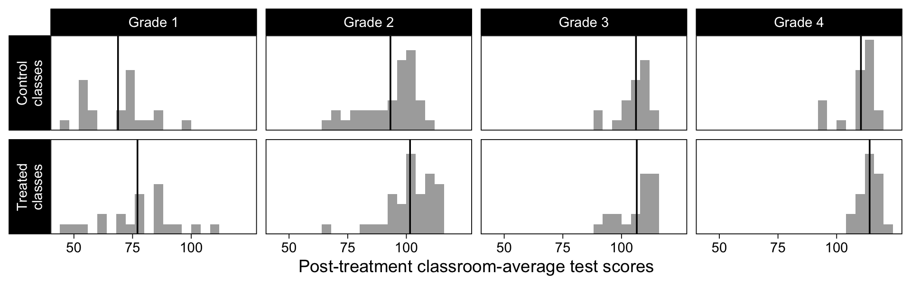
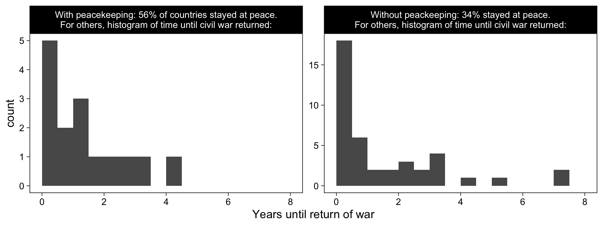
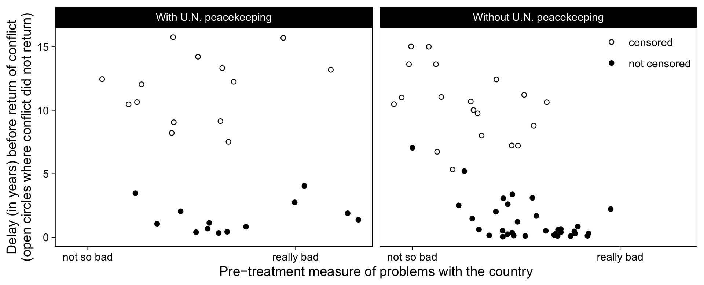
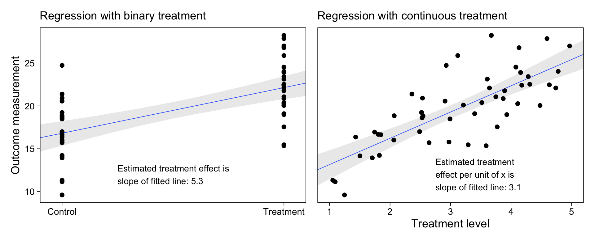
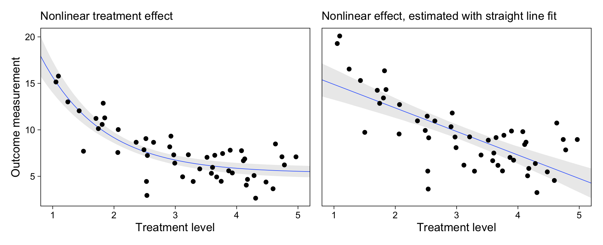
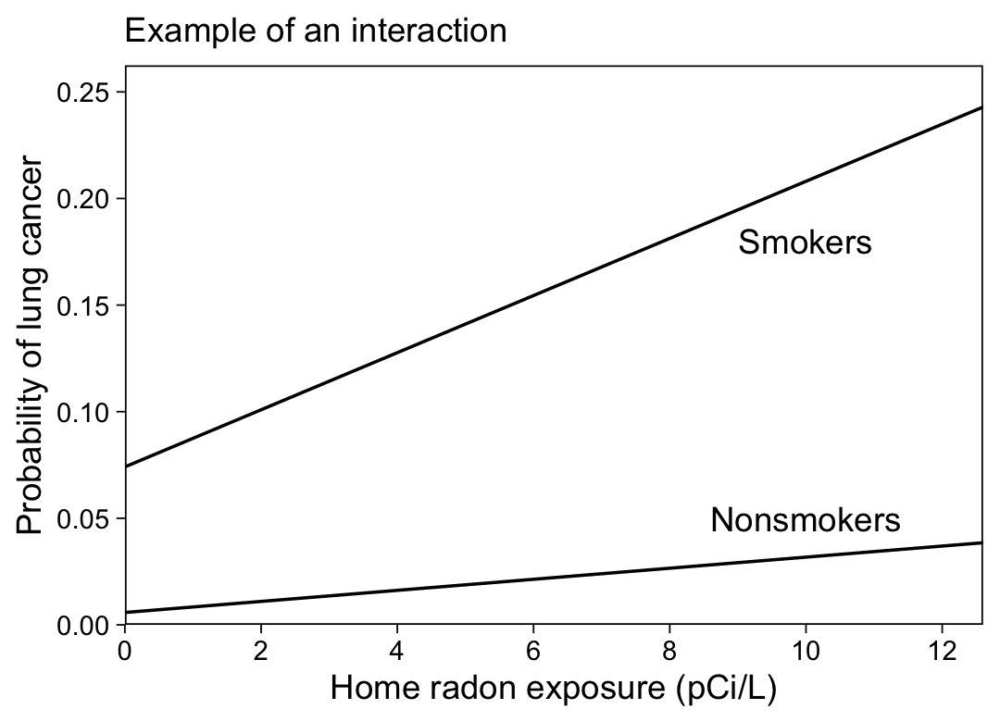
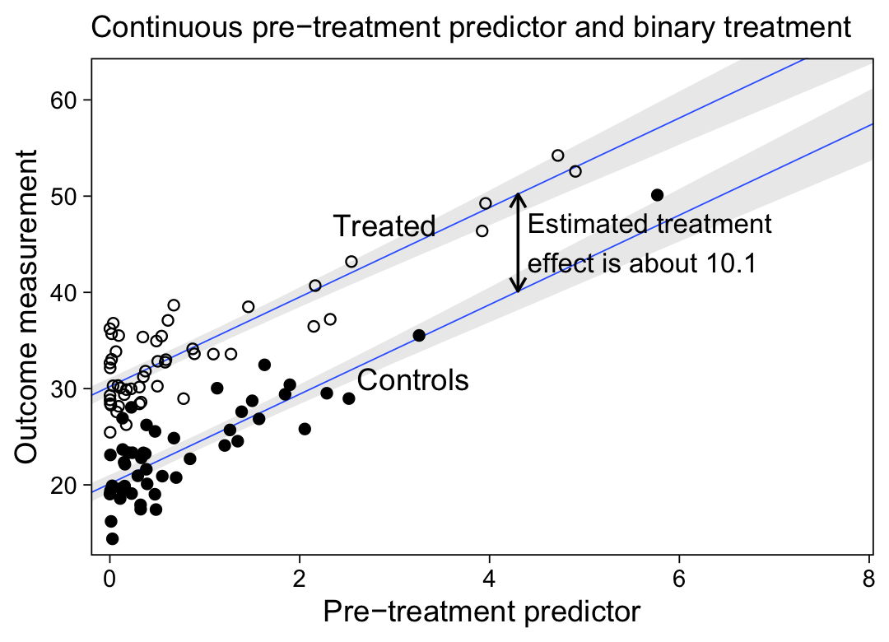

Chapter 1: Overview
================
A Solomon Kurz
2021-04-07

# Overview

## 1.1 The three challenges of statistics

> The three challenges of statistical inference are:
>
> 1.  *Generalizing from sample to population*, a problem that is
>     associated with survey sampling but actually arises in nearly
>     every application of statistical inference;
> 2.  *Generalizing from treatment to control group*, a problem that is
>     associated with causal inference, which is implicitly or
>     explicitly part of the interpretation of most regressions we have
>     seen; and
> 3.  *Generalizing from observed measurements to the underlying
>     constructs of interest*, as most of the time our data do not
>     record exactly what we would ideally like to study. (p. 3,
>     *emphasis* in the original)

## 1.2 Why learn regression?

“Regression is a method that allows researchers to summarize how
predictions or average values of an *outcome* vary across individuals
defined by a set of *predictors*” (p. 4, *emphasis* in the original). To
get a sense, load the `hibbs.dat` data.

``` r
library(tidyverse)

hibbs <- read_table2("ROS-Examples-master/ElectionsEconomy/data/hibbs.dat")

glimpse(hibbs)
```

    ## Rows: 16
    ## Columns: 5
    ## $ year                <dbl> 1952, 1956, 1960, 1964, 1968, 1972, 1976, 1980, 19…
    ## $ growth              <dbl> 2.40, 2.89, 0.85, 4.21, 3.02, 3.62, 1.08, -0.39, 3…
    ## $ vote                <dbl> 44.60, 57.76, 49.91, 61.34, 49.60, 61.79, 48.95, 4…
    ## $ inc_party_candidate <chr> "\"Stevenson\"", "\"Eisenhower\"", "\"Nixon\"", "\…
    ## $ other_candidate     <chr> "\"Eisenhower\"", "\"Stevenson\"", "\"Kennedy\"", …

Make the left panel of Figure 1.1. Before we save the figure, we’ll
alter the default **ggplot2** theme.

``` r
theme_set(theme_linedraw() +
            theme(panel.grid = element_blank()))

p1 <-
  hibbs %>% 
  ggplot(aes(x = growth, y = vote, label = year)) +
  geom_hline(yintercept = 50, color = "grey85", size = 1/4) +
  geom_text(size = 3) +
  scale_x_continuous(labels = function(x) str_c(x, "%")) +
  scale_y_continuous(labels = function(x) str_c(x, "%")) +
  labs(subtitle = "Forecasting the election from the economy",
       x = "Average recent growth in personal income",
       y = "Incumbent party's vote share")
```

The right panel of Figure 1.1 requires a linear model. We’ll use
`brms::brm()`.

``` r
library(brms)
```

Fit the model using default priors.

``` r
m1.1 <-
  brm(data = hibbs,
      family = gaussian,
      vote ~ 0 + Intercept + growth,
      cores = 4, chains = 4,
      seed = 1,
      file = "fits/m01.01")
```

Check the model summary.

``` r
print(m1.1)
```

    ##  Family: gaussian 
    ##   Links: mu = identity; sigma = identity 
    ## Formula: vote ~ 0 + Intercept + growth 
    ##    Data: hibbs (Number of observations: 16) 
    ## Samples: 4 chains, each with iter = 2000; warmup = 1000; thin = 1;
    ##          total post-warmup samples = 4000
    ## 
    ## Population-Level Effects: 
    ##           Estimate Est.Error l-95% CI u-95% CI Rhat Bulk_ESS Tail_ESS
    ## Intercept    46.34      1.71    42.98    49.75 1.00     1595     1741
    ## growth        3.03      0.75     1.51     4.48 1.00     1612     1729
    ## 
    ## Family Specific Parameters: 
    ##       Estimate Est.Error l-95% CI u-95% CI Rhat Bulk_ESS Tail_ESS
    ## sigma     4.05      0.85     2.78     6.04 1.00     1918     2112
    ## 
    ## Samples were drawn using sampling(NUTS). For each parameter, Bulk_ESS
    ## and Tail_ESS are effective sample size measures, and Rhat is the potential
    ## scale reduction factor on split chains (at convergence, Rhat = 1).

Now make Figure 1.1b and display the full figure.

``` r
nd <- tibble(growth = seq(from = -1, to = 5, length.out = 50))

p2 <-
  fitted(m1.1,
         newdata = nd) %>% 
  data.frame() %>% 
  bind_cols(nd) %>% 
  mutate(vote = Estimate) %>% 
  
  ggplot(aes(x = growth, y = vote)) +
  geom_hline(yintercept = 50, color = "grey85", size = 1/4) +
  geom_smooth(aes(ymin = Q2.5, ymax = Q97.5),
              stat = "identity",
              alpha = 1/5, size = 1/4) +
  geom_point(data = hibbs) +
  annotate(geom = "text",
           x = 2.5, y = 53,
           label = str_c("y==", round(fixef(m1.1)[1, 1], digits = 1), "+", round(fixef(m1.1)[2, 1], digits = 1), "*x"),
           hjust = 0, parse = T) +
  scale_x_continuous(labels = function(x) str_c(x, "%")) +
  scale_y_continuous(labels = function(x) str_c(x, "%")) +
  labs(subtitle = "Data and linear fit",
       x = "Average recent growth in personal income",
       y = "Incumbent party's vote share")

library(patchwork)
p1 + p2 &
  coord_cartesian(xlim = c(-0.5, 4.5),
                  ylim = c(42, 63))
```



Some of the more important applications for regression are

-   prediction,
-   exploring associations,
-   extrapolation, and
-   causal inference.

## 1.3 Some examples of regression

“To give a sense of the difficulties involved in applied regression,
\[Gelman et al\] briefly discuss\[ed\] some examples involving sampling,
prediction, and causal inference” (p. 5).

### 1.3.1 Estimating public opinion from an opt-in internet survey.

### 1.3.2 A randomized experiment on the effect of an educational television program.

To make Figure 1.2, we need the `electric` data.

``` r
electric <- read_csv("ROS-Examples-master/ElectricCompany/data/electric.csv")

glimpse(electric)
```

    ## Rows: 192
    ## Columns: 7
    ## $ X1        <dbl> 1, 2, 3, 4, 5, 6, 7, 8, 9, 10, 11, 12, 13, 14, 15, 16, 17, 1…
    ## $ post_test <dbl> 48.9, 70.5, 89.7, 44.2, 77.5, 84.7, 78.9, 86.8, 60.8, 75.7, …
    ## $ pre_test  <dbl> 13.8, 16.5, 18.5, 8.8, 15.3, 15.0, 19.4, 15.0, 11.8, 16.4, 1…
    ## $ grade     <dbl> 1, 1, 1, 1, 1, 1, 1, 1, 1, 1, 1, 2, 2, 2, 2, 2, 2, 2, 2, 2, …
    ## $ treatment <dbl> 1, 1, 1, 1, 1, 1, 1, 1, 1, 1, 1, 1, 1, 1, 1, 1, 1, 1, 1, 1, …
    ## $ supp      <dbl> 1, 0, 1, 0, 1, 0, 0, 1, 1, 1, 1, 0, 0, 0, 1, 1, 1, 1, 1, 0, …
    ## $ pair_id   <dbl> 1, 2, 3, 4, 5, 6, 7, 8, 9, 10, 11, 12, 13, 14, 15, 16, 17, 1…

Make Figure 1.2.

``` r
electric %>% 
  mutate(grade = str_c("Grade ", grade),
         class = ifelse(treatment == 0, "Control\nclasses", "Treated\nclasses")) %>% 
  # the next two lines are for the panel-wise mean lines
  group_by(grade, class) %>% 
  mutate(mean = mean(post_test)) %>% 
  
  ggplot(aes(x = post_test)) +
  geom_histogram(fill = "grey67", binwidth = 4, boundary = 0) +
  geom_vline(aes(xintercept = mean)) +
  scale_x_continuous("Post-treatment classroom-average test scores", breaks = 2:4 * 25) +
  scale_y_continuous(NULL, breaks = NULL, expand = expansion(mult = c(0, 0.05))) +
  facet_grid(class~grade, switch = "y")
```



### 1.3.3 Estimating the effects of United Nations peacekeeping, using pre-treatment variables to adjust for differences between treatment and control groups.

To make Figure 1.3, we need the `pk&pkept_old.dta` data.

``` r
peace <- haven::read_dta("ROS-Examples-master/Peacekeeping/data/pk&pkept_old.dta")

# glimpse(peace)
```

Figure 1.3 will require some data wrangling (see
<https://github.com/avehtari/ROS-Examples/blob/master/Peacekeeping/peace.Rmd>).

``` r
# wrangle
peace <-
  peace %>% 
  mutate(censored     = morewar == 0,
         badness      = log(hazard1),  # Aki made this, but it isn't needed for this plot
         peacekeepers = pk_dum == 1) %>% 
  mutate(faildate = ifelse(is.na(faildate) & !is.na(cfdate), as.Date("2004-12-31"), faildate) %>% as.Date(., origin = "1970-01-01")) %>% 
  mutate(delay = as.numeric(faildate - cfdate) / 365.24) %>% 
  mutate(ok = pcw == 1 & !is.na(delay))

peace %>% 
  filter(ok == T, censored == F) %>% 
  # to make the facet labels pretty
  mutate(peacekeepers = factor(peacekeepers,
                               levels = c(T, F),
                               labels = c("With peacekeeping: 56% of countries stayed at peace.\nFor others, histogram of time until civil war returned:",
                                          "Without peackeeping: 34% stayed at peace.\nFor others, histogram of time until civil war returned:"))) %>% 
  
  # plot!
  ggplot(aes(x = delay)) +
  geom_histogram(boundary = 0, binwidth = 0.5) +
  scale_x_continuous("Years until return of war", limits = c(0, 8)) +
  facet_wrap(~peacekeepers, scales = "free_y")
```



Figure 1.4.

``` r
# new variables
peace <-
  peace %>% 
  mutate(ok2      = ifelse(ok == T & !is.na(badness), T, F),
         badness2 = badness / 2 + 8) 

# wrangle
peace %>% 
  filter(ok2 == T) %>% 
  # to make the facet labels pretty
  mutate(peacekeepers = factor(peacekeepers,
                               levels = c(F, T),
                               labels = c("Without U.N. peacekeeping",
                                          "With U.N. peacekeeping"))) %>%
  mutate(peacekeepers = fct_rev(peacekeepers),
         censored = factor(censored,
                           levels = c(T, F),
                           labels = c("censored", "not censored"))) %>% 
  
  #plot!
  ggplot(aes(x = badness2, y = delay)) + 
  geom_point(aes(shape = censored)) +
  scale_shape_manual(NULL, values = c(1, 19)) +
  scale_x_continuous("Pre−treatment measure of problems with the country",
                     breaks = quantile(filter(peace, ok2 == T) %>% pull(badness2), probs = c(.05, .95)),
                     labels = c("not so bad", "really bad")) +
  ylab("Delay (in years) before return of conflict\n(open circles where conflict did not return)") +
  theme(legend.background = element_blank(),
        legend.position = c(.92, .9)) +
  facet_wrap(~peacekeepers)
```



### 1.3.4 Estimating the effect of gun laws, and the difficulty of inference using regression with a large number of predictors.

### 1.3.5 Comparing the peacekeeping and gun-control studies.

## 1.4 Challenges in building, understanding, and interpreting regressions

“We can distinguish two different ways in which regression is used for
causal inference: estimating a relationship and adjusting for background
variables” (p. 10).

### 1.4.1 Regression to estimate a relationship of interest.

If yoo go to
<https://github.com/avehtari/ROS-Examples/blob/master/SimpleCausal/SimpleCausal.Rmd>,
you’ll see the data for this section are simulated. Here is the
simulation.

``` r
n <- 50

# Vehtari did not include a seed number in his code
set.seed(1)

d <-
  tibble(x = runif(n, 1, 5)) %>% 
  mutate(y        = rnorm(n, 10 + 3 * x, 3),
         x_binary = ifelse(x < 3, 0, 1))

head(d)
```

    ## # A tibble: 6 x 3
    ##       x     y x_binary
    ##   <dbl> <dbl>    <dbl>
    ## 1  2.06  16.0        0
    ## 2  2.49  17.0        0
    ## 3  3.29  15.5        1
    ## 4  4.63  22.5        1
    ## 5  1.81  16.7        0
    ## 6  4.59  27.9        1

Fit the model

``` r
m1.2a <-
  brm(data = d,
      family = gaussian,
      y ~ 0 + Intercept + x_binary,
      cores = 4, chains = 4,
      seed = 1,
      file = "fits/m01.02a")

m1.2b <-
  update(m1.2a,
         newdata = d,
         y ~ 0 + Intercept + x,
         cores = 4, chains = 4,
         seed = 1,
         file = "fits/m01.02b")
```

    ## The desired updates require recompiling the model

Check the model summaries.

``` r
posterior_summary(m1.2a)[1:3, ] %>% round(digits = 2)
```

    ##             Estimate Est.Error  Q2.5 Q97.5
    ## b_Intercept    16.81      0.73 15.36 18.23
    ## b_x_binary      5.33      1.01  3.34  7.30
    ## sigma           3.51      0.37  2.88  4.33

``` r
posterior_summary(m1.2b)[1:3, ] %>% round(digits = 2)
```

    ##             Estimate Est.Error Q2.5 Q97.5
    ## b_Intercept    10.09      1.21 7.71 12.39
    ## b_x             3.06      0.37 2.36  3.78
    ## sigma           2.84      0.29 2.34  3.48

Make Figure 1.5a.

``` r
nd <-
  tibble(x_binary = seq(from = -0.1, to = 1.1, length.out = 50))

p1 <-
  fitted(m1.2a,
         newdata = nd) %>% 
  data.frame() %>% 
  bind_cols(nd) %>% 
  
  ggplot(aes(x = x_binary)) +
  geom_smooth(aes(y = Estimate, ymin = Q2.5, ymax = Q97.5),
              stat = "identity",
              alpha = 1/5, size = 1/4) +
  geom_point(data = d,
             aes(y = y)) +
  annotate(geom = "text",
           x = 0.25, y = 12,
           label = str_c("Estimated treatment effect is\nslope of fitted line: ", round(fixef(m1.2a)[2, 1], digits = 1)),
           hjust = 0, size = 3) +
  scale_x_continuous(NULL, 
                     breaks = 0:1, labels = c("Control", "Treatment"), expand = c(0, 0)) +
  labs(subtitle = "Regression with binary treatment",
       y = "Outcome measurement")
```

Make Figure 1.5b, combine the two panels, and plot.

``` r
nd <-
  tibble(x = seq(from = 0.8, to = 5.2, length.out = 50))

p2 <-
  fitted(m1.2b,
         newdata = nd) %>% 
  data.frame() %>% 
  bind_cols(nd) %>% 
  
  ggplot(aes(x = x)) +
  geom_smooth(aes(y = Estimate, ymin = Q2.5, ymax = Q97.5),
              stat = "identity",
              alpha = 1/5, size = 1/4) +
  geom_point(data = d,
             aes(y = y)) +
  annotate(geom = "text",
           x = 2.75, y = 12,
           label = str_c("Estimated treatment\neffect per unit of x is\nslope of fitted line: ", round(fixef(m1.2b)[2, 1], digits = 1)),
           hjust = 0, size = 3) +
  scale_x_continuous("Treatment level", expand = c(0, 0)) +
  scale_y_continuous(NULL, breaks = NULL) +
  labs(subtitle = "Regression with continuous treatment")

p1 + p2
```



The next two models require a little more simulation.

``` r
set.seed(1)

d <-
  d %>% 
  mutate(y = rnorm(n, mean = 5 + 30 * exp(-x), sd = 2))
```

Fit the linear and non-linear models.

``` r
# linear
m1.3a <-
  brm(data = d,
      family = gaussian,
      y ~ 0 + Intercept + x,
      cores = 4, chains = 4,
      seed = 1,
      file = "fits/m01.03a")

# non-linear
m1.3b <-
  brm(data = d,
      family = gaussian,
      y ~ 0 + Intercept + exp(-x),
      cores = 4, chains = 4,
      seed = 1,
      file = "fits/m01.03b")
```

Check the model summaries.

``` r
posterior_summary(m1.3a)[1:3, ] %>% round(digits = 2)
```

    ##             Estimate Est.Error  Q2.5 Q97.5
    ## b_Intercept    13.69      0.91 11.88 15.44
    ## b_x            -1.97      0.28 -2.51 -1.44
    ## sigma           2.08      0.21  1.71  2.56

``` r
posterior_summary(m1.3b)[1:3, ] %>% round(digits = 2)
```

    ##             Estimate Est.Error  Q2.5 Q97.5
    ## b_Intercept     5.35      0.33  4.71  5.99
    ## b_expMx        28.08      2.86 22.24 33.64
    ## sigma           1.71      0.18  1.41  2.12

Make Figure 1.6.

``` r
nd <-
  tibble(x = seq(from = 0.8, to = 5.2, length.out = 50))

# linear
p2 <-
  fitted(m1.3a,
         newdata = nd) %>% 
  data.frame() %>% 
  bind_cols(nd) %>% 
  
  ggplot(aes(x = x)) +
  geom_smooth(aes(y = Estimate, ymin = Q2.5, ymax = Q97.5),
              stat = "identity",
              alpha = 1/5, size = 1/4) +
  geom_point(data = d,
             aes(y = y)) +
  scale_x_continuous("Treatment level", expand = c(0, 0)) +
  scale_y_continuous(NULL, breaks = NULL) +
  labs(subtitle = "Nonlinear effect, estimated with straight line fit")

# non-linear
p1 <-
  fitted(m1.3b,
         newdata = nd) %>% 
  data.frame() %>% 
  bind_cols(nd) %>% 
  
  ggplot(aes(x = x)) +
  geom_smooth(aes(y = Estimate, ymin = Q2.5, ymax = Q97.5),
              stat = "identity",
              alpha = 1/5, size = 1/4) +
  geom_point(data = d,
             aes(y = y)) +
  scale_x_continuous("Treatment level", expand = c(0, 0)) +
  labs(subtitle = "Nonlinear treatment effect",
       y = "Outcome measurement")

# combine and plot!
p1 + p2
```



Figure 1.7 was made without fitting a model. The data are of four points
and the lines simply connect them.

``` r
tibble(radon = c(0, 20, 0, 20),
       p     = c(.07409 + c(0, 20) * .0134,
                 .00579 + c(0, 20) * .0026),
       group = c("Smokers", "Smokers", "Nonsmokers", "Nonsmokers")) %>% 
  ggplot(aes(x = radon, y = p, group = group)) +
  geom_line() +
  annotate(geom = "text",
           x = 10, y = c(.05, .18),
           label = c("Nonsmokers", "Smokers")) +
  scale_x_continuous("Home radon exposure (pCi/L)", breaks = 0:6 * 2,
                     expand = expansion(mult = c(0, 0.05))) +
  scale_y_continuous("Probability of lung cancer",
                     expand = expansion(mult = c(0, 0.05))) +
  labs(subtitle = "Example of an interaction") +
  coord_cartesian(xlim = c(0, 12),
                  ylim = c(0, 0.25))
```



### 1.4.2 Regression to adjust for differences between treatment and control groups.

Once again we have an example with simulated data.

``` r
n <- 100

set.seed(1)

d <-
  tibble(xx = rnorm(n, mean = 0, sd = 1)^2,
         z  = rep(0:1, n / 2)) %>% 
  mutate(yy = rnorm(n, mean = 20 + 5 * xx + 10 * z, sd = 3))

d
```

    ## # A tibble: 100 x 3
    ##        xx     z    yy
    ##     <dbl> <int> <dbl>
    ##  1 0.392      0  20.1
    ##  2 0.0337     1  30.3
    ##  3 0.698      0  20.8
    ##  4 2.54       1  43.2
    ##  5 0.109      0  18.6
    ##  6 0.673      1  38.7
    ##  7 0.238      0  23.3
    ##  8 0.545      1  35.5
    ##  9 0.332      0  22.8
    ## 10 0.0933     1  35.5
    ## # … with 90 more rows

Fit the model.

``` r
m1.4 <-
  brm(data = d,
      family = gaussian,
      yy ~ 0 + Intercept + xx + z,
      cores = 4, chains = 4,
      seed = 1,
      file = "fits/m01.04")
```

Check the model summary.

``` r
print(m1.4)
```

    ##  Family: gaussian 
    ##   Links: mu = identity; sigma = identity 
    ## Formula: yy ~ 0 + Intercept + xx + z 
    ##    Data: d (Number of observations: 100) 
    ## Samples: 4 chains, each with iter = 2000; warmup = 1000; thin = 1;
    ##          total post-warmup samples = 4000
    ## 
    ## Population-Level Effects: 
    ##           Estimate Est.Error l-95% CI u-95% CI Rhat Bulk_ESS Tail_ESS
    ## Intercept    20.12      0.47    19.22    21.05 1.00     2152     2048
    ## xx            4.65      0.26     4.14     5.15 1.00     2796     2551
    ## z            10.09      0.59     8.89    11.22 1.00     2433     2773
    ## 
    ## Family Specific Parameters: 
    ##       Estimate Est.Error l-95% CI u-95% CI Rhat Bulk_ESS Tail_ESS
    ## sigma     2.91      0.20     2.54     3.34 1.00     3262     2792
    ## 
    ## Samples were drawn using sampling(NUTS). For each parameter, Bulk_ESS
    ## and Tail_ESS are effective sample size measures, and Rhat is the potential
    ## scale reduction factor on split chains (at convergence, Rhat = 1).

Make Figure 1.8.

``` r
# for the arrow
line <-
  tibble(x    = 4.3,
         xend = 4.3) %>% 
  mutate(y    = fixef(m1.4)[1, 1] + fixef(m1.4)[2, 1] * x,
         yend = fixef(m1.4)[1, 1] + fixef(m1.4)[2, 1] * x + fixef(m1.4)[3, 1])

# define the newdata
nd <-
  crossing(z  = 0:1,
           xx = seq(from = -0.2, to = 8.05, length.out = 50))

# get the fitted draws
fitted(m1.4,
       newdata = nd) %>% 
  data.frame() %>% 
  bind_cols(nd) %>% 
  
  # plot!
  ggplot(aes(x = xx)) +
  geom_smooth(aes(y = Estimate, ymin = Q2.5, ymax = Q97.5, group = z),
              stat = "identity",
              alpha = 1/5, size = 1/4) +
  geom_point(data = d,
             aes(y = yy, shape = factor(z))) +
  geom_segment(data = line,
               aes(x = x, xend = xend,
                   y = y, yend = yend),
               arrow = arrow(length = unit(0.2, "cm"), ends = "both")) +
  annotate(geom = "text",
           x = 4.4, y = 45.2,
           label = str_c("Estimated treatment\neffect is about ", round(fixef(m1.4)[3, 1], digits = 1)),
           hjust = 0, size = 3.5) +
  annotate(geom = "text",
           x = c(3.2, 2.9), y = c(31, 47),
           label = c("Controls", "Treated")) +
  scale_shape_manual(values = c(19, 1), breaks = NULL) +
  scale_x_continuous("Pre−treatment predictor", expand = c(0, 0)) +
  scale_y_continuous("Outcome measurement", breaks = 2:6 * 10) +
  labs(subtitle = "Continuous pre−treatment predictor and binary treatment") +
  coord_cartesian(ylim = c(15, 62))
```



### 1.4.3 Interpreting coefficients in a predictive model.

Not sure where these estimates came from. Keep an eye out for this in
later chapters.

The example in this section comes from the `earnings.csv` data, which we
won’t see formally introduced until [Section
5.4](https://github.com/ASKurz/Working-through-Regression-and-other-stories/blob/main/05.md#54-bootstrapping-to-simulate-a-sampling-distribution).
Load the data.

``` r
earnings <- read_csv("ROS-Examples-master/Earnings/data/earnings.csv")

head(earnings)
```

    ## # A tibble: 6 x 15
    ##   height weight  male  earn earnk ethnicity education mother_education
    ##    <dbl>  <dbl> <dbl> <dbl> <dbl> <chr>         <dbl>            <dbl>
    ## 1     74    210     1 50000    50 White            16               16
    ## 2     66    125     0 60000    60 White            16               16
    ## 3     64    126     0 30000    30 White            16               16
    ## 4     65    200     0 25000    25 White            17               17
    ## 5     63    110     0 50000    50 Other            16               16
    ## 6     68    165     0 62000    62 Black            18               18
    ## # … with 7 more variables: father_education <dbl>, walk <dbl>, exercise <dbl>,
    ## #   smokenow <dbl>, tense <dbl>, angry <dbl>, age <dbl>

The model requires we make a new version of the `height` variable
centered on 60. We’ll call it `height_60`.

``` r
earnings <-
  earnings %>% 
  mutate(height_60 = height - 60)
```

Here’s how to fit the model described in the text.

``` r
m1.5 <-
  brm(data = earnings,
      family = gaussian,
      earn ~ 1 + height_60,
      cores = 4, chains = 4,
      seed = 1,
      file = "fits/m01.05")
```

Check the model summary.

``` r
print(m1.5, robust = T)
```

    ##  Family: gaussian 
    ##   Links: mu = identity; sigma = identity 
    ## Formula: earn ~ 1 + height_60 
    ##    Data: earnings (Number of observations: 1816) 
    ## Samples: 4 chains, each with iter = 2000; warmup = 1000; thin = 1;
    ##          total post-warmup samples = 4000
    ## 
    ## Population-Level Effects: 
    ##           Estimate Est.Error l-95% CI u-95% CI Rhat Bulk_ESS Tail_ESS
    ## Intercept 10668.21    987.18  8788.14 12609.95 1.00     3946     2812
    ## height_60  1592.68    130.13  1331.52  1836.68 1.00     3921     2989
    ## 
    ## Family Specific Parameters: 
    ##       Estimate Est.Error l-95% CI u-95% CI Rhat Bulk_ESS Tail_ESS
    ## sigma 21685.93    364.82 20999.78 22403.85 1.00     4732     2993
    ## 
    ## Samples were drawn using sampling(NUTS). For each parameter, Bulk_ESS
    ## and Tail_ESS are effective sample size measures, and Rhat is the potential
    ## scale reduction factor on split chains (at convergence, Rhat = 1).

Now we can see where the authors got the model formula
`earnings = 11 000 + 1500 ∗ (height − 60) + error` (p. 12). Those are
the same as our intercept and *β* coefficients, when rounded. When they
wrote “the errors are mostly in the range ±22 000,” those values are a
rounded version of the point estimate in our `sigma` row. Our “errors”
can be described as normally distributed with a mean of zero and a
standard deviation of about 22,000. Here’s what that looks like,
accounting for posterior uncertainty.

``` r
posterior_samples(m1.5) %>% 
  slice_sample(n = 50) %>% 
  mutate(iter = 1:n()) %>% 
  expand(nesting(iter, sigma), 
         earn = seq(from = -70000, to = 70000, length.out = 200)) %>% 
  mutate(d = dnorm(earn, mean = 0, sd = sigma)) %>% 
  
  ggplot(aes(x = earn, y = d, group = iter)) +
  geom_line(size = 1/4, alpha = 1/2) +
  scale_y_continuous(NULL, breaks = NULL, 
                     expand = expansion(mult = c(0, 0.05)), limits = c(0, NA)) +
  labs(subtitle = expression(50~posterior~draws~of~about~Normal(0*', '*22000))) +
  coord_cartesian(xlim = c(-6e4, 6e4))
```


We’ll get a better sense of what this all means in later chapters.

### 1.4.4 Building, interpreting, and checking regression models.

The authors proposed the statistical model workflow has four basic
steps:

1.  Model building
2.  Model fitting
3.  Understanding the model fits
4.  Criticism

## 1.5 Classical and Bayesian inference

> As statisticians, we spend much of our effort fitting models to data
> and using those models to make predictions. These steps can be
> performed under various methodological and philosophical frameworks.
> Common to all these approaches are three concerns: (1) what
> *information* is being used in the estimation process, (2) what
> *assumptions* are being made, and (3) how estimates and predictions
> are *interpreted*, in a classical or Bayesian framework. (p. 13,
> *emphasis* in the original)

### 1.5.1 Information.

### 1.5.2 Assumptions

### 1.5.3 Classical inference.

### 1.5.4 Bayesian inference.

## 1.6 Computing least squares and Bayesian regression

We fit Bayesian models in **R** using the `brm()` function from the
**brms** package. Given a data set called `my_data` containing a
criterino variable `y` and a single predictor variable `x`, you can fit
a basic linear regression model with `brm()` like so.

``` r
fit <-
  brm(data = my_data,
      y ~ x)
```

In the case of large models that take a long time to fit, I’m not aware
`brm()` has an `algorithm` argument they way the authors advertised for
`stan_glm()`. However, starting with [version
2.14.0](https://cran.r-project.org/web/packages/brms/news/news.html),
**brms** now supports within-chain parallelizaion via
`backend = "cmdstanr"`. To learn more about this approach, see Weber and
Bürkner’s vignette, [*Running brms models with within-chain
parallelization*](https://cran.r-project.org/web/packages/brms/vignettes/brms_threading.html).

## Session info

``` r
sessionInfo()
```

    ## R version 4.0.4 (2021-02-15)
    ## Platform: x86_64-apple-darwin17.0 (64-bit)
    ## Running under: macOS Catalina 10.15.7
    ## 
    ## Matrix products: default
    ## BLAS:   /Library/Frameworks/R.framework/Versions/4.0/Resources/lib/libRblas.dylib
    ## LAPACK: /Library/Frameworks/R.framework/Versions/4.0/Resources/lib/libRlapack.dylib
    ## 
    ## locale:
    ## [1] en_US.UTF-8/en_US.UTF-8/en_US.UTF-8/C/en_US.UTF-8/en_US.UTF-8
    ## 
    ## attached base packages:
    ## [1] stats     graphics  grDevices utils     datasets  methods   base     
    ## 
    ## other attached packages:
    ##  [1] patchwork_1.1.1 brms_2.15.0     Rcpp_1.0.6      forcats_0.5.1  
    ##  [5] stringr_1.4.0   dplyr_1.0.5     purrr_0.3.4     readr_1.4.0    
    ##  [9] tidyr_1.1.3     tibble_3.1.0    ggplot2_3.3.3   tidyverse_1.3.0
    ## 
    ## loaded via a namespace (and not attached):
    ##   [1] readxl_1.3.1         backports_1.2.1      plyr_1.8.6          
    ##   [4] igraph_1.2.6         splines_4.0.4        crosstalk_1.1.0.1   
    ##   [7] TH.data_1.0-10       rstantools_2.1.1     inline_0.3.17       
    ##  [10] digest_0.6.27        htmltools_0.5.1.1    rsconnect_0.8.16    
    ##  [13] fansi_0.4.2          magrittr_2.0.1       modelr_0.1.8        
    ##  [16] RcppParallel_5.0.2   matrixStats_0.57.0   xts_0.12.1          
    ##  [19] sandwich_3.0-0       prettyunits_1.1.1    colorspace_2.0-0    
    ##  [22] rvest_0.3.6          haven_2.3.1          xfun_0.22           
    ##  [25] callr_3.5.1          crayon_1.4.1         jsonlite_1.7.2      
    ##  [28] lme4_1.1-25          survival_3.2-10      zoo_1.8-8           
    ##  [31] glue_1.4.2           gtable_0.3.0         emmeans_1.5.2-1     
    ##  [34] V8_3.4.0             pkgbuild_1.2.0       rstan_2.21.2        
    ##  [37] abind_1.4-5          scales_1.1.1         mvtnorm_1.1-1       
    ##  [40] DBI_1.1.0            miniUI_0.1.1.1       xtable_1.8-4        
    ##  [43] stats4_4.0.4         StanHeaders_2.21.0-7 DT_0.16             
    ##  [46] htmlwidgets_1.5.2    httr_1.4.2           threejs_0.3.3       
    ##  [49] ellipsis_0.3.1       pkgconfig_2.0.3      loo_2.4.1           
    ##  [52] farver_2.0.3         dbplyr_2.0.0         utf8_1.1.4          
    ##  [55] tidyselect_1.1.0     labeling_0.4.2       rlang_0.4.10        
    ##  [58] reshape2_1.4.4       later_1.1.0.1        munsell_0.5.0       
    ##  [61] cellranger_1.1.0     tools_4.0.4          cli_2.3.1           
    ##  [64] generics_0.1.0       broom_0.7.5          ggridges_0.5.2      
    ##  [67] evaluate_0.14        fastmap_1.0.1        yaml_2.2.1          
    ##  [70] processx_3.4.5       knitr_1.31           fs_1.5.0            
    ##  [73] nlme_3.1-152         mime_0.10            projpred_2.0.2      
    ##  [76] rstanarm_2.21.1      xml2_1.3.2           compiler_4.0.4      
    ##  [79] bayesplot_1.8.0      shinythemes_1.1.2    rstudioapi_0.13     
    ##  [82] gamm4_0.2-6          curl_4.3             reprex_0.3.0        
    ##  [85] statmod_1.4.35       stringi_1.5.3        highr_0.8           
    ##  [88] ps_1.6.0             Brobdingnag_1.2-6    lattice_0.20-41     
    ##  [91] Matrix_1.3-2         nloptr_1.2.2.2       markdown_1.1        
    ##  [94] shinyjs_2.0.0        vctrs_0.3.6          pillar_1.5.1        
    ##  [97] lifecycle_1.0.0      bridgesampling_1.0-0 estimability_1.3    
    ## [100] httpuv_1.5.4         R6_2.5.0             promises_1.1.1      
    ## [103] gridExtra_2.3        codetools_0.2-18     boot_1.3-26         
    ## [106] colourpicker_1.1.0   MASS_7.3-53          gtools_3.8.2        
    ## [109] assertthat_0.2.1     withr_2.4.1          shinystan_2.5.0     
    ## [112] multcomp_1.4-16      mgcv_1.8-33          parallel_4.0.4      
    ## [115] hms_0.5.3            grid_4.0.4           coda_0.19-4         
    ## [118] minqa_1.2.4          rmarkdown_2.7        shiny_1.5.0         
    ## [121] lubridate_1.7.9.2    base64enc_0.1-3      dygraphs_1.1.1.6
