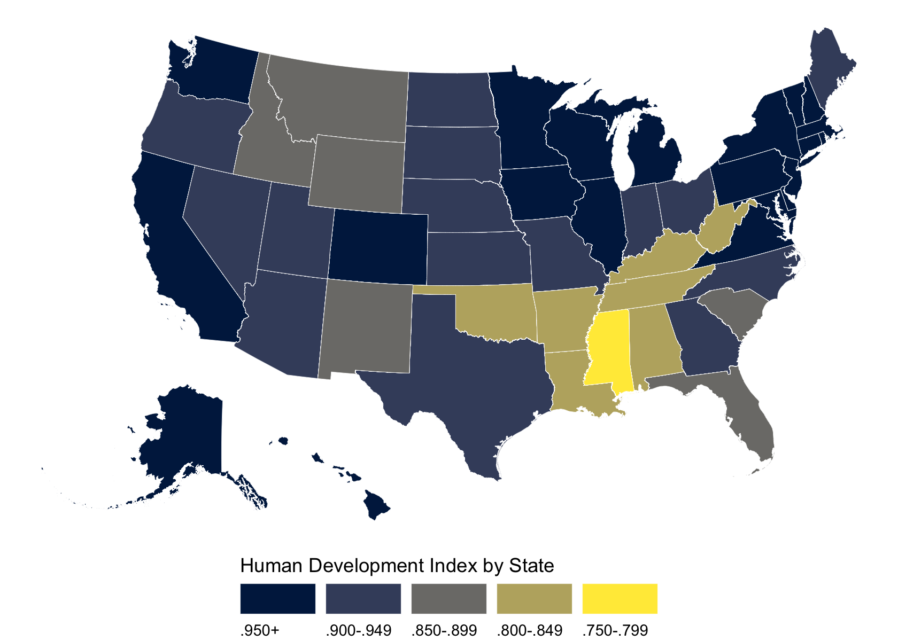

Chapter 2: Data and measurement
================
A Solomon Kurz
2020-12-21

# Data and measurement

> In this book, we’ll be fitting lines (and some curves) to data, making
> comparisons and predictions and assessing our uncertainties in the
> resulting inferences. We’ll discuss the assumptions underlying
> regression models, methods for checking these assumptions, and
> directions for improving fitted models. We’ll discuss the challenges
> of extrapolating from available data to make causal inferences and
> predictions for new data, and we’ll use computer simulations to
> summarize the uncertainties in our estimates and predictions.
> 
> Before fitting a model, though, it is a good idea to understand where
> your numbers are coming from. (p. 21)

## 2.1 Examining where data come from

Load the `hdi.dat` and `votes.dta` data files.

``` r
library(tidyverse)

# hdi <- read_table2("ROS-Examples-master/HDI/data/hdi.dat", col_names = T)
hdi <- read.table("ROS-Examples-master/HDI/data/hdi.dat", header = T)
# votes <- haven::read_dta("ROS-Examples-master/HDI/data/state vote and income, 68-00.dta")
votes <- foreign::read.dta("ROS-Examples-master/HDI/data/state vote and income, 68-00.dta")

glimpse(hdi)
```

    ## Rows: 51
    ## Columns: 4
    ## $ rank        <int> 1, 2, 3, 4, 5, 6, 7, 8, 9, 10, 11, 12, 13, 14, 15, 16, 17…
    ## $ state       <chr> "Connecticut", "Massachusetts", "New Jersey", "Washington…
    ## $ hdi         <dbl> 0.962, 0.961, 0.961, 0.960, 0.960, 0.959, 0.959, 0.958, 0…
    ## $ canada.dist <int> 2, 2, 2, 4, 3, 2, 1, 1, 1, 3, 3, 3, 4, 3, 1, 1, 1, 4, 2, …

``` r
glimpse(votes)
```

    ## Rows: 450
    ## Columns: 11
    ## $ st_fips     <int> 1, 2, 4, 5, 6, 8, 9, 10, 12, 13, 15, 16, 17, 18, 19, 20, …
    ## $ st_year     <int> 1968, 1968, 1968, 1968, 1968, 1968, 1968, 1968, 1968, 196…
    ## $ st_state    <chr> "Alabama", "Alaska", "Arizona", "Arkansas", "California",…
    ## $ st_stateabb <chr> "AL", "AK", "AZ", "AR", "CA", "CO", "CT", "DE", "FL", "GA…
    ## $ st_total    <int> 1050, 83, 487, 610, 7252, 811, 1256, 214, 2188, 1250, 236…
    ## $ st_dem      <int> 197, 35, 171, 185, 3244, 335, 622, 89, 677, 334, 141, 89,…
    ## $ st_rep      <int> 147, 38, 267, 189, 3468, 409, 557, 97, 887, 380, 91, 165,…
    ## $ st_repshare <dbl> 0.4273256, 0.5205479, 0.6095890, 0.5053476, 0.5166866, 0.…
    ## $ st_demshare <dbl> 0.5726744, 0.4794520, 0.3904110, 0.4946524, 0.4833135, 0.…
    ## $ st_income   <dbl> 11662.76, 20388.45, 14864.88, 11124.08, 19362.40, 15724.2…
    ## $ st_inc10k   <dbl> 1.166276, 2.038845, 1.486488, 1.112408, 1.936240, 1.57242…

The two data sets can be joined by State, but only `hdi` contains a row
for `Washington, D.C.`.

``` r
anti_join(
  hdi %>% distinct(state),
  votes %>% distinct(st_state) %>% rename(state = st_state),
  by = "state"
)
```

    ##              state
    ## 1 Washington, D.C.

Before we plot, let’s set our default theme settings.

``` r
theme_set(theme_linedraw() +
            theme(panel.grid = element_blank()))
```

For Figure 2.1, we’ll need help from the **urbnmapr** package.

``` r
library(urbnmapr)

left_join(
  get_urbn_map(map = "states", sf = TRUE),
  left_join(hdi,
            votes %>% mutate(state = st_state),
            by = "state") %>% 
    mutate(state_name = ifelse(state == "Washington, D.C.", "District of Columbia", state)),
  by = "state_name"
  ) %>% 
  # discretize the HDI variable
  mutate(hdi = case_when(
    hdi >= .95 ~ ".950+",
    hdi >= .90 ~ ".900-.949",
    hdi >= .85 ~ ".850-.899",
    hdi >= .80 ~ ".800-.849",
    hdi >= .75 ~ ".750-.799"
  )) %>%
  # now make hdi a factor
  mutate(hdi = factor(hdi,
                      levels = c(".950+", ".900-.949", ".850-.899", ".800-.849", ".750-.799"))) %>% 
  
  # plot!
  ggplot() +
  geom_sf(aes(fill = hdi, geometry = geometry),
          size = .1, color = "white") +
  scale_fill_viridis_d("Human Development Index by State",
                       option = "E",
                       guide = guide_legend(
                         direction = "horizontal",
                         keywidth = unit(1.5, "cm"),
                         label.hjust = 0,
                         label.position = "bottom",
                         title.position = "top")
                       ) + 
  theme_void() +
  theme(legend.position = "bottom")
```



Figure 2.2 shows the HDI is largely a function of state income.

``` r
# left
p1 <-
  left_join(hdi,
            votes %>% mutate(state = st_state),
            by = "state") %>% 
  filter(st_year == 2000) %>% 
  
  ggplot(aes(x = st_income, y = hdi, label = st_stateabb)) +
  geom_text() +
  labs(x = "Average state income in 2000", 
       y = "Human Development Index")

# right
p2 <-
  left_join(hdi,
            votes %>% mutate(state = st_state),
            by = "state") %>% 
  filter(st_year == 2000) %>% 
  mutate(income_rank = min_rank(st_income),
         hdi_rank = min_rank(hdi)) %>% 
  
  ggplot(aes(x = income_rank, y = hdi_rank, label = st_stateabb)) +
  geom_text() +
  labs(x = "Rank of average state income in 2000", 
       y = "Rank of Human Development Index")

# combine
library(patchwork)

p1 + p2
```


### 2.1.1 Details of measurement can be important.

Load the `pew_research_center_june_elect_wknd_data.dta` data.

``` r
# pew_pre <- haven::read_dta("ROS-Examples-master/Pew/data/pew_research_center_june_elect_wknd_data.dta")
pew_pre <- foreign::read.dta("ROS-Examples-master/Pew/data/pew_research_center_june_elect_wknd_data.dta")

glimpse(pew_pre)
```

    ## Rows: 31,201
    ## Columns: 70
    ## $ survey      <fct> june08voter, aug08relig, aug08relig, aug08relig, june08vo…
    ## $ rid         <int> 1720, 668, 50, 50533, 30091, 60, 20956, 749, 785, 1979, 1…
    ## $ date        <int> 62708, 80208, 73108, 80208, 62108, 72708, 62608, 80208, 6…
    ## $ sample      <fct> landline, landline, landline, cell, 18-29 oversample (lan…
    ## $ phoneuse    <fct> "dual-all or almost all calls on home phone", "dual-all o…
    ## $ zipcode     <chr> "01007", "01010", "01013", "01013", "01020", "01020", "01…
    ## $ msa         <int> 44140, 44140, 44140, 44140, 44140, 44140, 44140, 44140, 4…
    ## $ usr         <chr> "S", "2", "2", "", "S", "S", "U", "2", "S", "S", "2", "",…
    ## $ form        <fct> form 2, form 1, form 1, form 2, form 1, form 2, form 2, f…
    ## $ thoughtpres <fct> NA, NA, NA, NA, NA, NA, NA, NA, NA, NA, NA, NA, NA, NA, N…
    ## $ regist      <fct> registered, registered, registered, registered, registere…
    ## $ regicert    <fct> absolutely certain, absolutely certain, absolutely certai…
    ## $ party       <fct> democrat, republican, independent, independent, democrat,…
    ## $ partyln     <fct> NA, NA, lean democrat, other/dk, NA, NA, lean democrat, N…
    ## $ sex         <fct> male, female, male, male, female, female, male, male, mal…
    ## $ age         <int> 58, 35, 59, 32, 23, 55, 40, 59, 60, 41, 54, 27, 56, 64, 5…
    ## $ educ        <fct> post-graduate, college graduate, some college, some colle…
    ## $ hisp        <fct> no, no, no, yes, no, no, no, no, no, no, no, no, no, yes,…
    ## $ race        <int> 1, 1, 1, 9, 3, 1, 1, 1, 1, 1, 1, 3, 1, 1, 1, 1, 1, 1, 1, …
    ## $ marital     <fct> divorced, married, married, living with a partner, never …
    ## $ parent      <fct> NA, NA, NA, NA, NA, NA, NA, NA, NA, NA, NA, NA, NA, NA, N…
    ## $ relig       <fct> roman catholic, no religion/atheist, roman catholic, prot…
    ## $ relig2      <fct> roman catholic, nothing in particular, roman catholic, ch…
    ## $ born        <int> 2, NA, 2, 2, NA, 2, 2, 2, 2, NA, 2, NA, 2, 1, 2, 1, 2, 2,…
    ## $ attend      <fct> a few times a year, never, once a week, once or twice a m…
    ## $ income      <fct> "$50,000-$74,999", "$100,000-$149,999", "dk/refused", "$3…
    ## $ ownrent     <fct> own, NA, NA, NA, rent, own, rent, NA, rent, own, NA, NA, …
    ## $ ideo        <fct> liberal, moderate, conservative, liberal, moderate, moder…
    ## $ employ      <fct> NA, NA, NA, NA, NA, full-time, NA, NA, NA, full-time, NA,…
    ## $ labor       <fct> NA, NA, NA, NA, NA, NA, NA, NA, NA, NA, NA, NA, NA, NA, N…
    ## $ weight      <dbl> 1.326923, 0.822000, 0.493000, 0.492000, 2.000000, 1.80000…
    ## $ density     <int> 2, 3, 3, 3, 3, 3, 3, 3, 2, 2, 2, 3, 3, 3, 3, 3, 3, 3, 3, …
    ## $ attempt     <int> 9, NA, NA, NA, 3, 7, 7, NA, 1, 8, NA, NA, 9, 1, 1, 5, NA,…
    ## $ fcall       <int> 80624, NA, NA, NA, 80621, 80723, 80621, NA, 80622, 80725,…
    ## $ thought     <fct> quite a lot, quite a lot, quite a lot, quite a lot, quite…
    ## $ heat2a      <fct> dem, dk, dem, dem, dem, rep, dem, rep, dem, dem, rep, NA,…
    ## $ heat2b      <fct> NA, dk, NA, NA, NA, NA, NA, NA, NA, NA, NA, NA, NA, NA, r…
    ## $ intsex      <fct> female, NA, NA, NA, male, female, female, NA, female, fem…
    ## $ intrace     <int> 2, NA, NA, NA, 1, 1, 1, NA, 1, 2, NA, NA, 2, 1, NA, 2, NA…
    ## $ area        <int> 413, NA, NA, NA, 413, 413, 413, NA, 413, 413, NA, NA, 413…
    ## $ niicamp     <fct> very closely, NA, NA, NA, very closely, NA, not at all cl…
    ## $ heat2c      <fct> strongly, NA, only moderately, strongly, strongly, only m…
    ## $ chancer     <fct> decided not to vote for republican, dk/refused, chance mi…
    ## $ chanced     <fct> NA, dk/refused, NA, NA, NA, chance might vote for democra…
    ## $ planto1     <fct> yes, yes, yes, yes, yes, yes, yes, yes, yes, yes, yes, NA…
    ## $ planto2     <fct> absolutely certain, NA, NA, NA, absolutely certain, NA, a…
    ## $ cheata      <fct> democrat, NA, NA, NA, democrat, NA, democrat, NA, democra…
    ## $ cheatb      <int> NA, NA, NA, NA, NA, NA, NA, NA, NA, NA, NA, NA, NA, NA, N…
    ## $ precinct    <fct> NA, yes, yes, yes, NA, yes, NA, yes, NA, yes, yes, NA, NA…
    ## $ oftvote     <fct> NA, nearly always, always, always, NA, always, NA, always…
    ## $ scale10     <int> NA, 10, 10, 10, NA, 10, NA, 10, NA, 10, 10, NA, NA, NA, 1…
    ## $ pvote08     <fct> NA, NA, NA, NA, NA, NA, NA, NA, NA, NA, NA, NA, NA, NA, N…
    ## $ inthisp     <fct> NA, NA, NA, NA, NA, NA, NA, NA, NA, NA, NA, NA, NA, no, n…
    ## $ where       <fct> NA, NA, NA, NA, NA, NA, NA, NA, NA, NA, NA, NA, NA, NA, N…
    ## $ heat4       <fct> NA, NA, NA, NA, NA, NA, NA, NA, NA, NA, NA, NA, NA, NA, N…
    ## $ pvote04     <int> NA, NA, NA, NA, NA, NA, NA, NA, NA, NA, NA, NA, NA, NA, N…
    ## $ heat4a      <fct> NA, NA, NA, NA, NA, NA, NA, NA, NA, NA, NA, NA, NA, NA, N…
    ## $ heat4b      <fct> NA, NA, NA, NA, NA, NA, NA, NA, NA, NA, NA, NA, NA, NA, N…
    ## $ heat4c      <fct> NA, NA, NA, NA, NA, NA, NA, NA, NA, NA, NA, NA, NA, NA, N…
    ## $ fips        <int> 15, 13, 13, 13, 13, 13, 15, 13, 13, 15, 15, 15, 15, 13, 1…
    ## $ state       <fct> massachusetts, massachusetts, massachusetts, massachusett…
    ## $ cregion     <fct> east, east, east, east, east, east, east, east, east, eas…
    ## $ partysum    <fct> democrat/lean democrat, republican/lean republican, democ…
    ## $ relign      <int> 5, 10, 5, 4, 9, 5, 5, 5, 5, 10, 2, 9, 5, 6, 2, 5, 5, 5, 2…
    ## $ heat2       <fct> dem/lean dem, other-dk, dem/lean dem, dem/lean dem, dem/l…
    ## $ cheat       <fct> dem/lean dem, NA, NA, NA, dem/lean dem, NA, dem/lean dem,…
    ## $ age2        <fct> 50-64, 30-49, 50-64, 30-49, 18-29, 50-64, 30-49, 50-64, 5…
    ## $ educ2       <fct> college graduate, college graduate, some college, some co…
    ## $ income2     <fct> "$50,000 to $74,999", "$75,000+", NA, "$30,000 to $49,999…
    ## $ party4      <fct> democrat, republican, independent, independent, democrat,…

The panels in Figure 2.3 take a bit of pre-plotting wrangling. Here’s
the code for Figure 2.3.a.

``` r
# wrangle and save
d <-
  pew_pre %>% 
  drop_na(ideo, income) %>% 
  filter(ideo != "dk/refused") %>% 
  filter(income != "dk/refused") %>% 
  group_by(income) %>% 
  count(ideo) %>% 
  mutate(percent = 100 * n / sum(n)) %>% 
  mutate(income = case_when(
    income == "less than $10,000" ~ 1,
    income == "$10,000-$19,999" ~ 2,
    income == "$20,000-$29,999" ~ 3,
    income == "$30,000-$39,999" ~ 4,
    income == "$40,000-$49,000" ~ 5,
    income == "$50,000-$74,999" ~ 6,
    income == "$75,000-$99,999" ~ 7,
    income == "$100,000-$149,999" ~ 8,
    income == "$150,000+" ~ 9
  )) 

p1 <-
  d %>% 
  ggplot(aes(x = income, y = percent)) +
  geom_area(aes(fill = ideo)) +
  # we need further wrangling to make the label coordinates
  geom_text(data = d %>% 
              filter(income == 5) %>% 
              arrange(desc(ideo)) %>% 
              mutate(percent = cumsum(percent) - percent / 2),
            aes(label = ideo, color = percent < 30),
            size = 3) +
  scale_fill_viridis_d(direction = -1, breaks = NULL) +
  scale_color_manual(values = c("black", "white"), breaks = NULL) +
  scale_x_continuous(NULL, breaks = 1:9,
                     labels = c("", "Low income", "", "", "Middle income", "", "", "High income", ""),
                     expand = c(0, 0)) +
  scale_y_continuous(NULL, breaks = 0:2 * 50, labels = function(x) str_c(x, "%"),
                     expand = c(0, 0)) +
  labs(subtitle = "Self−declared political ideology, by income")
```

Now make Figure 2.3.b.

``` r
# wrangle and save
d <-
  pew_pre %>% 
  drop_na(party) %>% 
  mutate(pid = case_when(
    party == "republican" ~ "Republican",
    party == "democrat" ~ "Democrat",
    partyln == "lean republican" ~ "Lean Rep.",
    partyln == "lean democrat" ~ "Lean Dem.",
    # party == "independent" ~ "Independent"
    TRUE ~ "Independent"
  ),
  income = case_when(
    income == "less than $10,000" ~ 1,
    income == "$10,000-$19,999" ~ 2,
    income == "$20,000-$29,999" ~ 3,
    income == "$30,000-$39,999" ~ 4,
    income == "$40,000-$49,000" ~ 5,
    income == "$50,000-$74,999" ~ 6,
    income == "$75,000-$99,999" ~ 7,
    income == "$100,000-$149,999" ~ 8,
    income == "$150,000+" ~ 9
  )) %>% 
  mutate(party = factor(pid,
                        levels = c("Republican", "Lean Rep.", "Independent", "Lean Dem.", "Democrat"))) %>% 
  drop_na(income) %>% 
  group_by(income) %>% 
  count(party) %>% 
  mutate(percent = 100 * n / sum(n))
 
p2 <-
  d %>% 
  ggplot(aes(x = income, y = percent)) +
  geom_area(aes(fill = party)) +
  # we need further wrangling to make the label coordinates
  geom_text(data = d %>%
              filter(income == 5) %>%
              arrange(desc(party)) %>%
              mutate(percent = cumsum(percent) - percent / 2),
            aes(label = party, color = percent < 50),
            size = 3) +
  scale_fill_viridis_d(direction = -1, breaks = NULL) +
  scale_color_manual(values = c("black", "white"), breaks = NULL) +
  scale_x_continuous(NULL, breaks = 1:9,
                     labels = c("", "Low income", "", "", "Middle income", "", "", "High income", ""),
                     expand = c(0, 0)) +
  scale_y_continuous(NULL, breaks = 0:2 * 50, labels = function(x) str_c(x, "%"),
                     expand = c(0, 0)) +
  labs(subtitle = "Self−declared party identification, by income")
```

Combine the two panels and finally make Figure 2.3.

``` r
p1 + p2
```


If you look closely, you’ll see our plot on the right is a little
different than the one in the text. The difference seems to be in how we
partitioned off the `"Independent"` and `"Lean Dem."` categories. For
closer look, compare our code with Vehtari’s code at
<https://github.com/avehtari/ROS-Examples/blob/master/Pew/pew.Rmd>.

## 2.2 Validity and reliability

### 2.2.1 Validity.

“We can define the *validity* of a measuring process as the property of
giving the right answer on average across a wide range of plausible
scenarios” (pp. 24–25, *emphasis* in the original).

### 2.2.2 Reliability.

“A *reliable* measure is one that is precise and stable” (p. 25,
*emphasis* in the original).

### 2.2.3 Sample selection.

This stems from “the idea that the data you see can be a
nonrepresentative sample of a larger population that you will not see”
(p. 25).

## 2.3 All graphs are comparisons

“We can learn a lot by looking at data with an open mind. We present
three quick examples here” (p. 25).

### 2.3.1 Simple scatterplots.

Load the `healthdata.txt`.

``` r
# health <- read_table2("ROS-Examples-master/HealthExpenditure/data/healthdata.txt")
health <- read.table("ROS-Examples-master/HealthExpenditure/data/healthdata.txt", header = T)

glimpse(health)
```

    ## Rows: 30
    ## Columns: 3
    ## $ country  <chr> "Australia", "Austria", "Belgium", "Canada", "Czech", "Denma…
    ## $ spending <int> 3357, 3763, 3595, 3895, 1626, 3512, 2840, 3601, 3588, 2727, …
    ## $ lifespan <dbl> 81.4, 80.1, 79.8, 80.7, 77.0, 78.4, 79.5, 81.0, 80.0, 79.5, …

Here’s how to make Figure 2.4.

``` r
remove <-  c("Netherlands", "Belgium", "Germany", "Ireland", "Iceland", "Greece", "Italy", "Sweden", "Finland")


health %>%
  filter(!country %in% remove) %>% 
  
  ggplot(aes(x = spending, y = lifespan, label = country)) +
  geom_text(size = 3) +
  scale_x_continuous("Health care spending (PPP US$)",
                     expand = expansion(mult = c(0, 0.05)), limits = c(0, NA)) +
  scale_y_continuous("Life expectancy (years)", breaks = 0:4 * 2 + 74)
```


### 2.3.2 Displaying more information on a graph.

It’s not immediately clear which data they used to make Figure 2.5. Keep
an eye out.

### 2.3.3 Multiple plots.

“We can learn by putting multiple related graphs in a single display”
(p. 27). For this section, we need to load the `SSA-longtail-names.csv`
data.

``` r
allnames <- 
  read_csv("ROS-Examples-master/Names/data/SSA-longtail-names.csv") %>% 
  mutate(sex = case_when(sex == FALSE ~ "F", 
                         is.na(sex) ~ "M"))
```

Make Figure 2.6.

``` r
allnames %>% 
  filter(sex == "M") %>% 
  mutate(last = str_sub(name, -1)) %>% 
  group_by(last) %>% 
  summarise(sum = sum(`1906`)) %>% 
  ungroup() %>% 
  mutate(percent = 100 * sum / sum(sum)) %>% 
  
  ggplot(aes(x = last)) +
  geom_col(aes(y = percent)) +
  geom_text(aes(y = percent + 0.4, label = round(percent, digits = 1)),
            size = 2) +
  scale_y_continuous("Percentage of boys born", breaks = 0:1 * 10, 
                     expand = expansion(mult = c(0, 0.05))) +
  labs(subtitle = "Last letter of boys' names in 1906",
       x = NULL) +
  theme(axis.ticks.x = element_blank())
```


Here were the top ten most common boys’ names in 1906.

``` r
allnames %>% 
  filter(sex == "M") %>% 
  arrange(desc(`1906`)) %>% 
  rename(count = `1906`) %>% 
  select(name, count) %>% 
  slice(1:10)
```

    ## # A tibble: 10 x 2
    ##    name    count
    ##    <chr>   <dbl>
    ##  1 John     8263
    ##  2 William  6567
    ##  3 James    5908
    ##  4 George   4201
    ##  5 Robert   3636
    ##  6 Charles  3607
    ##  7 Joseph   3527
    ##  8 Frank    2798
    ##  9 Edward   2398
    ## 10 Thomas   2177

Now make Figure 2.7.

``` r
# 1956
p1 <-
  allnames %>% 
  filter(sex == "M") %>% 
  mutate(last = str_sub(name, -1)) %>% 
  group_by(last) %>% 
  summarise(sum = sum(`1956`)) %>% 
  ungroup() %>% 
  mutate(percent = 100 * sum / sum(sum)) %>% 
  
  ggplot(aes(x = last)) +
  geom_col(aes(y = percent)) +
  scale_y_continuous("Percentage of boys born", breaks = 0:1 * 10, 
                     expand = expansion(mult = c(0, 0.05))) +
  labs(subtitle = "Last letter of boys' names in 1956",
       x = NULL) +
  theme(axis.ticks.x = element_blank())

# 2006
p2 <-
  allnames %>% 
  filter(sex == "M") %>% 
  mutate(last = str_sub(name, -1)) %>% 
  group_by(last) %>% 
  summarise(sum = sum(`2006`)) %>% 
  ungroup() %>% 
  mutate(percent = 100 * sum / sum(sum)) %>% 
  
  ggplot(aes(x = last)) +
  geom_col(aes(y = percent)) +
  scale_y_continuous("Percentage of boys born", expand = expansion(mult = c(0, 0.05))) +
  labs(subtitle = "Last letter of boys' names in 2006",
       x = NULL) +
  theme(axis.ticks.x = element_blank())

# combine
p1 + p2
```


Here were the top ten most common boys’ names ending in “n” in 2006.

``` r
allnames %>% 
  filter(sex == "M") %>% 
  mutate(last  = str_sub(name, -1),
         count = `2006`) %>% 
  filter(last == "n") %>% 
  arrange(desc(count)) %>% 
  select(name, count) %>% 
  slice(1:10)
```

    ## # A tibble: 10 x 2
    ##    name      count
    ##    <chr>     <dbl>
    ##  1 Ethan     20485
    ##  2 Ryan      16411
    ##  3 John      15140
    ##  4 Logan     15128
    ##  5 Christian 14451
    ##  6 Jonathan  14348
    ##  7 Nathan    14258
    ##  8 Benjamin  13736
    ##  9 Dylan     13148
    ## 10 Brandon   12652

Figure 2.8.

``` r
allnames %>% 
  filter(sex == "M") %>% 
  select(-X1, -sex) %>% 
  # select(name:`1950`) %>% 
  pivot_longer(-name,
               # `1880`:`1900`,
               names_to = "year",
               values_to = "count") %>% 
  mutate(last = str_sub(name, -1)) %>% 
  group_by(last, year) %>% 
  summarise(n = sum(count)) %>% 
  ungroup() %>%
  group_by(year) %>%
  mutate(percent = 100 * n / sum(n),
         year    = as.double(year),
         last    = toupper(last),
         size    = ifelse(last %in% c("D", "N", "Y"), "a", "b"),
         type    = case_when(
           last == "D" ~ "4",
           last == "N" ~ "1",
           last == "Y" ~ "2",
           TRUE ~ "1"
         )) %>% 
  
  ggplot(aes(x = year, y = percent, group = last)) +
  geom_line(aes(size = size, color = size, linetype = type)) +
  annotate(geom = "text",
           x = c(1938, 2001, 1977),
           y = c(19, 35, 14.5),
           label = c("D", "N", "Y")) +
  scale_color_manual(values = c("black", "grey50")) +
  scale_size_manual(values = c(0.6, 0.2)) +
  scale_x_continuous(expand = c(0, 0), breaks = 0:2 * 50 + 1900) +
  scale_y_continuous(expand = expansion(mult = c(0, 0.05)), limits = c(0, 40),
                     breaks = 0:2 * 20, labels = function(x) str_c(x, "%")) +
  labs(subtitle = "Last letters of boys' names",
       x = NULL,
       y = "Percentage of all boys' names that year") +
  theme(legend.position = "none")
```


Now make Figure 2.9

``` r
# reshape
allnames %>% 
  select(-X1) %>% 
  pivot_longer(-c(name, sex),
               names_to = "year",
               values_to = "count") %>% 
  mutate(year = as.double(year)) %>% 
  # rank by sex and year
  group_by(year, sex) %>%
  mutate(rank = desc(count) %>% row_number()) %>% 
  # isolate the counts for the top 10 in each, making the other counts zeros
  mutate(count_top_10 = ifelse(rank <= 10, count, 0)) %>% 
  # compute the percentages
  summarise(percent = 100 * sum(count_top_10) / sum(count)) %>% 
  
  # plot!
  ggplot(aes(x = year, y = percent, group = sex)) +
  geom_line(size = 1/3) +
  annotate(geom = "text",
           x = c(1906, 1930),
           y = c(36, 20),
           label = c("Boys", "Girls")) +
  scale_x_continuous(expand = c(0, 0), breaks = 0:2 * 50 + 1900) +
  scale_y_continuous(expand = expansion(mult = c(0, 0.05)), limits = c(0, 45),
                     breaks = 0:2 * 20, labels = function(x) str_c(x, "%")) +
  labs(subtitle = "Total popularity of top 10 names each year, by sex",
       x = "Year",
       y = NULL) +
  theme(legend.position = "none")
```


Here we ranked the names using the `dplyr::row_number()` function. For a
very similar but slightly different result, try ranking using
`dplyr::min_rank()`. The two functions differ in how they deal with
ties.

### 2.3.4 Grids of plots.

> A scatterplot displays two continuous variables, say \(y\)
> vs. \(x_1\). Coloring the dots enables us to plot a third variable,
> \(x_2\), with some small number of discrete levels. Realistically it
> can be difficult to read a plot with more than two colors. We can then
> include two more discrete variables by constructing a two-way grid of
> plots representing discrete variables \(x_3\) and \(x_4\). This
> approach of *small multiples* can be more effective than trying to
> cram five variables onto a single plot. (p. 28, *emphasis* in the
> original)

To make Figure 2.10, we’ll need the data in the
`ROS-Examples-master/Congress/data` folder. Rather than living in a
single file, the data are divided up by year in a series of `.asc`
files. Here we’ll follow some of the essence of Vehtari’s code from
<https://avehtari.github.io/ROS-Examples/Congress/congress_plots.html>
and load the data files into a list.

``` r
congress <-
  list.files(path = "ROS-Examples-master/Congress/data", full.names = TRUE)[1:49] %>% 
  map(read.table)

# not shown
# str(congress)
```

The 49 data files now live in a list called `congress`. Here we’ll write
a custom `make_data()` function which will pull and arrange the
necessary data for the figure.

``` r
make_data <- function(i) {

  cong1 <- congress[[i]]
  cong2 <- congress[[i + 1]]
      
  d <-
    tibble(state_code = cong1[, 1]) %>% 
    mutate(region  = floor(state_code / 20) + 1,
           inc     = cong1[, 3],
           dvote1  = cong1[, 4] / (cong1[, 4] + cong1[, 5]),
           dvote2  = cong2[, 4] / (cong2[, 4] + cong2[, 5])) %>% 
    mutate(contested = (abs(dvote1 - 0.5)) < 0.3 & (abs(dvote2 - 0.5) < 0.3))
  
  return(d)
  
}
```

Our custom `make_data()` function works like this.

``` r
make_data(27)
```

    ## # A tibble: 442 x 6
    ##    state_code region   inc dvote1 dvote2 contested
    ##         <int>  <dbl> <int>  <dbl>  <dbl> <lgl>    
    ##  1          1      1    -1  0.553  0.582 TRUE     
    ##  2          1      1    -1  0.516  0.492 TRUE     
    ##  3          1      1    -1  0.503  0.521 TRUE     
    ##  4          1      1    -1  0.440  0.442 TRUE     
    ##  5          1      1    -1  0.481  0.463 TRUE     
    ##  6          1      1    -1  0.498  0.496 TRUE     
    ##  7          2      1    -1  0.375  0.460 TRUE     
    ##  8          2      1     0  0.328  0.423 TRUE     
    ##  9          2      1    -1  0.291  0.371 TRUE     
    ## 10          3      1    -1  0.428  0.311 TRUE     
    ## # … with 432 more rows

Now we can finally make Figure 2.10.

``` r
# define the target years
tibble(i = c(27, 37, 47)) %>% 
  mutate(year = 1896 + 2 * (i - 1)) %>% 
  # extract the relevant data
  mutate(d = map(i, make_data)) %>% 
  unnest(d) %>% 
  # filter
  filter(contested == T) %>% 
  filter(abs(inc) %in% 0:1) %>%
  # wrangle
  mutate(label = str_c(year, "\nto\n", year + 2)) %>% 
  mutate(region = factor(region,
                         levels = 1:4,
                         labels = c("Northeast", "Midwest", "South", "West"))) %>% 
  mutate(inc = abs(inc) %>% as.character()) %>% 
  # filter one last time
  filter(!is.na(region)) %>% 
  
  # plot!
  ggplot(aes(x = dvote1, y = dvote2 - dvote1)) +
  geom_hline(yintercept = 0, size = 1/4) +
  geom_point(aes(color = inc),
             size = 1/4) +
  scale_color_manual(values = c("black", "grey60"), breaks = NULL) +
  scale_x_continuous(breaks = c(.25, .5, .75), labels = c("25%", "50%", "75%")) +
  scale_y_continuous(breaks = c(-0.25, 0, 0.25), labels = c("-25%", "0", "25%"), limits = c(-.33, .33)) +
  labs(title = "Swings in U.S. congressional elections in three different periods.",
       subtitle = "Gray dots are for incumbents running for reelection, black are for open seats.",
       x = "Dem. vote in election 1",
       y = "Vote swing") +
  theme(strip.text.y = element_text(angle = 0)) +
  facet_grid(label~region)
```


### 2.3.5 Applying graphical principles to numerical displays and communication more generally.

“When reporting data and analysis, you should always imagine yourself in
the position of the reader of the report. Avoid overwhelming the reader
with irrelevant material” (p. 29).

If you would like to prevent **R** from providing too many significant
digits, you can always use the `digits` argument within the `options()`
function. For example, if you wanted to change the default settings to
two significant digits, you might execute `options(digits = 2)`. As we
will see, several of the convenience functions within the **brms**
package have their own `digits` argument, which works the same way for
local output.

> Never display a graph you can’t talk about. Give a full caption for
> every graph, as we try to do in this book. This explains, to yourself
> and others, what you are trying to show and what you have learned from
> each plot. Avoid displaying graphs that have been made simply because
> they are conventional. (p. 30)

### 2.3.6 Graphics for understanding statistical models.

The authors suggest we can summarize the kinds of graphs we’ll be making
in this text as falling into three kinds:

  - displays of raw data;
  - plots of fitted models and inferences; and
  - plots presenting the final results, used as communication tools.

### 2.3.7 Graphs as comparisons.

> All graphical displays can be considered as comparisons. When making a
> graph, line things up so that the most important comparisons are
> clearest. Comparisons are clearest when scales are lined up. (p. 31)

### 2.3.8 Graphs of fitted models.

“It can be helpful to graph a fitted model and data on the same plot”
(p. 31).

## 2.4 Data and adjustment: trends in mortality rates

“Even when there are no questions of data quality or modeling, it can
make sense to adjust measurements to answer real-world questions”
(p. 31). To see why, load the
`white_nonhisp_death_rates_from_1999_to_2013_by_sex.txt` data.

``` r
death <- read_table2("ROS-Examples-master/AgePeriodCohort/data/white_nonhisp_death_rates_from_1999_to_2013_by_sex.txt")

glimpse(death)
```

    ## Rows: 900
    ## Columns: 6
    ## $ Age        <dbl> 35, 35, 35, 35, 35, 35, 35, 35, 35, 35, 35, 35, 35, 35, 35…
    ## $ Male       <dbl> 0, 0, 0, 0, 0, 0, 0, 0, 0, 0, 0, 0, 0, 0, 0, 1, 1, 1, 1, 1…
    ## $ Year       <dbl> 1999, 2000, 2001, 2002, 2003, 2004, 2005, 2006, 2007, 2008…
    ## $ Deaths     <dbl> 1291, 1264, 1186, 1194, 1166, 1166, 1201, 1197, 1147, 1098…
    ## $ Population <dbl> 1578829, 1528463, 1377466, 1333639, 1302188, 1325435, 1383…
    ## $ Rate       <dbl> 81.8, 82.7, 86.1, 89.5, 89.5, 88.0, 86.8, 88.7, 92.5, 95.1…

Make Figure 2.11a

``` r
p1 <-
  death %>% 
  filter(Age >= 45 & Age <= 54) %>% 
  group_by(Year) %>% 
  summarise(Deaths     = sum(Deaths),
            Population = sum(Population)) %>% 
  mutate(dr = Deaths / Population) %>% 
  
  ggplot(aes(x = Year, y = dr)) +
  geom_line() +
  scale_x_continuous(expand = c(0, 0)) +
  labs(subtitle = "Raw death rates\nfor 45−54−year−old non−Hisp whites",
       x = NULL,
       y = "Death rate among non−Hisp whites 45−54") +
  theme(axis.text = element_text(size = 9),
        axis.title = element_text(size = 9))

p1
```


Figure 2.11b.

``` r
p2 <-
  death %>% 
  filter(Age >= 45 & Age <= 54) %>% 
  group_by(Year) %>% 
  summarise(mu_age = sum(Age * Population) / sum(Population)) %>% 
  
  ggplot(aes(x = Year, y = mu_age)) +
  geom_line() +
  scale_x_continuous(expand = c(0, 0)) +
  labs(subtitle = "But the average age in this group is going up!",
       x = NULL,
       y = "Avg age among non−Hisp whites 45−54") +
  theme(axis.text = element_text(size = 9),
        axis.title = element_text(size = 9))

p2
```


> Suppose for the moment that mortality rates did not change for
> individuals in this age group from 1999 to 2013. In this case, we
> could calculate the change in the group mortality rate due solely to
> the change in the underlying age of the population. We do this by
> taking the 2013 mortality rates for each age and computing a weighted
> average rate each year using the number of individuals in each age
> group. (p. 32)

We need a little preparatory work before making Figure 2.11c. Here we
compute and save the death rates for 2013.

``` r
 rate_2013 <-
  death %>% 
  # select our focal `Age` groups
  filter(Age >= 45 & Age <= 54) %>% 
  # use only 2013, which will define our standard population
  filter(Year == 2013) %>% 
  # collapse across `Male`
  group_by(Age) %>% 
  summarise(rate_2013 = sum(Deaths) / sum(Population)) %>% 
  ungroup()

rate_2013
```

    ## # A tibble: 10 x 2
    ##      Age rate_2013
    ##    <dbl>     <dbl>
    ##  1    45   0.00261
    ##  2    46   0.00290
    ##  3    47   0.00324
    ##  4    48   0.00343
    ##  5    49   0.00385
    ##  6    50   0.00422
    ##  7    51   0.00466
    ##  8    52   0.00494
    ##  9    53   0.00527
    ## 10    54   0.00573

Now we make Figure 2.11.c by combining the crude death rate and the
adjusted rate, which is based on what it would look like if the
age-specific mortality rates had been at the 2013 level for all the
years.

``` r
p3 <-
  left_join(
    # crude_rate
    death %>% 
      filter(Age >= 45 & Age <= 54) %>% 
      group_by(Year) %>% 
      summarise(crude_rate = sum(Deaths) / sum(Population)) ,
    
    # adjusted_rate
    death %>% 
      # select our focal `Age` groups
      filter(Age >= 45 & Age <= 54) %>% 
      # collapse across `Male`
      group_by(Year, Age) %>% 
      summarise(Deaths = sum(Deaths),
                Population = sum(Population)) %>% 
      group_by(Year) %>% 
      mutate(proportion = Population / sum(Population)) %>% 
      left_join(rate_2013, by = "Age") %>% 
      summarise(adjusted_rate = sum(proportion * rate_2013)),
  ) %>% 
  
  # make the plot
  ggplot(aes(x = Year)) +
  geom_line(aes(y = crude_rate),
            color = "grey50", size = 1/3) +
  geom_line(aes(y = adjusted_rate)) +
  annotate(geom = "text",
           x = c(2000.5, 1999.33), y = c(.0039, .00409),
           label = c("Raw death rate", "Expected just from\nage shift"),
           color = c("grey40", "black"), hjust = 0, size = 3) +
  scale_x_continuous(expand = c(0, 0)) +
  labs(subtitle = "The trend in raw death rates since 2005\ncan be explained by age−aggregation bias",
       x = NULL,
       y = "Death rate for 45−54 non−Hisp whites")

# combine all three panels and plot!
(p1 + p2 + p3) &
  theme(axis.text = element_text(size = 7),
        axis.title = element_text(size = 7),
        title = element_text(size = 9))
```


> Contrary to the original claim from the raw numbers, we find there is
> no longer a steady increase in mortality rates for this age group
> after adjusting for age composition. Instead, there is an increasing
> trend from 1999 to 2005 and a constant trend thereafter. (p. 31)

Figure 2.12 takes a complimentary approach.

> Having demonstrated the importance of age adjustment, we now perform
> an adjustment for the changing age composition. We ask what the data
> would look like if the age groups remained the same each year and only
> the individual mortality rates changed. Figure 2.12a shows the
> simplest such adjustment, normalizing each year to a hypothetical
> uniformly distributed population in which the number of people is
> equal at each age from 45 through 54. That is, we calculate the
> mortality rate each year by dividing the number of deaths for each age
> between 45 and 54 by the population of that age and then taking the
> average. This allows us to compare mortality rates across years.
> (p. 32)

Here’s our Figure 2.12a.

``` r
adjusted_for_age_comp <-
  death %>% 
  # select our focal `Age` groups
  filter(Age >= 45 & Age <= 54) %>% 
  group_by(Year, Age) %>% 
  summarise(rate_by_year_and_age = sum(Deaths) / sum(Population)) %>% 
  group_by(Year) %>% 
  summarise(rate_by_year_and_average_age = mean(rate_by_year_and_age))

# save the `rate_by_year_and_average_age` value for 1999
adjusted_for_age_comp_1999 <-
  adjusted_for_age_comp %>% 
  filter(Year == 1999) %>% 
  pull(rate_by_year_and_average_age)

# normalize
p1 <-
  adjusted_for_age_comp %>% 
  mutate(normalized_rates = rate_by_year_and_average_age / adjusted_for_age_comp_1999) %>% 
  
  # plot
  ggplot(aes(x = Year, y = normalized_rates)) +
  geom_line() +
  scale_x_continuous(expand = c(0, 0)) +
  labs(subtitle = "Trend in age−adjusted death rate\nfor 45−54−year−old non−Hisp whites",
       x = NULL,
       y = "Age−adj death rate, relative to 1999") +
  theme(axis.text = element_text(size = 9),
        axis.title = element_text(size = 9))

p1
```


⚠️ The rest of this section needs a little work. I’ll come back to this,
later. ⚠️

``` r
proportion <-
  death %>% 
  # select our focal `Age` groups
  filter(Age >= 45 & Age <= 54) %>% 
  # collapse across `Male`
  group_by(Year, Age) %>% 
  summarise(Population = sum(Population)) %>% 
  group_by(Year) %>% 
  mutate(proportion = Population / sum(Population)) %>% 
  ungroup()

proportion
```

    ## # A tibble: 150 x 4
    ##     Year   Age Population proportion
    ##    <dbl> <dbl>      <dbl>      <dbl>
    ##  1  1999    45    3166393     0.113 
    ##  2  1999    46    3007083     0.107 
    ##  3  1999    47    2986252     0.107 
    ##  4  1999    48    2805975     0.100 
    ##  5  1999    49    2859406     0.102 
    ##  6  1999    50    2868751     0.102 
    ##  7  1999    51    2804957     0.100 
    ##  8  1999    52    3093631     0.111 
    ##  9  1999    53    2148382     0.0767
    ## 10  1999    54    2254975     0.0805
    ## # … with 140 more rows

``` r
death %>% 
  # select our focal `Age` groups
  filter(Age >= 45 & Age <= 54) %>% 
  group_by(Year, Age) %>% 
  summarise(rate_by_year_and_age = sum(Deaths) / sum(Population)) %>% 
  left_join(
    proportion %>% 
      filter(Year == 1999) %>% 
      select(Age, Population),
    by = "Age"
  ) %>% 
  group_by(Year) %>% 
  summarise(rate_by_year_and_average_age = mean(rate_by_year_and_age),
            rate_by_year_and_average_age_1999 = mean(Population * rate_by_year_and_age))
```

    ## # A tibble: 15 x 3
    ##     Year rate_by_year_and_average_age rate_by_year_and_average_age_1999
    ##    <dbl>                        <dbl>                             <dbl>
    ##  1  1999                      0.00391                            10681.
    ##  2  2000                      0.00398                            10889.
    ##  3  2001                      0.00396                            10894.
    ##  4  2002                      0.00405                            11132.
    ##  5  2003                      0.00407                            11198.
    ##  6  2004                      0.00406                            11164.
    ##  7  2005                      0.00412                            11337.
    ##  8  2006                      0.00411                            11300.
    ##  9  2007                      0.00407                            11185.
    ## 10  2008                      0.00413                            11358.
    ## 11  2009                      0.00413                            11352.
    ## 12  2010                      0.00406                            11140.
    ## 13  2011                      0.00411                            11264.
    ## 14  2012                      0.00405                            11115.
    ## 15  2013                      0.00408                            11196.

``` r
adjusted_for_age_comp %>% 
  
  mutate(normalized_rates = rate_by_year_and_average_age / adjusted_for_age_comp_1999)
```

    ## # A tibble: 15 x 3
    ##     Year rate_by_year_and_average_age normalized_rates
    ##    <dbl>                        <dbl>            <dbl>
    ##  1  1999                      0.00391             1   
    ##  2  2000                      0.00398             1.02
    ##  3  2001                      0.00396             1.01
    ##  4  2002                      0.00405             1.04
    ##  5  2003                      0.00407             1.04
    ##  6  2004                      0.00406             1.04
    ##  7  2005                      0.00412             1.06
    ##  8  2006                      0.00411             1.05
    ##  9  2007                      0.00407             1.04
    ## 10  2008                      0.00413             1.06
    ## 11  2009                      0.00413             1.06
    ## 12  2010                      0.00406             1.04
    ## 13  2011                      0.00411             1.05
    ## 14  2012                      0.00405             1.04
    ## 15  2013                      0.00408             1.04

``` r
  # plot
  # ggplot(aes(x = Year, y = normalized_rates)) +
  # geom_line() +
  # scale_x_continuous(expand = c(0, 0)) +
  # labs(subtitle = "Trend in age−adjusted death rate\nfor 45−54−year−old non−Hisp whites",
  #      x = NULL,
  #      y = "Age−adj death rate, relative to 1999") +
  # theme(axis.text = element_text(size = 9),
  #       axis.title = element_text(size = 9))
```

## Session info

``` r
sessionInfo()
```

    ## R version 4.0.3 (2020-10-10)
    ## Platform: x86_64-apple-darwin17.0 (64-bit)
    ## Running under: macOS Catalina 10.15.7
    ## 
    ## Matrix products: default
    ## BLAS:   /Library/Frameworks/R.framework/Versions/4.0/Resources/lib/libRblas.dylib
    ## LAPACK: /Library/Frameworks/R.framework/Versions/4.0/Resources/lib/libRlapack.dylib
    ## 
    ## locale:
    ## [1] en_US.UTF-8/en_US.UTF-8/en_US.UTF-8/C/en_US.UTF-8/en_US.UTF-8
    ## 
    ## attached base packages:
    ## [1] stats     graphics  grDevices utils     datasets  methods   base     
    ## 
    ## other attached packages:
    ##  [1] patchwork_1.1.0     urbnmapr_0.0.0.9002 forcats_0.5.0      
    ##  [4] stringr_1.4.0       dplyr_1.0.2         purrr_0.3.4        
    ##  [7] readr_1.4.0         tidyr_1.1.2         tibble_3.0.4       
    ## [10] ggplot2_3.3.2       tidyverse_1.3.0    
    ## 
    ## loaded via a namespace (and not attached):
    ##  [1] Rcpp_1.0.5         lubridate_1.7.9.2  class_7.3-17       assertthat_0.2.1  
    ##  [5] digest_0.6.27      utf8_1.1.4         R6_2.5.0           cellranger_1.1.0  
    ##  [9] backports_1.2.0    reprex_0.3.0       evaluate_0.14      e1071_1.7-4       
    ## [13] httr_1.4.2         pillar_1.4.7       rlang_0.4.9        readxl_1.3.1      
    ## [17] rstudioapi_0.13    rmarkdown_2.5      labeling_0.4.2     foreign_0.8-80    
    ## [21] munsell_0.5.0      broom_0.7.2        compiler_4.0.3     modelr_0.1.8      
    ## [25] xfun_0.19          pkgconfig_2.0.3    htmltools_0.5.0    tidyselect_1.1.0  
    ## [29] emo_0.0.0.9000     fansi_0.4.1        viridisLite_0.3.0  crayon_1.3.4      
    ## [33] dbplyr_2.0.0       withr_2.3.0        sf_0.9-6           grid_4.0.3        
    ## [37] jsonlite_1.7.1     gtable_0.3.0       lifecycle_0.2.0    DBI_1.1.0         
    ## [41] magrittr_2.0.1     units_0.6-7        scales_1.1.1       KernSmooth_2.23-17
    ## [45] cli_2.2.0          stringi_1.5.3      farver_2.0.3       fs_1.5.0          
    ## [49] xml2_1.3.2         ellipsis_0.3.1     generics_0.1.0     vctrs_0.3.5       
    ## [53] tools_4.0.3        glue_1.4.2         hms_0.5.3          yaml_2.2.1        
    ## [57] colorspace_2.0-0   classInt_0.4-3     rvest_0.3.6        knitr_1.30        
    ## [61] haven_2.3.1
