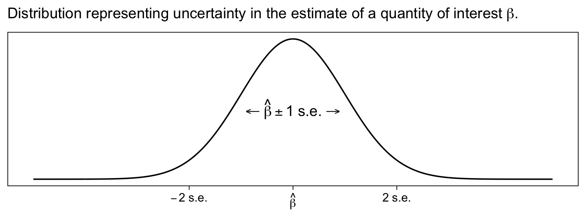
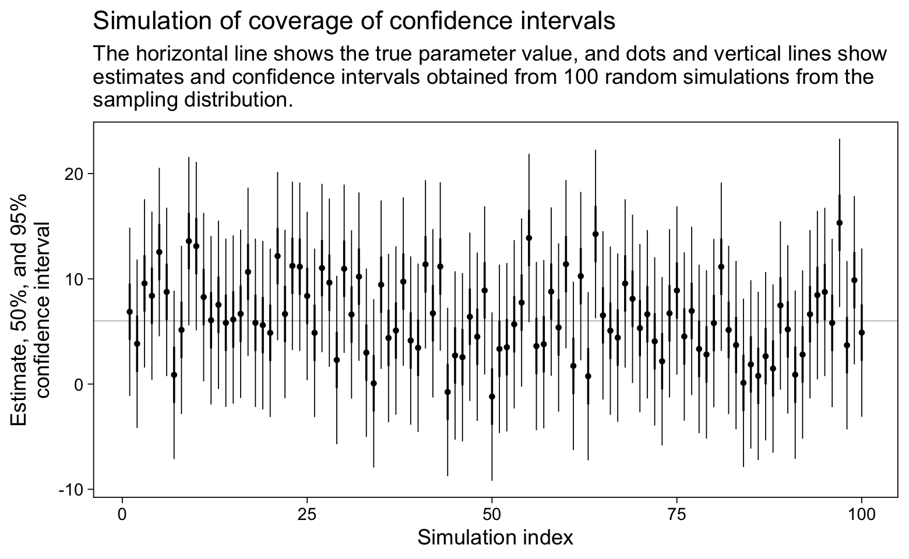
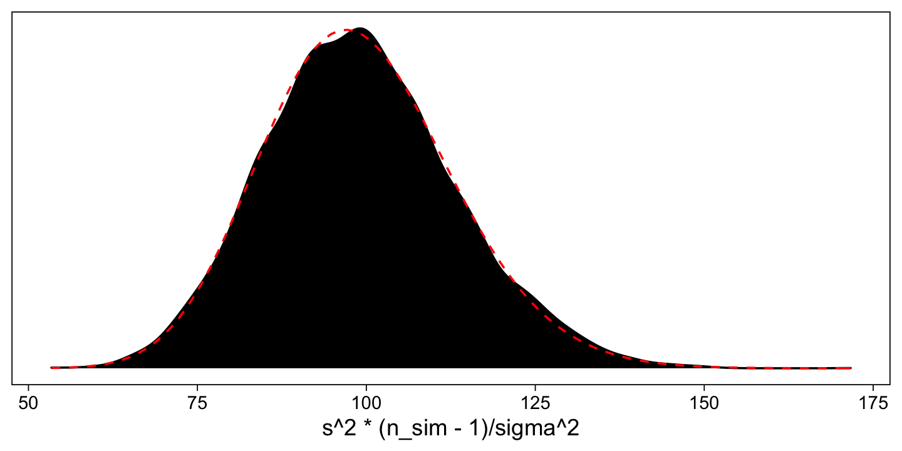
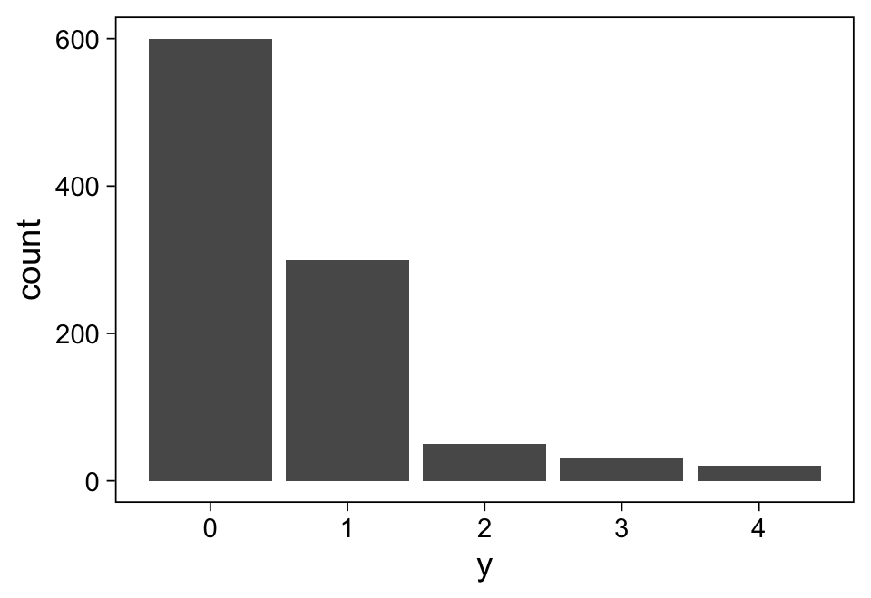
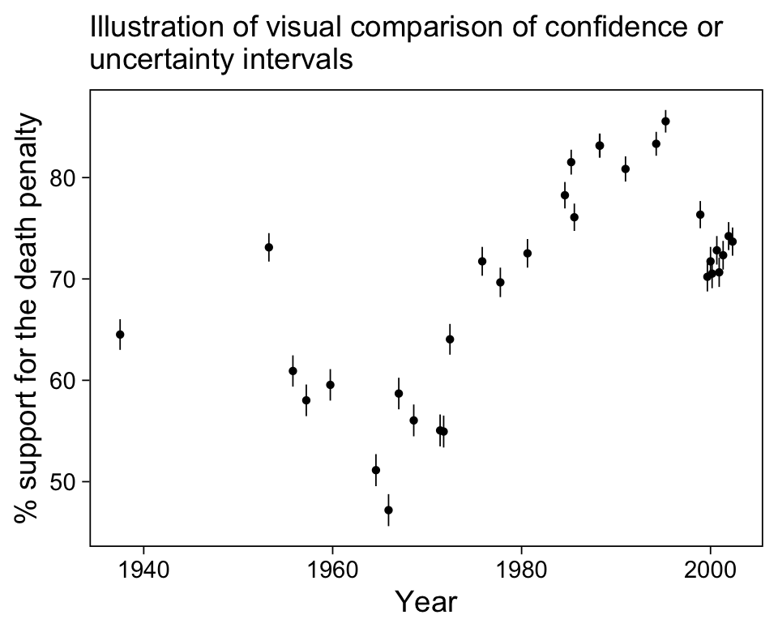
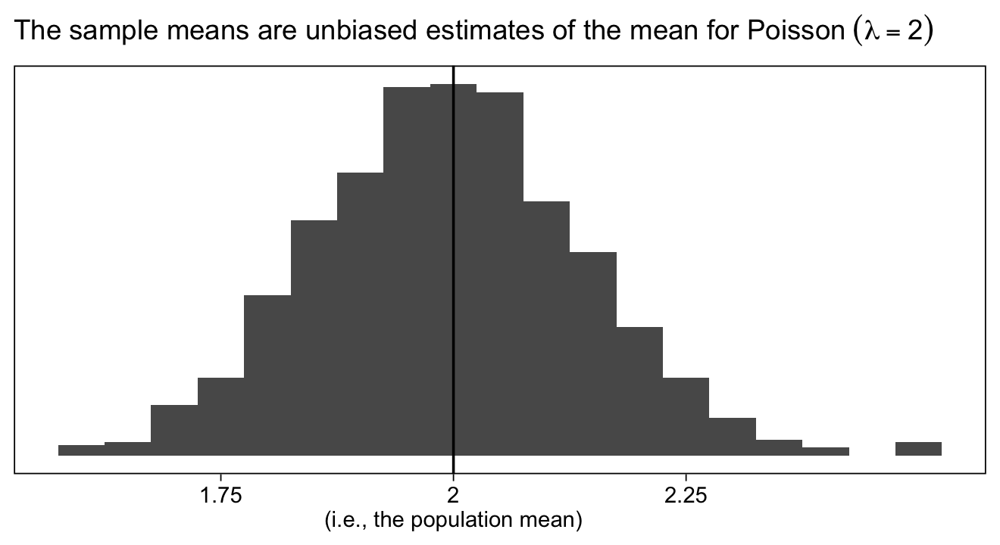
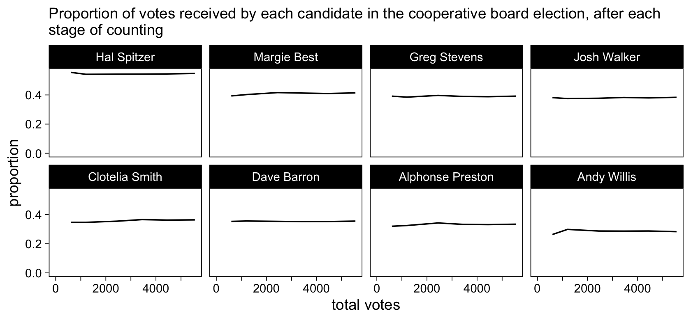
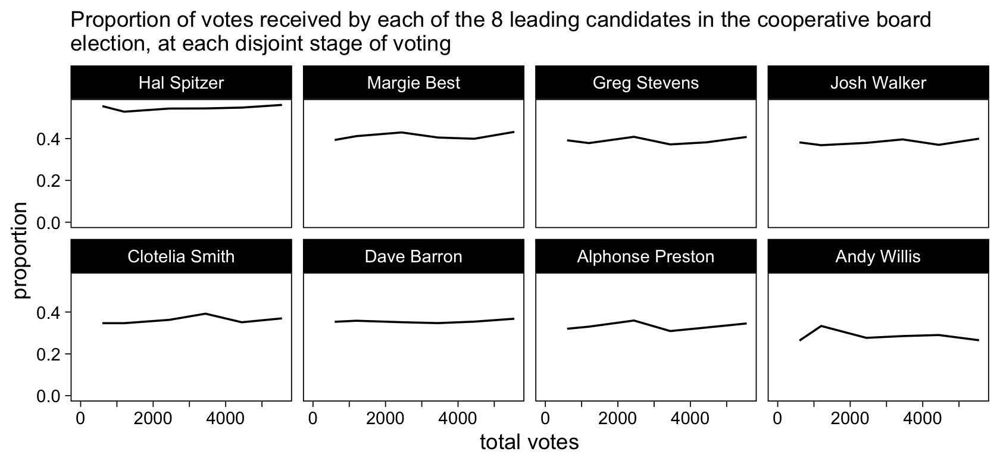
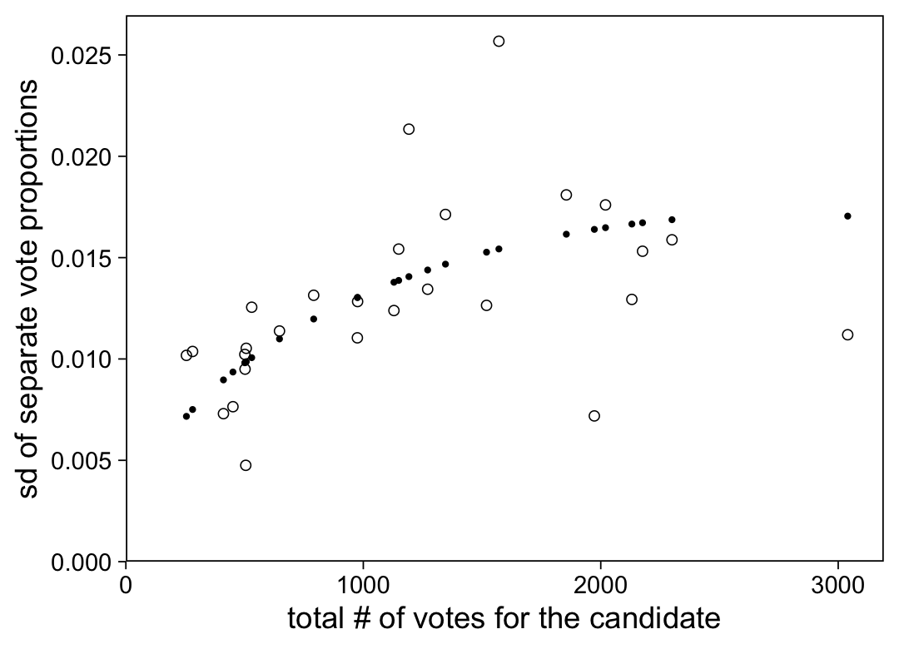
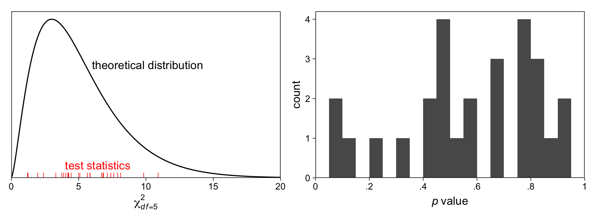

Chapter 4: Statistical inference
================
A Solomon Kurz
2021-01-15

# Statistical inference

“Statistical inference can be formulated as a set of operations on data
that yield estimates and uncertainty statements about predictions and
parameters of some underlying process or population” (p. 49).

## 4.1 Sampling distributions and generative models

### 4.1.1 Sampling, measurement error, and model error.

> This book follows the usual approach of setting up regression models
> in the measurement-error framework (\(y_i = a + b x_i + \epsilon_i\)),
> with the \(\epsilon_i\)’s also interpretable as model error, and with
> the sampling interpretation implicit in that the errors
> \(\epsilon_1, \dots , \epsilon_n\) can be considered as a random
> sample from a distribution (for example, normal with mean 0 and
> standard deviation \(\sigma\)) that represents a hypothetical
> “superpopulation.” (p. 49)

### 4.1.2 The sampling distribution.

> The *sampling distribution* is the set of possible datasets that could
> have been observed if the data collection process had been re-done,
> along with the probabilities of these possible values….
> 
> the sampling distribution in general will not typically be known, as
> it depends on aspects of the population, not merely on the observed
> data (p. 50, *emphasis* in the original).

## 4.2 Estimates, standard errors, and confidence intervals

### 4.2.1 Parameters, estimands, and estimates.

> In statistics jargon, *parameters* are the unknown numbers that
> determine a statistical model. For example, consider the model
> \(yi = a + b x_i + \epsilon_i\), in which the errors \(\epsilon_i\)
> are normally distributed with mean 0 and standard deviation
> \(\sigma\). The parameters in this model are \(a\), \(b\), and
> \(\sigma\). The parameters \(a\) and \(b\) are called *coefficients*,
> and \(\sigma\) is a called a *scale* or *variance parameter*….
> 
> An *estimand*, or *quantity of interest*, is some summary of
> parameters or data that somebody is interested in estimating. For
> example, in the regression model, \(yi = a + b x_i + \text{error}\),
> the parameters \(a\) and \(b\) might be of interest–\(a\) is the
> intercept of the model, the predicted value of \(y\) when \(x = 0\);
> and \(b\) is the slope, the predicted difference in \(y\), comparing
> two data points that differ by 1 in \(x\). Other quantities of
> interest could be predicted outcomes for particular new data points,
> or combinations of predicted values such as sums, differences,
> averages, and ratios.
> 
> We use the data to construct estimates of parameters and other
> quantities of interest. (pp. 50–51, *emphasis* in the original)

### 4.2.2 Standard errors, inferential uncertainty, and confidence intervals.

“The *standard error* is the estimated standard deviation of an estimate
and can give us a sense of our uncertainty about the quantity of
interest” (p. 51, *emphasis* in the original)." You can get a sense of
this with Figure 4.1, where we consider the standard error within the
context of the Gaussian.

``` r
library(tidyverse)

# set the global plotting theme
theme_set(theme_linedraw() +
            theme(panel.grid = element_blank()))

labels <- c("-2~s.e.", "hat(beta)", "2~s.e.")

tibble(x = seq(from = -5, to = 5, by = .01)) %>% 
  mutate(d = dnorm(x, mean = 0, sd = 1)) %>% 
  
  ggplot(aes(x = x, y = d)) +
  geom_line() +
  annotate(geom = "text",
           x = 0, y = .2,
           label = "''%<-%hat(beta)%+-%1~s.e.%->%''",
           parse = T) +
  scale_x_continuous(NULL, breaks = c(-2, 0, 2),
                     labels = function(x) parse(text = labels)) +
  scale_y_continuous(NULL, breaks = NULL) +
  labs(subtitle = expression("Distribution representing uncertainty in the estimate of a quantity of interest"~beta*.))
```



> However defined, the standard error is a measure of the variation in
> an estimate and gets smaller as sample size gets larger, converging on
> zero as the sample increases in size.
> 
> The *confidence interval* represents a range of values of a parameter
> or quantity of interest that are roughly consistent with the data,
> given the assumed sampling distribution. If the model is correct, then
> in repeated applications the 50% and 95% confidence intervals will
> include the true value 50% and 95% of the time. (p. 51, *emphasis* in
> the original)

You can find the authors’ simulation code for Figure 4.2 in the
`coverage.Rmd` file within the `Coverage` folder. Here we adjust it a
bit for a **tidyverse**-style work flow.

``` r
# how many simulations would you like?
n <- 100

# set the true data-generating parameters
mu <- 6
sigma <- 4

set.seed(4)

# simulate
d <-
  tibble(i = 1:n,
         y = rnorm(n, mean = mu, sd = sigma)) %>% 
  mutate(ll95 = y - 2 * sigma,
         ll50 = y - 0.67 * sigma,
         ul50 = y + 0.67 * sigma,
         ul95 = y + 2 * sigma) 

# plot
d %>% 
  ggplot(aes(x = i, y = y)) +
  geom_hline(yintercept = mu, color = "grey75", size = 1/4) +
  geom_pointrange(aes(ymin = ll95, ymax = ul95),
                  size = 1/4, fatten = 2/3) +
  geom_linerange(aes(ymin = ll50, ymax = ul50),
                 size = 1/2) +
  labs(title = "Simulation of coverage of confidence intervals",
       subtitle = "The horizontal line shows the true parameter value, and dots and vertical lines show\nestimates and confidence intervals obtained from 100 random simulations from the\nsampling distribution.",
       x = "Simulation index",
       y = "Estimate, 50%, and 95%\nconfidence interval")
```



To check, here’s the percentage of 95% intervals containing the
data-generating population mean, `mu`.

``` r
d %>% 
  summarise(percent = sum(ll95 <= mu & ul95 >= mu))
```

    ## # A tibble: 1 x 1
    ##   percent
    ##     <int>
    ## 1      98

And here’s the percentage of 50% intervals containing the
data-generating population mean, `mu`.

``` r
d %>% 
  summarise(percent = sum(ll50 <= mu & ul50 >= mu))
```

    ## # A tibble: 1 x 1
    ##   percent
    ##     <int>
    ## 1      52

Both showed good coverage.

### 4.2.3 Standard errors and confidence intervals for averages and proportions.

> When estimating the mean of an infinite population, given a simple
> random sample of size \(n\), the standard error is
> \(\sigma / \sqrt n\), where \(\sigma\) is the standard deviation of
> the measurements in the population. This property holds regardless of
> any assumption about the shape of the sampling distribution, but the
> standard error might be less informative for sampling distributions
> that are far from normal.
> 
> A proportion is a special case of an average in which the data are 0’s
> and 1’s. Consider a survey of size \(n\) with \(y\) Yes responses and
> \(n - y\) No responses. The estimated proportion of the population who
> would answer Yes to this survey is \(\hat p = y / n\), and the
> standard error of this estimate is \(\sqrt{\hat p (1 - \hat p) / n}\).
> If \(p\) is near 0.5, we can approximate this by \(0.5 / \sqrt n\).
> (pp. 51–52)

The authors then asked us to consider how

  - \(\sqrt{0.5 \times 0.5} = 0.5\),
  - \(\sqrt{0.4 \times 0.6} = 0.49\), and
  - \(\sqrt{0.3 \times 0.7} = 0.46\).

Quite frankly, I didn’t follow their point.

Anyway, if we consider a case where out of a random sample of 1,000, 700
opposed the death penalty and 300 supported it, we can use the formula
\(\sqrt{\hat p (1 - \hat p) / n}\) to compute the 95% confidence
intervals in **R** like so.

``` r
n <- 1e3
y <- 7e2

estimate <- y/n

se <- sqrt(estimate * (1 - estimate) / n)

estimate + qnorm(c(.025, .975), mean = 0, sd = 1) * se
```

    ## [1] 0.6715974 0.7284026

### 4.2.4 Standard error and confidence interval for a proportion when \(y = 0\) or \(y = n\).

As a proportion approaches zero or one, the method used above tends to
break down. “A standard and reasonable quick correction for constructing
a 95% interval when \(y\) or \(n - y\) is near zero is to use the
estimate \(\hat p = \frac{y + 2}{n + 4}\) with standard error
\(\sqrt{\hat p(1 − \hat p)/(n + 4)}\)” (p. 52). Here’s how this would
work when \(y = 0\) and \(n = 75\).

``` r
n <- 75
y <- 0

# probability
(estimate <- (y + 2) / (n + 4))
```

    ## [1] 0.02531646

``` r
# se
(sqrt(estimate * (1 - estimate) / (n + 4)))
```

    ## [1] 0.01767338

``` r
# 95% CI
estimate + qnorm(c(.025, .975), mean = 0, sd = 1) * se
```

    ## [1] -0.003086121  0.053719032

However, since “it makes no sense for the interval for a proportion to
contain negative values, so we truncate the interval to obtain \[0,
0.06\]\[1\]” (p. 52).

### 4.2.5 Standard error for a comparison.

The formula to compute the standard error of the difference of two
independent quantities follows the form

\[\text{standard error of the difference} = \sqrt{\text{se}_1^2 + \text{se}_2^2}.\]

Consider a survey of 400 men, 57% of whom said they’d vote Republican,
and 600 women, 45% of whom said they’d vote Republican.

``` r
# men
n <- 400
y <- n * .57

estimate_men <- y/n

se_men <- sqrt(estimate_men * (1 - estimate_men) / n)

# women
n <- 600
y <- n * .45

estimate_women <- y/n

se_women <- sqrt(estimate_women * (1 - estimate_women) / n)

# estimated gender gap
estimate_men - estimate_women
```

    ## [1] 0.12

``` r
# se difference
sqrt(se_men^2 + se_women^2)
```

    ## [1] 0.03201953

### 4.2.6 Sampling distribution of the sample mean and standard deviation; normal and \(\chi^2\) distributions.

> Suppose you draw n data points \(y_1, \dots, y_n\) from a normal
> distribution with mean \(\mu\) and standard deviation \(\sigma\), and
> then compute the sample mean
> \(\bar y = \frac{1}{n} \sum_{i = 1}^n y_i\), and standard deviation
> \(s_y = \sqrt{\frac{1}{n - 1} \sum_{i = 1}^n (y_i - \bar y)^2}\).
> These two statistics have a sampling distribution that can be derived
> mathematically from the properties of independent samples from the
> normal. The sample mean, \(\bar y\), is normally distributed with mean
> \(\mu\) and standard deviation \(\sigma / \sqrt n\). The sample
> standard deviation has a distribution defined as follows:
> \(s_y^2 \times (n - 1) / \sigma^2\) has a \(\chi^2\) distribution with
> \(n - 1\) degrees of freedom.

We might try this out with a simulation.

``` r
# define your n
n_sim <- 100

# define the data generating parameter values
mu <- 6
sigma <- 4

# make a custom simulation function
sim_sd <- function(seed = 0, mean = mu, sd = sigma, n = n_sim) {
  
  set.seed(seed)
  
  y <- rnorm(n = n, mean = mean, sd = sigma)
  
  sd_y <- sd(y)
  
  return(sd_y)
}

# run the simulation 10,000 times
d <-
  tibble(seed = 1:1e4) %>% 
  mutate(s = map_dbl(seed, sim_sd))

glimpse(d)
```

    ## Rows: 10,000
    ## Columns: 2
    ## $ seed <int> 1, 2, 3, 4, 5, 6, 7, 8, 9, 10, 11, 12, 13, 14, 15, 16, 17, 18, 1…
    ## $ s    <dbl> 3.592797, 4.640758, 3.424307, 3.655492, 3.781138, 4.133910, 3.83…

Now we’ll plot the density our sample distribution of
\(s_y^2 \times (n - 1) / \sigma^2\) in black against the formal
\(\chi_2\) distribution with \(df = 100 - 1\) in red.

``` r
d %>% 
  ggplot(aes(x = s^2 * (n_sim - 1) / sigma^2)) +
  geom_density(fill = "black") +
  stat_function(fun = dchisq, args = list(df = n_sim - 1), 
                color = "red", linetype = 2) +
  scale_y_continuous(NULL, breaks = NULL)
```



That’s pretty spot on.

### 4.2.7 Degrees of freedom.

> The concept of *degrees of freedom* arises with the \(\chi^2\)
> distribution and several other places in probability and statistics.
> Without going into the technical details, we can briefly say that
> degrees of freedom relate to the need to correct for overfitting when
> estimating the error of future predictions from a fitted model…
> Roughly speaking, we can think of observed data as supplying \(n\)
> “degrees of freedom” that can be used for parameter estimation, and
> a regression with \(k\) coefficients is said to use up \(k\) of these
> degrees of freedom. (p. 53, *emphasis* in the original)

### 4.2.8 Confidence intervals from the \(t\) distribution.

> The \(t\) distribution is a family of symmetric distributions with
> heavier tails (that is, a greater frequency of extreme values)
> compared to the normal distribution. The \(t\) is characterized by a
> center, a scale, and a degrees of freedom parameter that can range
> from 1 to \(\infty\). Distributions in the \(t\) family with low
> degrees of freedom have very heavy tails; in the other direction, in
> the limit as degrees of freedom approach infinity, the \(t\)
> distribution approaches the normal.
> 
> When a standard error is estimated from n data points, we can account
> for uncertainty using the \(t\) distribution with \(n - 1\) degrees of
> freedom, calcuated as \(n\) data points minus 1 because of the mean is
> being estimated from the data. (p. 53)

Take the case where \(y = \{35, 34, 38, 35, 37 \}\). Here are our \(n\),
mean, and standard deviation.

``` r
y <- c(35, 34, 38, 35, 37)

(n <- length(y))
```

    ## [1] 5

``` r
(estimate <- mean(y))
```

    ## [1] 35.8

``` r
(s <- sd(y))
```

    ## [1] 1.643168

Now compute the standard error, along with the 50% and 95% intervals.

``` r
(se <- s / sqrt(n))
```

    ## [1] 0.7348469

``` r
# 50% CIs
estimate + qt(c(0.25, 0.75), df = n - 1) * se
```

    ## [1] 35.2557 36.3443

``` r
# 95% CIs
estimate + qt(c(0.025, 0.975), df = n - 1) * se
```

    ## [1] 33.75974 37.84026

Note our use of the `qt()` function.

### 4.2.9 Inference for discrete data.

“For nonbinary discrete data, we can simply use the continuous formula
for the standard error” (p. 54). Consider the following 1,000 cases,
with values ranging from 0 to 4.

``` r
y <- rep(0:4, times = c(600, 300, 50, 30, 20))

glimpse(y)
```

    ##  int [1:1000] 0 0 0 0 0 0 0 0 0 0 ...

Here’s their distribution.

``` r
tibble(y = y) %>% 
  ggplot(aes(x = y)) +
  geom_bar()
```



Here are our \(n\), mean, and standard deviation.

``` r
(n <- length(y))
```

    ## [1] 1000

``` r
(estimate <- mean(y))
```

    ## [1] 0.57

``` r
(s <- sd(y))
```

    ## [1] 0.8751376

Now compute the standard error, along with the 50% and 95% intervals.

``` r
# se
(se <- s / sqrt(n))
```

    ## [1] 0.02767428

``` r
# 50% CIs
estimate + qnorm(c(0.25, 0.75), mean = 0, sd = 1) * se
```

    ## [1] 0.551334 0.588666

``` r
# 95% CIs
estimate + qnorm(c(0.025, 0.975), mean = 0, sd = 1) * se
```

    ## [1] 0.5157594 0.6242406

### 4.2.10 Linear transformations.

“To get confidence intervals for a linearly transformed parameter,
simply transform the intervals” (p. 54). If we were to extend the
example of \(n = 1{,}000\), above, to one for which
\(n = 1{,}000{,}000\), we’d get the following 95% intervals.

``` r
# 95% CIs
(estimate + qnorm(c(0.025, 0.975), mean = 0, sd = 1) * se) * 1000000
```

    ## [1] 515759.4 624240.6

### 4.2.11 Comparisons, visual and numerical.

We can remake Figure 4.3 from the data and .Rmd scripts in the `Death`
folder.

``` r
# load the data
polls <- matrix(scan("ROS-Examples-master/Death/data/polls.dat"), ncol=5, byrow=TRUE)

# extract the values
tibble(support = polls[, 3] / (polls[, 3] + polls[, 4]),
       year    = polls[, 1] + (polls[, 2] - 6) / 12) %>% 
  # compute the intervals
  mutate(ll = 100 * (support - 1 * sqrt(support * (1 - support) / 1000)),
         ul = 100 * (support + 1 * sqrt(support * (1 - support) / 1000))) %>% 
  # transform support
  mutate(support = support * 100) %>% 
  
  # plot
  ggplot(aes(x = year, y = support, ymin = ll, ymax = ul)) +
  geom_pointrange(fatten = 1/2, size = 1/4) +
  labs(subtitle = "Illustration of visual comparison of confidence or\nuncertainty intervals",
       x = "Year",
       y = "% support for the death penalty")
```



Because they are based on \(\pm 1\) standard error, the vertical bars
mark of the 68% intervals for each point estimate. If you look closer at
the formulas for `ul` and `ll`, you’ll see they were based on the
assumption \(n = 1{,}000\).

If you presume a group with 80% and a standard error of 1.4, and another
group with 74% and a standard error of 1.3, you can compute the standard
error for their estimated difference of 6% like so.

``` r
sqrt(1.4^2 + 1.3^2)
```

    ## [1] 1.910497

\[\sqrt{(1.4 \%)^2 + (1.3 \%)^2} = 1.9\%\]

### 4.2.12 Weighted averages.

“Confidence intervals for other derived quantities can be determined by
appropriately combining the separate means and variances” (p. 54).

## 4.3 Bias and unmodeled uncertainty

> The inferences discussed above are all consistent on the model being
> true, with unbiased measurements, random samples, and randomized
> experiments. But real data collection is imperfect, and where possible
> we should include the possibility of model error in our inferences and
> predictions. (p. 55)

### 4.3.1 Bias in estimation.

> Roughly speaking, we say that an estimate is *unbiased* if it is
> correct on average. For a simple example, consider a survey, a simple
> random sample of adults in the United States, in which each respondent
> is asked the number of hours he or she spends watching television each
> day. Assuming responses are complete and accurate, the average
> response in the *sample* is an unbiased estimate of the average number
> of hours watched in the *population.* (p. 55, *emphasis* in the
> original)

Let’s check that out in code. For simplicity, let’s say our survey only
measures in 1-hour units and that the average number of hours spent
watching television is 2. We’ll make a custom function that will take
the means of rand0m samples of the Poisson distribution of a set \(n\)
and \(\lambda\).

``` r
sim_means <- function(seed = seed, lambda = lambda, n = n) {
  
  set.seed(seed)
  
  rpois(n = n, lambda = lambda) %>% 
    mean()
}

# what does this do?
sim_means(seed = 1, lambda = 2, n = 100)
```

    ## [1] 2.02

Like earlier, our `sim_means()` takes a `seed` argument, wich will
double as a simulation index. Now we’ll take 1,000 random samples for
which \(n = 100\) and \(\lambda = 2\).

``` r
d <-
  tibble(seed = 1:1e3) %>% 
  mutate(mean = map_dbl(seed, sim_means, lambda = 2, n = 100))

glimpse(d)
```

    ## Rows: 1,000
    ## Columns: 2
    ## $ seed <int> 1, 2, 3, 4, 5, 6, 7, 8, 9, 10, 11, 12, 13, 14, 15, 16, 17, 18, 1…
    ## $ mean <dbl> 2.02, 1.96, 1.89, 2.26, 2.13, 2.22, 2.07, 1.98, 2.04, 1.71, 1.60…

Here is the sample distribution of our means.

``` r
d %>% 
  ggplot(aes(x = mean)) +
  geom_histogram(binwidth = 0.05) +
  geom_vline(xintercept = 2) +
  scale_x_continuous(NULL, 
                     breaks = c(1.75, 2, 2.25),
                     labels = c(1.75, "2\n(i.e., the population mean)", 2.25)) +
  scale_y_continuous(NULL, breaks = NULL) +
  labs(subtitle = expression("The sample means are unbiased estimates of the mean for Poisson"~(lambda==2)))
```



Now formally check how we did by computing the mean of our sample of
means.

``` r
d %>% 
  summarise(mean = mean(mean))
```

    ## # A tibble: 1 x 1
    ##    mean
    ##   <dbl>
    ## 1  2.00

Yep, we got within rounding error of the true mean, 2.

> Now suppose that women are more likely than men to answer the survey,
> with nonresponse depending only on sex. In that case, the sample will,
> on average, overrepresent women, and women on average watch less
> television than men; hence, the average number of hours watched in the
> sample is now a *biased* estimate of the proportion in the population.
> It is possible to correct for this bias by reweighting the sample as
> in Section 3.1; recognizing the existence of the bias is the first
> step in fixing it. (p. 55, *emphasis* in the original)

Let’ see if we can work this one out with a mini simulation, too.
Sticking with an overall population mean of 2 hours, let’s presume women
watch 1.5 hours of television, on average, and men watch 2.5 hours, on
average. For simplicity, we’ll further presume the overall population is
composed 50%/50% of men and women. The catch is we’ll simulate out
samples such that they’re 60% women.

``` r
# total sample
n <- 1e4

mu_women <- 1.5
mu_men   <- 2.5

set.seed(4)

d <-
  tibble(hours = c(rpois(n = n * 0.6, lambda = mu_women),
                   rpois(n = n * 0.4, lambda = mu_men)),
         sex  = rep(c("women", "men"), times = n * c(.6, .4)))

glimpse(d)
```

    ## Rows: 10,000
    ## Columns: 2
    ## $ hours <int> 2, 0, 1, 1, 3, 1, 2, 3, 4, 0, 2, 1, 0, 4, 1, 1, 4, 2, 4, 2, 2, …
    ## $ sex   <chr> "women", "women", "women", "women", "women", "women", "women", …

Here are the means, grouped by `sex`.

``` r
d %>% 
  group_by(sex) %>% 
  summarise(mean = mean(hours))
```

    ## # A tibble: 2 x 2
    ##   sex    mean
    ##   <chr> <dbl>
    ## 1 men    2.49
    ## 2 women  1.49

When divided by `sex`, the simulation appeared to produce unbiased
estimates of the subpopulation means. However, it is indeed biased for
the overall population.

``` r
d %>% 
  summarise(mean = mean(hours))
```

    ## # A tibble: 1 x 1
    ##    mean
    ##   <dbl>
    ## 1  1.89

See? It’s a little low. Now we can use the weighting strategy from
Section 3.1 where we compute the weighted average following the formula

\[\text{weighted average} = \frac{\sum_j N_j \bar y_j}{\sum_j N_j},\]

where \(j\) indexes groups (`sex` in this example), \(\bar y_j\) stands
for the group-specific means, and \(N_j\) stands for the number (or
percent, in our example) of each group *in the population*.

``` r
d %>% 
  group_by(sex) %>% 
  summarise(mean = mean(hours)) %>% 
  mutate(percent = c(50, 50)) %>% 
  summarise(weighted_average = sum(percent * mean) / sum(percent))
```

    ## # A tibble: 1 x 1
    ##   weighted_average
    ##              <dbl>
    ## 1             1.99

Happily, our weighted average now returns an unbiased estimate of the
population average for hours spent each day watching television.

### 4.3.2 Adjusting inferences to account for bias and unmodeled uncertainty.

> How can we account for sources of error that are not in our
> statistical model? In general, there are three ways to go: improve
> data collection, expand the model, and increase stated uncertainty.
> (p. 56)

## 4.4 Statistical significance, hypothesis testing, and statistical errors

> One concern when performing data analysis is the possibility of
> mistakenly coming to strong conclusions that do not replicate or do
> not reflect real patterns in the underlying population. Statistical
> theories of hypothesis testing and error analysis have been developed
> to quantify these possibilities in the context of inference and
> decision making. (p. 57)

### 4.4.1 Statistical significance.

> Statistical significance is conventionally defined as a \(p\)-value
> less than 0.05, relative to some *null hypothesis* or prespecified
> value that would indicate no effect present, as discussed below in the
> context of hypothesis testing. For fitted regressions, this roughly
> corresponds to coefficient estimates being labeled as statistically
> significant if they are at least two standard errors from zero, or not
> statistically significant otherwise. (p. 57, *emphasis* in the
> original)

The authors then considered a case where you flip a coin 20 times, with
eight of the trials coming up heads. The conventional null hypothesis
for a fail coin is that you’d have \(p = .5\) for heads or tails. Using
our skills from Section 4.2.3, we know the standard error for a
proportion is \(\sqrt{\hat p (1 - \hat p) / n}\).

``` r
n <- 20
y <- 8

# the estimated probability
(p <- y / n)
```

    ## [1] 0.4

``` r
# the standard error
(se <- sqrt(p * (1 - p) / n))
```

    ## [1] 0.1095445

``` r
# the 95% CIs
p + c(-2 * se, 2 * se)
```

    ## [1] 0.180911 0.619089

Those confidence intervals clearly contain \(p = .5\) within their
bounds, leading us to conclude our results are not statistically
significantly different from the null hypothesis.

### 4.4.2 Hypothesis testing for simple comparisons.

> We shall review the key concepts of conventional hypothesis testing
> with a simple hypothetical example. A randomized experiment is
> performed to compare the effectiveness of two drugs for lowering
> cholesterol. The mean and standard deviation of the post-treatment
> cholesterol levels are \(\bar y_T\) and \(s_T\) for the \(n_T\) people
> in the treatment group, and \(\bar y_C\) and \(s_C\) for the \(n_C\)
> people in the control group. (p. 57)

#### 4.4.2.1 Estimate, standard error, and degrees of freedom.

> The parameter of interest here is \(\theta = \theta_T - \theta_C\),
> the expectation of the post-test difference in cholesterol between the
> two groups. Assuming the experiment has been done correctly, the
> estimate is \(\hat \theta = \bar y_T - \bar y_C\) and the standard
> error is
> \(\text{se} (\hat \theta) = \sqrt{s_C^2 / n_C + s_T^2 / n_T}\). The
> approximate 95% interval is then
> \([\hat \theta \pm t_{n_C + n_T - 2}^{0.975} * \text{se} (\hat \theta)]\),
> where \(t_{df}^{0.975}\) is the 97.5<sup>th</sup> percentile of the
> unit \(t\) distribution with \(df\) degrees of freedom. (p. 57)

#### 4.4.2.2 Null and alternative hypotheses.

> To frame the above problem as a hypothesis test problem, one must
> define *null* and *alternative* hypotheses. The null hypothesis is
> \(\theta = 0\), that is, \(\theta_T = \theta_C\) , and the
> alternativeis \(\theta \neq 0\), thatis, \(\theta_T \neq \theta_C\).
> 
> The hypothesis test is based on a *test statistic* that summarizes the
> deviation of the data from what would be expected under the null
> hypothesis. The conventional test statistic in this sort of problem is
> the absolute value of the \(t\)-score,
> \(t = |\hat \theta| / \text{se}(\hat \theta)\), with the absolute
> value representing a “two-sided test,” so called because either
> positive or negative deviations from zero would be noteworthy. (p. 57,
> *emphasis* in the original)

#### 4.4.2.3 \(p\)-value.

> In a hypothesis test, the deviation of the data from the null
> hypothesis is summarized by the \(p\)-*value*, the probability of
> observing something at least as extreme as the observed test
> statistic. For this problem, under the null hypothesis the test
> statistic has a unit \(t\) distribution with \(\nu\) degrees of
> freedom. (p. 57, *emphasis* in the original)

If we let `theta_hat` = \(\hat \theta\), `se_theta` =
\(\text{se}(\hat \theta)\) `n_C` = \(n_C\), and `n_T` = \(n_T\), we can
use base **R** to compute our \(p\)-value like this.

``` r
2 * (1 - pt(abs(theta_hat) / se_theta, df = n_C + n_T, ncp = 2))
```

### 4.4.3 Hypothesis testing: general formulation.

> In the simplest form of hypothesis testing, the null hypothesis
> \(H_0\) represents a particular probability model, \(p(y)\), with
> potential replication data \(y^\text{rep}\). To perform a hypothesis
> test, we must define a test statistic \(T\), which is a function of
> the data. For any given data \(y\), the \(p\)-value is then
> \(\operatorname{Pr}(T(y^\text{rep}) \geq T(y))\): the probability of
> observing, under the model, something as or more extreme than the
> data.
> 
> In regression modeling, testing is more complicated. The model to be
> fit can be written as \(p(y|x, \theta)\), where \(\theta\) represents
> a set of parameters including coefficients, residual standard
> deviation, and possibly other parameters, and the null hypothesis
> might be that some particular coefficient of interest equals zero.
> (p. 58)

### 4.4.4 Comparisons of parameters to fixed values and each other: interpreting confidence intervals as hypothesis tests.

> The hypothesis that a parameter equals zero (or any other fixed value)
> can be directly tested by fitting the model that includes the
> parameter in question and examining the corresponding 95% interval. If
> the interval excludes zero (or the specified fixed value), then the
> hypothesis is said to be rejected at the 5% level.
> 
> Testing whether two parameters are equal is equivalent to testing
> whether their difference equals zero. We can do this by including both
> parameters in the model and then examining the 95% interval for their
> difference. As with inference for a single parameter, the confidence
> interval is commonly of more interest than the hypothesis test.
> (p. 58)

### 4.4.5 Type 1 and type 2 errors and why we don’t like talking about them.

> Statistical tests are typically understood based on *type 1 error*–the
> probability of falsely rejecting a null hypothesis, if it is in fact
> true–and *type 2 error*–the probability of not rejecting a null
> hypothesis that is in fact false. But this paradigm does not match up
> well with much of social science, or science more generally.
> (pp. 58–59, *emphasis* in the original)

### 4.4.6 Type M (magnitude) and type S (sign) errors.

> A *type S error* occurs when the sign of the estimated effect is of
> the opposite direction as the true effect. A *type M error* occurs
> when the magnitude of the estimated effect is much different from the
> true effect. A statistical procedure can be characterized by its type
> S error rate–the probability of an estimate being of the opposite sign
> of the true effect, conditional on the estimate being statistically
> significant–and its expected exaggeration factor–the expected ratio of
> the magnitude of the estimated effect divided by the magnitude of the
> underlying effect. (p. 59, *emphasis* in the original)

For more on this, check out the [**PRDA**
package](https://CRAN.R-project.org/package=PRDA), which is designed to
assess type S and M errors for a given study design.

### 4.4.7 Hypothesis testing and statistical practice.

> We do not generally use null hypothesis significance testing in our
> own work. In the fields in which we work, we do not generally think
> null hypotheses can be true: in social science and public health, just
> about every treatment one might consider will have *some* effect, and
> no comparisons or regression coefficient of interest will be *exactly*
> zero. We do not find it particularly helpful to formulate and test
> null hypotheses that we know ahead of time cannot be true. Testing
> null hypotheses is just a matter of data collection: with sufficient
> sample size, any hypothesis can be rejected, and there is no real
> point to gathering a mountain of data just to reject a hypothesis that
> we did not believe in the first place. (p. 59, *emphasis* in the
> original)

## 4.5 Problems with the concept of statistical significance

> A common statistical error is to summarize comparisons by statistical
> significance and to draw a sharp distinction between significant and
> nonsignificant results. The approach of summarizing by statistical
> significance has five pitfalls: two that are obvious and three that
> are less well understood. (p. 60)

### 4.5.1 Statistical significance is not the same as practical importance.

This is why we have effect sizes.

### 4.5.2 Non-significance is not the same as zero.

Rather, it simply means that the data under question could have been
plausibly generated under the null hypothesis.

### 4.5.3 The difference between “significant” and “not significant” is not itself statistically significant.

If you pay attention to the substantive literature, you’ll likely find a
lot of examples of authors making this mistake.

> Consider two independent studies with effect estimates and standard
> errors of \(25 \pm 10\) and \(10 \pm 10\). The first study is
> statistically significant at the 1% level, and the second is not at
> all significant at 1 standard error away from zero. Thus it would be
> tempting to conclude that there is a large difference between the two
> studies. In fact, however, the difference is not even close to being
> statistically significant: the estimated difference is 15, with a
> standard error of \(\sqrt{10^2 + 10^2} = 14\) (p. 61)

### 4.5.4 Researcher degrees of freedom, \(p\)-hacking, and forking paths.

> Another problem with statistical significance is that it can be
> attained by multiple comparisons, or multiple potential comparisons.
> When there are many ways that data can be selected, excluded, and
> analyzed in a study, it is not difficult to attain a low \(p\)-value
> even in the absence of any true underlying pattern. The problem here
> is *not* just the “file-drawer effect” of leaving non-significant
> findings unpublished, but also that any given study can involve a
> large number of “degrees of freedom” available to the researcher when
> coding data, deciding which variables to include in the analysis, and
> deciding how to perform and summarize the statistical modeling.
> (p. 61, *emphasis* in the original)

### 4.5.5 The statistical significance filter.

> A final concern is that statistically significant estimates tend to be
> overestimates. This is the type M, or magnitude, error problem
> discussed in Section 4.4. Any estimate with \(p < 0.05\) is by
> necessity at least two standard errors from zero. If a study has a
> high noise level, standard errors will be high, and so statistically
> significant estimates will automatically be large, no matter how small
> the underlying effect. Thus, routine reliance on published,
> statistically significant results will lead to systematic
> overestimation of effect sizes and a distorted view of the world.
> (p. 62)

### 4.5.6 Example: A flawed study of ovulation and political attitudes.

Herein the authors discussed the flaws in the paper by Durante et al
(2013), [*The fluctuating female vote: Politics, religion, and the
cvulatory
cycle*](https://journals.sagepub.com/doi/abs/10.1177/0956797612466416).

## 4.6 Example of hypothesis testing: 55,000 residents need your help\!

The data and code in this section can be found in the `Coop` folder.

``` r
# data <- read.table("ROS-Examples-master/Coop/data/Riverbay.csv", header=FALSE, sep=",")
data <- read_csv("ROS-Examples-master/Coop/data/Riverbay.csv", col_names = F)

glimpse(data)
```

    ## Rows: 27
    ## Columns: 8
    ## $ X1 <chr> "Othelia Jones", "Roger Toppin", "Vanessa Fuentes", "Gloria Wharto…
    ## $ X2 <dbl> 208, 55, 133, 101, 108, 54, 158, 52, 64, 68, 333, 236, 229, 125, 6…
    ## $ X3 <dbl> 416, 106, 250, 202, 249, 94, 327, 115, 126, 130, 650, 483, 450, 24…
    ## $ X4 <dbl> 867, 215, 505, 406, 512, 196, 673, 232, 222, 256, 1326, 1017, 922,…
    ## $ X5 <dbl> 1259, 313, 716, 589, 745, 279, 963, 308, 316, 336, 1870, 1422, 131…
    ## $ X6 <dbl> 1610, 401, 902, 787, 970, 360, 1236, 400, 407, 420, 2418, 1821, 16…
    ## $ X7 <dbl> 2020, 505, 1129, 976, 1192, 451, 1519, 502, 507, 530, 3040, 2300, …
    ## $ X8 <chr> "Clotelia Smith", "Earl Coppin", "Clarissa Montes", NA, NA, NA, NA…

Here we’ll rename the variables and save the results as `d`.

``` r
voters <- c(600, 1200, 2444, 3444, 4444, 5553)

d <- 
  data %>% 
  set_names("id1", voters, "id2")

d
```

    ## # A tibble: 27 x 8
    ##    id1                `600` `1200` `2444` `3444` `4444` `5553` id2            
    ##    <chr>              <dbl>  <dbl>  <dbl>  <dbl>  <dbl>  <dbl> <chr>          
    ##  1 Othelia Jones        208    416    867   1259   1610   2020 Clotelia Smith 
    ##  2 Roger Toppin          55    106    215    313    401    505 Earl Coppin    
    ##  3 Vanessa Fuentes      133    250    505    716    902   1129 Clarissa Montes
    ##  4 Gloria Wharton       101    202    406    589    787    976 <NA>           
    ##  5 Bernard Cylich       108    249    512    745    970   1192 <NA>           
    ##  6 Cecil McIntosh        54     94    196    279    360    451 <NA>           
    ##  7 Alan Berger          158    327    673    963   1236   1519 <NA>           
    ##  8 Betty Wright-Wells    52    115    232    308    400    502 <NA>           
    ##  9 Geraldine Shivers     64    126    222    316    407    507 <NA>           
    ## 10 Josephine Dance       68    130    256    336    420    530 <NA>           
    ## # … with 17 more rows

We might subset the data to make our version of Figure 4.4, like this.

``` r
d %>% 
  select(id2, everything(), -id1) %>% 
  slice(1:3)
```

    ## # A tibble: 3 x 7
    ##   id2             `600` `1200` `2444` `3444` `4444` `5553`
    ##   <chr>           <dbl>  <dbl>  <dbl>  <dbl>  <dbl>  <dbl>
    ## 1 Clotelia Smith    208    416    867   1259   1610   2020
    ## 2 Earl Coppin        55    106    215    313    401    505
    ## 3 Clarissa Montes   133    250    505    716    902   1129

Here are the percentages for Clotelia Smith.

``` r
d %>% 
  filter(id2 == "Clotelia Smith") %>% 
  pivot_longer(!contains("id"), 
               names_to = "stage",
               values_to = "cumuliative_tally") %>% 
  mutate(percent = (100 * cumuliative_tally / as.double(stage)) %>% round(digits = 2)) %>% 
  select(stage, percent)
```

    ## # A tibble: 6 x 2
    ##   stage percent
    ##   <chr>   <dbl>
    ## 1 600      34.7
    ## 2 1200     34.7
    ## 3 2444     35.5
    ## 4 3444     36.6
    ## 5 4444     36.2
    ## 6 5553     36.4

An important insight is that each of the numeric columns are cumulative,
starting with 600 and culminating at 5553. You get a sense of how this
unfolds with Figure 4.5.

``` r
# define our subset
leading_8 <- c("Hal Spitzer", "Margie Best", "Greg Stevens", "Josh Walker", 
               "Clotelia Smith", "Dave Barron", "Alphonse Preston", "Andy Willis")

# wrangle
d %>% 
  filter(id2 %in% leading_8) %>% 
  pivot_longer(!contains("id"), 
               names_to = "stage",
               values_to = "cumuliative_tally") %>% 
  mutate(cumuliative_count = stage %>% as.double()) %>% 
  mutate(proportion = cumuliative_tally / cumuliative_count) %>% 
  
  # plot
  ggplot(aes(x = cumuliative_count, y = proportion)) +
  geom_line() +
  scale_x_continuous(breaks = 0:5 * 1000,
                     labels = c(0, "", 2000, "", 4000, ""),
                     limits = c(0, NA)) +
  scale_y_continuous(limits = c(0, NA)) +
  labs(subtitle = "Proportion of votes received by each candidate in the cooperative board election, after each\nstage of counting",
       x = "total votes") +
  facet_wrap(~fct_reorder(id2, desc(proportion)), nrow = 2)
```



> These graphs are difficult to interpret, however, since the data
> points are not in any sense independent: the vote at any time point
> includes all the votes that came before. We handle this problem by
> subtraction to obtain the number of votes for each candidate in the
> intervals between the vote tallies: the first 600 votes, the next 600,
> the next 1244, then next 1000, then next 1000, and the final 1109,
> with the total representing all 5553 votes. (p. 63)

In other words, we solve the problem by using subtraction to undo the
cumulative nature of the total counts and the candidate-specific
tallies. Within our **R** workflow, the `lag()` function will serve a
pivotal role. Here’s Figure 4.6.

``` r
# wrangle
d %>% 
  filter(id2 %in% leading_8) %>% 
  pivot_longer(!contains("id"), 
               names_to = "stage",
               values_to = "cumuliative_tally") %>% 
  group_by(id2) %>% 
  mutate(cumuliative_count = stage %>% as.double(),
         tally = cumuliative_tally - lag(cumuliative_tally, default = 0)) %>% 
  mutate(count = cumuliative_count - lag(cumuliative_count, default = 0)) %>% 
  mutate(proportion = tally / count) %>% 
  
  # plot
  ggplot(aes(x = cumuliative_count, y = proportion)) +
  geom_line() +
  scale_x_continuous(breaks = 0:5 * 1000,
                     labels = c(0, "", 2000, "", 4000, ""),
                     limits = c(0, NA)) +
  scale_y_continuous(limits = c(0, NA)) +
  labs(subtitle = "Proportion of votes received by each of the 8 leading candidates in the cooperative board\nelection, at each disjoint stage of voting",
       x = "total votes") +
  facet_wrap(~fct_reorder(id2, desc(proportion)), nrow = 2)
```



> Even after taking differences, these graphs are fairly stable—but how
> does this variation compare to what would be expected if votes were
> actually coming in at random? We formulate this as a hypothesis test
> and carry it out in five steps: (p. 63)

1.  The *null hypothesis* is voters entered the polls at random and the
    research hypothesis is they are coming in in a biased (“rigged”)
    way.

2.  The *test statistic* should index variability. If we organize the
    tally data so they are not cumulative, we can index the counts
    unique to a given stage as \(y_{i1}, \dots, y_{i6}\), where the
    stage is indexed by the numeric subscript and the candidate is
    indexed by \(i\). We can then compute the proportion of votes for a
    given candidate on a given stage as \(p_{it} = y_{it} / n_t\) for
    \(t = 1, \dots, 6\), and use the sample standard deviation for these
    six time points as the test statistic,

\[T_i = \operatorname{sd}_{t=1}^6 p_{it}.\]

3.  Let \(\pi_i\) be the proportion of votes be the final proportion of
    votes for the \(i\)th candidate, and \(p_{it}\) be the observed
    proportion at time \(t\), the *theoretical distribution of the data
    under the null hypothesis* would have a mean \(\pi_i\) and variance
    \(\pi_i (1 - \pi_i) / n_t\). Thus under the null, the variance
    should, on average, be
    \(\operatorname{avg}_{t=1}^6 \pi_i (1 - \pi_i) / n_t\) and the
    expected value for the test statistic is

\[T_i^\text{theory} = \sqrt{p_i (1 - p_i) \operatorname{avg}_{t=1}^6 (1 / n_i)}.\]

4.  *We can then compare the test statistic* \(T_i\) *to its theoretical
    distribution* \(T_i^\text{theory}\) in a plot. We’ll use the
    formulas from above to compute `p_i` (\(p_i\)) and `avg`
    (\(\operatorname{avg}_{t=1}^6 (1 / n_i)\)), which will allow us to
    then compute `t_i^theory` (\(T_i^\text{theory}\)). Then we’ll plot
    those and `t_i` (\(T_i\)) as functions of each candidates’ total
    number of votes. This will be our Figure 4.7.

<!-- end list -->

``` r
d %>% 
  select(-id2) %>% 
  pivot_longer(!contains("id"), 
               names_to = "stage",
               values_to = "cumuliative_tally") %>% 
  group_by(id1) %>% 
  mutate(cumuliative_count = stage %>% as.double(),
         tally = cumuliative_tally - lag(cumuliative_tally, default = 0)) %>% 
  mutate(count = cumuliative_count - lag(cumuliative_count, default = 0)) %>% 
  mutate(p_it = tally / count) %>% 
  summarise(t_i = sd(p_it),
            p_i = max(cumuliative_tally) / max(cumuliative_count),
            avg = mean(1 / count)) %>% 
  mutate(`t_i^theory` = sqrt(p_i * (1 - p_i) * avg)) %>% 
  left_join(d %>% select(id1, `5553`))  %>% 
  
  ggplot(aes(x = `5553`)) +
  geom_point(aes(y = t_i),
             shape = 1, stroke = 1/3) +
  geom_point(aes(y = `t_i^theory`),
             size = 1/2) +
  scale_x_continuous("total # of votes for the candidate", limits = c(0, NA),
                     expand = expansion(mult = c(0, 0.05))) +
  scale_y_continuous("sd of separate vote proportions", limits = c(0, NA),
                     expand = expansion(mult = c(0, 0.05)))
```



5.  We can *make formal summary comparisons with* \(\chi^2\) *tests*.

> Under the null hypothesis, the probability of a candidate receiving
> votes is independent of the time of each vote, and thus the
> \(2 \times 6\) table of votes including or excluding each candidate
> would be consistent with the model of independence… We can then
> compute for each candidate a summary, called a \(\chi^2\) statistic,
> \(\sum_{j=1}^2 \sum_{t=1}^6 (\text{observed}_{jt} - \text{expected}_{jt})^2 / \text{expected}_{jt}\),
> and compare it to its theoretical distribution: under the null
> hypothesis, this statistic has what is called a \(\chi^2\)
> distribution with \((6 - 1) * (2 - 1) = 5\) degrees of freedom.
> (p. 65)

First we’ll reshape the `d` data a little.

``` r
# just name this something, for now
d_sum <-
  d %>% 
  select(-id2) %>% 
  pivot_longer(!contains("id"), 
               names_to = "stage",
               values_to = "cumuliative_tally") %>% 
  group_by(id1) %>% 
  mutate(cumuliative_count = stage %>% as.double(),
         # this is called `extras` in the `riverbay.Rmd` file
         tally = cumuliative_tally - lag(cumuliative_tally, default = 0)) %>% 
  # this is called `extras_voters` in the `riverbay.Rmd` file
  mutate(count = cumuliative_count - lag(cumuliative_count, default = 0)) %>% 
  select(-cumuliative_tally, -cumuliative_count, )

# what have we done?
d_sum
```

    ## # A tibble: 162 x 4
    ## # Groups:   id1 [27]
    ##    id1           stage tally count
    ##    <chr>         <chr> <dbl> <dbl>
    ##  1 Othelia Jones 600     208   600
    ##  2 Othelia Jones 1200    208   600
    ##  3 Othelia Jones 2444    451  1244
    ##  4 Othelia Jones 3444    392  1000
    ##  5 Othelia Jones 4444    351  1000
    ##  6 Othelia Jones 5553    410  1109
    ##  7 Roger Toppin  600      55   600
    ##  8 Roger Toppin  1200     51   600
    ##  9 Roger Toppin  2444    109  1244
    ## 10 Roger Toppin  3444     98  1000
    ## # … with 152 more rows

To give a sense of the \(2 \times 6\) table, here’s what that’d look
like for Elaine Johnson.

``` r
# observed
d_sum %>% 
  filter(id1 == "Elaine Johnson") %>% 
  ungroup() %>% 
  mutate(yes = tally,
         no  = count - tally) %>% 
  select(stage, yes:no) %>% 
  pivot_longer(-stage) %>% 
  pivot_wider(names_from = stage,
              values_from = value)
```

    ## # A tibble: 2 x 7
    ##   name  `600` `1200` `2444` `3444` `4444` `5553`
    ##   <chr> <dbl>  <dbl>  <dbl>  <dbl>  <dbl>  <dbl>
    ## 1 yes     108    101    219    195    165    187
    ## 2 no      492    499   1025    805    835    922

The `yes` row on top is of her unique votes, per stage. The `no` row on
the bottom is for the total votes possible at each stage minus those
cast for her. These constitute the \(\text{observed}_{jt}\) values we’d
use to compute the \(\chi^2\) statistic for Elaine Johnson. Before we
can compute those \(\chi^2\)’s, we need to specify the
\(\text{expected}_{jt}\) values, as defined null model. Here the values
the null model would expect for Elaine Johnson.

``` r
# expected
d_sum %>% 
  filter(id1 == "Elaine Johnson") %>% 
  ungroup() %>% 
  mutate(yes_n = count * sum(tally) / sum(count),
         no_n  = count * (1 - sum(tally) / sum(count))) %>% 
  select(stage, yes_n:no_n) %>% 
  pivot_longer(-stage) %>% 
  pivot_wider(names_from = stage,
              values_from = value)
```

    ## # A tibble: 2 x 7
    ##   name  `600` `1200` `2444` `3444` `4444` `5553`
    ##   <chr> <dbl>  <dbl>  <dbl>  <dbl>  <dbl>  <dbl>
    ## 1 yes_n  105.   105.   218.   176.   176.   195.
    ## 2 no_n   495.   495.  1026.   824.   824.   914.

Now we’ll compute both types, so we can compute the full
\(\sum_{j=1}^2 \sum_{t=1}^6 (\text{observed}_{jt} - \text{expected}_{jt})^2 / \text{expected}_{jt}\)
required for Elaine Johnson’s \(\chi^2\) statistic and its corresponding
\(p\)-value.

``` r
d_sum %>% 
  filter(id1 == "Elaine Johnson") %>%
  ungroup() %>%
  mutate(yes   = tally,
         no    = count - tally,
         yes_n = count * sum(tally) / sum(count),
         no_n  = count * (1 - sum(tally) / sum(count)),
         stage = 1:n()) %>% 
  select(stage, yes:no_n) %>% 
  pivot_longer(-stage) %>% 
  mutate(type = if_else(str_detect(name, "_n"), "expected", "observed"),
         name = str_remove(name, "_n")) %>% 
  pivot_wider(names_from = type,
              values_from = value) %>% 
  summarise(chisq = sum((observed-expected)^2 / expected)) %>% 
  mutate(p_value = pchisq(chisq, df = 5))
```

    ## # A tibble: 1 x 2
    ##   chisq p_value
    ##   <dbl>   <dbl>
    ## 1  4.05   0.458

Now we’ll do so for all 27 candidates.

``` r
chisq <-
  d_sum %>% 
  group_by(id1) %>% 
  mutate(yes   = tally,
         no    = count - tally,
         yes_n = count * sum(tally) / sum(count),
         no_n  = count * (1 - sum(tally) / sum(count)),
         stage = 1:n()) %>% 
  select(id1, stage, yes:no_n) %>% 
  pivot_longer(-c(stage, id1)) %>% 
  mutate(type = if_else(str_detect(name, "_n"), "expected", "observed"),
         name = str_remove(name, "_n")) %>% 
  pivot_wider(names_from = type,
              values_from = value) %>% 
  summarise(chisq = sum((observed-expected)^2 / expected)) %>% 
  mutate(p_value = pchisq(chisq, df = 5))

chisq
```

    ## # A tibble: 27 x 3
    ##    id1                chisq p_value
    ##    <chr>              <dbl>   <dbl>
    ##  1 Al Shapiro          1.96   0.145
    ##  2 Alan Berger         3.89   0.435
    ##  3 Alice Rosario       7.13   0.789
    ##  4 Alonzo Newton       7.90   0.838
    ##  5 Andrea Leslie       6.71   0.757
    ##  6 Bernard Cylich      9.83   0.920
    ##  7 Betty Wright-Wells  4.45   0.513
    ##  8 Cecil McIntosh      2.39   0.206
    ##  9 Craig Williams      5.09   0.596
    ## 10 Elaine Johnson      4.05   0.458
    ## # … with 17 more rows

We might inspect the distribution of \(\chi^2\) and \(p\) values with
plots.

``` r
# chi^2
p1 <-
  chisq %>% 
  ggplot(aes(chisq)) +
  geom_rug(color = "red", size = 1/4) +
  geom_function(fun = dchisq, args = list(df = 5), n = 250) +
  scale_x_continuous(expression(chi[italic(df)==5]^2), limits = c(0, 20), expand = c(0, 0)) +
  annotate(geom = "text",
           x = c(4, 6), y = c(0.0125, 0.11),
           label = c("test statistics", "theoretical distribution"), 
           hjust = 0, color = c("red", "black")) +
  scale_y_continuous(NULL, breaks = NULL, expand = expansion(mult = c(0, 0.05)))

# p-values
p2 <-
  chisq %>% 
  ggplot(aes(x = p_value)) +
  geom_histogram(binwidth = .05, boundary = 0) +
  scale_x_continuous(expression(italic(p)~value), 
                     limits = 0:1, expand = c(0, 0),
                     breaks = 0:5 * 0.2,
                     labels = c(0, str_c(".", 1:4 * 2), 1)) +
  scale_y_continuous(expand = expansion(mult = c(0, 0.05)))

library(patchwork)
p1 + p2
```



The candidate-specific \(\chi^2\) values were generally distributed
around the mode of the theoretical \(\chi_{df = 5}^2\) distribution and
the \(p\)-values were roughly uniformly distributed within the
theoretical range. About 10% of the \(p\)-values were below .1 and about
another 10% were above .9.

``` r
chisq %>% 
  summarise(`% below .1` = sum(p_value < .1) / n(),
            `% above .9` = sum(p_value > .9) / n())
```

    ## # A tibble: 1 x 2
    ##   `% below .1` `% above .9`
    ##          <dbl>        <dbl>
    ## 1       0.0741       0.0741

> We thus conclude that the intermediate vote tallies are consistent
> with random voting. As we explained to the writer of the fax, opinion
> polls of 1000 people are typically accurate to within 2%, and so, if
> voters really are arriving at random, it makes sense that batches of
> 1000 votes are highly stable. This does not rule out the possibility
> of fraud, but it shows that this aspect of the voting is consistent
> with the null hypothesis. (p. 65)

## 4.7 Moving beyond hypothesis testing

> Null hypothesis significance testing has all sorts of problems, but it
> addresses a real concern in quantitative research: we want to be able
> to make conclusions without being misled by noisy data, and hypothesis
> testing provides a check on overinterpretation of noise. How can we
> get this benefit of statistical reasoning while avoiding the
> overconfidence and exaggerations that are associated with conventional
> reasoning based on statistical significance? (p. 66)

  - analyze all your data
  - present all your comparisons
  - make your data and code public

## Session info

``` r
sessionInfo()
```

    ## R version 4.0.3 (2020-10-10)
    ## Platform: x86_64-apple-darwin17.0 (64-bit)
    ## Running under: macOS Catalina 10.15.7
    ## 
    ## Matrix products: default
    ## BLAS:   /Library/Frameworks/R.framework/Versions/4.0/Resources/lib/libRblas.dylib
    ## LAPACK: /Library/Frameworks/R.framework/Versions/4.0/Resources/lib/libRlapack.dylib
    ## 
    ## locale:
    ## [1] en_US.UTF-8/en_US.UTF-8/en_US.UTF-8/C/en_US.UTF-8/en_US.UTF-8
    ## 
    ## attached base packages:
    ## [1] stats     graphics  grDevices utils     datasets  methods   base     
    ## 
    ## other attached packages:
    ##  [1] patchwork_1.1.0 forcats_0.5.0   stringr_1.4.0   dplyr_1.0.2    
    ##  [5] purrr_0.3.4     readr_1.4.0     tidyr_1.1.2     tibble_3.0.4   
    ##  [9] ggplot2_3.3.2   tidyverse_1.3.0
    ## 
    ## loaded via a namespace (and not attached):
    ##  [1] tidyselect_1.1.0  xfun_0.19         haven_2.3.1       colorspace_2.0-0 
    ##  [5] vctrs_0.3.5       generics_0.1.0    htmltools_0.5.0   yaml_2.2.1       
    ##  [9] utf8_1.1.4        rlang_0.4.9       pillar_1.4.7      glue_1.4.2       
    ## [13] withr_2.3.0       DBI_1.1.0         dbplyr_2.0.0      modelr_0.1.8     
    ## [17] readxl_1.3.1      lifecycle_0.2.0   munsell_0.5.0     gtable_0.3.0     
    ## [21] cellranger_1.1.0  rvest_0.3.6       evaluate_0.14     labeling_0.4.2   
    ## [25] knitr_1.30        fansi_0.4.1       broom_0.7.2       Rcpp_1.0.5       
    ## [29] scales_1.1.1      backports_1.2.0   jsonlite_1.7.1    farver_2.0.3     
    ## [33] fs_1.5.0          hms_0.5.3         digest_0.6.27     stringi_1.5.3    
    ## [37] grid_4.0.3        cli_2.2.0         tools_4.0.3       magrittr_2.0.1   
    ## [41] crayon_1.3.4      pkgconfig_2.0.3   ellipsis_0.3.1    xml2_1.3.2       
    ## [45] reprex_0.3.0      lubridate_1.7.9.2 assertthat_0.2.1  rmarkdown_2.5    
    ## [49] httr_1.4.2        rstudioapi_0.13   R6_2.5.0          compiler_4.0.3

1.  The reason our value is off a bit from the one in the text is
    because whereas ours avoided rounding errors, the one in the text
    did not.
