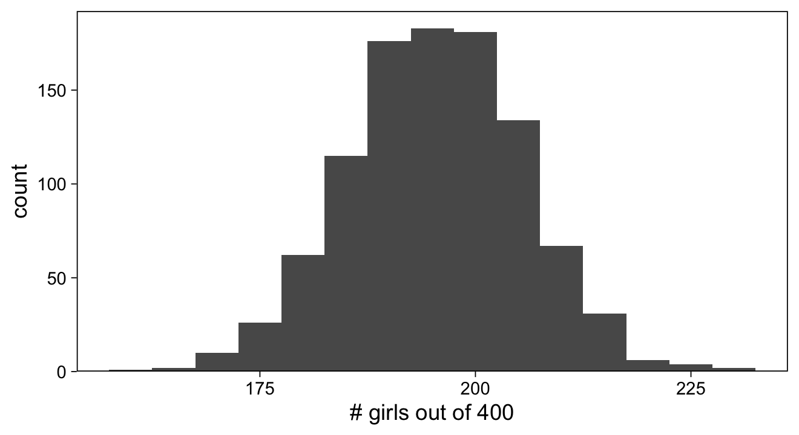
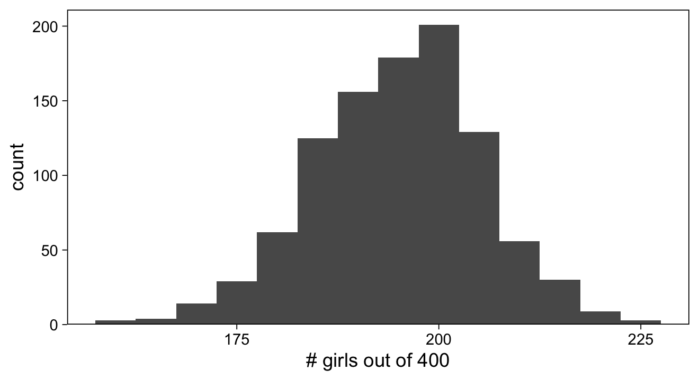
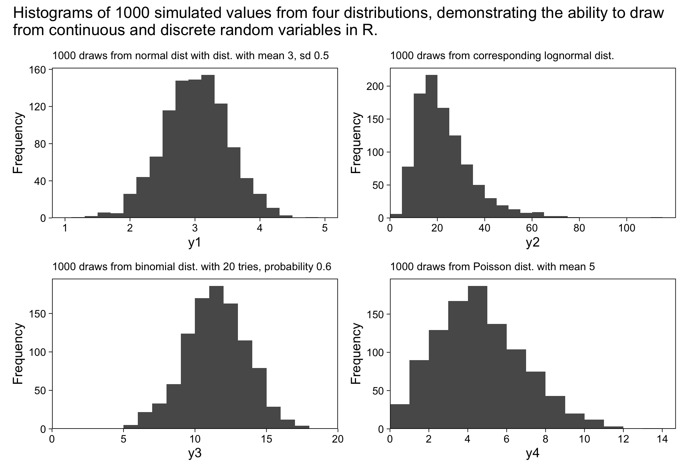
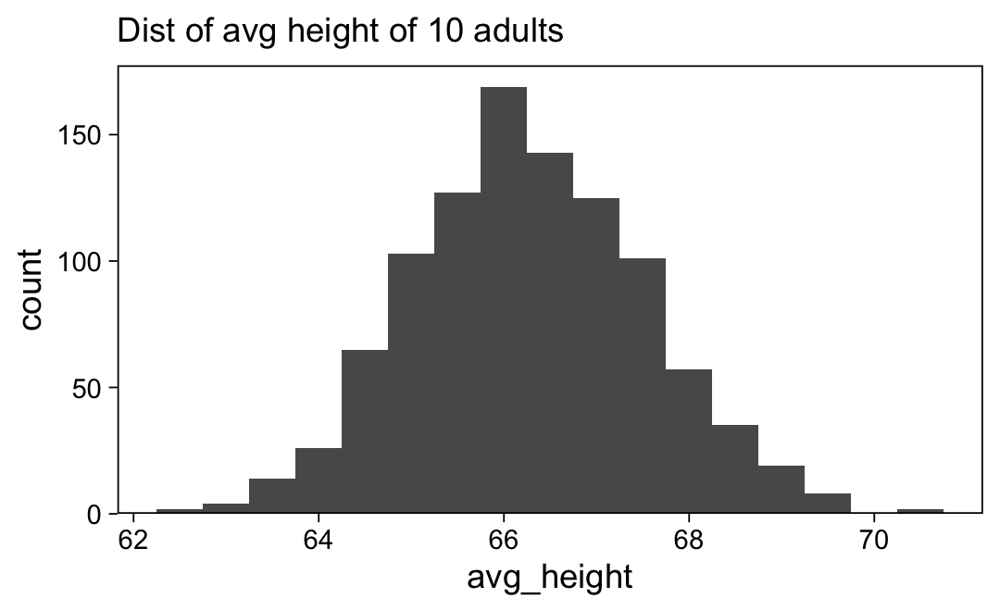
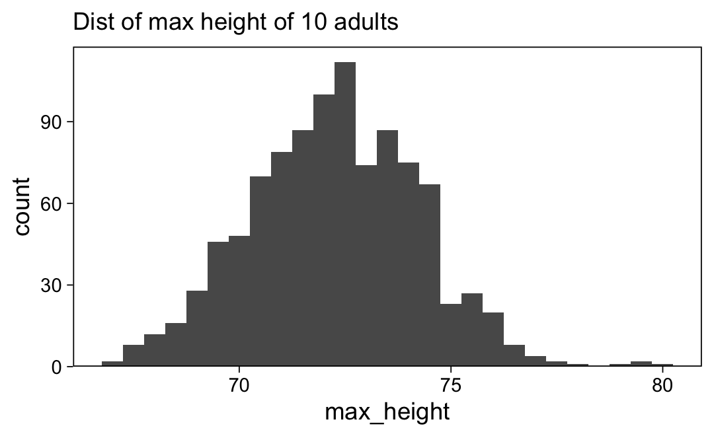
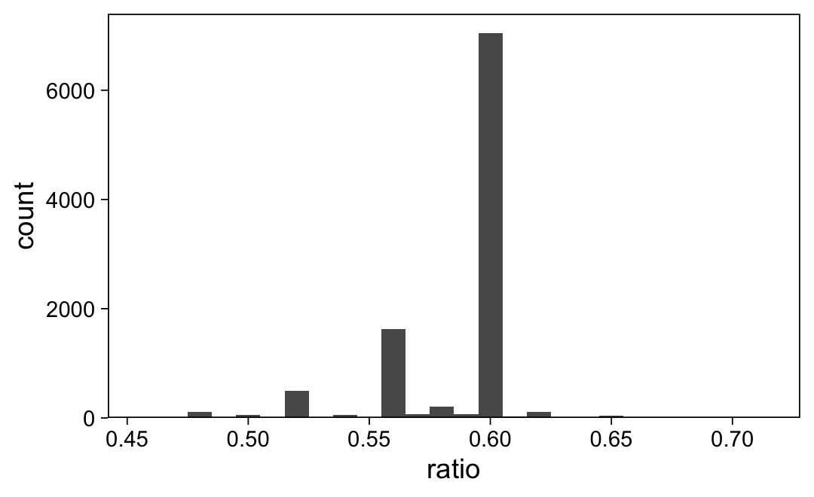

Chapter 5: Simulation
================
A Solomon Kurz
2020-12-21

# Simulation

> Simulation of random variables is important in applied statistics for
> several reasons. First, we use probability models to mimic variation
> in the world, and the tools of simulation can help us better
> understand how this variation plays out. Patterns of randomness are
> notoriously contrary to normal human thinking–our brains don’t seem to
> be able to do a good job understanding that random swings will be
> present in the short term but average out in the long run–and in many
> cases simulation is a big help in training our intuitions about
> averages and variation. Second, we can use simulation to approximate
> the sampling distribution of data and propagate this to the sampling
> distribution of statistical estimates and procedures. Third,
> regression models are not deterministic; they produce probabilistic
> predictions. Simulation is the most convenient and general way to
> represent uncertainties in forecasts. (p. 69)

## 5.1 Simulation of discrete probability models

### 5.1.1 How many girls in 400 births?

Across the world the probability a baby will be born a girl is about
48.8%, with the probability of a boy then being about 51.2%. If you
wanted to get a sense of how many girls you’d expect out of 400 births,
you could simulate using the `rbinom()` function.

``` r
set.seed(5)

rbinom(n = 1, size = 400, prob = .488)
```

    ## [1] 188

Using the `set.seed()` function makes the result of the pseudorandom
number generator reproducible. Now we’ll increase the number in the `n`
argument to 1,000 to show the distribution of what happens when you do
this many times. We’ll nest the results within a tibble, which will
facilitate plotting the distribution using **ggplot2**.

``` r
library(tidyverse)

# set the global plotting theme
theme_set(theme_linedraw() +
            theme(panel.grid = element_blank()))

# set the seed
set.seed(5)

# simulate
tibble(girls = rbinom(n = 1000, size = 400, prob = .488)) %>% 
  
  # plot
  ggplot(aes(x = girls)) +
  geom_histogram(binwidth = 5) +
  scale_x_continuous("# girls out of 400", breaks = 7:9 * 25) +
  scale_y_continuous(expand = expansion(mult = c(0, 0.05)))
```



Unlike in the text, we will generally avoid working with loops.

### 5.1.2 Accounting for twins.

Now consider there’s a 1 in 125 chance a birth event will be for
fraternal twins, each of which would have approximately a 49.5% chance
of being a girl. Furthermore, there’s about a 1 in 300 chance of
identical twins, which would have about a 49.5% chance of yielding a
pair of girls. This yields two classes of probabilities: the probability
of the type of birth, and the probability the baby/babies will be girls,
within each type. We’ll model the first type of probability with the
`sample()` function and the second type with `rbinom()`.

``` r
size <- 400

set.seed(5)

d <-
  tibble(birth_type = sample(c("fraternal twin", "identical twin", "single birth"),
                             size = size, 
                             replace = T, 
                             prob = c(1/125, 1/300, 1 - 1/125 - 1/300))) %>% 
  mutate(girls = ifelse(birth_type == "single birth", 
                        rbinom(n = size, size = 1, prob = .488),
                        ifelse(birth_type == "identical twin", 
                               2 * rbinom(n = size, size = 1, prob = .495),
                               rbinom(n = size, size = 2, prob = .495))))
```

We now have a 400-row tibble in which the `girls` column contains a
series of 0’s, 1’s, and 2’s. Here’s the count.

``` r
d %>% 
  count(girls)
```

    ## # A tibble: 3 x 2
    ##   girls     n
    ##   <int> <int>
    ## 1     0   201
    ## 2     1   198
    ## 3     2     1

Here’s the grand total of girls.

``` r
d %>% 
  summarise(n_girls = sum(girls))
```

    ## # A tibble: 1 x 1
    ##   n_girls
    ##     <int>
    ## 1     200

To change our code to make each row a simulation for which \(n = 400\),
we just need to replace all those `size = 1` arguments with `size =
size`, where we have already defined `size <- 400`.

``` r
size <- 400

set.seed(5)

d <-
  tibble(birth_type = sample(c("fraternal twin", "identical twin", "single birth"),
                             size = 1000, 
                             replace = T, 
                             prob = c(1/125, 1/300, 1 - 1/125 - 1/300))) %>% 
  mutate(girls = ifelse(birth_type == "single birth", 
                        rbinom(n = 1000, size = size, prob = .488),
                        ifelse(birth_type == "identical twin", 
                               2 * rbinom(n = 1000, size = size, prob = .495),
                               rbinom(n = 1000, size = size, prob = .495))))

d
```

    ## # A tibble: 1,000 x 2
    ##    birth_type   girls
    ##    <chr>        <int>
    ##  1 single birth   202
    ##  2 single birth   201
    ##  3 single birth   210
    ##  4 single birth   191
    ##  5 single birth   190
    ##  6 single birth   189
    ##  7 single birth   204
    ##  8 single birth   193
    ##  9 single birth   183
    ## 10 single birth   205
    ## # … with 990 more rows

Now plot the results in Figure 5.1.

``` r
d %>% 
  ggplot(aes(x = girls)) +
  geom_histogram(binwidth = 5) +
  scale_x_continuous("# girls out of 400", breaks = 7:9 * 25) +
  scale_y_continuous(expand = expansion(mult = c(0, 0.05)))
```



## 5.2 Simulation of continuous and mixed discrete/continuous models

Here’s the simulation.

``` r
n_sims <- 1000

set.seed(5)

d <-
  tibble(y1 = rnorm(n_sims, mean = 3, sd = 0.5)) %>% 
  mutate(y2 = exp(y1),
         y3 = rbinom(n_sims, size = 20, prob = .6),
         y4 = rpois(n_sims, lambda = 5))


head(d)
```

    ## # A tibble: 6 x 4
    ##      y1    y2    y3    y4
    ##   <dbl> <dbl> <int> <int>
    ## 1  2.58  13.2    15     8
    ## 2  3.69  40.1    11     7
    ## 3  2.37  10.7     9     5
    ## 4  3.04  20.8    10     5
    ## 5  3.86  47.3    13    11
    ## 6  2.70  14.9    10     3

Now summarize each in a histogram and combine them to make Figure 5.2.

``` r
p1 <-
  d %>% 
  ggplot(aes(x = y1)) +
  geom_histogram(binwidth = 0.2) +
  labs(subtitle = "1000 draws from normal dist with dist. with mean 3, sd 0.5") +
  coord_cartesian(xlim = c(1, 5))

p2 <-
  d %>% 
  ggplot(aes(x = y2)) +
  geom_histogram(binwidth = 5, boundary = 0) +
  scale_x_continuous(expand = expansion(mult = c(0, 0.05)),
                     limits = c(0, NA), breaks = 0:5 * 20) +
  labs(subtitle = "1000 draws from corresponding lognormal dist.")

p3 <-
  d %>% 
  ggplot(aes(x = y3)) +
  geom_histogram(binwidth = 1, boundary = 0) +
  scale_x_continuous(expand = c(0, 0)) +
  labs(subtitle = "1000 draws from binomial dist. with 20 tries, probability 0.6") +
  coord_cartesian(xlim = c(0, 20))

p4 <-
  d %>% 
  ggplot(aes(x = y4)) +
  geom_histogram(binwidth = 1, boundary = 0) +
  scale_x_continuous(expand = expansion(mult = c(0, 0.05)),
                     breaks = 0:7 * 2) +
  labs(subtitle = "1000 draws from Poisson dist. with mean 5") +
  coord_cartesian(xlim = c(0, NA)) +
  theme()

library(patchwork)

(p1 + p2 + p3 + p4) &
  scale_y_continuous("Frequency", limits = c(0, NA),
                     expand = expansion(mult = c(0, 0.05))) &
  theme(plot.subtitle = element_text(size = 9)) &
  plot_annotation(title = "Histograms of 1000 simulated values from four distributions, demonstrating the ability to draw\nfrom continuous and discrete random variables in R.")
```



Here is the code to simulate the hight of one randomly chosen adult.

``` r
set.seed(5)

tibble(male = rbinom(1, size = 1, prob = .48)) %>%
  mutate(height = ifelse(male == 1, 
                         rnorm(1, mean = 69.1, sd = 2.9), 
                         rnorm(1, mean = 63.7, sd = 2.7)))
```

    ## # A tibble: 1 x 2
    ##    male height
    ##   <int>  <dbl>
    ## 1     0   65.0

Here’s you might simulate ten adults and then take the average of their
heights.

``` r
# how many would you like?
n <- 10

set.seed(5)

tibble(male = rbinom(n, size = 1, prob = .48)) %>%
  mutate(height = ifelse(male == 1, 
                         rnorm(n, mean = 69.1, sd = 2.9), 
                         rnorm(n, mean = 63.7, sd = 2.7))) %>% 
  summarise(avg_height = mean(height))
```

    ## # A tibble: 1 x 1
    ##   avg_height
    ##        <dbl>
    ## 1       66.6

To simulate the distributions of many average heights based off of
\(n = 10\) each, we’ll first wrap the above code into a custom function.

``` r
sim_heights <- function(seed = 1, n = 10) {
  
  set.seed(seed)

  tibble(male = rbinom(n, size = 1, prob = .48)) %>%
    mutate(height = ifelse(male == 1, 
                           rnorm(n, mean = 69.1, sd = 2.9), 
                           rnorm(n, mean = 63.7, sd = 2.7))) %>% 
    summarise(avg_height = mean(height)) %>% 
    pull(avg_height)

}
```

Now we’ll iterate that custom function within a nested tibble framework.
The initial `seed` column will serve a double purpose as both the seed
value for the pseudorandom number generators in each iteration and as
the iteration index.

``` r
d <-
  tibble(seed = 1:1000) %>% 
  mutate(avg_height = map_dbl(seed, sim_heights))

head(d)
```

    ## # A tibble: 6 x 2
    ##    seed avg_height
    ##   <int>      <dbl>
    ## 1     1       67.4
    ## 2     2       67.4
    ## 3     3       66.5
    ## 4     4       68.1
    ## 5     5       66.6
    ## 6     6       66.1

Here’s the histogram.

``` r
d %>% 
  ggplot(aes(x = avg_height)) +
  geom_histogram(binwidth = .5) +
  scale_y_continuous(limits = c(0, NA), expand = expansion(mult = c(0, 0.05))) +
  labs(subtitle = "Dist of avg height of 10 adults")
```



Here’s the process for simulating maximum heights, instead.

``` r
# adjust the simulation function
sim_heights <- function(seed = 1, n = 10) {
  
  set.seed(seed)

  tibble(male = rbinom(n, size = 1, prob = .48)) %>%
    mutate(height = ifelse(male == 1, 
                           rnorm(n, mean = 69.1, sd = 2.9), 
                           rnorm(n, mean = 63.7, sd = 2.7))) %>% 
    # the next two lines are different from the original code
    summarise(max_height = max(height)) %>% 
    pull(max_height)

}

# simulate the data
tibble(seed = 1:1000) %>% 
  mutate(max_height = map_dbl(seed, sim_heights)) %>%
  
  # plot!
  ggplot(aes(x = max_height)) +
  geom_histogram(binwidth = .5) +
  scale_y_continuous(limits = c(0, NA), expand = expansion(mult = c(0, 0.05))) +
  labs(subtitle = "Dist of max height of 10 adults")
```



### 5.2.1 Simulation in R using custom-made functions.

Our code above already incorporated custom-made functions. But instead
of nesting those functions into the `replicate()` function, we iterated
with them using `purrr::map()`.

## 5.3 Summarizing a set of simulations using median and median absolute deviation

Though one can investigate simulations using plots, as above, it can be
helpful to summarize them in terms of location (central tendency) and
scale (spread). Location is often assessed using the mean (`mean()`) or
median (`median()`). Standard deviation (`sd()`) and its square,
variance (`var()`), are the most popular ways to assess spread. However,
Gelman and colleagues also like the *median absolute deviation*.

> If the median of a set of simulations \(z_1, \dots, z_n\), is \(M\),
> then the median absolute deviation is
> \(\operatorname{mad} = \operatorname{median}_{i=1}^n |z_i - M|\).
> However, because we are so used to working with standard deviations,
> when we compute the median absolute deviation, we then rescale it by
> multiplying by 1.483, which reproduces the standard deviation in the
> special case of the normal distribution. We call this the “mad sd”
> (p. 73).

The mad sd is available with the base **R** function `mad()`. If you
execute `?mad`, you’ll see one of the arguments is `constant`, the
default for which is `1.4826`. One can also compute the mad sd by hand
with `1.4826 * median(abs(z - median(z)))`, where `z` is a vector of
values.

Here we simulate 10,000 draws from \(\mathcal N(5, 2)\) and then compute
the mean, median, standard deviation and mad sd using the
above-mentioned base **R** funcitons.

``` r
set.seed(5)

z <- rnorm(1e4, 5, 2)

cat("mean =", mean(z), ", median =", median(z), ", sd =", sd(z), ", mad sd =", mad(z))
```

    ## mean = 5.003621 , median = 4.98867 , sd = 2.024495 , mad sd = 2.025838

The `cat()` function allowed us to concatenate the values and then
print. Here’s how to compute the mad sd by hand.

``` r
1.4826 * median(abs(z - median(z)))
```

    ## [1] 2.025838

If we wanted to work with a **tidyverse**-oriented flow, we might
execute something like this.

``` r
set.seed(5)

tibble(z = rnorm(1e4, mean = 5, sd = 2)) %>% 
  summarise(mean   = mean(z),
            median = median(z),
            sd     = sd(z),
            mad_sd = mad(z))
```

    ## # A tibble: 1 x 4
    ##    mean median    sd mad_sd
    ##   <dbl>  <dbl> <dbl>  <dbl>
    ## 1  5.00   4.99  2.02   2.03

“The standard deviation of the mean of \(N\) draws from a distribution
is simply the standard deviation of the distribution divided by
\(\sqrt{N}\)” (p. 73). For the simulation above, that would be
\(2.02 / \sqrt{10{,}000} = 0.0202\). When we fit a regression model
using `brms::brm()`, the coefficients are typically summarized by their
mean, standard deviation, and percentile-based 95% intervals. However,
it is also possible to substitute the mean for the median and the
standard deviation for the mad sd.

We can compute quantile-based intervals using the base **R**
`quantile()` function. Here are the 50% and 95% intervals for `z`.

``` r
# 50%
quantile(z, probs = c(.25, .75))
```

    ##      25%      75% 
    ## 3.637415 6.373453

``` r
# 95%
quantile(z, probs = c(.025, .975))
```

    ##     2.5%    97.5% 
    ## 1.026670 9.069093

## 5.4 Bootstrapping to simulate a sampling distribution

The *bootstrapping* approach allows us to express uncertainty by taking
samples from a preexisting data source. In these instances, the
resamples are done with replacement, meaning that a given case in the
data can be samples multiple times in a given iteration, whereas other
cases might not be resamples in a given iteration. This insures the
\(n\) will be the same across iterations.

Load the `earnings.csv` data.

``` r
earnings <- read_csv("ROS-Examples-master/Earnings/data/earnings.csv")

head(earnings)
```

    ## # A tibble: 6 x 15
    ##   height weight  male  earn earnk ethnicity education mother_education
    ##    <dbl>  <dbl> <dbl> <dbl> <dbl> <chr>         <dbl>            <dbl>
    ## 1     74    210     1 50000    50 White            16               16
    ## 2     66    125     0 60000    60 White            16               16
    ## 3     64    126     0 30000    30 White            16               16
    ## 4     65    200     0 25000    25 White            17               17
    ## 5     63    110     0 50000    50 Other            16               16
    ## 6     68    165     0 62000    62 Black            18               18
    ## # … with 7 more variables: father_education <dbl>, walk <dbl>, exercise <dbl>,
    ## #   smokenow <dbl>, tense <dbl>, angry <dbl>, age <dbl>

Here is the ratio of median `earn` values, by `male`.

``` r
earnings %>% 
  summarise(ratio = median(earn[male == 0]) / median(earn[male == 1]))
```

    ## # A tibble: 1 x 1
    ##   ratio
    ##   <dbl>
    ## 1   0.6

This means the median earnings of women in this sample are 60% of that
for men.

``` r
n <- nrow(earnings)

earnings %>% 
  slice_sample(n = n, replace = T) %>% 
  summarise(ratio = median(earn[male == 0]) / median(earn[male == 1]))
```

    ## # A tibble: 1 x 1
    ##   ratio
    ##   <dbl>
    ## 1   0.6

We’ll make an adjusted `boot_ratio()` function designed for use within
`purrr::map_dbl()`.

``` r
boot_ratio <- function(seed) {
  
  set.seed(seed)
  
  n <- nrow(earnings)
  
  earnings %>% 
    slice_sample(n = n, replace = T) %>% 
    summarise(ratio = median(earn[male == 0]) / median(earn[male == 1])) %>% 
    pull(ratio)
  
}
```

Run the simulation for 10,000 iterations.

``` r
n_sims <- 10000

d <-
  tibble(seed = 1:n_sims) %>% 
  mutate(ratio = map_dbl(seed, boot_ratio))
```

Here’s a histogram of the `ratio` results.

``` r
d %>% 
  ggplot(aes(x = ratio)) +
  geom_histogram(binwidth = .01) +
  scale_y_continuous(limits = c(0, NA), expand = expansion(mult = c(0, 0.05)))
```



Here’s the standard deviation.

``` r
d %>% 
  summarise(sd = sd(ratio))
```

    ## # A tibble: 1 x 1
    ##       sd
    ##    <dbl>
    ## 1 0.0270

The standard deviation from a bootstrapped sample can be called the
bootstrap standard error. Thus, we might say the ratio has a standard
error of about 0.03.

### 5.4.1 Choices in defining the bootstrap distribution.

Given a simple regression model
\(y_i = \beta_0 + \beta_1 x_i + \epsilon_i\), one can simply resample
the data \((x, y)i\). Alternatively, you might resample the residuals
from the model, \(r_i = y_i - (\hat \beta_0 + \hat \beta_1 x_i)\). You’d
then add the residuals back to create bootstrapped data,
\(y^\text{boot} = X_i \hat \beta + r_i^\text{boot}\). You could do this
once for a single bootstrapped data set or many times to get the
bootstrapped sampling distribution. Things get more complicated with
complex data.

#### 5.4.1.1 Timeseries.

Consider time series \((t, y)i\) data for which \(y_i, \dots, y_n\) are
structured in time \(t_i, \dots t_t\). Simple resampling would jumble
the time structure in undesirable ways.

#### 5.4.1.2 Multilevel structure.

Given data where cases are nested within many groups, one might resample
cases, resample groups, or sequentially resample groups first and then
cases second.

> These three choices correspond to different sampling models and yield
> different bootstrap standard errors for estimates of interest. Similar
> questions arise when there are multiple observations on each person in
> a dataset: Should people be resampled, or observations, or both?
> (p. 75)

#### 5.4.1.3 Discrete data.

In simple logistic regression with binary data–which is the same as
\(\operatorname{binomial}(p_i, n)\), where \(n = 1\) across cases–,
simply resmapling the data \((x, y)i\) can work. But when working with
binomial data \((x, n, y)i\), for which \(n\) varies across cases,
choices expand. You might resample clusters \((x, n, y)i\). You might
also disaggregate the data so that each cluster is depicted by \(n\)
data points, which would transform \((x_i, n_i, y_i)\) into “\(y_i\)
observations of the form \((x_i, 1)\) and \(n_i − y_i\) observations of
the form \((x_i, 0)\), and then bundle these all into a logistic
regression with \(\sum_i n_i\) data points” (p. 75). Then you’d apply
the boostrap.

### 5.4.2 Limitations of bootstrapping.

> One of the appeals of the bootstrap is its generality. Any estimate
> can be bootstrapped; all that is needed are an estimate and a sampling
> distribution. The very generality of the bootstrap creates both
> opportunity and peril, allowing researchers to solve otherwise
> intractable problems but also sometimes leading to an answer with an
> inappropriately high level of certainty. (p. 75)

## 5.5 Fake-data simulation as a way of life

“The point of the fake-data simulation is not to provide insight into
the data or the real-world problem being studied, but rather to evaluate
the properties of the statistical methods being used, given an assumed
generative model” (p. 76)

## Session info

``` r
sessionInfo()
```

    ## R version 4.0.3 (2020-10-10)
    ## Platform: x86_64-apple-darwin17.0 (64-bit)
    ## Running under: macOS Catalina 10.15.7
    ## 
    ## Matrix products: default
    ## BLAS:   /Library/Frameworks/R.framework/Versions/4.0/Resources/lib/libRblas.dylib
    ## LAPACK: /Library/Frameworks/R.framework/Versions/4.0/Resources/lib/libRlapack.dylib
    ## 
    ## locale:
    ## [1] en_US.UTF-8/en_US.UTF-8/en_US.UTF-8/C/en_US.UTF-8/en_US.UTF-8
    ## 
    ## attached base packages:
    ## [1] stats     graphics  grDevices utils     datasets  methods   base     
    ## 
    ## other attached packages:
    ##  [1] patchwork_1.1.0 forcats_0.5.0   stringr_1.4.0   dplyr_1.0.2    
    ##  [5] purrr_0.3.4     readr_1.4.0     tidyr_1.1.2     tibble_3.0.4   
    ##  [9] ggplot2_3.3.2   tidyverse_1.3.0
    ## 
    ## loaded via a namespace (and not attached):
    ##  [1] tidyselect_1.1.0  xfun_0.19         haven_2.3.1       colorspace_2.0-0 
    ##  [5] vctrs_0.3.5       generics_0.1.0    htmltools_0.5.0   yaml_2.2.1       
    ##  [9] utf8_1.1.4        rlang_0.4.9       pillar_1.4.7      glue_1.4.2       
    ## [13] withr_2.3.0       DBI_1.1.0         dbplyr_2.0.0      modelr_0.1.8     
    ## [17] readxl_1.3.1      lifecycle_0.2.0   munsell_0.5.0     gtable_0.3.0     
    ## [21] cellranger_1.1.0  rvest_0.3.6       evaluate_0.14     labeling_0.4.2   
    ## [25] knitr_1.30        fansi_0.4.1       broom_0.7.2       Rcpp_1.0.5       
    ## [29] scales_1.1.1      backports_1.2.0   jsonlite_1.7.1    farver_2.0.3     
    ## [33] fs_1.5.0          hms_0.5.3         digest_0.6.27     stringi_1.5.3    
    ## [37] grid_4.0.3        cli_2.2.0         tools_4.0.3       magrittr_2.0.1   
    ## [41] crayon_1.3.4      pkgconfig_2.0.3   ellipsis_0.3.1    xml2_1.3.2       
    ## [45] reprex_0.3.0      lubridate_1.7.9.2 assertthat_0.2.1  rmarkdown_2.5    
    ## [49] httr_1.4.2        rstudioapi_0.13   R6_2.5.0          compiler_4.0.3
