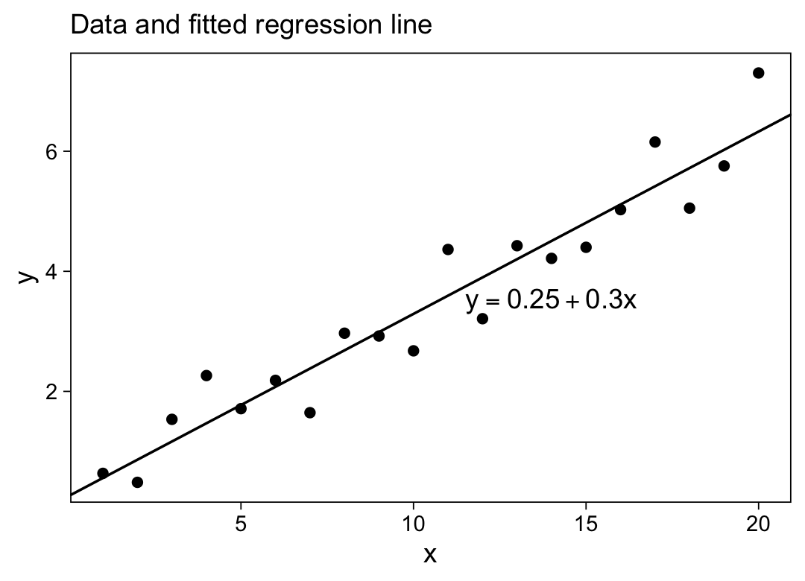
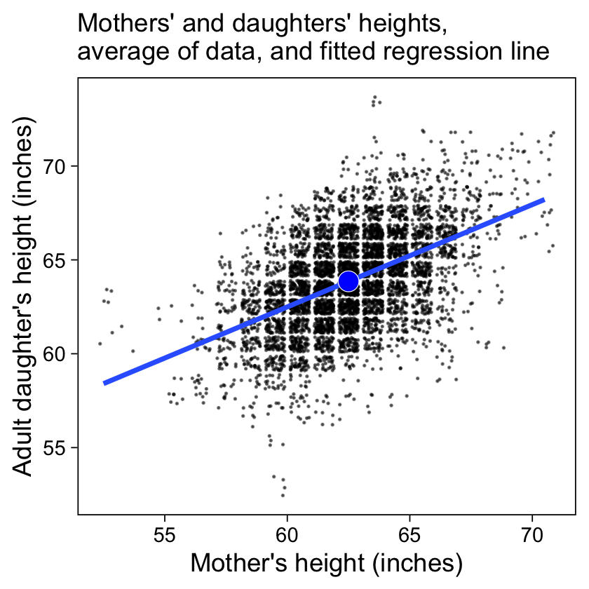
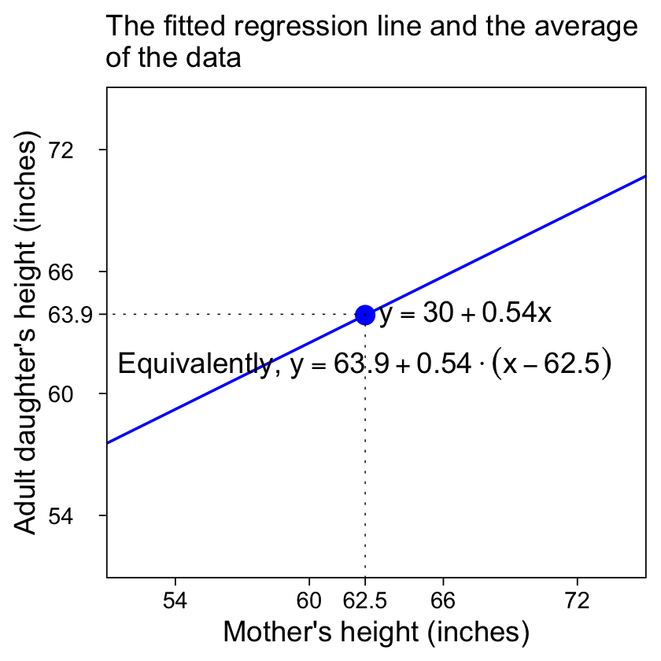
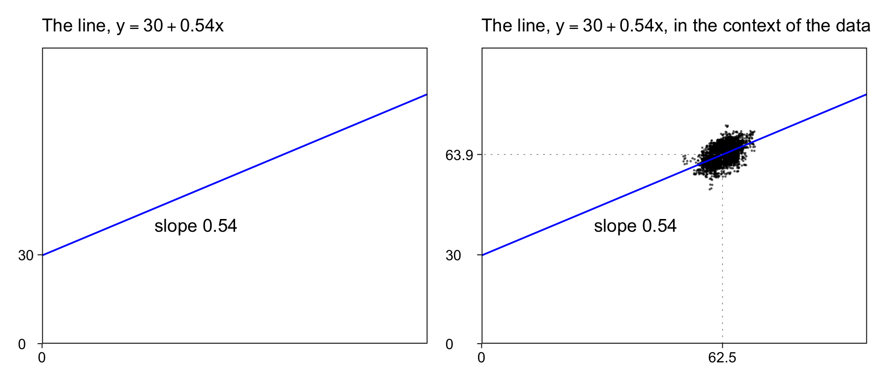
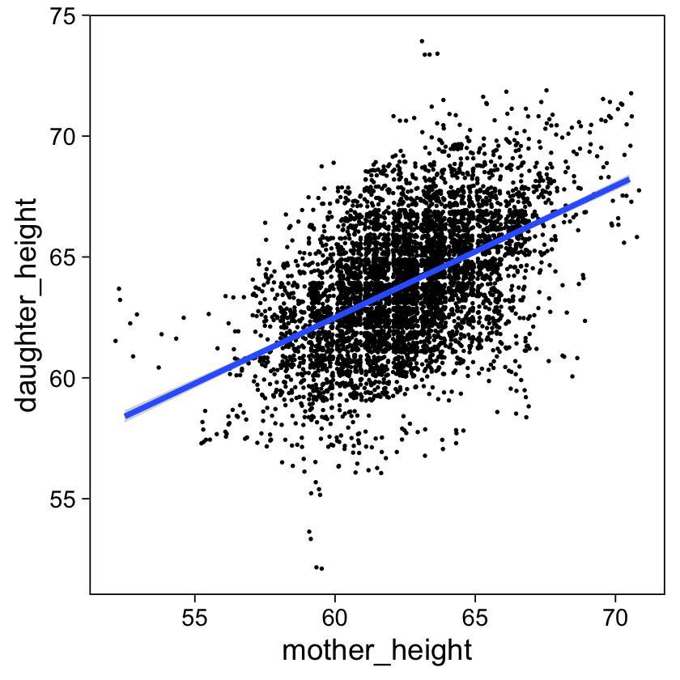
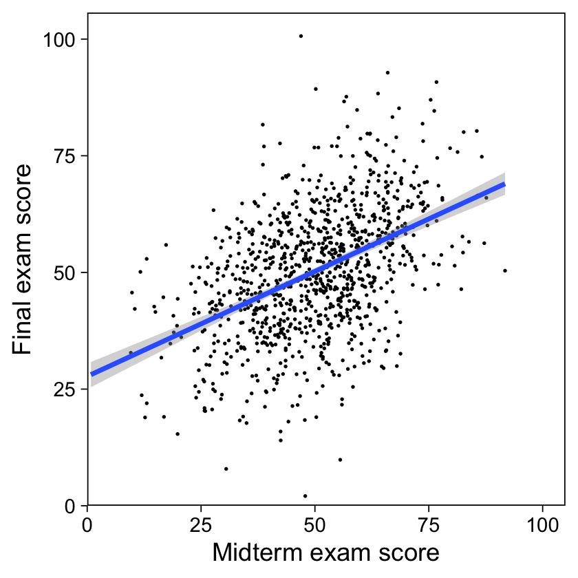

Chapter 6: Background on regression modeling
================
A Solomon Kurz
2020-12-21

# Background on regression modeling

“At a purely mathematical level, the methods described in this book have
two purposes: prediction and comparison” (p. 81)

## 6.1 Regression models

The basic univariate univariable regression model follows the form

\[y = a + bx + \text{error},\]

where \(y\) is the criterion, \(x\) is the predictor, \(a\) is the
intercept, \(b\) is the slope, \(a\) and \(b\) are the coefficients, and
\(\text{error}\) is the variability in \(y\) not captured by the linear
model. By convention,
\(\text{error} \sim \operatorname{Normal}(0, \sigma)\).

We can expand to a multivariable model (i.e., one with multiple
predictor variables) with \(K\) predictors,

\[y = \beta_0 + \beta_1 x_1 + \beta_2 x_2 + \cdots + \beta_k x_k + \text{error},\]

which we might express in vector-matrix notation as
\(y = X \beta + \text{error}\).

We can write nonlinear models might be expressed in any number of ways,
such as

\[\log y = a + b \log x + \text{error}.\]

We can write non-additive interaction models as

\[y = \beta_0 + \beta_1 x_1 + \beta_2 x_2 + \beta_3 x_1 x_2 + \text{error},\]

where the coefficient \(\beta_3\) is multiplied by the *interaction
term*, \(x_1 x_2\).

Generalized linear models expand our abilities from modeling simple
continuous variables with Gaussian error distributions to other kinds of
data, such as binary, nominal, ordered categorical, counts, and so on.

## 6.2 Fitting a simple regression to fake data

Rather than **rstanarm**, we’ll be using **brms**, which also uses the
Stan statistical inference engine under the hood.

``` r
library(brms)
```

Now simulate \(y_i\) for \(n = 20\) cases, based on the model
\(y_i = a + b x_i + \epsilon_i\), where \(x_i\) takes on integers
ranging from 1 to 20.

``` r
library(tidyverse)

a <- 0.2
b <- 0.3
sigma <- 0.5

set.seed(6)

d <-
  tibble(x = 1:20) %>% 
  mutate(y = a + b * x + sigma * rnorm(n(), mean = 0, sd = 1))

d
```

    ## # A tibble: 20 x 2
    ##        x     y
    ##    <int> <dbl>
    ##  1     1 0.635
    ##  2     2 0.485
    ##  3     3 1.53 
    ##  4     4 2.26 
    ##  5     5 1.71 
    ##  6     6 2.18 
    ##  7     7 1.65 
    ##  8     8 2.97 
    ##  9     9 2.92 
    ## 10    10 2.68 
    ## 11    11 4.36 
    ## 12    12 3.21 
    ## 13    13 4.43 
    ## 14    14 4.22 
    ## 15    15 4.40 
    ## 16    16 5.03 
    ## 17    17 6.15 
    ## 18    18 5.05 
    ## 19    19 5.76 
    ## 20    20 7.30

### 6.2.1 Fitting a regression and displaying the results.

We’ve already saved our data in a tibble called `d`. If you want, you
can rename it `fake`, like so.

``` r
fake <- d
```

If we rely heavily on the default settings, we can fit the simple linear
model with `brms::brm()` in one line of code.

``` r
m6.1 <- brm(data = d, y ~ x)
```

The `print()` function will summarize the results.

``` r
print(m6.1)
```

    ##  Family: gaussian 
    ##   Links: mu = identity; sigma = identity 
    ## Formula: y ~ x 
    ##    Data: d (Number of observations: 20) 
    ## Samples: 4 chains, each with iter = 2000; warmup = 1000; thin = 1;
    ##          total post-warmup samples = 4000
    ## 
    ## Population-Level Effects: 
    ##           Estimate Est.Error l-95% CI u-95% CI Rhat Bulk_ESS Tail_ESS
    ## Intercept     0.25      0.27    -0.28     0.80 1.00     3746     2706
    ## x             0.30      0.02     0.26     0.35 1.00     3789     2854
    ## 
    ## Family Specific Parameters: 
    ##       Estimate Est.Error l-95% CI u-95% CI Rhat Bulk_ESS Tail_ESS
    ## sigma     0.58      0.11     0.42     0.84 1.00     2893     2675
    ## 
    ## Samples were drawn using sampling(NUTS). For each parameter, Bulk_ESS
    ## and Tail_ESS are effective sample size measures, and Rhat is the potential
    ## scale reduction factor on split chains (at convergence, Rhat = 1).

The `summary()` function yields the same results. If you desire to
summarize the location with the median and the spread with the mad sd,
you can set `robust = TRUE`.

``` r
print(m6.1, robust = T)
```

    ##  Family: gaussian 
    ##   Links: mu = identity; sigma = identity 
    ## Formula: y ~ x 
    ##    Data: d (Number of observations: 20) 
    ## Samples: 4 chains, each with iter = 2000; warmup = 1000; thin = 1;
    ##          total post-warmup samples = 4000
    ## 
    ## Population-Level Effects: 
    ##           Estimate Est.Error l-95% CI u-95% CI Rhat Bulk_ESS Tail_ESS
    ## Intercept     0.25      0.25    -0.28     0.80 1.00     3746     2706
    ## x             0.30      0.02     0.26     0.35 1.00     3789     2854
    ## 
    ## Family Specific Parameters: 
    ##       Estimate Est.Error l-95% CI u-95% CI Rhat Bulk_ESS Tail_ESS
    ## sigma     0.57      0.10     0.42     0.84 1.00     2893     2675
    ## 
    ## Samples were drawn using sampling(NUTS). For each parameter, Bulk_ESS
    ## and Tail_ESS are effective sample size measures, and Rhat is the potential
    ## scale reduction factor on split chains (at convergence, Rhat = 1).

We can also extract the summaries for the \(a\) and \(b\) coefficients
using the `fixef()` functions, wich will be our analogue to the `coef()`
function used in the text.

``` r
fixef(m6.1)
```

    ##            Estimate  Est.Error       Q2.5     Q97.5
    ## Intercept 0.2545387 0.27147714 -0.2804403 0.7980465
    ## x         0.3037014 0.02235088  0.2593013 0.3473404

Now use those skills to make Figure 6.1.

``` r
# set the global plotting theme
theme_set(theme_linedraw() +
            theme(panel.grid = element_blank()))

d %>% 
  ggplot(aes(x = x, y = y)) +
  geom_abline(intercept = fixef(m6.1)[1, 1], slope = fixef(m6.1)[2, 1]) +
  geom_point() +
  annotate(geom = "text",
           x = 14, y = 3.5,
           label = expression(y==0.25+0.30*x)) +
  labs(subtitle = "Data and fitted regression line")
```



### 6.2.2 Comparing estimates to assumed parameter values.

Here we make our version of the table in Figure 6.2.

``` r
posterior_summary(m6.1, robust = T)[1:3, 1:2] %>% 
  round(digits = 2) %>% 
  data.frame() %>% 
  rename(Uncertainty = Est.Error) %>% 
  mutate(Parameter = c("a", "b", "sigma")) %>% 
  mutate(`Assumed value` = map_dbl(Parameter, get)) %>% 
  select(Parameter, `Assumed value`, Estimate, Uncertainty)
```

    ##   Parameter Assumed value Estimate Uncertainty
    ## 1         a           0.2     0.25        0.25
    ## 2         b           0.3     0.30        0.02
    ## 3     sigma           0.5     0.57        0.10

## 6.3 Interpret coefficients as comparisons, not effects

Load the `earnings.csv` data.

``` r
earnings <- 
  read_csv("ROS-Examples-master/Earnings/data/earnings.csv") %>% 
  mutate(earnk = earn / 1000)

glimpse(earnings)
```

    ## Rows: 1,816
    ## Columns: 15
    ## $ height           <dbl> 74, 66, 64, 65, 63, 68, 63, 64, 62, 73, 72, 72, 72, …
    ## $ weight           <dbl> 210, 125, 126, 200, 110, 165, 190, 125, 200, 230, 17…
    ## $ male             <dbl> 1, 0, 0, 0, 0, 0, 0, 0, 0, 1, 1, 1, 1, 1, 0, 1, 1, 1…
    ## $ earn             <dbl> 50000, 60000, 30000, 25000, 50000, 62000, 51000, 900…
    ## $ earnk            <dbl> 50.00, 60.00, 30.00, 25.00, 50.00, 62.00, 51.00, 9.0…
    ## $ ethnicity        <chr> "White", "White", "White", "White", "Other", "Black"…
    ## $ education        <dbl> 16, 16, 16, 17, 16, 18, 17, 15, 12, 17, 15, NA, 12, …
    ## $ mother_education <dbl> 16, 16, 16, 17, 16, 18, 17, 15, 12, 17, 15, 99, 12, …
    ## $ father_education <dbl> 16, 16, 16, NA, 16, 18, 17, 15, 12, 17, 15, 99, 12, …
    ## $ walk             <dbl> 3, 6, 8, 8, 5, 1, 3, 7, 2, 7, 8, 1, 1, 4, 7, 7, 6, 4…
    ## $ exercise         <dbl> 3, 5, 1, 1, 6, 1, 1, 4, 2, 1, 1, 1, 2, 1, 4, 4, 5, 6…
    ## $ smokenow         <dbl> 2, 1, 2, 2, 2, 2, 2, 1, 2, 1, 2, 2, 2, 2, 2, 2, 2, 2…
    ## $ tense            <dbl> 0, 0, 1, 0, 0, 2, 4, 4, 0, 0, 0, 0, 1, 0, 2, 0, 2, 0…
    ## $ angry            <dbl> 0, 0, 1, 0, 0, 2, 4, 4, 0, 0, 0, 0, 1, 0, 2, 0, 2, 0…
    ## $ age              <dbl> 45, 58, 29, 57, 91, 54, 39, 26, 49, 46, 21, 53, 26, …

This time we’ll add a couple more arguments to the `brm()` function. The
`seed` argument will make the results more reproducible and the `file`
argument will automatically save the fit as an external file.

``` r
m6.2 <-
  brm(data = earnings,
      earnk ~ height + male,
      seed = 6,
      file = "fits/m06.02")
```

Check the summary.

``` r
print(m6.2, robust = T, digits = 1)
```

    ##  Family: gaussian 
    ##   Links: mu = identity; sigma = identity 
    ## Formula: earnk ~ height + male 
    ##    Data: earnings (Number of observations: 1816) 
    ## Samples: 4 chains, each with iter = 2000; warmup = 1000; thin = 1;
    ##          total post-warmup samples = 4000
    ## 
    ## Population-Level Effects: 
    ##           Estimate Est.Error l-95% CI u-95% CI Rhat Bulk_ESS Tail_ESS
    ## Intercept    -26.2      12.0    -50.3     -2.2  1.0     3036     2611
    ## height         0.7       0.2      0.3      1.0  1.0     2982     2608
    ## male          10.6       1.5      7.6     13.5  1.0     2809     2637
    ## 
    ## Family Specific Parameters: 
    ##       Estimate Est.Error l-95% CI u-95% CI Rhat Bulk_ESS Tail_ESS
    ## sigma     21.4       0.4     20.7     22.1  1.0     3295     2573
    ## 
    ## Samples were drawn using sampling(NUTS). For each parameter, Bulk_ESS
    ## and Tail_ESS are effective sample size measures, and Rhat is the potential
    ## scale reduction factor on split chains (at convergence, Rhat = 1).

Rounding and ignoring the estimate for \(\epsilon\), we can use this to
express the linear model as

\[\text{earnk}_i = -26.2 + 0.7 \times \text{height}_i + 10.6 \times \text{male}_i + \text{error}.\]

The ‘Estimate’ for sigma in our `print()` output, 21.4, suggests the
`earnk` values wll be within \(\pm\) 21.4 of the linear predictions
about 68% of the time and within \(\pm\) of \(2 \times 21.4 = 42.8\) of
the linear predictions about 95% of the time. We get those percentiles
based on the conventional assumption
\(\epsilon_i \sim \mathcal N(0, \sigma)\).

The **brms** package does not have a `sigma()` function. If you want to
pull the point estimate for \(\sigma\), it’ll probably be easiest to use
`posterior_summary()`.

``` r
posterior_summary(m6.2, robust = T)["sigma", 1]
```

    ## [1] 21.39605

We can use that to get the point estimate for \(R^2\).

``` r
1 - posterior_summary(m6.2, robust = T)["sigma", 1]^2 / sd(earnings$earnk)^2
```

    ## [1] 0.09826961

## 6.4 Historical origins of regression

> “Regression” is defined in the dictionary as “the process or an
> instance of regressing, as to a less perfect or less developed state.”
> How did this term come to be used for statistical prediction? This
> connection comes from Francis Galton, one of the original quantitative
> social scientists, who fit linear models to understand the heredity of
> human height. Predicting children’s heights from parent’s heights, he
> noticed that children of tall parents tended to be taller than average
> but less tall than their parents. From the other direction, children
> of shorter parents tended to be shorter than average but less short
> than their parents. Thus, from one generation to the next, people’s
> heights have “regressed” to the average or *mean*, in statistics
> jargon. (p. 85, *emphasis* in the original)

### 6.4.1 Daughters’ heights “regressing” to the mean.

Load the `Heights.txt` data, collected by Pearson and Lee in 1903.

``` r
heights <- 
  read_table2("ROS-Examples-master/PearsonLee/data/Heights.txt") %>% 
  set_names("daughter_height", "mother_height")

glimpse(heights)
```

    ## Rows: 5,524
    ## Columns: 2
    ## $ daughter_height <dbl> 52.5, 52.5, 53.5, 53.5, 55.5, 55.5, 55.5, 55.5, 56.5,…
    ## $ mother_height   <dbl> 59.5, 59.5, 59.5, 59.5, 59.5, 59.5, 59.5, 59.5, 58.5,…

We’ll visualize the data and a quick linear model in our version of
Figure 6.3a. Because the data were only recorded to the first decimal
point, we’ll have to jitter them a little to avoid overplotting.

``` r
heights %>% 
  ggplot(aes(x = mother_height, y = daughter_height)) +
  geom_jitter(size = 1/10, alpha = 1/2) +
  stat_smooth(method = "lm", se = F) +
  geom_point(data = . %>% 
               summarise(mother_height = mean(mother_height),
                         daughter_height = mean(daughter_height)),
             color = "white", fill = "blue",
             shape = 21, size = 4, stroke = 1/4) +
  labs(subtitle = "Mothers' and daughters' heights,\naverage of data, and fitted regression line",
       x = "Mother's height (inches)",
       y = "Adult daughter's height (inches)")
```



When using the `stat_smooth(method = "lm")` method, you use the OLS
`lm()` function to fit the line. Here are the results of that model.

``` r
lm(data = heights,
   daughter_height ~ mother_height)
```

    ## 
    ## Call:
    ## lm(formula = daughter_height ~ mother_height, data = heights)
    ## 
    ## Coefficients:
    ##   (Intercept)  mother_height  
    ##       29.7984         0.5449

Also, you may have noticed our tricky code in `geom_point(data = . %>%
summarise(mother_height = mean(mother_height), daughter_height =
mean(daughter_height)))`. That’s how we ploted the grand mean for the
two variables. Here are those values.

``` r
heights %>% 
  summarise(mother_height   = mean(mother_height), 
            daughter_height = mean(daughter_height))
```

    ## # A tibble: 1 x 2
    ##   mother_height daughter_height
    ##           <dbl>           <dbl>
    ## 1          62.5            63.9

Now we’re ready to make our version of Figure 6.3b.

``` r
# to mark the line grand mean
lines <- 
  tibble(mother_height = c(62.5, 62.5, -Inf),
         daughter_height = c(-Inf, 63.9, 63.9))

# compute the dot
heights %>% 
  summarise(mother_height   = mean(mother_height), 
            daughter_height = mean(daughter_height)) %>%
  
  # plot!
  ggplot(aes(x = mother_height, y = daughter_height)) +
  geom_point(color = "blue", size = 3) +
  geom_abline(intercept = 29.7984, slope = 0.5449,
              color = "blue") +
  geom_path(data = lines,
            size = 1/5, linetype = 3) +
  annotate(geom = "text",
           x = c(67, 62.5), y = c(63.9, 61.5),
           label = c(expression(y==30+0.54*x),
                     expression("Equivalently, "*y==63.9+0.54%.%(x-62.5)))) +
  scale_x_continuous(breaks = c(54, 60, 62.5, 66, 72), labels = c("54", "60", 62.5, "66", "72")) +
  scale_y_continuous(breaks = c(54, 60, 63.9, 66, 72), labels = c("54", "60", 63.9, "66", "72")) +
  coord_cartesian(xlim = c(52, 74),
                  ylim = c(52, 74)) +
  labs(subtitle = "The fitted regression line and the average\nof the data",
       x = "Mother's height (inches)",
       y = "Adult daughter's height (inches)") +
  theme(axis.text.y = element_text(hjust = 0))
```



To get a better sense of what the intercept and slope mean, we’ll make
Figure 6.4.

``` r
# left
p1 <-
  heights %>%
  ggplot(aes(x = mother_height, y = daughter_height)) +
  geom_abline(intercept = 29.7984, slope = 0.5449,
              color = "blue") +
  annotate(geom = "text",
           x = 40, y = 40,
           label = "slope 0.54") +
  scale_x_continuous(NULL, breaks = 0, 
                     expand = c(0, 0), limits = c(0, 100)) +
  scale_y_continuous(NULL, breaks = c(0, 30), 
                     expand = c(0, 0), limits = c(0, 100)) +
  labs(subtitle = expression("The line, "*y==30+0.54*x)) +
  theme(axis.text.y = element_text(hjust = 0))

# right
p2 <-
  heights %>% 
  ggplot(aes(x = mother_height, y = daughter_height)) +
  geom_jitter(size = 1/20, alpha = 1/2) +
  geom_abline(intercept = 29.7984, slope = 0.5449,
              color = "blue") +
  geom_path(data = lines,
            size = 1/5, linetype = 3, color = "grey50") +
  annotate(geom = "text",
           x = 40, y = 40,
           label = "slope 0.54") +
  scale_x_continuous(NULL, breaks = c(0, 62.5), labels = c("0", 62.5), 
                     expand = c(0, 0), limits = c(0, 100)) +
  scale_y_continuous(NULL, breaks = c(0, 30, 63.9), labels = c("0", "30", 63.9), 
                     expand = c(0, 0), limits = c(0, 100)) +
  labs(subtitle = expression("The line, "*y==30+0.54*x*", in the context of the data")) +
  theme(axis.text.y = element_text(hjust = 0))

# combine
library(patchwork)
p1 + p2
```



### 6.4.2 Fitting the model in R \[via brms\].

We’ve already fit the model with `lm()`. Now we’ll use `brms::brm()`.

``` r
m6.3 <-
  brm(data = heights,
      daughter_height ~ mother_height,
      seed = 6,
      file = "fits/m06.03")
```

Check the summary.

``` r
print(m6.3, robust = T)
```

    ##  Family: gaussian 
    ##   Links: mu = identity; sigma = identity 
    ## Formula: daughter_height ~ mother_height 
    ##    Data: heights (Number of observations: 5524) 
    ## Samples: 4 chains, each with iter = 2000; warmup = 1000; thin = 1;
    ##          total post-warmup samples = 4000
    ## 
    ## Population-Level Effects: 
    ##               Estimate Est.Error l-95% CI u-95% CI Rhat Bulk_ESS Tail_ESS
    ## Intercept        29.78      0.79    28.27    31.34 1.00     3903     2691
    ## mother_height     0.55      0.01     0.52     0.57 1.00     3915     2750
    ## 
    ## Family Specific Parameters: 
    ##       Estimate Est.Error l-95% CI u-95% CI Rhat Bulk_ESS Tail_ESS
    ## sigma     2.26      0.02     2.22     2.30 1.00     5307     3282
    ## 
    ## Samples were drawn using sampling(NUTS). For each parameter, Bulk_ESS
    ## and Tail_ESS are effective sample size measures, and Rhat is the potential
    ## scale reduction factor on split chains (at convergence, Rhat = 1).

If you look at the fourth line of the `print()` output, you can see the
data were of 5,524 mother-daughter pairs. We’ve already gone through the
efforts of making variants of Figure 6.3 using `lm()` output. The basic
steps are the same when using `brm()` output. Another quick option is to
use the `conditional_effects()` function, which we can then feed into
`plot()`.

``` r
conditional_effects(m6.3) %>% 
  plot(points = T,
       point_args = list(width = 0.45, height = 0.45, size = 1/10))
```



## 6.5 The paradox of regression to the mean

> The *predicted* height of a woman is closer to the average, compared
> to her mother’s height, but the actual height is not the same thing as
> the prediction, which has error; recall equation (6.1). The point
> predictions regress toward the mean–that’s the coefficient less than
> 1–and this reduces variation. At the same time, though, the error in
> the model–the imperfection of the prediction–*adds* variation, just
> enough to keep the total variation in height roughly constant from one
> generation to the next.
> 
> Regression to the mean thus will always arise in some form whenever
> predictions are imperfect in a stable environment. The imperfection of
> the prediction induces variation, and regression in the point
> prediction is required in order to keep the total variation constant.
> (p. 88, *emphasis* in the original)

That is, the paradox around regression to the mean is only a paradox
when people focus too much on the mean structure of the model and ignore
the variability around the mean. Consider when we simulate data using
the `rnorm()` function. The shape of the resulting distribution is
controlled primarily by the `mean` AND `sd` parameters. *Don’t for get
the standard deviation*.

### 6.5.1 How regression to the mean can confuse people about causal inference; demonstration using fake data.

Simulate the `exams` data.

``` r
# how many would you like?
n <- 1000

set.seed(6)

exams <-
  tibble(true_ability = rnorm(n, mean = 50, sd = 10),
         noise_1      = rnorm(n, mean = 0, sd = 10),
         noise_2      = rnorm(n, mean = 0, sd = 10)) %>% 
  mutate(midterm = true_ability + noise_1,
         final   = true_ability + noise_2)

head(exams)
```

    ## # A tibble: 6 x 5
    ##   true_ability noise_1 noise_2 midterm final
    ##          <dbl>   <dbl>   <dbl>   <dbl> <dbl>
    ## 1         52.7    2.92  13.0      55.6  65.7
    ## 2         43.7  -10.4   14.6      33.3  58.3
    ## 3         58.7  -10.6  -16.5      48.0  42.1
    ## 4         67.3   -1.15 -11.0      66.1  56.3
    ## 5         50.2  -10.5   -2.89     39.7  47.3
    ## 6         53.7   -5.72  -0.130    48.0  53.5

Fit the model.

``` r
m6.4 <-
  brm(data = exams,
      final ~ midterm,
      seed = 6,
      file = "fits/m06.04")
```

Check the model summary.

``` r
print(m6.4, robust = T)
```

    ##  Family: gaussian 
    ##   Links: mu = identity; sigma = identity 
    ## Formula: final ~ midterm 
    ##    Data: exams (Number of observations: 1000) 
    ## Samples: 4 chains, each with iter = 2000; warmup = 1000; thin = 1;
    ##          total post-warmup samples = 4000
    ## 
    ## Population-Level Effects: 
    ##           Estimate Est.Error l-95% CI u-95% CI Rhat Bulk_ESS Tail_ESS
    ## Intercept    27.73      1.41    24.99    30.49 1.00     4397     3085
    ## midterm       0.45      0.03     0.40     0.50 1.00     4305     2990
    ## 
    ## Family Specific Parameters: 
    ##       Estimate Est.Error l-95% CI u-95% CI Rhat Bulk_ESS Tail_ESS
    ## sigma    12.22      0.27    11.71    12.79 1.00     4312     2809
    ## 
    ## Samples were drawn using sampling(NUTS). For each parameter, Bulk_ESS
    ## and Tail_ESS are effective sample size measures, and Rhat is the potential
    ## scale reduction factor on split chains (at convergence, Rhat = 1).

Make our version of Figure 6.5 using `conditional_effects()`.

``` r
ce <- conditional_effects(m6.4)

plot(ce,
     points = T,
     point_args = list(size = 1/10),
     plot = F)[[1]] +
  scale_x_continuous("Midterm exam score", limits = c(0, 100), expand = expansion(mult = c(0, 0.05))) +
  scale_y_continuous("Final exam score", limits = c(0, NA), expand = expansion(mult = c(0, 0.05)))
```



### 6.5.2 Relation of “regression to the mean” to the larger themes of the book.

“The regression fallacy described above is a particular example of a
misinterpretation of a comparison. The key idea is that, for causal
inference, you should compare like with like” (p. 90).

## Session info

``` r
sessionInfo()
```

    ## R version 4.0.3 (2020-10-10)
    ## Platform: x86_64-apple-darwin17.0 (64-bit)
    ## Running under: macOS Catalina 10.15.7
    ## 
    ## Matrix products: default
    ## BLAS:   /Library/Frameworks/R.framework/Versions/4.0/Resources/lib/libRblas.dylib
    ## LAPACK: /Library/Frameworks/R.framework/Versions/4.0/Resources/lib/libRlapack.dylib
    ## 
    ## locale:
    ## [1] en_US.UTF-8/en_US.UTF-8/en_US.UTF-8/C/en_US.UTF-8/en_US.UTF-8
    ## 
    ## attached base packages:
    ## [1] stats     graphics  grDevices utils     datasets  methods   base     
    ## 
    ## other attached packages:
    ##  [1] patchwork_1.1.0 forcats_0.5.0   stringr_1.4.0   dplyr_1.0.2    
    ##  [5] purrr_0.3.4     readr_1.4.0     tidyr_1.1.2     tibble_3.0.4   
    ##  [9] ggplot2_3.3.2   tidyverse_1.3.0 brms_2.14.4     Rcpp_1.0.5     
    ## 
    ## loaded via a namespace (and not attached):
    ##   [1] minqa_1.2.4          colorspace_2.0-0     ellipsis_0.3.1      
    ##   [4] ggridges_0.5.2       rsconnect_0.8.16     estimability_1.3    
    ##   [7] markdown_1.1         fs_1.5.0             base64enc_0.1-3     
    ##  [10] rstudioapi_0.13      farver_2.0.3         rstan_2.21.2        
    ##  [13] DT_0.16              lubridate_1.7.9.2    fansi_0.4.1         
    ##  [16] mvtnorm_1.1-1        xml2_1.3.2           bridgesampling_1.0-0
    ##  [19] codetools_0.2-16     splines_4.0.3        knitr_1.30          
    ##  [22] shinythemes_1.1.2    bayesplot_1.7.2      projpred_2.0.2      
    ##  [25] jsonlite_1.7.1       nloptr_1.2.2.2       broom_0.7.2         
    ##  [28] dbplyr_2.0.0         shiny_1.5.0          httr_1.4.2          
    ##  [31] compiler_4.0.3       emmeans_1.5.2-1      backports_1.2.0     
    ##  [34] assertthat_0.2.1     Matrix_1.2-18        fastmap_1.0.1       
    ##  [37] cli_2.2.0            later_1.1.0.1        htmltools_0.5.0     
    ##  [40] prettyunits_1.1.1    tools_4.0.3          igraph_1.2.6        
    ##  [43] coda_0.19-4          gtable_0.3.0         glue_1.4.2          
    ##  [46] reshape2_1.4.4       V8_3.4.0             cellranger_1.1.0    
    ##  [49] vctrs_0.3.5          nlme_3.1-149         crosstalk_1.1.0.1   
    ##  [52] xfun_0.19            ps_1.5.0             rvest_0.3.6         
    ##  [55] lme4_1.1-25          mime_0.9             miniUI_0.1.1.1      
    ##  [58] lifecycle_0.2.0      gtools_3.8.2         statmod_1.4.35      
    ##  [61] MASS_7.3-53          zoo_1.8-8            scales_1.1.1        
    ##  [64] colourpicker_1.1.0   hms_0.5.3            promises_1.1.1      
    ##  [67] Brobdingnag_1.2-6    parallel_4.0.3       inline_0.3.17       
    ##  [70] shinystan_2.5.0      gamm4_0.2-6          yaml_2.2.1          
    ##  [73] curl_4.3             gridExtra_2.3        loo_2.3.1           
    ##  [76] StanHeaders_2.21.0-6 stringi_1.5.3        dygraphs_1.1.1.6    
    ##  [79] boot_1.3-25          pkgbuild_1.1.0       rlang_0.4.9         
    ##  [82] pkgconfig_2.0.3      matrixStats_0.57.0   evaluate_0.14       
    ##  [85] lattice_0.20-41      labeling_0.4.2       rstantools_2.1.1    
    ##  [88] htmlwidgets_1.5.2    processx_3.4.5       tidyselect_1.1.0    
    ##  [91] plyr_1.8.6           magrittr_2.0.1       R6_2.5.0            
    ##  [94] generics_0.1.0       DBI_1.1.0            haven_2.3.1         
    ##  [97] pillar_1.4.7         withr_2.3.0          mgcv_1.8-33         
    ## [100] xts_0.12.1           abind_1.4-5          modelr_0.1.8        
    ## [103] crayon_1.3.4         utf8_1.1.4           rmarkdown_2.5       
    ## [106] readxl_1.3.1         grid_4.0.3           callr_3.5.1         
    ## [109] threejs_0.3.3        reprex_0.3.0         digest_0.6.27       
    ## [112] xtable_1.8-4         httpuv_1.5.4         RcppParallel_5.0.2  
    ## [115] stats4_4.0.3         munsell_0.5.0        shinyjs_2.0.0
