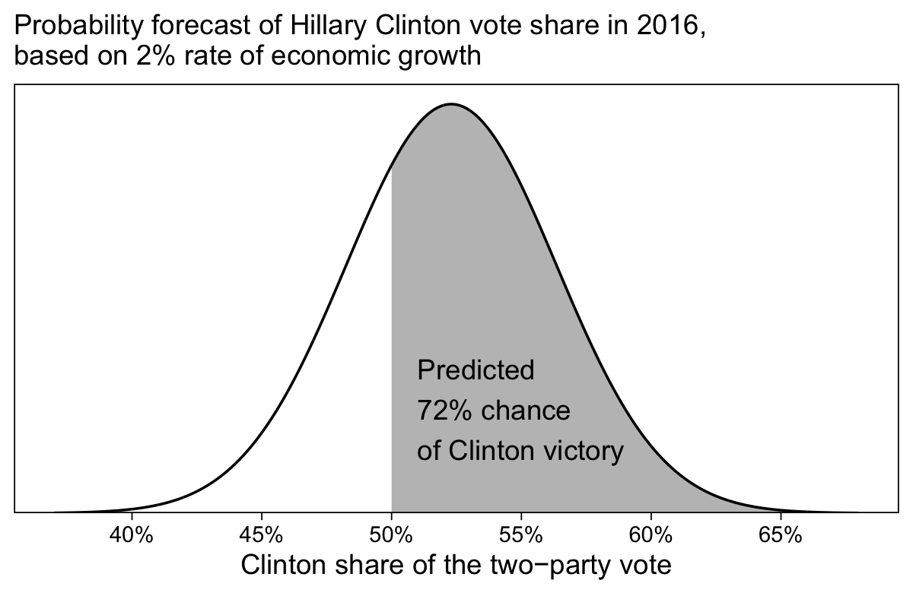

Chapter 7: Linear regression with a single predictor
================
A Solomon Kurz
2020-12-21

# Linear regression with a single predictor

> As discussed in Chapter 1, regression is fundamentally a technology
> for predicting an outcome y from inputs \(x_1, x_2, \dots\) . In this
> chapter we introduce regression in the simple (but not trivial) case
> of a linear model predicting a continuous \(y\) from a single
> continuous \(x\), thus fitting the model
> \(y_i = a + b x_i + \text{error}\) to data
> \((x_i, y_i), i = 1, \dots ,n\). (p. 93)

## 7.1 Example: predicting presidential vote share from the economy

### 7.1.1 Fitting a linear model to data.

Load the `hibbs.dat` data.

``` r
library(tidyverse)

hibbs <- 
  read_table2("ROS-Examples-master/ElectionsEconomy/data/hibbs.dat") %>%
  mutate(inc_party_candidate = str_remove_all(inc_party_candidate, '[\"]'),
         other_candidate     = str_remove_all(other_candidate, '[\"]'))

hibbs
```

    ## # A tibble: 16 x 5
    ##     year growth  vote inc_party_candidate other_candidate
    ##    <dbl>  <dbl> <dbl> <chr>               <chr>          
    ##  1  1952   2.4   44.6 Stevenson           Eisenhower     
    ##  2  1956   2.89  57.8 Eisenhower          Stevenson      
    ##  3  1960   0.85  49.9 Nixon               Kennedy        
    ##  4  1964   4.21  61.3 Johnson             Goldwater      
    ##  5  1968   3.02  49.6 Humphrey            Nixon          
    ##  6  1972   3.62  61.8 Nixon               McGovern       
    ##  7  1976   1.08  49.0 Ford                Carter         
    ##  8  1980  -0.39  44.7 Carter              Reagan         
    ##  9  1984   3.86  59.2 Reagan              Mondale        
    ## 10  1988   2.27  53.9 Bush,               Sr.            
    ## 11  1992   0.38  46.6 Bush,               Sr.            
    ## 12  1996   1.04  54.7 Clinton             Dole           
    ## 13  2000   2.36  50.3 Gore                Bush,          
    ## 14  2004   1.72  51.2 Bush,               Jr.            
    ## 15  2008   0.1   46.3 McCain              Obama          
    ## 16  2012   0.95  52   Obama               Romney

Plot the two focal variables, `growth` and `vote`, to make our version
of the left panel of Figure 7.2.

``` r
# set the global plotting theme
theme_set(theme_linedraw() +
            theme(panel.grid = element_blank()))

hibbs %>% 
  ggplot(aes(x = growth, y = vote, label = year)) +
  geom_hline(yintercept = 50, color = "grey75", size = 1/4) +
  geom_text(size = 3) +
  scale_x_continuous("Average recent growth in personal income", labels = function(x) str_c(x, "%")) +
  scale_y_continuous("Incumbent party's vote share", labels = function(x) str_c(x, "%")) +
  labs(subtitle = "Forecasting the election from the economy")
```


Load **brms** and fit the model with `brm()`.

``` r
library(brms)

m7.1 <-
  brm(data = hibbs,
      vote ~ growth,
      seed = 7,
      file = "fits/m07.01")
```

### 7.1.2 Understanding the fitted model.

Check the model summary.

``` r
print(m7.1, robust = T)
```

    ##  Family: gaussian 
    ##   Links: mu = identity; sigma = identity 
    ## Formula: vote ~ growth 
    ##    Data: hibbs (Number of observations: 16) 
    ## Samples: 4 chains, each with iter = 2000; warmup = 1000; thin = 1;
    ##          total post-warmup samples = 4000
    ## 
    ## Population-Level Effects: 
    ##           Estimate Est.Error l-95% CI u-95% CI Rhat Bulk_ESS Tail_ESS
    ## Intercept    46.17      1.70    42.62    49.42 1.00     3136     2089
    ## growth        3.06      0.72     1.61     4.60 1.00     2892     2528
    ## 
    ## Family Specific Parameters: 
    ##       Estimate Est.Error l-95% CI u-95% CI Rhat Bulk_ESS Tail_ESS
    ## sigma     3.92      0.75     2.81     5.96 1.00     2935     2771
    ## 
    ## Samples were drawn using sampling(NUTS). For each parameter, Bulk_ESS
    ## and Tail_ESS are effective sample size measures, and Rhat is the potential
    ## scale reduction factor on split chains (at convergence, Rhat = 1).

“In this example, `vote` is the outcome and `growth` is the predictor.
By default the fit includes an intercept term: the line is
\(y = a + bx\), not simply \(y = bx\)” (p. 95). Using a little rounding,
we can insert the posterior medians for the two coefficient to rewrite
the equation as

\[y = 46.2 + 3.1 x.\]

On page 95, Gelman and colleagues pointed out that if you wanted to use
`stan_glm()` to fit this model with no intercept, you’d execute
`stan_glm(vote ~ -1 + growth, data = hibb)`, where the `-1` part of the
syntax instructs the software to drop the intercept. The **brms**
package follows this same rule. Just for kicks, let’s fit the
no-intercept model.

``` r
m7.1b <-
  brm(data = hibbs,
      vote ~ -1 + growth,
      seed = 7,
      file = "fits/m07.01b")
```

Check the summary.

``` r
print(m7.1b, robust = T)
```

    ##  Family: gaussian 
    ##   Links: mu = identity; sigma = identity 
    ## Formula: vote ~ -1 + growth 
    ##    Data: hibbs (Number of observations: 16) 
    ## Samples: 4 chains, each with iter = 2000; warmup = 1000; thin = 1;
    ##          total post-warmup samples = 4000
    ## 
    ## Population-Level Effects: 
    ##        Estimate Est.Error l-95% CI u-95% CI Rhat Bulk_ESS Tail_ESS
    ## growth    19.40      2.83    13.66    25.11 1.00     2630     2222
    ## 
    ## Family Specific Parameters: 
    ##       Estimate Est.Error l-95% CI u-95% CI Rhat Bulk_ESS Tail_ESS
    ## sigma    26.51      4.49    19.50    38.00 1.00     2963     2429
    ## 
    ## Samples were drawn using sampling(NUTS). For each parameter, Bulk_ESS
    ## and Tail_ESS are effective sample size measures, and Rhat is the potential
    ## scale reduction factor on split chains (at convergence, Rhat = 1).

Yep, there’s no intercept, there. We only have a \(\beta\) coefficient
for `growth` and an estimate for the residual standard deviation,
\(\sigma\).

Circling back to the text, lower down on page 95, the authors considered
what the model would predict for a scenario like the election in 2008.
Shortly before the election, the economic growth was about 0.1%. We
could use that value along with a couple `fixef()` statements to return
the expected value in `vote`, based on our linear model `m7.1`.

``` r
100 - (fixef(m7.1, robust = T)[1, 1] + fixef(m7.1, robust = T)[2, 1] * 0.1)
```

    ## [1] 53.51926

Our model returned \(y = 46.5\), which translates into an expected value
of 46.5% of the popular vote going to the incumbent party, which was the
Republican party in 2008. Conversely, this also predicts 53.5% of the
vote would go to the Democrat Barack Obama.

### 7.1.3 Graphing the fitted regression line.

Now we’ll make Figure 7.2b by adding in the fitted line by extracting
the intercept and slope medians with `fixef()` and pumping them into the
`intercept` and `slope` arguments in `geom_abline()`.

``` r
hibbs %>% 
  ggplot(aes(x = growth, y = vote, label = year)) +
  geom_hline(yintercept = 50, color = "grey75", size = 1/4) +
  geom_point() +
  geom_abline(intercept = fixef(m7.1, robust = T)[1, 1], slope = fixef(m7.1, robust = T)[2, 1],
              size = 1/3) +
  annotate(geom = "text",
           x = 3.5, y = 53.5,
           label = expression(y==46.2+3.1*x)) +
  scale_x_continuous("Average recent growth in personal income", labels = function(x) str_c(x, "%")) +
  scale_y_continuous("Incumbent party's vote share", labels = function(x) str_c(x, "%")) +
  labs(subtitle = "Data and linear fit")
```


### 7.1.4 Using the model to predict.

Now consider what the model would predict for the 2016 election. At the
time, the Democrats were the incumbents and Hillary Clinton was the
Democratic candidate. The economic grows over the previous four years
was about 2%. Here is the expected value.

``` r
fixef(m7.1, robust = T)[1, 1] + fixef(m7.1, robust = T)[2, 1] * 2
```

    ## [1] 52.3002

Imagine a normal distribution with that value defining the \(\mu\)
parameter and the error term from `m7.1` as defining the \(\sigma\)
parameter. We can then plot a probability distribution of the model’s
forecast, which will be our version of Figure 7.3.

``` r
# Gaussian parameters
mu <- fixef(m7.1, robust = T)[1, 1] + fixef(m7.1, robust = T)[2, 1] * 2
sigma <- VarCorr(m7.1)$residual__$sd[1]

# data points
tibble(x = seq(from = 37, to = 68, by = 0.01)) %>%
  mutate(d = dnorm(x, mean = mu, sd = sigma)) %>% 
  
  # plot!
  ggplot(aes(x = x, y = d, ymin = 0, ymax = d)) +
  geom_ribbon(data = . %>% filter(x >= 50),
              fill = "grey75") +
  geom_line() +
  annotate(geom = "text",
           x = 51, y = .025,
           label = "Predicted\n72% chance\nof Clinton victory",
           hjust = 0) +
  scale_x_continuous("Clinton share of the two−party vote", 
                     breaks = 8:13 * 5, labels = function(x) str_c(x, "%")) +
  scale_y_continuous(NULL, breaks = NULL, expand = expansion(mult = c(0, 0.05))) +
  labs(subtitle = "Probability forecast of Hillary Clinton vote share in 2016,\nbased on 2% rate of economic growth")
```



Here’s how we get the 72% chance estimate, from.

``` r
1 - pnorm(50, mean = mu, sd = sigma)
```

    ## [1] 0.7150254

## 7.2 Checking the model-fitting procedure using fake-data simulation

“It is good practice to check our fits by performing them under
controlled conditions where we know the truth. We demonstrate here with
the election model” (p. 97).

### 7.2.1 Step 1: Creating the pretend world.

Here we set the parameters based on the model we just fit. Due to
simulation variance, our estimates a tiny bit different from those
reported in the text. Here we’ll set our simulation parameters based on
those Gelman and colleagues reported on page 97.

``` r
a <- 46.3
b <- 3.0
sigma <- 3.9
x <- hibbs$growth 
n <- length(x)
```

### 7.2.2 Step 2: Simulating fake data.

Now simulate the criterion variable, `y`, save the results in a tibble
named `fake`, and take a look at the results.

``` r
set.seed(7)

fake <-
  tibble(x = x) %>% 
  mutate(y = a + b * x + rnorm(n, mean = 0, sd = sigma))

glimpse(fake)
```

    ## Rows: 16
    ## Columns: 2
    ## $ x <dbl> 2.40, 2.89, 0.85, 4.21, 3.02, 3.62, 1.08, -0.39, 3.86, 2.27, 0.38, …
    ## $ y <dbl> 62.42026, 50.30259, 46.14226, 57.32206, 51.57437, 53.46561, 52.4577…

### 7.2.3 Step 3: Fitting the model and comparing fitted to assumed values.

Fit the model with `brms::brm()`

``` r
m7.2 <-
  brm(data = fake,
      y ~ x,
      seed = 7,
      file = "fits/m07.02")
```

Check the output summary.

``` r
print(m7.2, robust = T)
```

    ##  Family: gaussian 
    ##   Links: mu = identity; sigma = identity 
    ## Formula: y ~ x 
    ##    Data: fake (Number of observations: 16) 
    ## Samples: 4 chains, each with iter = 2000; warmup = 1000; thin = 1;
    ##          total post-warmup samples = 4000
    ## 
    ## Population-Level Effects: 
    ##           Estimate Est.Error l-95% CI u-95% CI Rhat Bulk_ESS Tail_ESS
    ## Intercept    50.37      2.22    45.80    54.89 1.00     3190     2545
    ## x             1.97      0.92     0.03     4.00 1.00     2991     2184
    ## 
    ## Family Specific Parameters: 
    ##       Estimate Est.Error l-95% CI u-95% CI Rhat Bulk_ESS Tail_ESS
    ## sigma     5.26      0.97     3.79     7.83 1.00     2661     2209
    ## 
    ## Samples were drawn using sampling(NUTS). For each parameter, Bulk_ESS
    ## and Tail_ESS are effective sample size measures, and Rhat is the potential
    ## scale reduction factor on split chains (at convergence, Rhat = 1).

Due to simulation variance, our results are a little different from
those in the text. But they’re pretty close to the true data-generating
values, at least within the margin of error. The data are compored of
only 16 cases, after all.

``` r
a
```

    ## [1] 46.3

``` r
b
```

    ## [1] 3

``` r
sigma
```

    ## [1] 3.9

If we save the posterior median and mad sd for the `x` slope, we can use
them to formally assess how close our estimate is to the true data
generating value.

``` r
b_hat <- fixef(m7.2, robust = T)["x", "Estimate"] 
b_se  <- fixef(m7.2, robust = T)["x", "Est.Error"] 
```

Was the difference between `b` and `b_hat` within one standard error of
the true value?

``` r
abs(b - b_hat) < b_se
```

    ## [1] FALSE

Nope, it was more than one standard error away, which is like saying it
was outside of the 68% confidence interval. How about two standard
errors?

``` r
abs(b - b_hat) < b_se * 2
```

    ## [1] TRUE

Yep, the true value `b` was within 2 standard errors (i.e., within the
95% confidence interval) of the posterior median.

### 7.2.4 Step 4: Embedding the simulation in a loop.

Instead of using a `for` loop, we will run many iterations of the
simulation within the `purrr::map()` paradigm. First, we’ll define a
custom function to generate the data, fit the model, and check the
coverage.

``` r
simulate_coverage <- function(seed) {
  
  # define the true values
  a <- 46.3
  b <- 3.0
  sigma <- 3.9
  x <- hibbs$growth 
  n <- length(x)
  
  # simulate the data
  set.seed(seed)
  
  fake <-
    tibble(x = x) %>% 
    mutate(y = a + b * x + rnorm(n, mean = 0, sd = sigma))
  
  # fit the model
  fit <-
    update(m7.2,
           newdata = fake,
           y ~ x,
           seed = seed)
  
  # extract the slope info
  b_hat <- fixef(fit, robust = T)["x", "Estimate"] 
  b_se  <- fixef(fit, robust = T)["x", "Est.Error"] 
  
  # compute the coverage
  cover <-
    tibble(cover_68 = abs(b - b_hat) < b_se,
           cover_95 = abs(b - b_hat) < b_se * 2)
  
  return(cover)
  
}
```

To warm up, well use our `simulate_coverage()` function for a single
iteration.

``` r
sim <- simulate_coverage(seed = 1)
```

Here’s what it contains.

``` r
sim
```

    ## # A tibble: 1 x 2
    ##   cover_68 cover_95
    ##   <lgl>    <lgl>   
    ## 1 TRUE     TRUE

For this particular iteration of the simulation, we passed both kinds of
coverage. Now we’ll iterate many more times using `purrr::map()`.

``` r
# how many would you like?
n_fake <- 1000

t1 <- Sys.time()

sim1 <-
  tibble(seed = 1:n_fake) %>% 
  mutate(cover = map(seed, simulate_coverage))

t2 <- Sys.time()
```

Did you notice the two `Sys.time()` lines? If we subtract `t1` from
`t2`, we’ll see how long the simulation took on my laptop.

``` r
t2 - t1
```

    ## Time difference of 8.178794 mins

It took about 8.2 minutes on my 2019 laptop to run this simulation,
which used `brms::brm()` default settings, 1,000 times. The next
question is: *What did our `sim1` return?*

``` r
head(sim1)
```

    ## # A tibble: 6 x 2
    ##    seed cover           
    ##   <int> <list>          
    ## 1     1 <tibble [1 × 2]>
    ## 2     2 <tibble [1 × 2]>
    ## 3     3 <tibble [1 × 2]>
    ## 4     4 <tibble [1 × 2]>
    ## 5     5 <tibble [1 × 2]>
    ## 6     6 <tibble [1 × 2]>

We have a nested tibble where the iterations are indexed by `seed` and
results of each are nested within `cover` We can get a look inside the
`cover` column with `unnest()`.

``` r
sim1 %>% 
  unnest(cover)
```

    ## # A tibble: 1,000 x 3
    ##     seed cover_68 cover_95
    ##    <int> <lgl>    <lgl>   
    ##  1     1 TRUE     TRUE    
    ##  2     2 TRUE     TRUE    
    ##  3     3 FALSE    TRUE    
    ##  4     4 FALSE    TRUE    
    ##  5     5 FALSE    TRUE    
    ##  6     6 TRUE     TRUE    
    ##  7     7 FALSE    TRUE    
    ##  8     8 TRUE     TRUE    
    ##  9     9 FALSE    TRUE    
    ## 10    10 TRUE     TRUE    
    ## # … with 990 more rows

Now we can summarize those results.

``` r
sim1 %>% 
  unnest(cover) %>% 
  summarise(`68% coverage` = mean(cover_68),
            `95% coverage` = mean(cover_95))
```

    ## # A tibble: 1 x 2
    ##   `68% coverage` `95% coverage`
    ##            <dbl>          <dbl>
    ## 1          0.716          0.945

The coverage for the 95% intervals was near perfect and our coverage for
the 68% intervals is even a little high.

Note, again, how each iteration is based on \(n = 16\) cases. The \(t\)
distribution might be a better reference for the 68% and 95% intervals.
Let’s update our simulation function.

``` r
simulate_coverage_t <- function(seed) {
  
  # define the true values
  a <- 46.3
  b <- 3.0
  sigma <- 3.9
  x <- hibbs$growth 
  n <- length(x)
  
  # save the t-values
  t_68 <- qt(0.840, n - 2) 
  t_95 <- qt(0.975, n - 2)
  
  # simulate the data
  set.seed(seed)
  
  fake <-
    tibble(x = x) %>% 
    mutate(y = a + b * x + rnorm(n, mean = 0, sd = sigma))
  
  # fit the model
  fit <-
    update(m7.2,
           newdata = fake,
           y ~ x,
           seed = seed)
  
  # extract the slope info
  b_hat <- fixef(fit, robust = T)["x", "Estimate"] 
  b_se  <- fixef(fit, robust = T)["x", "Est.Error"] 
  
  # compute the coverage
  cover <-
    tibble(cover_68 = abs(b - b_hat) < t_68 * b_se,
           cover_95 = abs(b - b_hat) < t_95 * b_se)
  
  return(cover)
  
}
```

Run the simulation over 1,000 iterations.

``` r
# how many would you like?
n_fake <- 1000

t1 <- Sys.time()

sim2 <-
  tibble(seed = 1:n_fake) %>% 
  mutate(cover = map(seed, simulate_coverage_t))

t2 <- Sys.time()
```

How long did that take?

``` r
t2 - t1
```

    ## Time difference of 7.078769 mins

How’d we do?

``` r
sim2 %>% 
  unnest(cover) %>% 
  summarise(`68% coverage` = mean(cover_68),
            `95% coverage` = mean(cover_95))
```

    ## # A tibble: 1 x 2
    ##   `68% coverage` `95% coverage`
    ##            <dbl>          <dbl>
    ## 1          0.726          0.957

## 7.3 Formulating comparisons as regression models

> To express comparisons as regressions we need the concept of an
> *indicator variable*, which is a predictor that equals 1 or 0 to
> indicate whether a data point falls into a specified category.
> Indicator variables can be used for inputs with two categories (for
> example, an indicator for “male” that takes on the value 1 for men and
> 0 for women) or multiple categories (for example, indicators for
> “White,” “Black,” and “Hispanic,” with each taking on the value of 1
> for people in the specified category and zero otherwise). (p. 99,
> *emphasis* in the original)

### 7.3.1 Estimating the mean is the same as regressing on a constant term.

Simulate 20 cases from \(\operatorname{Normal}(2, 5)\).

``` r
# how many cases would you like?
n_0 <- 20

set.seed(7)

y_0 <- rnorm(n_0, mean = 2.0, sd = 5.0)

fake_0 <- tibble(y_0 = y_0) 

glimpse(fake_0)
```

    ## Rows: 20
    ## Columns: 1
    ## $ y_0 <dbl> 13.43623581, -3.98385841, -1.47146255, -0.06146476, -2.85336671, …

Compute the sample mean and standard error.

``` r
fake_0 %>% 
  summarise(mean = mean(y_0),
            se = sd(y_0) / sqrt(n()))
```

    ## # A tibble: 1 x 2
    ##    mean    se
    ##   <dbl> <dbl>
    ## 1  4.22  1.38

Earlier, we learned that if you want to remove the intercept from a
model, you can use the `-1` syntax in the **brms** formula code. If you
want to explicitly reference the model intercept in the `formula`, you
add a `1`. For example, let’s say our simulated data, above, had a
single predictor variable called `x`. The `formula` syntax for the
simple univariable regression model would be `y_0 ~ 1 + x`, where `1`
explicitly refers to the intercept. This would be equivalent to the more
thrifty syntax Gelman et al seem to prefer, `y_0 ~ x`. The explicit
syntax has two advantages: First, it a can serve as a reminder that the
intercept is a fundamental part of most statistical models. Second, it
allows one to fit an intercept-only model, a model with no predictor
variables.

Now use that knowledge to fit an intercept-only model with
`brms::brm()`.

``` r
m7.3 <-
  brm(data = fake_0,
      y_0 ~ 1,
      seed = 7,
      file = "fits/m07.03")
```

Check the summary.

``` r
print(m7.3, robust = T)
```

    ##  Family: gaussian 
    ##   Links: mu = identity; sigma = identity 
    ## Formula: y_0 ~ 1 
    ##    Data: fake_0 (Number of observations: 20) 
    ## Samples: 4 chains, each with iter = 2000; warmup = 1000; thin = 1;
    ##          total post-warmup samples = 4000
    ## 
    ## Population-Level Effects: 
    ##           Estimate Est.Error l-95% CI u-95% CI Rhat Bulk_ESS Tail_ESS
    ## Intercept     4.15      1.39     1.41     6.98 1.00     3219     2549
    ## 
    ## Family Specific Parameters: 
    ##       Estimate Est.Error l-95% CI u-95% CI Rhat Bulk_ESS Tail_ESS
    ## sigma     6.27      1.03     4.71     9.03 1.00     2841     2347
    ## 
    ## Samples were drawn using sampling(NUTS). For each parameter, Bulk_ESS
    ## and Tail_ESS are effective sample size measures, and Rhat is the potential
    ## scale reduction factor on split chains (at convergence, Rhat = 1).

The posterior median and mad sd for the intercept are within simulation
variance from the hand-computed mean and standard error.

### 7.3.2 Estimating a difference is the same as regressing on an indicator variable.

Now simulate \(n = 30\) from \(\operatorname{Normal}(8, 5)\).

``` r
set.seed(7)

n_1 <- 30
y_1 <- rnorm(n_1, mean = 8.0, sd = 5.0)
```

Compute the difference in the sample means for `y_0` and `y_1`.

``` r
mean(y_1) - mean(y_0) 
```

    ## [1] 5.762103

This is close to the true population difference of 6. Now compute the
standard error for that difference.

``` r
se_0 <- sd(y_0) / sqrt(n_0) 
se_1 <- sd(y_1) / sqrt(n_1)

sqrt(se_0^2 + se_1^2)
```

    ## [1] 1.724332

Bind the two `y_` vectors into a single tibble, with an indicator
variable, `x`.

``` r
fake <-
  tibble(x = rep(0:1, times = c(n_0, n_1)),
         y = c(y_0, y_1))

fake
```

    ## # A tibble: 50 x 2
    ##        x       y
    ##    <int>   <dbl>
    ##  1     0 13.4   
    ##  2     0 -3.98  
    ##  3     0 -1.47  
    ##  4     0 -0.0615
    ##  5     0 -2.85  
    ##  6     0 -2.74  
    ##  7     0  5.74  
    ##  8     0  1.42  
    ##  9     0  2.76  
    ## 10     0 12.9   
    ## # … with 40 more rows

Our indicator variable is defined as

\[
x_i = \left \{
  \begin{array}{@{}ll@{}}
    0 & \text{if obervation}\ i\ \text{is in group}\ 0 \\
    1 & \text{if obervation}\ i\ \text{is in group}\ 1.
  \end{array} \right.
\]

Now fit the model with the indicator variable `x` as the predictor of
`y`. For practice, we’ll explicitly reference the intercept in the
`formula` syntax.

``` r
m7.4 <-
  brm(data = fake,
      y ~ 1 + x,
      seed = 7,
      file = "fits/m07.04")
```

Check the summary.

``` r
print(m7.4, robust = T)
```

    ##  Family: gaussian 
    ##   Links: mu = identity; sigma = identity 
    ## Formula: y ~ 1 + x 
    ##    Data: fake (Number of observations: 50) 
    ## Samples: 4 chains, each with iter = 2000; warmup = 1000; thin = 1;
    ##          total post-warmup samples = 4000
    ## 
    ## Population-Level Effects: 
    ##           Estimate Est.Error l-95% CI u-95% CI Rhat Bulk_ESS Tail_ESS
    ## Intercept     4.19      1.32     1.62     6.68 1.00     4063     3241
    ## x             5.79      1.68     2.50     9.09 1.00     4013     3042
    ## 
    ## Family Specific Parameters: 
    ##       Estimate Est.Error l-95% CI u-95% CI Rhat Bulk_ESS Tail_ESS
    ## sigma     5.91      0.59     4.91     7.28 1.00     3526     2851
    ## 
    ## Samples were drawn using sampling(NUTS). For each parameter, Bulk_ESS
    ## and Tail_ESS are effective sample size measures, and Rhat is the potential
    ## scale reduction factor on split chains (at convergence, Rhat = 1).

The posterior median and mad sd for the `x` coefficient are within
simulation variance of our hand-computed difference and standard error,
from above.

``` r
mean(y_1) - mean(y_0) 
```

    ## [1] 5.762103

``` r
sqrt(se_0^2 + se_1^2)
```

    ## [1] 1.724332

Make our Figure 7.4.

``` r
# horizontal lines
y_bar_0 <- fixef(m7.4, robust = T)[1, 1]
y_bar_1 <- fixef(m7.4, robust = T)[1, 1] + fixef(m7.4, robust = T)[2, 1]

# annotation
text <-
  tibble(x = c(0.1, 0.6, 0.9),
         y = c(y_bar_0 - 1.5, y_bar_0 + 1.5, y_bar_1 + 1.5),
         label = c(expression(bar(y)[0]==4.2), 
                   expression(y==4.2+5.8*x), 
                   expression(bar(y)[1]==10.0)))

# plot!
fake %>% 
  ggplot(aes(x = x, y = y)) +
  geom_hline(yintercept = c(y_bar_0, y_bar_1), 
             size = 1/4, linetype = 2, color = "grey50") +
  geom_point(alpha = 1/2) +
  geom_abline(intercept = fixef(m7.4, robust = T)[1, 1], 
              slope = fixef(m7.4, robust = T)[2, 1]) +
  geom_text(data = text,
            aes(label = label),
            size = 3, parse = T) +
  scale_x_continuous("Indicator, x", breaks = 0:1) +
  labs(subtitle = "Least−squares regression on an indicator is\nthe same as computing a difference in means")
```


> The point of doing all this using fake-data simulation is, first, to
> directly check that the direct comparison and the regression give the
> same answer and, second, to understand the properties of statistical
> fits using a general tool that will continue to be helpful in more
> complicated settings. (p. 101)

## Session info

``` r
sessionInfo()
```

    ## R version 4.0.3 (2020-10-10)
    ## Platform: x86_64-apple-darwin17.0 (64-bit)
    ## Running under: macOS Catalina 10.15.7
    ## 
    ## Matrix products: default
    ## BLAS:   /Library/Frameworks/R.framework/Versions/4.0/Resources/lib/libRblas.dylib
    ## LAPACK: /Library/Frameworks/R.framework/Versions/4.0/Resources/lib/libRlapack.dylib
    ## 
    ## locale:
    ## [1] en_US.UTF-8/en_US.UTF-8/en_US.UTF-8/C/en_US.UTF-8/en_US.UTF-8
    ## 
    ## attached base packages:
    ## [1] stats     graphics  grDevices utils     datasets  methods   base     
    ## 
    ## other attached packages:
    ##  [1] brms_2.14.4     Rcpp_1.0.5      forcats_0.5.0   stringr_1.4.0  
    ##  [5] dplyr_1.0.2     purrr_0.3.4     readr_1.4.0     tidyr_1.1.2    
    ##  [9] tibble_3.0.4    ggplot2_3.3.2   tidyverse_1.3.0
    ## 
    ## loaded via a namespace (and not attached):
    ##   [1] minqa_1.2.4          colorspace_2.0-0     ellipsis_0.3.1      
    ##   [4] ggridges_0.5.2       rsconnect_0.8.16     estimability_1.3    
    ##   [7] markdown_1.1         base64enc_0.1-3      fs_1.5.0            
    ##  [10] rstudioapi_0.13      rstan_2.21.2         farver_2.0.3        
    ##  [13] DT_0.16              fansi_0.4.1          mvtnorm_1.1-1       
    ##  [16] lubridate_1.7.9.2    xml2_1.3.2           codetools_0.2-16    
    ##  [19] bridgesampling_1.0-0 splines_4.0.3        knitr_1.30          
    ##  [22] shinythemes_1.1.2    bayesplot_1.7.2      projpred_2.0.2      
    ##  [25] jsonlite_1.7.1       nloptr_1.2.2.2       broom_0.7.2         
    ##  [28] dbplyr_2.0.0         shiny_1.5.0          compiler_4.0.3      
    ##  [31] httr_1.4.2           emmeans_1.5.2-1      backports_1.2.0     
    ##  [34] assertthat_0.2.1     Matrix_1.2-18        fastmap_1.0.1       
    ##  [37] cli_2.2.0            later_1.1.0.1        prettyunits_1.1.1   
    ##  [40] htmltools_0.5.0      tools_4.0.3          igraph_1.2.6        
    ##  [43] coda_0.19-4          gtable_0.3.0         glue_1.4.2          
    ##  [46] reshape2_1.4.4       V8_3.4.0             cellranger_1.1.0    
    ##  [49] vctrs_0.3.5          nlme_3.1-149         crosstalk_1.1.0.1   
    ##  [52] xfun_0.19            ps_1.5.0             lme4_1.1-25         
    ##  [55] rvest_0.3.6          mime_0.9             miniUI_0.1.1.1      
    ##  [58] lifecycle_0.2.0      gtools_3.8.2         statmod_1.4.35      
    ##  [61] MASS_7.3-53          zoo_1.8-8            scales_1.1.1        
    ##  [64] colourpicker_1.1.0   hms_0.5.3            promises_1.1.1      
    ##  [67] Brobdingnag_1.2-6    parallel_4.0.3       inline_0.3.17       
    ##  [70] shinystan_2.5.0      curl_4.3             gamm4_0.2-6         
    ##  [73] yaml_2.2.1           gridExtra_2.3        StanHeaders_2.21.0-6
    ##  [76] loo_2.3.1            stringi_1.5.3        dygraphs_1.1.1.6    
    ##  [79] pkgbuild_1.1.0       boot_1.3-25          rlang_0.4.9         
    ##  [82] pkgconfig_2.0.3      matrixStats_0.57.0   evaluate_0.14       
    ##  [85] lattice_0.20-41      rstantools_2.1.1     htmlwidgets_1.5.2   
    ##  [88] labeling_0.4.2       processx_3.4.5       tidyselect_1.1.0    
    ##  [91] plyr_1.8.6           magrittr_2.0.1       R6_2.5.0            
    ##  [94] generics_0.1.0       DBI_1.1.0            pillar_1.4.7        
    ##  [97] haven_2.3.1          withr_2.3.0          mgcv_1.8-33         
    ## [100] xts_0.12.1           abind_1.4-5          modelr_0.1.8        
    ## [103] crayon_1.3.4         utf8_1.1.4           rmarkdown_2.5       
    ## [106] grid_4.0.3           readxl_1.3.1         callr_3.5.1         
    ## [109] threejs_0.3.3        reprex_0.3.0         digest_0.6.27       
    ## [112] xtable_1.8-4         httpuv_1.5.4         RcppParallel_5.0.2  
    ## [115] stats4_4.0.3         munsell_0.5.0        shinyjs_2.0.0
