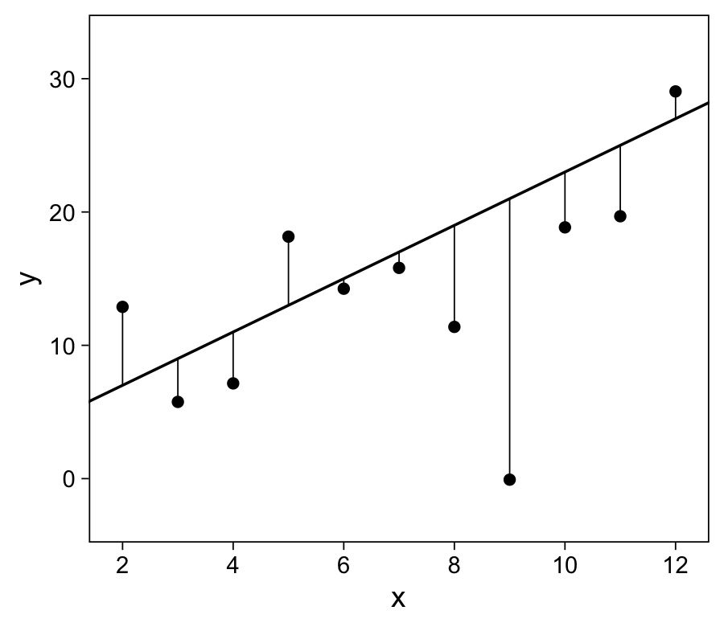

Chapter 8: Fitting regression models
================
A Solomon Kurz
2020-12-21

# Fitting regression models

> In this chapter we lay out some of the mathematical structure of
> inference for regression models and some algebra to help understand
> estimation for linear regression. We also explain the rationale for
> the use of the Bayesian fitting routine \[`brm()`\] and its connection
> to classical linear regression. This chapter thus provides background
> and motivation for the mathematical and computational tools used in
> the rest of the book. (p. 103)

## 8.1 Least squares, maximum likelihood, and Bayesian inference

> We now step back and consider *inference*: the steps of estimating the
> regression model and assessing uncertainty in the fit. We start with
> *least squares*, which is the most direct approach to estimation,
> based on finding the values of the coefficients \(a\) and \(b\) that
> best fit the data. We then discuss *maximum likelihood*, a more
> general framework that includes least squares as a special case and to
> which we return in later chapters when we get to logistic regression
> and generalized linear models. Then we proceed to *Bayesian
> inference*, an even more general approach that allows the
> probabilistic expression of prior information and posterior
> uncertainty. (p. 103, *emphasis* in the original)

### 8.1.1 Least squares.

> In the classical linear regression model,
> \(y_i = a + b x_i + \epsilon_i\), the coefficients \(a\) and \(b\) are
> estimated so as to minimize the errors \(\epsilon_i\). If the number
> of data points \(n\) is greater than 2, it is not generally possible
> to find a line that gives a perfect fit (that would be
> \(y_i = a + b x_i\) , with no error, for all data points
> \(i = 1, \dots , n\)), and the usual estimation goal is to choose the
> estimate (\(\hat a\), \(\hat b\)) that minimizes the sum of the
> squares of the residuals,
> 
> \[r_i = y_i − (\hat a + b x_i) .\]
> 
> We distinguish between the residuals
> \(r_i = y_i - (\hat a + \hat b x_i)\) and the *errors*
> \(\epsilon_i = y_i − (a + b x_i)\).
> 
> The model is written in terms of the errors, but it is the residuals
> that we can work with: we cannot calculate the errors as to do so
> would require knowing \(a\) and \(b\).
> 
> The residual sum of squares is
> 
> \[\text{RSS} = \sum_{i=1}^n (y_i = (\hat a + \hat b x_i))^2.\]
> 
> The (\(\hat a\), \(\hat b\)) that minimizes RSS is called the least
> squares or ordinary least squares or OLS estimate. (p. 103, *emphasis*
> in the original)

### 8.1.2 Estimation of residual standard deviation \(\sigma\).

> In the regression model, the errors \(\epsilon_i\) come from a
> distribution with mean 0 and standard deviation \(\sigma\): the mean
> is zero by definition (any nonzero mean is absorbed into the
> intercept, \(a\)), and the standard deviation of the errors can be
> estimated the from data. A natural way to estimate \(\sigma\) would be
> to simply take the standard deviation of the residuals,
> \(\sqrt{\frac{1}{n} \sum_{i=1}^n r_i^2} = \sqrt{\frac{1}{n} \sum_{i=1}^n y_i - (\hat a + \hat b x_i))^2}\),
> but this would slightly underestimate \(\sigma\) because of
> *overfitting*, as the coefficients \(\hat a\) and \(\hat b\) have been
> set based on the data to minimize the sum of squared residuals. The
> standard correction for this overfitting is to replace \(n\) by
> \(n - 2\) in the denominator (with the subtraction of 2 coming from
> the estimation of two coefficients in the model, the intercept and the
> slope); thus,
> 
> \[\hat \sigma = \sqrt{\frac{1}{n-2} \sum_{i=1}^n (y_i - (\hat a + \hat b x_i))^2}.\]
> 
> When \(n = 1\) or \(2\) this expression is meaningless, which makes
> sense: with only two data points you can fit a line exactly and so
> there is no way of estimating error from the data alone. (p. 104,
> *emphasis* in the original)

### 8.1.3 Computing the sum of squares directly.

Here we make a custom function to compute the sum of squares for
different values of \(a\) and \(b\).

``` r
rss <- function(x, y, a, b) {  
  
  # x and y are vectors, 
  # a and b are scalars 
  
  resid <- y - (a + b * x)
  
  return(sum(resid^2))

  }
```

We can use this with `hibbs` data from Chapter 7.

``` r
library(tidyverse)

hibbs <- 
  read_table2("ROS-Examples-master/ElectionsEconomy/data/hibbs.dat") %>%
  mutate(inc_party_candidate = str_remove_all(inc_party_candidate, '[\"]'),
         other_candidate     = str_remove_all(other_candidate, '[\"]'))

hibbs
```

    ## # A tibble: 16 x 5
    ##     year growth  vote inc_party_candidate other_candidate
    ##    <dbl>  <dbl> <dbl> <chr>               <chr>          
    ##  1  1952   2.4   44.6 Stevenson           Eisenhower     
    ##  2  1956   2.89  57.8 Eisenhower          Stevenson      
    ##  3  1960   0.85  49.9 Nixon               Kennedy        
    ##  4  1964   4.21  61.3 Johnson             Goldwater      
    ##  5  1968   3.02  49.6 Humphrey            Nixon          
    ##  6  1972   3.62  61.8 Nixon               McGovern       
    ##  7  1976   1.08  49.0 Ford                Carter         
    ##  8  1980  -0.39  44.7 Carter              Reagan         
    ##  9  1984   3.86  59.2 Reagan              Mondale        
    ## 10  1988   2.27  53.9 Bush,               Sr.            
    ## 11  1992   0.38  46.6 Bush,               Sr.            
    ## 12  1996   1.04  54.7 Clinton             Dole           
    ## 13  2000   2.36  50.3 Gore                Bush,          
    ## 14  2004   1.72  51.2 Bush,               Jr.            
    ## 15  2008   0.1   46.3 McCain              Obama          
    ## 16  2012   0.95  52   Obama               Romney

As in model `m7.1` from last chapter, we’ll designate `vote` as the
\(y\) variable and \(x\) as the predictor. We’ll first compute the
residual sum of squares based on the formula
\(y_i = 46.3 + 3.0 x_i + \epsilon_i\).

``` r
rss(hibbs$growth, hibbs$vote, 46.3, 3.0)
```

    ## [1] 198.4422

We might explore with different values of `a` and `b`. To start out,
we’ll try a vector of `a` values, while retaining `b = 3.0`. We’ll
then plot the results.

``` r
# set the global plotting theme
theme_set(theme_linedraw() +
            theme(panel.grid = element_blank()))

# simulate
tibble(a = 30:60) %>% 
  mutate(rss = map_dbl(a, rss, x = hibbs$growth, y = hibbs$vote,  b = 3.0)) %>% 
  
  # plot
  ggplot(aes(x = a, y = rss)) +
  geom_point() +
  labs(subtitle = "b is held constant at 3.0")
```


Now we’ll vary both `a` and `b`, each across a continuum of parameters
and plot the results in a tile plot where the fill of each tile is the
`rss` value.

``` r
# simulate
d <-
  crossing(a = seq(from = 30, to = 60, by = 0.1),
           b = seq(from = 0, to = 10, by = 0.05)) %>% 
  mutate(rss = map2_dbl(a, b, rss, x = hibbs$growth, y = hibbs$vote))

d %>%
  # plot
  ggplot(aes(x = a, y = b, fill = rss)) +
  geom_tile() +
  scale_fill_viridis_c("RSS", option = "A") +
  scale_x_continuous(expand = c(0, 0)) +
  scale_y_continuous(expand = c(0, 0))
```


Since ordinary least squares estimation emphasizes the smallest RSS
value, we like the combinations of `a` and `b` in the darker range.
Among the values we entertained, here is the combination of `a` and `b`
with the lowest `rss`.

``` r
d %>% 
  arrange(rss) %>% 
  slice(1)
```

    ## # A tibble: 1 x 3
    ##       a     b   rss
    ##   <dbl> <dbl> <dbl>
    ## 1  46.3  3.05  198.

### 8.1.4 Maximum likelihood.

> If the errors from the linear model are independent and normally
> distributed, so that
> \(y_i \sim \operatorname N (a + b x_i, \sigma^2)\) for each \(i\),
> then the least squares estimate of (\(a\), \(b\)) is also the maximum
> likelihood estimate. The *likelihood function* in a regression model
> is defined as the probability density of the data given the parameters
> and predictors; thus, in this example,
> 
> \[p(y | a, b, \sigma, X) = \prod_{i=1}^n \operatorname N(y_i | a + b x_i, \sigma^2),\]
> 
> where \(\operatorname N(\cdot | \cdot, \cdot)\) is the normal
> probability density function,
> 
> \[\operatorname N(y | m, \sigma^2) = \frac{1}{\sqrt{2 \pi \sigma}} \exp \left(-\frac{1}{2} \left( \frac{y - m}{\sigma} \right)^2 \right).\]
> 
> A careful study of (8.6) reveals that maximizing the likelihood
> requires minimizing the sum of squared residuals; hence the least
> squares estimate \(\hat \beta = (\hat a, \hat b)\) can be viewed as a
> maximum likelihood estimate under the normal model. (p. 105,
> *emphasis* in the original)

### 8.1.5 Where do the standard errors come from? Using the likelihood surface to assess uncertainty in the parameter estimates.

For the sake of practice, here we’ll use the equations from the last
section to make a custom function to compute the log-likelihood
estimates for various combinations of `a` and `b`, given two data
columns, `x` and `y`. It’ll return the \(\hat \sigma\) value, too.

``` r
ll <- function(x, y, a, b) {
  
  # compute sigma
  resid <- y - (a + b * x)
  sigma <- sqrt(sum(resid^2) / length(x))
  
  d <- dnorm(y, mean = a + b * x, sd = sigma, log = T)
  
  tibble(sigma = sigma,
         ll = sum(d))
  
}
```

Now we’ll iterate this over many values of `a` and `b`, save the
results, and make a plot.

``` r
# simulate
d <-
  crossing(a = seq(from = 39, to = 53, length.out = 200),
           b = seq(from = 0, to = 6, length.out = 200)) %>% 
  mutate(ll = map2(a, b, ll, x = hibbs$growth, y = hibbs$vote)) %>% 
  unnest(ll)

# plot
p1 <-
  d %>%
  ggplot(aes(x = a, y = b, fill = ll)) +
  geom_tile() +
  scale_fill_viridis_c(option = "A", breaks = NULL) +
  scale_x_continuous(expand = c(0, 0)) +
  scale_y_continuous(expand = c(0, 0)) +
  labs(subtitle = "likelihood, p(a, b |y)")

p1
```


This will also serve as our Figure 8.1a. Based on the values we
considered, here’s the maximum likelihood.

``` r
d %>% 
  arrange(desc(ll)) %>% 
  slice(1)
```

    ## # A tibble: 1 x 4
    ##       a     b sigma    ll
    ##   <dbl> <dbl> <dbl> <dbl>
    ## 1  46.2  3.08  3.52 -42.8

The authors have not yet covered maximum likelihood standard errors, so
we aren’t in a position to make versions of Figure 8.1b or 6.1c. But we
can make Figure 8.2. First we’ll need to bring back model `m7.1` from
Section \[7.1.1\]\[Fitting a linear model to data.\].

``` r
library(brms)

m7.1 <-
  brm(data = hibbs,
      vote ~ growth,
      seed = 7,
      file = "fits/m07.01")
```

Now we make Figure 8.2a.

``` r
hibbs %>% 
  ggplot(aes(x = growth, y = vote, label = year)) +
  geom_point() +
  geom_abline(intercept = fixef(m7.1, robust = T)[1, 1], 
              slope = fixef(m7.1, robust = T)[2, 1],
              size = 1/3) +
  annotate(geom = "text",
           x = 3.5, y = 53.5,
           label = expression(y==46.2+3.1*x)) +
  labs(subtitle = "Data and linear fit",
       x = "x",
       y = "y")
```


Here’s Figure 8.2b.

``` r
set.seed(8)

posterior_samples(m7.1) %>% 
  slice_sample(n = 50) %>% 
  
  ggplot() +
  geom_abline(aes(intercept = b_Intercept, slope = b_growth),
              size = 1/4, alpha = 1/2, color = "grey25") +
  geom_point(data = hibbs,
             aes(x = growth, y = vote)) +
  scale_x_continuous(breaks = 0:4, limits = c(-1, 5), expand = c(0, 0)) +
  coord_cartesian(ylim = c(43, 62)) +
  labs(subtitle = "Data and range of possible linear fits",
       x = "x",
       y = "y")
```


What was this magic. We used the `brms::posterior_samples()` function to
take many draws from the posterior distribution of model `m7.1`. That
left us with a column of each of the three parameters, which in this
output are called `b_Intercept`, `b_growth`, and `sigma`. We then used
`slice_sample()` to take a random subset of 50 of the rows. To keep
things simple, here we’ll take only 5.

``` r
set.seed(8)

posterior_samples(m7.1) %>% 
  slice_sample(n = 5)
```

    ##   b_Intercept b_growth    sigma      lp__
    ## 1    48.36750 3.218803 4.541863 -49.99091
    ## 2    47.61992 2.616772 3.253998 -47.41074
    ## 3    46.41812 2.979008 3.070539 -47.17228
    ## 4    46.86448 2.662612 3.243965 -47.13750
    ## 5    44.22094 2.730271 3.698479 -50.99446

We also got a column called the `lp__`, which is currently outside of
our scope. But anyway, we can look at the `b_Intercept` as a collection
of credible `a` values and the `b_growth` column as a collection of
credible `b` values.

### 8.1.6 Bayesian inference.

> Least squares or maximum likelihood finds the parameters that best fit
> the data (according to some pre-specified criterion), but without
> otherwise constraining or guiding the fit. But, as discussed in
> Section 9.3 and elsewhere, we typically have prior information about
> the parameters of the model. Bayesian inference produces a compromise
> between prior information and data, doing this by multiplying the
> likelihood with a *prior distribution* that probabilistically encodes
> external information about the parameters. The product of the
> likelihood (in the above example, it is \(p(y | a, b, \sigma)\) in
> (8.6), considered as a function of \(a\), \(b\), and \(\sigma\)) and
> the prior distribution is called the *posterior distribution* and it
> summarizes our knowledge of the parameter, after seeing the data.
> (“Posterior” is Latin for “later.”) (p. 106, *emphasis* in the
> original)

### 8.1.7 Point estimate, mode-based approximation, and posterior simulations.

> The least squares solution is a *point estimate* that represents the
> vector of coefficients that provides the best overall fit to data. For
> a Bayesian model, the corresponding point estimate is the *posterior
> mode*, which provides the best overall fit to data and prior
> distribution. The least squares or maximum likelihood estimate is the
> posterior mode corresponding to the model with a uniform or flat prior
> distribution.
> 
> But we do not just want an estimate; we also want uncertainty.
> (p. 107, *emphasis* in the original)

## 8.2 Influence of individual points in a fitted regression

It’s not clear where the data came from to make Figure 8.3. We’ll have
to use the skills from previous figures to improvise. To start, we
define the population parameters for `a`, `b`, and `sigma`. Then we
simulate values of `x` ranging from 1 t0 13 and the corresponding values
for `y`, `y_hat`, and even `r_hat`. Then we plot.

``` r
a <- 3
b <- 2
sigma <- 7

set.seed(8)

tibble(x = 1:13) %>% 
  mutate(y_hat = a + b * x,
         r_hat = rnorm(n(), mean = 0, sd = sigma)) %>% 
  mutate(y = y_hat + r_hat) %>% 
  
  ggplot(aes(x = x)) +
  geom_point(aes(y = y)) +
  geom_line(aes(y = y_hat),
            size = 1/2) +
  geom_linerange(aes(ymin = y, ymax = y_hat),
                 size = 1/4) +
  scale_x_continuous(breaks = 1:6 * 2) +
  coord_cartesian(xlim = c(1.9, 12.1),
                  ylim = c(-3, 33))
```



> An increase of 1 in \(y_i\) corresponds to a change in \(\hat b\) that
> is proportional to (\(x_i - \bar x\)):
> 
>   - If \(x_i = \bar x\), the influence of point \(i\) on the
>     regression slope is 0. This makes sense: taking a point in the
>     center and moving it up or down will affect the height of the
>     fitted line but not its slope.
>   - If \(x_i > \bar x\), the influence of point \(i\) is positive,
>     with greater influence the further \(x_i\) is from the mean.
>   - If \(x_i < \bar x\), the influence of point \(i\) is negative,
>     with greater absolute influence the further \(x_i\) is from the
>     mean. (p. 107)

## 8.3 Least squares slope as a weighted average of slopes of pairs

“We can interpret the estimated coefficient \(\hat b\) as the weighted
average slope in the data, and we can interpret the underlying parameter
\(b\) as the weighted average slope in the population” (p. 109)

## 8.4 Comparing two fitting functions: `lm` and ~~`stan_glm`~~ `brm`

The base **R** `lm()` function fits models using the OLS criterion.
Throughout the text, Gelman et al highlighted the `stan_glm()` function,
which is part of the [**rstanarm**
package](https://CRAN.R-project.org/package=rstanarm). From the
<https://mc-stan.org/rstanarm/> website, the developers describe
**rstanarm** as:

> an R package that emulates other R model-fitting functions but uses
> Stan (via the [rstan](https://mc-stan.org/rstan/) package) for the
> back-end estimation. The primary target audience is people who would
> be open to Bayesian inference if using Bayesian software were easier
> but would use frequentist software otherwise.
> 
> Fitting models with **rstanarm** is also useful for experienced
> Bayesian software users who want to take advantage of the pre-compiled
> Stan programs that are written by Stan developers and carefully
> implemented to prioritize numerical stability and the avoidance of
> sampling problems.

In this project, we will be use the **brm** package, instead. From the
<https://github.com/paul-buerkner/brms> page, we see **brms** described
as:

> The **brms** package provides an interface to fit Bayesian generalized
> (non-)linear multivariate multilevel models using Stan, which is a C++
> package for performing full Bayesian inference (see
> <https://mc-stan.org/>). The formula syntax is very similar to that of
> the package lme4 to provide a familiar and simple interface for
> performing regression analyses. A wide range of response distributions
> are supported, allowing users to fit – among others – linear, robust
> linear, count data, survival, response times, ordinal, zero-inflated,
> and even self-defined mixture models all in a multilevel context.
> Further modeling options include non-linear and smooth terms,
> auto-correlation structures, censored data, missing value imputation,
> and quite a few more. In addition, all parameters of the response
> distribution can be predicted in order to perform distributional
> regression. Multivariate models (i.e., models with multiple response
> variables) can be fit, as well. Prior specifications are flexible and
> explicitly encourage users to apply prior distributions that actually
> reflect their beliefs. Model fit can easily be assessed and compared
> with posterior predictive checks, cross-validation, and Bayes factors.

Though **brms** and **rstanarm** are very similar, **brms** offers a
more flexible model-fitting framework. As we have already seen, the
primary model-fitting function with **brms** is `brm()`, which might be
thought of as an acronym for *Bayesian regression model*. Similar to
`rstanarm::stan_glm()`, the `brms::brm()` uses fairly weak priors, by
default. However, the two do not necessarily use the same default
priors, so some differences may arise when relying on those defaults.

### 8.4.1 Reproducing maximum likelihood using ~~`stan_glm`~~ `brm` with flat priors and optimization.

Similar to with `stan_glm()`, the default use of `brms::brm()` is

``` r
brm(data = mydata,
    y ~ x)
```

It doesn’t matter what order you put the arguments in. But you’ll note I
prefer to define my data before defining my model. Even when you don’t
set them yourself, `brm()` assigns priors to all model parameters, by
default. If you are ever curious about what those priors are, use the
`get_prior()` function.

**brms** categorizes priors into various classes. Priors for regression
slopes are often of `class = b`. By default, parameters of `class = b`
have a flat prior across the real number line. The priors for model
intercepts, however, are typically of `class = Intercept`. These default
to the normal distribution wherein the \(\mu\) and \(\sigma\) parameters
are automatically set to be wide and minimally informative. For more
details, see the `set_prior` section of the [**brms** reference
manual](https://CRAN.R-project.org/package=brms/brms.pdf).

Unlike with `stan_glm()`, the `brm()` function does not have an
`algorithm = "optimizing"` that will allow for maximum likelihood
estimation. If you want frequentist estimation, **brms** will be of
little help, for you.

### 8.4.2 Running `lm`.

If you would like to fit a maximum likelihood model, the `lm()` function
will often get you an equivalent model using OLS.

### 8.4.3 Confidence intervals, uncertainty intervals, compatibility intervals.

Simulate some data.

``` r
fake <- tibble(x = 1:10, 
               y = c(1, 1, 2, 3, 5, 8, 13, 21, 34, 55))

glimpse(fake)
```

    ## Rows: 10
    ## Columns: 2
    ## $ x <int> 1, 2, 3, 4, 5, 6, 7, 8, 9, 10
    ## $ y <dbl> 1, 1, 2, 3, 5, 8, 13, 21, 34, 55

Fit the model with `brms::brm()`.

``` r
m8.1 <-
  brm(data = fake,
      y ~ x,
      seed = 8,
      file = "fits/m08.01")
```

Check the model summary.

``` r
print(m8.1, robust = T)
```

    ##  Family: gaussian 
    ##   Links: mu = identity; sigma = identity 
    ## Formula: y ~ x 
    ##    Data: fake (Number of observations: 10) 
    ## Samples: 4 chains, each with iter = 2000; warmup = 1000; thin = 1;
    ##          total post-warmup samples = 4000
    ## 
    ## Population-Level Effects: 
    ##           Estimate Est.Error l-95% CI u-95% CI Rhat Bulk_ESS Tail_ESS
    ## Intercept   -14.65      6.56   -28.97    -0.87 1.00     3000     2492
    ## x             5.09      1.07     2.81     7.39 1.00     2969     2451
    ## 
    ## Family Specific Parameters: 
    ##       Estimate Est.Error l-95% CI u-95% CI Rhat Bulk_ESS Tail_ESS
    ## sigma     9.50      2.19     6.23    16.18 1.00     2595     2372
    ## 
    ## Samples were drawn using sampling(NUTS). For each parameter, Bulk_ESS
    ## and Tail_ESS are effective sample size measures, and Rhat is the potential
    ## scale reduction factor on split chains (at convergence, Rhat = 1).

By default, the summary includes percentile-based 95% intervals for all
parameters in the model. Those are listed in the columns called ‘l-95%
CI’ and ‘u-95% CI’. These are the same as if you were to use the base
**R** `quantlie()` function, which we’ll do by our selves in a bit. If
you’d like to extract the simulation draws from a **brms** model, the
go-to function is `posterior_samples()`. Here we’ll save those draws as
a data frame called `post`.

``` r
post <- posterior_samples(m8.1)

head(post)
```

    ##   b_Intercept      b_x     sigma      lp__
    ## 1   -24.06365 6.738973 11.574542 -41.57514
    ## 2   -13.39054 4.563332 10.610646 -40.56301
    ## 3   -15.68876 5.622718  7.200555 -40.47684
    ## 4   -12.94500 4.528829  9.970608 -40.35278
    ## 5   -23.25900 6.574681 10.765310 -41.16867
    ## 6   -22.30240 6.333951 10.258579 -40.81658

We have three columns, named after the `a`, `b`, and `sigma` parameters,
respectively. As we briefly covered in \[Section 8.1.5\]\[Where do the
standard errors come from? Using the likelihood surface to assess
uncertainty in the parameter estimates.\], the final `lp__` column will
be outside of the scope of this project. Just know that it’ll always be
there, looming in the shadows. Here’s how we might hand-compute the
percentile-based 95% intervals using `quantile()`.

``` r
post %>% 
  pivot_longer(b_Intercept:sigma) %>% 
  group_by(name) %>% 
  summarise(`2.5%`  = quantile(value, prob = .025),
            `97.5%` = quantile(value, prob = .975))
```

    ## # A tibble: 3 x 3
    ##   name        `2.5%` `97.5%`
    ##   <chr>        <dbl>   <dbl>
    ## 1 b_Intercept -29.0   -0.873
    ## 2 b_x           2.81   7.39 
    ## 3 sigma         6.23  16.2

Another handy way to get them is with the `posterior_summary()`
function.

``` r
posterior_summary(m8.1)
```

    ##               Estimate Est.Error       Q2.5      Q97.5
    ## b_Intercept -14.729324  6.912025 -28.971238  -0.873373
    ## b_x           5.098205  1.133511   2.806191   7.393644
    ## sigma         9.904877  2.545700   6.234097  16.180333
    ## lp__        -41.483536  1.360072 -45.008744 -39.917695

The intervals are listed in the `Q2.5` and `Q97.5` columns. The
`posterior_interval()` function returns even more focused output.

``` r
posterior_interval(m8.1)
```

    ##                   2.5%      97.5%
    ## b_Intercept -28.971238  -0.873373
    ## b_x           2.806191   7.393644
    ## sigma         6.234097  16.180333
    ## lp__        -45.008744 -39.917695

## Session info

``` r
sessionInfo()
```

    ## R version 4.0.3 (2020-10-10)
    ## Platform: x86_64-apple-darwin17.0 (64-bit)
    ## Running under: macOS Catalina 10.15.7
    ## 
    ## Matrix products: default
    ## BLAS:   /Library/Frameworks/R.framework/Versions/4.0/Resources/lib/libRblas.dylib
    ## LAPACK: /Library/Frameworks/R.framework/Versions/4.0/Resources/lib/libRlapack.dylib
    ## 
    ## locale:
    ## [1] en_US.UTF-8/en_US.UTF-8/en_US.UTF-8/C/en_US.UTF-8/en_US.UTF-8
    ## 
    ## attached base packages:
    ## [1] stats     graphics  grDevices utils     datasets  methods   base     
    ## 
    ## other attached packages:
    ##  [1] brms_2.14.4     Rcpp_1.0.5      forcats_0.5.0   stringr_1.4.0  
    ##  [5] dplyr_1.0.2     purrr_0.3.4     readr_1.4.0     tidyr_1.1.2    
    ##  [9] tibble_3.0.4    ggplot2_3.3.2   tidyverse_1.3.0
    ## 
    ## loaded via a namespace (and not attached):
    ##   [1] minqa_1.2.4          colorspace_2.0-0     ellipsis_0.3.1      
    ##   [4] ggridges_0.5.2       rsconnect_0.8.16     estimability_1.3    
    ##   [7] markdown_1.1         base64enc_0.1-3      fs_1.5.0            
    ##  [10] rstudioapi_0.13      rstan_2.21.2         farver_2.0.3        
    ##  [13] DT_0.16              fansi_0.4.1          mvtnorm_1.1-1       
    ##  [16] lubridate_1.7.9.2    xml2_1.3.2           codetools_0.2-16    
    ##  [19] bridgesampling_1.0-0 splines_4.0.3        knitr_1.30          
    ##  [22] shinythemes_1.1.2    bayesplot_1.7.2      projpred_2.0.2      
    ##  [25] jsonlite_1.7.1       nloptr_1.2.2.2       broom_0.7.2         
    ##  [28] dbplyr_2.0.0         shiny_1.5.0          compiler_4.0.3      
    ##  [31] httr_1.4.2           emmeans_1.5.2-1      backports_1.2.0     
    ##  [34] assertthat_0.2.1     Matrix_1.2-18        fastmap_1.0.1       
    ##  [37] cli_2.2.0            later_1.1.0.1        prettyunits_1.1.1   
    ##  [40] htmltools_0.5.0      tools_4.0.3          igraph_1.2.6        
    ##  [43] coda_0.19-4          gtable_0.3.0         glue_1.4.2          
    ##  [46] reshape2_1.4.4       V8_3.4.0             cellranger_1.1.0    
    ##  [49] vctrs_0.3.5          nlme_3.1-149         crosstalk_1.1.0.1   
    ##  [52] xfun_0.19            ps_1.5.0             lme4_1.1-25         
    ##  [55] rvest_0.3.6          mime_0.9             miniUI_0.1.1.1      
    ##  [58] lifecycle_0.2.0      gtools_3.8.2         statmod_1.4.35      
    ##  [61] MASS_7.3-53          zoo_1.8-8            scales_1.1.1        
    ##  [64] colourpicker_1.1.0   hms_0.5.3            promises_1.1.1      
    ##  [67] Brobdingnag_1.2-6    parallel_4.0.3       inline_0.3.17       
    ##  [70] shinystan_2.5.0      curl_4.3             gamm4_0.2-6         
    ##  [73] yaml_2.2.1           gridExtra_2.3        StanHeaders_2.21.0-6
    ##  [76] loo_2.3.1            stringi_1.5.3        dygraphs_1.1.1.6    
    ##  [79] pkgbuild_1.1.0       boot_1.3-25          rlang_0.4.9         
    ##  [82] pkgconfig_2.0.3      matrixStats_0.57.0   evaluate_0.14       
    ##  [85] lattice_0.20-41      rstantools_2.1.1     htmlwidgets_1.5.2   
    ##  [88] labeling_0.4.2       processx_3.4.5       tidyselect_1.1.0    
    ##  [91] plyr_1.8.6           magrittr_2.0.1       R6_2.5.0            
    ##  [94] generics_0.1.0       DBI_1.1.0            pillar_1.4.7        
    ##  [97] haven_2.3.1          withr_2.3.0          mgcv_1.8-33         
    ## [100] xts_0.12.1           abind_1.4-5          modelr_0.1.8        
    ## [103] crayon_1.3.4         utf8_1.1.4           rmarkdown_2.5       
    ## [106] grid_4.0.3           readxl_1.3.1         callr_3.5.1         
    ## [109] threejs_0.3.3        reprex_0.3.0         digest_0.6.27       
    ## [112] xtable_1.8-4         httpuv_1.5.4         RcppParallel_5.0.2  
    ## [115] stats4_4.0.3         munsell_0.5.0        viridisLite_0.3.0   
    ## [118] shinyjs_2.0.0
