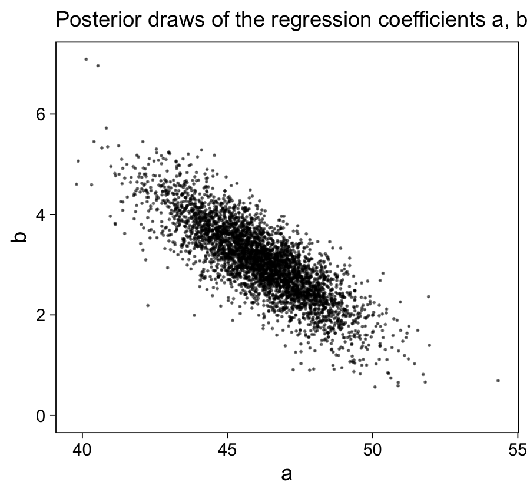
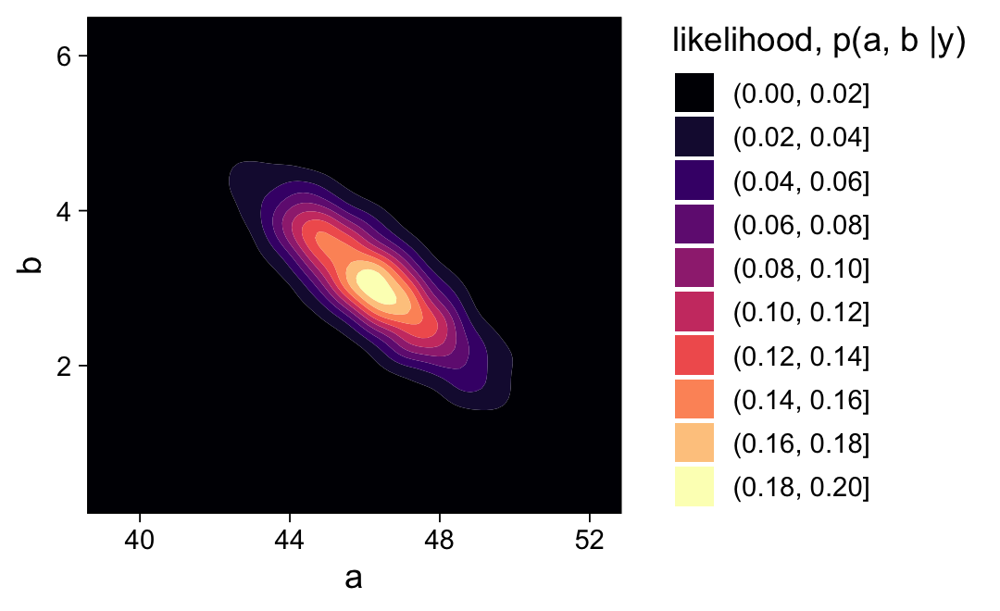
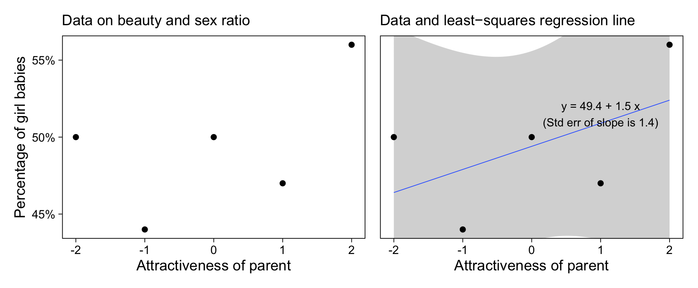

Chapter 9: Prediction and Bayesian inference
================
A Solomon Kurz
2020-12-21

# Prediction and Bayesian inference

> Bayesian inference involves three steps that go beyond classical
> estimation. First, the data and model are combined to form a
> *posterior distribution*, which we typically summarize by a set of
> simulations of the *parameters* in the model. Second, we can propagate
> uncertainty in this distribution–that is, we can get simulation-based
> *predictions* for unobserved or future outcomes that accounts for
> uncertainty in the model parameters. Third, we can include additional
> information into the model using a *prior distribution*. (p. 113,
> *emphasis* in the original)

## 9.1 Propagating uncertainty in inference using posterior simulations

Once again, we return to model `m7.1` from Chapter 7. First, we’ll load
the `hibbs.dat` data.

``` r
library(tidyverse)

hibbs <- 
  read_table2("ROS-Examples-master/ElectionsEconomy/data/hibbs.dat") %>%
  mutate(inc_party_candidate = str_remove_all(inc_party_candidate, '[\"]'),
         other_candidate     = str_remove_all(other_candidate, '[\"]'))
```

Now we load **brms** and the model.

``` r
library(brms)

m7.1 <-
  brm(data = hibbs,
      vote ~ growth,
      seed = 7,
      file = "fits/m07.01")
```

Here’s the summary.

``` r
print(m7.1, robust = T)
```

    ##  Family: gaussian 
    ##   Links: mu = identity; sigma = identity 
    ## Formula: vote ~ growth 
    ##    Data: hibbs (Number of observations: 16) 
    ## Samples: 4 chains, each with iter = 2000; warmup = 1000; thin = 1;
    ##          total post-warmup samples = 4000
    ## 
    ## Population-Level Effects: 
    ##           Estimate Est.Error l-95% CI u-95% CI Rhat Bulk_ESS Tail_ESS
    ## Intercept    46.17      1.70    42.62    49.42 1.00     3136     2089
    ## growth        3.06      0.72     1.61     4.60 1.00     2892     2528
    ## 
    ## Family Specific Parameters: 
    ##       Estimate Est.Error l-95% CI u-95% CI Rhat Bulk_ESS Tail_ESS
    ## sigma     3.92      0.75     2.81     5.96 1.00     2935     2771
    ## 
    ## Samples were drawn using sampling(NUTS). For each parameter, Bulk_ESS
    ## and Tail_ESS are effective sample size measures, and Rhat is the potential
    ## scale reduction factor on split chains (at convergence, Rhat = 1).

These summaries are derived from the posterior simulations, which you
can access directly with `posterior_samples()`.

``` r
post <- posterior_samples(m7.1)

head(post)
```

    ##   b_Intercept b_growth    sigma      lp__
    ## 1    43.57748 4.135104 4.869066 -48.79132
    ## 2    44.88859 4.380312 4.332430 -49.22774
    ## 3    45.92784 3.136119 4.232848 -47.14143
    ## 4    45.50786 3.934296 3.782167 -48.08805
    ## 5    47.27929 2.282683 3.445486 -47.62641
    ## 6    44.90224 3.714050 2.794920 -48.70500

We can hand-compute the median and mad sd for each using a
**tidyverse**-style workflow like this.

``` r
post %>% 
  pivot_longer(b_Intercept:sigma) %>% 
  group_by(name) %>% 
  summarise(median = median(value),
            mad_sd = mad(value))
```

    ## # A tibble: 3 x 3
    ##   name        median mad_sd
    ##   <chr>        <dbl>  <dbl>
    ## 1 b_growth      3.06  0.721
    ## 2 b_Intercept  46.2   1.70 
    ## 3 sigma         3.92  0.754

### 9.1.1 Uncertainty in the regression coefficients and implied uncertainty in the regression line.

Before we make Figure 9.1, it’ll be handy to save a few summary values.

``` r
med_a <- median(post$b_Intercept)
med_b <- median(post$b_growth)

se_a <- fixef(m7.1, robust = T)[1, 2]
se_b <- fixef(m7.1, robust = T)[2, 2]
```

Now make the two subplots of Figure 9.1.

``` r
# set the global plotting theme
theme_set(theme_linedraw() +
            theme(panel.grid = element_blank()))

# left
p1 <-
  post %>% 
  ggplot(aes(x = b_Intercept)) +
  geom_histogram(binwidth = 1, boundary = 0, 
                 fill = "grey75", color = "white") +
  geom_vline(xintercept = med_a) +
  geom_segment(x = med_a - se_a, xend = med_a + se_a,
               y = 575, yend = 575,
               arrow = arrow(ends = "both", length = unit(0.25, "cm"))) +
  geom_segment(x = med_a - se_a * 2, xend = med_a + se_a * 2,
               y = 250, yend = 250,
               arrow = arrow(ends = "both", length = unit(0.25, "cm"))) +
  scale_y_continuous(NULL, breaks = NULL) +
  labs(subtitle = "Posterior simulations of the intercept, a,\nand posterior median +/− 1 and 2 std err",
       x = "a")

# right
p2 <-
  post %>% 
  ggplot(aes(x = b_growth)) +
  geom_histogram(binwidth = 0.5, boundary = 0, 
                 fill = "grey75", color = "white") +
  geom_vline(xintercept = med_b) +
  geom_segment(x = med_b - se_b, xend = med_b + se_b,
               y = 625, yend = 625,
               arrow = arrow(ends = "both", length = unit(0.25, "cm"))) +
  geom_segment(x = med_b - se_b * 2, xend = med_b + se_b * 2,
               y = 275, yend = 275,
               arrow = arrow(ends = "both", length = unit(0.25, "cm"))) +
  scale_y_continuous(NULL, breaks = NULL) +
  labs(subtitle = "Posterior simulations of the intercept, b,\nand posterior median +/− 1 and 2 std err",
       x = "b")
```

Bind the two subplots together with **patchwork** syntax and plot.

``` r
library(patchwork)

p1 + p2
```


The scatter plot of Figure 9.2 is pretty simple.

``` r
p1 <-
  post %>% 
  ggplot(aes(x = b_Intercept, y = b_growth)) +
  geom_point(size = 1/6, alpha = 1/2) +
  labs(subtitle = "Posterior draws of the regression coefficients a, b",
       x = "a",
       y = "b") +
  ylim(0, NA)

p1
```



The spaghetti plot in Figure 9.2b is a little more involved. Here we
make it and then combine the two ggplots to make the complete Figure
9.2.

``` r
set.seed(9)

p2 <-
  posterior_samples(m7.1) %>% 
  slice_sample(n = 100) %>% 
  
  ggplot() +
  geom_abline(aes(intercept = b_Intercept, slope = b_growth),
              size = 1/4, alpha = 1/2, color = "grey33") +
  geom_point(data = hibbs,
             aes(x = growth, y = vote)) +
  scale_x_continuous("Average recent growth in personal income",
                     breaks = 0:4, labels = function(x) str_c(x, "%"),
                     limits = c(-1, 5), expand = c(0, 0)) +
  scale_y_continuous("Incumbent party's vote share",
                     labels = function(x) str_c(x, "%")) +
  coord_cartesian(ylim = c(43, 62)) +
  labs(subtitle = "Data and 100 posterior draws of the line, y = a + bx",
       x = "x",
       y = "y")

# combine
(p1 + p2) &
  theme(plot.subtitle = element_text(size = 10),
        plot.title.position = "plot")
```


### 9.1.2 Using the matrix of posterior simulations to express uncertainty about a parameter estimate or function of parameter estimates.

Here’s a **tidyverse** way to compute the central tendency (median) and
spread (mad sd) for a combination of parameters.

``` r
post %>% 
  mutate(z = b_Intercept / b_growth) %>% 
  summarise(median = median(z),
            mad_sd = mad(z))
```

    ##     median   mad_sd
    ## 1 15.13406 3.958303

## 9.2 Prediction and uncertainty: `predict`, `posterior_linpred`, and `posterior_predict`

The **brms** package also includes the `predict()`,
`posterior_linpred()`, and `posterior_predict()` functions. On page 115,
we learn these will alow us to

  - compute “the best point estimate of the average value of \(y\) for
    new data points,” \(\hat a + \hat b x^\text{new}\);
  - compute “the distribution of uncertainty about the expected or
    average value of \(y\) for new data points,” \(a + b x^\text{new}\)
    ; and
  - compute the “uncertainty about a new observation \(y\) with
    predictors \(x^\text{new}\),” \(a + b x^\text{new} + \text{error}\).

### 9.2.1 Point prediction using predict.

Say we want to use our `m7.1` to predict an incumbent’s vote percentage,
conditional on 2% economic growth. If we would like a simple point
prediction, we can use `brms::predict()`. A key point is we’ll need to
feed in our `growth` value by way of a data frame or tibble, which we’ll
call `new`. The `new` data is then fed into the `newdata` argument. If
we want the point summarized by a posterior median, rather than a
posterior mean, we need to set `robust = TRUE`.

``` r
new <- tibble(growth = 2.0)

predict(m7.1, 
        newdata = new,
        robust = T)
```

    ##      Estimate Est.Error     Q2.5    Q97.5
    ## [1,] 52.34521  4.054479 43.86683 60.84996

As is typical, **brms** accompanies the point `Estimate` with measures
of spread. If we wanted to use the posterior medians of the `a` and `b`
parameters to do this by hand, it will probably be easiest to extract
these using `fixef()`.

``` r
a_hat <- fixef(m7.1, robust = T)[1, 1]
b_hat <- fixef(m7.1, robust = T)[2, 1]

a_hat + b_hat * new
```

    ##    growth
    ## 1 52.3002

This method, however, gives a point estimate without any measures of
spread.

### 9.2.2 Linear predictor with uncertainty using `posterior_linpred` or `posterior_epred`.

Much like in the text, the `brms::posterior_linpred()` function returns
a vector of posterior draws.

``` r
y_linpred <-
  posterior_linpred(m7.1, 
                    newdata = new,
                    robust = T)

str(y_linpred)
```

    ##  num [1:4000, 1] 51.8 53.6 52.2 53.4 51.8 ...

We can get these by hand by working directly with `post`.

``` r
post %>% 
  mutate(growth = 2) %>% 
  mutate(y_linpred = b_Intercept + b_growth * growth) %>% 
  select(y_linpred) %>% 
  head()
```

    ##   y_linpred
    ## 1  51.84769
    ## 2  53.64921
    ## 3  52.20008
    ## 4  53.37645
    ## 5  51.84466
    ## 6  52.33034

Happily for y’all **tidyverse** fans, this method returns a tibble.

### 9.2.3 Predictive distribution for a new observation using `posterior_predict`.

The `brms::posterior_predict()` function works very much like the
`posterior_linpred()`, from last section.

``` r
y_pred <-
  posterior_predict(m7.1, 
                    newdata = new,
                    robust = T)

str(y_pred)
```

    ##  num [1:4000, 1] 52.3 54.1 60 46.7 53.8 ...
    ##  - attr(*, "dimnames")=List of 2
    ##   ..$ : NULL
    ##   ..$ : NULL

You can do this by hand, to, by working directly with `post`.

``` r
post %>% 
  mutate(growth = 2) %>% 
  mutate(y_pred = rnorm(n(), mean = b_Intercept + b_growth * growth, sd = sigma)) %>% 
  select(y_pred) %>% 
  head()
```

    ##     y_pred
    ## 1 55.63878
    ## 2 52.33014
    ## 3 48.23221
    ## 4 54.64312
    ## 5 48.46242
    ## 6 57.00513

Either way, we can now visualize the uncertainty in `y_pred` using a
histogram. Here we’ll do that with the results from the
`posterior_predict()` method.

``` r
tibble(y_pred = y_pred) %>% 
  ggplot(aes(x = y_pred)) +
  geom_histogram(binwidth = 1, boundary = 0, 
                 fill = "grey75", color = "white") +
  scale_y_continuous(NULL, breaks = NULL)
```


Here’s a numeric breakdown.

``` r
tibble(y_pred = y_pred) %>% 
  summarise(median = median(y_pred),
            mad_sd = mad(y_pred),
            win_prob = mean(y_pred > 50))
```

    ## # A tibble: 1 x 3
    ##   median mad_sd win_prob
    ##    <dbl>  <dbl>    <dbl>
    ## 1   52.3   4.04    0.718

### 9.2.4 Prediction given a range of input values.

We can use these three functions to evaluate the posterior predictions
for a range of predictor values. First we define a range of `growth`
values.

``` r
new_grid <- tibble(growth = seq(from = -2.0, to = 4.0, by = 0.5))

glimpse(new_grid)
```

    ## Rows: 13
    ## Columns: 1
    ## $ growth <dbl> -2.0, -1.5, -1.0, -0.5, 0.0, 0.5, 1.0, 1.5, 2.0, 2.5, 3.0, 3.5…

Now plug those into our post-processing functions.

``` r
y_point_pred_grid <- 
  predict(m7.1, 
          newdata = new_grid,
          robust = T) 

y_linpred_grid <- 
  posterior_linpred(m7.1, 
                    newdata = new_grid,
                    robust = T) 

y_pred_grid <- 
  posterior_predict(m7.1, 
                    newdata = new_grid,
                    robust = T)
```

Use the `str()` function to inspect what we’ve done.

``` r
str(y_point_pred_grid)
```

    ##  num [1:13, 1:4] 39.9 41.6 43 44.6 46 ...
    ##  - attr(*, "dimnames")=List of 2
    ##   ..$ : NULL
    ##   ..$ : chr [1:4] "Estimate" "Est.Error" "Q2.5" "Q97.5"

``` r
str(y_linpred_grid)
```

    ##  num [1:4000, 1:13] 35.3 36.1 39.7 37.6 42.7 ...

``` r
str(y_pred_grid)
```

    ##  num [1:4000, 1:13] 31.1 46.1 39.2 39.7 42 ...
    ##  - attr(*, "dimnames")=List of 2
    ##   ..$ : NULL
    ##   ..$ : NULL

The first function, `brms::predict()`, returned a \(13 \times 4\)
numeric array where the rows indexed each of the 13 `growth` values and
the columns are the typical **brms** summary statistics: `Estimate`,
`Est.Error`, `Q2.5`, and `Q97.5`. Both `posterior_linpred()` and
`posterior_predict()` returned \(4{,}000 \times 13\) numeric arrays
where the columns marks off the 13 values of `growth` and the rows index
the 4,000 posterior draws for each.

### 9.2.5 Propagating uncertainty.

If we want to propagate uncertainty in our predictor, too, it’s probably
easiest to do with by working with `post` itself. Here we express that
uncertainty as \(\text{growth} \sim \operatorname{Normal}(2, 0.3)\).

``` r
post %>% 
  # make the uncertain predictor
  mutate(growth = rnorm(n(), mean = 2.0, sd = 0.3)) %>% 
  # predict
  mutate(y_pred = rnorm(n(), mean = b_Intercept + b_growth * growth, sd = sigma)) %>% 
  # now summarize
  summarise(median = median(y_pred),
            mad_sd = mad(y_pred),
            win_prob = mean(y_pred > 50))
```

    ##     median   mad_sd win_prob
    ## 1 52.25965 4.146263  0.70675

### 9.2.6 Simulating uncertainty for the linear predictor and new observations.

Load the `earnings.csv` data.

``` r
earnings <- read_csv("ROS-Examples-master/Earnings/data/earnings.csv")

glimpse(earnings)
```

    ## Rows: 1,816
    ## Columns: 15
    ## $ height           <dbl> 74, 66, 64, 65, 63, 68, 63, 64, 62, 73, 72, 72, 72, …
    ## $ weight           <dbl> 210, 125, 126, 200, 110, 165, 190, 125, 200, 230, 17…
    ## $ male             <dbl> 1, 0, 0, 0, 0, 0, 0, 0, 0, 1, 1, 1, 1, 1, 0, 1, 1, 1…
    ## $ earn             <dbl> 50000, 60000, 30000, 25000, 50000, 62000, 51000, 900…
    ## $ earnk            <dbl> 50.00, 60.00, 30.00, 25.00, 50.00, 62.00, 51.00, 9.0…
    ## $ ethnicity        <chr> "White", "White", "White", "White", "Other", "Black"…
    ## $ education        <dbl> 16, 16, 16, 17, 16, 18, 17, 15, 12, 17, 15, NA, 12, …
    ## $ mother_education <dbl> 16, 16, 16, 17, 16, 18, 17, 15, 12, 17, 15, 99, 12, …
    ## $ father_education <dbl> 16, 16, 16, NA, 16, 18, 17, 15, 12, 17, 15, 99, 12, …
    ## $ walk             <dbl> 3, 6, 8, 8, 5, 1, 3, 7, 2, 7, 8, 1, 1, 4, 7, 7, 6, 4…
    ## $ exercise         <dbl> 3, 5, 1, 1, 6, 1, 1, 4, 2, 1, 1, 1, 2, 1, 4, 4, 5, 6…
    ## $ smokenow         <dbl> 2, 1, 2, 2, 2, 2, 2, 1, 2, 1, 2, 2, 2, 2, 2, 2, 2, 2…
    ## $ tense            <dbl> 0, 0, 1, 0, 0, 2, 4, 4, 0, 0, 0, 0, 1, 0, 2, 0, 2, 0…
    ## $ angry            <dbl> 0, 0, 1, 0, 0, 2, 4, 4, 0, 0, 0, 0, 1, 0, 2, 0, 2, 0…
    ## $ age              <dbl> 45, 58, 29, 57, 91, 54, 39, 26, 49, 46, 21, 53, 26, …

Use `brm()` to fit the model,
\(\text{weight}_i = a + b \text{height}_i + e_i\), using default weak
priors.

``` r
m9.1 <-
  brm(data = earnings,
      weight ~ height,
      seed = 9,
      file = "fits/m09.01")
```

Check the summary.

``` r
print(m9.1, robust = T)
```

    ##  Family: gaussian 
    ##   Links: mu = identity; sigma = identity 
    ## Formula: weight ~ height 
    ##    Data: earnings (Number of observations: 1789) 
    ## Samples: 4 chains, each with iter = 2000; warmup = 1000; thin = 1;
    ##          total post-warmup samples = 4000
    ## 
    ## Population-Level Effects: 
    ##           Estimate Est.Error l-95% CI u-95% CI Rhat Bulk_ESS Tail_ESS
    ## Intercept  -173.66     12.01  -196.66  -150.99 1.00     4174     2753
    ## height        4.95      0.18     4.62     5.30 1.00     4184     2733
    ## 
    ## Family Specific Parameters: 
    ##       Estimate Est.Error l-95% CI u-95% CI Rhat Bulk_ESS Tail_ESS
    ## sigma    28.98      0.48    28.07    29.96 1.00     4828     2985
    ## 
    ## Samples were drawn using sampling(NUTS). For each parameter, Bulk_ESS
    ## and Tail_ESS are effective sample size measures, and Rhat is the potential
    ## scale reduction factor on split chains (at convergence, Rhat = 1).

Since the intercept is difficult to interpret with this
parameterization, we might center the predictor.

``` r
earnings <-
  earnings %>% 
  mutate(c_height = height - 66)
```

Now fit the model,
\(\text{weight}_i = a + b (\text{height}_i - 66) + e_i\).

``` r
m9.2 <-
  brm(data = earnings,
      weight ~ c_height,
      seed = 9,
      file = "fits/m09.02")
```

``` r
print(m9.2, robust = T)
```

    ##  Family: gaussian 
    ##   Links: mu = identity; sigma = identity 
    ## Formula: weight ~ c_height 
    ##    Data: earnings (Number of observations: 1789) 
    ## Samples: 4 chains, each with iter = 2000; warmup = 1000; thin = 1;
    ##          total post-warmup samples = 4000
    ## 
    ## Population-Level Effects: 
    ##           Estimate Est.Error l-95% CI u-95% CI Rhat Bulk_ESS Tail_ESS
    ## Intercept   153.37      0.70   152.02   154.73 1.00     3845     2740
    ## c_height      4.95      0.18     4.61     5.30 1.00     4156     3170
    ## 
    ## Family Specific Parameters: 
    ##       Estimate Est.Error l-95% CI u-95% CI Rhat Bulk_ESS Tail_ESS
    ## sigma    28.96      0.46    28.04    29.91 1.00     4373     3132
    ## 
    ## Samples were drawn using sampling(NUTS). For each parameter, Bulk_ESS
    ## and Tail_ESS are effective sample size measures, and Rhat is the potential
    ## scale reduction factor on split chains (at convergence, Rhat = 1).

The intercept, 153.4, is the expected `weight` value when `height
== 66`. If we’d like a simple point prediction for `weight` when
`c_height == 4`, we might use `brms::predict()`.

``` r
new <- tibble(c_height = 4.0)

predict(m9.2, 
        newdata = new,
        robust = T)[1]
```

    ## [1] 173.454

If we’d like simulated draws for the linear predictor, we might use
`brms::posterior_linpred()`.

``` r
posterior_linpred(m9.2, 
                  newdata = new,
                  robust = T) %>% 
  head()
```

    ##          [,1]
    ## [1,] 172.6872
    ## [2,] 172.9778
    ## [3,] 171.6364
    ## [4,] 174.0224
    ## [5,] 172.2289
    ## [6,] 174.1767

If we want a full posterior predictive distribution for new persons of
`c_weight == 4`, we’d then use `posterior_predict()`.

``` r
posterior_predict(m9.2, 
                  newdata = new,
                  robust = T) %>% 
  head()
```

    ##          [,1]
    ## [1,] 147.2997
    ## [2,] 160.7178
    ## [3,] 117.7868
    ## [4,] 201.9633
    ## [5,] 174.2102
    ## [6,] 185.6275

## 9.3 Prior information and Bayesian synthesis.

> Classical statistical methods produce summaries and inferences based
> on a single dataset. *Bayesian methods* combine a model of the data
> with *prior information* with the goal of obtaining inferences that
> are consistent with both sources of information. (p. 119, *emphasis*
> in the original)

### 9.3.1 Expressing data and prior information on the same scale.

Presuming the normal distribution for both the prior and likelihood, we
can express the prior as
\(\mathcal N (\hat \theta_\text{prior}, \text{se}_\text{prior})\).
Similarly, we can express the likelihood as
\(\mathcal N (\hat \theta_\text{data}, \text{se}_\text{data})\). We can
then combine these two forms of information to compute the posterior
mean as

\[\hat \theta_\text{Bayes} = \left( \frac{1}{\text{se}_\text{prior}^2} \hat \theta_\text{prior} + \frac{1}{\text{se}_\text{data}^2} \hat \theta_\text{data} \right)  \bigg / \left( \frac{1}{\text{se}_\text{prior}^2} + \frac{1}{\text{se}_\text{data}^2} \right).\]

The formula for the standard error around that posterior mean is

\[\text{se}_\text{Bayes} = 1 \bigg / \sqrt{\frac{1}{\text{se}_\text{prior}^2} + \frac{1}{\text{se}_\text{data}^2}}.\]

The authors also suggested that Bayesian inference may be thought of as
a weighted average of the data and the prior.

### 9.3.2 Bayesian information aggregation.

Set our prior values.

``` r
theta_hat_prior <- 0.524 
se_prior <- 0.041
```

Set the new data estimates.

``` r
n <- 400
y <- 190
theta_hat_data <- y / n
se_data <- sqrt((y / n) * (1 - y / n) / n)
```

Now compute the posterior values.

``` r
theta_hat_bayes <- (theta_hat_prior / se_prior^2 + theta_hat_data / se_data^2) / (1 / se_prior^2 + 1 / se_data^2)
se_bayes <- sqrt(1 / (1 / se_prior^2 + 1 / se_data^2))
```

Now we can make our version of Figure 9.3.

``` r
# define the density values for the prior, likelihood, and posterior
d <-
  tibble(theta = seq(from = 0.35, to = 0.7, length.out = 200)) %>% 
  mutate(prior      = dnorm(theta, mean = theta_hat_prior, sd = se_prior),
         likelihood = dnorm(theta, mean = theta_hat_data,  sd = se_data),
         posterior  = dnorm(theta, mean = theta_hat_bayes, sd = se_bayes))

# this is for the annotation
text <-
  tibble(theta   = c(0.44, 0.58, 0.5),
         density = c(8, 5, 18),
         label   = c("Likelihood", "Prior", "Posterior"),
         hjust   = c(1, 0, 0))
# left
p1 <-
  d %>% 
  ggplot(aes(x = theta)) +
  geom_line(aes(y = prior)) +
  geom_line(aes(y = likelihood)) +
  geom_text(data = filter(text, label != "Posterior"),
            aes(y = density, label = label, hjust = hjust)) +
  scale_x_continuous(expression(theta), breaks = 4:6 / 10, expand = c(0, 0)) +
  scale_y_continuous(NULL, breaks = NULL, expand = expansion(mult = c(0, 0.05)))

# right
p2 <-
  d %>% 
  ggplot(aes(x = theta)) +
  geom_line(aes(y = prior),
            size = 1/4) +
  geom_line(aes(y = likelihood),
            size = 1/4) +
  geom_line(aes(y = posterior)) +
  geom_text(data = text,
            aes(y = density, label = label, hjust = hjust)) +
  scale_x_continuous(expression(theta), breaks = 4:6 / 10, expand = c(0, 0)) +
  scale_y_continuous(NULL, breaks = NULL, expand = expansion(mult = c(0, 0.05)))

# combine
p1 + p2
```


Here’s what happens if we have a less certain likelihood, as expressed
by a larger `se_data` value.

``` r
# less certain se for the likelihood
se_data <- 0.075

# update the posterior
theta_hat_bayes <- (theta_hat_prior / se_prior^2 + theta_hat_data / se_data^2) / (1 / se_prior^2 + 1 / se_data^2)
se_bayes <- sqrt(1 / (1 / se_prior^2 + 1 / se_data^2))

# define the new density values for the prior, likelihood, and posterior
d <-
  tibble(theta = seq(from = 0.35, to = 0.7, length.out = 200)) %>% 
  mutate(prior      = dnorm(theta, mean = theta_hat_prior, sd = se_prior),
         likelihood = dnorm(theta, mean = theta_hat_data,  sd = se_data),
         posterior  = dnorm(theta, mean = theta_hat_bayes, sd = se_bayes))

# this is for the annotation
text <-
  tibble(theta   = c(0.42, 0.56, 0.53),
         density = c(4.7, 7.5, 10.75),
         label   = c("Likelihood", "Prior", "Posterior"),
         hjust   = c(1, 0, 0))
# left
p1 <-
  d %>% 
  ggplot(aes(x = theta)) +
  geom_line(aes(y = prior)) +
  geom_line(aes(y = likelihood)) +
  geom_text(data = filter(text, label != "Posterior"),
            aes(y = density, label = label, hjust = hjust)) +
  scale_x_continuous(expression(theta), breaks = 4:6 / 10, expand = c(0, 0)) +
  scale_y_continuous(NULL, breaks = NULL, expand = expansion(mult = c(0, 0.05)))

# right
p2 <-
  d %>% 
  ggplot(aes(x = theta)) +
  geom_line(aes(y = prior),
            size = 1/4) +
  geom_line(aes(y = likelihood),
            size = 1/4) +
  geom_line(aes(y = posterior)) +
  geom_text(data = text,
            aes(y = density, label = label, hjust = hjust)) +
  scale_x_continuous(expression(theta), breaks = 4:6 / 10, expand = c(0, 0)) +
  scale_y_continuous(NULL, breaks = NULL, expand = expansion(mult = c(0, 0.05)))

# combine
p1 + p2
```


### 9.3.3 Different ways of assigning prior distributions and performing Bayesian calculations.

> In the general example of regression modeling, we must specify prior
> information on all the coefficients, which in practice often entails
> weak priors on coefficients for which we have little knowledge or
> about which we do not want to make any strong assumptions. (p. 121)

## 9.4 Example of Bayesian inference: beauty and sex ratio

“We can use prior information to refine estimates from noisy studies”
(p. 121). The motivation for this example has its origins in a paper by
[Kanazawa](https://www.sciencedirect.com/science/article/abs/pii/S0022519306003079).

Load the `sexratio.rda` data.

``` r
load("ROS-Examples-master/SexRatio/data/sexratio.rda")

head(sexratio)
```

    ##    x  y
    ## 1 -2 50
    ## 2 -1 44
    ## 3  0 50
    ## 4  1 47
    ## 5  2 56

The five attractiveness ratings are displayed in the `x` column. The `y`
column contains the percent of adults who were parents of girls, by `x`
category. Here they are in a quick plot.

``` r
sexratio %>% 
  ggplot(aes(x = x, y = y, label = y)) +
  geom_hline(yintercept = 50, color = "grey75", size = 1/4) +
  geom_text() +
  scale_y_continuous("% parents of girls", limits = c(0, 100), expand = c(0, 0)) +
  xlab("parental attractiveness rating")
```


### 9.4.1 Prior information.

> More information is available, however. It is well known that the
> variation in the human sex ratio occurs in a very narrow range. For
> example, a recent count in the United States reported 48.7% girls
> among whites and 49.2% among blacks. Similar differences of half of a
> percentage point or less have been found when comparing based on
> factors such as birth order, maternal age, or season of birth. Given
> that attractiveness is itself only subjectively measured, we would
> find it hard to believe that any difference between more and less
> attractive parents could be as large as 0.5%. (p. 121)

### 9.4.2 Prior estimate and standard error.

> We can express our scientific knowledge as a prior distribution on
> \(\theta\) with mean 0% and standard deviation 0.25%. The prior mean
> of zero says that before seeing the data, we would have no reason to
> expect beautiful parents to have an elevated or depressed rate of girl
> births. The prior standard deviation of 0.25% says that we find it
> highly implausible that the true value of \(\theta\) is higher than
> 0.5% or lower than -0.5%. (p. 122)

### 9.4.3 Data estimate and standard error.

> On the percentage scale the survey gives us the estimate
> \(\hat \theta_\text{data} = 8\%\) with standard error
> \(\text{se}_\text{data} = 3\%\), and we can now see that the prior is
> much more informative than the data: the data standard error is more
> than 10 times the prior uncertainty. (p. 122)

### 9.4.4 Bayes estimate.

If we use the equations from \[Section 9.3.1\]\[Expressing data and
prior information on the same scale.\], we’ll see the is
\(\hat \theta_\text{Bayes} = 0.06\%\) with
\(\text{se}_\text{Bayes} = 0.25\%\).

### 9.4.5 Understanding the Bayes estimate.

Recall the total sample size is 3,000 and the proportions all hover
around .5.

  - We can compute the standard error for a proportion near .5 as
    \(\sqrt{.5 \times .5 / 3{,}000} = 0.009\)
  - The standard error for the difference between two groups, each of
    \(n = 1{,}500\), may be computed with
    \(\sqrt{p_1 (1 - p_1) / 1{,}500 + p_2 (1 - p_2) / 1{,}500}\). Given
    a situation where \(p_1 \approx p_2 \approx .5\), you can compute
    this as \(\sqrt{2 \times .5 \times .5 / 1{,}500} = 0.018\).
  - Because the sample sizes were not equal in the groups, their
    standard error was a bit larger. Here’s how the math shakes out if
    you set \(n = 300\) (i.e., 10% of 3,000) in the “attractive” group:
    \(\sqrt{(.5 \times .5 / 300) + (.5 \times .5 / 2{,}700)} = 0.03\).

## 9.5 Uniform, weakly informative, and informative priors in regression

> In Bayesian inference the likelihood is multiplied by a *prior
> distribution* to yield a *posterior distribution*, which we take as a
> summary of our inference given model and data. In this section we
> consider uniform, weakly informative, and informative prior
> distributions and how to work with them using ~~`stan_glm`~~
> \[`brms::brm()`\]. (p. 123, *emphasis* in the original)

### 9.5.1 Uniform prior distribution

With the `stan_glm()`, you can fit a model with uniform priors by
setting the relevant prior arguments to `NULL`.

``` r
stan_glm(data = hibbs, 
         vote ~ growth, 
         prior_intercept = NULL, prior = NULL, prior_aux = NULL)
```

Though **brms** package is generally quite flexible in the models and
priors it supports, it does not fully support flat priors in this way.
If you’re tricky, you can get close. By default, the priors of `class =
b` have a flat prior across the real number line. This is essentially
\(\operatorname{Uniform}(-\infty, \infty)\). Parameters of `class =
Intercept` will not allow for this setting. However, there is a
workaround. Recall that one can suppress the default intercept with the
`y ~ 0` syntax. **brms** allows users to then add the intercept back in
by naming the next parameter `Intercept`, as in `y ~ 0 + Intercept`. The
prior for new `Intercept` parameter will be of `class = b`, which will
now have a default flat prior just like all other priors of that class.

\(\sigma\), however, is not as flexible. By default, **brms** sets the
lower bound of \(\sigma\) at zero and I am not currently aware of a
workaround. I’m also not aware that one can set the upper bound of sigma
to positive infinity, which means that one cannot set make
\(\sigma \sim \operatorname{Uniform}(0, \infty)\). However, one can set
use a uniform prior with a very large upper bound, like `1e15` or so.
Using that approach, we can express an almost completely flat prior
distribution for the model along these lines:

Here’s how to fit that model with `brm()`. Note that because we’re using
the default flat priors for both `Intercept` and `growth`, there is no
need to explicitly state that in the `brm()` function.

``` r
m9.3 <-
  brm(data = hibbs,
      family = gaussian,
      vote ~ 0 + Intercept + growth,
      prior(uniform(0, 1e15), class = sigma),
      seed = 9,
      file = "fits/m09.03")
```

Check the model summary

``` r
print(m9.3, robust = T)
```

    ##  Family: gaussian 
    ##   Links: mu = identity; sigma = identity 
    ## Formula: vote ~ 0 + Intercept + growth 
    ##    Data: hibbs (Number of observations: 16) 
    ## Samples: 4 chains, each with iter = 2000; warmup = 1000; thin = 1;
    ##          total post-warmup samples = 4000
    ## 
    ## Population-Level Effects: 
    ##           Estimate Est.Error l-95% CI u-95% CI Rhat Bulk_ESS Tail_ESS
    ## Intercept    46.21      1.78    42.55    49.87 1.00     1250     1431
    ## growth        3.08      0.77     1.48     4.64 1.00     1361     1375
    ## 
    ## Family Specific Parameters: 
    ##       Estimate Est.Error l-95% CI u-95% CI Rhat Bulk_ESS Tail_ESS
    ## sigma     4.02      0.81     2.87     6.33 1.00     1603     1800
    ## 
    ## Samples were drawn using sampling(NUTS). For each parameter, Bulk_ESS
    ## and Tail_ESS are effective sample size measures, and Rhat is the potential
    ## scale reduction factor on split chains (at convergence, Rhat = 1).

To make Figure 9.4, we need to collect the posterior draws.

``` r
post <- 
  posterior_samples(m9.3) %>% 
  # rename
  mutate(a = b_Intercept,
         b = b_growth)

head(post)
```

    ##   b_Intercept  b_growth    sigma      lp__        a         b
    ## 1    51.97617 1.8758537 4.522369 -82.46576 51.97617 1.8758537
    ## 2    48.31582 0.6675595 6.373619 -82.72754 48.31582 0.6675595
    ## 3    48.00311 0.7944445 6.440312 -82.62761 48.00311 0.7944445
    ## 4    49.61209 1.5555390 6.840024 -80.95397 49.61209 1.5555390
    ## 5    43.60384 5.1051380 4.164798 -80.58188 43.60384 5.1051380
    ## 6    46.50083 4.0405882 4.061941 -79.29003 46.50083 4.0405882

We can make a **ggplot2** alternative to Gelman et al’s wire frame plot
with a filled 2D density plot.

``` r
p1 <-
  post %>% 
  ggplot(aes(x = a, y = b)) +
  geom_density2d_filled() + 
  scale_fill_viridis_d("likelihood, p(a, b |y)", option = "A") +
  scale_x_continuous(expand = c(0, 0)) +
  scale_y_continuous(expand = c(0, 0))  +
  theme(legend.key.size = unit(0.5, 'cm'))

p1
```



Now make the nest two panels and combine all three.

``` r
p2 <-
  post %>% 
  ggplot(aes(x = a, y = b)) +
  stat_ellipse() +
  geom_point(data = . %>% summarise(a = median(a), b = median(b))) +
  annotate(geom = "text",
           x = c(43.2, 46.8), y = c(5, 2.8),
           label = c("95% interval ellipse", "median"),
           size = 3) +
  scale_x_continuous(expand = c(0, 0), limits = range(post$a)) +
  scale_y_continuous(NULL, breaks = NULL,
                     expand = c(0, 0), limits = range(post$b)) +
  labs(subtitle = expression((hat(a)*", "*hat(b))~and~covariance~matrix))

p3 <-
  post %>% 
  ggplot(aes(x = a, y = b)) +
  geom_point(size = 1/10, alpha = 1/2) +
  scale_x_continuous(expand = c(0, 0), limits = range(post$a)) +
  scale_y_continuous(NULL, breaks = NULL,
                     expand = c(0, 0), limits = range(post$b)) +
  labs(subtitle = expression(4000~posterior~draws~of~(a*", "*b)))

(p1 + 
    labs(subtitle = "likelihood, p(a, b |y)") +
    theme(legend.position = "none")) + 
  p2 + p3
```


### 9.5.2 Default prior distribution.

Though this section is unified in the text, I’m going to split this into
four subsections. First, we’ll discuss the `rstanarm::stan_glm()`
default prior. Second, we’ll discuss the `brms::brm()` defaults. Third,
we’ll compare the two default models using formal statistical notation.
Fourth, we’ll actually fit a model.

### 9.5.2.1 Default prior distribution by `stan_glm()`.

Gelman et al pointed out `rstanarm::stan_glm()` defaults to giving all
regression coefficients a normal prior with a mean of zero and a
standard deviation set to
\(2.5 \operatorname{sd}(y) / \operatorname{sd}(x_k)\), where \(k\)
indexes the \(k\)th predictor. Here’s what that would be in the case of
our current model, `vote ~ growth`.

``` r
hibbs %>% 
  summarise(prior_sigma = 2.5 * sd(vote) / sd(growth))
```

    ## # A tibble: 1 x 1
    ##   prior_sigma
    ##         <dbl>
    ## 1        10.0

In other words, the `stan_glm()` default prior for the `growth`
\(b\)-coefficient would be \(\mathcal N(0, 10.05)\). The `stan_glm()`
default behavior for intercepts is more complicated. It is a normal
distribution for which the sigma parameter is set to
\(2.5 \operatorname{sd}(y)\). Here’s that value.

``` r
hibbs %>% 
  summarise(prior_sigma = 2.5 * sd(vote))
```

    ## # A tibble: 1 x 1
    ##   prior_sigma
    ##         <dbl>
    ## 1        14.0

The mean of the prior is the expected value in \(y\) when all the
predictor variables are set to their means,

\[a + b_1 \bar x_1 + b_2 \bar x_2 + \cdots + b_K \bar x_K.\]

We can compute that with a quick data adjustment and a little `lm()`.

``` r
hibbs <-
  hibbs %>% 
  mutate(c_growth = growth - mean(growth))

lm(data = hibbs,
   vote ~ c_growth) %>% 
  coef()
```

    ## (Intercept)    c_growth 
    ##   52.055000    3.060528

Thus the `stan_glm()` default prior for the intercept is
\(\mathcal N(52.06, 14.02)\). The default `stan_glm()` prior for
\(\sigma\) is an exponential distribution with rate
\(1 / \operatorname{sd}(y)\).

``` r
hibbs %>% 
  summarise(prior_rate = 1 / sd(vote))
```

    ## # A tibble: 1 x 1
    ##   prior_rate
    ##        <dbl>
    ## 1      0.178

We can write that as \(\sigma \sim \operatorname{Exponential}(0.178)\).

### 9.5.2.2 Default prior distribution by `brm()`.

We can use the `get_prior()` function to see the default priors for
`brm()`.

``` r
get_prior(data = hibbs,
          family = gaussian,
          vote ~ 1 + growth)
```

    ##                    prior     class   coef group resp dpar nlpar bound
    ##                   (flat)         b                                   
    ##                   (flat)         b growth                            
    ##  student_t(3, 50.8, 6.1) Intercept                                   
    ##     student_t(3, 0, 6.1)     sigma                                   
    ##        source
    ##       default
    ##  (vectorized)
    ##       default
    ##       default

As already alluded to, the **brms** default is to set a flat prior on
all \(b\) parameters, or
\(b_k \sim \operatorname{Uniform}(-\infty, \infty)\). The default
intercept prior for the intercept is a Student-\(t\) distribution with a
\(\nu\) (a.k.a *degrees of freedom*) parameter set to 3, which has
rather thick tails. The \(\mu\) parameter is set to the median of the
criterion variable. Here’s that value for our case.

``` r
median(hibbs$vote)
```

    ## [1] 50.755

The scale parameter is the mad sd for the criterion.

``` r
mad(hibbs$vote)
```

    ## [1] 6.071247

Thus, our **brms** default prior for the intercept is
\(\operatorname{Student-t}(3, 50.1, 6.1)\)

It’s not well documented, at the moment (see
[here](https://github.com/paul-buerkner/brms/issues/1062)), but `brm()`
defaults to a half Student-\(t\) prior for \(sigma\). By “half
Student-\(t\),” I mean the \(\mu\) parameter of the prior is set to zero
and the lower bound is also zero. The \(\nu\) (a.k.a *degrees of
freedom*) parameter is set to 3. The scale parameter for the
distribution, \(\sigma\), is set according to the formula `max(2.5,
mad(y))`, where `y` is the criterion variable. In words, the scale
parameter is either 2.5 or the mad sd of the criterion, whichever is the
highest value. Here’s what this in our case.

``` r
max(2.5, mad(hibbs$vote))
```

    ## [1] 6.071247

Because our mad sd for `vote` is higher than 2.5, that’s the default
value. Thus, our **brms** default prior for \(\sigma\) is
\(\operatorname{Student-t}^+(3, 0, 6.1)\).

### 9.5.2.3 Compare the two default models.

We can express the model with the `stan_glm()` default priors in
statistical notation as

In contrast, we can express the model with the `brms()` default priors
in statistical notation as

### 9.5.2.4 Fit the default prior model.

If we’d like to use `brm()` to fit a model using the **brms**-based
default priors, we just execute code leaving out the `prior` argument.

``` r
m9.4 <-
  brm(data = hibbs,
      family = gaussian,
      vote ~ growth)
```

If we’d like to explicitly set the priors, we’d execute this.

``` r
m9.4 <-
  brm(data = hibbs,
      family = gaussian,
      vote ~ growth,
      prior(student_t(3, 50.8, 6.1), class = Intercept) +
        prior(student_t(3, 0, 6.1), class = sigma))
 
print(m9.4, robust = T) 
```

You’ll notice we still didn’t include a line for the `b` parameter. If
you leave out a prior in your Stan code, it presumes an improper flat
prior over the reals, which I’m also describing as
\(\operatorname{Uniform}(-\infty, \infty)\). We won’t be fitting that
model, though. Here we’ll follow along with the text and fit the model
based on the `stan_glm()` default priors.

``` r
m9.4 <-
  brm(data = hibbs,
      family = gaussian,
      vote ~ growth,
      # set the priors
      prior(normal(52.06, 14.02), class = Intercept) +
        prior(normal(0, 10.05), class = b) +
        prior(exponential(0.178), class = sigma),
      seed = 9,
      file = "fits/m09.04")
```

Check the model summary.

``` r
print(m9.4, robust = T) 
```

    ##  Family: gaussian 
    ##   Links: mu = identity; sigma = identity 
    ## Formula: vote ~ growth 
    ##    Data: hibbs (Number of observations: 16) 
    ## Samples: 4 chains, each with iter = 2000; warmup = 1000; thin = 1;
    ##          total post-warmup samples = 4000
    ## 
    ## Population-Level Effects: 
    ##           Estimate Est.Error l-95% CI u-95% CI Rhat Bulk_ESS Tail_ESS
    ## Intercept    46.32      1.69    42.69    49.76 1.00     3041     2138
    ## growth        3.04      0.68     1.55     4.56 1.00     3290     2267
    ## 
    ## Family Specific Parameters: 
    ##       Estimate Est.Error l-95% CI u-95% CI Rhat Bulk_ESS Tail_ESS
    ## sigma     3.90      0.72     2.78     5.93 1.00     2250     2259
    ## 
    ## Samples were drawn using sampling(NUTS). For each parameter, Bulk_ESS
    ## and Tail_ESS are effective sample size measures, and Rhat is the potential
    ## scale reduction factor on split chains (at convergence, Rhat = 1).

If you fit the model using the **brms** defaults, instead, you’ll see
the results are very close.

### 9.5.3 Weakly informative prior distribution based on subject-matter knowledge.

“The default prior is intended to be enough to keep inferences stable.
In many problems we can do better by including prior information
specific to the problem at hand” (p. 124)

We can express the theory-based model Gelman and colleagues described as

Fit the model.

``` r
m9.5 <-
  brm(data = hibbs,
      family = gaussian,
      vote ~ growth,
      # set the priors
      prior(normal(50, 10), class = Intercept) +
        prior(normal(5, 5), class = b) +
        prior(exponential(0.178), class = sigma),
      seed = 9,
      file = "fits/m09.05")
```

Check the model summary.

``` r
print(m9.5, robust = T) 
```

    ##  Family: gaussian 
    ##   Links: mu = identity; sigma = identity 
    ## Formula: vote ~ growth 
    ##    Data: hibbs (Number of observations: 16) 
    ## Samples: 4 chains, each with iter = 2000; warmup = 1000; thin = 1;
    ##          total post-warmup samples = 4000
    ## 
    ## Population-Level Effects: 
    ##           Estimate Est.Error l-95% CI u-95% CI Rhat Bulk_ESS Tail_ESS
    ## Intercept    46.16      1.73    42.56    49.74 1.00     3514     2494
    ## growth        3.10      0.71     1.63     4.63 1.00     3398     2512
    ## 
    ## Family Specific Parameters: 
    ##       Estimate Est.Error l-95% CI u-95% CI Rhat Bulk_ESS Tail_ESS
    ## sigma     3.88      0.73     2.84     5.87 1.00     2622     2636
    ## 
    ## Samples were drawn using sampling(NUTS). For each parameter, Bulk_ESS
    ## and Tail_ESS are effective sample size measures, and Rhat is the potential
    ## scale reduction factor on split chains (at convergence, Rhat = 1).

It might be easiest to compare the parameter summaries for the three
models using a coefficient plot.

``` r
tibble(fit = str_c("m9.", 3:5)) %>% 
  mutate(summary = map(fit, ~get(.) %>% 
                         posterior_summary(robust = T) %>% 
                         data.frame() %>% 
                         rownames_to_column("parameter"))) %>% 
  unnest(summary) %>% 
  filter(parameter != "lp__") %>% 
  
  ggplot(aes(x = Estimate, xmin = Q2.5, xmax = Q97.5, y = fit)) +
  geom_pointrange() +
  labs(x = "marginal posterior",
       y = NULL) +
  theme(axis.ticks.y = element_blank()) +
  facet_wrap(~parameter, scales = "free_x")
```


Within each panel, the posterior medians are the dots and the horizontal
lines mark off the percentile-based 95% intervals. As the authors stated
in the text, the results are similar across models.

### 9.5.4 Example where an informative prior makes a difference: Beauty and sex ratio.

Here’s the simple OLS model for parental attractiveness predicting
precentage of girls.

``` r
lm(data = sexratio,
   y ~ x) %>% 
  summary()
```

    ## 
    ## Call:
    ## lm(formula = y ~ x, data = sexratio)
    ## 
    ## Residuals:
    ##    1    2    3    4    5 
    ##  3.6 -3.9  0.6 -3.9  3.6 
    ## 
    ## Coefficients:
    ##             Estimate Std. Error t value Pr(>|t|)    
    ## (Intercept)   49.400      1.944  25.409 0.000134 ***
    ## x              1.500      1.375   1.091 0.355025    
    ## ---
    ## Signif. codes:  0 '***' 0.001 '**' 0.01 '*' 0.05 '.' 0.1 ' ' 1
    ## 
    ## Residual standard error: 4.347 on 3 degrees of freedom
    ## Multiple R-squared:  0.2841, Adjusted R-squared:  0.04545 
    ## F-statistic:  1.19 on 1 and 3 DF,  p-value: 0.355

Display the data and the model in our version of Figure 9.5.

``` r
p1 <-
  sexratio %>% 
  ggplot(aes(x = x, y = y, label = y)) +
  geom_point() +
  scale_y_continuous("Percentage of girl babies", 
                     breaks = 9:11 * 5, labels = function(x) str_c(x, "%")) +
  labs(subtitle = "Data on beauty and sex ratio",
       x = "Attractiveness of parent")

p2 <-
  sexratio %>% 
  ggplot(aes(x = x, y = y, label = y)) +
  stat_smooth(method = "lm", size = 1/4) +
  geom_point() +
  annotate(geom = "text",
           x = 1, y = 51.5,
           label = "y = 49.4 + 1.5 x\n(Std err of slope is 1.4)",
           size = 3) +
  scale_y_continuous(NULL, breaks = NULL) +
  labs(subtitle = "Data and least−squares regression line",
       x = "Attractiveness of parent") +
  coord_cartesian(ylim = range(sexratio$y))

p1 + p2
```



The gray ribbon in the right panel marks of the 95% interval range. With
just five data points, it’s astonishingly wide. Now fit the model using
the **brms** default priors.

``` r
m9.6 <-
  brm(data = sexratio,
      family = gaussian,
      y ~ x,
      seed = 9,
      file = "fits/m09.06")
```

Check the model summary.

``` r
print(m9.6, robust = T) 
```

    ##  Family: gaussian 
    ##   Links: mu = identity; sigma = identity 
    ## Formula: y ~ x 
    ##    Data: sexratio (Number of observations: 5) 
    ## Samples: 4 chains, each with iter = 2000; warmup = 1000; thin = 1;
    ##          total post-warmup samples = 4000
    ## 
    ## Population-Level Effects: 
    ##           Estimate Est.Error l-95% CI u-95% CI Rhat Bulk_ESS Tail_ESS
    ## Intercept    49.52      1.81    45.64    53.68 1.00     2588     2212
    ## x             1.57      1.41    -1.88     5.21 1.00     2236     1699
    ## 
    ## Family Specific Parameters: 
    ##       Estimate Est.Error l-95% CI u-95% CI Rhat Bulk_ESS Tail_ESS
    ## sigma     4.53      1.57     2.50     9.95 1.00     1711     2191
    ## 
    ## Samples were drawn using sampling(NUTS). For each parameter, Bulk_ESS
    ## and Tail_ESS are effective sample size measures, and Rhat is the potential
    ## scale reduction factor on split chains (at convergence, Rhat = 1).

The results match closely with the `stan_glm()` results in the text.

``` r
m9.7 <-
  brm(data = sexratio,
      family = gaussian,
      y ~ x,
      prior(normal(48.8, 0.5), class = Intercept) +
        prior(normal(0, 0.2), class = b),
      seed = 9,
      file = "fits/m09.07")
```

Check the model summary.

``` r
print(m9.7, robust = T) 
```

    ##  Family: gaussian 
    ##   Links: mu = identity; sigma = identity 
    ## Formula: y ~ x 
    ##    Data: sexratio (Number of observations: 5) 
    ## Samples: 4 chains, each with iter = 2000; warmup = 1000; thin = 1;
    ##          total post-warmup samples = 4000
    ## 
    ## Population-Level Effects: 
    ##           Estimate Est.Error l-95% CI u-95% CI Rhat Bulk_ESS Tail_ESS
    ## Intercept    48.84      0.49    47.88    49.74 1.00     3223     2871
    ## x             0.04      0.19    -0.34     0.43 1.00     3898     2719
    ## 
    ## Family Specific Parameters: 
    ##       Estimate Est.Error l-95% CI u-95% CI Rhat Bulk_ESS Tail_ESS
    ## sigma     4.28      1.27     2.53     8.83 1.00     3265     2024
    ## 
    ## Samples were drawn using sampling(NUTS). For each parameter, Bulk_ESS
    ## and Tail_ESS are effective sample size measures, and Rhat is the potential
    ## scale reduction factor on split chains (at convergence, Rhat = 1).

These results are much more conservative than the OLS and default prior
results. Now we’ll compare the two model types with our version of
Figure 9.6.

``` r
# upper left
p1 <-
  posterior_samples(m9.6) %>% 
  ggplot(aes(x = b_Intercept, y = b_x)) +
  geom_point(size = 1/6, alpha = 1/2) +
  scale_x_continuous(NULL, breaks = NULL) +
  labs(subtitle = "Posterior simulations under default prior",
       y = "Slope, b") +
  coord_cartesian(xlim = c(35, 63),
                  ylim = c(-10, 10))

# lower left
p3 <-
  posterior_samples(m9.7) %>% 
  ggplot(aes(x = b_Intercept, y = b_x)) +
  geom_point(size = 1/6, alpha = 1/2) +
  labs(subtitle = "Posterior simulations under informative prior",
       x = "Intercept, a",
       y = "Slope, b") +
  coord_cartesian(xlim = c(35, 63),
                  ylim = c(-10, 10))

# upper right
set.seed(9)

p2 <-
  posterior_samples(m9.6) %>% 
  slice_sample(n = 100) %>% 
  
  ggplot(aes(x = x, y = y)) +
  geom_abline(aes(intercept = b_Intercept,
                  slope = b_x),
              color = "grey50", size = 1/4, alpha = 1/2) +
  geom_abline(intercept = fixef(m9.6, robust = T)[1, 1], 
              slope = fixef(m9.6, robust = T)[2, 1]) +
  geom_point(data = sexratio) +
  scale_x_continuous(NULL, breaks = NULL) +
  scale_y_continuous("Percentage of girl babies", 
                     breaks = 9:11 * 5, labels = function(x) str_c(x, "%")) +
  labs(subtitle = "Least−squares regression line and\nposterior uncertainty given default prior")

# lower right
set.seed(9)

p4 <-
  posterior_samples(m9.7) %>% 
  slice_sample(n = 100) %>% 
  
  ggplot(aes(x = x, y = y)) +
  geom_abline(aes(intercept = b_Intercept,
                  slope = b_x),
              color = "grey50", size = 1/4, alpha = 1/2) +
  geom_abline(intercept = fixef(m9.7, robust = T)[1, 1], 
              slope = fixef(m9.7, robust = T)[2, 1]) +
  geom_point(data = sexratio) +
  scale_y_continuous("Percentage of girl babies", 
                     breaks = 9:11 * 5, labels = function(x) str_c(x, "%")) +
  labs(subtitle = "Bayes estimated regression line and\nposterior uncertainty given informative prior",
       x = "Attractiveness of parent")

# combine
(p1 + p2 + p3 + p4) &
  theme(plot.subtitle = element_text(hjust = .5))
```


## Session info

``` r
sessionInfo()
```

    ## R version 4.0.3 (2020-10-10)
    ## Platform: x86_64-apple-darwin17.0 (64-bit)
    ## Running under: macOS Catalina 10.15.7
    ## 
    ## Matrix products: default
    ## BLAS:   /Library/Frameworks/R.framework/Versions/4.0/Resources/lib/libRblas.dylib
    ## LAPACK: /Library/Frameworks/R.framework/Versions/4.0/Resources/lib/libRlapack.dylib
    ## 
    ## locale:
    ## [1] en_US.UTF-8/en_US.UTF-8/en_US.UTF-8/C/en_US.UTF-8/en_US.UTF-8
    ## 
    ## attached base packages:
    ## [1] stats     graphics  grDevices utils     datasets  methods   base     
    ## 
    ## other attached packages:
    ##  [1] patchwork_1.1.0 brms_2.14.4     Rcpp_1.0.5      forcats_0.5.0  
    ##  [5] stringr_1.4.0   dplyr_1.0.2     purrr_0.3.4     readr_1.4.0    
    ##  [9] tidyr_1.1.2     tibble_3.0.4    ggplot2_3.3.2   tidyverse_1.3.0
    ## 
    ## loaded via a namespace (and not attached):
    ##   [1] minqa_1.2.4          colorspace_2.0-0     ellipsis_0.3.1      
    ##   [4] ggridges_0.5.2       rsconnect_0.8.16     estimability_1.3    
    ##   [7] markdown_1.1         base64enc_0.1-3      fs_1.5.0            
    ##  [10] rstudioapi_0.13      farver_2.0.3         rstan_2.21.2        
    ##  [13] DT_0.16              fansi_0.4.1          mvtnorm_1.1-1       
    ##  [16] lubridate_1.7.9.2    xml2_1.3.2           codetools_0.2-16    
    ##  [19] bridgesampling_1.0-0 splines_4.0.3        knitr_1.30          
    ##  [22] shinythemes_1.1.2    bayesplot_1.7.2      projpred_2.0.2      
    ##  [25] jsonlite_1.7.1       nloptr_1.2.2.2       broom_0.7.2         
    ##  [28] dbplyr_2.0.0         shiny_1.5.0          compiler_4.0.3      
    ##  [31] httr_1.4.2           emmeans_1.5.2-1      backports_1.2.0     
    ##  [34] assertthat_0.2.1     Matrix_1.2-18        fastmap_1.0.1       
    ##  [37] cli_2.2.0            later_1.1.0.1        prettyunits_1.1.1   
    ##  [40] htmltools_0.5.0      tools_4.0.3          igraph_1.2.6        
    ##  [43] coda_0.19-4          gtable_0.3.0         glue_1.4.2          
    ##  [46] reshape2_1.4.4       V8_3.4.0             cellranger_1.1.0    
    ##  [49] vctrs_0.3.5          nlme_3.1-149         crosstalk_1.1.0.1   
    ##  [52] xfun_0.19            ps_1.5.0             lme4_1.1-25         
    ##  [55] rvest_0.3.6          mime_0.9             miniUI_0.1.1.1      
    ##  [58] lifecycle_0.2.0      gtools_3.8.2         statmod_1.4.35      
    ##  [61] MASS_7.3-53          zoo_1.8-8            scales_1.1.1        
    ##  [64] colourpicker_1.1.0   hms_0.5.3            promises_1.1.1      
    ##  [67] Brobdingnag_1.2-6    parallel_4.0.3       inline_0.3.17       
    ##  [70] shinystan_2.5.0      curl_4.3             gamm4_0.2-6         
    ##  [73] yaml_2.2.1           gridExtra_2.3        StanHeaders_2.21.0-6
    ##  [76] loo_2.3.1            stringi_1.5.3        dygraphs_1.1.1.6    
    ##  [79] pkgbuild_1.1.0       boot_1.3-25          rlang_0.4.9         
    ##  [82] pkgconfig_2.0.3      matrixStats_0.57.0   evaluate_0.14       
    ##  [85] lattice_0.20-41      labeling_0.4.2       rstantools_2.1.1    
    ##  [88] htmlwidgets_1.5.2    processx_3.4.5       tidyselect_1.1.0    
    ##  [91] plyr_1.8.6           magrittr_2.0.1       R6_2.5.0            
    ##  [94] generics_0.1.0       DBI_1.1.0            pillar_1.4.7        
    ##  [97] haven_2.3.1          withr_2.3.0          mgcv_1.8-33         
    ## [100] xts_0.12.1           abind_1.4-5          modelr_0.1.8        
    ## [103] crayon_1.3.4         utf8_1.1.4           rmarkdown_2.5       
    ## [106] isoband_0.2.3        grid_4.0.3           readxl_1.3.1        
    ## [109] callr_3.5.1          threejs_0.3.3        reprex_0.3.0        
    ## [112] digest_0.6.27        xtable_1.8-4         httpuv_1.5.4        
    ## [115] RcppParallel_5.0.2   stats4_4.0.3         munsell_0.5.0       
    ## [118] viridisLite_0.3.0    shinyjs_2.0.0
