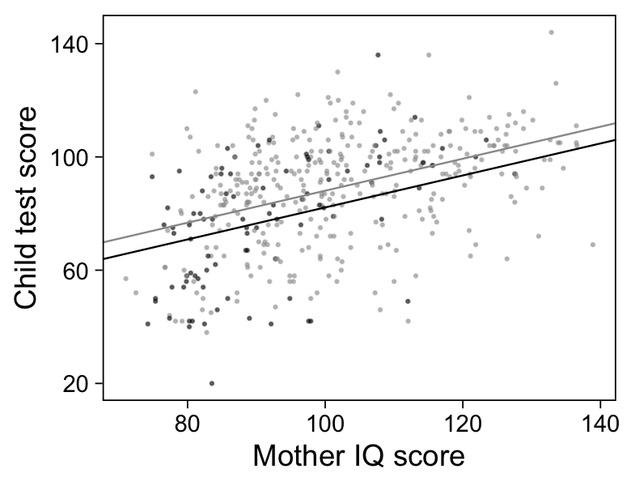

Chapter 10: Linear regression with multiple predictors
================
A Solomon Kurz
2020-12-21

# Linear regression with multiple predictors

> As we move from the simple model, \(y = a + bx + \text{error}\) to the
> more general
> \(y = \beta_0 + \beta_1 x_1 + \beta_2 x_2 + \cdots + \text{error}\),
> complexities arise, involving choices of what predictors \(x\) to
> include in the model, interpretations of the coefficients and how they
> interact, and construction of new predictors from existing variables
> to capture discreteness and nonlinearity. We need to learn how to
> build and understand models as new predictors are added. (p. 131)

## 10.1 Adding predictors to a model

> Regression coefficients are typically more complicated to interpret
> with multiple predictors because the interpretation for any given
> coefficient is, in part, contingent on the other variables in the
> model. The coefficient \(\beta_k\) is the average or expected
> difference in outcome \(y_k\) , comparing two people who differ by one
> unit in the predictor \(x_k\) while being equal in all the other
> predictors. (p. 131)

### 10.1.1 Starting with a binary predictor.

Load the `kidiq.csv` data, which is a subsample from the [National
Longitudinal Survey of Youth](https://www.nlsinfo.org/content/cohorts).

``` r
library(tidyverse)

kidiq <- read_csv("ROS-Examples-master/KidIQ/data/kidiq.csv")

glimpse(kidiq)
```

    ## Rows: 434
    ## Columns: 5
    ## $ kid_score <dbl> 65, 98, 85, 83, 115, 98, 69, 106, 102, 95, 91, 58, 84, 78, …
    ## $ mom_hs    <dbl> 1, 1, 1, 1, 1, 0, 1, 1, 1, 1, 1, 1, 1, 1, 0, 1, 1, 1, 1, 0,…
    ## $ mom_iq    <dbl> 121.11753, 89.36188, 115.44316, 99.44964, 92.74571, 107.901…
    ## $ mom_work  <dbl> 4, 4, 4, 3, 4, 1, 4, 3, 1, 1, 1, 4, 4, 4, 2, 1, 3, 3, 4, 3,…
    ## $ mom_age   <dbl> 27, 25, 27, 25, 27, 18, 20, 23, 24, 19, 23, 24, 27, 26, 24,…

Fit the initial model with `mom_hs` predicting `kid_score` \~ mom\_hs\`.
We’ll be using **brms** default priors.

``` r
library(brms)

m10.1 <-
  brm(data = kidiq,
      kid_score ~ mom_hs,
      seed = 10,
      file = "fits/m10.01")
```

Check the summary.

``` r
print(m10.1, robust = T)
```

    ##  Family: gaussian 
    ##   Links: mu = identity; sigma = identity 
    ## Formula: kid_score ~ mom_hs 
    ##    Data: kidiq (Number of observations: 434) 
    ## Samples: 4 chains, each with iter = 2000; warmup = 1000; thin = 1;
    ##          total post-warmup samples = 4000
    ## 
    ## Population-Level Effects: 
    ##           Estimate Est.Error l-95% CI u-95% CI Rhat Bulk_ESS Tail_ESS
    ## Intercept    77.54      2.04    73.64    81.52 1.00     4579     3163
    ## mom_hs       11.77      2.35     7.28    16.34 1.00     4601     3058
    ## 
    ## Family Specific Parameters: 
    ##       Estimate Est.Error l-95% CI u-95% CI Rhat Bulk_ESS Tail_ESS
    ## sigma    19.88      0.67    18.65    21.22 1.00     4614     3219
    ## 
    ## Samples were drawn using sampling(NUTS). For each parameter, Bulk_ESS
    ## and Tail_ESS are effective sample size measures, and Rhat is the potential
    ## scale reduction factor on split chains (at convergence, Rhat = 1).

We might express the results as

\[\text{kid_score}_i = 77.5 + 11.8 \times \text{mom_hs}_i + \text{error}_i,\]

where \(\text{error}_i \sim \mathcal N(0, 19.9)\). We can express the
fitted line for that model in our version of Figure 10.1.

``` r
# set the global plotting theme
theme_set(theme_linedraw() +
            theme(panel.grid = element_blank()))

kidiq %>% 
  ggplot(aes(x = mom_hs, y = kid_score)) +
  geom_jitter(size = 1/4, alpha = 1/2, width = 0.05, height = 0) +
  geom_abline(intercept = fixef(m10.1, robust = T)[1, 1], 
              slope = fixef(m10.1, robust = T)[2, 1],
              size = 1/3) +
  scale_x_continuous("Mother completed high school", breaks = 0:1) +
  scale_y_continuous("Child test score", breaks = 0:3 * 40 + 20)
```


If you’re comfortable working with posterior medians, here’s how you
might get a quick estimate of the expected value for test scores of the
children whose mothers completed high school.

``` r
fixef(m10.1, robust = T)[1, 1] + fixef(m10.1, robust = T)[2, 1] * 1
```

    ## [1] 89.31303

### 10.1.2 A single continuous predictor.

Now fit the alternative model with the single continuous predictor,
`mom_iq`.

``` r
m10.2 <-
  brm(data = kidiq,
      kid_score ~ mom_iq,
      seed = 10,
      file = "fits/m10.02")
```

Check the summary.

``` r
print(m10.2, robust = T)
```

    ##  Family: gaussian 
    ##   Links: mu = identity; sigma = identity 
    ## Formula: kid_score ~ mom_iq 
    ##    Data: kidiq (Number of observations: 434) 
    ## Samples: 4 chains, each with iter = 2000; warmup = 1000; thin = 1;
    ##          total post-warmup samples = 4000
    ## 
    ## Population-Level Effects: 
    ##           Estimate Est.Error l-95% CI u-95% CI Rhat Bulk_ESS Tail_ESS
    ## Intercept    25.97      5.64    13.88    37.51 1.00     4349     3062
    ## mom_iq        0.61      0.06     0.49     0.73 1.00     4338     2909
    ## 
    ## Family Specific Parameters: 
    ##       Estimate Est.Error l-95% CI u-95% CI Rhat Bulk_ESS Tail_ESS
    ## sigma    18.28      0.62    17.13    19.55 1.00     4029     3072
    ## 
    ## Samples were drawn using sampling(NUTS). For each parameter, Bulk_ESS
    ## and Tail_ESS are effective sample size measures, and Rhat is the potential
    ## scale reduction factor on split chains (at convergence, Rhat = 1).

We might express the results as

\[\text{kid_score}_i = 26.0 + 0.6 \times \text{mom_iq}_i + \text{error}_i,\]

where \(\text{error}_i \sim \mathcal N(0, 18.3)\). Here’s the fitted
line for our version of Figure 10.2.

``` r
kidiq %>% 
  ggplot(aes(x = mom_iq, y = kid_score)) +
  geom_point(size = 1/4, alpha = 1/2) +
  geom_abline(intercept = fixef(m10.2, robust = T)[1, 1], 
              slope = fixef(m10.2, robust = T)[2, 1],
              size = 1/3) +
  scale_x_continuous("Mother IQ score", breaks = 4:7 * 20) +
  scale_y_continuous("Child test score", breaks = 0:3 * 40 + 20)
```


### 10.1.3 Including both predictors.

From a syntax perspective, adding both predictors to the model is no big
deal.

``` r
m10.3 <-
  brm(data = kidiq,
      kid_score ~ mom_hs + mom_iq,
      seed = 10,
      file = "fits/m10.03")
```

Check the summary.

``` r
print(m10.3, robust = T)
```

    ##  Family: gaussian 
    ##   Links: mu = identity; sigma = identity 
    ## Formula: kid_score ~ mom_hs + mom_iq 
    ##    Data: kidiq (Number of observations: 434) 
    ## Samples: 4 chains, each with iter = 2000; warmup = 1000; thin = 1;
    ##          total post-warmup samples = 4000
    ## 
    ## Population-Level Effects: 
    ##           Estimate Est.Error l-95% CI u-95% CI Rhat Bulk_ESS Tail_ESS
    ## Intercept    25.63      5.79    14.01    36.94 1.00     4074     3319
    ## mom_hs        5.91      2.18     1.59    10.14 1.00     4199     3264
    ## mom_iq        0.57      0.06     0.45     0.69 1.00     3608     3047
    ## 
    ## Family Specific Parameters: 
    ##       Estimate Est.Error l-95% CI u-95% CI Rhat Bulk_ESS Tail_ESS
    ## sigma    18.14      0.63    17.02    19.42 1.00     4761     3378
    ## 
    ## Samples were drawn using sampling(NUTS). For each parameter, Bulk_ESS
    ## and Tail_ESS are effective sample size measures, and Rhat is the potential
    ## scale reduction factor on split chains (at convergence, Rhat = 1).

### 10.1.4 Understanding the fitted model.

We might write out our multivariable model model as

\[\text{kid_score}_i = 25.6 + 5.9 \times \text{mom_hs}_i + 0.6 \times \text{mom_iq}_i + \text{error}_i,\]

where \(\text{error}_i \sim \mathcal N(0, 18.1)\). Figure 10.3 gives a
sense of what this implies.

``` r
kidiq %>% 
  mutate(mom_hs = factor(mom_hs)) %>% 
  
  ggplot(aes(x = mom_iq, y = kid_score)) +
  geom_point(aes(color = mom_hs),
             size = 1/4, alpha = 1/2) +
  # mom_hs == 0
  geom_abline(intercept = fixef(m10.3, robust = T)[1, 1], 
              slope = fixef(m10.3, robust = T)[3, 1],
              size = 1/3) +
  # mom_hs == 0
  geom_abline(intercept = fixef(m10.3, robust = T)[1, 1] + fixef(m10.3, robust = T)[2, 1], 
              slope = fixef(m10.3, robust = T)[3, 1],
              size = 1/3, color = "grey60") +
  scale_color_manual(values = c("black", "grey60"), breaks = NULL) +
  scale_x_continuous("Mother IQ score", breaks = 4:7 * 20) +
  scale_y_continuous("Child test score", breaks = 0:3 * 40 + 20)
```



## 10.2 Interpreting regression coefficients

### 10.2.1 It’s not always possible to change one predictor while holding all others constant.

> We interpret regression slopes as comparisons of individuals that
> differ in one predictor while being *at the same levels of the other
> predictor*s. In some settings, one can also imagine manipulating the
> predictors to change some or hold others constant–but such an
> interpretation is not necessary. This becomes clearer when we consider
> situations in which it is logically impossible to change the value of
> one predictor while keeping the value of another constant
> (pp. 133–134, *emphasis* in the original)

### 10.2.2 Counterfactual and predictive interpretations.

> The most careful interpretation of regression coefficients is in terms
> of comparisons, for example, “When comparing two children whose
> mothers have the same level of education, the child whose mother is
> \(x\) IQ points higher is predicted to have a test score that is
> \(6x\) higher, on average.” Or, “Comparing two items \(i\) and \(j\)
> that differ by an amount \(x\) on predictor \(k\) but are identical on
> all other predictors, the predicted difference \(y_i - y_j\) is
> \(\beta_k x\), on average.” This is an awkward way to put things,
> which helps explain why people often prefer simpler formulations such
> as “a change of 1 in \(x_k\) causes, or is associated with, a change
> of \(\beta\) in \(y\)”–but those sorts of expressions can be terribly
> misleading. You just have to accept that regression, while a powerful
> data-analytic tool, can be difficult to interpret. (p. 134)

## 10.3 Interactions

As with base **R** `lm()`, you can express interaction terms with the `y
~ x1 + x2 + x1:x2` syntax or the `y ~ x1 + x2 + x1*x2` syntax. As in the
text, I generally perfer the `:` syntax.

``` r
m10.4 <-
  brm(data = kidiq,
      kid_score ~ mom_hs + mom_iq + mom_hs:mom_iq,
      seed = 10,
      file = "fits/m10.04")
```

Check the summary.

``` r
print(m10.4, robust = T)
```

    ##  Family: gaussian 
    ##   Links: mu = identity; sigma = identity 
    ## Formula: kid_score ~ mom_hs + mom_iq + mom_hs:mom_iq 
    ##    Data: kidiq (Number of observations: 434) 
    ## Samples: 4 chains, each with iter = 2000; warmup = 1000; thin = 1;
    ##          total post-warmup samples = 4000
    ## 
    ## Population-Level Effects: 
    ##               Estimate Est.Error l-95% CI u-95% CI Rhat Bulk_ESS Tail_ESS
    ## Intercept       -11.09     13.84   -40.00    17.03 1.00     1036     1739
    ## mom_hs           50.94     15.16    19.96    83.19 1.00      984     1574
    ## mom_iq            0.97      0.15     0.66     1.27 1.00     1034     1687
    ## mom_hs:mom_iq    -0.48      0.16    -0.82    -0.15 1.00      975     1520
    ## 
    ## Family Specific Parameters: 
    ##       Estimate Est.Error l-95% CI u-95% CI Rhat Bulk_ESS Tail_ESS
    ## sigma    18.01      0.60    16.84    19.24 1.00     2611     2238
    ## 
    ## Samples were drawn using sampling(NUTS). For each parameter, Bulk_ESS
    ## and Tail_ESS are effective sample size measures, and Rhat is the potential
    ## scale reduction factor on split chains (at convergence, Rhat = 1).

We might write this out as

\[\text{kid_score}_i = -11.1 + 50.9 \times \text{mom_hs}_i + 1.0 \times \text{mom_iq}_i - 0.5 \times (\text{mom_hs}_i \times \text{mom_iq}_i) + \text{error}_i,\]

where \(\text{error}_i \sim \mathcal N(0, 18.0)\). Now we look at this
two ways with Figure 10.4.

``` r
# left
p1 <-
  kidiq %>% 
  mutate(mom_hs = factor(mom_hs)) %>% 
  
  ggplot(aes(x = mom_iq, y = kid_score)) +
  geom_point(aes(color = mom_hs),
             size = 1/3, alpha = 1/2) +
  # mom_hs == 0
  geom_abline(intercept = fixef(m10.4, robust = T)[1, 1], 
              slope = fixef(m10.4, robust = T)[3, 1],
              size = 1/3) +
  # mom_hs == 0
  geom_abline(intercept = fixef(m10.4, robust = T)[1, 1] + fixef(m10.4, robust = T)[2, 1], 
              slope = fixef(m10.4, robust = T)[3, 1] + fixef(m10.4, robust = T)[4, 1],
              size = 1/3, color = "grey60") +
  scale_color_manual(values = c("black", "grey60"), breaks = NULL) +
  scale_x_continuous("Mother IQ score", breaks = 4:7 * 20) +
  scale_y_continuous("Child test score", breaks = 0:3 * 40 + 20)

# right
p2 <-
  kidiq %>% 
  mutate(mom_hs = factor(mom_hs)) %>% 
  
  ggplot(aes(x = mom_iq, y = kid_score)) +
  geom_point(aes(color = mom_hs),
             size = 1/3, alpha = 1/2) +
  # mom_hs == 0
  geom_abline(intercept = fixef(m10.4, robust = T)[1, 1], 
              slope = fixef(m10.4, robust = T)[3, 1],
              size = 1/3) +
  # mom_hs == 0
  geom_abline(intercept = fixef(m10.4, robust = T)[1, 1] + fixef(m10.4, robust = T)[2, 1], 
              slope = fixef(m10.4, robust = T)[3, 1] + fixef(m10.4, robust = T)[4, 1],
              size = 1/3, color = "grey60") +
  scale_color_manual(values = c("black", "grey60"), breaks = NULL) +
  scale_x_continuous("Mother IQ score", breaks = 0:3 * 50, limits = c(0, 150)) +
  scale_y_continuous("Child test score", breaks = 0:2 * 50, limits = c(-20, 145))

# combine
library(patchwork)
p1 + p2
```


“Care must be taken in interpreting the coefficients in this model”
(p. 135).

### 10.3.1 When should we look for interactions?

“Interactions can be important, and the first place we typically look
for them is with predictors that have large coefficients when not
interacted” (p. 136).

### 10.3.2 Interpreting regression coefficients in the presence of interactions.

“Models with interactions can often be more easily interpreted if we
preprocess the data by centering each input variable about its mean or
some other convenient reference point” (p. 136).

## 10.4 Indicator variables

Load the `earnings.csv` data.

``` r
earnings <- read_csv("ROS-Examples-master/Earnings/data/earnings.csv")

head(earnings)
```

    ## # A tibble: 6 x 15
    ##   height weight  male  earn earnk ethnicity education mother_education
    ##    <dbl>  <dbl> <dbl> <dbl> <dbl> <chr>         <dbl>            <dbl>
    ## 1     74    210     1 50000    50 White            16               16
    ## 2     66    125     0 60000    60 White            16               16
    ## 3     64    126     0 30000    30 White            16               16
    ## 4     65    200     0 25000    25 White            17               17
    ## 5     63    110     0 50000    50 Other            16               16
    ## 6     68    165     0 62000    62 Black            18               18
    ## # … with 7 more variables: father_education <dbl>, walk <dbl>, exercise <dbl>,
    ## #   smokenow <dbl>, tense <dbl>, angry <dbl>, age <dbl>

Fit a simple univariable model.

``` r
m10.5 <-
  brm(data = earnings,
      weight ~ height,
      seed = 10,
      file = "fits/m10.05")
```

Check the summary.

``` r
print(m10.5, robust = T)
```

    ##  Family: gaussian 
    ##   Links: mu = identity; sigma = identity 
    ## Formula: weight ~ height 
    ##    Data: earnings (Number of observations: 1789) 
    ## Samples: 4 chains, each with iter = 2000; warmup = 1000; thin = 1;
    ##          total post-warmup samples = 4000
    ## 
    ## Population-Level Effects: 
    ##           Estimate Est.Error l-95% CI u-95% CI Rhat Bulk_ESS Tail_ESS
    ## Intercept  -173.40     12.17  -195.80  -150.20 1.00     4232     2816
    ## height        4.95      0.18     4.60     5.29 1.00     4224     2762
    ## 
    ## Family Specific Parameters: 
    ##       Estimate Est.Error l-95% CI u-95% CI Rhat Bulk_ESS Tail_ESS
    ## sigma    28.96      0.48    28.03    29.91 1.00     4381     2958
    ## 
    ## Samples were drawn using sampling(NUTS). For each parameter, Bulk_ESS
    ## and Tail_ESS are effective sample size measures, and Rhat is the potential
    ## scale reduction factor on split chains (at convergence, Rhat = 1).

We might write this out as

Compute the expected weight of a person 66 inches tall using `fixef()`.

``` r
fixef(m10.5, robust = T)[1, 1] + fixef(m10.5, robust = T)[2, 1] * 66
```

    ## [1] 153.3551

Or use the `posterior_predict()` method.

``` r
new <- tibble(height = 66)

set.seed(10)

pred <- posterior_predict(m10.5, newdata = new)

str(pred)
```

    ##  num [1:4000, 1] 152 148 114 135 161 ...
    ##  - attr(*, "dimnames")=List of 2
    ##   ..$ : NULL
    ##   ..$ : NULL

Summarize the results by the posterior mean and standard deviation.

``` r
tibble(pred = pred) %>% 
  summarise(mean = mean(pred),
            sd   = sd(pred))
```

    ## # A tibble: 1 x 2
    ##    mean    sd
    ##   <dbl> <dbl>
    ## 1  153.  29.6

### 10.4.1 Centering a predictor.

Make a new `height` value, centered at 66.

``` r
earnings <-
  earnings %>% 
  mutate(c_height = height - 66)
```

Fit the alternative univariable model with the centered predictor.

``` r
m10.6 <-
  brm(data = earnings,
      weight ~ c_height,
      seed = 10,
      file = "fits/m10.06")
```

The summary results are now more meaningful.

``` r
print(m10.6, robust = T)
```

    ##  Family: gaussian 
    ##   Links: mu = identity; sigma = identity 
    ## Formula: weight ~ c_height 
    ##    Data: earnings (Number of observations: 1789) 
    ## Samples: 4 chains, each with iter = 2000; warmup = 1000; thin = 1;
    ##          total post-warmup samples = 4000
    ## 
    ## Population-Level Effects: 
    ##           Estimate Est.Error l-95% CI u-95% CI Rhat Bulk_ESS Tail_ESS
    ## Intercept   153.38      0.71   152.03   154.75 1.00     4042     2772
    ## c_height      4.94      0.18     4.60     5.31 1.00     3904     3273
    ## 
    ## Family Specific Parameters: 
    ##       Estimate Est.Error l-95% CI u-95% CI Rhat Bulk_ESS Tail_ESS
    ## sigma    28.96      0.49    28.07    29.92 1.00     4350     3276
    ## 
    ## Samples were drawn using sampling(NUTS). For each parameter, Bulk_ESS
    ## and Tail_ESS are effective sample size measures, and Rhat is the potential
    ## scale reduction factor on split chains (at convergence, Rhat = 1).

### 10.4.2 Including a binary variable in a regression.

Get sex into the mix.

``` r
m10.7 <-
  brm(data = earnings,
      weight ~ c_height + male,
      seed = 10,
      file = "fits/m10.07")
```

Check the summary.

``` r
print(m10.7, robust = T)
```

    ##  Family: gaussian 
    ##   Links: mu = identity; sigma = identity 
    ## Formula: weight ~ c_height + male 
    ##    Data: earnings (Number of observations: 1789) 
    ## Samples: 4 chains, each with iter = 2000; warmup = 1000; thin = 1;
    ##          total post-warmup samples = 4000
    ## 
    ## Population-Level Effects: 
    ##           Estimate Est.Error l-95% CI u-95% CI Rhat Bulk_ESS Tail_ESS
    ## Intercept   149.52      0.91   147.71   151.30 1.00     3559     2890
    ## c_height      3.89      0.24     3.39     4.36 1.00     3316     2584
    ## male         11.84      1.91     7.91    15.58 1.00     3085     2640
    ## 
    ## Family Specific Parameters: 
    ##       Estimate Est.Error l-95% CI u-95% CI Rhat Bulk_ESS Tail_ESS
    ## sigma    28.67      0.48    27.70    29.63 1.00     2747     1611
    ## 
    ## Samples were drawn using sampling(NUTS). For each parameter, Bulk_ESS
    ## and Tail_ESS are effective sample size measures, and Rhat is the potential
    ## scale reduction factor on split chains (at convergence, Rhat = 1).

Use `fixef()` to make a point prediction on the weight of a 70 inch
woman.

``` r
fixef(m10.7)[1, 1] + fixef(m10.7)[2, 1] * (70 - 66) + fixef(m10.7)[3, 1] * 0
```

    ## [1] 165.0584

Here’s the `posterior_predict()` method.

``` r
new <- tibble(c_height = 4,
              male     = 0)

set.seed(10)

tibble(pred = posterior_predict(m10.7, newdata = new)) %>% 
  summarise(mean = mean(pred),
            sd   = sd(pred))
```

    ## # A tibble: 1 x 2
    ##    mean    sd
    ##   <dbl> <dbl>
    ## 1  165.  29.4

Now work out the solution for a man of 70 inches.

``` r
new <- tibble(c_height = 4,
              male     = 1)

set.seed(10)

tibble(pred = posterior_predict(m10.7, newdata = new)) %>% 
  summarise(mean = mean(pred),
            sd   = sd(pred))
```

    ## # A tibble: 1 x 2
    ##    mean    sd
    ##   <dbl> <dbl>
    ## 1  177.  29.4

### 10.4.3 Using indicator variables for multiple levels of a categorical predictor.

Here’s the break down, by `ethnicity`.

``` r
earnings %>% 
  count(ethnicity) %>% 
  mutate(percent = (100 * n / sum(n)) %>% round(digits = 1))
```

    ## # A tibble: 4 x 3
    ##   ethnicity     n percent
    ##   <chr>     <int>   <dbl>
    ## 1 Black       180     9.9
    ## 2 Hispanic    104     5.7
    ## 3 Other        38     2.1
    ## 4 White      1494    82.3

Now add `ethnicity` to the model.

``` r
m10.8 <-
  brm(data = earnings,
      weight ~ c_height + male + ethnicity,
      seed = 10,
      file = "fits/m10.08")
```

Check the summary.

``` r
print(m10.8, robust = T)
```

    ##  Family: gaussian 
    ##   Links: mu = identity; sigma = identity 
    ## Formula: weight ~ c_height + male + ethnicity 
    ##    Data: earnings (Number of observations: 1789) 
    ## Samples: 4 chains, each with iter = 2000; warmup = 1000; thin = 1;
    ##          total post-warmup samples = 4000
    ## 
    ## Population-Level Effects: 
    ##                   Estimate Est.Error l-95% CI u-95% CI Rhat Bulk_ESS Tail_ESS
    ## Intercept           154.31      2.23   150.03   158.76 1.00     3770     3245
    ## c_height              3.85      0.25     3.37     4.34 1.00     3472     3301
    ## male                 12.05      1.93     8.29    15.96 1.00     3530     3216
    ## ethnicityHispanic    -6.19      3.46   -13.00     0.79 1.00     4134     3426
    ## ethnicityOther      -12.23      5.22   -22.59    -2.42 1.00     4842     3358
    ## ethnicityWhite       -5.21      2.23    -9.67    -0.72 1.00     3758     3387
    ## 
    ## Family Specific Parameters: 
    ##       Estimate Est.Error l-95% CI u-95% CI Rhat Bulk_ESS Tail_ESS
    ## sigma    28.64      0.48    27.75    29.62 1.00     5207     2914
    ## 
    ## Samples were drawn using sampling(NUTS). For each parameter, Bulk_ESS
    ## and Tail_ESS are effective sample size measures, and Rhat is the potential
    ## scale reduction factor on split chains (at convergence, Rhat = 1).

As in the text, we have no summary for `ethnicity == "Black"`. Rather,
`"Black"` is the *baseline* category, against which those of other
`ethnicity` values are compared.

### 10.4.4 Changing the baseline factor level.

If we’d prefer a different baseline category, save `ethnicity` as a
factor and make use of the `levels` argument. With this arrangement,
`"White"` will become the baseline category.

``` r
earnings <-
  earnings %>% 
  mutate(eth = factor(ethnicity,
                      levels = c("White", "Black", "Hispanic", "Other")))
```

Refit the model.

``` r
m10.9 <-
  brm(data = earnings,
      weight ~ c_height + male + eth,
      seed = 10,
      file = "fits/m10.09")
```

Check the summary.

``` r
print(m10.9, robust = T)
```

    ##  Family: gaussian 
    ##   Links: mu = identity; sigma = identity 
    ## Formula: weight ~ c_height + male + eth 
    ##    Data: earnings (Number of observations: 1789) 
    ## Samples: 4 chains, each with iter = 2000; warmup = 1000; thin = 1;
    ##          total post-warmup samples = 4000
    ## 
    ## Population-Level Effects: 
    ##             Estimate Est.Error l-95% CI u-95% CI Rhat Bulk_ESS Tail_ESS
    ## Intercept     149.15      0.98   147.29   151.06 1.00     5071     3350
    ## c_height        3.86      0.26     3.35     4.36 1.00     3544     3195
    ## male           12.07      2.10     7.98    16.02 1.00     3539     3483
    ## ethBlack        5.18      2.31     0.50     9.66 1.00     6181     2924
    ## ethHispanic    -0.92      2.96    -6.74     5.04 1.00     5452     2870
    ## ethOther       -7.01      4.55   -16.27     2.13 1.00     6252     2961
    ## 
    ## Family Specific Parameters: 
    ##       Estimate Est.Error l-95% CI u-95% CI Rhat Bulk_ESS Tail_ESS
    ## sigma    28.65      0.51    27.73    29.65 1.00     7068     2771
    ## 
    ## Samples were drawn using sampling(NUTS). For each parameter, Bulk_ESS
    ## and Tail_ESS are effective sample size measures, and Rhat is the potential
    ## scale reduction factor on split chains (at convergence, Rhat = 1).

Now make a series of dummy variables.

``` r
earnings <-
  earnings %>% 
  mutate(eth_White    = if_else(ethnicity == "White", 1, 0),
         eth_Black    = if_else(ethnicity == "Black", 1, 0),
         eth_Hispanic = if_else(ethnicity == "Hispanic", 1, 0),
         eth_Other    = if_else(ethnicity == "Other", 1, 0))
```

Fit the dummy-variable alternative.

``` r
m10.10 <-
  brm(data = earnings,
      weight ~ c_height + male + eth_Black + eth_Hispanic + eth_Other,
      seed = 10,
      file = "fits/m10.10")
```

Check the summary.

``` r
print(m10.10, robust = T)
```

    ##  Family: gaussian 
    ##   Links: mu = identity; sigma = identity 
    ## Formula: weight ~ c_height + male + eth_Black + eth_Hispanic + eth_Other 
    ##    Data: earnings (Number of observations: 1789) 
    ## Samples: 4 chains, each with iter = 2000; warmup = 1000; thin = 1;
    ##          total post-warmup samples = 4000
    ## 
    ## Population-Level Effects: 
    ##              Estimate Est.Error l-95% CI u-95% CI Rhat Bulk_ESS Tail_ESS
    ## Intercept      149.15      0.98   147.29   151.06 1.00     5071     3350
    ## c_height         3.86      0.26     3.35     4.36 1.00     3544     3195
    ## male            12.07      2.10     7.98    16.02 1.00     3539     3483
    ## eth_Black        5.18      2.31     0.50     9.66 1.00     6181     2924
    ## eth_Hispanic    -0.92      2.96    -6.74     5.04 1.00     5452     2870
    ## eth_Other       -7.01      4.55   -16.27     2.13 1.00     6252     2961
    ## 
    ## Family Specific Parameters: 
    ##       Estimate Est.Error l-95% CI u-95% CI Rhat Bulk_ESS Tail_ESS
    ## sigma    28.65      0.51    27.73    29.65 1.00     7068     2771
    ## 
    ## Samples were drawn using sampling(NUTS). For each parameter, Bulk_ESS
    ## and Tail_ESS are effective sample size measures, and Rhat is the potential
    ## scale reduction factor on split chains (at convergence, Rhat = 1).

### 10.4.5 Using an index variable to access a group-level predictor.

“Sometimes we are fitting a regression at the individual level but with
predictors at the group level” (p. 139).

## 10.5 Formulating paired or blocked designs as a regression problem

“We have repeatedly discussed how regression coefficients can be
interpreted as comparisons. Conversely, it can often be helpful to
express comparisons as regressions” (p. 139).

### 10.5.1 Completely randomized experiment.

> Consider a simple experiment in which \(n\) people are randomly
> assigned to treatment and control groups, with \(n/2\) in each group.
> The straightforward estimate of the treatment effect is then
> \(\bar y_T - \bar y_C\), with standard error
> \(\sqrt{\operatorname{sd}_T^2 / (n / 2) + \operatorname{sd}_C^2 / (n / 2)}\).
> (p. 140)

Or we can compute this with regression.

``` r
# how many would you like?
n <- 200

# population parameters
mu_t <- 5
mu_c <- 3

sigma_t <- 0.99
sigma_c <- 1.01

# simulate
set.seed(10)

d <-
  tibble(treatment = rep(0:1, each = n / 2)) %>% 
  mutate(y = ifelse(treatment == 0,
                    rnorm(n / 2, mean = mu_c, sd = sigma_c),
                    rnorm(n / 2, mean = mu_t, sd = sigma_t)))

# check the results in a plot
d %>% 
  mutate(condition = ifelse(treatment == 0, "control", "treatment")) %>% 
  
  ggplot(aes(x = y, fill = condition)) +
  geom_histogram(binwidth = 0.25) +
  scale_fill_viridis_d(option = "A", end = .8, breaks = NULL) +
  scale_y_continuous(NULL, breaks = NULL, expand = expansion(mult = c(0, 0.05))) +
  facet_wrap(~condition, ncol = 1)
```


Fit the regression model with the `treatment` index as the predictor.

``` r
m10.11 <-
  brm(data = d,
      y ~ treatment,
      seed = 10,
      file = "fits/m10.11")
```

Check the summary.

``` r
print(m10.11, robust = T)
```

    ##  Family: gaussian 
    ##   Links: mu = identity; sigma = identity 
    ## Formula: y ~ treatment 
    ##    Data: d (Number of observations: 200) 
    ## Samples: 4 chains, each with iter = 2000; warmup = 1000; thin = 1;
    ##          total post-warmup samples = 4000
    ## 
    ## Population-Level Effects: 
    ##           Estimate Est.Error l-95% CI u-95% CI Rhat Bulk_ESS Tail_ESS
    ## Intercept     2.86      0.10     2.67     3.06 1.00     4426     2966
    ## treatment     2.05      0.13     1.78     2.31 1.00     4107     3092
    ## 
    ## Family Specific Parameters: 
    ##       Estimate Est.Error l-95% CI u-95% CI Rhat Bulk_ESS Tail_ESS
    ## sigma     0.96      0.05     0.87     1.06 1.00     3739     2768
    ## 
    ## Samples were drawn using sampling(NUTS). For each parameter, Bulk_ESS
    ## and Tail_ESS are effective sample size measures, and Rhat is the potential
    ## scale reduction factor on split chains (at convergence, Rhat = 1).

The posterior median for the `treatment` coefficient is the estimate of
\(\bar y_T - \bar y_C\). Based on the population values, here’s what
we’d expect the standard error of that difference, to be.

``` r
sqrt(sigma_t^2 / (n / 2) + sigma_c^2 / (n / 2))
```

    ## [1] 0.1414284

If you look up at the ‘Est.Error’ column, you’ll see that’s about what
we got for the `treatment` coefficient. Had we used informative priors,
that value may have been different.

### 10.5.2 Paired design.

> Next consider a more complicated example in which the \(n\) people are
> first paired, with the two people in each pair being randomly assigned
> to treatment and control. The standard recommendation for analyzing
> such data is to compute the difference within each pair, labeling
> these as \(z_i\), for \(i = 1, \dots, n/2\), and then estimate the
> treatment effect and standard error as \(\bar z\) and
> \(\operatorname{sd}(z) / \sqrt{n / 2}\).
> 
> Alternatively, the data from the paired design can be analyzed using
> regression, in this case by fitting a model on all \(n\) data points
> and including a treatment indicator and indicators for the pairs.
> (p. 140)

We can approximate this by adding a `pairs` variable to our `d` data
from the lase section.

``` r
d <-
  d %>% 
  mutate(pairs = factor(rep(1:c(n / 2), times = 2)))
```

Here’s a graphic depiction of the distribution if `pairs`-level
differences.

``` r
d %>% 
  pivot_wider(names_from = treatment, values_from = y) %>% 
  mutate(difference = `1` - `0`) %>% 
  
  ggplot(aes(x = difference)) +
  geom_histogram(binwidth = 0.25) +
  scale_y_continuous(NULL, breaks = NULL, expand = expansion(mult = c(0, 0.05))) +
  xlab(expression("difference, by pair "*(italic(z[i]))))
```


Given there are \(n / 2 = 100\) pairs in these data, adding the `pairs`
indicator variable to the model can place a substantial computational
challenge on **brms**. To help the software fine a solution, adding just
a tiny bit of prior information can help. Here we’ll include a
\(\mathcal N(0, 5)\) prior on all the \(\beta\) coefficients, with the
exception of the intercept. Though these are fairly wide on the scale of
the data, they will make for a more trustworthy solution.

``` r
m10.12 <-
  brm(data = d,
      family = gaussian,
      y ~ treatment + pairs,
      seed = 10,
      prior(normal(0, 5), class = b),
      file = "fits/m10.12")
```

This summary output is very long.

``` r
print(m10.12, robust = T)
```

    ##  Family: gaussian 
    ##   Links: mu = identity; sigma = identity 
    ## Formula: y ~ treatment + pairs 
    ##    Data: d (Number of observations: 200) 
    ## Samples: 4 chains, each with iter = 2000; warmup = 1000; thin = 1;
    ##          total post-warmup samples = 4000
    ## 
    ## Population-Level Effects: 
    ##           Estimate Est.Error l-95% CI u-95% CI Rhat Bulk_ESS Tail_ESS
    ## Intercept     2.75      0.43     1.96     3.54 1.01      313      810
    ## treatment     2.04      0.14     1.76     2.32 1.00     6209     2770
    ## pairs2        0.32      0.82    -1.20     1.90 1.01      975     2191
    ## pairs3       -0.97      0.80    -2.49     0.58 1.00      962     1716
    ## pairs4        0.28      0.80    -1.28     1.82 1.01     1005     2168
    ## pairs5        0.05      0.77    -1.54     1.64 1.00      979     2005
    ## pairs6        0.69      0.77    -0.86     2.21 1.00      873     1705
    ## pairs7       -0.06      0.78    -1.60     1.51 1.00     1149     1860
    ## pairs8       -0.77      0.84    -2.34     0.75 1.00     1065     2151
    ## pairs9       -0.07      0.81    -1.73     1.55 1.01     1030     1571
    ## pairs10       0.60      0.78    -0.89     2.18 1.00     1147     2227
    ## pairs11       0.13      0.80    -1.36     1.72 1.00      978     1976
    ## pairs12       1.16      0.80    -0.46     2.73 1.00     1068     1949
    ## pairs13      -0.12      0.80    -1.65     1.48 1.00      964     2068
    ## pairs14       0.54      0.79    -0.94     2.05 1.00      969     1746
    ## pairs15       1.05      0.80    -0.54     2.58 1.00     1077     1987
    ## pairs16       0.30      0.80    -1.26     1.85 1.00     1076     1819
    ## pairs17       0.26      0.78    -1.33     1.87 1.00      892     1991
    ## pairs18       0.48      0.78    -1.05     2.04 1.00     1017     2035
    ## pairs19       1.28      0.77    -0.27     2.83 1.00     1035     2077
    ## pairs20       0.91      0.78    -0.64     2.45 1.00      977     1904
    ## pairs21      -0.31      0.84    -1.97     1.30 1.00     1278     2011
    ## pairs22      -0.78      0.78    -2.36     0.76 1.00     1125     1595
    ## pairs23      -0.13      0.82    -1.69     1.52 1.00      811     1972
    ## pairs24      -1.42      0.78    -2.93     0.16 1.00     1019     1911
    ## pairs25      -0.10      0.79    -1.65     1.43 1.00      957     1803
    ## pairs26      -0.41      0.77    -1.95     1.17 1.00      999     1802
    ## pairs27       0.01      0.80    -1.60     1.51 1.00     1139     2017
    ## pairs28      -0.76      0.81    -2.27     0.86 1.00     1041     2310
    ## pairs29      -0.01      0.78    -1.49     1.59 1.00     1086     1983
    ## pairs30      -0.49      0.78    -2.02     1.04 1.01      988     2048
    ## pairs31      -0.02      0.79    -1.54     1.60 1.00     1012     2215
    ## pairs32       0.51      0.84    -1.11     2.09 1.00     1094     1801
    ## pairs33      -0.29      0.80    -1.83     1.26 1.00     1080     2297
    ## pairs34      -0.01      0.78    -1.61     1.56 1.00     1040     2194
    ## pairs35      -0.67      0.80    -2.25     0.84 1.00      941     1920
    ## pairs36      -0.98      0.79    -2.51     0.60 1.00      960     1837
    ## pairs37       0.62      0.80    -0.88     2.21 1.00     1091     2209
    ## pairs38      -0.32      0.79    -1.86     1.30 1.00     1026     1763
    ## pairs39       0.37      0.78    -1.19     2.00 1.00     1067     1842
    ## pairs40       0.35      0.81    -1.17     1.94 1.00     1030     1794
    ## pairs41      -0.07      0.80    -1.59     1.54 1.00     1042     2077
    ## pairs42      -0.75      0.79    -2.33     0.79 1.00     1076     2194
    ## pairs43      -1.14      0.80    -2.68     0.46 1.00      978     1981
    ## pairs44       1.35      0.82    -0.22     3.01 1.01      922     1357
    ## pairs45      -0.11      0.80    -1.60     1.49 1.01      999     2169
    ## pairs46       0.72      0.78    -0.79     2.30 1.00     1090     1892
    ## pairs47       0.59      0.77    -0.95     2.12 1.00     1102     2071
    ## pairs48       0.11      0.78    -1.39     1.66 1.01      990     2099
    ## pairs49       0.53      0.79    -1.06     2.05 1.00     1146     1906
    ## pairs50       0.57      0.76    -0.91     2.14 1.00      976     2114
    ## pairs51      -0.19      0.76    -1.70     1.38 1.00      962     1713
    ## pairs52      -0.07      0.78    -1.58     1.61 1.00      933     1552
    ## pairs53       1.49      0.81    -0.08     3.07 1.00     1120     1779
    ## pairs54       0.84      0.82    -0.68     2.47 1.00     1037     2145
    ## pairs55       0.06      0.81    -1.60     1.63 1.00     1090     2218
    ## pairs56      -0.53      0.81    -2.06     1.07 1.00      978     1927
    ## pairs57       0.06      0.80    -1.40     1.62 1.01      948     1599
    ## pairs58       1.04      0.79    -0.48     2.61 1.00     1099     1918
    ## pairs59      -0.70      0.82    -2.25     0.93 1.00     1108     2291
    ## pairs60      -0.41      0.79    -1.97     1.19 1.00     1196     2004
    ## pairs61      -0.07      0.78    -1.65     1.48 1.00     1071     1875
    ## pairs62      -0.27      0.80    -1.85     1.31 1.00     1174     2008
    ## pairs63       0.06      0.81    -1.52     1.66 1.00     1009     2044
    ## pairs64       0.04      0.79    -1.54     1.64 1.00      934     1892
    ## pairs65       0.53      0.76    -0.96     2.06 1.00     1121     2352
    ## pairs66       0.48      0.79    -1.04     2.03 1.00     1119     2110
    ## pairs67       1.04      0.79    -0.45     2.57 1.00      978     2188
    ## pairs68      -0.73      0.80    -2.24     0.80 1.00     1178     2425
    ## pairs69       0.59      0.82    -0.99     2.15 1.00      990     1904
    ## pairs70      -1.10      0.76    -2.68     0.42 1.00      975     2162
    ## pairs71      -0.12      0.82    -1.71     1.42 1.00     1036     1842
    ## pairs72      -0.69      0.79    -2.23     0.86 1.00      980     1966
    ## pairs73      -0.25      0.80    -1.76     1.35 1.01      878     1850
    ## pairs74       0.61      0.82    -0.90     2.18 1.00     1123     2113
    ## pairs75      -0.79      0.79    -2.37     0.74 1.00     1119     2408
    ## pairs76       1.41      0.80    -0.14     2.96 1.00     1006     1998
    ## pairs77      -0.39      0.78    -2.00     1.17 1.00     1062     1957
    ## pairs78      -0.15      0.79    -1.72     1.36 1.00     1020     2024
    ## pairs79       0.17      0.77    -1.39     1.71 1.01     1007     2064
    ## pairs80       1.24      0.78    -0.30     2.74 1.00      941     1847
    ## pairs81       0.75      0.80    -0.91     2.30 1.00     1116     2153
    ## pairs82       0.41      0.81    -1.12     1.93 1.00      945     1861
    ## pairs83      -0.12      0.78    -1.71     1.48 1.00     1018     1864
    ## pairs84       0.48      0.79    -1.03     2.10 1.00     1064     2310
    ## pairs85       0.72      0.80    -0.87     2.33 1.01     1081     2450
    ## pairs86       1.27      0.78    -0.24     2.86 1.00     1125     2118
    ## pairs87       0.42      0.78    -1.16     1.98 1.00     1124     2294
    ## pairs88       1.47      0.81    -0.05     2.99 1.00     1106     2109
    ## pairs89      -0.02      0.77    -1.59     1.50 1.00     1009     2072
    ## pairs90       0.17      0.78    -1.30     1.70 1.00     1130     2288
    ## pairs91       0.08      0.81    -1.53     1.69 1.00      999     2030
    ## pairs92       0.59      0.78    -0.97     2.17 1.01     1132     2222
    ## pairs93      -0.09      0.78    -1.73     1.48 1.00     1122     2582
    ## pairs94       0.20      0.81    -1.40     1.73 1.00     1127     2215
    ## pairs95      -0.18      0.80    -1.83     1.35 1.00     1076     2277
    ## pairs96      -0.64      0.81    -2.20     0.94 1.00     1091     1671
    ## pairs97      -1.42      0.82    -3.00     0.19 1.00     1044     1767
    ## pairs98      -0.01      0.80    -1.55     1.57 1.01     1030     1818
    ## pairs99      -0.24      0.79    -1.83     1.27 1.00     1035     2081
    ## pairs100      0.29      0.79    -1.21     1.84 1.00     1064     2351
    ## 
    ## Family Specific Parameters: 
    ##       Estimate Est.Error l-95% CI u-95% CI Rhat Bulk_ESS Tail_ESS
    ## sigma     0.98      0.07     0.86     1.13 1.00     1851     2056
    ## 
    ## Samples were drawn using sampling(NUTS). For each parameter, Bulk_ESS
    ## and Tail_ESS are effective sample size measures, and Rhat is the potential
    ## scale reduction factor on split chains (at convergence, Rhat = 1).

The `pairs == 1` pair is the reference category and the coefficient for
the remaining 99 `pairs` are deviations from that. To help get a grasp
on those values, here’s a histogram of their posteiror medians.

``` r
fixef(m10.12, robust = T) %>% 
  data.frame() %>% 
  rownames_to_column("param") %>% 
  filter(str_detect(param, "pairs")) %>% 
  
  ggplot(aes(x = Estimate)) +
  geom_histogram(binwidth = 0.25) +
  scale_y_continuous(NULL, breaks = NULL, expand = expansion(mult = c(0, 0.05))) +
  xlab(expression(posterior~median~'for'~pairs[italic(i)]*', '*italic(i)==2*',..., '*italic(n)/2))
```


Also, the posterior for the `treatment` effect is still about 2. Here’s
a histogram of that coefficient’s posterior.

``` r
posterior_samples(m10.12) %>% 
  ggplot(aes(x = b_treatment)) +
  geom_histogram(binwidth = 0.05) +
  scale_x_continuous(expression(hat(italic(y))[italic(T)]["[1]"]-hat(italic(y))[italic(C)]["[1]"]),
                     breaks = -1:1 / 2.5 + 2) +
  scale_y_continuous(NULL, breaks = NULL, expand = expansion(mult = c(0, 0.05)))
```


But since that coefficient is conditional on the presence of the `pairs`
indicator in the model, it’s the treatment effect with respect to the
first pair.

### 10.5.3 Block design.

To extend our working example to a block design where “the \(n\) people
are in \(J\) groups” (p. 140), imagine our cases were evenly split into
\(j = 5\) groups, within each level of `treatment`. We could approximate
this by adding a `group` variable to our `d` data.

``` r
d <-
  d %>% 
  mutate(group = factor(rep(1:5, times = n / 5)))
```

Fitting this model is very similar to how we fit the last one. Just
throw in `group` as a covariate. However, since we are no longer thin
slicing the data like with `pairs`, we’ll be fine relying on the flat
default priors.

``` r
m10.13 <-
  brm(data = d,
      family = gaussian,
      y ~ treatment + group,
      seed = 10,
      file = "fits/m10.13")
```

This output isn’t as long as last time.

``` r
print(m10.13, robust = T)
```

    ##  Family: gaussian 
    ##   Links: mu = identity; sigma = identity 
    ## Formula: y ~ treatment + group 
    ##    Data: d (Number of observations: 200) 
    ## Samples: 4 chains, each with iter = 2000; warmup = 1000; thin = 1;
    ##          total post-warmup samples = 4000
    ## 
    ## Population-Level Effects: 
    ##           Estimate Est.Error l-95% CI u-95% CI Rhat Bulk_ESS Tail_ESS
    ## Intercept     2.88      0.17     2.54     3.22 1.00     3029     2790
    ## treatment     2.05      0.14     1.77     2.32 1.00     5441     2904
    ## group2       -0.05      0.21    -0.46     0.36 1.00     3247     3415
    ## group3       -0.18      0.21    -0.59     0.26 1.00     3223     3191
    ## group4        0.11      0.22    -0.29     0.56 1.00     3552     3137
    ## group5        0.01      0.22    -0.42     0.45 1.00     3090     3068
    ## 
    ## Family Specific Parameters: 
    ##       Estimate Est.Error l-95% CI u-95% CI Rhat Bulk_ESS Tail_ESS
    ## sigma     0.96      0.05     0.88     1.07 1.00     4700     2892
    ## 
    ## Samples were drawn using sampling(NUTS). For each parameter, Bulk_ESS
    ## and Tail_ESS are effective sample size measures, and Rhat is the potential
    ## scale reduction factor on split chains (at convergence, Rhat = 1).

“For the purpose of estimating the treatment effect, it does not matter
which group is taken as a baseline. Again, if other pre-treatment
variables are available, they can be included as additional predictors
in the regression” (p. 140)

## 10.6 Example: uncertainty in predicting congressional elections

“We illustrate simulation-based predictions in the context of a model of
elections for the U.S. Congress” (p. 140).

Load the `congress.csv` file.

``` r
congress <- read_csv("ROS-Examples-master/Congress/data/congress.csv")

head(congress)
```

    ## # A tibble: 6 x 9
    ##   inc86 inc88 inc90   v86   v88   v90 v86_adj v88_adj v90_adj
    ##   <dbl> <dbl> <dbl> <dbl> <dbl> <dbl>   <dbl>   <dbl>   <dbl>
    ## 1     1     1     1 0.745 0.772 0.714   0.745   0.772   0.714
    ## 2     1     1     1 0.674 0.636 0.597   0.674   0.636   0.597
    ## 3     1     1     0 0.696 0.665 0.521   0.696   0.665   0.521
    ## 4    -1    -1    -1 0.465 0.274 0.234   0.465   0.274   0.234
    ## 5    -1    -1     0 0.391 0.264 0.477   0.391   0.264   0.477
    ## 6    -1    -1    -1 0.358 0.334 0.256   0.358   0.334   0.256

### 10.6.1 Background.

If you look at the `congress.Rmd` file, you’ll see Gelman et all
re-coded some of the `v88` data before making the histogram in Figure
10.5. I don’t quite follow the logic of their re-coding scheme, but here
we’ll follow their convention to make a faithful representation of the
plot.

``` r
congress %>% 
  # recode
  mutate(v88_hist = ifelse(v88 < .1, .0001, 
                           ifelse(v88 > .9, .9999, v88))) %>% 

  ggplot(aes(x = v88_hist)) +
  geom_histogram(boundary = 0, binwidth = 0.05) +
  scale_x_continuous("Democratic share of the two−party vote", breaks = 0:5 / 5) +
  scale_y_continuous(NULL, breaks = NULL, expand = expansion(mult = c(0, 0.05))) +
  labs(subtitle = "Congressional elections in 1988")
```


To reduce overplotting, Gelman et al added a little jitter to the vote
share values near the boundaries. To do so, we’ll make a custom
`jitter_vote()` function, which will streamline our plotting code.

``` r
jitter_vote <- function(vote, seed = 10) {
  
  n <- length(vote)
  
  set.seed(seed)
  
  ifelse(vote < 0.1, runif(n, 0.01, 0.04), 
         ifelse(vote > 0.9, runif(n, 0.96, 0.99), 
                vote))
  
  }
```

Now make Figure 10.6a.

``` r
p1 <-
  congress %>% 
  # jitter
  mutate(v86   = jitter_vote(v86),
         v88   = jitter_vote(v88),
         # make this a factor for the `shape` argument
         inc88 = factor(inc88)) %>% 

  ggplot(aes(x = v86, y = v88, shape = inc88)) +
  geom_abline(color = "grey67") +
  geom_point() +
  scale_shape_manual(values = c(4, 1, 16), breaks = NULL) +
  scale_x_continuous("Democratic vote share in 1986", breaks = 0:5 / 5, expand = c(0, 0), limits = 0:1) +
  scale_y_continuous("Democratic vote share in 1988", breaks = 0:5 / 5, expand = c(0, 0), limits = 0:1) +
  labs(subtitle = "Raw data")

p1
```


### 10.6.2 Data issues.

To make the plot in Figure 10.6b, use the adjusted values`v86_adj` and
`v88_adj`. After we make and save that panel, we’ll bind it with the one
above to make the full Figure 10.6.

``` r
p2 <-
  congress %>% 
  mutate(inc88 = factor(inc88)) %>% 
  
  ggplot(aes(x = v86_adj, y = v88_adj, shape = inc88)) +
  geom_abline(color = "grey67") +
  geom_point() +
  scale_shape_manual(values = c(4, 1, 16), breaks = NULL) +
  scale_x_continuous("Adjusted Dem. vote share in 1986", breaks = 0:5 / 5, expand = c(0, 0), limits = 0:1) +
  scale_y_continuous("Adjusted Dem. vote share in 1988", breaks = 0:5 / 5, expand = c(0, 0), limits = 0:1) +
  labs(subtitle = "Adjusted data")

p1 + p2
```


### 10.6.3 Fitting the model.

Make a subset of the data based on using `inc88` and `v86_adj` to
predict `v88_adj`.

``` r
data88 <-
  congress %>% 
  transmute(vote      = v88_adj, 
            past_vote = v86_adj, 
            inc       = inc88)

head(data88)
```

    ## # A tibble: 6 x 3
    ##    vote past_vote   inc
    ##   <dbl>     <dbl> <dbl>
    ## 1 0.772     0.745     1
    ## 2 0.636     0.674     1
    ## 3 0.665     0.696     1
    ## 4 0.274     0.465    -1
    ## 5 0.264     0.391    -1
    ## 6 0.334     0.358    -1

Fit the model using the adjusted vote values.

``` r
m10.14 <-
  brm(data = data88,
      vote ~ past_vote + inc,
      seed = 10,
      file = "fits/m10.14")
```

``` r
print(m10.14, robust = T)
```

    ##  Family: gaussian 
    ##   Links: mu = identity; sigma = identity 
    ## Formula: vote ~ past_vote + inc 
    ##    Data: data88 (Number of observations: 435) 
    ## Samples: 4 chains, each with iter = 2000; warmup = 1000; thin = 1;
    ##          total post-warmup samples = 4000
    ## 
    ## Population-Level Effects: 
    ##           Estimate Est.Error l-95% CI u-95% CI Rhat Bulk_ESS Tail_ESS
    ## Intercept     0.24      0.02     0.21     0.27 1.00     1865     2517
    ## past_vote     0.52      0.03     0.46     0.58 1.00     1800     2191
    ## inc           0.10      0.01     0.08     0.11 1.00     1916     2341
    ## 
    ## Family Specific Parameters: 
    ##       Estimate Est.Error l-95% CI u-95% CI Rhat Bulk_ESS Tail_ESS
    ## sigma     0.07      0.00     0.06     0.07 1.00     2444     2093
    ## 
    ## Samples were drawn using sampling(NUTS). For each parameter, Bulk_ESS
    ## and Tail_ESS are effective sample size measures, and Rhat is the potential
    ## scale reduction factor on split chains (at convergence, Rhat = 1).

### 10.6.4 Simulation for inferences and predictions of new data points.

You can put a **brms** fit object into `as.matrix()`, too.

``` r
as.matrix(m10.14) %>% str()
```

    ##  num [1:4000, 1:5] 0.202 0.225 0.237 0.226 0.24 ...
    ##  - attr(*, "dimnames")=List of 2
    ##   ..$ iterations: NULL
    ##   ..$ parameters: chr [1:5] "b_Intercept" "b_past_vote" "b_inc" "sigma" ...

The results are the same when using `posterior_samples()`, except that
the format is a data matrix rather than a data frame.

``` r
all.equal(
  posterior_samples(m10.14),
  as.matrix(m10.14) %>% data.frame()
  )
```

    ## [1] TRUE

To prepare for the `posterior_predict()` simulations, prepare the
`data90` data.

``` r
data90 <-
  congress %>% 
  transmute(past_vote = v88_adj, 
            inc       = inc90)

head(data90)
```

    ## # A tibble: 6 x 2
    ##   past_vote   inc
    ##       <dbl> <dbl>
    ## 1     0.772     1
    ## 2     0.636     1
    ## 3     0.665     0
    ## 4     0.274    -1
    ## 5     0.264     0
    ## 6     0.334    -1

Simulate with `posterior_predict()`.

``` r
set.seed(10)

pred90 <- 
  posterior_predict(m10.14, 
                    newdata = data90)

str(pred90)
```

    ##  num [1:4000, 1:435] 0.744 0.721 0.643 0.699 0.759 ...
    ##  - attr(*, "dimnames")=List of 2
    ##   ..$ : NULL
    ##   ..$ : NULL

We can combine `pred90` with the `as.matrix()` output and a `sim` index
and save the results as `table`.

``` r
set.seed(10)

table <-
  bind_cols(
    tibble(sim = 1:4000),
    as.matrix(m10.14)[, c(4, 1:3)] %>% data.frame() %>% set_names("sigma", str_c("beta", 0:2)),
    pred90 %>% data.frame() %>% set_names(str_c("y", 1:435))
  )

head(table)
```

    ## # A tibble: 6 x 440
    ##     sim  sigma beta0 beta1  beta2    y1    y2    y3    y4    y5    y6    y7
    ##   <int>  <dbl> <dbl> <dbl>  <dbl> <dbl> <dbl> <dbl> <dbl> <dbl> <dbl> <dbl>
    ## 1     1 0.0677 0.202 0.585 0.0898 0.744 0.572 0.547 0.254 0.389 0.373 0.546
    ## 2     2 0.0693 0.225 0.544 0.0885 0.721 0.756 0.541 0.188 0.474 0.318 0.553
    ## 3     3 0.0675 0.237 0.520 0.0969 0.643 0.694 0.572 0.282 0.305 0.420 0.447
    ## 4     4 0.0657 0.226 0.544 0.0917 0.699 0.565 0.578 0.348 0.273 0.348 0.481
    ## 5     5 0.0670 0.240 0.523 0.0958 0.759 0.651 0.499 0.211 0.266 0.256 0.609
    ## 6     6 0.0655 0.237 0.526 0.0988 0.768 0.562 0.634 0.272 0.308 0.213 0.593
    ## # … with 428 more variables: y8 <dbl>, y9 <dbl>, y10 <dbl>, y11 <dbl>,
    ## #   y12 <dbl>, y13 <dbl>, y14 <dbl>, y15 <dbl>, y16 <dbl>, y17 <dbl>,
    ## #   y18 <dbl>, y19 <dbl>, y20 <dbl>, y21 <dbl>, y22 <dbl>, y23 <dbl>,
    ## #   y24 <dbl>, y25 <dbl>, y26 <dbl>, y27 <dbl>, y28 <dbl>, y29 <dbl>,
    ## #   y30 <dbl>, y31 <dbl>, y32 <dbl>, y33 <dbl>, y34 <dbl>, y35 <dbl>,
    ## #   y36 <dbl>, y37 <dbl>, y38 <dbl>, y39 <dbl>, y40 <dbl>, y41 <dbl>,
    ## #   y42 <dbl>, y43 <dbl>, y44 <dbl>, y45 <dbl>, y46 <dbl>, y47 <dbl>,
    ## #   y48 <dbl>, y49 <dbl>, y50 <dbl>, y51 <dbl>, y52 <dbl>, y53 <dbl>,
    ## #   y54 <dbl>, y55 <dbl>, y56 <dbl>, y57 <dbl>, y58 <dbl>, y59 <dbl>,
    ## #   y60 <dbl>, y61 <dbl>, y62 <dbl>, y63 <dbl>, y64 <dbl>, y65 <dbl>,
    ## #   y66 <dbl>, y67 <dbl>, y68 <dbl>, y69 <dbl>, y70 <dbl>, y71 <dbl>,
    ## #   y72 <dbl>, y73 <dbl>, y74 <dbl>, y75 <dbl>, y76 <dbl>, y77 <dbl>,
    ## #   y78 <dbl>, y79 <dbl>, y80 <dbl>, y81 <dbl>, y82 <dbl>, y83 <dbl>,
    ## #   y84 <dbl>, y85 <dbl>, y86 <dbl>, y87 <dbl>, y88 <dbl>, y89 <dbl>,
    ## #   y90 <dbl>, y91 <dbl>, y92 <dbl>, y93 <dbl>, y94 <dbl>, y95 <dbl>,
    ## #   y96 <dbl>, y97 <dbl>, y98 <dbl>, y99 <dbl>, y100 <dbl>, y101 <dbl>,
    ## #   y102 <dbl>, y103 <dbl>, y104 <dbl>, y105 <dbl>, y106 <dbl>, y107 <dbl>, …

### 10.6.5 Predictive simulation for a nonlinear function of new data.

Within the **tidyverse**, we can compute the `dems_pred` summary,
\(\sum_{i=1}^{\tilde n} I (\tilde y_i > .5)\), with a combination of
`rowwise()` and `c_across()` (see
[here](https://dplyr.tidyverse.org/reference/across.html)).

``` r
table <-
  table %>% 
  rowwise() %>% 
  mutate(dems_pred = sum(c_across(y1:y435) > 0.5))

table %>% 
  select(dems_pred)
```

    ## # A tibble: 4,000 x 1
    ## # Rowwise: 
    ##    dems_pred
    ##        <int>
    ##  1       258
    ##  2       258
    ##  3       260
    ##  4       260
    ##  5       260
    ##  6       263
    ##  7       261
    ##  8       263
    ##  9       263
    ## 10       257
    ## # … with 3,990 more rows

Here is the top columns in Figure 10.7.

``` r
table %>% 
  select(sim:y2, y435:dems_pred) %>% 
  filter(sim %in% c(1, 2, 4000))
```

    ## # A tibble: 3 x 9
    ## # Rowwise: 
    ##     sim  sigma beta0 beta1  beta2    y1    y2  y435 dems_pred
    ##   <int>  <dbl> <dbl> <dbl>  <dbl> <dbl> <dbl> <dbl>     <int>
    ## 1     1 0.0677 0.202 0.585 0.0898 0.744 0.572 0.671       258
    ## 2     2 0.0693 0.225 0.544 0.0885 0.721 0.756 0.605       258
    ## 3  4000 0.0666 0.212 0.579 0.0862 0.740 0.674 0.550       261

Here are the summary values for each of the columns, the equivalents to
the values in the lower columns of Figure 10.7.

``` r
table %>% 
  pivot_longer(cols = c(sigma:y2, y435:dems_pred)) %>% 
  group_by(name) %>% 
  summarise(mean   = mean(value) %>% round(digits = 3),
            median = median(value) %>% round(digits = 3),
            sd     = sd(value) %>% round(digits = 3)) %>% 
  pivot_longer(-name, names_to = "summary") %>% 
  pivot_wider(names_from = name, values_from = value) %>% 
  select(summary, sigma, starts_with("beta"), starts_with("y"), dems_pred)
```

    ## # A tibble: 3 x 9
    ##   summary sigma beta0 beta1 beta2    y1    y2  y435 dems_pred
    ##   <chr>   <dbl> <dbl> <dbl> <dbl> <dbl> <dbl> <dbl>     <dbl>
    ## 1 mean    0.067 0.238 0.521 0.096 0.737 0.666 0.628    260   
    ## 2 median  0.067 0.237 0.521 0.096 0.737 0.666 0.627    260   
    ## 3 sd      0.002 0.017 0.032 0.007 0.069 0.068 0.068      2.48

It’s not clear, to me, why our standard deviation estimate for
`dems_pred` is so much lower that the one in the text.

### 10.6.6 ombining simulation and analytic calculations.

“In some settings it is helpful to supplement simulation-based inference
with mathematical analysis” (p. 144).

## 10.7 Mathematical notation and statistical inference

“When illustrating specific examples, it helps to use descriptive
variable names. In order to discuss more general theory and data
manipulations, however, we shall adopt generic mathematical notation”
(p. 144).

### 10.7.1 Predictors.

*Predictors* include not only the predictor variables in the data
matrix, the term can also encompass interactions among those predictors.

### 10.7.2 Regression in vector-matrix notation.

“We follow the usual notation and label the outcome for the
\(i^\text{th}\) individual as \(y-i\) and the deterministic prediction
as \(X_i \beta = \beta_1 X_{i1} + \cdots + \beta_k X_{ik}\), indexing
the people in the data as \(i = 1, \dots, n\)” (p. 145). Here
\(X_{i1} = 1\) and \(\beta_1\) is the model intercept.

> The deviations of the outcomes from the model, called *errors*, are
> labeled as \(\epsilon_i\) and assumed to follow a normal distribution
> with mean 0 and standard deviation \(\sigma\), which we write as
> \(\operatorname N(0, \sigma^2)\). The term *residual* is used for the
> differences between the outcomes and predictions from the estimated
> model. Thus, \(y - X \beta\) and \(y - X \hat \beta\) are the vectors
> of errors and residuals, respectively. We use the notation
> \(\tilde y\) for predictions from the model, given new data
> \(\tilde X\). (p. 146, *emphasis* in the original)

“Conventions vary across disciplines regarding what terms to use for the
variables we refer to as predictors and outcomes (or responses)”
(p. 146). I personally prefer to refer to my “response” variables as
*criteria* or *criterion variables*, which are the terms I’ll use in my
own prose. However, I’ll use the authors’ words when quoting them.

### 10.7.3 Two ways of writing the model.

> The classical linear regression model can then be written
> mathematically as
> 
> \[y_i = \beta_1 X_{i1} + \cdots + \beta_k X_{ik} + \epsilon_i, \;\;\; \text{for } i, \dots, n,\]
> 
> where the errors \(\epsilon_i\) have independent normal distributions
> with mean 0 and standard deviation \(\sigma\). An equivalent
> representation is,
> 
> \[y_i = X_i \beta + \epsilon_i, \;\;\; \text{for } i, \dots, n,\]
> 
> where \(X\) is an \(n\) by \(k\) matrix with \(i^\text{th}\) row
> \(X_i\), or, using multivariate notation,
> 
> \[y_i \sim \operatorname N(X_i \beta, \sigma^2), \;\;\; \text{for } i, \dots, n.\]
> 
> For even more compact notation we can use,
> 
> \[y_i \sim \operatorname N(X_i \beta, \sigma^2 I),\]
> 
> where \(y\) is a vector of length \(n\), \(X\) is a \(n \times k\)
> matrix of predictors, \(\beta\) is a column vector of length \(k\),
> and \(I\) is the \(n \times n\) identity matrix. (p. 146)

### 10.7.4 Least squares, maximum likelihood, and Bayesian inference.

> The steps of estimation and statistical inference in linear regression
> with multiple predictors are the same as with one predictor, as
> described in Sections 8.1 and 9.5. The starting point is the least
> squares estimate, that is, the vector \(\hat \beta\) that minimizes
> the sum of the squared residuals,
> \(\text{RSS} = \sum_{i=1}^n (y_i - X \hat \beta)^2\). For the standard
> linear regression model with predictors that are measured accurately
> and errors that are independent, of equal variance, and normally
> distributed, the least squares solution is also the maximum likelihood
> estimate. (p. 146)

Bayesian inference adds the model priors into the mix.

### 10.7.5 Nonidentified parameters, collinearity, and the likelihood function.

> A model is said to be *nonidentifiable* if it contains parameters that
> cannot be estimated uniquely–or, to put it another way, that have
> standard errors of infinity. The offending parameters are called
> *nonidentified*. The most familiar and important example of
> nonidentifiability arises from *collinearity* (also called
> multicollinearity) of regression predictors. A set of predictors is
> collinear if there is a linear combination of them that equals 0 for
> all the data. (p. 146, *emphasis* in the original)

Difficulties with identification and collinearity can be overcome with
the deft use of priors.

### 10.7.6 Hypothesis testing: why we do not like \(t\) tests and \(F\) tests.

“One thing that we do *not* recommend is traditional null hypothesis
significance tests” (p. 147, *emphasis* in the original).

## 10.8 Weighted regression

> In some settings it makes sense to weight some data points more than
> others when fitting the model, and one can perform *weighted least
> squares*, where the estimate \(\hat \beta_\text{wls}\) is that which
> minimizes \(\sum_{i=1}^n w_i(y_i - X_i \beta)^2\), for some specified
> \(w = (w_1, \dots , w_n)\) of nonnegative weights. Points with higher
> weights count for more in this formula, so the regression line is
> constrained to be closer to them. (p. 147, *emphasis* in the original)

### 10.8.1 Three models leading to weighted regression.

Three contexts for weighted regression are:

  - *using observed data to represent a larger population*, such as in
    poststratification;
  - *duplicate observations*, such as in aggregated binomial regression,
    and
  - *unequal variances*, as in meta-analyses.

The `brms::brm()` function can acomodate weights, but it’s syntax is
different that the `stan_glm(y ~ x, data=data, weights=w))` syntax the
authors displayed for **rstanarm**. The `brm()` syntax will actually
depend on the kinds of weights and the type of model. For one example
connected to when we’d like to use *observed data to represent a larger
population*, we might use the `weights()` operator. From the *Additional
response information* subsection of the `brmsformula` section within the
[**brms** reference
manual](https://CRAN.R-project.org/package=brms/brms.pdf), we read:

> Weighted regression may be performed using `weights` in the `aterms`
> part. Internally, this is implemented by multiplying the log-posterior
> values of each observation by their corresponding weights. Suppose
> that variable `wei` contains the weights and that `yi` is the response
> variable. Then, formula `yi | weights(wei) ~ predictors` implements a
> weighted regression.

### 10.8.2 Using a matrix of weights to account for correlated errors.

“Models with correlations appear in the analysis of time series, spatial
statistics, cluster samples, and other settings with structured data”
(p. 148). **brms** has a variety of options for these kinds of models.

## 10.9 Fitting the same model to many datasets

> It is common to fit a regression model repeatedly, either for
> different datasets or to subsets of an existing dataset. For example,
> one could estimate the relation between height and earnings using
> surveys from several years, or from several countries, or within
> different regions or states within the United States.
> 
> Beyond the scope of this book is *multilevel modeling*, a way to
> estimate a regression repeatedly, partially pooling information from
> the different fits. (p. 148, *emphasis* in the original)

### 10.9.1 Predicting party identification.

Load the `nes.txt` data.

``` r
nes <- read.table("ROS-Examples-master/NES/data/nes.txt", header = T)

# not shown, for the sake of space
glimpse(nes)
```

Fit the multivariable model on the data subsetted by one of the years.

``` r
m10.15 <-
  brm(data = nes %>% filter(year == 1972),
      family = gaussian,
      partyid7 ~ real_ideo + race_adj + factor(age_discrete) + educ1 + female + income,
      cores = 4,
      seed = 10,
      file = "fits/m10.15")
```

Check the model.

``` r
print(m10.15, robust = T)
```

    ##  Family: gaussian 
    ##   Links: mu = identity; sigma = identity 
    ## Formula: partyid7 ~ real_ideo + race_adj + factor(age_discrete) + educ1 + female + income 
    ##    Data: nes %>% filter(year == 1972) (Number of observations: 1330) 
    ## Samples: 4 chains, each with iter = 2000; warmup = 1000; thin = 1;
    ##          total post-warmup samples = 4000
    ## 
    ## Population-Level Effects: 
    ##                     Estimate Est.Error l-95% CI u-95% CI Rhat Bulk_ESS Tail_ESS
    ## Intercept               1.77      0.40     0.97     2.52 1.00     5487     2942
    ## real_ideo               0.48      0.04     0.40     0.57 1.00     5635     2769
    ## race_adj               -1.11      0.19    -1.47    -0.72 1.00     6412     2971
    ## factorage_discrete2    -0.19      0.14    -0.47     0.09 1.00     4646     3303
    ## factorage_discrete3    -0.05      0.14    -0.31     0.23 1.00     4195     3323
    ## factorage_discrete4     0.51      0.19     0.16     0.89 1.00     4934     3038
    ## educ1                   0.30      0.06     0.18     0.42 1.00     5499     3009
    ## female                 -0.01      0.10    -0.21     0.19 1.00     7320     2799
    ## income                  0.16      0.05     0.05     0.26 1.00     5493     3410
    ## 
    ## Family Specific Parameters: 
    ##       Estimate Est.Error l-95% CI u-95% CI Rhat Bulk_ESS Tail_ESS
    ## sigma     1.88      0.04     1.81     1.96 1.00     7067     3269
    ## 
    ## Samples were drawn using sampling(NUTS). For each parameter, Bulk_ESS
    ## and Tail_ESS are effective sample size measures, and Rhat is the potential
    ## scale reduction factor on split chains (at convergence, Rhat = 1).

Now make a custom function to update this model, based on different
subsets of the data.

``` r
update_fit <- function(data, ...) {
  
  update(m10.15, 
         newdata = data,
         cores = 4, seed = 10,
         ...) %>%
    fixef(robust = T) %>% 
    data.frame() %>% 
    rownames_to_column("parameter")

}
```

Run the model multiple times.

``` r
sim <-
  nes %>% 
  nest(data = -year) %>% 
  filter(year %in% c(1972 + 0:7 * 4)) %>% 
  mutate(fixef = map(data, update_fit)) %>% 
  select(-data)
```

What did we do?

``` r
sim %>% 
  unnest(fixef)
```

    ## # A tibble: 72 x 6
    ##     year parameter           Estimate Est.Error    Q2.5   Q97.5
    ##    <int> <chr>                  <dbl>     <dbl>   <dbl>   <dbl>
    ##  1  1972 Intercept            1.77       0.402   0.973   2.52  
    ##  2  1972 real_ideo            0.485      0.0431  0.401   0.570 
    ##  3  1972 race_adj            -1.11       0.191  -1.47   -0.723 
    ##  4  1972 factorage_discrete2 -0.188      0.141  -0.470   0.0903
    ##  5  1972 factorage_discrete3 -0.0470     0.140  -0.309   0.235 
    ##  6  1972 factorage_discrete4  0.510      0.186   0.158   0.892 
    ##  7  1972 educ1                0.297      0.0617  0.178   0.419 
    ##  8  1972 female              -0.00961    0.102  -0.209   0.195 
    ##  9  1972 income               0.160      0.0529  0.0527  0.262 
    ## 10  1976 Intercept            1.10       0.392   0.326   1.87  
    ## # … with 62 more rows

Make Figure 10.9.

``` r
sim %>% 
  unnest(fixef) %>% 
  mutate(facet = case_when(
    parameter == "Intercept" ~ "Intercept",
    parameter == "real_ideo" ~ "Ideology",
    parameter == "race_adj" ~ "Black",
    parameter == "factorage_discrete2" ~ "Age_30_44",
    parameter == "factorage_discrete3" ~ "Age_45_64",
    parameter == "factorage_discrete4" ~ "Age_65_up",
    parameter == "educ1" ~ "Education",
    parameter == "female" ~ "Female",
    parameter == "income" ~ "Income"
  )) %>% 
  mutate(facet = factor(facet,
                        levels = c("Intercept", "Ideology", "Black", "Age_30_44", "Age_45_64", "Age_65_up", "Education", "Female", "Income"))) %>% 
  
  ggplot(aes(x = year, y = Estimate, ymin = Estimate - Est.Error, ymax = Estimate + Est.Error)) +
  geom_hline(yintercept = 0, linetype = 2, size = 1/4) +
  geom_pointrange(size = 1/4, fatten = 1/2) +
  scale_x_continuous(NULL, breaks = c(1972, 1986, 2000)) +
  ylab("Coefficient") +
  facet_wrap(~facet, scales = "free_y", nrow = 2)
```


“Figure 10.9 demonstrates the power of displaying multiple model fits
next to each other in a graph, thus revealing average patterns (in
comparison to the zero lines shown on each plot) and trends” (p. 149).

## Session info

``` r
sessionInfo()
```

    ## R version 4.0.3 (2020-10-10)
    ## Platform: x86_64-apple-darwin17.0 (64-bit)
    ## Running under: macOS Catalina 10.15.7
    ## 
    ## Matrix products: default
    ## BLAS:   /Library/Frameworks/R.framework/Versions/4.0/Resources/lib/libRblas.dylib
    ## LAPACK: /Library/Frameworks/R.framework/Versions/4.0/Resources/lib/libRlapack.dylib
    ## 
    ## locale:
    ## [1] en_US.UTF-8/en_US.UTF-8/en_US.UTF-8/C/en_US.UTF-8/en_US.UTF-8
    ## 
    ## attached base packages:
    ## [1] stats     graphics  grDevices utils     datasets  methods   base     
    ## 
    ## other attached packages:
    ##  [1] patchwork_1.1.0 brms_2.14.4     Rcpp_1.0.5      forcats_0.5.0  
    ##  [5] stringr_1.4.0   dplyr_1.0.2     purrr_0.3.4     readr_1.4.0    
    ##  [9] tidyr_1.1.2     tibble_3.0.4    ggplot2_3.3.2   tidyverse_1.3.0
    ## 
    ## loaded via a namespace (and not attached):
    ##   [1] minqa_1.2.4          colorspace_2.0-0     ellipsis_0.3.1      
    ##   [4] ggridges_0.5.2       rsconnect_0.8.16     estimability_1.3    
    ##   [7] markdown_1.1         base64enc_0.1-3      fs_1.5.0            
    ##  [10] rstudioapi_0.13      farver_2.0.3         rstan_2.21.2        
    ##  [13] DT_0.16              fansi_0.4.1          mvtnorm_1.1-1       
    ##  [16] lubridate_1.7.9.2    xml2_1.3.2           codetools_0.2-16    
    ##  [19] bridgesampling_1.0-0 splines_4.0.3        knitr_1.30          
    ##  [22] shinythemes_1.1.2    bayesplot_1.7.2      projpred_2.0.2      
    ##  [25] jsonlite_1.7.1       nloptr_1.2.2.2       broom_0.7.2         
    ##  [28] dbplyr_2.0.0         shiny_1.5.0          compiler_4.0.3      
    ##  [31] httr_1.4.2           emmeans_1.5.2-1      backports_1.2.0     
    ##  [34] assertthat_0.2.1     Matrix_1.2-18        fastmap_1.0.1       
    ##  [37] cli_2.2.0            later_1.1.0.1        prettyunits_1.1.1   
    ##  [40] htmltools_0.5.0      tools_4.0.3          igraph_1.2.6        
    ##  [43] coda_0.19-4          gtable_0.3.0         glue_1.4.2          
    ##  [46] reshape2_1.4.4       V8_3.4.0             cellranger_1.1.0    
    ##  [49] vctrs_0.3.5          nlme_3.1-149         crosstalk_1.1.0.1   
    ##  [52] xfun_0.19            ps_1.5.0             lme4_1.1-25         
    ##  [55] rvest_0.3.6          mime_0.9             miniUI_0.1.1.1      
    ##  [58] lifecycle_0.2.0      gtools_3.8.2         statmod_1.4.35      
    ##  [61] MASS_7.3-53          zoo_1.8-8            scales_1.1.1        
    ##  [64] rstanarm_2.21.1      colourpicker_1.1.0   hms_0.5.3           
    ##  [67] promises_1.1.1       Brobdingnag_1.2-6    parallel_4.0.3      
    ##  [70] inline_0.3.17        shinystan_2.5.0      curl_4.3            
    ##  [73] gamm4_0.2-6          yaml_2.2.1           gridExtra_2.3       
    ##  [76] StanHeaders_2.21.0-6 loo_2.3.1            stringi_1.5.3       
    ##  [79] dygraphs_1.1.1.6     pkgbuild_1.1.0       boot_1.3-25         
    ##  [82] rlang_0.4.9          pkgconfig_2.0.3      matrixStats_0.57.0  
    ##  [85] evaluate_0.14        lattice_0.20-41      labeling_0.4.2      
    ##  [88] rstantools_2.1.1     htmlwidgets_1.5.2    processx_3.4.5      
    ##  [91] tidyselect_1.1.0     plyr_1.8.6           magrittr_2.0.1      
    ##  [94] R6_2.5.0             generics_0.1.0       DBI_1.1.0           
    ##  [97] pillar_1.4.7         haven_2.3.1          withr_2.3.0         
    ## [100] mgcv_1.8-33          xts_0.12.1           survival_3.2-7      
    ## [103] abind_1.4-5          modelr_0.1.8         crayon_1.3.4        
    ## [106] utf8_1.1.4           rmarkdown_2.5        grid_4.0.3          
    ## [109] readxl_1.3.1         callr_3.5.1          threejs_0.3.3       
    ## [112] reprex_0.3.0         digest_0.6.27        xtable_1.8-4        
    ## [115] httpuv_1.5.4         RcppParallel_5.0.2   stats4_4.0.3        
    ## [118] munsell_0.5.0        viridisLite_0.3.0    shinyjs_2.0.0
