Chapter 11: Assumptions, diagnostics, and model evaluation
================
A Solomon Kurz
2021-02-02

# Assumptions, diagnostics, and model evaluation

“In this chapter we turn to the assumptions of the regression model,
along with diagnostics that can be used to assess whether some of these
assumptions are reasonable” (p. 153)

## 11.1 Assumptions of regression analysis

In order of what Gelman et al considered to be important, here are the
typical assumptions of a regression analysis:

1.  validity,
2.  representativeness,
3.  additivity and linearity,
4.  independence of errors,
5.  equal variance of errors, and
6.  normality of errors.

### 11.1.1 Failures of the assumptions.

If possible, change the model so it more faithfully coheres with the
data. With modern software, this is becoming easier and easier.

### 11.1.2 Causal inference.

> Further assumptions are necessary if a regression coefficient is to be
> given a causal interpretation, as we discuss in Part 4 of this book.
> From a regression context, causal inference can be considered as a
> form of prediction in which we are interested in what would happen if
> various predictors were set to particular values. (p. 155)

## 11.2 Plotting the data and fitted model

“Graphics are helpful for visualizing data, understanding models, and
revealing patterns in the data not explained by fitted models” (p. 156).

### 11.2.1 Displaying a regression line as a function of one input variable.

Load the `kidiq.csv` data.

``` r
library(tidyverse)

kidiq <- read_csv("ROS-Examples-master/KidIQ/data/kidiq.csv")

glimpse(kidiq)
```

    ## Rows: 434
    ## Columns: 5
    ## $ kid_score <dbl> 65, 98, 85, 83, 115, 98, 69, 106, 102, 95, 91, 58, 84, 78, 102, 110, 102, 99, 1…
    ## $ mom_hs    <dbl> 1, 1, 1, 1, 1, 0, 1, 1, 1, 1, 1, 1, 1, 1, 0, 1, 1, 1, 1, 0, 1, 1, 1, 1, 0, 1, 1…
    ## $ mom_iq    <dbl> 121.11753, 89.36188, 115.44316, 99.44964, 92.74571, 107.90184, 138.89311, 125.1…
    ## $ mom_work  <dbl> 4, 4, 4, 3, 4, 1, 4, 3, 1, 1, 1, 4, 4, 4, 2, 1, 3, 3, 4, 3, 4, 2, 2, 4, 4, 4, 3…
    ## $ mom_age   <dbl> 27, 25, 27, 25, 27, 18, 20, 23, 24, 19, 23, 24, 27, 26, 24, 26, 23, 26, 20, 17,…

Reload model `m10.2` from last chapter.

``` r
library(brms)

m10.2 <-
  brm(data = kidiq,
      kid_score ~ mom_iq,
      seed = 10,
      file = "fits/m10.02")
```

When we fit this model in Chapter 10, we plotted the results using a
combination of `geom_abline()` and `fixef()`. This time we’ll use
`conditional_effect()`.

``` r
# set the global plotting theme
theme_set(theme_linedraw() +
            theme(panel.grid = element_blank()))

ce <- conditional_effects(m10.2, prob = 0, robust = T) 
  
plot(ce,
     points = T,
     point_args = list(size = 1/10),
     plot = FALSE)[[1]] +
  scale_x_continuous("Mother IQ score", breaks = 4:7 * 20) +
  scale_y_continuous("Child test score", breaks = 0:3 * 40 + 20)
```

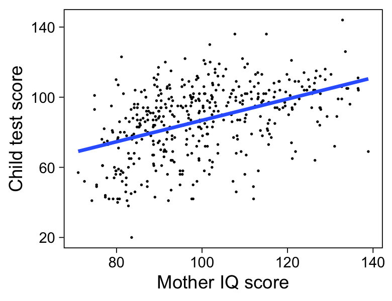

Had we left out the `prob = 0` argument, the plot would have included
the 95% interval ribbon.

### 11.2.2 Displaying two fitted regression lines.

#### 11.2.2.1 Model with no interaction.

Load the multivariable model from last chapter, `m10.3`.

``` r
m10.3 <-
  brm(data = kidiq,
      kid_score ~ mom_hs + mom_iq,
      seed = 10,
      file = "fits/m10.03")
```

When we originally plotted these results for our version of Figure 10.3,
we used a single plot. The `conditional_effects()` approach is oriented
towards making one plot per predictor. Since we have two predictors,
here’s how we might depict them with two plots.

``` r
ce <- conditional_effects(m10.3, prob = 0, robust = T)

# mom_hs
p1 <-
  plot(ce,
       points = T,
       point_args = list(width = 0.05, height = 0.05, size = 1/10),
       plot = FALSE)[[1]] +
  scale_x_continuous("Did the mother graduate high school?", 
                     breaks = 0:1, labels = c("no", "yes")) +
  scale_y_continuous("Child test score", breaks = 0:3 * 40 + 20)

# mom_iq
p2 <-
  plot(ce,
       points = T,
       point_args = list(size = 1/10),
       plot = FALSE)[[2]] +
  scale_x_continuous("Mother IQ score", breaks = 4:7 * 20) +
  scale_y_continuous(NULL, breaks = 0:3 * 40 + 20, labels = NULL)

# combine
library(patchwork)
p1 + p2
```

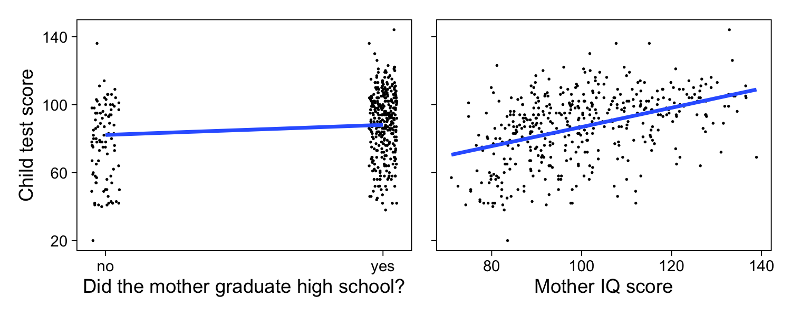

#### 11.2.2.2 Model with interaction.

Reload the interaction model.

``` r
m10.4 <-
  brm(data = kidiq,
      kid_score ~ mom_hs + mom_iq + mom_hs:mom_iq,
      seed = 10,
      file = "fits/m10.04")
```

Here’s a `conditional_effects()` version of the interaction plots of
Figure 10.4.

``` r
ce <-
  conditional_effects(m10.4, 
                      prob = 0, 
                      effects = "mom_iq:mom_hs",
                      int_conditions = list(mom_hs = 0:1),
                      robust = T)

plot(ce,
     points = T,
     point_args = list(size = 1/10),
     plot = FALSE)[[1]] +
  scale_color_manual(values = c("black", "grey60")) +
  scale_x_continuous("Mother IQ score", breaks = 4:7 * 20) +
  scale_y_continuous("Child test score", breaks = 0:3 * 40 + 20) +
  theme(legend.position = "none")
```

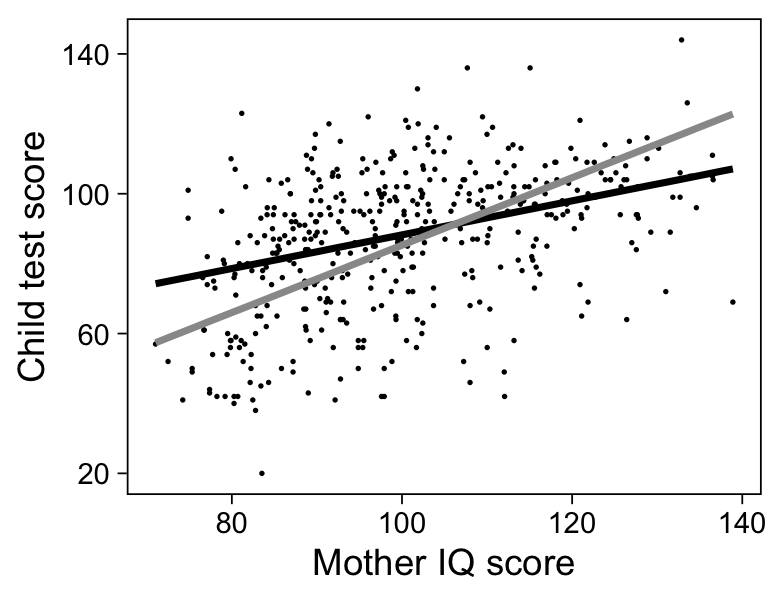

### 11.2.3 Displaying uncertainty in the fitted regression.

We have already loaded the model from this section. It’s `m10.2`. Here’s
the summary.

``` r
print(m10.2, robust = T)
```

    ##  Family: gaussian 
    ##   Links: mu = identity; sigma = identity 
    ## Formula: kid_score ~ mom_iq 
    ##    Data: kidiq (Number of observations: 434) 
    ## Samples: 4 chains, each with iter = 2000; warmup = 1000; thin = 1;
    ##          total post-warmup samples = 4000
    ## 
    ## Population-Level Effects: 
    ##           Estimate Est.Error l-95% CI u-95% CI Rhat Bulk_ESS Tail_ESS
    ## Intercept    25.97      5.64    13.88    37.51 1.00     4349     3062
    ## mom_iq        0.61      0.06     0.49     0.73 1.00     4338     2909
    ## 
    ## Family Specific Parameters: 
    ##       Estimate Est.Error l-95% CI u-95% CI Rhat Bulk_ESS Tail_ESS
    ## sigma    18.28      0.62    17.13    19.55 1.00     4029     3072
    ## 
    ## Samples were drawn using sampling(NUTS). For each parameter, Bulk_ESS
    ## and Tail_ESS are effective sample size measures, and Rhat is the potential
    ## scale reduction factor on split chains (at convergence, Rhat = 1).

We can continue on with `conditional_effects()` and `plot()` to make our
version of Figure 11.1.

``` r
# for `nsamples`
set.seed(11)

ce <-
  conditional_effects(m10.2, 
                      robust = T,
                      spaghetti = T,
                      nsamples = 10)

plot(ce,
     points = T,
     line_args = list(colour = "black", size = 1/2),
     point_args = list(size = 1/10),
     spaghetti_args = list(colour = "grey67"),
     plot = FALSE)[[1]] +
  scale_x_continuous("Mother IQ score", breaks = 4:7 * 20) +
  scale_y_continuous("Child test score", breaks = 0:3 * 40 + 20)
```

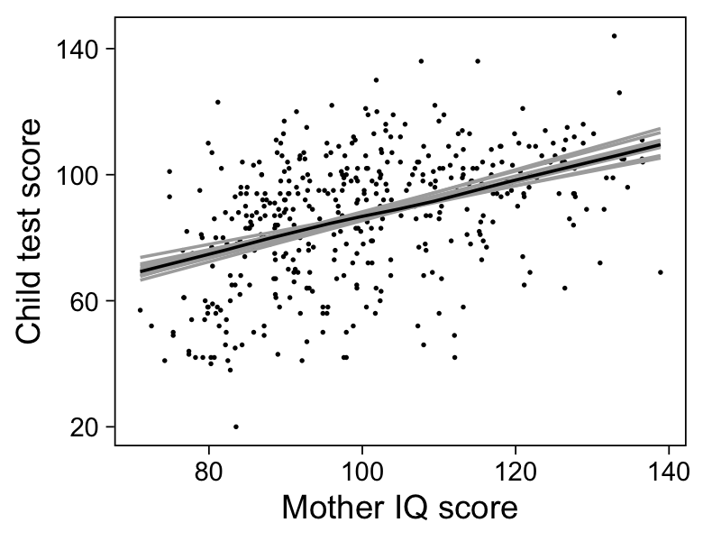

### 11.2.4 Displaying using one plot for each input variable.

Again, we’ve already loaded the model for `kid_score ~ mom_hs + mom_iq`;
it’s `m10.3`.

``` r
print(m10.3, robust = T)
```

    ##  Family: gaussian 
    ##   Links: mu = identity; sigma = identity 
    ## Formula: kid_score ~ mom_hs + mom_iq 
    ##    Data: kidiq (Number of observations: 434) 
    ## Samples: 4 chains, each with iter = 2000; warmup = 1000; thin = 1;
    ##          total post-warmup samples = 4000
    ## 
    ## Population-Level Effects: 
    ##           Estimate Est.Error l-95% CI u-95% CI Rhat Bulk_ESS Tail_ESS
    ## Intercept    25.63      5.79    14.01    36.94 1.00     4074     3319
    ## mom_hs        5.91      2.18     1.59    10.14 1.00     4199     3264
    ## mom_iq        0.57      0.06     0.45     0.69 1.00     3608     3047
    ## 
    ## Family Specific Parameters: 
    ##       Estimate Est.Error l-95% CI u-95% CI Rhat Bulk_ESS Tail_ESS
    ## sigma    18.14      0.63    17.02    19.42 1.00     4761     3378
    ## 
    ## Samples were drawn using sampling(NUTS). For each parameter, Bulk_ESS
    ## and Tail_ESS are effective sample size measures, and Rhat is the potential
    ## scale reduction factor on split chains (at convergence, Rhat = 1).

Now use `conditional_effects()` to make Figure 11.2.

``` r
ce <- 
  conditional_effects(m10.3, 
                      prob = 0, robust = T,
                      spaghetti = T,
                      nsamples = 10)

# mom_iq
p1 <-
  plot(ce,
       points = T,
       line_args = list(colour = "black", size = 1/2),
       point_args = list(size = 1/10),
       spaghetti_args = list(colour = "grey67"),
       plot = FALSE)[[2]] +
  scale_x_continuous("Mother IQ score", breaks = 4:7 * 20) +
  scale_y_continuous("Child test score", breaks = 0:3 * 40 + 20)

# mom_hs
p2 <-
  plot(ce,
       points = T,
       line_args = list(colour = "black", size = 1/2),
       point_args = list(size = 1/10),
       spaghetti_args = list(colour = "grey67"),
       plot = FALSE)[[1]] +
  scale_x_continuous("Did the mother graduate high school?", 
                     breaks = 0:1, labels = c("no", "yes")) +
  scale_y_continuous(NULL, breaks = 0:3 * 40 + 20, labels = NULL)  

# combine
p1 + p2
```

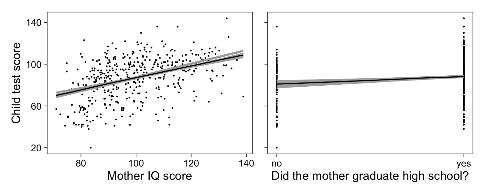

### 11.2.5 Plotting the outcome vs. a continuous predictor.

Simulate the new `fake` data based on the formula

\[
\begin{align*}
y_i & = a + b x_i + \theta z_i + \text{error}_i, \;\;\; \text{where} \\
\text{error}_i & \sim \operatorname N(0, \sigma).
\end{align*}
\]

``` r
# how many would you like?
n <- 100

# set the model parameters
a <- 1
b <- 2
theta <- 5
sigma <- 2

# simulate
set.seed(11)

fake <-
  tibble(x = runif(n, min = 0, max = 1),
         z = sample(0:1, size = n, replace = T)) %>% 
  mutate(y = a + b * x + theta * z + rnorm(n, mean = 0, sd = sigma))

# what have we done?
head(fake)
```

    ## # A tibble: 6 x 3
    ##          x     z     y
    ##      <dbl> <int> <dbl>
    ## 1 0.277        0 0.671
    ## 2 0.000518     1 6.49 
    ## 3 0.511        1 8.21 
    ## 4 0.0140       0 0.788
    ## 5 0.0647       1 1.99 
    ## 6 0.955        0 4.08

Fit the bivariable Gaussian model.

``` r
m11.1 <-
  brm(data = fake,
      y ~ x + z,
      seed = 11,
      file = "fits/m11.01")
```

Check the summary.

``` r
print(m11.1, robust = T)
```

    ##  Family: gaussian 
    ##   Links: mu = identity; sigma = identity 
    ## Formula: y ~ x + z 
    ##    Data: fake (Number of observations: 100) 
    ## Samples: 4 chains, each with iter = 2000; warmup = 1000; thin = 1;
    ##          total post-warmup samples = 4000
    ## 
    ## Population-Level Effects: 
    ##           Estimate Est.Error l-95% CI u-95% CI Rhat Bulk_ESS Tail_ESS
    ## Intercept     1.24      0.42     0.38     2.10 1.00     4358     2680
    ## x             2.05      0.78     0.49     3.59 1.00     4381     3079
    ## z             4.97      0.40     4.22     5.74 1.00     3898     2872
    ## 
    ## Family Specific Parameters: 
    ##       Estimate Est.Error l-95% CI u-95% CI Rhat Bulk_ESS Tail_ESS
    ## sigma     1.99      0.14     1.75     2.30 1.00     4266     3304
    ## 
    ## Samples were drawn using sampling(NUTS). For each parameter, Bulk_ESS
    ## and Tail_ESS are effective sample size measures, and Rhat is the potential
    ## scale reduction factor on split chains (at convergence, Rhat = 1).

The model did a pretty good job recovering the data-generating values.
Here’s how we might make Figure 11.3.

``` r
# define the abline
abline <-
  tibble(z = 0:1) %>% 
  mutate(intercept = fixef(m11.1, robust = T)[1, 1] + fixef(m11.1, robust = T)[3, 1] * z,
         slope     = fixef(m11.1, robust = T)[2, 1]) %>% 
  mutate(z = str_c("z = ", z))

# wrangle
fake %>% 
  mutate(z = str_c("z = ", z)) %>% 
  
  # plot!
  ggplot() +
  geom_point(aes(x = x, y = y, shape = z)) +
  geom_abline(data = abline, 
              aes(intercept = intercept, slope = slope)) +
  scale_shape_manual(values = c(19, 1), breaks = NULL) +
  scale_x_continuous("Pre−treatment predictor, x", breaks = 0:5 / 5) +
  ylab("Outcome, y") +
  facet_wrap(~z)
```

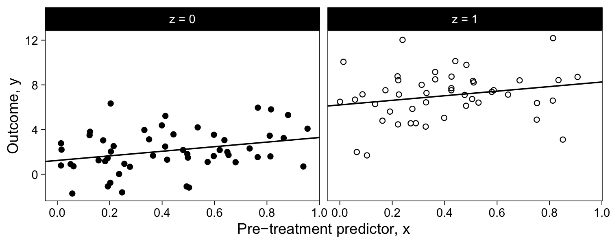

“The key here is to recognize that \(x\) is continuous and \(z\) is
discrete, hence it makes sense to make graphs showing \(y\) vs. \(x\)
for different values of \(z\)” (p. 159).

### 11.2.6 Forming a linear predictor from a multiple regression.

The above plotting strategies won’t work well for a large number of
predictors, such as in the model

\[
\begin{align*}
y_i & = b_0 + b_1 x_{1i} + \cdots + b_K x_{Ki} + \theta z_i + \text{error}_i, && \text{where} \\
\text{error}_i & \sim \operatorname N(0, \sigma), && \text{and} \\
K & = 10.
\end{align*}
\]

If you follow along with Gelman et al’s simulation code, you’ll see that
`X` is a \(100 \times 10\) matrix of predictor values. Compared to
**rstanarm**, **brms** is a little more picky about how you feed in a
matrix of predictors. Basically, it requires they are saved as a matrix
column, which isn’t quite what Gelman et al’s code does. This adjustment
to their workflow solves the issue.

``` r
# how many cases would you like?
n <- 100

# how many grouping variables would you like?
k <- 10

# simulate an n by k array for X
# simulate a dummy for z
set.seed(11)

fake <- 
  tibble(X = array(runif(n * k, min = 0, max = 1), dim = c(n, k)), 
         z = sample(0:1, size = n, replace = T))

# set the data-generating parameter values
a <- 1
b <- 1:k
theta <- 5
sigma <- 2

# simulate the criterion
fake <-
  fake %>% 
  mutate(y = as.vector(a + X %*% b + theta * z + rnorm(n, mean = 0, sd = sigma)))

# check the data structure
fake %>% 
  glimpse()
```

    ## Rows: 100
    ## Columns: 3
    ## $ X <dbl[,10]> <matrix[33 x 10]>
    ## $ z <int> 0, 0, 1, 0, 1, 1, 0, 0, 1, 1, 1, 0, 1, 0, 1, 1, 1, 0, 1, 1, 0, 0, 0, 1, 0, 1, 0, 0, 0, …
    ## $ y <dbl> 23.01206, 23.97829, 38.15228, 8.88529, 31.49908, 33.84654, 34.97909, 21.24742, 45.68255…

Notice that the `X` column contains a matrix of values. Here’s how one
might access them.

``` r
fake$X %>% glimpse()
```

    ##  num [1:100, 1:10] 0.27725 0.000518 0.510608 0.014048 0.06469 ...

Now we’re ready to fit the model.

``` r
m11.2 <-
  brm(data = fake,
      y ~ X + z,
      seed = 11,
      file = "fits/m11.02")
```

Check the results.

``` r
print(m11.2, robust = T)
```

    ##  Family: gaussian 
    ##   Links: mu = identity; sigma = identity 
    ## Formula: y ~ X + z 
    ##    Data: fake (Number of observations: 100) 
    ## Samples: 4 chains, each with iter = 2000; warmup = 1000; thin = 1;
    ##          total post-warmup samples = 4000
    ## 
    ## Population-Level Effects: 
    ##           Estimate Est.Error l-95% CI u-95% CI Rhat Bulk_ESS Tail_ESS
    ## Intercept     0.84      1.33    -1.72     3.43 1.00     7031     2985
    ## X1            2.48      0.85     0.86     4.13 1.00     7434     3360
    ## X2            2.33      0.85     0.68     3.96 1.00     5817     3072
    ## X3            3.93      0.78     2.40     5.43 1.00     6957     3365
    ## X4            3.10      0.78     1.56     4.66 1.00     7050     3089
    ## X5            4.89      0.78     3.41     6.40 1.00     6777     3453
    ## X6            5.38      0.79     3.77     6.93 1.00     6179     3177
    ## X7            7.42      0.74     5.97     8.86 1.00     6815     3316
    ## X8            7.58      0.76     6.00     9.09 1.00     7026     3427
    ## X9            9.35      0.73     7.97    10.74 1.00     7761     3331
    ## X10          10.02      0.76     8.53    11.50 1.00     6863     3095
    ## z             4.25      0.43     3.38     5.16 1.00     7055     3097
    ## 
    ## Family Specific Parameters: 
    ##       Estimate Est.Error l-95% CI u-95% CI Rhat Bulk_ESS Tail_ESS
    ## sigma     2.11      0.16     1.83     2.47 1.00     5484     3045
    ## 
    ## Samples were drawn using sampling(NUTS). For each parameter, Bulk_ESS
    ## and Tail_ESS are effective sample size measures, and Rhat is the potential
    ## scale reduction factor on split chains (at convergence, Rhat = 1).

Gelman et al didn’t show the results from their version of the model,
but if you do refit the model with `rstanarm::stan_glm()`, you’ll see
those results match up nicely with those from **brms**.

As to our version of Figure 11.4, we’ll first want to recall that the
closest **brms** analogue to `rstanarm::predict()` is the `fitted()`
function. Since `brms::fitted()` returns point estimates along with 95%
intervals, we’ll add those to the plot.

``` r
y_hat <- fitted(m11.2)

y_hat %>% 
  data.frame() %>% 
  bind_cols(fake %>% select(-X)) %>% 
  mutate(z = str_c("z = ", z)) %>% 
  
  ggplot(aes(x = Estimate, xmin = Q2.5, xmax = Q97.5, y = y)) +
  geom_abline(color = "grey67") +
  geom_pointrange(aes(shape = z), 
                  size = 1/4, stroke = 1/2, fatten = 6) +
  scale_shape_manual(values = c(19, 1), breaks = NULL) +
  coord_equal() +
  labs(x = expression('Linear predictor, '*hat(y)),
       y = "Outcome, y") +
  facet_wrap(~z)
```

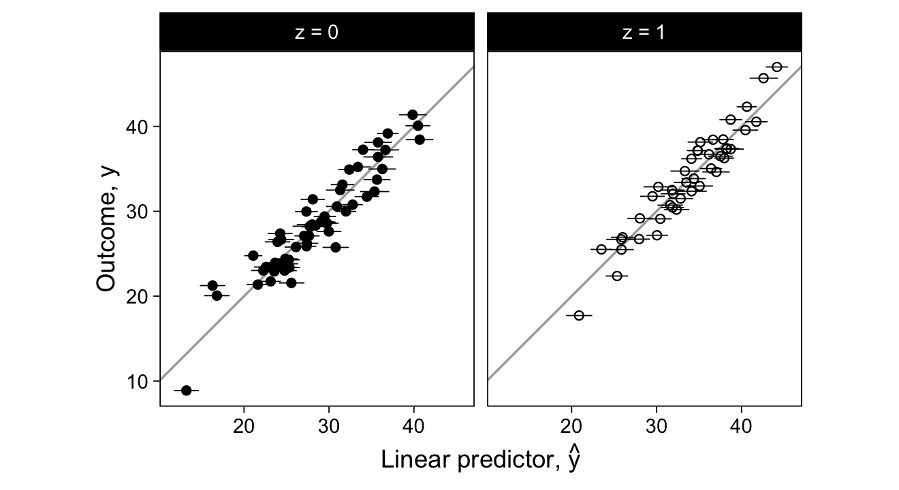

## 11.3 Residual plots

We can evaluate model fit by inspecting the residuals,

\[r_i = y_i = X_i \hat \beta.\]

We can define the residuals from the last model as

\[r_i = y_i - (\hat b_0 + \hat b_1 x_{1i} + \cdots + \hat b_K x_{Ki} + \hat \theta z_i ).\]

When using **brms**, you can pull the residual estimates with the
`residuals()` function.

``` r
res <- residuals(m11.2)

glimpse(res)
```

    ##  num [1:100, 1:4] -1.758 -0.636 2.997 -4.328 -1.331 ...
    ##  - attr(*, "dimnames")=List of 2
    ##   ..$ : NULL
    ##   ..$ : chr [1:4] "Estimate" "Est.Error" "Q2.5" "Q97.5"

Here’s how to make our version of Figure 11.5.

``` r
tibble(y_hat = y_hat[, 1],
       r     = res[, 1]) %>% 
  bind_cols(select(fake, z)) %>% 
  mutate(z = str_c("z = ", z)) %>%
  
  ggplot(aes(x = y_hat, y = r)) +
  geom_hline(yintercept = 0, color = "grey67") +
  geom_point(aes(shape = z)) +
  scale_shape_manual(values = c(19, 1), breaks = NULL) +
  labs(x = expression('Linear predictor, '*hat(y)),
       y = "Residual, r") +
  facet_wrap(~z)
```

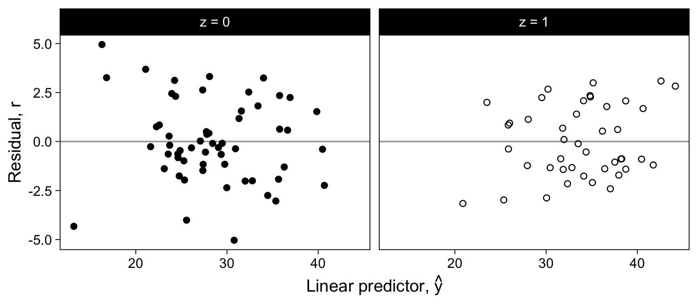

Understand, however, that since the parameters within a Bayesian model
are estimated with uncertainty, as expressed in their marginal posterior
distributions, the residuals from a Bayesian model have uncertainty
expressed in marginal posterior distributions, too. Though not in the
text, here we’ll give the uncertainty in the residuals an explicit
expression by plotting them with `geom_pointrange()`, this time as a
function of the original `y` values.

``` r
res %>% 
  data.frame() %>% 
  bind_cols(fake %>% select(-X)) %>% 
  mutate(z = str_c("z = ", z)) %>% 
  
  ggplot(aes(x = y, y = Estimate, ymin = Q2.5, ymax = Q97.5)) +
  geom_abline(color = "grey67") +
  geom_pointrange(aes(shape = z), 
                  size = 1/4, stroke = 1/2, fatten = 6) +
  scale_shape_manual(values = c(19, 1), breaks = NULL) +
  ylab("Residual, r") +
  facet_wrap(~z)
```

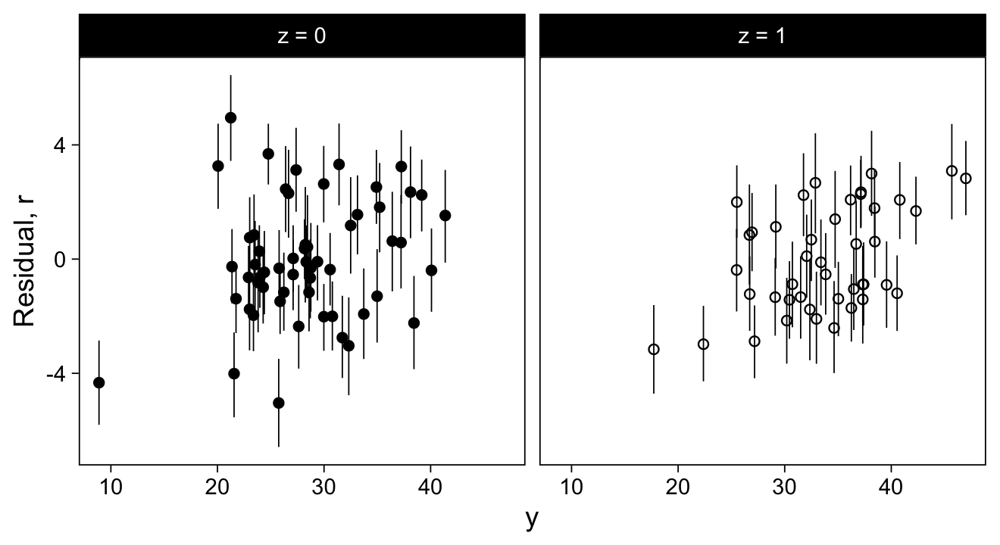

Now we’ll extract the residuals from model `m10.2` to make a version of
Figureb 11.6. Our version will contain the 95% intervals.

``` r
# extract the residuals
res <- residuals(m10.2)

# wrangle
res %>% 
  data.frame() %>% 
  bind_cols(kidiq) %>% 
  
  # plot!
  ggplot(aes(x = mom_iq, y = Estimate, ymin = Q2.5, ymax = Q97.5)) +
  # note our `sd(res[, 1])` trick to mark off the `yintercept` values
  geom_hline(yintercept = c(-sd(res[, 1]), 0, sd(res[, 1])),
             size = 1/4, linetype = c(2, 1, 2), color = "grey50") +
  geom_pointrange(size = 1/8, stroke = 1/4) +
  scale_y_continuous("Residuals", breaks = -3:2 * 20) +
  xlab("Mother IQ score")
```

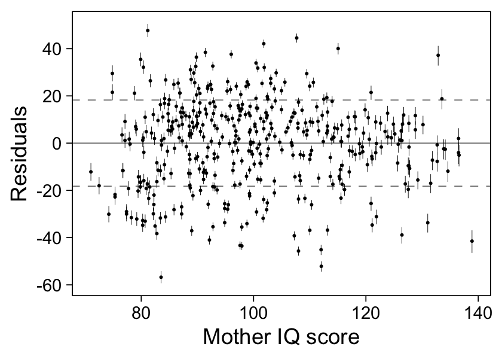

### 11.3.1 Using fake-data simulation to understand residual plots.

“Simulation of fake data can be used to validate statistical algorithms
and to check the properties of estimation procedures” (p. 161).

### 11.3.2 A confusing choice: plot residuals vs. predicted values, or residuals vs. observed values?

Load the `gradesW4315.dat` data.

``` r
introclass <- 
  read_table2("ROS-Examples-master/Introclass/data/gradesW4315.dat") %>% 
  select(hw1:final)

glimpse(introclass)
```

    ## Rows: 52
    ## Columns: 9
    ## $ hw1     <dbl> 95, 0, 100, 0, 100, 90, 95, 80, 95, 90, 100, 100, 95, 100, 100, 100, 100, 100, 10…
    ## $ hw2     <dbl> 88, 74, 0, 90, 96, 83, 98, 100, 90, 94, 100, 95, 71, 93, 95, 100, 97, 95, 100, 90…
    ## $ hw3     <dbl> 100, 74, 105, 76, 99, 95, 100, 97, 98, 95, 99, 87, 95, 97, 92, 100, 92, 100, 91, …
    ## $ hw4     <dbl> 95, 0, 100, 100, 100, 100, 100, 100, 90, 98, 100, 100, 98, 80, 100, 95, 100, 100,…
    ## $ midterm <dbl> 80, 53, 91, 63, 91, 73, 59, 69, 78, 91, 79, 81, 71, 74, 76, 80, 89, 91, 90, 93, 9…
    ## $ hw5     <dbl> 96, 83, 96, 91, 93, 89, 98, 94, 95, 94, 99, 0, 94, 95, 95, 94, 89, 98, 94, 90, 98…
    ## $ hw6     <dbl> 99, 97, 100, 95, 100, 100, 98, 98, 99, 100, 100, 100, 100, 98, 99, 100, 100, 100,…
    ## $ hw7     <dbl> 0, 0, 96, 0, 92, 90, 94, 101, 100, 89, 103, 84, 97, 90, 97, 99, 90, 0, 97, 100, 9…
    ## $ final   <dbl> 103, 79, 122, 78, 135, 117, 135, 123, 109, 126, 124, 126, 130, 117, 133, 118, 127…

Fit the simple model of `midterm` grades predicting grades on the
`final`.

``` r
m11.3 <-
  brm(data = introclass,
      final ~ midterm,
      seed = 11,
      file = "fits/m11.03")
```

Check the results.

``` r
print(m11.3, robust = T)
```

    ##  Family: gaussian 
    ##   Links: mu = identity; sigma = identity 
    ## Formula: final ~ midterm 
    ##    Data: introclass (Number of observations: 52) 
    ## Samples: 4 chains, each with iter = 2000; warmup = 1000; thin = 1;
    ##          total post-warmup samples = 4000
    ## 
    ## Population-Level Effects: 
    ##           Estimate Est.Error l-95% CI u-95% CI Rhat Bulk_ESS Tail_ESS
    ## Intercept    63.55     16.61    29.68    97.84 1.00     4116     2683
    ## midterm       0.71      0.21     0.28     1.14 1.00     4088     2740
    ## 
    ## Family Specific Parameters: 
    ##       Estimate Est.Error l-95% CI u-95% CI Rhat Bulk_ESS Tail_ESS
    ## sigma    14.80      1.50    12.30    18.30 1.00     3763     2882
    ## 
    ## Samples were drawn using sampling(NUTS). For each parameter, Bulk_ESS
    ## and Tail_ESS are effective sample size measures, and Rhat is the potential
    ## scale reduction factor on split chains (at convergence, Rhat = 1).

Here we’ll extract the point predictions and the residuals.

``` r
y_hat <- fitted(m11.3)
res <- residuals(m11.3)
```

Here’s how to make our version of Figure 11.7.

``` r
# left
p1 <-
  tibble(y_hat = y_hat[, 1],
         r     = res[, 1]) %>% 
  
  ggplot(aes(x = y_hat, y = r)) +
  geom_hline(yintercept = 0, color = "grey67") +
  geom_point() +
  labs(subtitle = "Residuals vs. predicted values",
       x = "predicted value",
       y = "residual")

# right
p2 <-
  tibble(y = pull(introclass, final),
         r = res[, 1]) %>% 
  
  ggplot(aes(x = y, y = r)) +
  geom_hline(yintercept = 0, color = "grey67") +
  geom_point() +
  scale_y_continuous(NULL, labels = NULL) +
  labs(subtitle = "Residuals vs. observed values",
       x = "observed value")

# combine
p1 + p2
```

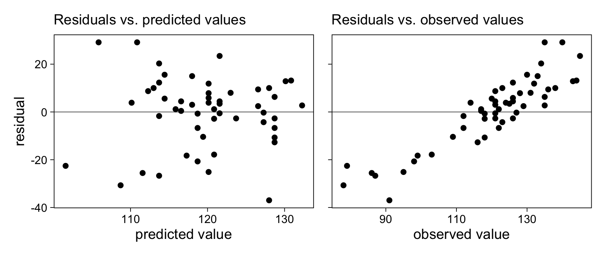

> Figure 11.7a looks reasonable: the residuals are centered around zero
> for all fitted values. But Figure 11.7b looks troubling.
> 
> It turns out that the first plot is what we should be looking at, and
> the second plot is misleading. This can be understood using
> probability theory (from the regression model, the errors
> \(\epsilon_i\) should be independent of the predictors \(x_i\), not
> the data \(y_i\). (p. 162)

### 11.3.3 Understanding the choice using fake-data simulation.

“For this example, we set the coefficients and residual standard
deviation to reasonable values given the model estimates, and then we
simulate fake final exam data using the real midterm as a predictor”
(p. 162).

``` r
# define the data-generating parameters,
# which are similar to the posterior means from `m11.3`
a <- 64.5
b <- 0.7
sigma <- 14.8

# simulate
set.seed(11)
introclass <-
  introclass %>% 
  mutate(final_fake = a + b * midterm + rnorm(n(), mean = 0, sd = sigma))

head(introclass)
```

    ## # A tibble: 6 x 10
    ##     hw1   hw2   hw3   hw4 midterm   hw5   hw6   hw7 final final_fake
    ##   <dbl> <dbl> <dbl> <dbl>   <dbl> <dbl> <dbl> <dbl> <dbl>      <dbl>
    ## 1    95    88   100    95      80    96    99     0   103      112. 
    ## 2     0    74    74     0      53    83    97     0    79      102. 
    ## 3   100     0   105   100      91    96   100    96   122      106. 
    ## 4     0    90    76   100      63    91    95     0    78       88.4
    ## 5   100    96    99   100      91    93   100    92   135      146. 
    ## 6    90    83    95   100      73    89   100    90   117      102.

Fit the new model, with `final_fake` as the criterion.

``` r
m11.4 <-
  brm(data = introclass,
      final_fake ~ midterm,
      seed = 11,
      file = "fits/m11.04")
```

Check the results.

``` r
print(m11.4, robust = T)
```

    ##  Family: gaussian 
    ##   Links: mu = identity; sigma = identity 
    ## Formula: final_fake ~ midterm 
    ##    Data: introclass (Number of observations: 52) 
    ## Samples: 4 chains, each with iter = 2000; warmup = 1000; thin = 1;
    ##          total post-warmup samples = 4000
    ## 
    ## Population-Level Effects: 
    ##           Estimate Est.Error l-95% CI u-95% CI Rhat Bulk_ESS Tail_ESS
    ## Intercept    61.24     14.24    32.60    90.03 1.00     3604     3035
    ## midterm       0.69      0.18     0.33     1.06 1.00     3584     2823
    ## 
    ## Family Specific Parameters: 
    ##       Estimate Est.Error l-95% CI u-95% CI Rhat Bulk_ESS Tail_ESS
    ## sigma    12.61      1.27    10.57    15.54 1.00     3056     2300
    ## 
    ## Samples were drawn using sampling(NUTS). For each parameter, Bulk_ESS
    ## and Tail_ESS are effective sample size measures, and Rhat is the potential
    ## scale reduction factor on split chains (at convergence, Rhat = 1).

Now we’ll make Figure 11.8.

``` r
# extract the new point predictions and the residuals
y_hat <- fitted(m11.4)
res <- residuals(m11.4)

# left
p1 <-
  tibble(y_hat = y_hat[, 1],
         r     = res[, 1]) %>% 
  
  ggplot(aes(x = y_hat, y = r)) +
  geom_hline(yintercept = 0, color = "grey67") +
  geom_point() +
  labs(subtitle = "Fake data: resids vs. predicted",
       x = "predicted value",
       y = "residual")

# right
p2 <-
  tibble(y = pull(introclass, final_fake),
         r = res[, 1]) %>% 
  
  ggplot(aes(x = y, y = r)) +
  geom_hline(yintercept = 0, color = "grey67") +
  geom_point() +
  scale_y_continuous(NULL, labels = NULL) +
  labs(subtitle = "Fake data: resids vs. observed",
       x = "observed value")

# combine
p1 + p2
```

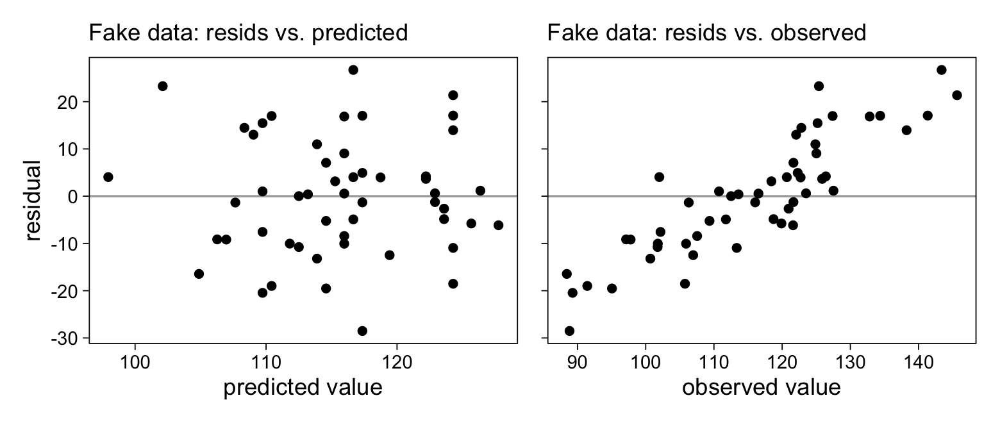

> Figure 11.8 shows the plots of `resid_fake` versus `predicted_fake`
> and `final_fake`. These are the sorts of residual plots we would see
> if the *model* were *correct.* This simulation shows why we prefer to
> plot residuals versus predicted rather than observed values. (p. 163,
> *emphasis* in the original)

## 11.4 Comparing data to replications from a fitted model

“Here we introduce *posterior predictive checking*: simulating
replicated datasets under the fitted model and then comparing these to
the observed data” (p. 163, *emphasis* in the original).

### 11.4.1 Example: simulation-based checking of a fitted normal distribution.

Load the `newcomb.txt` data.

``` r
newcomb <- read_csv("ROS-Examples-master/Newcomb/data/newcomb.txt")

glimpse(newcomb)
```

    ## Rows: 66
    ## Columns: 1
    ## $ y <dbl> 28, 26, 33, 24, 34, -44, 27, 16, 40, -2, 29, 22, 24, 21, 25, 30, 23, 29, 31, 19, 24, 20…

Let’s recreate the histogram in Figure 11.9.

``` r
newcomb %>% 
  ggplot(aes(x = y)) +
  geom_histogram(boundary = 0, binwidth = 2) +
  scale_x_continuous(NULL, breaks = -2:2 * 20) +
  scale_y_continuous(NULL, breaks = NULL, expand = expansion(mult = c(0, 0.05)))
```

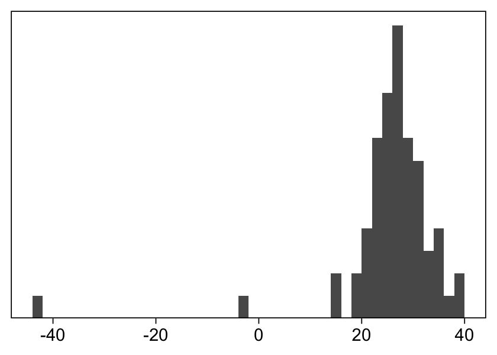

Fit an intercept-only regression model to the data.

``` r
m11.5 <-
  brm(data = newcomb,
      y ~ 1,
      seed = 11,
      file = "fits/m11.05")
```

Check the summary.

``` r
print(m11.5, robust = T)
```

    ##  Family: gaussian 
    ##   Links: mu = identity; sigma = identity 
    ## Formula: y ~ 1 
    ##    Data: newcomb (Number of observations: 66) 
    ## Samples: 4 chains, each with iter = 2000; warmup = 1000; thin = 1;
    ##          total post-warmup samples = 4000
    ## 
    ## Population-Level Effects: 
    ##           Estimate Est.Error l-95% CI u-95% CI Rhat Bulk_ESS Tail_ESS
    ## Intercept    26.30      1.19    23.85    28.74 1.00     3586     2778
    ## 
    ## Family Specific Parameters: 
    ##       Estimate Est.Error l-95% CI u-95% CI Rhat Bulk_ESS Tail_ESS
    ## sigma    10.66      0.92     9.07    12.74 1.00     3452     2894
    ## 
    ## Samples were drawn using sampling(NUTS). For each parameter, Bulk_ESS
    ## and Tail_ESS are effective sample size measures, and Rhat is the potential
    ## scale reduction factor on split chains (at convergence, Rhat = 1).

Instead of a `for` loop, here we’ll use a `purrr::map2()` work flow to
make our Figure 11.10.

``` r
# how many simulations would you like?
n <- 20
set.seed(11)

posterior_samples(m11.5) %>% 
  slice_sample(n = n) %>% 
  mutate(iter = factor(str_c("iteration #", 1:n),
                       levels = str_c("iteration #", 1:n)),
         y = map2(b_Intercept, sigma, ~rnorm(n = 66, mean = b_Intercept, sd = sigma))) %>% 
  unnest(y) %>% 
  
  ggplot(aes(x = y)) +
  geom_histogram(boundary = 0, binwidth = 2) +
  scale_x_continuous(NULL, breaks = -2:3 * 20) +
  scale_y_continuous(NULL, breaks = NULL, expand = expansion(mult = c(0, 0.05))) +
  facet_wrap(~iter)
```

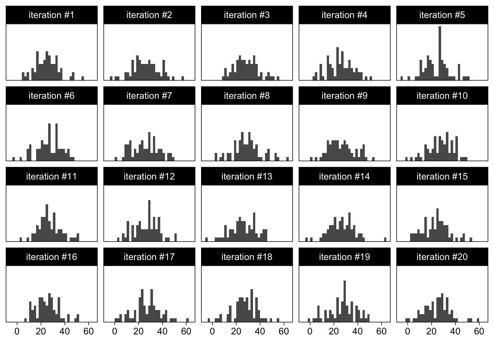

Here’s a `posterior_predict()` version of the same kind of check.

``` r
# how many simulations would you like?
# anticipating Figure 11.12, we'll choose 1,000
n <- 1000

nd <- tibble(iter = 1:n)

set.seed(11)

y_rep <-
  posterior_predict(m11.5,
                    newdata = nd,
                    nsamples = 66) %>% 
  data.frame() %>% 
  set_names(1:n) %>% 
  pivot_longer(everything(), values_to = "y") %>% 
  mutate(iter = factor(str_c("iteration #", name),
                       levels = str_c("iteration #", 1:n)))

y_rep %>% 
  filter(as.double(name) < 21) %>% 
  
  ggplot(aes(x = y)) +
  geom_histogram(boundary = 0, binwidth = 2) +
  scale_x_continuous(NULL, breaks = -2:3 * 20) +
  scale_y_continuous(NULL, breaks = NULL, expand = expansion(mult = c(0, 0.05))) +
  facet_wrap(~iter)
```

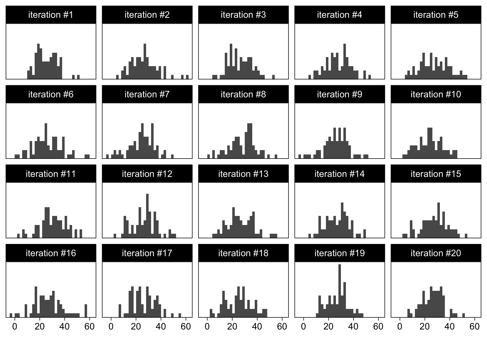

#### 11.4.1.1 Visual comparison of actual and replicated datasets.

Oops, we jumped the gun and already made Figure 11.10. To fill this
section up, we can do something very similar with the handy
`brms::pp_check()` function. Here we’ll plot 19 histograms of synthetic
data nest to a histogram of the original data.

``` r
set.seed(11)

pp_check(m11.5, type = "hist", nsamples = 19, binwidth = 2)
```

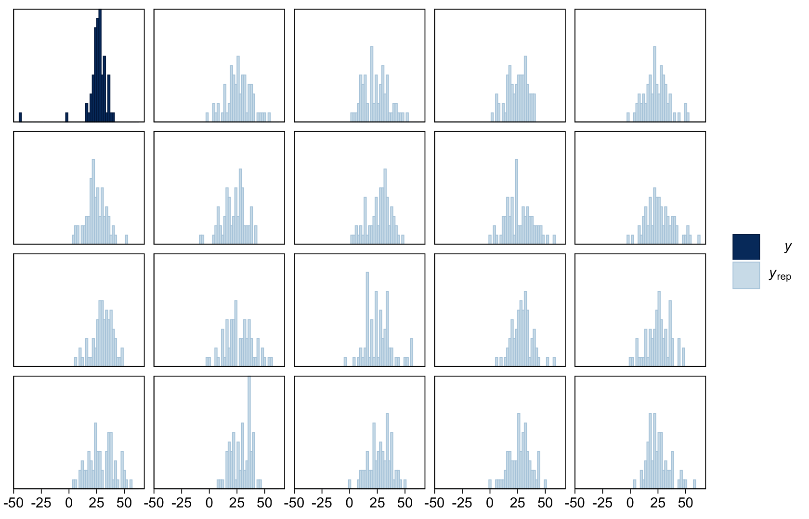

Since we’re on the topic of `pp_check()`, here’s how to use it to make a
very close replica of Figure 11.11.

``` r
set.seed(11)

pp_check(m11.5, nsamples = 100)
```

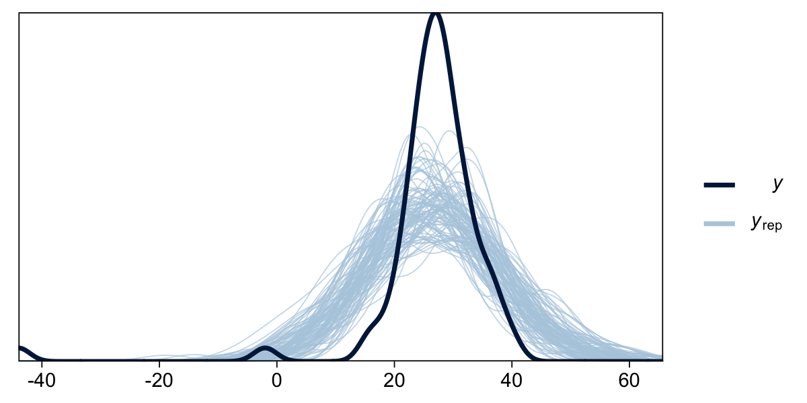

#### 11.4.1.2 Checking model fit using a numerical data summary.

“Data displays can suggest more focused test statistics with which to
check model fit” (p. 165). We’ll use the authors’ `test()` function to
compute the minimum value for each of the synthetic data sets in
`y_rep`. First, make the `test()` function.

``` r
test <- function(y) { 
  min(y)
}
```

Now use `test()` to make Figure 11.12.

``` r
y_rep %>% 
  group_by(iter) %>% 
  summarise(min = test(y)) %>% 
  
  ggplot(aes(x = min)) +
  geom_histogram(boundary = 0, binwidth = 2) +
  geom_vline(xintercept = min(newcomb$y), color = "red4", size = 2) +
  scale_x_continuous(NULL, breaks = -4:1 * 10) +
  scale_y_continuous(NULL, breaks = NULL, expand = expansion(mult = c(0, 0.05)))
```

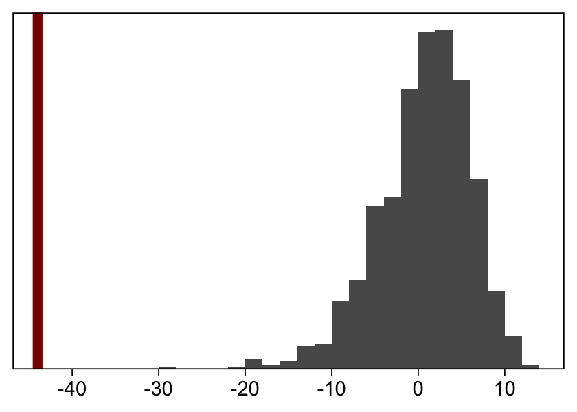

The minimum value from the original `newcomb` data is marked by the red
vertical line. We can make a very similar plot with a workflow based
around the **bayesplot** package.

``` r
library(bayesplot)
```

First, we’ll need to redo our `y_rep`.

``` r
y_rep <-
  posterior_predict(m11.5,
                    newdata = nd,
                    nsamples = 66)

glimpse(y_rep)
```

    ##  num [1:66, 1:1000] 17 20.4 19.8 18.8 24.5 ...
    ##  - attr(*, "dimnames")=List of 2
    ##   ..$ : NULL
    ##   ..$ : NULL

We did that because the `bayesplot::ppc_stat()` function expects an
\(S \times N\) matrix of simulation values where \(S\) is the number of
simulations and \(N\) is the original sample size. Since our `y_rep` is
an \(N \times S\) matrix, we’ll just have to transpose it with `t()`.
For kicks and giggles, we’ll use **patchwork** syntax to tack on an
additional posterior predictive test for the median.

``` r
ppc_stat(y = newcomb$y, yrep = t(y_rep), stat = "min", binwidth = 2) + 
  ppc_stat(y = newcomb$y, yrep = t(y_rep), stat = "median", binwidth = 0.5) +
  plot_annotation(subtitle = "We can check model fit using numerical data summaries, such as with the min() and median() functions.")
```

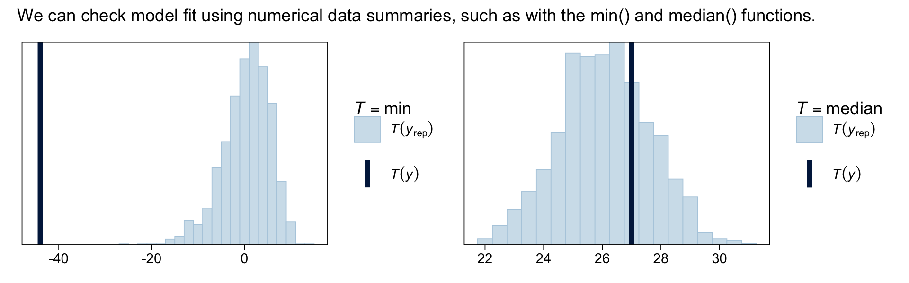

## 11.5 Example: predictive simulation to check the fit of a time-series model

“Predictive simulation is more complicated in time-series models, which
are typically set up so that the distribution for each point depends on
the earlier data” (p. 166).

### 11.5.1 Fitting a first-order autoregression to the unemployment series.

Load the `unemp.txt` data.

``` r
unemp <- read_table2("ROS-Examples-master/Unemployment/data/unemp.txt")

glimpse(unemp)
```

    ## Rows: 70
    ## Columns: 2
    ## $ year <dbl> 1947, 1948, 1949, 1950, 1951, 1952, 1953, 1954, 1955, 1956, 1957, 1958, 1959, 1960, …
    ## $ y    <dbl> 3.9, 3.8, 5.9, 5.3, 3.3, 3.0, 2.9, 5.5, 4.4, 4.1, 4.3, 6.8, 5.5, 5.5, 6.7, 5.5, 5.7,…

Plot the time-series data as in Figure 11.13.

``` r
unemp %>% 
  ggplot(aes(x = year, y = y)) +
  geom_line() +
  scale_x_continuous("Year", breaks = 0:3 * 20 + 1950) +
  scale_y_continuous("Unemployment rate", 
                     breaks = 0:2 * 5, labels = scales::percent_format(scale = 1, accuracy = 1),
                     limits = c(0, 10), expand = expansion(mult = c(0, 0.05)))
```

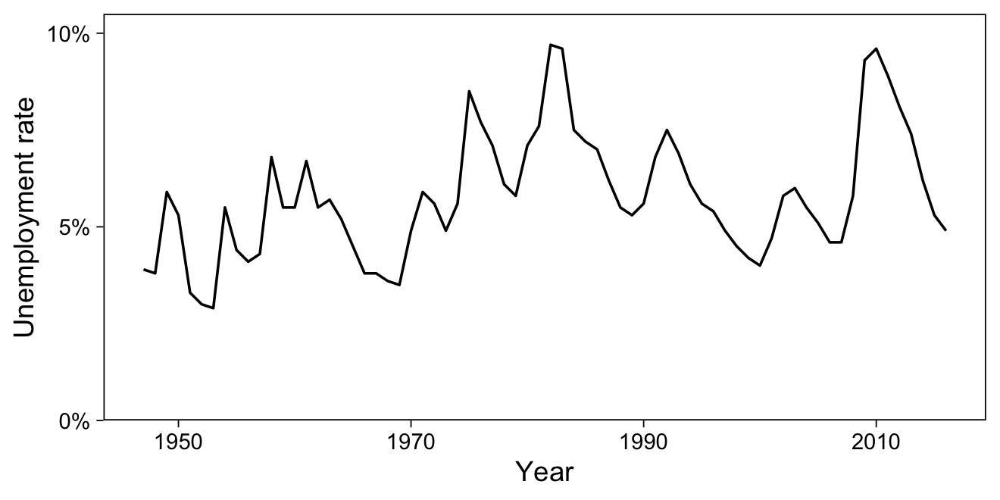

We can make a lagged version of the `y` criterion with aid from the
`lag()` function.

``` r
unemp <-
  unemp %>% 
  mutate(my_lag = lag(y))

head(unemp)
```

    ## # A tibble: 6 x 3
    ##    year     y my_lag
    ##   <dbl> <dbl>  <dbl>
    ## 1  1947   3.9   NA  
    ## 2  1948   3.8    3.9
    ## 3  1949   5.9    3.8
    ## 4  1950   5.3    5.9
    ## 5  1951   3.3    5.3
    ## 6  1952   3      3.3

Now fit a first-order autoregressive model.

``` r
m11.6 <-
  brm(data = unemp,
      y ~ y_lag,
      seed = 11,
      file = "fits/m11.06")
```

Check the parameter summary.

``` r
print(m11.6, robust = T)
```

    ##  Family: gaussian 
    ##   Links: mu = identity; sigma = identity 
    ## Formula: y ~ y_lag 
    ##    Data: unemp (Number of observations: 69) 
    ## Samples: 4 chains, each with iter = 2000; warmup = 1000; thin = 1;
    ##          total post-warmup samples = 4000
    ## 
    ## Population-Level Effects: 
    ##           Estimate Est.Error l-95% CI u-95% CI Rhat Bulk_ESS Tail_ESS
    ## Intercept     1.35      0.46     0.40     2.26 1.00     3559     3018
    ## y_lag         0.77      0.08     0.62     0.93 1.00     3642     2832
    ## 
    ## Family Specific Parameters: 
    ##       Estimate Est.Error l-95% CI u-95% CI Rhat Bulk_ESS Tail_ESS
    ## sigma     1.04      0.09     0.89     1.24 1.00     3694     3049
    ## 
    ## Samples were drawn using sampling(NUTS). For each parameter, Bulk_ESS
    ## and Tail_ESS are effective sample size measures, and Rhat is the potential
    ## scale reduction factor on split chains (at convergence, Rhat = 1).

### 11.5.2 Simulating replicated datasets.

I’m not nimble enough with the kind of work flow in this section to
translate the simulation code into **tidyverse** style. So we’ll follow
along with the text for the first couple of blocks. First, we set a
couple constants and pull the posterior draws.

``` r
n <- nrow(unemp)
sims <- as.matrix(m11.6) 
n_sims <- nrow(sims)

str(sims)
```

    ##  num [1:4000, 1:4] 0.939 1.052 2.318 2.03 1.951 ...
    ##  - attr(*, "dimnames")=List of 2
    ##   ..$ iterations: NULL
    ##   ..$ parameters: chr [1:4] "b_Intercept" "b_y_lag" "sigma" "lp__"

``` r
n_sims
```

    ## [1] 4000

Now simulate.

``` r
set.seed(11)

y_rep <- array(NA, c(n_sims, n)) 
for (s in 1:n_sims) {
  y_rep[s, 1] <- unemp$y[1] 
  for (t in 2:n) {
    y_rep[s, t] <- sims[s, "b_Intercept"] + 
      sims[s, "b_y_lag"] * y_rep[s, t - 1] + 
      rnorm(1, 0, sims[s, "sigma"])
  } 
}
```

What have we done?

``` r
str(y_rep)
```

    ##  num [1:4000, 1:70] 3.9 3.9 3.9 3.9 3.9 3.9 3.9 3.9 3.9 3.9 ...

Now make Figure 11.14.

``` r
set.seed(11)

y_rep %>% 
  data.frame() %>% 
  set_names(pull(unemp, year)) %>% 
  mutate(iter = factor(str_c("Simulation ", 1:n()),
                       labels = str_c("Simulation ", 1:n()))) %>% 
  slice_sample(n = 15) %>% 
  pivot_longer(-iter, values_to = "y") %>% 
  mutate(year = name %>% as.double()) %>% 
  
  ggplot(aes(x = year, y = y)) +
  geom_line() +
  scale_x_continuous("Year", breaks = 0:3 * 20 + 1950) +
  scale_y_continuous("Unemployment rate", 
                     breaks = 0:2 * 5, labels = scales::percent_format(scale = 1, accuracy = 1)) +
  coord_cartesian(ylim = c(0, max(unemp$y) * 1.05)) +
  facet_wrap(~iter, nrow = 3)
```

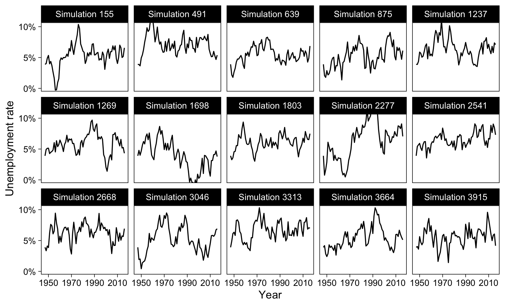

“We could not simply create these simulations using `posterior_predict`
because with this time-series model we need to simulate each year
conditional on the last” (p. 167).

### 11.5.3 Visual and numerical comparisons of replicated to actual data.

Make the new `test()` function to assess the jaggedness of the time
serries in terms of the frequency of switches.

``` r
test <- function(y) {
  
  n <- length(y)
  y_lag <- c(NA, y[1:(n - 1)])
  y_lag_2 <- c(NA, NA, y[1:(n - 2)])
  sum(sign(y - y_lag) != sign(y_lag - y_lag_2), na.rm = TRUE) 
  
}
```

Now we might use our new `test()` function within the context of a
`bayesplot::ppc_stat()` plot.

``` r
ppc_stat(y = unemp$y, yrep = y_rep, stat = "test", binwidth = 1)
```

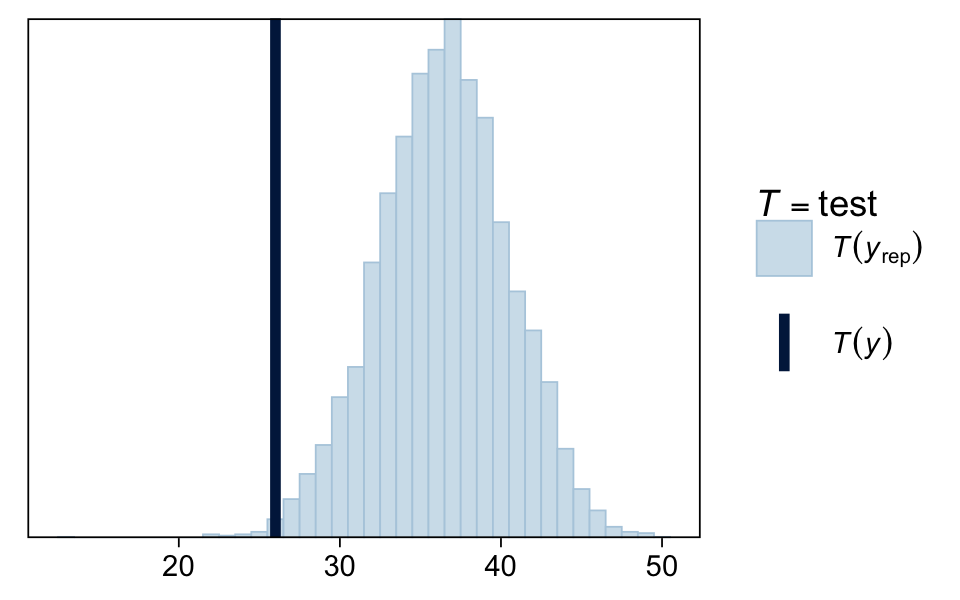

In the text, Gelmen et al wrote 99% of the simulated data sets had
`test()` values higher than the one for the original data. Our plot
seems to cohere with that. Here we’ll get the precise percentage.

``` r
y_rep %>% 
  data.frame() %>% 
  mutate(iter = 1:n()) %>% 
  pivot_longer(-iter) %>% 
  group_by(iter) %>% 
  summarise(greater_than_y = test(value) > test(unemp$y)) %>% 
  summarize(percent_greater_than_y = 100 * mean(greater_than_y))
```

    ## # A tibble: 1 x 1
    ##   percent_greater_than_y
    ##                    <dbl>
    ## 1                   99.3

What are the median and 80% ranges for the simulated data sets?

``` r
library(tidybayes)

y_rep %>% 
  data.frame() %>% 
  mutate(iter = 1:n()) %>% 
  pivot_longer(-iter) %>% 
  group_by(iter) %>% 
  summarise(test = test(value)) %>% 
  median_qi(test, .width = .8)
```

    ## # A tibble: 1 x 6
    ##    test .lower .upper .width .point .interval
    ##   <dbl>  <dbl>  <dbl>  <dbl> <chr>  <chr>    
    ## 1    36     31     42    0.8 median qi

The median value was 36, with an 80% range of 31 to 42, “implying that
this aspect of the data was not captured well by the model” (p. 168).

## 11.6 Residual standard deviation \(\sigma\) and explained variance \(R^2\)

> The residual standard deviation, \(\sigma\), summarizes the scale of
> the residuals \(r_i = y_i − X_i \hat \beta\). For example, in the
> children’s test scores example, \(\hat \sigma = 18\), which tells us
> that the linear model can predict scores to about an accuracy of 18
> points. Said another way, we can think of this standard deviation as a
> measure of the average distance each observation falls from its
> prediction from the model. (p. 168)

We might walk this out a bit. The “children’s test scores example” in
the block quote referrs to `m10.3`. Here’s the summary, again.

``` r
print(m10.3, robust = T)
```

    ##  Family: gaussian 
    ##   Links: mu = identity; sigma = identity 
    ## Formula: kid_score ~ mom_hs + mom_iq 
    ##    Data: kidiq (Number of observations: 434) 
    ## Samples: 4 chains, each with iter = 2000; warmup = 1000; thin = 1;
    ##          total post-warmup samples = 4000
    ## 
    ## Population-Level Effects: 
    ##           Estimate Est.Error l-95% CI u-95% CI Rhat Bulk_ESS Tail_ESS
    ## Intercept    25.63      5.79    14.01    36.94 1.00     4074     3319
    ## mom_hs        5.91      2.18     1.59    10.14 1.00     4199     3264
    ## mom_iq        0.57      0.06     0.45     0.69 1.00     3608     3047
    ## 
    ## Family Specific Parameters: 
    ##       Estimate Est.Error l-95% CI u-95% CI Rhat Bulk_ESS Tail_ESS
    ## sigma    18.14      0.63    17.02    19.42 1.00     4761     3378
    ## 
    ## Samples were drawn using sampling(NUTS). For each parameter, Bulk_ESS
    ## and Tail_ESS are effective sample size measures, and Rhat is the potential
    ## scale reduction factor on split chains (at convergence, Rhat = 1).

Indeed, \(\hat \sigma \approx 18\). We can get another sense of what
this mean with `predict()`.

``` r
predict(m10.3) %>% 
  head()
```

    ##       Estimate Est.Error     Q2.5    Q97.5
    ## [1,] 100.28944  18.17107 65.08507 136.8227
    ## [2,]  82.19416  18.48728 46.45998 118.6220
    ## [3,]  96.98917  18.48298 60.72755 133.6323
    ## [4,]  88.00869  18.25237 52.06165 124.2768
    ## [5,]  83.78815  17.83354 48.33160 119.0782
    ## [6,]  86.78544  18.66597 50.56644 123.8620

`brms::predict()` returns a posterior prediction for a new case of the
same predictor values as the cases in the original data. Notice how the
values in the `Est.Error` column are all just about 18, which is what
the authors meant by “the linear model can predict scores to about an
accuracy of 18 points.”

The classic formula for \(R^2\) is

\[R^2 = 1 - (\hat \sigma^2 / s_y^2),\]

where \(s_y^2\) is the variance in the sample data. Though our Bayesian
`m10.3` isn’t a classical model, we might practice and sub in the
posterior median for \(\hat \sigma^2\) to compute the \(R^2\) by hand.

``` r
hat_sigma2 <-
  posterior_samples(m10.3) %>% 
  summarise(hat_sigma2 = median(sigma^2)) %>% 
  pull()

y_s2 <- var(kidiq$kid_score)

1 - (hat_sigma2 / y_s2)
```

    ## [1] 0.2098531

To convert that proportion to a percent, you just multiply by 100, which
returns about 21%.

### 11.6.1 Difficulties in interpreting residual standard deviation and explained variance.

At the moment, it’s not clear whether the authors provide the code
necessary to make Figure 11.15 and Figure 11.16. *Sigh*

### 11.6.2 Bayesian \(R^2\).

Make the simulated `xy` data based on the code in the `rdquared.Rmd`
file.

``` r
xy <- 
  tibble(x = 1:5 - 3,
         y = c(1.7, 2.6, 2.5, 4.4, 3.8) - 3)

xy
```

    ## # A tibble: 5 x 2
    ##       x      y
    ##   <dbl>  <dbl>
    ## 1    -2 -1.3  
    ## 2    -1 -0.400
    ## 3     0 -0.5  
    ## 4     1  1.4  
    ## 5     2  0.800

First fit the model with OLS.

``` r
m11.7_ols <- lm(data = xy, y ~ x)
```

Check the summary.

``` r
summary(m11.7_ols)
```

    ## 
    ## Call:
    ## lm(formula = y ~ x, data = xy)
    ## 
    ## Residuals:
    ##    1    2    3    4    5 
    ## -0.1  0.2 -0.5  0.8 -0.4 
    ## 
    ## Coefficients:
    ##             Estimate Std. Error t value Pr(>|t|)  
    ## (Intercept)   0.0000     0.2708   0.000   1.0000  
    ## x             0.6000     0.1915   3.133   0.0519 .
    ## ---
    ## Signif. codes:  0 '***' 0.001 '**' 0.01 '*' 0.05 '.' 0.1 ' ' 1
    ## 
    ## Residual standard error: 0.6055 on 3 degrees of freedom
    ## Multiple R-squared:  0.766,  Adjusted R-squared:  0.6879 
    ## F-statistic: 9.818 on 1 and 3 DF,  p-value: 0.05193

IF you look to the bottom of the output, the classical \(R^2 = .766\).
Now consider a Bayesian version of the model with strong priors,

\[
\begin{align*}
y_i & \sim \operatorname N(\mu_i, \sigma) \\
\mu_i & = \beta_0 + \beta_1 x_i \\
\beta_0 & \sim \operatorname N(0, 0.2) \\
\beta_1 & \sim \operatorname N(1, 0.2),
\end{align*}
\]

where the prior for \(\sigma\) is just the software default. Here that
is for **brms**.

``` r
get_prior(data = xy,
          family = gaussian,
          y ~ x)
```

    ##                    prior     class coef group resp dpar nlpar bound       source
    ##                   (flat)         b                                       default
    ##                   (flat)         b    x                             (vectorized)
    ##  student_t(3, -0.4, 2.5) Intercept                                       default
    ##     student_t(3, 0, 2.5)     sigma                                       default

Fit the model.

``` r
m11.7 <-
  brm(data = xy,
      y ~ x,
      prior = c(prior(normal(0, 0.2), class = Intercept),
                prior(normal(1, 0.2), class = b)),
      seed = 11,
      file = "fits/m11.07")
```

Check the parameter summary.

``` r
print(m11.7, robust = T)
```

    ##  Family: gaussian 
    ##   Links: mu = identity; sigma = identity 
    ## Formula: y ~ x 
    ##    Data: xy (Number of observations: 5) 
    ## Samples: 4 chains, each with iter = 2000; warmup = 1000; thin = 1;
    ##          total post-warmup samples = 4000
    ## 
    ## Population-Level Effects: 
    ##           Estimate Est.Error l-95% CI u-95% CI Rhat Bulk_ESS Tail_ESS
    ## Intercept    -0.01      0.16    -0.33     0.32 1.00     2913     2670
    ## x             0.82      0.16     0.54     1.19 1.00     2913     2542
    ## 
    ## Family Specific Parameters: 
    ##       Estimate Est.Error l-95% CI u-95% CI Rhat Bulk_ESS Tail_ESS
    ## sigma     0.74      0.28     0.37     1.89 1.00     2395     2171
    ## 
    ## Samples were drawn using sampling(NUTS). For each parameter, Bulk_ESS
    ## and Tail_ESS are effective sample size measures, and Rhat is the potential
    ## scale reduction factor on split chains (at convergence, Rhat = 1).

Now we’ll visualize the OLS and Bayesian fits with Figure 11.16.

``` r
# left
p1 <-
  xy %>% 
  ggplot(aes(x = x, y = y)) +
  geom_point() +
  # ols
  geom_abline(intercept = coef(m11.7_ols)[1],
              slope = coef(m11.7_ols)[2],
              color = "blue3", size = 1/4) +
  # bayes prior
  geom_abline(intercept = 0, slope = 1,
              linetype = 2, color = "red3", size = 1/4) +
  # bayes posterior
  geom_abline(intercept = fixef(m11.7, robust = T)[1, 1],
              slope = fixef(m11.7, robust = T)[2, 1],
              color = "purple3", size = 1/4) +
  annotate(geom = "text",
           x = c(-1.75, -1.5, 1.5),
           y = c(-0.75, -2, 1.25),
           label = c("OLS", "Prior", "Posterior"),
           color = c("blue3", "red3", "purple3")) +
  labs(subtitle = "Least squares and Bayes fits") +
  ylim(-2, 2)

# right
set.seed(11)

p2 <-
  posterior_samples(m11.7) %>% 
  mutate(iter = 1:n()) %>% 
  slice_sample(n = 20) %>% 
  
  ggplot() + 
  # 20 random posterior draws
  geom_abline(aes(intercept = b_Intercept,
                  slope = b_x, 
                  group = iter),
              size = 1/4, alpha = 1/2) +
  # posterior mean
  geom_abline(intercept = fixef(m11.7)[1, 1],
              slope = fixef(m11.7)[2, 1],
              size = 1) +
  geom_point(data = xy,
             aes(x = x, y = y)) +
  labs(subtitle = "Bayes posterior simulations") +
  scale_y_continuous(NULL, labels = NULL, limits = c(-2, 2))

p1 + p2
```

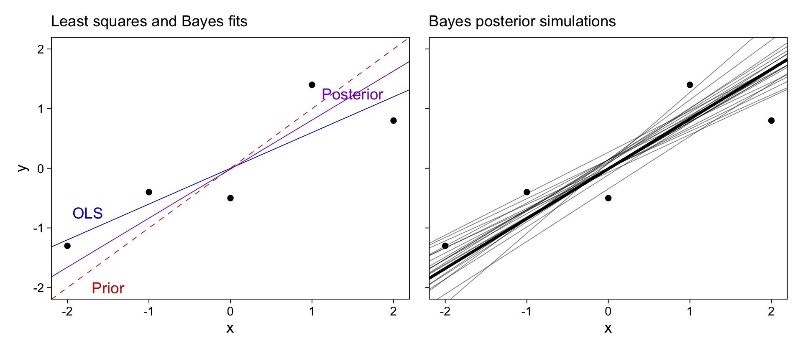

The authors then wrote: “The standard deviation of the fitted values
from the Bayes model is 1.3, while the standard deviation of the data is
only 1.08, so the square of this ratio–\(R^2\) as defined in (11.2)–is
greater than 1” (p. 170). Here is the standard deviation for the fitted
values for `m11.7`.

``` r
fitted(m11.7) %>% 
  data.frame() %>% 
  summarise(sd_fitted_values = sd(Estimate))
```

    ##   sd_fitted_values
    ## 1         1.321272

The standard deviation for the actual data.

``` r
xy %>% 
  summarise(sd_data = sd(y))
```

    ## # A tibble: 1 x 1
    ##   sd_data
    ##     <dbl>
    ## 1    1.08

To overcome this oddity, Gelman et al recommend we define the Bayesian
\(R^2\) by a different formula,

\[\text{alternative}\ R^2 = \frac{\text{explained variance}}{\text{explained variance} + \text{residual variance}} = \frac{\operatorname{var}_\text{fit}}{\operatorname{var}_\text{fit} + \operatorname{var}_\text{res}}.\]

For models fit with **brms**, you can compute the Bayesian \(R^2\) based
on that formula with the `brms::bayes_R2()` function. By default,
`brms::bayes_R2()` returns a summary.

``` r
bayes_R2(m11.7, robust = T)
```

    ##     Estimate  Est.Error      Q2.5     Q97.5
    ## R2 0.8012626 0.01220263 0.7169294 0.8103271

If you set `summary = FALSE`, you’ll get a vector of posterior draws for
plotting. Here we’ll make an augmented version of Figure 11.18, with the
\(R^2\) posteriors for both `m10.3` and `m11.7`.

``` r
tibble(m10.3 = bayes_R2(m10.3, summary = F)[, 1],
       m11.7 = bayes_R2(m11.7, summary = F)[, 1]) %>% 
  pivot_longer(everything(), names_to = "fit") %>% 
  
  ggplot(aes(x = value)) +
  geom_histogram(binwidth = 0.01) +
  scale_y_continuous(NULL, breaks = NULL, expand = expansion(mult = c(0, 0.05))) +
  xlab(expression(Bayesian~italic(R)^2)) +
  facet_wrap(~fit, scales = "free_y", labeller = label_both)
```

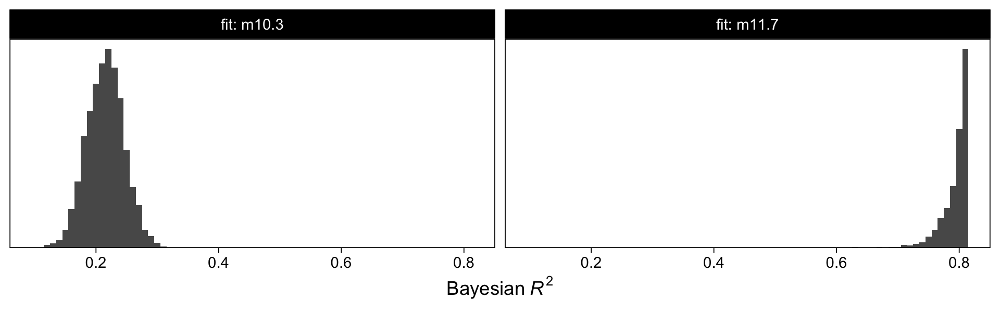

## 11.7 External validation: checking fitted model on new data

> The most fundamental way to test a model is to use it to make
> predictions and then compare to actual data. Figure 11.19 illustrates
> with the children’s test score model, which was fit to data collected
> from children who were born before 1987. Having fit the model using
> `stan_glm`, we then use `posterior_predict` to obtain simulations
> representing the predictive distribution for new cases.
> 
> We apply the model to predict the outcomes for children born in 1987
> or later. (p. 171)

Though I believe I understand how to do this, in principle, it is not
clear to my how Gelman et al did this with the actual data they
provided. First, the model they’re referring to is what we called
`m10.3`. Again, here’s its summary.

``` r
print(m10.3)
```

    ##  Family: gaussian 
    ##   Links: mu = identity; sigma = identity 
    ## Formula: kid_score ~ mom_hs + mom_iq 
    ##    Data: kidiq (Number of observations: 434) 
    ## Samples: 4 chains, each with iter = 2000; warmup = 1000; thin = 1;
    ##          total post-warmup samples = 4000
    ## 
    ## Population-Level Effects: 
    ##           Estimate Est.Error l-95% CI u-95% CI Rhat Bulk_ESS Tail_ESS
    ## Intercept    25.67      5.86    14.01    36.94 1.00     4074     3319
    ## mom_hs        5.90      2.16     1.59    10.14 1.00     4199     3264
    ## mom_iq        0.57      0.06     0.45     0.69 1.00     3608     3047
    ## 
    ## Family Specific Parameters: 
    ##       Estimate Est.Error l-95% CI u-95% CI Rhat Bulk_ESS Tail_ESS
    ## sigma    18.16      0.62    17.02    19.42 1.00     4761     3378
    ## 
    ## Samples were drawn using sampling(NUTS). For each parameter, Bulk_ESS
    ## and Tail_ESS are effective sample size measures, and Rhat is the potential
    ## scale reduction factor on split chains (at convergence, Rhat = 1).

We fit this model using the `kidiq` data.

``` r
glimpse(kidiq)
```

    ## Rows: 434
    ## Columns: 5
    ## $ kid_score <dbl> 65, 98, 85, 83, 115, 98, 69, 106, 102, 95, 91, 58, 84, 78, 102, 110, 102, 99, 1…
    ## $ mom_hs    <dbl> 1, 1, 1, 1, 1, 0, 1, 1, 1, 1, 1, 1, 1, 1, 0, 1, 1, 1, 1, 0, 1, 1, 1, 1, 0, 1, 1…
    ## $ mom_iq    <dbl> 121.11753, 89.36188, 115.44316, 99.44964, 92.74571, 107.90184, 138.89311, 125.1…
    ## $ mom_work  <dbl> 4, 4, 4, 3, 4, 1, 4, 3, 1, 1, 1, 4, 4, 4, 2, 1, 3, 3, 4, 3, 4, 2, 2, 4, 4, 4, 3…
    ## $ mom_age   <dbl> 27, 25, 27, 25, 27, 18, 20, 23, 24, 19, 23, 24, 27, 26, 24, 26, 23, 26, 20, 17,…

None of the variables in those data give us a clear way to predict
outcomes for children born at a later date or in a different age range.
We can still use `posterior_predict()` to simulate \(y^\text{new}\)
values for children who have the same `mom_hs` and `mom_iq` values as
those in the data. With the information I have, here’s about the best I
can do for Figure 11.19.

``` r
# left
set.seed(11)

p1 <-
  tibble(y_new = posterior_predict(m10.3)[1, ]) %>% 
  bind_cols(kidiq) %>% 
  ggplot(aes(x = y_new, y = kid_score)) +
  geom_abline(color = "grey75", size = 1/3) +
  geom_point(size = 1/2) +
  scale_x_continuous(expression(italic(y)^new~(predicted~score)), breaks = 0:3 * 40 + 20) +
  scale_y_continuous(expression(italic(y)~(actual~score)), breaks = 0:3 * 40 + 20)

# right
set.seed(11)

p2 <-
  tibble(res   = residuals(m10.3)[, 1],
         y_new = posterior_predict(m10.3)[1, ]) %>% 
  
  ggplot(aes(x = y_new, y = res)) +
  geom_hline(yintercept = c(mean(residuals(m10.3)[, 1]) - sd(residuals(m10.3)[, 1]),
                            mean(residuals(m10.3)[, 1]), 
                            mean(residuals(m10.3)[, 1]) + sd(residuals(m10.3)[, 1])),
             color = "grey75", size = 1/3, linetype = c(2, 1, 2)) +
  geom_point(size = 1/2) +
  scale_x_continuous(expression(italic(y)^new~(predicted~score)), breaks = 0:3 * 40 + 20) +
  scale_y_continuous(expression(italic(r)~(predicted~error)), breaks = 0:2 * 40 - 60) 

# combine
p1 + p2 + plot_layout(widths = 1:2)
```

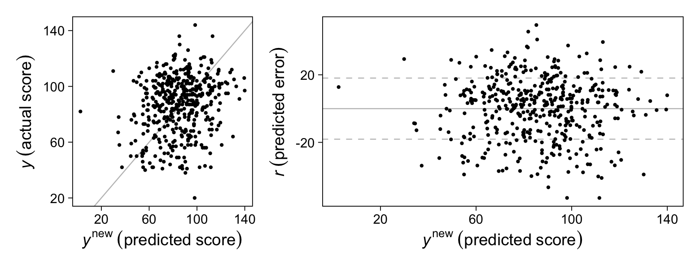

## 11.8 Cross validation

> In cross validation, part of the data is used to fit the model and the
> rest of the data–the *hold-out set*–is used as a proxy for future
> data. When there is no natural prediction task for future data, we can
> think of cross validation as a way to assess generalization from one
> part of the data to another part.
> 
> Different data partitions can be used, depending on the modeling task.
> We can hold out individual observations (*leave-one-out (LOO)* cross
> validation) or groups of observations (*leave-one-group-out*), or use
> past data to predict future observations (*leave-future-out*).
> (p. 172, *emphasis* in the original)

### 11.8.1 Leave-one-out cross validation.

Simulate the new `fake` data.

``` r
# how many would you like?
n <- 20

# population parameter values
a <- 0.2
b <- 0.3
sigma <- 1

# simulate
set.seed(2141)

fake <-
  tibble(x = 1:n ) %>% 
  mutate(y = a + b * x + sigma * rnorm(n(), mean = 0, sd = 1))

# take a look
head(fake)
```

    ## # A tibble: 6 x 2
    ##       x     y
    ##   <int> <dbl>
    ## 1     1 1.91 
    ## 2     2 0.815
    ## 3     3 0.763
    ## 4     4 1.66 
    ## 5     5 1.74 
    ## 6     6 4.13

Before they showed the model code, Gelman et al foreshadowed the
18<sup>th</sup> case will be a little off relative to the others. Let’s
make an exploratory graph to take a look at that case. We’ll emphasize
it with a red circle.

``` r
fake %>% 
  ggplot(aes(x = x, y = y)) +
  geom_point() +
  geom_point(data = . %>% filter(x == 18),
             shape = 1, size = 4, color = "red3") +
  ylim(0, NA)
```

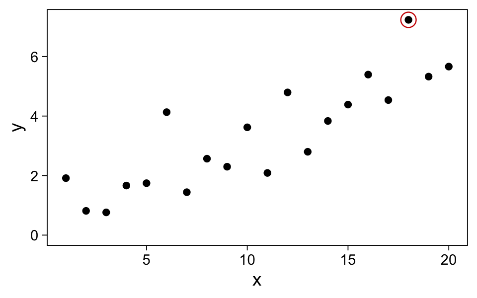

Fit the model with and without the 18<sup>th</sup> case.

``` r
m11.8_all <-
  brm(data = fake,
      y ~ x,
      seed = 11,
      file = "fits/m11.08_all")

m11.8_minus_18 <-
  brm(data = filter(fake, x != 18),
      y ~ x,
      seed = 11,
      file = "fits/m11.08_minus_18")
```

Check the parameter summaries for both models.

``` r
print(m11.8_all, robust = T)
```

    ##  Family: gaussian 
    ##   Links: mu = identity; sigma = identity 
    ## Formula: y ~ x 
    ##    Data: fake (Number of observations: 20) 
    ## Samples: 4 chains, each with iter = 2000; warmup = 1000; thin = 1;
    ##          total post-warmup samples = 4000
    ## 
    ## Population-Level Effects: 
    ##           Estimate Est.Error l-95% CI u-95% CI Rhat Bulk_ESS Tail_ESS
    ## Intercept     0.60      0.45    -0.32     1.54 1.00     3746     2588
    ## x             0.26      0.04     0.18     0.34 1.00     3555     2664
    ## 
    ## Family Specific Parameters: 
    ##       Estimate Est.Error l-95% CI u-95% CI Rhat Bulk_ESS Tail_ESS
    ## sigma     0.99      0.17     0.73     1.42 1.00     2839     2551
    ## 
    ## Samples were drawn using sampling(NUTS). For each parameter, Bulk_ESS
    ## and Tail_ESS are effective sample size measures, and Rhat is the potential
    ## scale reduction factor on split chains (at convergence, Rhat = 1).

``` r
print(m11.8_minus_18, robust = T)
```

    ##  Family: gaussian 
    ##   Links: mu = identity; sigma = identity 
    ## Formula: y ~ x 
    ##    Data: filter(fake, x != 18) (Number of observations: 19) 
    ## Samples: 4 chains, each with iter = 2000; warmup = 1000; thin = 1;
    ##          total post-warmup samples = 4000
    ## 
    ## Population-Level Effects: 
    ##           Estimate Est.Error l-95% CI u-95% CI Rhat Bulk_ESS Tail_ESS
    ## Intercept     0.74      0.43    -0.16     1.59 1.00     3233     2178
    ## x             0.24      0.04     0.16     0.31 1.00     3257     2350
    ## 
    ## Family Specific Parameters: 
    ##       Estimate Est.Error l-95% CI u-95% CI Rhat Bulk_ESS Tail_ESS
    ## sigma     0.88      0.16     0.66     1.29 1.00     2343     2585
    ## 
    ## Samples were drawn using sampling(NUTS). For each parameter, Bulk_ESS
    ## and Tail_ESS are effective sample size measures, and Rhat is the potential
    ## scale reduction factor on split chains (at convergence, Rhat = 1).

Figure 11.20a contains an interesting feature, which is the density of
the posterior predictive distributions, given `x == 18`, for each of the
fits. Those densities were plotted as if on their sides, with respect to
the \(x\)-axis. Since this is an unusual way to plot density values,
we’ll get a better appreciation for what they are with a few
preparatory steps. First, we’ll compute and plot the predictive
distributions, given `x == 18`, for each of the fits.

``` r
# compute and wrangle
nd <- tibble(x = 18)

set.seed(11)

pp <-
  tibble(all      = posterior_predict(m11.8_all, newdata = nd),
         minus_18 = posterior_predict(m11.8_minus_18, newdata = nd))

#  plot
pp %>% 
  pivot_longer(everything(),
               names_to = "fit") %>% 
  
  ggplot(aes(x = value, fill = fit)) +
  geom_density(size = 0) +
  scale_fill_manual(values = c("black", "grey50")) +
  xlab("posterior predictive distribution when x = 18") +
  theme(legend.position = "none") +
  facet_wrap(~fit, labeller = label_both)
```

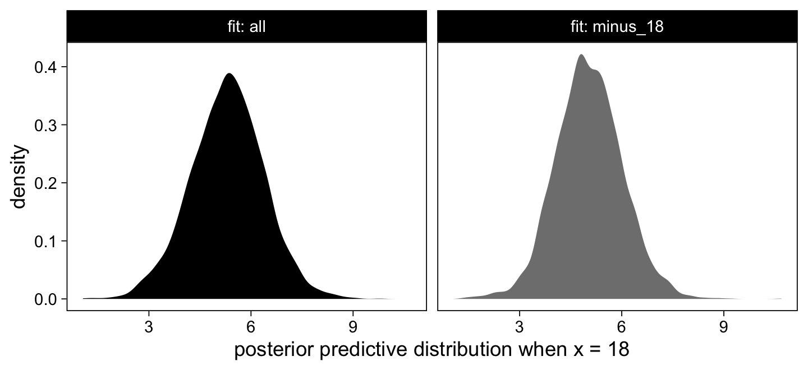

Gelman et al’s Figure 11.20a presumes one can reasonably summarize those
densities as if there were normally distributed. To assess the
credibility of those assumptions, we’ll superimpose normal density
curves based on the mean and standard deviation values of the
posteirors.

``` r
pp %>% 
  pivot_longer(everything(),
               names_to = "fit") %>% 
  group_by(fit) %>% 
  # mean and sd values, by fit
  mutate(mean = mean(value),
         sd = sd(value)) %>% 
  # use the mean and sd values to compute the density values
  mutate(d = dnorm(value, mean = mean, sd = sd)) %>% 
  arrange(value) %>% 
  
  ggplot(aes(x = value)) +
  geom_density(aes(fill = fit), 
               alpha = 2/3, size = 0) +
  geom_line(aes(y = d, color = fit)) + 
  scale_fill_manual(values = c("black", "grey50")) + 
  scale_color_manual(values = c("black", "grey50")) +
  xlab("posterior predictive distribution when x = 18") +
  theme(legend.position = "none") +
  facet_wrap(~fit, labeller = label_both)
```


Those idealized normal curves aren’t perfect representations of the
underlying densities, but they’re pretty close. Here we’ll compute those
densities for many values between `y == 0` and `y == 9` and plot to make
Figure 11.20a.

``` r
# to simplify the `geom_abline()` code
ps_all      <- posterior_summary(m11.8_all, robust = T)
ps_minus_18 <- posterior_summary(m11.8_minus_18, robust = T)

# compute the sideways densities
p1 <-
  pp %>% 
  pivot_longer(everything(),
               names_to = "fit") %>% 
  group_by(fit) %>% 
  summarise(mean = mean(value),
            sd = sd(value)) %>% 
  expand(nesting(fit, mean, sd),
         y = seq(from = 0, to = 9, length.out = 100)) %>% 
  mutate(d = dnorm(y, mean = mean, sd = sd)) %>% 
  select(-mean, -sd) %>% 
  pivot_wider(names_from = fit, values_from = d) %>% 
  
  # plot!
  ggplot(aes(y = y)) +
  geom_point(data = fake,
             aes(x = x)) +
  geom_point(data = fake %>% filter(x == 18),
             aes(x = x),
             shape = 1, size = 4, color = "red3") +
  geom_abline(intercept = ps_all[1, 1],
              slope = ps_all[2, 1]) +
  geom_abline(intercept = ps_minus_18[1, 1],
              slope = ps_minus_18[2, 1],
              color = "grey50", linetype = 2) +
  geom_path(aes(x = all * 6 + 18)) +
  geom_path(aes(x = minus_18 * 6 + 18), 
            color = "grey50", linetype = 2) +
  xlim(0.5, 20.5)
```

The panel in Figure 11.20b requires we compute two kinds of residuals.
For simplicity, we’ll be focusing on the posterior means for both kinds
of residuals. The first kind will be the conventional residuals, which
we’ll compute by hand. The second kind will be based on the expected
values form the `brms::loo_predict()` function. Though we won’t do so
here, you can compute the corresponding intervals with
`brms::loo_predictive_interval()`.

``` r
fake <-  
  fake %>% 
  mutate(fitted   = fitted(m11.8_all)[, 1],
         loo_pred = loo_predict(m11.8_all)) %>% 
  mutate(residual       = y - fitted,
         `LOO residual` = y - loo_pred)

p2 <-
  fake %>% 
  pivot_longer(contains("residual"), values_to = "residual") %>% 
  
  ggplot(aes(x = x, y = residual)) +
  geom_hline(yintercept = 0, linetype = 3, size = 1/4) +
  geom_point(aes(shape = name)) +
  geom_line(aes(group = x),
            size = 1/4) +
  scale_shape_manual(NULL, values = c(1, 19)) +
  xlim(0.5, 20.5) +
  theme(legend.background = element_rect(fill = "transparent"),
        legend.key.size = unit(0.35, "cm"),
        legend.key.width = unit(0.2, "cm"),
        legend.position = c(.13, .92),
        legend.text = element_text(size = 6))
```

Combine the two subplots to make the full Figure 11.20.

``` r
p1 + p2
```

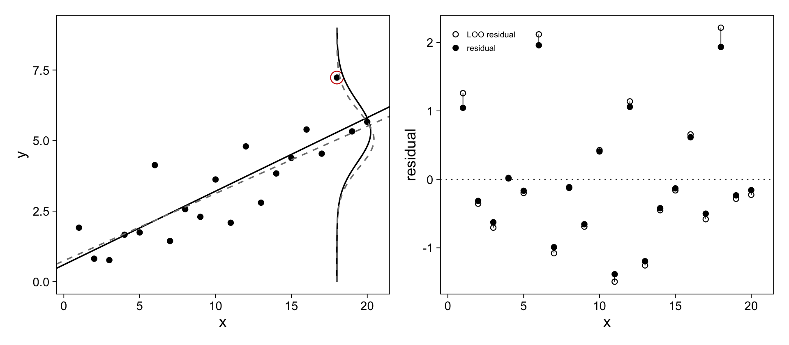

In statistical notation, we can describe the posterior predictive
distributions highlighted in the left panel as

\[p(y^\text{new} | x^\text{new}) \approx \frac{1}{S} \sum_{s = 1}^S p(y^\text{new} | x^\text{new}, \beta^s, \sigma^s),\]

where the various levels of \(s\) index a given posterior *simulation*
draw, and we implicitly presume the posterior predictive distribution is
normal by considering the parameters in terms of \(\beta^s\), which
define the mean, and \(\sigma^s\), which define the standard deviation.

As for the right panel, the `loo_predict()` function yields the expected
values from the LOO model excluding the held-out data point. Thus the
LOO residuals are those values when subtracted from the data-generating
values. “In this example, the LOO residuals all have larger magnitudes,
reflecting that it is more difficult to predict something that was not
used in model fitting” (p. 174).

Here are the standard deviations for the two kinds of residuals.

``` r
fake %>% 
  pivot_longer(contains("residual"), names_to = "kind", values_to = "residual") %>%
  group_by(kind) %>% 
  summarise(sd = sd(residual))
```

    ## # A tibble: 2 x 2
    ##   kind            sd
    ##   <chr>        <dbl>
    ## 1 LOO residual 1.02 
    ## 2 residual     0.922

If we just focus on point estimates, here’s the Bayesian \(R^2\) for the
full model and for the LOO approximation.

``` r
var_fitted       <- var(fake$fitted)
var_residual     <- var(fake$residual)
var_loo_residual <- var(fake$`LOO residual`)

# full model
var_fitted / (var_fitted + var_residual)
```

    ## [1] 0.7363812

``` r
# LOO
var_fitted / (var_fitted + var_loo_residual)
```

    ## [1] 0.6959314

### 11.8.2 Fast leave-one-out cross validation.

> LOO cross validation could be computed by fitting the model \(n\)
> times, once with each data point excluded. But this can be time
> consuming for large \(n\). The `loo` function uses a shortcut that
> makes use of the mathematics of Bayesian inference, where the
> posterior distribution can be written as the prior distribution
> multiplied by the likelihood. (p. 174)

### 11.8.3 Summarizing prediction error using the log score and deviance.

We can use the `brms::log_lik()` function to return
\(\log p(y_i | \theta^s)\).

``` r
ll_all <- log_lik(m11.8_all)

str(ll_all)
```

    ##  num [1:4000, 1:20] -1.23 -2.1 -1.03 -2.6 -1.08 ...
    ##  - attr(*, "dimnames")=List of 2
    ##   ..$ : NULL
    ##   ..$ : NULL

This returned an \(S \times N\) matrix, where the posterior draws are
depicted in the rows and the cases in the data are depicted in the
columns. Next, we’ll want to compute the average of each column,
\(\log \left( \frac{1}{S} \sum_{s = 1}^S p(y_i | \theta^s) \right)\).
Following the workflow in Vehtari’s `crossvalidation.Rmd` file, here’s
how to do so in a computationally stable way. We’ll save the results in
a column with `fake`.

``` r
fake$lpd_posterior <- matrixStats::colLogSumExps(ll_all) - log(nrow(ll_all))
```

Now we’ll save the results of the `add_criterion()` function within our
model fit object.

``` r
m11.8_all <- add_criterion(m11.8_all, criterion = "loo")
```

You can index the LOO-based log scores like so.

``` r
m11.8_all$criteria$loo$pointwise[, "elpd_loo"]
```

    ##  [1] -1.7293561 -1.0703094 -1.2270763 -0.9875564 -0.9930696 -3.3685325 -1.5089645 -0.9680902
    ##  [9] -1.1878374 -1.0436697 -2.0437394 -1.5725475 -1.7671842 -1.0627163 -0.9817703 -1.1916980
    ## [17] -1.1350669 -3.4908248 -1.0489347 -1.0473973

We’ll add those to the `fake` data and make Figure11.21.

``` r
fake <-
  fake %>% 
  mutate(lpd_loo = m11.8_all$criteria$loo$pointwise[, "elpd_loo"])

fake %>% 
  pivot_longer(lpd_posterior:lpd_loo, values_to = "lpd") %>% 
  
  ggplot(aes(x = x, y = lpd)) +
  geom_point(aes(shape = name)) +
  geom_line(aes(group = x),
            size = 1/4) +
  scale_shape_manual(NULL, values = c(1, 19)) +
  ylab("log predictive density") +
  theme(legend.background = element_rect(fill = "transparent"),
        legend.key.size = unit(0.35, "cm"),
        legend.key.width = unit(0.2, "cm"),
        legend.position = c(.13, .10),
        legend.text = element_text(size = 6))
```

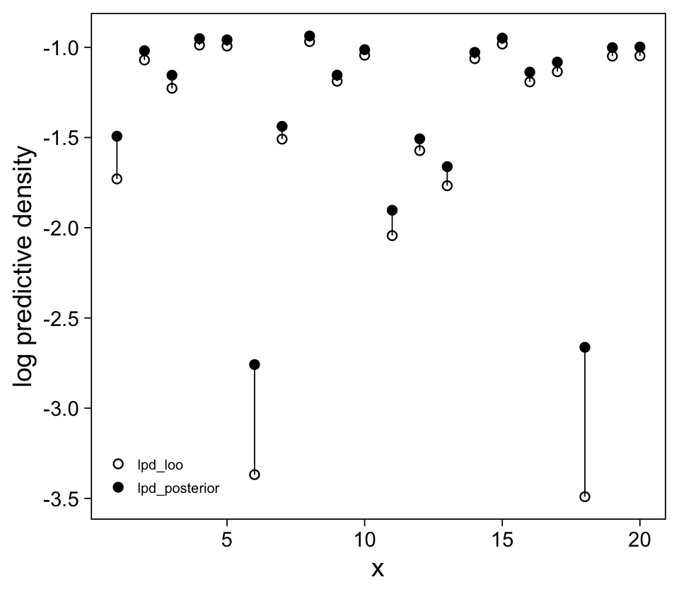

To see the estimate for the expected log predictive density (elpd), you
can just use the `loo()` function. The `looic` row in the output is that
same value multiplied by -2.

``` r
loo(m11.8_all)
```

    ## 
    ## Computed from 4000 by 20 log-likelihood matrix
    ## 
    ##          Estimate  SE
    ## elpd_loo    -29.4 3.3
    ## p_loo         2.6 0.9
    ## looic        58.9 6.6
    ## ------
    ## Monte Carlo SE of elpd_loo is 0.1.
    ## 
    ## Pareto k diagnostic values:
    ##                          Count Pct.    Min. n_eff
    ## (-Inf, 0.5]   (good)     18    90.0%   855       
    ##  (0.5, 0.7]   (ok)        2    10.0%   398       
    ##    (0.7, 1]   (bad)       0     0.0%   <NA>      
    ##    (1, Inf)   (very bad)  0     0.0%   <NA>      
    ## 
    ## All Pareto k estimates are ok (k < 0.7).
    ## See help('pareto-k-diagnostic') for details.

### 11.8.4 Overfitting and AIC.

The AIC is a widely used alternative within the frequentist paradigm.
For simple Gaussian models fit with flat priors, the LOO will often be
very close to the AIC.

### 11.8.5 Interpreting differences in log scores.

> The log score is rarely given a direct interpretation; almost always
> we look at differences in the log score, comparing two or more models.
> The reference point is that adding a linear predictor that is pure
> noise and with a weak prior on the coefficient should increase the log
> score of the fitted by 0.5, in expectation, but should result in an
> expected *decrease* of 0.5 in the LOO log score. (p. 175, *emphasis*
> in the original)

### 11.8.6 Demonstration of adding pure noise predictors to a model.

> When predictors are added to a model–even if the predictors are pure
> noise–the fit to data and within-sample predictive measures will
> generally improve. The ability of model to fit to the data is desired
> in modeling, but when the model is fit using finite data the model
> will fit partly also to random noise. We want to be able to separate
> which parts of the data allow us to generalize to new data or from one
> part of the data to the rest of the data and which part of the data is
> random noise which we should not be able to predict. (p. 176)

Once again, here’s the summary for `m10.3`.

``` r
print(m10.3,  robust = T)
```

    ##  Family: gaussian 
    ##   Links: mu = identity; sigma = identity 
    ## Formula: kid_score ~ mom_hs + mom_iq 
    ##    Data: kidiq (Number of observations: 434) 
    ## Samples: 4 chains, each with iter = 2000; warmup = 1000; thin = 1;
    ##          total post-warmup samples = 4000
    ## 
    ## Population-Level Effects: 
    ##           Estimate Est.Error l-95% CI u-95% CI Rhat Bulk_ESS Tail_ESS
    ## Intercept    25.63      5.79    14.01    36.94 1.00     4074     3319
    ## mom_hs        5.91      2.18     1.59    10.14 1.00     4199     3264
    ## mom_iq        0.57      0.06     0.45     0.69 1.00     3608     3047
    ## 
    ## Family Specific Parameters: 
    ##       Estimate Est.Error l-95% CI u-95% CI Rhat Bulk_ESS Tail_ESS
    ## sigma    18.14      0.63    17.02    19.42 1.00     4761     3378
    ## 
    ## Samples were drawn using sampling(NUTS). For each parameter, Bulk_ESS
    ## and Tail_ESS are effective sample size measures, and Rhat is the potential
    ## scale reduction factor on split chains (at convergence, Rhat = 1).

Now add five pure noise variables to the `kidiq` as a matrix column.

``` r
set.seed(11)

kidiq <-
  kidiq %>% 
  mutate(noise = array(rnorm(5 * n(), mean = 0, sd = 1), c(n(), 5)))

glimpse(kidiq)
```

    ## Rows: 434
    ## Columns: 6
    ## $ kid_score <dbl> 65, 98, 85, 83, 115, 98, 69, 106, 102, 95, 91, 58, 84, 78, 102, 110, 102, 99, 1…
    ## $ mom_hs    <dbl> 1, 1, 1, 1, 1, 0, 1, 1, 1, 1, 1, 1, 1, 1, 0, 1, 1, 1, 1, 0, 1, 1, 1, 1, 0, 1, 1…
    ## $ mom_iq    <dbl> 121.11753, 89.36188, 115.44316, 99.44964, 92.74571, 107.90184, 138.89311, 125.1…
    ## $ mom_work  <dbl> 4, 4, 4, 3, 4, 1, 4, 3, 1, 1, 1, 4, 4, 4, 2, 1, 3, 3, 4, 3, 4, 2, 2, 4, 4, 4, 3…
    ## $ mom_age   <dbl> 27, 25, 27, 25, 27, 18, 20, 23, 24, 19, 23, 24, 27, 26, 24, 26, 23, 26, 20, 17,…
    ## $ noise     <dbl[,5]> <matrix[33 x 5]>

Here’s a quick look at those `noise` variables.

``` r
head(kidiq$noise)
```

    ##             [,1]       [,2]        [,3]       [,4]       [,5]
    ## [1,] -0.59103110  0.6849033 -0.08208254  0.9965436 -1.9942198
    ## [2,]  0.02659437  0.4410281 -0.49962554 -1.0580791  1.0081189
    ## [3,] -1.51655310 -1.5033788 -2.72222495  0.3558838  1.6543779
    ## [4,] -1.36265335 -0.4816403  0.14404609 -0.7607800  0.4152565
    ## [5,]  1.17848916 -0.4108188  0.28310534  0.3351558 -0.2522345
    ## [6,] -0.93415132  0.3909185  0.57619536  0.1502261  2.4256832

``` r
m11.9 <-
  brm(data = kidiq,
      kid_score ~ mom_hs + mom_iq + noise,
      seed = 11,
      file = "fits/m11.09")
```

Check the summary.

``` r
print(m11.9, robust = T)
```

    ##  Family: gaussian 
    ##   Links: mu = identity; sigma = identity 
    ## Formula: kid_score ~ mom_hs + mom_iq + noise 
    ##    Data: kidiq (Number of observations: 434) 
    ## Samples: 4 chains, each with iter = 2000; warmup = 1000; thin = 1;
    ##          total post-warmup samples = 4000
    ## 
    ## Population-Level Effects: 
    ##           Estimate Est.Error l-95% CI u-95% CI Rhat Bulk_ESS Tail_ESS
    ## Intercept    25.14      6.16    13.42    37.09 1.00     7640     3253
    ## mom_hs        6.03      2.21     1.61    10.29 1.00     7256     3134
    ## mom_iq        0.57      0.06     0.45     0.69 1.00     7590     3181
    ## noise1        0.21      0.92    -1.47     1.96 1.00     7324     2646
    ## noise2       -2.34      0.92    -4.06    -0.65 1.00     6561     2827
    ## noise3       -0.46      0.85    -2.12     1.19 1.00     6524     2864
    ## noise4        0.90      0.84    -0.75     2.53 1.00     7025     3049
    ## noise5       -1.51      0.89    -3.29     0.23 1.00     7671     2682
    ## 
    ## Family Specific Parameters: 
    ##       Estimate Est.Error l-95% CI u-95% CI Rhat Bulk_ESS Tail_ESS
    ## sigma    18.02      0.62    16.90    19.25 1.00     7809     3148
    ## 
    ## Samples were drawn using sampling(NUTS). For each parameter, Bulk_ESS
    ## and Tail_ESS are effective sample size measures, and Rhat is the potential
    ## scale reduction factor on split chains (at convergence, Rhat = 1).

Naturally, our `noise` coefficients will differ a bit from those in the
text. Gelman et al didn’t include a `seed` value when they generated
their `noise` values. Here we compare the noise model `m11.9` and the
original non-noise model `m10.3` by their posteriors for \(\sigma\) and
\(R^2\).

``` r
p1 <-
  tibble(m10.3 = posterior_samples(m10.3) %>% pull(sigma),
         m11.9 = posterior_samples(m11.9) %>% pull(sigma)) %>% 
  pivot_longer(everything()) %>% 
  
  ggplot(aes(x = value, y = name)) +
  stat_halfeye(.width = .95) +
  labs(x = expression(sigma),
       y = NULL)

p2 <-
  tibble(m10.3 = bayes_R2(m10.3, summary = F)[, 1],
         m11.9 = bayes_R2(m11.9, summary = F)[, 1]) %>% 
  pivot_longer(everything()) %>% 
  
  ggplot(aes(x = value, y = name)) +
  stat_halfeye(.width = .95) +
  scale_x_continuous(expression(Bayesian~italic(R)^2), limits = c(0, NA)) +
  scale_y_discrete(NULL, breaks = NULL)

(p1 + p2) & coord_cartesian(ylim = c(1.5, 2.5))
```

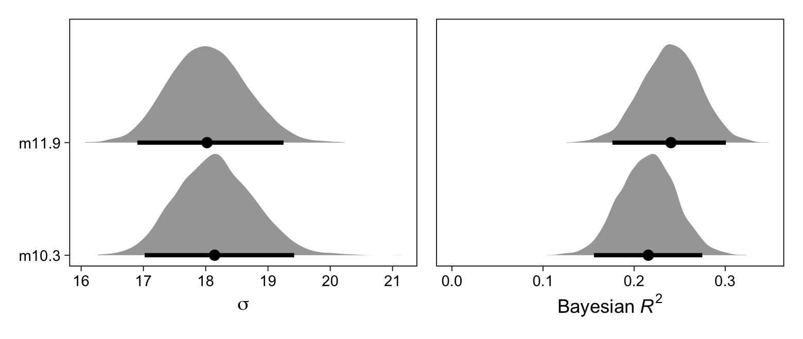

Now use `add_criterion()` to compute the LOO estimates.

``` r
m10.3 <- add_criterion(m10.3, criterion = "loo")
m11.9 <- add_criterion(m11.9, criterion = "loo")
```

We can use the `loo_compare()` function to compare the two models by
their LOO predictive log score (elpd).

``` r
loo_compare(m10.3, m11.9) %>% print(simplify = F)
```

    ##       elpd_diff se_diff elpd_loo se_elpd_loo p_loo   se_p_loo looic   se_looic
    ## m11.9     0.0       0.0 -1875.6     14.2         9.2     0.8   3751.2    28.4 
    ## m10.3    -0.4       3.4 -1876.0     14.3         3.9     0.4   3751.9    28.5

The difference is less than one point. If we’d like to compare the
models by their LOO \(R^2\) values, we can get full posterior summaries
with the `loo_R2()` function.

``` r
loo_R2(m10.3, robust = T)
```

    ##     Estimate  Est.Error      Q2.5     Q97.5
    ## R2 0.2052547 0.03387693 0.1329614 0.2667942

``` r
loo_R2(m11.9, robust = T)
```

    ##     Estimate Est.Error     Q2.5     Q97.5
    ## R2 0.2070194 0.0364077 0.131635 0.2730782

We have already fit the model `kid_score ~ mom_hs` back in Chapter 10.
We saved it as `m10.1`.

``` r
m10.1 <-
  brm(data = kidiq,
      kid_score ~ mom_hs,
      seed = 10,
      file = "fits/m10.01")
```

Review the summary.

``` r
print(m10.1, robust = T)
```

    ##  Family: gaussian 
    ##   Links: mu = identity; sigma = identity 
    ## Formula: kid_score ~ mom_hs 
    ##    Data: kidiq (Number of observations: 434) 
    ## Samples: 4 chains, each with iter = 2000; warmup = 1000; thin = 1;
    ##          total post-warmup samples = 4000
    ## 
    ## Population-Level Effects: 
    ##           Estimate Est.Error l-95% CI u-95% CI Rhat Bulk_ESS Tail_ESS
    ## Intercept    77.54      2.04    73.64    81.52 1.00     4579     3163
    ## mom_hs       11.77      2.35     7.28    16.34 1.00     4601     3058
    ## 
    ## Family Specific Parameters: 
    ##       Estimate Est.Error l-95% CI u-95% CI Rhat Bulk_ESS Tail_ESS
    ## sigma    19.88      0.67    18.65    21.22 1.00     4614     3219
    ## 
    ## Samples were drawn using sampling(NUTS). For each parameter, Bulk_ESS
    ## and Tail_ESS are effective sample size measures, and Rhat is the potential
    ## scale reduction factor on split chains (at convergence, Rhat = 1).

Now compute and review the LOO estimate.

``` r
m10.1 <- add_criterion(m10.1, criterion = "loo")

loo(m10.1)
```

    ## 
    ## Computed from 4000 by 434 log-likelihood matrix
    ## 
    ##          Estimate   SE
    ## elpd_loo  -1914.7 13.8
    ## p_loo         3.0  0.3
    ## looic      3829.5 27.6
    ## ------
    ## Monte Carlo SE of elpd_loo is 0.0.
    ## 
    ## All Pareto k estimates are good (k < 0.5).
    ## See help('pareto-k-diagnostic') for details.

Use `loo_compare()` to compute the difference in epld for `m10.3` and
`m10.1`.

``` r
loo_compare(m10.3, m10.1) %>% print(simplify = F)
```

    ##       elpd_diff se_diff elpd_loo se_elpd_loo p_loo   se_p_loo looic   se_looic
    ## m10.3     0.0       0.0 -1876.0     14.3         3.9     0.4   3751.9    28.5 
    ## m10.1   -38.8       8.4 -1914.7     13.8         3.0     0.3   3829.5    27.6

In Chapter 10, we fit the model with the interaction between `mom_hs`
and `mom_iq`, too. It was saved as `m10.4`. We’ve already loaded it
earlier in this chapter. Review the summary.

``` r
print(m10.4, robust = T)
```

    ##  Family: gaussian 
    ##   Links: mu = identity; sigma = identity 
    ## Formula: kid_score ~ mom_hs + mom_iq + mom_hs:mom_iq 
    ##    Data: kidiq (Number of observations: 434) 
    ## Samples: 4 chains, each with iter = 2000; warmup = 1000; thin = 1;
    ##          total post-warmup samples = 4000
    ## 
    ## Population-Level Effects: 
    ##               Estimate Est.Error l-95% CI u-95% CI Rhat Bulk_ESS Tail_ESS
    ## Intercept       -11.09     13.84   -40.00    17.03 1.00     1036     1739
    ## mom_hs           50.94     15.16    19.96    83.19 1.00      984     1574
    ## mom_iq            0.97      0.15     0.66     1.27 1.00     1034     1687
    ## mom_hs:mom_iq    -0.48      0.16    -0.82    -0.15 1.00      975     1520
    ## 
    ## Family Specific Parameters: 
    ##       Estimate Est.Error l-95% CI u-95% CI Rhat Bulk_ESS Tail_ESS
    ## sigma    18.01      0.60    16.84    19.24 1.00     2611     2238
    ## 
    ## Samples were drawn using sampling(NUTS). For each parameter, Bulk_ESS
    ## and Tail_ESS are effective sample size measures, and Rhat is the potential
    ## scale reduction factor on split chains (at convergence, Rhat = 1).

Now compute the LOO for `m10.4` and compare it with `m10.3`.

``` r
m10.4 <- add_criterion(m10.4, criterion = "loo")

loo_compare(m10.3, m10.4) %>% print(simplify = F)
```

    ##       elpd_diff se_diff elpd_loo se_elpd_loo p_loo   se_p_loo looic   se_looic
    ## m10.4     0.0       0.0 -1872.6     14.4         5.0     0.5   3745.3    28.8 
    ## m10.3    -3.3       2.9 -1876.0     14.3         3.9     0.4   3751.9    28.5

The interaction adds little to the model, when compared based on the LOO
estimate. Finally, we’ll compare `m10.1`, `m10.3`, and `m10.4` by the
full posteriors of their LOO \(R^2\) distributions.

``` r
loo_r2 <-
  tibble(m10.1 = loo_R2(m10.1, summary = F)[, 1],
         m10.3 = loo_R2(m10.3, summary = F)[, 1],
         m10.4 = loo_R2(m10.4, summary = F)[, 1])

loo_r2 %>% 
  pivot_longer(everything()) %>% 
  
  ggplot(aes(x = value, y = name)) +
  stat_halfeye(.width = .95) +
  labs(x = expression(LOO~italic(R)^2),
       y = NULL) +
  coord_cartesian(ylim = c(1.5, 3.25))
```

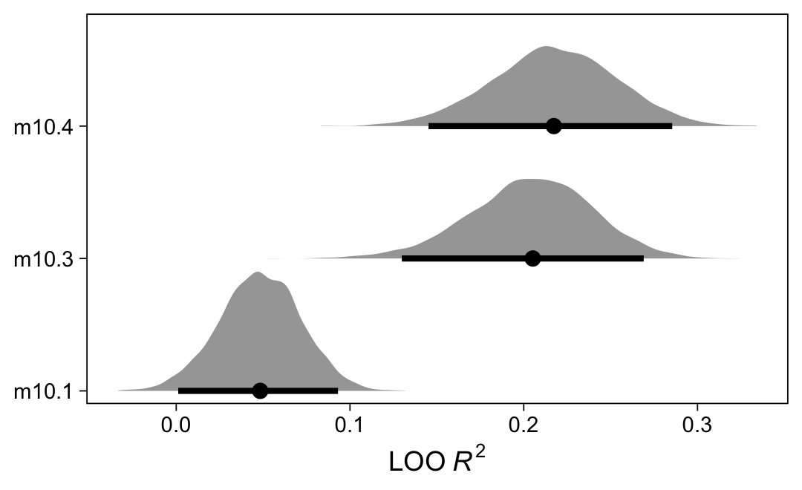

Interestingly enough, the LOO \(R^2\) can sink below 0. You can compute
formal \(\Delta \text{LOO} R^2\) scores, too.

``` r
loo_r2 %>% 
  mutate(`m10.1 - m10.3` = m10.1 - m10.3,
         `m10.1 - m10.4` = m10.1 - m10.4,
         `m10.3 - m10.4` = m10.3 - m10.4) %>% 
  pivot_longer(contains("-")) %>% 
  
  ggplot(aes(x = value, y = name)) +
  stat_halfeye(.width = .95) +
  labs(x = expression(Delta~LOO~italic(R)^2),
       y = NULL) +
  coord_cartesian(ylim = c(1.5, 3.25))
```

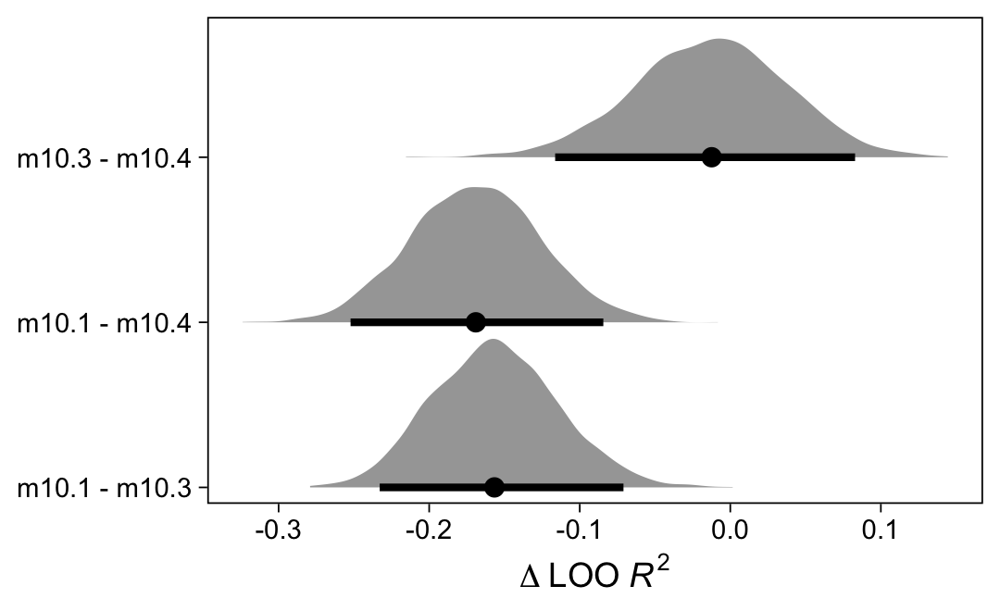

### 11.8.7 \(K\)-fold cross validation.

> When leave-one-out cross validation is unstable–which would be
> indicated by a warning message after running `loo`–you can switch to
> \(K\)-*fold cross validation* in which the data are randomly
> partitioned into \(K\) subsets, and the fit of each subset is
> evaluated based on a model fit to the rest of the data. This requires
> only \(K\) new model fits. It is conventional to use \(K = 10\).
> (p. 178, *emphasis* in the original)

### 11.8.8 Demonstration of \(K\)-fold cross validation using simulated data.

Make a \(60 \times 30\) matrix of \(n = 60\) cases and \(k = 30\)
highly-correlated predictor variables.

``` r
# how many cases?
n <- 60

# how many predictors?
k <- 30

# the correlation among predictors
rho <- 0.8

# simulate
set.seed(11)

Sigma <- rho * array(1, c(k, k)) + (1 - rho) * diag(k) 
# X <- MASS::mvrnorm(n, rep(0, k), Sigma)
fake <- tibble(X = MASS::mvrnorm(n, rep(0, k), Sigma))
# what did we do?
str(fake)
```

    ## tibble [60 × 1] (S3: tbl_df/tbl/data.frame)
    ##  $ X: num [1:60, 1:30] 0.1334 -0.0735 1.9457 1.1864 -1.001 ...
    ##   ..- attr(*, "dimnames")=List of 2
    ##   .. ..$ : NULL
    ##   .. ..$ : NULL

Now define the data-generating \(\beta\) values and use the 30
predictors to simulate the criterion, `y`.

``` r
# define the beta coefficients
b <- c(c(-1, 1, 2), rep(0, k - 3)) 

# simulate y
fake <-
  fake %>% 
  mutate(y = X %*% b + 2 * rnorm(n(), mean = 0, sd = 1))

# what did we do?
str(fake)
```

    ## tibble [60 × 2] (S3: tbl_df/tbl/data.frame)
    ##  $ X: num [1:60, 1:30] 0.1334 -0.0735 1.9457 1.1864 -1.001 ...
    ##   ..- attr(*, "dimnames")=List of 2
    ##   .. ..$ : NULL
    ##   .. ..$ : NULL
    ##  $ y: num [1:60, 1] 0.242 -0.0123 5.1075 3.6808 -3.7089 ...

Fit the model using the \(\operatorname N(0, 10)\) prior on the
\(\beta\) coefficients.

``` r
m11.10 <-
  brm(data = fake,
      y ~ X,
      seed = 11,
      prior = prior(normal(0, 10), class = b),
      file = "fits/m11.10")
```

Check the parameter summary.

``` r
print(m11.10, robust = T)
```

    ##  Family: gaussian 
    ##   Links: mu = identity; sigma = identity 
    ## Formula: y ~ X 
    ##    Data: fake (Number of observations: 60) 
    ## Samples: 4 chains, each with iter = 2000; warmup = 1000; thin = 1;
    ##          total post-warmup samples = 4000
    ## 
    ## Population-Level Effects: 
    ##           Estimate Est.Error l-95% CI u-95% CI Rhat Bulk_ESS Tail_ESS
    ## Intercept    -0.62      0.37    -1.34     0.14 1.00     3168     2618
    ## X1           -0.54      0.89    -2.43     1.23 1.00     2697     2886
    ## X2            1.12      0.72    -0.34     2.61 1.00     2988     2924
    ## X3            1.04      0.75    -0.53     2.62 1.00     2977     3223
    ## X4            0.09      0.67    -1.21     1.43 1.00     3929     3280
    ## X5            1.18      0.77    -0.45     2.79 1.00     2711     2726
    ## X6            0.07      0.65    -1.32     1.46 1.00     3276     3088
    ## X7           -1.85      0.79    -3.40    -0.21 1.00     2732     3029
    ## X8            0.13      0.87    -1.67     1.86 1.00     3162     2706
    ## X9            1.44      0.70    -0.03     2.91 1.00     3539     2749
    ## X10           0.68      0.77    -0.87     2.19 1.00     3314     2911
    ## X11          -1.45      0.85    -3.24     0.35 1.00     2599     2698
    ## X12           0.16      0.70    -1.21     1.52 1.00     3245     3011
    ## X13          -1.25      0.76    -2.68     0.28 1.00     3353     3058
    ## X14           1.05      0.68    -0.37     2.40 1.00     3068     2633
    ## X15           0.93      0.86    -0.80     2.65 1.00     3216     2905
    ## X16           0.09      0.70    -1.27     1.49 1.00     3708     2936
    ## X17           1.37      0.77    -0.20     2.90 1.00     3133     3246
    ## X18          -1.87      0.69    -3.31    -0.47 1.00     3717     2999
    ## X19           1.83      0.84     0.18     3.54 1.00     2910     3035
    ## X20          -0.41      0.81    -2.08     1.26 1.00     3055     2943
    ## X21          -0.64      0.86    -2.37     1.14 1.00     2331     2568
    ## X22          -1.02      0.94    -3.05     0.81 1.00     2786     3057
    ## X23           0.78      0.83    -0.83     2.40 1.00     3642     2943
    ## X24           0.14      0.79    -1.47     1.80 1.00     2600     2612
    ## X25           0.74      0.93    -1.02     2.61 1.00     2326     2802
    ## X26          -1.49      0.90    -3.35     0.22 1.00     2474     2708
    ## X27           1.29      0.85    -0.51     3.11 1.00     2472     3041
    ## X28           0.32      0.76    -1.22     1.88 1.00     2791     2669
    ## X29          -1.01      0.84    -2.64     0.77 1.00     2267     2983
    ## X30          -1.02      0.78    -2.59     0.58 1.00     3133     2713
    ## 
    ## Family Specific Parameters: 
    ##       Estimate Est.Error l-95% CI u-95% CI Rhat Bulk_ESS Tail_ESS
    ## sigma     2.02      0.27     1.60     2.68 1.00     1783     2970
    ## 
    ## Samples were drawn using sampling(NUTS). For each parameter, Bulk_ESS
    ## and Tail_ESS are effective sample size measures, and Rhat is the potential
    ## scale reduction factor on split chains (at convergence, Rhat = 1).

Compute, save, and review the LOO estimate.

``` r
m11.10 <- add_criterion(m11.10, criterion = "loo")
loo(m11.10)
```

    ## 
    ## Computed from 4000 by 60 log-likelihood matrix
    ## 
    ##          Estimate  SE
    ## elpd_loo   -147.4 3.8
    ## p_loo        27.9 2.4
    ## looic       294.9 7.6
    ## ------
    ## Monte Carlo SE of elpd_loo is NA.
    ## 
    ## Pareto k diagnostic values:
    ##                          Count Pct.    Min. n_eff
    ## (-Inf, 0.5]   (good)     12    20.0%   919       
    ##  (0.5, 0.7]   (ok)       34    56.7%   185       
    ##    (0.7, 1]   (bad)      14    23.3%   66        
    ##    (1, Inf)   (very bad)  0     0.0%   <NA>      
    ## See help('pareto-k-diagnostic') for details.

Like in the text, we received a warning about several observations “with
a pareto\_k \> 0.7.” One way to follow the recommendation in the warning
is to perform \(K\)-fold validation with the `kfold()` function, as in
the text. Perhaps a better way is to use the `add_criterion()` function
with `criterion = "kfold"`. That way the results are saved to the model
fit object.

``` r
m11.10 <- add_criterion(m11.10, criterion = "kfold", K = 10)
```

Now you can extract the \(K\)-fold summary like so.

``` r
m11.10$criteria$kfold
```

    ## 
    ## Based on 10-fold cross-validation
    ## 
    ##            Estimate  SE
    ## elpd_kfold   -150.7 3.7
    ## p_kfold        31.1 2.7
    ## kfoldic       301.4 7.4

“This is the estimated log score of the data under cross validation, and
it is on the same scale as LOO” (p. 179). Our results are similar to
those in the text.

Now fit an alternative version of the model with the regularized
horseshoe prior on the \(\beta\) parameters.

``` r
m11.11 <-
  brm(data = fake,
      y ~ X,
      prior = prior(horseshoe(1), class = b),
      seed = 11,
      control = list(adapt_delta = 0.95),
      file = "fits/m11.11")
```

Check the parameter summary.

``` r
print(m11.11, robust = T)
```

    ##  Family: gaussian 
    ##   Links: mu = identity; sigma = identity 
    ## Formula: y ~ X 
    ##    Data: fake (Number of observations: 60) 
    ## Samples: 4 chains, each with iter = 2000; warmup = 1000; thin = 1;
    ##          total post-warmup samples = 4000
    ## 
    ## Population-Level Effects: 
    ##           Estimate Est.Error l-95% CI u-95% CI Rhat Bulk_ESS Tail_ESS
    ## Intercept    -0.27      0.31    -0.85     0.36 1.00     4782     3240
    ## X1           -0.01      0.16    -0.96     0.56 1.00     4519     3359
    ## X2            0.78      0.85    -0.09     2.23 1.00     2286     2767
    ## X3            0.33      0.49    -0.17     1.77 1.00     2472     3514
    ## X4            0.04      0.17    -0.36     1.07 1.00     4730     3506
    ## X5            0.01      0.14    -0.51     0.79 1.00     4550     3547
    ## X6            0.06      0.18    -0.34     1.10 1.00     4416     3677
    ## X7           -0.02      0.15    -1.13     0.42 1.00     3856     3251
    ## X8           -0.00      0.15    -0.77     0.63 1.00     4752     3337
    ## X9            0.05      0.17    -0.34     1.14 1.00     3695     3453
    ## X10           0.03      0.17    -0.41     1.10 1.00     4263     3257
    ## X11          -0.12      0.26    -1.70     0.27 1.00     2377     3526
    ## X12           0.05      0.18    -0.37     1.03 1.00     4328     3452
    ## X13          -0.03      0.15    -1.06     0.45 1.00     3490     3671
    ## X14           0.07      0.20    -0.29     1.18 1.00     3619     3796
    ## X15           0.02      0.16    -0.51     1.07 1.00     4167     3341
    ## X16           0.03      0.16    -0.42     0.98 1.00     4475     3873
    ## X17           0.05      0.18    -0.37     1.17 1.00     3525     3344
    ## X18          -0.56      0.79    -2.14     0.12 1.00     1609     2813
    ## X19           0.09      0.22    -0.29     1.42 1.00     3119     3484
    ## X20           0.01      0.16    -0.55     0.88 1.00     4634     3553
    ## X21           0.10      0.24    -0.35     1.37 1.00     3974     3116
    ## X22          -0.02      0.16    -1.03     0.58 1.00     4282     3259
    ## X23           0.04      0.17    -0.46     1.16 1.00     4032     3692
    ## X24           0.00      0.13    -0.68     0.66 1.00     5280     3508
    ## X25          -0.00      0.15    -0.79     0.62 1.00     4490     3465
    ## X26          -0.02      0.15    -1.02     0.49 1.00     3546     3518
    ## X27           0.09      0.23    -0.32     1.51 1.00     3562     3409
    ## X28           0.03      0.15    -0.42     1.06 1.00     4384     3615
    ## X29          -0.02      0.16    -0.94     0.47 1.00     4459     3638
    ## X30          -0.02      0.15    -1.05     0.45 1.00     4131     3641
    ## 
    ## Family Specific Parameters: 
    ##       Estimate Est.Error l-95% CI u-95% CI Rhat Bulk_ESS Tail_ESS
    ## sigma     2.10      0.23     1.71     2.60 1.00     2597     2931
    ## 
    ## Samples were drawn using sampling(NUTS). For each parameter, Bulk_ESS
    ## and Tail_ESS are effective sample size measures, and Rhat is the potential
    ## scale reduction factor on split chains (at convergence, Rhat = 1).

Skip the LOO and jump straight into \(K\)-fold cross validation, saving
the results directly in the model fit object.

``` r
m11.11 <- add_criterion(m11.11, criterion = "kfold", K = 10)
```

Compare the two models with `loo_compare()`, where `criterion =
"kfold"`.

``` r
loo_compare(m11.10, m11.11, criterion = "kfold") %>% print(simplify = F)
```

    ##        elpd_diff se_diff elpd_kfold se_elpd_kfold p_kfold se_p_kfold
    ## m11.11    0.0       0.0  -136.4        3.6          11.6     1.4    
    ## m11.10  -14.2       4.3  -150.7        3.7          31.1     2.7

You might be interested in comparing the modes with a coefficient plot
focusing on the \(\beta\) parameters.

``` r
# combine the summaries for the two models
bind_rows(
  # m11.10
  fixef(m11.10) %>% 
    data.frame() %>% 
    rownames_to_column("param") %>% 
    mutate(fit = "m11.10"),
  
  # m11.11
  fixef(m11.11) %>% 
    data.frame() %>% 
    rownames_to_column("param") %>% 
    mutate(fit = "m11.11")
) %>% 
  # wrangle
  filter(param != "Intercept") %>% 
  mutate(param = factor(param,
                        levels = str_c("X", 1:30),
                        labels = str_c("X[", 1:30, "]"))) %>% 
  
  # plot!
  ggplot(aes(x = param, y = Estimate, ymin = Q2.5, ymax = Q97.5, color = fit)) +
  geom_hline(yintercept = 0, linetype = 2, size = 1/4) +
  geom_linerange(position = position_dodge(width = 1/3), size = 1/4, key_glyph = "path") +
  geom_point(position = position_dodge(width = 1/3), size = 1/2) +
  scale_color_manual(NULL,
                     values = c("grey50", "black"),
                     guide = guide_legend(override.aes = list(angle = 90))) +
  scale_x_discrete(NULL, labels = ggplot2:::parse_safe) +
  ylab("marginal posterior") +
  coord_flip() +
  theme(axis.text.y = element_text(hjust = 0))
```

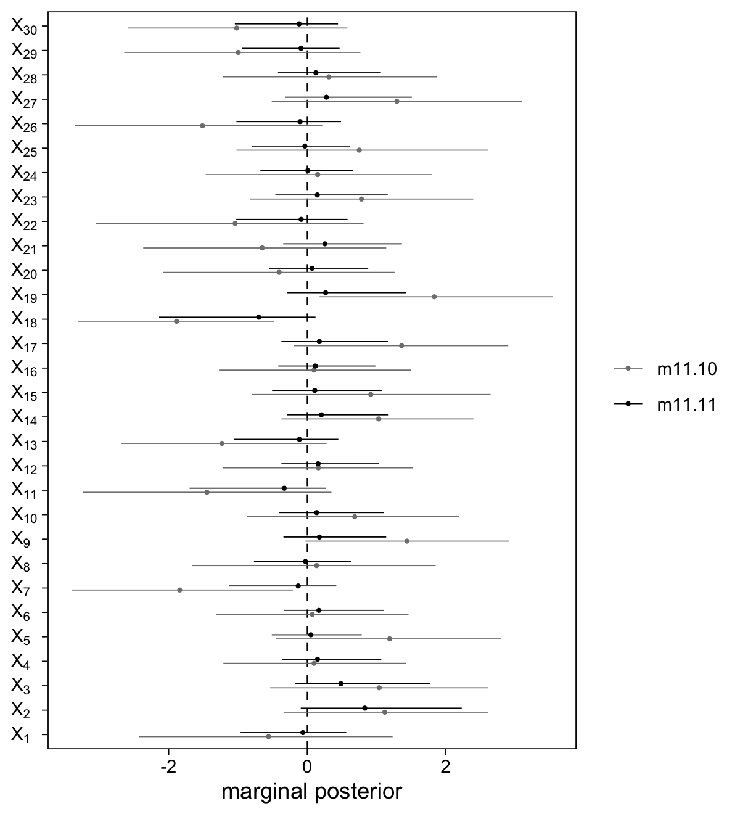

The horseshoe prior approach we uses for `m11.11` aggressively pulled
the coefficients towards zero.

### 11.8.9 Concerns about model selection.

“Given several candidate models, we can use cross validation to compare
their predictive performance. But it does not always make sense to
choose the model that optimizes estimated predicted performance, for
several reasons” (p. 180).

## Session info

``` r
sessionInfo()
```

    ## R version 4.0.3 (2020-10-10)
    ## Platform: x86_64-apple-darwin17.0 (64-bit)
    ## Running under: macOS Catalina 10.15.7
    ## 
    ## Matrix products: default
    ## BLAS:   /Library/Frameworks/R.framework/Versions/4.0/Resources/lib/libRblas.dylib
    ## LAPACK: /Library/Frameworks/R.framework/Versions/4.0/Resources/lib/libRlapack.dylib
    ## 
    ## locale:
    ## [1] en_US.UTF-8/en_US.UTF-8/en_US.UTF-8/C/en_US.UTF-8/en_US.UTF-8
    ## 
    ## attached base packages:
    ## [1] stats     graphics  grDevices utils     datasets  methods   base     
    ## 
    ## other attached packages:
    ##  [1] tidybayes_2.3.1 bayesplot_1.7.2 patchwork_1.1.0 brms_2.14.4     Rcpp_1.0.5      forcats_0.5.0  
    ##  [7] stringr_1.4.0   dplyr_1.0.2     purrr_0.3.4     readr_1.4.0     tidyr_1.1.2     tibble_3.0.4   
    ## [13] ggplot2_3.3.2   tidyverse_1.3.0
    ## 
    ## loaded via a namespace (and not attached):
    ##   [1] readxl_1.3.1         backports_1.2.0      plyr_1.8.6           igraph_1.2.6        
    ##   [5] splines_4.0.3        svUnit_1.0.3         crosstalk_1.1.0.1    rstantools_2.1.1    
    ##   [9] inline_0.3.17        digest_0.6.27        htmltools_0.5.0      rsconnect_0.8.16    
    ##  [13] fansi_0.4.1          magrittr_2.0.1       modelr_0.1.8         RcppParallel_5.0.2  
    ##  [17] matrixStats_0.57.0   xts_0.12.1           prettyunits_1.1.1    colorspace_2.0-0    
    ##  [21] rvest_0.3.6          ggdist_2.4.0         haven_2.3.1          xfun_0.19           
    ##  [25] callr_3.5.1          crayon_1.3.4         jsonlite_1.7.1       lme4_1.1-25         
    ##  [29] survival_3.2-7       zoo_1.8-8            glue_1.4.2           gtable_0.3.0        
    ##  [33] emmeans_1.5.2-1      V8_3.4.0             distributional_0.2.1 pkgbuild_1.1.0      
    ##  [37] rstan_2.21.2         abind_1.4-5          scales_1.1.1         mvtnorm_1.1-1       
    ##  [41] DBI_1.1.0            miniUI_0.1.1.1       xtable_1.8-4         stats4_4.0.3        
    ##  [45] StanHeaders_2.21.0-6 DT_0.16              htmlwidgets_1.5.2    httr_1.4.2          
    ##  [49] threejs_0.3.3        arrayhelpers_1.1-0   ellipsis_0.3.1       pkgconfig_2.0.3     
    ##  [53] loo_2.3.1            farver_2.0.3         dbplyr_2.0.0         utf8_1.1.4          
    ##  [57] tidyselect_1.1.0     labeling_0.4.2       rlang_0.4.9          reshape2_1.4.4      
    ##  [61] later_1.1.0.1        munsell_0.5.0        cellranger_1.1.0     tools_4.0.3         
    ##  [65] cli_2.2.0            generics_0.1.0       broom_0.7.2          ggridges_0.5.2      
    ##  [69] evaluate_0.14        fastmap_1.0.1        yaml_2.2.1           processx_3.4.5      
    ##  [73] knitr_1.30           fs_1.5.0             nlme_3.1-149         mime_0.9            
    ##  [77] projpred_2.0.2       rstanarm_2.21.1      xml2_1.3.2           compiler_4.0.3      
    ##  [81] shinythemes_1.1.2    rstudioapi_0.13      gamm4_0.2-6          curl_4.3            
    ##  [85] reprex_0.3.0         statmod_1.4.35       stringi_1.5.3        ps_1.5.0            
    ##  [89] Brobdingnag_1.2-6    lattice_0.20-41      Matrix_1.2-18        nloptr_1.2.2.2      
    ##  [93] markdown_1.1         shinyjs_2.0.0        vctrs_0.3.5          pillar_1.4.7        
    ##  [97] lifecycle_0.2.0      bridgesampling_1.0-0 estimability_1.3     httpuv_1.5.4        
    ## [101] R6_2.5.0             promises_1.1.1       gridExtra_2.3        codetools_0.2-16    
    ## [105] boot_1.3-25          colourpicker_1.1.0   MASS_7.3-53          gtools_3.8.2        
    ## [109] assertthat_0.2.1     withr_2.3.0          shinystan_2.5.0      mgcv_1.8-33         
    ## [113] parallel_4.0.3       hms_0.5.3            grid_4.0.3           coda_0.19-4         
    ## [117] minqa_1.2.4          rmarkdown_2.5        shiny_1.5.0          lubridate_1.7.9.2   
    ## [121] base64enc_0.1-3      dygraphs_1.1.1.6
