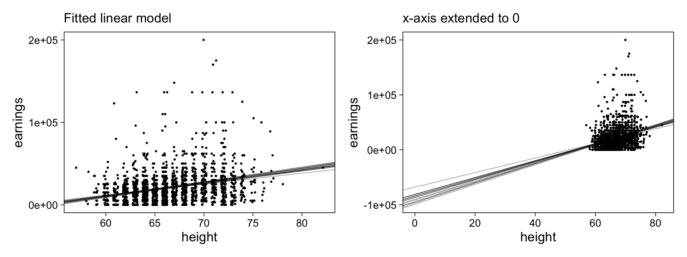
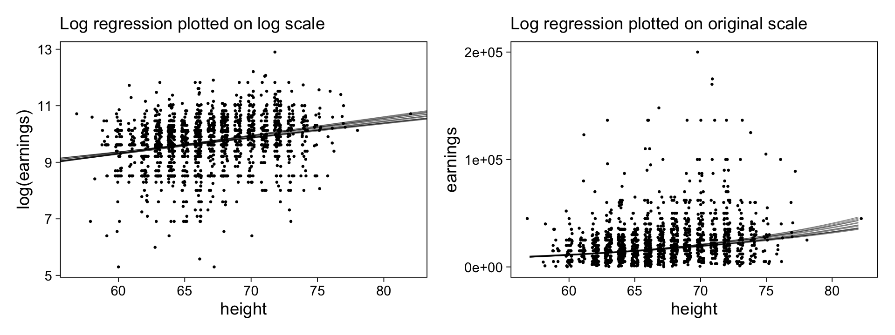
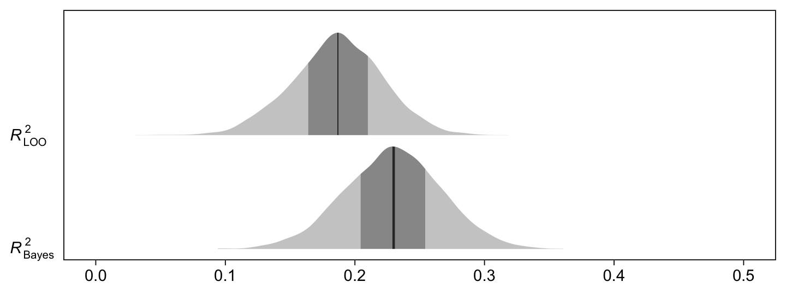

Chapter 12: Transformations and regression
================
A Solomon Kurz
2021-03-03

# Transformations and regression

“It is not always best to fit a regression using data in their raw form”
(p. 183).

## 12.1 Linear transformations

### 12.1.1 Scaling of predictors and regression coefficients.

Load the `earnings.csv` data file.

``` r
library(tidyverse)

earnings <- read_csv("ROS-Examples-master/Earnings/data/earnings.csv")

glimpse(earnings)
```

    ## Rows: 1,816
    ## Columns: 15
    ## $ height           <dbl> 74, 66, 64, 65, 63, 68, 63, 64, 62, 73, 72, 72, 72, …
    ## $ weight           <dbl> 210, 125, 126, 200, 110, 165, 190, 125, 200, 230, 17…
    ## $ male             <dbl> 1, 0, 0, 0, 0, 0, 0, 0, 0, 1, 1, 1, 1, 1, 0, 1, 1, 1…
    ## $ earn             <dbl> 50000, 60000, 30000, 25000, 50000, 62000, 51000, 900…
    ## $ earnk            <dbl> 50.00, 60.00, 30.00, 25.00, 50.00, 62.00, 51.00, 9.0…
    ## $ ethnicity        <chr> "White", "White", "White", "White", "Other", "Black"…
    ## $ education        <dbl> 16, 16, 16, 17, 16, 18, 17, 15, 12, 17, 15, NA, 12, …
    ## $ mother_education <dbl> 16, 16, 16, 17, 16, 18, 17, 15, 12, 17, 15, 99, 12, …
    ## $ father_education <dbl> 16, 16, 16, NA, 16, 18, 17, 15, 12, 17, 15, 99, 12, …
    ## $ walk             <dbl> 3, 6, 8, 8, 5, 1, 3, 7, 2, 7, 8, 1, 1, 4, 7, 7, 6, 4…
    ## $ exercise         <dbl> 3, 5, 1, 1, 6, 1, 1, 4, 2, 1, 1, 1, 2, 1, 4, 4, 5, 6…
    ## $ smokenow         <dbl> 2, 1, 2, 2, 2, 2, 2, 1, 2, 1, 2, 2, 2, 2, 2, 2, 2, 2…
    ## $ tense            <dbl> 0, 0, 1, 0, 0, 2, 4, 4, 0, 0, 0, 0, 1, 0, 2, 0, 2, 0…
    ## $ angry            <dbl> 0, 0, 1, 0, 0, 2, 4, 4, 0, 0, 0, 0, 1, 0, 2, 0, 2, 0…
    ## $ age              <dbl> 45, 58, 29, 57, 91, 54, 39, 26, 49, 46, 21, 53, 26, …

Fit the initial model,
\(\text{earn}_i = \beta_0 + \beta_1 \text{height}_i + \text{error}_i\),
with default priors.

``` r
library(brms)

m12.1 <-
  brm(data = earnings,
      earn ~ 1 + height,
      seed = 12,
      file = "fits/m12.01")
```

Check the parameter summary.

``` r
print(m12.1, robust = T)
```

    ##  Family: gaussian 
    ##   Links: mu = identity; sigma = identity 
    ## Formula: earn ~ 1 + height 
    ##    Data: earnings (Number of observations: 1816) 
    ## Samples: 4 chains, each with iter = 2000; warmup = 1000; thin = 1;
    ##          total post-warmup samples = 4000
    ## 
    ## Population-Level Effects: 
    ##            Estimate Est.Error   l-95% CI  u-95% CI Rhat Bulk_ESS Tail_ESS
    ## Intercept -85015.25   8649.35 -101780.17 -67819.27 1.00     3938     3029
    ## height      1593.10    130.61    1336.04   1845.14 1.00     3899     2979
    ## 
    ## Family Specific Parameters: 
    ##       Estimate Est.Error l-95% CI u-95% CI Rhat Bulk_ESS Tail_ESS
    ## sigma 21696.79    364.73 21000.05 22452.90 1.00     4131     2767
    ## 
    ## Samples were drawn using sampling(NUTS). For each parameter, Bulk_ESS
    ## and Tail_ESS are effective sample size measures, and Rhat is the potential
    ## scale reduction factor on split chains (at convergence, Rhat = 1).

Randomly extract 15 posterior draws and make Figure 12.1.

``` r
# set the global plotting theme
theme_set(theme_linedraw() +
            theme(panel.grid = element_blank()))

# make a base plot
set.seed(12)

p <-
  posterior_samples(m12.1, add_chain = T) %>%
  slice_sample(n = 15) %>% 
  
  ggplot() +
  geom_abline(aes(intercept = b_Intercept,
                  slope = b_height, 
                  group = iter),
              size = 1/5, alpha = 1/2) +
  geom_jitter(data = earnings,
              aes(x = height, y = earn),
              width = 0.25, size = 1/4) +
  scale_y_continuous("earnings", breaks = -1:2 * 1e5)

# left
p1 <- p +
  labs(subtitle = "Fitted linear model") +
  coord_cartesian(ylim = c(0, 2e5))

# right
p2 <- p +
  labs(subtitle = "x-axis extended to 0") +
  coord_cartesian(xlim = c(0, max(earnings$height)),
                  ylim = c(-1e5, 2e5))

# combine
library(patchwork)
p1 + p2
```



The right panel helps depict the authors’ claim that the model
intercept, -85015, 95% CI \[-101780, -67819\] is conceptually
meaningless because `height == 0` is conceptually meaningless. No one
with adult earning potential is 0 inches tall.

Here’s the standard deviation for our predictor `height`.

``` r
earnings %>% 
  summarise(sd = sd(height))
```

    ## # A tibble: 1 x 1
    ##      sd
    ##   <dbl>
    ## 1  3.83

Here’s the expected difference in earning potential for a one standard
deviation difference in `height`.

``` r
library(tidybayes)

posterior_samples(m12.1) %>% 
  transmute(difference = 3.8 * b_height) %>% 
  mean_qi() %>% 
  mutate_if(is.double, round, digits = 0)
```

    ##   difference .lower .upper .width .point .interval
    ## 1       6053   5077   7012      1   mean        qi

In the text (p. 184), the authors’ list that difference as 610 dollars,
which I believe is a typo. Anyway, that difference in earnings based on
a standard difference in `height` is small relative to the magnitude of
\(\sigma\).

``` r
posterior_summary(m12.1, robust = T)["sigma", -2] %>% round(digits = 0)
```

    ## Estimate     Q2.5    Q97.5 
    ##    21697    21000    22453

### 12.1.2 Standardization using \(z\)-scores.

> Another way to scale the coefficients is to *standardize* the
> predictor by subtracting the mean and dividing by the standard
> deviation to yield a “\(z\)-score….”
> 
> Standardization using the sample mean and standard deviation of the
> predictors uses raw estimates from the data and thus should be used
> only when the the number of observations is big enough that these
> estimates are stable. When sample size is small, we recommend
> standardizing using an externally specified population distribution or
> other externally specified reasonable scales. (p. 184)

### 12.1.3 Standardization using an externally specified population distribution.

> A related approach is to rescale based on some standard set outside
> the data. For example, in analyses of test scores it is common to
> express estimates on the scale of standard deviations of test scores
> across all students in a grade. A test might be on a 0–100 scale, with
> fourth graders having a national mean score of 55 and standard
> deviation of 18. Then if the analysis is done on the scale of points
> on the exam, all coefficient estimates and standard errors from
> analyses of fourth graders are divided by 18 so that they are on this
> universal scale… The virtue of using a fixed scaling, rather than
> standardizing each dataset separately, is that estimates are all
> directly comparable. (p. 184)

### 12.1.4 Standardization using reasonable scales.

“Sometimes it is useful to keep inputs on familiar scales such as
inches, dollars, or years, but make convenient rescalings to aid in the
interpretability of coefficients. For example, we might work with
income/$10 000 or age in decades” (p. 185).

## 12.2 Centering and standardizing for models with interactions

Reload the `kidiq.csv` data, which is a subsample from the [National
Longitudinal Survey of Youth](https://www.nlsinfo.org/content/cohorts).

``` r
kidiq <- read_csv("ROS-Examples-master/KidIQ/data/kidiq.csv")

glimpse(kidiq)
```

    ## Rows: 434
    ## Columns: 5
    ## $ kid_score <dbl> 65, 98, 85, 83, 115, 98, 69, 106, 102, 95, 91, 58, 84, 78, …
    ## $ mom_hs    <dbl> 1, 1, 1, 1, 1, 0, 1, 1, 1, 1, 1, 1, 1, 1, 0, 1, 1, 1, 1, 0,…
    ## $ mom_iq    <dbl> 121.11753, 89.36188, 115.44316, 99.44964, 92.74571, 107.901…
    ## $ mom_work  <dbl> 4, 4, 4, 3, 4, 1, 4, 3, 1, 1, 1, 4, 4, 4, 2, 1, 3, 3, 4, 3,…
    ## $ mom_age   <dbl> 27, 25, 27, 25, 27, 18, 20, 23, 24, 19, 23, 24, 27, 26, 24,…

Refit model `m10.4` from Section 10.3.

``` r
m10.4 <-
  brm(data = kidiq,
      kid_score ~ mom_hs + mom_iq + mom_hs:mom_iq,
      seed = 10,
      file = "fits/m10.04")
```

Review the model summary.

``` r
print(m10.4, robust = T, digits = 1)
```

    ##  Family: gaussian 
    ##   Links: mu = identity; sigma = identity 
    ## Formula: kid_score ~ mom_hs + mom_iq + mom_hs:mom_iq 
    ##    Data: kidiq (Number of observations: 434) 
    ## Samples: 4 chains, each with iter = 2000; warmup = 1000; thin = 1;
    ##          total post-warmup samples = 4000
    ## 
    ## Population-Level Effects: 
    ##               Estimate Est.Error l-95% CI u-95% CI Rhat Bulk_ESS Tail_ESS
    ## Intercept        -11.1      13.8    -40.0     17.0  1.0     1036     1739
    ## mom_hs            50.9      15.2     20.0     83.2  1.0      984     1574
    ## mom_iq             1.0       0.2      0.7      1.3  1.0     1034     1687
    ## mom_hs:mom_iq     -0.5       0.2     -0.8     -0.1  1.0      975     1520
    ## 
    ## Family Specific Parameters: 
    ##       Estimate Est.Error l-95% CI u-95% CI Rhat Bulk_ESS Tail_ESS
    ## sigma     18.0       0.6     16.8     19.2  1.0     2611     2238
    ## 
    ## Samples were drawn using sampling(NUTS). For each parameter, Bulk_ESS
    ## and Tail_ESS are effective sample size measures, and Rhat is the potential
    ## scale reduction factor on split chains (at convergence, Rhat = 1).

The authors pointed out that because `mom_iq` is never close to
zero\[1\], which makes the other parameters difficult to interpret
directly.

### 12.2.1 Centering by subtracting the mean of the data.

Make mean-centered versions of the `mom_hs` and `mom_iq` variables.

``` r
kidiq <-
  kidiq %>% 
  mutate(c_mom_hs = mom_hs - mean(mom_hs),
         c_mom_iq = mom_iq - mean(mom_iq))
```

Now fit the `kid_score` model using the centered versions of the
predictors.

``` r
m12.2 <-
  brm(data = kidiq,
      kid_score ~ c_mom_hs + c_mom_iq + c_mom_hs:c_mom_iq,
      seed = 12,
      file = "fits/m12.02")
```

Check the new summary.

``` r
print(m12.2, robust = T, digits = 1)
```

    ##  Family: gaussian 
    ##   Links: mu = identity; sigma = identity 
    ## Formula: kid_score ~ c_mom_hs + c_mom_iq + c_mom_hs:c_mom_iq 
    ##    Data: kidiq (Number of observations: 434) 
    ## Samples: 4 chains, each with iter = 2000; warmup = 1000; thin = 1;
    ##          total post-warmup samples = 4000
    ## 
    ## Population-Level Effects: 
    ##                   Estimate Est.Error l-95% CI u-95% CI Rhat Bulk_ESS Tail_ESS
    ## Intercept             87.7       0.9     85.9     89.4  1.0     4460     2724
    ## c_mom_hs               2.8       2.4     -1.9      7.7  1.0     4179     3155
    ## c_mom_iq               0.6       0.1      0.5      0.7  1.0     4326     2949
    ## c_mom_hs:c_mom_iq     -0.5       0.2     -0.8     -0.2  1.0     4282     2932
    ## 
    ## Family Specific Parameters: 
    ##       Estimate Est.Error l-95% CI u-95% CI Rhat Bulk_ESS Tail_ESS
    ## sigma     18.0       0.6     16.8     19.3  1.0     5020     2837
    ## 
    ## Samples were drawn using sampling(NUTS). For each parameter, Bulk_ESS
    ## and Tail_ESS are effective sample size measures, and Rhat is the potential
    ## scale reduction factor on split chains (at convergence, Rhat = 1).

Now the intercept is meaningful. It’s the mean of the criterion,
`kid_score`.

``` r
kidiq %>% 
  summarise(mean = mean(kid_score))
```

    ## # A tibble: 1 x 1
    ##    mean
    ##   <dbl>
    ## 1  86.8

### 12.2.2 Using a conventional centering point.

Now make two more versions of the predictors, this time centered at
conventional reference points.

``` r
kidiq <-
  kidiq %>% 
  mutate(c2_mom_hs = mom_hs - 0.5,
         c2_mom_iq = mom_iq - 100)
```

Fit the model, again.

``` r
m12.3 <-
  brm(data = kidiq,
      kid_score ~ c2_mom_hs + c2_mom_iq + c2_mom_hs:c2_mom_iq,
      seed = 12,
      file = "fits/m12.03")
```

Check the new summary.

``` r
print(m12.3, robust = T, digits = 1)
```

    ##  Family: gaussian 
    ##   Links: mu = identity; sigma = identity 
    ## Formula: kid_score ~ c2_mom_hs + c2_mom_iq + c2_mom_hs:c2_mom_iq 
    ##    Data: kidiq (Number of observations: 434) 
    ## Samples: 4 chains, each with iter = 2000; warmup = 1000; thin = 1;
    ##          total post-warmup samples = 4000
    ## 
    ## Population-Level Effects: 
    ##                     Estimate Est.Error l-95% CI u-95% CI Rhat Bulk_ESS Tail_ESS
    ## Intercept               86.8       1.2     84.5     89.1  1.0     3378     2689
    ## c2_mom_hs                2.9       2.4     -1.9      7.5  1.0     3422     3141
    ## c2_mom_iq                0.7       0.1      0.6      0.9  1.0     3008     2732
    ## c2_mom_hs:c2_mom_iq     -0.5       0.2     -0.8     -0.2  1.0     3079     2838
    ## 
    ## Family Specific Parameters: 
    ##       Estimate Est.Error l-95% CI u-95% CI Rhat Bulk_ESS Tail_ESS
    ## sigma     18.0       0.6     16.8     19.3  1.0     4491     2857
    ## 
    ## Samples were drawn using sampling(NUTS). For each parameter, Bulk_ESS
    ## and Tail_ESS are effective sample size measures, and Rhat is the potential
    ## scale reduction factor on split chains (at convergence, Rhat = 1).

### 12.2.3 Standardizing by subtracting the mean and dividing by 2 standard deviations.

Make another two versions of the predictors, this time standardized by
dividing by **2** standard deviations.

``` r
kidiq <-
  kidiq %>% 
  mutate(z_mom_hs = (mom_hs - mean(mom_hs)) / (2 * sd(mom_hs)),
         z_mom_iq = (mom_iq - mean(mom_iq)) / (2 * sd(mom_iq)))
```

Fit the model.

``` r
m12.4 <-
  brm(data = kidiq,
      kid_score ~ z_mom_hs + z_mom_iq + z_mom_hs:z_mom_iq,
      seed = 12,
      file = "fits/m12.04")
```

Check the new summary.

``` r
print(m12.4, robust = T, digits = 1)
```

    ##  Family: gaussian 
    ##   Links: mu = identity; sigma = identity 
    ## Formula: kid_score ~ z_mom_hs + z_mom_iq + z_mom_hs:z_mom_iq 
    ##    Data: kidiq (Number of observations: 434) 
    ## Samples: 4 chains, each with iter = 2000; warmup = 1000; thin = 1;
    ##          total post-warmup samples = 4000
    ## 
    ## Population-Level Effects: 
    ##                   Estimate Est.Error l-95% CI u-95% CI Rhat Bulk_ESS Tail_ESS
    ## Intercept             87.7       0.9     85.8     89.4  1.0     4599     2972
    ## z_mom_hs               2.4       2.0     -1.6      6.3  1.0     3991     3305
    ## z_mom_iq              17.6       1.8     14.0     21.2  1.0     3782     3328
    ## z_mom_hs:z_mom_iq    -11.9       4.0    -19.9     -4.0  1.0     4406     3413
    ## 
    ## Family Specific Parameters: 
    ##       Estimate Est.Error l-95% CI u-95% CI Rhat Bulk_ESS Tail_ESS
    ## sigma     18.0       0.6     16.9     19.2  1.0     4250     3464
    ## 
    ## Samples were drawn using sampling(NUTS). For each parameter, Bulk_ESS
    ## and Tail_ESS are effective sample size measures, and Rhat is the potential
    ## scale reduction factor on split chains (at convergence, Rhat = 1).

Now the coefficients for the two predictors are on more similar metrics,
making it easier to compare them. Because of the standardizing method,
they are interpreted as “a 1-unit change in the rescaled predictor
corresponds to a change from 1 standard deviation below the mean, to 1
standard deviation above” (p. 186).

### 12.2.4 Why scale by 2 standard deviations?

Recall that for a binary (binomial for which \(n = 1\)) variable, the
population standard deviation may be computed as

\[\sigma = \sqrt{p (1 - p)},\]

where \(p\) is the probability a given value is a 1. Here’s what that
means when \(p = .5\).

``` r
p <- .5
sqrt(p * (1 - p))
```

    ## [1] 0.5

Yet this does vary across the parameter space for \(p\) such that the
value decreases as you move away from \(p = .5\). To give a sense,
here’s \(\sigma\) as a function of \(p\) over a range of values.

``` r
tibble(p = seq(from = 0.01, to = 0.99, by = 0.01)) %>% 
  mutate(sd = sqrt(p * (1 - p))) %>% 
  
  ggplot(aes(x = p, y = sd)) +
  geom_line() +
  annotate(geom = "text",
           x = .5, y = .4,
           label = expression(sigma==sqrt(italic(p)(1-italic(p)))),
           parse = T) +
  ylim(0, 0.5) +
  labs(x = expression(italic(p)), y = expression(sigma))
```


In the limit, a binary variable for which \(p = .5\) that was
standardized according to the scheme \((x - \bar x) /(2 s x)\) would
take on values \(\pm .5\). Here’s an example with 100,000 trials.

``` r
set.seed(12)

tibble(x = rbinom(n = 1e5, size = 1, prob = .5)) %>% 
  mutate(z = (x - mean(x)) / (2 * sd(x))) %>% 
  slice(1:4)
```

    ## # A tibble: 4 x 2
    ##       x      z
    ##   <int>  <dbl>
    ## 1     0 -0.502
    ## 2     1  0.498
    ## 3     1  0.498
    ## 4     0 -0.502

Here’s how it looks if we use the population values when we standardize.

``` r
set.seed(12)

tibble(x = rbinom(n = 1e5, size = 1, prob = .5)) %>% 
  mutate(z = (x - .5) / (2 * .5)) %>% 
  slice(1:4)
```

    ## # A tibble: 4 x 2
    ##       x     z
    ##   <int> <dbl>
    ## 1     0  -0.5
    ## 2     1   0.5
    ## 3     1   0.5
    ## 4     0  -0.5

If we were to use such a standardized binary variable as a predictor,
its coefficient would reflect “comparisons between \(x = 0\) and
\(x = 1\)” (p. 187). Here are the values the binary variable would take
on if standardized by the population values, but according to the more
conventional scheme, \((x - \mu_x) / \sigma_x\).

``` r
set.seed(12)

tibble(x = rbinom(n = 1e5, size = 1, prob = .5)) %>% 
  mutate(z = (x - .5) / .5) %>% 
  slice(1:4)
```

    ## # A tibble: 4 x 2
    ##       x     z
    ##   <int> <dbl>
    ## 1     0    -1
    ## 2     1     1
    ## 3     1     1
    ## 4     0    -1

Then in a regression context, the “coefficient corresponds to half the
difference between the two possible values of \(x\)” (p. 187), which
isn’t as easy to interpret. Based on our \(p/\sigma\) plot, above,
this relation degrades the further you go from \(p = .5\).

### 12.2.5 Multiplying each regression coefficient by 2 standard deviations of its predictor.

> For models with no interactions, a procedure that is equivalent to
> centering and rescaling is to leave the regression predictors as is,
> and then create rescaled regression coefficients by multiplying each
> \(\beta\) by two times the standard deviation of its corresponding
> \(x\). This gives a sense of the importance of each variable,
> adjusting for all the others in the linear model. (p. 187)

## 12.3 Correlation and “regression to the mean”

Given a simple Gaussian model where
\(y_i = \beta_0 + \beta_1 x_i + \text{error}_i\), where both variables
are standardized in the conventional way, \(\beta_1 = \rho_{xy}\).
Otherwise put, the slope for a univariable regression model is
\(\beta_1 = \rho_{xy} \sigma_y / \sigma_x\).

### 12.3.1 The principal component line and the regression line.

It’s not clear, to me, we have direct access to the simulated data in
this section. Happily, it’s easy to simulate standardized data with a
given correlation using `mvtnorm::rmvnorm()`. Here we simulate 1,000
cases.

``` r
library(mvtnorm)

n     <- 1e3  # sample size
sigma <- 1    # the variances
rho   <- .5   # the correlation

# here's the variance/covariance matrix
cov_mat <- 
  matrix(c(sigma ^ 2,
           sigma * sigma * rho,
           sigma * sigma * rho,
           sigma ^ 2),
         nrow = 2, byrow = T)

# after setting our seed, we're ready to simulate with `rmvnorm()`
set.seed(12)
d <- 
  rmvnorm(n = n, sigma = cov_mat) %>% 
    data.frame() %>% 
    set_names("x", "y")

# what have we done?
glimpse(d)
```

    ## Rows: 1,000
    ## Columns: 2
    ## $ x <dbl> -1.021916981, -1.162259081, -2.000049495, -0.467207885, 0.007942166…
    ## $ y <dbl> 1.14022963, -1.13628052, -0.78004560, -0.68846621, 0.38587567, -1.4…

Now make Figure 12.2.

``` r
# left
p1 <-
  d %>% 
  ggplot(aes(x = x, y = y)) +
  geom_abline(color = "grey50") +
  geom_point(size = 1/5) +
  scale_x_continuous(breaks = NULL, limits = c(-4, 4)) +
  scale_y_continuous(breaks = NULL, limits = c(-4, 4)) +
  labs(subtitle = "principal component line") +
  coord_equal()

# right
p2 <-
  d %>% 
  ggplot(aes(x = x, y = y)) +
  geom_abline(color = "grey50", slope = 0.5) +
  geom_point(size = 1/5) +
  scale_x_continuous(breaks = NULL, limits = c(-4, 4)) +
  scale_y_continuous(NULL, breaks = NULL, limits = c(-4, 4)) +
  labs(subtitle = "regression line of y on x") +
  coord_equal()

# combine
p1 + p2
```


This highlights how the line that most optimally intersects the data
cloud (the principal component line, on the left) is NOT the same as the
line that optimally intersects the best prediction of `y`, given `x`
(the regression line, on the right). The regression line is meant to
optimize the *vertical* distance of the points to the line. The slopes
for the two plots are 1 and 0.5, respectively.

### 12.3.2 Regression to the mean.

> When \(x\) and \(y\) are standardized (that is, placed on a common
> scale, as in Figure 12.2), the regression line always has slope less
> than 1. Thus, when \(x\) is 1 standard deviation above the mean, the
> predicted value of \(y\) is somewhere between 0 and 1 standard
> deviations above the mean. This phenomenon in linear models–that \(y\)
> is predicted to be closer to the mean (in standard-deviation units)
> than \(x\)–is called *regression to the mean* and occurs in many vivid
> contexts. (p. 188, *emphasis* in the original)

The authors then described how this might work with an example of
mothers’ heights predicting the heights of their daughters. I’m not
aware that we have such a data set among those connected to the text.
But we can repurpose our synthetic data set `d`, from above. Staying
within the standardized metric, we’ll rename our `x` variable
`mom_height` and rename our `y` variable `daughter_height`.

``` r
d <-
  d %>% 
  mutate(mom_height      = x,
         daughter_height = y)

head(d)
```

    ##              x          y   mom_height daughter_height
    ## 1 -1.021916981  1.1402296 -1.021916981       1.1402296
    ## 2 -1.162259081 -1.1362805 -1.162259081      -1.1362805
    ## 3 -2.000049495 -0.7800456 -2.000049495      -0.7800456
    ## 4 -0.467207885 -0.6884662 -0.467207885      -0.6884662
    ## 5  0.007942166  0.3858757  0.007942166       0.3858757
    ## 6 -1.086100811 -1.4510830 -1.086100811      -1.4510830

Now fit the model,
\(\text{daughter_height}_i = \beta_0 + \beta_1 \text{mom_height}_i + \text{error}_i\),
where both variables are standardized.

``` r
m12.5 <-
  brm(data = d,
      daughter_height ~ mom_height,
      seed = 12,
      file = "fits/m12.05")
```

Check the new summary.

``` r
print(m12.5, robust = T)
```

    ##  Family: gaussian 
    ##   Links: mu = identity; sigma = identity 
    ## Formula: daughter_height ~ mom_height 
    ##    Data: d (Number of observations: 1000) 
    ## Samples: 4 chains, each with iter = 2000; warmup = 1000; thin = 1;
    ##          total post-warmup samples = 4000
    ## 
    ## Population-Level Effects: 
    ##            Estimate Est.Error l-95% CI u-95% CI Rhat Bulk_ESS Tail_ESS
    ## Intercept      0.02      0.03    -0.03     0.07 1.00     4046     2985
    ## mom_height     0.52      0.03     0.47     0.57 1.00     4063     2263
    ## 
    ## Family Specific Parameters: 
    ##       Estimate Est.Error l-95% CI u-95% CI Rhat Bulk_ESS Tail_ESS
    ## sigma     0.84      0.02     0.81     0.88 1.00     4027     3147
    ## 
    ## Samples were drawn using sampling(NUTS). For each parameter, Bulk_ESS
    ## and Tail_ESS are effective sample size measures, and Rhat is the potential
    ## scale reduction factor on split chains (at convergence, Rhat = 1).

Now consider the example from the text: “If a woman is 10 inches taller
than the average for her sex, and the correlation of mothers’ and adult
daughters’ heights is 0.5, then her daughter’s predicted height is 5
inches taller than the average” (p. 188). Based on a quick internet
search (see
[here](https://tasks.illustrativemathematics.org/content-standards/HSS/ID/A/4/tasks/1020#:~:text=Heights%20of%20adult%20women%20are,standard%20deviation%20of%202.5%20inches.)),
women’s heights in the US are approximately distributed as
\(\operatorname{Normal}(64.5, 2.5)\) in inches. Thus, a 10-unit
difference on the inches scale would be about a \(4\sigma\) difference
on the standardized scale. Here’s the `daughter_height` value our model
would predict given `mom_height == 4`.

``` r
fixef(m12.5, robust = T)[2, -2] * 4
```

    ## Estimate     Q2.5    Q97.5 
    ## 2.083134 1.880656 2.296839

Thus, if Mom is a \(4\sigma\) outlier in height, the model predicts her
daughter will be about a \(2\sigma\) outlier. Here’s what that would
look like in a plot.

``` r
# for the dotted red lines
line <-
  tibble(mom_height      = c(-Inf, 4, 4),
         daughter_height = c(fixef(m12.5, robust = T)[2, 1] * 4, fixef(m12.5, robust = T)[2, 1] * 4, -Inf))

nd <- tibble(mom_height = seq(from = -4, to = 4, length.out = 50))

# standardized
p1 <-
  fitted(m12.5,
         newdata = nd,
         robust = T) %>% 
  data.frame() %>% 
  bind_cols(nd) %>% 
  
  ggplot(aes(x = mom_height)) +
  geom_point(data = d,
             aes(y = daughter_height), 
             size = 1/8) +
  geom_ribbon(aes(ymin = Q2.5, ymax = Q97.5),
              alpha = 1/3) +
  geom_line(aes(y = Estimate)) +
  geom_path(data = line,
            aes(y = daughter_height),
            color = "red3", size = 1/4, linetype = 2) +
  labs(subtitle = "Standardized metric",
       y = "daughter_height") +
  ylim(-4, 4) +
  coord_equal()

# inches
p2 <-
  p1 +
  scale_x_continuous(breaks = -2:2 * 2,
                     labels = -2:2 * 2 * 2.5 + 64.5) +  # convert z-scores to inches
  scale_y_continuous(NULL, breaks = -2:2 * 2,
                     labels = -2:2 * 2 * 2.5 + 64.5,    # convert z-scores to inches
                     limits = c(-4, 4)) +
  labs(subtitle = "Inches metric")

# combine
p1 + p2
```


The plots show the relation in both standardized (left) and inches
(right) metrics. The fitted line and it’s 95% ribbon are based on our
model `m12.5`. The doted red lines highlight the prediction of a taller
than average mother for her daughter’s height. This is regression to the
mean.

## 12.4 Logarithmic transformations

> It commonly makes sense to take the logarithm of outcomes that are
> all-positive. For outcome variables, this becomes clear when we think
> about making predictions on the original scale. The regression model
> imposes no constraints that would force these predictions to be
> positive as well. However, if we take the logarithm of the variable,
> run the model, make predictions on the log scale, and then transform
> back by exponentiating, the resulting predictions are necessarily
> positive because for any real \(a\), \(\exp(a) > 0\). (p. 189)

However, it’s important to note that a linear model on the log scale is
a multiplicative model on the original scale. That is,

\[\log y_i = \beta_0 + \beta_1 X_{i1} + \beta_2 X_{i2} + \cdots + \epsilon_i\]
is the same as

\[y_i = e^{\beta_0 + \beta_1 X_{i1} + \beta_2 X_{i2} + \cdots + \epsilon_i}\]

after exponentiating both sides of the equation.

### 12.4.1 Earnings and height example.

We might take another look at the `earnings` data.

``` r
glimpse(earnings)
```

    ## Rows: 1,816
    ## Columns: 15
    ## $ height           <dbl> 74, 66, 64, 65, 63, 68, 63, 64, 62, 73, 72, 72, 72, …
    ## $ weight           <dbl> 210, 125, 126, 200, 110, 165, 190, 125, 200, 230, 17…
    ## $ male             <dbl> 1, 0, 0, 0, 0, 0, 0, 0, 0, 1, 1, 1, 1, 1, 0, 1, 1, 1…
    ## $ earn             <dbl> 50000, 60000, 30000, 25000, 50000, 62000, 51000, 900…
    ## $ earnk            <dbl> 50.00, 60.00, 30.00, 25.00, 50.00, 62.00, 51.00, 9.0…
    ## $ ethnicity        <chr> "White", "White", "White", "White", "Other", "Black"…
    ## $ education        <dbl> 16, 16, 16, 17, 16, 18, 17, 15, 12, 17, 15, NA, 12, …
    ## $ mother_education <dbl> 16, 16, 16, 17, 16, 18, 17, 15, 12, 17, 15, 99, 12, …
    ## $ father_education <dbl> 16, 16, 16, NA, 16, 18, 17, 15, 12, 17, 15, 99, 12, …
    ## $ walk             <dbl> 3, 6, 8, 8, 5, 1, 3, 7, 2, 7, 8, 1, 1, 4, 7, 7, 6, 4…
    ## $ exercise         <dbl> 3, 5, 1, 1, 6, 1, 1, 4, 2, 1, 1, 1, 2, 1, 4, 4, 5, 6…
    ## $ smokenow         <dbl> 2, 1, 2, 2, 2, 2, 2, 1, 2, 1, 2, 2, 2, 2, 2, 2, 2, 2…
    ## $ tense            <dbl> 0, 0, 1, 0, 0, 2, 4, 4, 0, 0, 0, 0, 1, 0, 2, 0, 2, 0…
    ## $ angry            <dbl> 0, 0, 1, 0, 0, 2, 4, 4, 0, 0, 0, 0, 1, 0, 2, 0, 2, 0…
    ## $ age              <dbl> 45, 58, 29, 57, 91, 54, 39, 26, 49, 46, 21, 53, 26, …

Earlier, we fit a linear model. If we look again ad the data with an
exploratory loess smoother showing the relation between the two
variables, it might make sense to think of the relation between them as
non-linear.

``` r
earnings %>% 
  ggplot(aes(x = height, y = earn)) +
  geom_jitter(width = 0.25, size = 1/4) +
  stat_smooth(method = "loess") +
  scale_y_continuous("earnings", breaks = -1:2 * 1e5) +
  coord_cartesian(ylim = c(0, 2e5))
```


If you look past the massive uncertainty in the left and right edges of
the plot, the relation between `height` and `earn` looks approximately
exponential. This will, however, require we exclude those for whom `earn
== 0`, which is about 10% of the cases in the data.

``` r
earnings %>% 
  count(earn == 0) %>% 
  mutate(percent = 100 * n / sum(n))
```

    ## # A tibble: 2 x 3
    ##   `earn == 0`     n percent
    ## * <lgl>       <int>   <dbl>
    ## 1 FALSE        1629    89.7
    ## 2 TRUE          187    10.3

#### 12.4.1.1 Direct interpretation of small coefficients on the log scale.

Fit the new model,
\(\log(\text{earn}_i) = \beta_0 + \beta_1 \text{height}_i + \text{error}_i\),
with default priors.

``` r
m12.6 <-
  brm(data = earnings %>% filter(earn > 0),  # subset the data
      log(earn) ~ 1 + height,  # take the log of the criterion
      seed = 12,
      file = "fits/m12.06")
```

Check the parameter summary.

``` r
print(m12.6, robust = T)
```

    ##  Family: gaussian 
    ##   Links: mu = identity; sigma = identity 
    ## Formula: log(earn) ~ 1 + height 
    ##    Data: earnings %>% filter(earn > 0) (Number of observations: 1629) 
    ## Samples: 4 chains, each with iter = 2000; warmup = 1000; thin = 1;
    ##          total post-warmup samples = 4000
    ## 
    ## Population-Level Effects: 
    ##           Estimate Est.Error l-95% CI u-95% CI Rhat Bulk_ESS Tail_ESS
    ## Intercept     5.90      0.38     5.17     6.61 1.00     4952     3098
    ## height        0.06      0.01     0.05     0.07 1.00     4933     3024
    ## 
    ## Family Specific Parameters: 
    ##       Estimate Est.Error l-95% CI u-95% CI Rhat Bulk_ESS Tail_ESS
    ## sigma     0.88      0.02     0.85     0.91 1.00     3343     2943
    ## 
    ## Samples were drawn using sampling(NUTS). For each parameter, Bulk_ESS
    ## and Tail_ESS are effective sample size measures, and Rhat is the potential
    ## scale reduction factor on split chains (at convergence, Rhat = 1).

To make our version of Figure 12.3, we’ll first need to pull the
posterior draws. Then we’ll make and save the left panel.

``` r
post <- posterior_samples(m12.6, add_chain = T)

# left
n <- 15  # how many draws?

p1 <-
  post %>%
  slice(1:n) %>% 
  
  ggplot() +
  geom_abline(aes(intercept = b_Intercept,
                  slope = b_height, 
                  group = iter),
              size = 1/5, alpha = 1/2) +
  geom_jitter(data = filter(earnings, earn > 0),
              aes(x = height, y = log(earn)),
              width = 0.25, size = 1/4) +
  labs(subtitle = "Log regression plotted on log scale",
       y = "log(earnings)")
```

As far as I can tell, the most direct way to make the right panel is to
wrap `stat_function()` within `mapply()`.

``` r
p2 <-
  filter(earnings, earn > 0) %>% 
  ggplot(aes(x = height, y = earn)) + 
  geom_jitter(width = 0.25, size = 1/4) +
  mapply(function(a, b) {
    stat_function(fun = function(x) exp(a + b * x),
                  size = 1/5, alpha = 1/2)
  }, 
  # enter intercepts and slopes
  a = post[1:n, 1],
  b = post[1:n, 2]
  ) +
  scale_y_continuous("earnings", breaks = -1:2 * 1e5) +
  coord_cartesian(ylim = c(0, 2e5)) +
  labs(subtitle = "Log regression plotted on original scale")
```

Combine the two and show the results.

``` r
p1 + p2
```



Here’s a comparison of the \(\beta_0\) and \(\beta_1\) coefficients, in
both the log and exponentiated metrics.

``` r
post %>% 
  transmute(`beta[0]`      = b_Intercept,
            `beta[1]`      = b_height,
            `exp(beta[0])` = exp(b_Intercept),
            `exp(beta[1])` = exp(b_height)) %>% 
  pivot_longer(everything()) %>% 
  
  ggplot(aes(x = value, y = 0)) +
  stat_halfeye(.width = .95, normalize = "panels") +
  scale_y_continuous(NULL, breaks = NULL) +
  xlab("marginal posterior") +
  facet_wrap(~ name, scales = "free", labeller = label_parsed) +
  theme(axis.text.x = element_text(size = 7))
```


The coefficient \(\exp \beta_1\) indicates that a one-unit increase in
`height` predicts about 5% greater `earn` values.

``` r
fixef(m12.6, robust = T)[2, -2] %>% exp() %>% round(digits = 2)
```

    ## Estimate     Q2.5    Q97.5 
    ##     1.06     1.05     1.07

Here’s Figure 12.4.

``` r
d <-
  tibble(coefficient = seq(from = -1, to = 1, length.out = 100)) %>% 
  mutate(e = exp(coefficient) - 1)

d %>% 
  ggplot(aes(x = coefficient)) +
  geom_line(aes(y = e)) +
  geom_line(aes(y = coefficient)) +
  ylab(expression(exp(coefficient)-1)) +
  coord_cartesian(ylim = range(d$e))
```


#### 12.4.1.2 Predictive checking.

“One way to get a sense of fit is to simulate replicated datasets from
the fitted model and compare them to the observed data” (p. 190). When
using **brms**, we can conduct the posterior predictive checks from
Figure 12.5 with the `pp_check()` function, which serves as a wrapper
for some of the convenience functions from the **bayesplot** package.

``` r
p1 <- pp_check(m12.1, nsamples = 100) + labs(subtitle = "earn")
p2 <- pp_check(m12.6, nsamples = 100) + labs(subtitle = expression(log(earn)))

p1 + p2 + plot_layout(guides = "collect")
```


### 12.4.2 Why we use natural log rather than log base 10.

> We prefer natural logs (that is, logarithms base \(e\)) because, as
> described above, coefficients on the natural-log scale are directly
> interpretable as approximate proportional differences: with a
> coefficient of 0.05, a difference of 1 in \(x\) corresponds to an
> approximate 5% difference in \(y\), and so forth. Natural log is
> sometimes written as “ln,” but we simply write “log” since this is our
> default.
> 
> Another approach is to take logarithms base 10, which we write as
> \(\log_{10}\) (p. 191)

Fit the new model,
\(\log_{10}(\text{earn}_i) = \beta_0 + \beta_1 \text{height}_i + \text{error}_i\),
with default priors.

``` r
m12.7 <-
  brm(data = earnings %>% filter(earn > 0),  # subset the data
      log10(earn) ~ 1 + height,  # take the log10 of the criterion
      seed = 12,
      file = "fits/m12.07")
```

Check the parameter summary.

``` r
print(m12.7, robust = T)
```

    ##  Family: gaussian 
    ##   Links: mu = identity; sigma = identity 
    ## Formula: log10(earn) ~ 1 + height 
    ##    Data: earnings %>% filter(earn > 0) (Number of observations: 1629) 
    ## Samples: 4 chains, each with iter = 2000; warmup = 1000; thin = 1;
    ##          total post-warmup samples = 4000
    ## 
    ## Population-Level Effects: 
    ##           Estimate Est.Error l-95% CI u-95% CI Rhat Bulk_ESS Tail_ESS
    ## Intercept     2.57      0.17     2.24     2.89 1.00     5465     3063
    ## height        0.02      0.00     0.02     0.03 1.00     5499     3135
    ## 
    ## Family Specific Parameters: 
    ##       Estimate Est.Error l-95% CI u-95% CI Rhat Bulk_ESS Tail_ESS
    ## sigma     0.38      0.01     0.37     0.39 1.00     2822     2805
    ## 
    ## Samples were drawn using sampling(NUTS). For each parameter, Bulk_ESS
    ## and Tail_ESS are effective sample size measures, and Rhat is the potential
    ## scale reduction factor on split chains (at convergence, Rhat = 1).

“The coefficient of 0.02 tells us that a difference of 1 inch in height
corresponds to a difference of 0.02 in \(\log_{10}(\text{earnings})\),
that is, a multiplicative difference of \(10^{0.02} = 1.06\) (after
fixing roundoff error).” Here that is by hand.

``` r
10 ^ fixef(m12.7, robust = T)[2, -2]
```

    ## Estimate     Q2.5    Q97.5 
    ## 1.058700 1.047033 1.070589

This is also about the same as a 6% change, as in the earlier example
with the natural log.

### 12.4.3 Building a regression model on the log scale.

#### 12.4.3.1 Adding another predictor.

Now we adjust the natural log model to account for sex,

\[\log(\text{earn}_i) = \beta_0 + \beta_1 \text{height}_i + \beta_2 \text{male}_i + \text{error}_i.\]

``` r
m12.8 <-
  brm(data = earnings %>% filter(earn > 0),  # subset the data
      log(earn) ~ 1 + height + male,
      seed = 12,
      file = "fits/m12.08")
```

Check the parameter summary.

``` r
print(m12.8, robust = T)
```

    ##  Family: gaussian 
    ##   Links: mu = identity; sigma = identity 
    ## Formula: log(earn) ~ 1 + height + male 
    ##    Data: earnings %>% filter(earn > 0) (Number of observations: 1629) 
    ## Samples: 4 chains, each with iter = 2000; warmup = 1000; thin = 1;
    ##          total post-warmup samples = 4000
    ## 
    ## Population-Level Effects: 
    ##           Estimate Est.Error l-95% CI u-95% CI Rhat Bulk_ESS Tail_ESS
    ## Intercept     7.97      0.51     6.97     8.98 1.00     3012     2643
    ## height        0.02      0.01     0.01     0.04 1.00     2977     2573
    ## male          0.37      0.06     0.25     0.50 1.00     2981     2800
    ## 
    ## Family Specific Parameters: 
    ##       Estimate Est.Error l-95% CI u-95% CI Rhat Bulk_ESS Tail_ESS
    ## sigma     0.87      0.02     0.84     0.90 1.00     3721     2462
    ## 
    ## Samples were drawn using sampling(NUTS). For each parameter, Bulk_ESS
    ## and Tail_ESS are effective sample size measures, and Rhat is the potential
    ## scale reduction factor on split chains (at convergence, Rhat = 1).

Now a one unit increase in `height`, holding sex constant, predicts only
2% larger `earn`.

``` r
fixef(m12.8, robust = T)[2, -2] %>% exp()
```

    ## Estimate     Q2.5    Q97.5 
    ## 1.024168 1.008056 1.040160

The magnitude between men and women is much larger.

``` r
fixef(m12.8, robust = T)[3, -2] %>% exp()
```

    ## Estimate     Q2.5    Q97.5 
    ## 1.450148 1.287316 1.640962

This predicts 45% larger `earn` for men, holding `height` constant.

#### 12.4.3.2 Naming inputs.

When using the 0/1 dummy coding scheme, it helps interpretation if you
name the variable after the 1 category. Another nice option is to save
the variable as a factor.

#### 12.4.3.3 Residual standard deviation and \(R^2\).

The posterior for \(\sigma\) suggests that, on the log scale, about 68%
of the posterior predictions would be within \(\pm 0.87\) units.

``` r
posterior_summary(m12.8, robust = T)["sigma", ] %>% round(digits = 2)
```

    ##  Estimate Est.Error      Q2.5     Q97.5 
    ##      0.87      0.02      0.84      0.90

To get a sense of what that might look like, we might plot with aid from
`predict()`.

``` r
min_height <- earnings %>% filter(earn > 0) %>% summarise(min = min(height)) %>% pull()
max_height <- earnings %>% filter(earn > 0) %>% summarise(max = max(height)) %>% pull()

nd <- crossing(male   = 0:1,
               height = min_height:max_height)

pred <-
  predict(m12.8,
          newdata = nd) %>% 
          data.frame() %>% 
  bind_cols(nd) 

pred %>% 
  ggplot(aes(x = height)) +
  geom_ribbon(aes(ymin = Estimate - Est.Error, ymax = Estimate + Est.Error),
              alpha = 1/3) +
  geom_line(aes(y = Estimate)) +
  geom_segment(data = . %>% slice(8),
               aes(x = height, xend = height,
                   y = Estimate, yend = Estimate + Est.Error),
               arrow = arrow(length = unit(0.067, "in"), 
                             type = "closed", ends = "both"),
               size = 1/4, linetype = 2) +
  geom_text(data = . %>% slice(9) %>% mutate(label = "about 0.87 wide"),
            aes(y = Estimate + Est.Error * 2/3,
                label = label),
            hjust = 0, size = 3) +
  ylab(expression(predicted~log(earn))) +
  facet_wrap(~ male, labeller = label_both)
```


In this plot, we computed the ribbon using the posterior predictive
standard deviation, rather than the 95% interval. Thus, these are about
68% intervals. When converted back to the original metric, this means
68% of the posterior predictions would be within \(\pm 2.4\) units.

If, for simplicity, we restrict ourselves to posterior medians, here’s
what that means for a woman of 70 inches in height.

``` r
weight <- 70

b0 <- fixef(m12.8, robust = T)[1, 1]

b1 <- fixef(m12.8, robust = T)[2, 1]

pred_log_earn <- b0 + b1 * weight

median_sd <- posterior_summary(m12.8, robust = T)["sigma", 1]

(range <- c(pred_log_earn - median_sd, pred_log_earn + median_sd))
```

    ## [1]  8.777012 10.514231

The 68% posterior predictive range is 8.7 to 10.5 in log earnings. But
look at what that means when we exponentiate those values to the
original earnings metric.

``` r
range %>% exp()
```

    ## [1]  6483.477 36836.016

That imprecision in predictive power is indicated by our low
\(R_\text{Bayesian}^2\).

``` r
bayes_R2(m12.8, robust = T) %>% round(digits = 2)
```

    ##    Estimate Est.Error Q2.5 Q97.5
    ## R2     0.08      0.01 0.06  0.11

#### 12.4.3.4 Including an interaction.

Now we fit an interaction model,

\[\log(\text{earn}_i) = \beta_0 + \beta_1 \text{height}_i + \beta_2 \text{male}_i + \beta_3 (\text{height} \times \text{male})_i+ \text{error}_i.\]

``` r
m12.9 <-
  brm(data = earnings %>% filter(earn > 0),  # subset the data
      log(earn) ~ 1 + height + male + height:male,
      seed = 12,
      file = "fits/m12.09")
```

Check the parameter summary.

``` r
print(m12.9, robust = T)
```

    ##  Family: gaussian 
    ##   Links: mu = identity; sigma = identity 
    ## Formula: log(earn) ~ 1 + height + male + height:male 
    ##    Data: earnings %>% filter(earn > 0) (Number of observations: 1629) 
    ## Samples: 4 chains, each with iter = 2000; warmup = 1000; thin = 1;
    ##          total post-warmup samples = 4000
    ## 
    ## Population-Level Effects: 
    ##             Estimate Est.Error l-95% CI u-95% CI Rhat Bulk_ESS Tail_ESS
    ## Intercept       8.58      0.68     7.22     9.90 1.00     1769     2312
    ## height          0.01      0.01    -0.01     0.04 1.00     1762     2312
    ## male           -0.97      1.03    -3.03     1.20 1.00     1473     1832
    ## height:male     0.02      0.02    -0.01     0.05 1.00     1447     1902
    ## 
    ## Family Specific Parameters: 
    ##       Estimate Est.Error l-95% CI u-95% CI Rhat Bulk_ESS Tail_ESS
    ## sigma     0.87      0.02     0.84     0.90 1.00     2767     2600
    ## 
    ## Samples were drawn using sampling(NUTS). For each parameter, Bulk_ESS
    ## and Tail_ESS are effective sample size measures, and Rhat is the potential
    ## scale reduction factor on split chains (at convergence, Rhat = 1).

This model implies the effect for `height` is more pronounced for men.
Plotting the fitted lines might help.

``` r
fitted(m12.9,
       newdata = nd) %>% 
       data.frame() %>% 
  bind_cols(nd) %>%
  mutate(male = str_c("male: ", male)) %>% 
  
  ggplot(aes(x = height, color = male, fill = male)) +
  geom_ribbon(aes(ymin = Estimate - Est.Error, ymax = Estimate + Est.Error),
              alpha = 1/3, size = 0) +
  geom_line(aes(y = Estimate)) +
  scale_fill_viridis_d(option = "A", end = .4, breaks = NULL) +
  scale_color_viridis_d(option = "A", end = .4, breaks = NULL) +
  ylab(expression(fitted~log(earn))) +
  facet_wrap(~ male)
```


#### 12.4.3.5 Linear transformation to make coefficients more interpretable.

If you want to interpret a model by its coefficients, rather than by
plotting, it can be easier to standardize the predictors. Here we’ll fit
the last model again, this time with standardized height.

``` r
earnings <-
  earnings %>% 
  mutate(z_height = (height - mean(height)) / sd(height))
```

``` r
m12.10 <-
  brm(data = earnings %>% filter(earn > 0),  # subset the data
      log(earn) ~ 1 + z_height + male + z_height:male,
      seed = 12,
      file = "fits/m12.10")
```

Check the parameter summary.

``` r
print(m12.10, robust = T)
```

    ##  Family: gaussian 
    ##   Links: mu = identity; sigma = identity 
    ## Formula: log(earn) ~ 1 + z_height + male + z_height:male 
    ##    Data: earnings %>% filter(earn > 0) (Number of observations: 1629) 
    ## Samples: 4 chains, each with iter = 2000; warmup = 1000; thin = 1;
    ##          total post-warmup samples = 4000
    ## 
    ## Population-Level Effects: 
    ##               Estimate Est.Error l-95% CI u-95% CI Rhat Bulk_ESS Tail_ESS
    ## Intercept         9.54      0.03     9.48     9.61 1.00     3381     2742
    ## z_height          0.06      0.04    -0.02     0.14 1.00     2989     2640
    ## male              0.35      0.06     0.23     0.48 1.00     3154     2597
    ## z_height:male     0.08      0.06    -0.04     0.19 1.00     2946     2758
    ## 
    ## Family Specific Parameters: 
    ##       Estimate Est.Error l-95% CI u-95% CI Rhat Bulk_ESS Tail_ESS
    ## sigma     0.87      0.02     0.84     0.90 1.00     4053     2891
    ## 
    ## Samples were drawn using sampling(NUTS). For each parameter, Bulk_ESS
    ## and Tail_ESS are effective sample size measures, and Rhat is the potential
    ## scale reduction factor on split chains (at convergence, Rhat = 1).

Now the intercept is the expected value for women at the average
`height`, which is about 66.6 inches.

``` r
earnings %>% 
  summarise(mean_height = mean(height))
```

    ## # A tibble: 1 x 1
    ##   mean_height
    ##         <dbl>
    ## 1        66.6

### 12.4.4 Further difficulties in interpretation.

### 12.4.5 Log-log model: transforming the input and outcome variables.

Now we consider an interaction model with \(\log \text{height}_i\) as a
predictor:

\[\log(\text{earn}_i) = \beta_0 + \beta_1 \log(\text{height}_i) + \beta_2 \text{male}_i + \beta_3 \big ( \log(\text{height}_i) \times \text{male}_i \big )\]

First, we compute the transformed variable, which we’ll call
`log_height`.

``` r
earnings <-
  earnings %>% 
  mutate(log_height = log(height))
```

Now fit the model.

``` r
m12.11 <-
  brm(data = earnings %>% filter(earn > 0),  # subset the data
      log(earn) ~ 1 + log_height + male + log_height:male,
      seed = 12,
      file = "fits/m12.11")
```

Check the parameter summary.

``` r
print(m12.11, robust = T)
```

    ##  Family: gaussian 
    ##   Links: mu = identity; sigma = identity 
    ## Formula: log(earn) ~ 1 + log_height + male + log_height:male 
    ##    Data: earnings %>% filter(earn > 0) (Number of observations: 1629) 
    ## Samples: 4 chains, each with iter = 2000; warmup = 1000; thin = 1;
    ##          total post-warmup samples = 4000
    ## 
    ## Population-Level Effects: 
    ##                 Estimate Est.Error l-95% CI u-95% CI Rhat Bulk_ESS Tail_ESS
    ## Intercept           5.29      2.83    -0.52    10.91 1.00     1710     1846
    ## log_height          1.01      0.68    -0.34     2.40 1.00     1711     1877
    ## male               -5.57      4.50   -14.35     3.33 1.00     1341     1874
    ## log_height:male     1.41      1.07    -0.70     3.49 1.00     1336     1857
    ## 
    ## Family Specific Parameters: 
    ##       Estimate Est.Error l-95% CI u-95% CI Rhat Bulk_ESS Tail_ESS
    ## sigma     0.87      0.02     0.84     0.90 1.00     2213     2252
    ## 
    ## Samples were drawn using sampling(NUTS). For each parameter, Bulk_ESS
    ## and Tail_ESS are effective sample size measures, and Rhat is the potential
    ## scale reduction factor on split chains (at convergence, Rhat = 1).

“In economics, the coefficient in a log-log model is sometimes called an
‘elasticity’” (p. 195).

### 12.4.6 Taking logarithms even when not necessary.

“The choice of scale comes down to interpretability: whether it is
easier to understand the model as proportional increase in earnings per
inch, or per proportional increase in height” (p. 195).

## 12.5 Other transformations

### 12.5.1 Square root transformations.

> The square root is sometimes useful for compressing high values more
> mildly than is done by the logarithm….
> 
> Unfortunately, models on the square root scale lack the clean
> interpretation of the original-scale and log-transformed models. For
> one thing, large negative predictions on this scale get squared and
> become large positive values on the original scale, thus introducing a
> nonmonotonicity in the model. We are more likely to use the square
> root model for prediction than within models whose coefficients we
> want to understand. (p. 195)

### 12.5.2 Idiosyncratic transformations.

> Sometimes it is useful to develop transformations tailored for
> specific problems. For example, with the original height-earnings
> data, it would have not been possible to simply take the logarithm of
> earnings, as many observations had zero values. Instead, a model can
> be constructed in two steps: first model the probability that earnings
> exceed zero (for example, using a logistic regression; see Chapter
> 13); then fit a linear regression, conditional on earnings being
> positive, which is what we did in the example above.

These kinds of models are often called hurdle or zero-inflated models.
The **brms** package accommodates a variety of these, including

  - `hurdle_poisson()`,
  - `hurdle_negbinomial()`,
  - `hurdle_gamma()`,
  - `hurdle_lognormal()`,
  - `zero_inflated_beta()`,
  - `zero_one_inflated_beta()`,
  - `zero_inflated_poisson()`,
  - `zero_inflated_negbinomial()`, and
  - `zero_inflated_binomial()`.

For details, see the [**brms** reference
manual](https://cran.r-project.org/web/packages/brms/brms.pdf),
Bürkner’s [*Parameterization of response distributions in
brms*](https://cran.r-project.org/web/packages/brms/vignettes/brms_families.html)
vignette, and his [*Define custom response distributions with
brms*](https://cran.r-project.org/web/packages/brms/vignettes/brms_customfamilies.html)
vignette.

### 12.5.3 Using continuous rather than discrete predictors.

I’m not aware that we have access to the handedness data Gelman et al
used to make Figure 12.6. To practice, here we’ll simulate some. To my
eye, the easiest way was to use a mixture of binomial distributions.

``` r
set.seed(12)

tibble(x = c(rbinom(n = 2, size = 20, prob = .10),
             rbinom(n = 8, size = 20, prob = .35),
             rbinom(n = 20, size = 20, prob = .75),
             rbinom(n = 30, size = 20, prob = .95))) %>% 
  ggplot(aes(x = x)) +
  geom_bar() +
  scale_x_continuous("Handedness score", 
                     breaks = 0:4 * 5,
                     labels = (0:4 * 5) / 10 - 1) +
  scale_y_continuous(NULL, expand = expansion(mult = c(0, 0.05)))
```


However, “we avoid discretizing continuous variables” (p. 196).

### 12.5.4 Using discrete rather than continuous predictors.

> In some cases, however, it is convenient to discretize a continuous
> variable if a simple parametric relation does not seem appropriate.
> For example, in modeling political preferences, it can make sense to
> include age with four indicator variables: 18–29, 30–44, 45–64, and
> 65+, to allow for different sorts of generational patterns.
> (pp. 196–197)

Thinking back to the `kidiq` data, `mom_work` is an discretized variable
of this kind.

``` r
kidiq %>% 
  count(mom_work)
```

    ## # A tibble: 4 x 2
    ##   mom_work     n
    ## *    <dbl> <int>
    ## 1        1    77
    ## 2        2    96
    ## 3        3    56
    ## 4        4   205

According to the text, the meaning to those values is:

  - `mom_work == 1`: mother did not work in first three years of child’s
    life;
  - `mom_work == 2`: mother worked in second or third year of child’s
    life;
  - `mom_work == 3`: mother worked part-time in first year of child’s
    life; and
  - `mom_work == 4`: mother worked full-time in first year of child’s
    life.

Here we fit a simple model where we treat `mom_work` as a factor, which
is the sole predictor for `kid_score`.

``` r
m12.12 <-
  brm(data = kidiq,
      kid_score ~ factor(mom_work),
      seed = 10,
      file = "fits/m12.12")
```

Check the model summary.

``` r
print(m12.12, robust = T, digits = 1)
```

    ##  Family: gaussian 
    ##   Links: mu = identity; sigma = identity 
    ## Formula: kid_score ~ factor(mom_work) 
    ##    Data: kidiq (Number of observations: 434) 
    ## Samples: 4 chains, each with iter = 2000; warmup = 1000; thin = 1;
    ##          total post-warmup samples = 4000
    ## 
    ## Population-Level Effects: 
    ##                 Estimate Est.Error l-95% CI u-95% CI Rhat Bulk_ESS Tail_ESS
    ## Intercept           82.0       2.3     77.7     86.2  1.0     2794     2874
    ## factormom_work2      3.9       3.1     -2.1      9.9  1.0     2882     2701
    ## factormom_work3     11.6       3.6      4.6     18.6  1.0     3452     2969
    ## factormom_work4      5.2       2.7      0.1     10.6  1.0     2731     2983
    ## 
    ## Family Specific Parameters: 
    ##       Estimate Est.Error l-95% CI u-95% CI Rhat Bulk_ESS Tail_ESS
    ## sigma     20.2       0.7     19.0     21.7  1.0     4210     3032
    ## 
    ## Samples were drawn using sampling(NUTS). For each parameter, Bulk_ESS
    ## and Tail_ESS are effective sample size measures, and Rhat is the potential
    ## scale reduction factor on split chains (at convergence, Rhat = 1).

The intercept is a stand-in for `mom_work == 1` and the rest of the
\(\beta\) coefficients are set relative to that value. To get a sense of
the non-linear relation between `mom_work` and `kid_score`, we plot.

``` r
nd <- tibble(mom_work = 1:4)

fitted(m12.12,
       newdata = nd) %>% 
  data.frame() %>% 
  bind_cols(nd) %>% 
  
  ggplot(aes(x = mom_work, y = Estimate, ymin = Q2.5, ymax = Q97.5)) +
  geom_pointrange() +
  ylab("fitted kid_score")
```


### 12.5.5 Index and indicator variables.

  - “*Index variables* divide a population into categories” (p. 197,
    *emphasis* in the original). Like `mom_work`, above, they can take
    on a range of values, typically non-negative integers.
  - “*Indicator variables* are 0/1 predictors based on index variables”
    (p. 197, *emphasis* in the original). These are also often called
    *dummy variables*.
  - When using **brms**, you can also use variables with character
    values, which will be treated much like index variables. For
    example, you could have a `sex` variable with values `male` and
    `female`. Often times, it’s wise to save these kinds of variables as
    factors.

Though the authors did a poor job clarifying this in the text, the data
for the same-sex-marriage example depicted in Figure 12.7 are from the
`naes04.csv` file within the `data` subfolder within the `Gay` folder.

``` r
gay <- 
  read.csv("ROS-Examples-master/Gay/data/naes04.csv") %>% 
  select(-X)

glimpse(gay)
```

    ## Rows: 81,422
    ## Columns: 6
    ## $ age                     <int> 70, 54, 74, 73, 48, 58, 35, 74, 63, 64, 29, 6…
    ## $ gender                  <chr> "Female", "Female", "Male", "Female", "Female…
    ## $ race                    <chr> "Hispanic", "White", "White", "Other", "White…
    ## $ gayFavorFederalMarriage <chr> "No", "No", "No", "Yes", "No", "No", "Yes", "…
    ## $ gayFavorStateMarriage   <chr> NA, NA, NA, "No", "Yes", "Yes", NA, NA, "No",…
    ## $ gayKnowSomeone          <chr> NA, NA, NA, "No", "Yes", "Yes", NA, NA, "No",…

If you wade through the `gay_simple.Rmd` file, you’ll see the data need
a lot of wrangling before they’re ready to model. First, we make a
discretized version of the `age` variable called `age_discrete`.

``` r
gay <-
  gay %>% 
  mutate(age = ifelse(age > 91, 91, age)) %>% 
  mutate(age_discrete = case_when(
    age <= 29 ~ "(0,29]",
    between(age, 29, 39) ~ "(29,39]",
    between(age, 39, 49) ~ "(39,49]",
    between(age, 49, 59) ~ "(49,59]",
    between(age, 59, 69) ~ "(59,69]",
    between(age, 69, 79) ~ "(69,79]",
    age > 79 ~ "(79,100]"
  )) %>% 
  mutate(age_discrete = factor(age_discrete))

# what have we done?
gay %>% 
  distinct(age, age_discrete) %>% 
  arrange(age) %>% 
  head()
```

    ##   age age_discrete
    ## 1  18       (0,29]
    ## 2  19       (0,29]
    ## 3  20       (0,29]
    ## 4  21       (0,29]
    ## 5  22       (0,29]
    ## 6  23       (0,29]

We can use the base **R** `levels()` function to examine the levels of
our new `age_discrete` variable.

``` r
levels(gay$age_discrete)
```

    ## [1] "(0,29]"   "(29,39]"  "(39,49]"  "(49,59]"  "(59,69]"  "(69,79]"  "(79,100]"

Now simplify the data set.

``` r
gay <-
  gay %>% 
  count(age, age_discrete, gayFavorStateMarriage) %>% 
  pivot_wider(names_from = gayFavorStateMarriage,
              values_from = n) %>% 
  mutate(support = Yes / (Yes + No))

glimpse(gay)
```

    ## Rows: 75
    ## Columns: 6
    ## $ age          <dbl> 18, 19, 20, 21, 22, 23, 24, 25, 26, 27, 28, 29, 30, 31, …
    ## $ age_discrete <fct> "(0,29]", "(0,29]", "(0,29]", "(0,29]", "(0,29]", "(0,29…
    ## $ No           <int> 129, 93, 86, 117, 117, 145, 166, 166, 137, 183, 169, 174…
    ## $ Yes          <int> 122, 93, 77, 101, 97, 125, 140, 170, 134, 125, 147, 115,…
    ## $ `NA`         <int> 730, 488, 524, 632, 677, 744, 819, 838, 861, 862, 881, 9…
    ## $ support      <dbl> 0.4860558, 0.5000000, 0.4723926, 0.4633028, 0.4532710, 0…

We’ll fit two models. The first will use the continuous variable `age`
as the predictor of `support`, which is the percent of participants
supporting gay marriage at the state level. The second model uses the
discretized variable `age_discrete` as the predictor.

``` r
m12.13 <-
  brm(data = gay,
      support ~ age,
      seed = 12,
      file = "fits/m12.13")

m12.14 <-
  brm(data = gay,
      support ~ age_discrete,
      seed = 12,
      file = "fits/m12.14")
```

Check the model summaries.

``` r
print(m12.13, robust = T)
```

    ##  Family: gaussian 
    ##   Links: mu = identity; sigma = identity 
    ## Formula: support ~ age 
    ##    Data: gay (Number of observations: 74) 
    ## Samples: 4 chains, each with iter = 2000; warmup = 1000; thin = 1;
    ##          total post-warmup samples = 4000
    ## 
    ## Population-Level Effects: 
    ##           Estimate Est.Error l-95% CI u-95% CI Rhat Bulk_ESS Tail_ESS
    ## Intercept     0.56      0.01     0.54     0.58 1.00     3755     2664
    ## age          -0.00      0.00    -0.01    -0.00 1.00     4298     2587
    ## 
    ## Family Specific Parameters: 
    ##       Estimate Est.Error l-95% CI u-95% CI Rhat Bulk_ESS Tail_ESS
    ## sigma     0.03      0.00     0.03     0.04 1.01     1209     1283
    ## 
    ## Samples were drawn using sampling(NUTS). For each parameter, Bulk_ESS
    ## and Tail_ESS are effective sample size measures, and Rhat is the potential
    ## scale reduction factor on split chains (at convergence, Rhat = 1).

``` r
print(m12.14, robust = T)
```

    ##  Family: gaussian 
    ##   Links: mu = identity; sigma = identity 
    ## Formula: support ~ age_discrete 
    ##    Data: gay (Number of observations: 74) 
    ## Samples: 4 chains, each with iter = 2000; warmup = 1000; thin = 1;
    ##          total post-warmup samples = 4000
    ## 
    ## Population-Level Effects: 
    ##                   Estimate Est.Error l-95% CI u-95% CI Rhat Bulk_ESS Tail_ESS
    ## Intercept             0.46      0.01     0.45     0.48 1.00     1959     2109
    ## age_discrete2939     -0.10      0.01    -0.13    -0.07 1.00     2688     2975
    ## age_discrete3949     -0.14      0.01    -0.17    -0.12 1.00     2375     2889
    ## age_discrete4959     -0.14      0.01    -0.17    -0.12 1.00     2841     2697
    ## age_discrete5969     -0.25      0.01    -0.28    -0.22 1.00     2782     2962
    ## age_discrete6979     -0.28      0.01    -0.30    -0.25 1.00     2647     2771
    ## age_discrete79100    -0.32      0.01    -0.34    -0.29 1.00     2397     2859
    ## 
    ## Family Specific Parameters: 
    ##       Estimate Est.Error l-95% CI u-95% CI Rhat Bulk_ESS Tail_ESS
    ## sigma     0.03      0.00     0.03     0.04 1.00     3753     2968
    ## 
    ## Samples were drawn using sampling(NUTS). For each parameter, Bulk_ESS
    ## and Tail_ESS are effective sample size measures, and Rhat is the potential
    ## scale reduction factor on split chains (at convergence, Rhat = 1).

Now make Figure 12.7.

``` r
# left
p1 <-
  fitted(m12.13) %>% 
  data.frame() %>% 
  bind_cols(gay %>% drop_na(age)) %>% 
  
  ggplot(aes(x = age)) +
  geom_point(aes(y = support),
             size = 1/4) +
  geom_ribbon(aes(ymin = Q2.5, ymax = Q97.5),
              alpha = 1/3) +
  geom_line(aes(y = Estimate)) +
  scale_y_continuous("Support for same−sex marriage",
                     labels = scales::percent_format(accuracy = 1),
                     breaks = 0:3 / 5, limits = c(0, 0.6)) +
  labs(subtitle = "Linear regression")

# right
p2 <-
  fitted(m12.14) %>% 
  data.frame() %>% 
  bind_cols(gay %>% drop_na(age)) %>% 
  
  ggplot(aes(x = age, group = age_discrete)) +
  geom_point(aes(y = support),
             size = 1/4) +
  geom_ribbon(aes(ymin = Q2.5, ymax = Q97.5),
              alpha = 1/3) +
  geom_line(aes(y = Estimate)) +
  scale_y_continuous(NULL, breaks = NULL, limits = c(0, 0.6)) +
  labs(subtitle = "Discretized age predictors")

# combine
p1 + p2
```


### 12.5.6 Indicator variables, identifiability, and the baseline condition.

> A classical regression can include only \(J - 1\) of any set of
> indicators–if all \(J\) were included, they would be collinear with
> the constant term. You could include a full set of \(J\) indicators by
> excluding the constant term, but then the same problem would arise if
> you wanted to include a new set of indicators. For example, you could
> not include both of the sex categories and all four of the age
> categories. It is simpler just to keep the constant term and all but
> one of each set of indicators. (pp. 198–199)

When using **brms**, you can omit the intercept with the `y ~ 0 + x`
syntax, where the `0` part omits the intercept. Though not possible with
the conventional syntax, it is possible to fit a **brms** model with
multiple indicator variables and no intercept using the non-linear
syntax. For examples, see
[Section 5.3](https://bookdown.org/content/4857/the-many-variables-the-spurious-waffles.html#categorical-varaibles)
in my ebook translation of the second edition of McElreath’s
*Statistical rethinking*.

## 12.6 Building and comparing regression models for prediction

> There are typically many reasonable ways in which a model can be
> constructed. Models may differ depending on the inferential goals or
> the way the data were collected. Key choices include how the input
> variables should be combined or transformed in creating predictors,
> and which predictors should be included in the model. (p. 199)

### 12.6.1 General principles.

### 12.6.2 Example: predicting the yields of mesquite bush.

Load the `mesquite.dat` data.

``` r
mesquite <- 
  read.table("ROS-Examples-master/Mesquite/data/mesquite.dat", header = T)

glimpse(mesquite)
```

    ## Rows: 46
    ## Columns: 8
    ## $ obs           <int> 1, 2, 3, 4, 5, 6, 7, 8, 9, 10, 11, 12, 13, 14, 15, 16, …
    ## $ group         <chr> "MCD", "MCD", "MCD", "MCD", "MCD", "MCD", "MCD", "MCD",…
    ## $ diam1         <dbl> 1.8, 1.7, 2.8, 1.3, 3.3, 1.4, 1.5, 3.9, 1.8, 2.1, 0.8, …
    ## $ diam2         <dbl> 1.15, 1.35, 2.55, 0.85, 1.90, 1.40, 0.50, 2.30, 1.35, 1…
    ## $ total_height  <dbl> 1.30, 1.35, 2.16, 1.80, 1.55, 1.20, 1.00, 1.70, 0.80, 1…
    ## $ canopy_height <dbl> 1.00, 1.33, 0.60, 1.20, 1.05, 1.00, 0.90, 1.30, 0.60, 0…
    ## $ density       <int> 1, 1, 1, 1, 1, 1, 1, 2, 1, 1, 1, 1, 1, 1, 1, 1, 1, 1, 1…
    ## $ weight        <dbl> 401.3, 513.7, 1179.2, 308.0, 855.2, 268.7, 155.5, 1253.…

First, to help get a sense of the data, we might plot the criterion
variable, `weight`, by experimental `group`.

``` r
mesquite %>% 
  ggplot(aes(x = weight, y = group)) +
  stat_halfeye(.width = c(.5, .95), height = 1.35) +
  scale_x_continuous(expand = expansion(mult = c(0, 0.05)), limits = c(0, NA)) +
  coord_cartesian(ylim = c(1.5, 2.75))
```


Now fit the full model, including all predictor variables.

``` r
m12.15 <-
  brm(data = mesquite,
      weight ~ diam1 + diam2 + canopy_height + total_height + density + group,
      seed = 12,
      file = "fits/m12.15")
```

Check the parameter summary.

``` r
print(m12.15, robust = T, digits = 1)
```

    ##  Family: gaussian 
    ##   Links: mu = identity; sigma = identity 
    ## Formula: weight ~ diam1 + diam2 + canopy_height + total_height + density + group 
    ##    Data: mesquite (Number of observations: 46) 
    ## Samples: 4 chains, each with iter = 2000; warmup = 1000; thin = 1;
    ##          total post-warmup samples = 4000
    ## 
    ## Population-Level Effects: 
    ##               Estimate Est.Error l-95% CI u-95% CI Rhat Bulk_ESS Tail_ESS
    ## Intercept      -1091.2     183.0  -1454.3   -733.0  1.0     5362     3437
    ## diam1            189.7     116.2    -34.9    414.6  1.0     2321     2242
    ## diam2            373.8     123.7    125.8    618.8  1.0     2111     2781
    ## canopy_height    363.2     218.4    -66.4    767.7  1.0     2718     2897
    ## total_height    -112.6     187.8   -497.4    268.6  1.0     2736     2706
    ## density          132.1      34.0     63.0    199.7  1.0     3731     2935
    ## groupMCD         362.0     102.8    157.6    569.0  1.0     3508     2633
    ## 
    ## Family Specific Parameters: 
    ##       Estimate Est.Error l-95% CI u-95% CI Rhat Bulk_ESS Tail_ESS
    ## sigma    272.0      30.7    222.6    342.4  1.0     3418     3079
    ## 
    ## Samples were drawn using sampling(NUTS). For each parameter, Bulk_ESS
    ## and Tail_ESS are effective sample size measures, and Rhat is the potential
    ## scale reduction factor on split chains (at convergence, Rhat = 1).

Compute the LOO.

``` r
m12.15 <- add_criterion(m12.15, criterion = c("loo", "waic"))

loo(m12.15)
```

    ## 
    ## Computed from 4000 by 46 log-likelihood matrix
    ## 
    ##          Estimate   SE
    ## elpd_loo   -334.6 13.0
    ## p_loo        16.4  8.9
    ## looic       669.1 25.9
    ## ------
    ## Monte Carlo SE of elpd_loo is NA.
    ## 
    ## Pareto k diagnostic values:
    ##                          Count Pct.    Min. n_eff
    ## (-Inf, 0.5]   (good)     42    91.3%   1113      
    ##  (0.5, 0.7]   (ok)        1     2.2%   438       
    ##    (0.7, 1]   (bad)       2     4.3%   31        
    ##    (1, Inf)   (very bad)  1     2.2%   2         
    ## See help('pareto-k-diagnostic') for details.

Use \(K\)-fold cross validation, where \(K = 10\).

``` r
m12.15 <- add_criterion(m12.15, criterion = "kfold", K = 10)
```

Now you can extract the \(K\)-fold summary like so.

``` r
m12.15$criteria$kfold
```

    ## 
    ## Based on 10-fold cross-validation
    ## 
    ##            Estimate   SE
    ## elpd_kfold   -353.8 31.9
    ## p_kfold        35.6 28.2
    ## kfoldic       707.5 63.8

Here are the descriptive statistics for the continuous predictors and
our criterion.

``` r
mesquite %>% 
  pivot_longer(cols = -c(group, obs),
               names_to = "variable") %>% 
  mutate(variable = factor(variable, 
                           levels = c("diam1", "diam2", "canopy_height", "total_height", "density", "weight"))) %>% 
  group_by(variable) %>% 
  summarise(min = min(value),
            q25 = quantile(value, probs = .25),
            mdn = quantile(value, probs = .50),
            q75 = quantile(value, probs = .75),
            max = max(value),
            iqr = IQR(value)) %>% 
  mutate_if(is.double, round, digits = 1)
```

    ## # A tibble: 6 x 7
    ##   variable        min   q25   mdn   q75    max   iqr
    ## * <fct>         <dbl> <dbl> <dbl> <dbl>  <dbl> <dbl>
    ## 1 diam1           0.8   1.4   2     2.5    5.2   1.1
    ## 2 diam2           0.4   1     1.5   1.9    4     0.9
    ## 3 canopy_height   0.5   0.9   1.1   1.3    2.5   0.4
    ## 4 total_height    0.7   1.2   1.5   1.7    3     0.5
    ## 5 density         1     1     1     2      9     1  
    ## 6 weight         60.2 220.  362.  689.  4052   469.

We omitted `group`, which is binary. Here we break that down by counts
and percentages.

``` r
mesquite %>% 
  count(group) %>% 
  mutate(percent = 100 * n / sum(n))
```

    ##   group  n  percent
    ## 1   ALS 20 43.47826
    ## 2   MCD 26 56.52174

Here we fit the model with the continuous variables on the log scale.

``` r
m12.16 <-
  brm(data = mesquite,
      log(weight) ~ log(diam1) + log(diam2) + log(canopy_height) + log(total_height) + log(density) + group,
      seed = 12,
      file = "fits/m12.16")
```

Check the parameter summary.

``` r
print(m12.16, robust = T, digits = 1)
```

    ##  Family: gaussian 
    ##   Links: mu = identity; sigma = identity 
    ## Formula: log(weight) ~ log(diam1) + log(diam2) + log(canopy_height) + log(total_height) + log(density) + group 
    ##    Data: mesquite (Number of observations: 46) 
    ## Samples: 4 chains, each with iter = 2000; warmup = 1000; thin = 1;
    ##          total post-warmup samples = 4000
    ## 
    ## Population-Level Effects: 
    ##                  Estimate Est.Error l-95% CI u-95% CI Rhat Bulk_ESS Tail_ESS
    ## Intercept             4.8       0.2      4.4      5.1  1.0     4868     3214
    ## logdiam1              0.4       0.3     -0.2      1.0  1.0     2955     2661
    ## logdiam2              1.2       0.2      0.7      1.6  1.0     2845     2719
    ## logcanopy_height      0.4       0.3     -0.2      0.9  1.0     2441     2814
    ## logtotal_height       0.4       0.3     -0.3      1.0  1.0     2261     2558
    ## logdensity            0.1       0.1     -0.1      0.4  1.0     3455     2480
    ## groupMCD              0.6       0.1      0.3      0.8  1.0     3521     2658
    ## 
    ## Family Specific Parameters: 
    ##       Estimate Est.Error l-95% CI u-95% CI Rhat Bulk_ESS Tail_ESS
    ## sigma      0.3       0.0      0.3      0.4  1.0     3698     2950
    ## 
    ## Samples were drawn using sampling(NUTS). For each parameter, Bulk_ESS
    ## and Tail_ESS are effective sample size measures, and Rhat is the potential
    ## scale reduction factor on split chains (at convergence, Rhat = 1).

Compute the LOO.

``` r
m12.16 <- add_criterion(m12.16, criterion = c("loo", "waic"))

loo(m12.16)
```

    ## 
    ## Computed from 4000 by 46 log-likelihood matrix
    ## 
    ##          Estimate   SE
    ## elpd_loo    -19.3  5.3
    ## p_loo         7.5  1.5
    ## looic        38.6 10.6
    ## ------
    ## Monte Carlo SE of elpd_loo is 0.1.
    ## 
    ## Pareto k diagnostic values:
    ##                          Count Pct.    Min. n_eff
    ## (-Inf, 0.5]   (good)     42    91.3%   1258      
    ##  (0.5, 0.7]   (ok)        4     8.7%   496       
    ##    (0.7, 1]   (bad)       0     0.0%   <NA>      
    ##    (1, Inf)   (very bad)  0     0.0%   <NA>      
    ## 
    ## All Pareto k estimates are ok (k < 0.7).
    ## See help('pareto-k-diagnostic') for details.

This time, the LOO looks good.

### 12.6.3 Using the Jacobian to adjust the predictive comparison after a transformation.

As indicated in the text, it’s not a good idea to directly compare the
LOO values between the two models. This is because we transformed the
criterion in the second model. If we try to use `loo_compare()`, we’ll
get a warning.

``` r
loo_compare(m12.15, m12.16)
```

    ## Warning: Not all models have the same y variable. ('yhash' attributes do not
    ## match)

    ##        elpd_diff se_diff
    ## m12.16    0.0       0.0 
    ## m12.15 -315.3      13.1

“We have to adjust LOO by adding the log of the Jacobian, a mathematical
correction for the nonlinear transformation, which we do not explain in
this book. For this particular example, the transformation is
\(\log y\), which has Jacobian \(1/y\)” (p. 202). Here we make and save
that adjustment, we also save the \(K\)-fold results from `m12.15` as a
separate object, `kfold_1`.

``` r
loo_2_with_jacobian <- loo(m12.16)
loo_2_with_jacobian$pointwise[,1] <- loo_2_with_jacobian$pointwise[,1] - log(mesquite$weight)

kfold_1 <- m12.15$criteria$kfold
```

Now compare the \(K\)-fold results from `m12.15` with the adjusted LOO
results from `m12.16`.

``` r
# adjusted LOO
sum(loo_2_with_jacobian$pointwise[,1])
```

    ## [1] -291.5817

``` r
# compare the two models
loo_compare(kfold_1, loo_2_with_jacobian)
```

    ## Warning: Not all models have the same y variable. ('yhash' attributes do not
    ## match)

    ## Warning: Comparing LOO-CV to K-fold-CV. For a more accurate comparison use the
    ## same number of folds or loo for all models compared.

    ##        elpd_diff se_diff
    ## m12.16   0.0       0.0  
    ## m12.15 -62.2      29.6

We still get a warning, but Gelman et al have assured us the results are
valid. The log-log model seems to work better. Now use `pp_check()` to
make the posterior predictive checks for Figurer 12.8.

``` r
p1 <- pp_check(m12.15, nsamples = 100) + labs(subtitle = "Model for weight")
p2 <- pp_check(m12.16, nsamples = 100) + labs(subtitle = expression(Model~'for'~log(weight)))

p1 + p2 + plot_layout(guides = "collect")
```


Yep, the log-log model did a much better job simulating data like the
original data. Here’s Figure 12.9.

``` r
names <- c("log(diam1)", "log(diam2)", "log(canopy_height)", "log(total_height)", "log(density)", "group (MCD)")

# left
p1 <-
  posterior_samples(m12.16) %>% 
  select(b_logdiam1:b_groupMCD) %>% 
  set_names(names) %>% 
  pivot_longer(everything()) %>% 
  mutate(name = factor(name, levels = rev(names))) %>% 
  
  ggplot(aes(x = value, y = name)) +
  geom_vline(xintercept = 0, size = 1/4, linetype = 2) +
  stat_slab(aes(fill = stat(cut_cdf_qi(cdf, .width = c(1, .95, .5, .02))))) +
  scale_fill_grey(breaks = NULL) +
  labs(x = NULL, y = NULL) +
  coord_cartesian(ylim = c(1.5, 6)) +
  theme(axis.text.y = element_text(hjust = 0),
        axis.ticks.y = element_blank())

# right
p2 <-
  posterior_samples(m12.16) %>% 
  select(b_logdiam1:b_groupMCD) %>% 
  set_names(names) %>% 
  
  ggplot(aes(x = `log(canopy_height)`, y = `log(total_height)`)) +
  geom_hline(yintercept = 0, size = 1/4, linetype = 2) +
  geom_vline(xintercept = 0, size = 1/4, linetype = 2) +
  geom_point(size = 1/4, color = "grey50", alpha = 1/3)

# combine
p1 + p2
```


The parameters for the two height variables are strongly negatively
correlated.

``` r
vcov(m12.16, correlation = T)["logcanopy_height", "logtotal_height"]
```

    ## [1] -0.730603

“It is fine to keep both predictors in the model, understanding that
with the given data it is difficult to untangle their contributions to
the linear predictor” (p. 203).

### 12.6.4 Constructing a simpler model.

Because

\[\text{canopy_volume}_i \approx  \text{diam1}_i \times \text{diam2}_i \times \text{canopy_height}_i ,\]

we might just fit the simplified model,

\[\log \text{weight}_i = \beta_0 + \beta_1 \log (\text{canopy_volume}_i) + \text{error}_i,\]

which gets most of the job done with just one predictor. First, we need
to actually compute a `canopy_volume` variable.

``` r
mesquite <-
  mesquite %>% 
  mutate(canopy_volume = diam1 * diam2 * canopy_height)
```

Now fit the model.

``` r
m12.17 <-
  brm(data = mesquite,
      log(weight) ~ log(canopy_volume),
      seed = 12,
      file = "fits/m12.17")
```

Check the parameter summary.

``` r
print(m12.17, robust = T, digits = 1)
```

    ##  Family: gaussian 
    ##   Links: mu = identity; sigma = identity 
    ## Formula: log(weight) ~ log(canopy_volume) 
    ##    Data: mesquite (Number of observations: 46) 
    ## Samples: 4 chains, each with iter = 2000; warmup = 1000; thin = 1;
    ##          total post-warmup samples = 4000
    ## 
    ## Population-Level Effects: 
    ##                  Estimate Est.Error l-95% CI u-95% CI Rhat Bulk_ESS Tail_ESS
    ## Intercept             5.2       0.1      5.0      5.3  1.0     3622     2346
    ## logcanopy_volume      0.7       0.1      0.6      0.8  1.0     3675     2878
    ## 
    ## Family Specific Parameters: 
    ##       Estimate Est.Error l-95% CI u-95% CI Rhat Bulk_ESS Tail_ESS
    ## sigma      0.4       0.0      0.3      0.5  1.0     3475     2917
    ## 
    ## Samples were drawn using sampling(NUTS). For each parameter, Bulk_ESS
    ## and Tail_ESS are effective sample size measures, and Rhat is the potential
    ## scale reduction factor on split chains (at convergence, Rhat = 1).

Compute the LOO.

``` r
m12.17 <- add_criterion(m12.17, criterion = c("loo", "waic"))

loo(m12.17)
```

    ## 
    ## Computed from 4000 by 46 log-likelihood matrix
    ## 
    ##          Estimate   SE
    ## elpd_loo    -26.7  5.0
    ## p_loo         2.7  0.7
    ## looic        53.5 10.1
    ## ------
    ## Monte Carlo SE of elpd_loo is 0.0.
    ## 
    ## All Pareto k estimates are good (k < 0.5).
    ## See help('pareto-k-diagnostic') for details.

No pareto-\(k\) warnings. Let’s compare this model with the prior full
model with `loo_compare()`.

``` r
loo_compare(m12.16, m12.17) %>% print(simplify = F)
```

    ##        elpd_diff se_diff elpd_loo se_elpd_loo p_loo se_p_loo looic se_looic
    ## m12.16   0.0       0.0   -19.3      5.3         7.5   1.5     38.6  10.6   
    ## m12.17  -7.5       4.9   -26.7      5.0         2.7   0.7     53.5  10.1

They’re close, but the full model has a slight edge. Here are the
\(R_\text{LOO}^2\) summaries.

``` r
set.seed(12)

loo_R2(m12.16) %>% round(digits = 2)
```

    ##    Estimate Est.Error Q2.5 Q97.5
    ## R2     0.84      0.04 0.74  0.91

``` r
loo_R2(m12.17) %>% round(digits = 2)
```

    ##    Estimate Est.Error Q2.5 Q97.5
    ## R2     0.78      0.06 0.65  0.88

Here those are in a plot.

``` r
set.seed(12)

tibble(m12.16 = loo_R2(m12.16, summary = F)[, 1],
       m12.17 = loo_R2(m12.17, summary = F)[, 1]) %>% 
  mutate(`m12.16 - m12.17` = m12.16 - m12.17) %>% 
  pivot_longer(everything()) %>% 
  mutate(name = factor(name,
                       levels = c("m12.16 - m12.17", "m12.17", "m12.16"))) %>% 
  
  ggplot(aes(x = value, y = name)) +
  stat_halfeye(.width = .95, size = 1.1, height = 1.4) +
  scale_x_continuous(expression(italic(R)[LOO]^2), breaks = -1:5 / 5,
                     limits = c(NA, 1)) +
  ylab(NULL) +
  coord_cartesian(ylim = c(1.5, 3.75)) +
  theme(axis.text.y = element_text(hjust = 0),
        axis.ticks.y = element_blank())
```


Building, let’s make two more predictors.

``` r
mesquite <-
  mesquite %>% 
  mutate(canopy_area  = diam1 * diam2,
         canopy_shape = diam1 / diam2)
```

Now include these in a rather full model.

``` r
m12.18 <-
  brm(data = mesquite,
      log(weight) ~ log(canopy_volume) + log(canopy_area) + log(canopy_shape) + log(total_height) + log(density) + group,
      seed = 12,
      file = "fits/m12.18")
```

Check the parameter summary.

``` r
print(m12.18, robust = T, digits = 1)
```

    ##  Family: gaussian 
    ##   Links: mu = identity; sigma = identity 
    ## Formula: log(weight) ~ log(canopy_volume) + log(canopy_area) + log(canopy_shape) + log(total_height) + log(density) + group 
    ##    Data: mesquite (Number of observations: 46) 
    ## Samples: 4 chains, each with iter = 2000; warmup = 1000; thin = 1;
    ##          total post-warmup samples = 4000
    ## 
    ## Population-Level Effects: 
    ##                  Estimate Est.Error l-95% CI u-95% CI Rhat Bulk_ESS Tail_ESS
    ## Intercept             4.8       0.2      4.5      5.1  1.0     3856     2846
    ## logcanopy_volume      0.4       0.3     -0.2      1.0  1.0     1669     2124
    ## logcanopy_area        0.4       0.3     -0.2      1.0  1.0     1777     2147
    ## logcanopy_shape      -0.4       0.2     -0.9      0.1  1.0     2982     2747
    ## logtotal_height       0.4       0.3     -0.2      1.0  1.0     2067     2234
    ## logdensity            0.1       0.1     -0.1      0.4  1.0     3362     2854
    ## groupMCD              0.6       0.1      0.3      0.9  1.0     2733     2387
    ## 
    ## Family Specific Parameters: 
    ##       Estimate Est.Error l-95% CI u-95% CI Rhat Bulk_ESS Tail_ESS
    ## sigma      0.3       0.0      0.3      0.4  1.0     3320     2766
    ## 
    ## Samples were drawn using sampling(NUTS). For each parameter, Bulk_ESS
    ## and Tail_ESS are effective sample size measures, and Rhat is the potential
    ## scale reduction factor on split chains (at convergence, Rhat = 1).

Compute the LOO.

``` r
m12.18 <- add_criterion(m12.18, criterion = c("loo", "waic"))

loo(m12.18)
```

    ## 
    ## Computed from 4000 by 46 log-likelihood matrix
    ## 
    ##          Estimate   SE
    ## elpd_loo    -19.4  5.3
    ## p_loo         7.5  1.6
    ## looic        38.8 10.7
    ## ------
    ## Monte Carlo SE of elpd_loo is 0.1.
    ## 
    ## Pareto k diagnostic values:
    ##                          Count Pct.    Min. n_eff
    ## (-Inf, 0.5]   (good)     44    95.7%   1046      
    ##  (0.5, 0.7]   (ok)        2     4.3%   374       
    ##    (0.7, 1]   (bad)       0     0.0%   <NA>      
    ##    (1, Inf)   (very bad)  0     0.0%   <NA>      
    ## 
    ## All Pareto k estimates are ok (k < 0.7).
    ## See help('pareto-k-diagnostic') for details.

No pareto-\(k\) warnings. Let’s compare this model with the prior full
model with `loo_compare()`.

``` r
loo_compare(m12.16, m12.18) %>% print(simplify = F)
```

    ##        elpd_diff se_diff elpd_loo se_elpd_loo p_loo se_p_loo looic se_looic
    ## m12.16   0.0       0.0   -19.3      5.3         7.5   1.5     38.6  10.6   
    ## m12.18  -0.1       0.1   -19.4      5.3         7.5   1.6     38.8  10.7

They’re really quite close. We night copare them with LOO weights.

``` r
model_weights(m12.16, m12.18, weights = "loo")
```

    ##    m12.16    m12.18 
    ## 0.5265061 0.4734939

Yep, really close. Fit a revised model.

``` r
m12.19 <-
  brm(data = mesquite,
      log(weight) ~ log(canopy_volume) + log(canopy_shape) + group,
      seed = 12,
      file = "fits/m12.19")
```

Check the parameter summary.

``` r
print(m12.19, robust = T, digits = 1)
```

    ##  Family: gaussian 
    ##   Links: mu = identity; sigma = identity 
    ## Formula: log(weight) ~ log(canopy_volume) + log(canopy_shape) + group 
    ##    Data: mesquite (Number of observations: 46) 
    ## Samples: 4 chains, each with iter = 2000; warmup = 1000; thin = 1;
    ##          total post-warmup samples = 4000
    ## 
    ## Population-Level Effects: 
    ##                  Estimate Est.Error l-95% CI u-95% CI Rhat Bulk_ESS Tail_ESS
    ## Intercept             4.9       0.1      4.6      5.2  1.0     4228     2747
    ## logcanopy_volume      0.8       0.1      0.7      0.9  1.0     4162     2919
    ## logcanopy_shape      -0.4       0.2     -0.8      0.0  1.0     4174     2803
    ## groupMCD              0.6       0.1      0.4      0.8  1.0     4745     3103
    ## 
    ## Family Specific Parameters: 
    ##       Estimate Est.Error l-95% CI u-95% CI Rhat Bulk_ESS Tail_ESS
    ## sigma      0.3       0.0      0.3      0.4  1.0     3850     2754
    ## 
    ## Samples were drawn using sampling(NUTS). For each parameter, Bulk_ESS
    ## and Tail_ESS are effective sample size measures, and Rhat is the potential
    ## scale reduction factor on split chains (at convergence, Rhat = 1).

Compute the LOO.

``` r
m12.19 <- add_criterion(m12.19, criterion = c("loo", "waic"))

loo(m12.19)
```

    ## 
    ## Computed from 4000 by 46 log-likelihood matrix
    ## 
    ##          Estimate   SE
    ## elpd_loo    -18.2  5.4
    ## p_loo         5.5  1.4
    ## looic        36.3 10.8
    ## ------
    ## Monte Carlo SE of elpd_loo is NA.
    ## 
    ## Pareto k diagnostic values:
    ##                          Count Pct.    Min. n_eff
    ## (-Inf, 0.5]   (good)     45    97.8%   1195      
    ##  (0.5, 0.7]   (ok)        0     0.0%   <NA>      
    ##    (0.7, 1]   (bad)       1     2.2%   225       
    ##    (1, Inf)   (very bad)  0     0.0%   <NA>      
    ## See help('pareto-k-diagnostic') for details.

*Sign*, we did get a pareto-\(k\) warning. Let’s investigate with a
plot.

``` r
tibble(k = m12.19$criteria$loo$pointwise[, "influence_pareto_k"]) %>% 
  ggplot(aes(x = k)) +
  geom_rect(xmin = 0.7, xmax = Inf,
            ymin = -Inf, ymax = Inf,
            fill = "#ffb2b2") +
  annotate(geom = "text",
           x = 0.72, y = 3,
           label = "WARNING",
           angle = 270, size = 5) +
  geom_histogram(binwidth = 0.025) +
  geom_rug() +
  scale_x_continuous(expression(Pareto-italic(k)), limits = c(NA, 0.8),
                     breaks = c(0, 0.35, 0.7)) +
  scale_y_continuous(NULL, breaks = NULL)
```


That one pesky \(k\) value is right on the border. Since this is a book
example, I’m just moving forward and comparing this model with the last.

``` r
loo_compare(m12.18, m12.19) %>% print(simplify = F)
```

    ##        elpd_diff se_diff elpd_loo se_elpd_loo p_loo se_p_loo looic se_looic
    ## m12.19   0.0       0.0   -18.2      5.4         5.5   1.4     36.3  10.8   
    ## m12.18  -1.2       1.6   -19.4      5.3         7.5   1.6     38.8  10.7

Real close. For kicks and giggles, here are their \(R_\text{LOO}^2\)
distributions in a plot.

``` r
set.seed(12)

tibble(m12.18 = loo_R2(m12.18, summary = F)[, 1],
       m12.19 = loo_R2(m12.19, summary = F)[, 1]) %>% 
  mutate(`m12.18 - m12.19` = m12.18 - m12.19) %>% 
  pivot_longer(everything()) %>% 
  mutate(name = factor(name,
                       levels = c("m12.18 - m12.19", "m12.19", "m12.18"))) %>% 
  
  ggplot(aes(x = value, y = name)) +
  stat_halfeye(.width = .95, size = 1.1) +
  scale_x_continuous(expression(italic(R)[LOO]^2), breaks = -1:5 / 5,
                     limits = c(NA, 1)) +
  ylab(NULL) +
  coord_cartesian(ylim = c(1.5, 3.5)) +
  theme(axis.text.y = element_text(hjust = 0),
        axis.ticks.y = element_blank())
```


## 12.7 Models for regression coefficients

Load the `student-merged.csv` data file.

``` r
student <- read_csv("ROS-Examples-master/Student/data/student-merged.csv")

glimpse(student)
```

    ## Rows: 382
    ## Columns: 32
    ## $ G1mat      <dbl> 7, 8, 14, 10, 10, 12, 12, 8, 16, 10, 14, 8, 9, 8, 10, 16, …
    ## $ G2mat      <dbl> 10, 6, 13, 9, 10, 12, 0, 9, 16, 11, 15, 0, 10, 11, 11, 15,…
    ## $ G3mat      <dbl> 10, 5, 13, 8, 10, 11, 0, 8, 16, 11, 15, 0, 10, 11, 11, 15,…
    ## $ G1por      <dbl> 13, 13, 14, 10, 13, 11, 10, 11, 15, 10, 15, 11, 13, 12, 13…
    ## $ G2por      <dbl> 13, 11, 13, 11, 13, 12, 11, 10, 15, 10, 14, 12, 12, 12, 12…
    ## $ G3por      <dbl> 13, 11, 12, 10, 13, 12, 12, 11, 15, 10, 15, 13, 12, 12, 13…
    ## $ school     <dbl> 0, 0, 0, 0, 0, 0, 0, 0, 0, 0, 0, 0, 0, 0, 0, 0, 0, 0, 0, 0…
    ## $ sex        <dbl> 0, 0, 0, 0, 0, 0, 0, 0, 0, 0, 0, 0, 0, 0, 0, 0, 0, 0, 0, 0…
    ## $ age        <dbl> 15, 15, 15, 15, 15, 15, 15, 15, 15, 15, 15, 15, 15, 15, 15…
    ## $ address    <dbl> 0, 0, 0, 0, 0, 0, 0, 0, 0, 1, 1, 1, 1, 1, 1, 1, 1, 1, 1, 1…
    ## $ famsize    <dbl> 0, 0, 0, 0, 0, 0, 0, 1, 1, 0, 0, 0, 0, 0, 0, 0, 0, 0, 0, 0…
    ## $ Pstatus    <dbl> 1, 1, 1, 1, 1, 1, 1, 1, 1, 0, 0, 1, 1, 1, 1, 1, 1, 1, 1, 1…
    ## $ Medu       <dbl> 1, 1, 2, 2, 3, 3, 3, 2, 3, 3, 4, 1, 1, 1, 1, 1, 2, 2, 2, 3…
    ## $ Fedu       <dbl> 1, 1, 2, 4, 3, 4, 4, 2, 1, 3, 3, 1, 1, 1, 2, 2, 1, 2, 3, 2…
    ## $ traveltime <dbl> 2, 1, 1, 1, 2, 1, 2, 2, 2, 1, 1, 3, 1, 1, 1, 1, 3, 1, 2, 1…
    ## $ studytime  <dbl> 4, 2, 1, 3, 3, 3, 3, 2, 4, 4, 2, 1, 2, 2, 2, 2, 3, 4, 1, 2…
    ## $ failures   <dbl> 1, 2, 0, 0, 2, 0, 2, 0, 0, 0, 0, 0, 0, 0, 0, 0, 0, 0, 0, 3…
    ## $ schoolsup  <dbl> 1, 1, 1, 1, 0, 1, 0, 1, 0, 1, 0, 0, 0, 0, 0, 0, 0, 1, 0, 0…
    ## $ famsup     <dbl> 1, 1, 1, 1, 1, 1, 1, 1, 1, 0, 1, 1, 1, 1, 1, 0, 1, 1, 1, 1…
    ## $ paid       <dbl> 1, 0, 1, 1, 1, 1, 0, 1, 0, 0, 1, 0, 0, 1, 1, 0, 0, 1, 0, 0…
    ## $ activities <dbl> 1, 0, 1, 1, 1, 1, 0, 0, 0, 0, 1, 1, 1, 0, 0, 0, 1, 0, 1, 0…
    ## $ nursery    <dbl> 1, 0, 1, 1, 1, 1, 1, 1, 0, 1, 1, 0, 0, 1, 0, 0, 1, 1, 1, 1…
    ## $ higher     <dbl> 1, 1, 1, 1, 1, 1, 1, 1, 1, 1, 1, 1, 1, 1, 1, 1, 1, 1, 1, 1…
    ## $ internet   <dbl> 1, 1, 0, 1, 1, 1, 1, 1, 1, 0, 1, 1, 1, 1, 1, 1, 1, 1, 0, 1…
    ## $ romantic   <dbl> 0, 1, 0, 0, 1, 0, 1, 0, 0, 0, 0, 1, 0, 0, 0, 0, 0, 0, 0, 0…
    ## $ famrel     <dbl> 3, 3, 4, 4, 4, 4, 4, 4, 4, 4, 4, 4, 4, 4, 4, 3, 5, 5, 3, 3…
    ## $ freetime   <dbl> 1, 3, 3, 3, 2, 3, 2, 1, 4, 3, 3, 3, 3, 4, 3, 2, 2, 1, 5, 3…
    ## $ goout      <dbl> 2, 4, 1, 2, 1, 2, 2, 3, 2, 3, 2, 3, 2, 2, 2, 3, 2, 2, 1, 2…
    ## $ Dalc       <dbl> 1, 2, 1, 1, 2, 1, 2, 1, 2, 1, 1, 1, 2, 1, 1, 1, 1, 1, 1, 1…
    ## $ Walc       <dbl> 1, 4, 1, 1, 3, 1, 2, 3, 3, 1, 1, 2, 3, 2, 1, 2, 1, 1, 1, 1…
    ## $ health     <dbl> 1, 5, 2, 5, 3, 5, 5, 4, 3, 4, 1, 4, 4, 5, 5, 1, 4, 3, 5, 3…
    ## $ absences   <dbl> 2, 2, 8, 2, 8, 2, 0, 2, 12, 10, 0, 0, 2, 0, 2, 2, 4, 8, 0,…

Make a character string of the subset of variables of interest.

``` r
predictors <- c("school", "sex", "age", "address", "famsize", "Pstatus", "Medu", "Fedu", "traveltime", "studytime", "failures", "schoolsup", "famsup", "paid", "activities", "nursery", "higher", "internet", "romantic", "famrel", "freetime", "goout", "Dalc", "Walc", "health", "absences")
```

Now make a version of the `student` in which all predictors are
standardized.

``` r
student_std <-
  student %>% 
  select(G3mat, all_of(predictors)) %>% 
  mutate_at(vars(!G3mat), scale)
```

Now we’ll fit two models. The first, `m12.20`, will use all of the
`predictors` predictors in their natural metric. The second, `m12.21`,
will be the same, but using all of the predictors in their standardized
metric. Note the `filter()` code used in the `data` arguments. Also,
note the special `formula` syntax, `G3mat ~ .`.

``` r
# unstandardized predictors
m12.20 <-
  brm(data = student %>% filter(G3mat > 0) %>% select(G3mat, all_of(predictors)),
      G3mat ~ .,
      prior = c(prior_string("normal(0, 2.5)", class = "b", coef = predictors),
                prior(exponential(0.3046807), class = sigma)),
      seed = 12,
      file = "fits/m12.20")

# standardized predictors
m12.21 <-
  brm(data = student_std %>% filter(G3mat > 0),
      G3mat ~ .,
      prior = c(prior_string("normal(0, 2.5)", class = "b", coef = predictors),
                prior(exponential(0.3046807), class = sigma)),
      seed = 12,
      file = "fits/m12.21")
```

Anticipating Figure 12.11, we explicitly set the priors for the
\(\beta\) parameters. Each was set to \(\operatorname{Normal}(0, 2.5)\)
to match the `rstanarm::stan_glm()` defaults. You’ll also note we used
the `prior_string()` function to do so. This was because that version of
the function allowed us to pass a character vector, `predictors`, into
the `coef` function. We also manually set our prior for \(\sigma\) to
match the `rstanarm::stan_glm()` default, which was an exponential with
the scale parameter (i.e., \(\lambda = 1 / \mu\)) set so the mean of the
prior is equal to the standard deviation of the criterion. Here’s how we
computed that \(\lambda\) value.

``` r
# save the standard deviation of the criterion
sd_y <- 
  student_std %>% 
  filter(G3mat > 0) %>% 
  summarise(sd = sd(G3mat)) %>% 
  pull()

# lambda
1 / sd_y
```

    ## [1] 0.3046807

Anyway, for the sake of space, I’m not going to print out the parameter
summaries. But if you execute the code, below, you’ll see they look
fine.

``` r
print(m12.20, robust = T, digits = 1)
print(m12.21, robust = T, digits = 1)
```

Make the coefficient plots of Figure 12.10.

``` r
# left
p1 <-
  posterior_samples(m12.20) %>% 
  pivot_longer(b_school:b_absences) %>% 
  mutate(name = factor(str_remove(name, "b_"),
                       levels = rev(predictors))) %>% 
  
  ggplot(aes(x = value, y = name)) +
  geom_vline(xintercept = 0, size = 1/4, linetype = 2) +
  stat_slab(aes(fill = stat(cut_cdf_qi(cdf, .width = c(1, .5, .02)))),
            normalize = "xy") +
  scale_fill_grey(breaks = NULL) +
  labs(x = "natural scale", y = NULL) +
  coord_cartesian(xlim = c(-3, 3)) +
  theme(axis.text.y = element_text(hjust = 0),
        axis.ticks.y = element_blank())

# right
p2 <-
  posterior_samples(m12.21) %>% 
  pivot_longer(b_school:b_absences) %>% 
  mutate(name = factor(str_remove(name, "b_"),
                       levels = rev(predictors))) %>% 
  
  ggplot(aes(x = value, y = name)) +
  geom_vline(xintercept = 0, size = 1/4, linetype = 2) +
  stat_slab(aes(fill = stat(cut_cdf_qi(cdf, .width = c(1, .5, .02)))),
            normalize = "xy") +
  scale_fill_grey(breaks = NULL) +
  scale_y_discrete(NULL, breaks = NULL) +
  xlab("standardized") +
  coord_cartesian(xlim = c(-1.1, 0.95)) +
  theme(axis.text.y = element_text(hjust = 0),
        axis.ticks.y = element_blank())

# combine
p1 + p2
```


Here we compare the \(R_\text{Bayes}^2\) and \(R_\text{LOO}^2\)
distributions in a plot.

``` r
set.seed(12)

tibble(`italic(R)[Bayes]^2` = bayes_R2(m12.21, summary = F)[, 1],
       `italic(R)[LOO]^2`   = loo_R2(m12.21, summary = F)[, 1]) %>% 
  pivot_longer(everything()) %>% 
  
  ggplot(aes(x = value, y = name)) +
  stat_slab(aes(fill = stat(cut_cdf_qi(cdf, .width = c(1, .5, .02)))),
            normalize = "xy") +
  scale_fill_grey(breaks = NULL) +
  scale_y_discrete(labels = ggplot2:::parse_safe) +
  labs(x = NULL, y = NULL) +
  coord_cartesian(xlim = c(0, 0.5),
                  ylim = c(1.5, 2.5)) +
  theme(axis.text.y = element_text(hjust = 0),
        axis.ticks.y = element_blank())
```


The difference in the \(R_\text{Bayes}^2\) and \(R_\text{LOO}^2\)
distributions suggests the model is overfit. Now compute the LOO and
look at the effective number of parameters, \(p_\text{LOO}\).

``` r
m12.20 <- add_criterion(m12.20, criterion = "loo")

loo(m12.20)
```

    ## 
    ## Computed from 4000 by 343 log-likelihood matrix
    ## 
    ##          Estimate   SE
    ## elpd_loo   -864.0 12.6
    ## p_loo        25.9  2.0
    ## looic      1728.0 25.2
    ## ------
    ## Monte Carlo SE of elpd_loo is 0.1.
    ## 
    ## Pareto k diagnostic values:
    ##                          Count Pct.    Min. n_eff
    ## (-Inf, 0.5]   (good)     342   99.7%   1233      
    ##  (0.5, 0.7]   (ok)         1    0.3%   1671      
    ##    (0.7, 1]   (bad)        0    0.0%   <NA>      
    ##    (1, Inf)   (very bad)   0    0.0%   <NA>      
    ## 
    ## All Pareto k estimates are ok (k < 0.7).
    ## See help('pareto-k-diagnostic') for details.

They’re about equal to the number of predictors we entered into the
model.

Okay, before we can start computing the \(R_\text{Bayesian}^2\)
distribution for the *prior predictive distribution*, we’ll want to
refit `m12.21`, but this time with `sample_prior = "only"`.

``` r
m12.22 <-
  brm(data = student_std %>% filter(G3mat > 0),
      G3mat ~ .,
      prior = c(prior_string("normal(0, 2.5)", class = "b", coef = predictors),
                prior(exponential(0.3046807), class = sigma)),
      seed = 12,
      sample_prior = "only",
      file = "fits/m12.22")
```

Now make Figure 12.11a.

``` r
p1 <-
  tibble(mu_var = fitted(m12.22, summary = F) %>% apply(MARGIN = 1, FUN = var),
       sigma2 = posterior_samples(m12.22) %>% mutate(var = sigma^2) %>% pull(var)) %>% 
  transmute(prior     = mu_var / (mu_var + sigma2),
            posterior = bayes_R2(m12.21, summary = F)[, 1]) %>% 
  pivot_longer(everything()) %>% 
  mutate(name = factor(name, levels = c("prior", "posterior"))) %>% 
  
  ggplot(aes(x = value)) +
  geom_histogram(binwidth = 0.01, boundary = 0) +
  scale_x_continuous(expand = c(0, 0), limits = 0:1, 
                     breaks = 0:5 / 5, labels = c("0", 1:4 / 5, "1")) +
  scale_y_continuous(NULL, breaks = NULL, expand = expansion(mult = c(0, 0.05))) +
  xlab(expression(italic(R)[Bayesian]^2)) +
  facet_wrap(~ name, ncol = 1, scales = "free_y")

p1
```


You’ll notice a mismatch between the look of our top panel and the one
in the text. I believe the text is in error. In the middle of page 208,
we read: “the implied prior distribution for \(R^2\) is strongly
favoring larger values and thus is favoring overfitted models.” Whereas
our version of that distribution coheres with that statement, the one in
the text shows the opposite. Also, if you look at the examples from this
chapter as put together by Vehtari
([here](https://avehtari.github.io/ROS-Examples/Student/student.html#Default_weak_prior_on_coefficients)),
you’ll see his version of this plot matches ours, too.

For the next version of the model,

> if we assume that many predictors may each have small relevance, we
> can scale the independent priors so that the sum of the prior variance
> stays reasonable. In this case we have 26 predictors and could have a
> prior guess that proportion of the explained variance is near 0.3.
> Then a simple approach would be to assign independent priors to
> regression coefficients with mean 0 and standard deviation
> \(\sqrt{0.3/26} \operatorname{sd}(y)\), and an exponential prior for
> \(\sigma\) with mean \(\sqrt{0.7} \operatorname{sd}(y)\). (p. 208)

Here’s how we compute those two values.

``` r
sqrt(0.3 / 26) * sd_y
```

    ## [1] 0.3525567

``` r
1 / (sqrt(0.7) * sd_y)
```

    ## [1] 0.3641631

Here we fit that model with the standardized predictors, and also with
`sample_prior = "only"`.

``` r
# weakly informative beta prior
m12.23 <-
  brm(data = student_std %>% filter(G3mat > 0),
      G3mat ~ .,
      prior = c(prior_string("normal(0, 0.3525567)", class = "b", coef = predictors),
                prior(exponential(0.3641631), class = sigma)),
      seed = 12,
      file = "fits/m12.23")

# prior predictive distribution, only
m12.24 <-
  brm(data = student_std %>% filter(G3mat > 0),
      G3mat ~ .,
      prior = c(prior_string("normal(0, 0.3525567)", class = "b", coef = predictors),
                prior(exponential(0.3641631), class = sigma)),
      seed = 12,
      sample_prior = "only",
      file = "fits/m12.24")
```

Now we can make Figure 12.11b.

``` r
p2 <-
  tibble(mu_var = fitted(m12.24, summary = F) %>% apply(MARGIN = 1, FUN = var),
       sigma2 = posterior_samples(m12.24) %>% mutate(var = sigma^2) %>% pull(var)) %>% 
  transmute(prior     = mu_var / (mu_var + sigma2),
            posterior = bayes_R2(m12.23, summary = F)[, 1]) %>% 
  pivot_longer(everything()) %>% 
  mutate(name = factor(name, levels = c("prior", "posterior"))) %>% 
  
  ggplot(aes(x = value)) +
  geom_histogram(binwidth = 0.01, boundary = 0) +
  scale_x_continuous(expand = c(0, 0), limits = 0:1, 
                     breaks = 0:5 / 5, labels = c("0", 1:4 / 5, "1")) +
  scale_y_continuous(NULL, breaks = NULL, expand = expansion(mult = c(0, 0.05))) +
  xlab(expression(italic(R)[Bayesian]^2)) +
  facet_wrap(~ name, ncol = 1, scales = "free_y")

p2
```


> Alternatively we may fit a model assuming that only some of the
> predictors have high relevance and the rest of the predictors have
> negligible relevance. One possibility for modeling this assumption is
> the *regularized horseshoe prior*, with the name coming from the
> implied U-shaped distribution on the amount of partial pooling for
> coefficients, with the shrinkage factor likely being close to 0 (no
> shrinkage) or 1 (complete shrinkage to zero). The prior starts with
> independent normal prior distributions for the coefficients
> \(\beta_j\) with means 0 and standard deviations \(\tau \lambda_j\),
> which has in addition of common global scale \(\tau\), a local scale
> \(\lambda_j\) for each coefficient \(\beta_j\). By setting different
> priors for \(\lambda_j\), different assumptions about the distribution
> of relevances can be presented. The horseshoe prior fits a half-Cauchy
> model to local scales \(\lambda_j\). For \(\tau\) we set a half-Cauchy
> prior with scale \(\frac{p_0}{D - p_0} \frac{\sigma}{\sqrt n}\), where
> \(p_0\) is the expected number of relevant predictors, and the factor
> of \(\frac{\sigma}{\sqrt n}\) works with the prior on the residual
> variance. The regularized horseshoe prior has an additional
> regularization term called “slab scale,” as the prior can be
> considered as a so-called spike-and-slab model, with the horseshoe
> representing the spike for non-relevant predictors and the normal
> distribution representing the slab for the relevant predictors.
> (p. 209, *emphasis* in the original)

Here’s how we might compute the slab scale and global scale (\(\tau\))
parameters.

``` r
p0 <- 6
p <- length(predictors)
n <- nrow(student_std)

# slab scale
sqrt(0.3 / p0) * sd_y
```

    ## [1] 0.7339053

``` r
# global scale
(p0 / (p - p0)) / sqrt(n)
```

    ## [1] 0.01534934

When using **brms**, we set the horseshoe prior using the `horseshoe()`.
The `scale_slab` and `scale_global` arguments will take the two values,
above.

``` r
# weakly informative beta prior
m12.25 <-
  brm(data = student_std %>% filter(G3mat > 0),
      G3mat ~ .,
      prior = prior(horseshoe(scale_global = 0.01534934, scale_slab = 0.7339053)),
      seed = 12,
      file = "fits/m12.25")

# prior predictive distribution, only
m12.26 <-
  brm(data = student_std %>% filter(G3mat > 0),
      G3mat ~ .,
      prior = prior(horseshoe(scale_global = 0.01534934, scale_slab = 0.7339053)),
      seed = 12,
      sample_prior = "only",
      file = "fits/m12.26")
```

Finally make the full version of Figure 12.11.

``` r
p3 <-
  tibble(mu_var = fitted(m12.26, summary = F) %>% apply(MARGIN = 1, FUN = var),
       sigma2 = posterior_samples(m12.26) %>% mutate(var = sigma^2) %>% pull(var)) %>% 
  transmute(prior     = mu_var / (mu_var + sigma2),
            posterior = bayes_R2(m12.25, summary = F)[, 1]) %>% 
  pivot_longer(everything()) %>% 
  mutate(name = factor(name, levels = c("prior", "posterior"))) %>% 
  
  ggplot(aes(x = value)) +
  geom_histogram(binwidth = 0.01, boundary = 0) +
  scale_x_continuous(expand = c(0, 0), limits = 0:1, 
                     breaks = 0:5 / 5, labels = c("0", 1:4 / 5, "1")) +
  scale_y_continuous(NULL, breaks = NULL, expand = expansion(mult = c(0, 0.05))) +
  xlab(expression(italic(R)[Bayesian]^2)) +
  facet_wrap(~ name, ncol = 1, scales = "free_y")

# combine
(p1 + labs(subtitle = "default weak priors")) | 
  (p2 + labs(subtitle ="normal prior scaled with # predictors")) | 
  (p3 + labs(subtitle = "regularized horseshoe prior"))
```


Now make the coefficient plots of Figure 12.12.

``` r
# left
p1 <-
  posterior_samples(m12.23) %>% 
  pivot_longer(b_school:b_absences) %>% 
  mutate(name = factor(str_remove(name, "b_"),
                       levels = rev(predictors))) %>% 
  
  ggplot(aes(x = value, y = name)) +
  geom_vline(xintercept = 0, size = 1/4, linetype = 2) +
  stat_slab(aes(fill = stat(cut_cdf_qi(cdf, .width = c(1, .5, .02)))),
            normalize = "xy") +
  scale_fill_grey(breaks = NULL) +
  labs(subtitle = "normal prior scaled with # predictors", 
       x = NULL, 
       y = NULL) +
  coord_cartesian(xlim = c(-1.1, 0.7)) +
  theme(axis.text.y = element_text(hjust = 0),
        axis.ticks.y = element_blank())

# right
p2 <-
  posterior_samples(m12.25) %>% 
  pivot_longer(b_school:b_absences) %>% 
  mutate(name = factor(str_remove(name, "b_"),
                       levels = rev(predictors))) %>% 
  
  ggplot(aes(x = value, y = name)) +
  geom_vline(xintercept = 0, size = 1/4, linetype = 2) +
  stat_slab(aes(fill = stat(cut_cdf_qi(cdf, .width = c(1, .5, .02)))),
            normalize = "xy") +
  scale_fill_grey(breaks = NULL) +
  scale_y_discrete(NULL, breaks = NULL) +
  labs(subtitle = "regularized horseshoe prior", 
       x = NULL) +
  coord_cartesian(xlim = c(-1.1, 0.7)) +
  theme(axis.text.y = element_text(hjust = 0),
        axis.ticks.y = element_blank())

# combine
p1 + p2
```


Like earlier, we now compare the \(R_\text{Bayes}^2\) and
\(R_\text{LOO}^2\) distributions in a plot.

``` r
set.seed(12)

tibble(`italic(R)[Bayes]^2` = bayes_R2(m12.25, summary = F)[, 1],
       `italic(R)[LOO]^2`   = loo_R2(m12.25, summary = F)[, 1]) %>% 
  pivot_longer(everything()) %>% 
  
  ggplot(aes(x = value, y = name)) +
  stat_slab(aes(fill = stat(cut_cdf_qi(cdf, .width = c(1, .5, .02)))),
            normalize = "xy") +
  scale_fill_grey(breaks = NULL) +
  scale_y_discrete(labels = ggplot2:::parse_safe) +
  labs(x = NULL, y = NULL) +
  coord_cartesian(xlim = c(0, 0.5),
                  ylim = c(1.5, 2.5)) +
  theme(axis.text.y = element_text(hjust = 0),
        axis.ticks.y = element_blank())
```



The smaller discrepancy suggests less overfitting.

For the final model in this section, we now fit a model with a reduced
parameter set.

``` r
# weakly informative beta prior
m12.27 <-
  brm(data = student_std %>% filter(G3mat > 0),
      G3mat ~ failures + schoolsup + goout + absences,
      seed = 12,
      file = "fits/m12.27")
```

Here’s the final graphical comparison of the \(R_\text{Bayes}^2\) and
\(R_\text{LOO}^2\) distributions.

``` r
set.seed(12)

tibble(`italic(R)[Bayes]^2` = bayes_R2(m12.27, summary = F)[, 1],
       `italic(R)[LOO]^2`   = loo_R2(m12.27, summary = F)[, 1]) %>% 
  pivot_longer(everything()) %>% 
  
  ggplot(aes(x = value, y = name)) +
  stat_slab(aes(fill = stat(cut_cdf_qi(cdf, .width = c(1, .5, .02)))),
            normalize = "xy") +
  scale_fill_grey(breaks = NULL) +
  scale_y_discrete(labels = ggplot2:::parse_safe) +
  labs(x = NULL, y = NULL) +
  coord_cartesian(xlim = c(0, 0.5),
                  ylim = c(1.5, 2.5)) +
  theme(axis.text.y = element_text(hjust = 0),
        axis.ticks.y = element_blank())
```


### 12.7.1 Other models for regression coefficients.

## Session info

``` r
sessionInfo()
```

    ## R version 4.0.3 (2020-10-10)
    ## Platform: x86_64-apple-darwin17.0 (64-bit)
    ## Running under: macOS Catalina 10.15.7
    ## 
    ## Matrix products: default
    ## BLAS:   /Library/Frameworks/R.framework/Versions/4.0/Resources/lib/libRblas.dylib
    ## LAPACK: /Library/Frameworks/R.framework/Versions/4.0/Resources/lib/libRlapack.dylib
    ## 
    ## locale:
    ## [1] en_US.UTF-8/en_US.UTF-8/en_US.UTF-8/C/en_US.UTF-8/en_US.UTF-8
    ## 
    ## attached base packages:
    ## [1] stats     graphics  grDevices utils     datasets  methods   base     
    ## 
    ## other attached packages:
    ##  [1] mvtnorm_1.1-1        tidybayes_2.3.1.9000 patchwork_1.1.0     
    ##  [4] brms_2.14.4          Rcpp_1.0.6           forcats_0.5.1       
    ##  [7] stringr_1.4.0        dplyr_1.0.4          purrr_0.3.4         
    ## [10] readr_1.4.0          tidyr_1.1.2          tibble_3.0.6        
    ## [13] ggplot2_3.3.3        tidyverse_1.3.0     
    ## 
    ## loaded via a namespace (and not attached):
    ##   [1] readxl_1.3.1         backports_1.2.0      plyr_1.8.6          
    ##   [4] igraph_1.2.6         splines_4.0.3        svUnit_1.0.3        
    ##   [7] crosstalk_1.1.0.1    rstantools_2.1.1     inline_0.3.17       
    ##  [10] digest_0.6.27        htmltools_0.5.0      rsconnect_0.8.16    
    ##  [13] fansi_0.4.2          magrittr_2.0.1       modelr_0.1.8        
    ##  [16] RcppParallel_5.0.2   matrixStats_0.57.0   xts_0.12.1          
    ##  [19] prettyunits_1.1.1    colorspace_2.0-0     rvest_0.3.6         
    ##  [22] ggdist_2.4.0.9000    haven_2.3.1          xfun_0.19           
    ##  [25] callr_3.5.1          crayon_1.4.1         jsonlite_1.7.2      
    ##  [28] lme4_1.1-25          survival_3.2-7       zoo_1.8-8           
    ##  [31] glue_1.4.2           gtable_0.3.0         emmeans_1.5.2-1     
    ##  [34] V8_3.4.0             distributional_0.2.2 pkgbuild_1.2.0      
    ##  [37] rstan_2.21.2         abind_1.4-5          scales_1.1.1        
    ##  [40] DBI_1.1.0            miniUI_0.1.1.1       viridisLite_0.3.0   
    ##  [43] xtable_1.8-4         stats4_4.0.3         StanHeaders_2.21.0-6
    ##  [46] DT_0.16              htmlwidgets_1.5.2    httr_1.4.2          
    ##  [49] threejs_0.3.3        arrayhelpers_1.1-0   ellipsis_0.3.1      
    ##  [52] pkgconfig_2.0.3      loo_2.3.1            farver_2.0.3        
    ##  [55] dbplyr_2.0.0         utf8_1.1.4           tidyselect_1.1.0    
    ##  [58] labeling_0.4.2       rlang_0.4.10         reshape2_1.4.4      
    ##  [61] later_1.1.0.1        munsell_0.5.0        cellranger_1.1.0    
    ##  [64] tools_4.0.3          cli_2.3.0            generics_0.1.0      
    ##  [67] broom_0.7.2          ggridges_0.5.2       evaluate_0.14       
    ##  [70] fastmap_1.0.1        yaml_2.2.1           processx_3.4.5      
    ##  [73] knitr_1.30           fs_1.5.0             nlme_3.1-149        
    ##  [76] mime_0.9             projpred_2.0.2       rstanarm_2.21.1     
    ##  [79] xml2_1.3.2           compiler_4.0.3       bayesplot_1.7.2     
    ##  [82] shinythemes_1.1.2    rstudioapi_0.13      gamm4_0.2-6         
    ##  [85] curl_4.3             reprex_0.3.0         statmod_1.4.35      
    ##  [88] stringi_1.5.3        ps_1.5.0             Brobdingnag_1.2-6   
    ##  [91] lattice_0.20-41      Matrix_1.2-18        nloptr_1.2.2.2      
    ##  [94] markdown_1.1         shinyjs_2.0.0        vctrs_0.3.6         
    ##  [97] pillar_1.4.7         lifecycle_0.2.0      bridgesampling_1.0-0
    ## [100] estimability_1.3     httpuv_1.5.4         R6_2.5.0            
    ## [103] promises_1.1.1       gridExtra_2.3        codetools_0.2-16    
    ## [106] boot_1.3-25          colourpicker_1.1.0   MASS_7.3-53         
    ## [109] gtools_3.8.2         assertthat_0.2.1     withr_2.4.1         
    ## [112] shinystan_2.5.0      mgcv_1.8-33          parallel_4.0.3      
    ## [115] hms_0.5.3            grid_4.0.3           coda_0.19-4         
    ## [118] minqa_1.2.4          rmarkdown_2.5        shiny_1.5.0         
    ## [121] lubridate_1.7.9.2    base64enc_0.1-3      dygraphs_1.1.1.6

## Endnote

1.  IQ test scores, recall, are scored so they have a population mean of
    100 and a population standard deviation of 15. They are also scored
    so that it is impossible to take the test and get a value of zero. I
    forget the exact rule, but the minimum score is something like 20.
