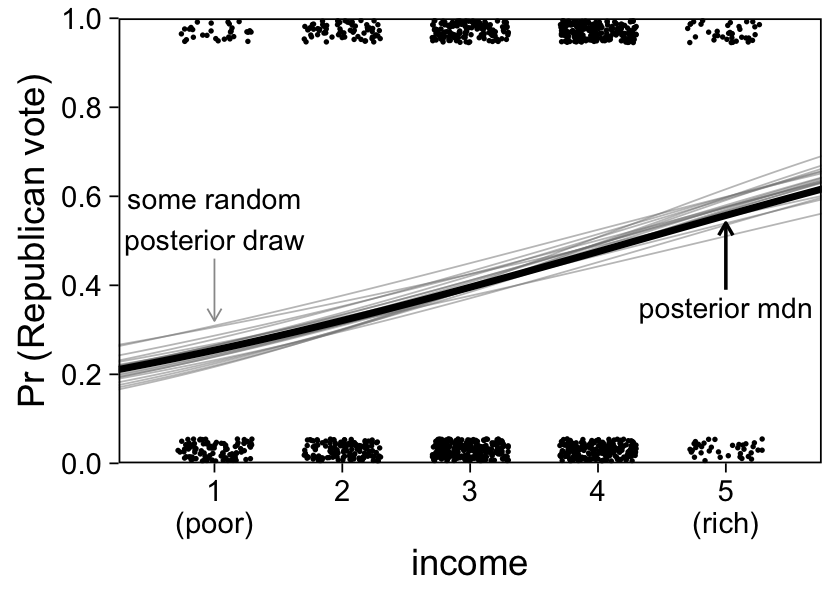
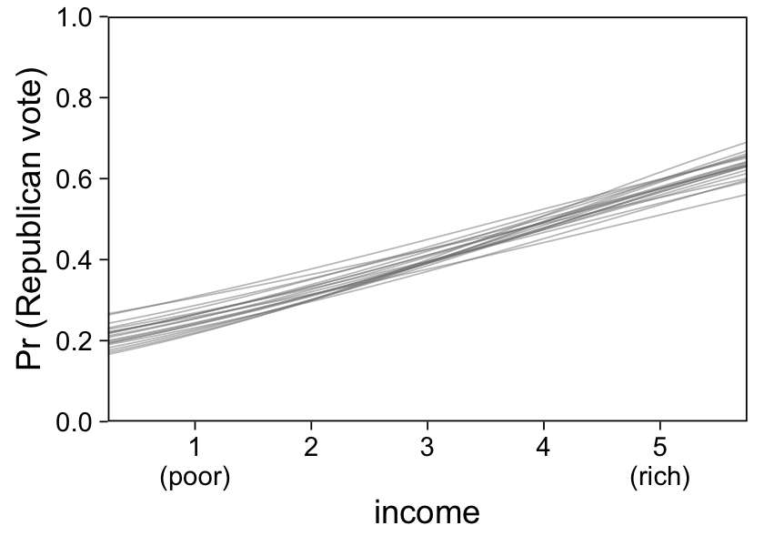
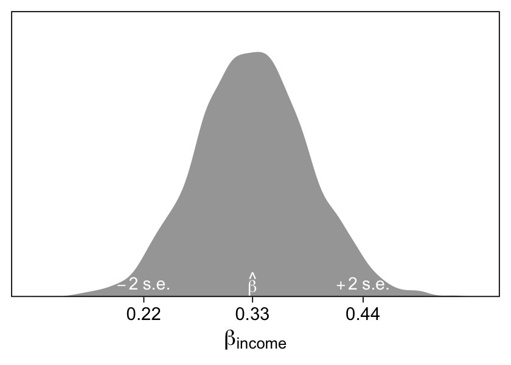
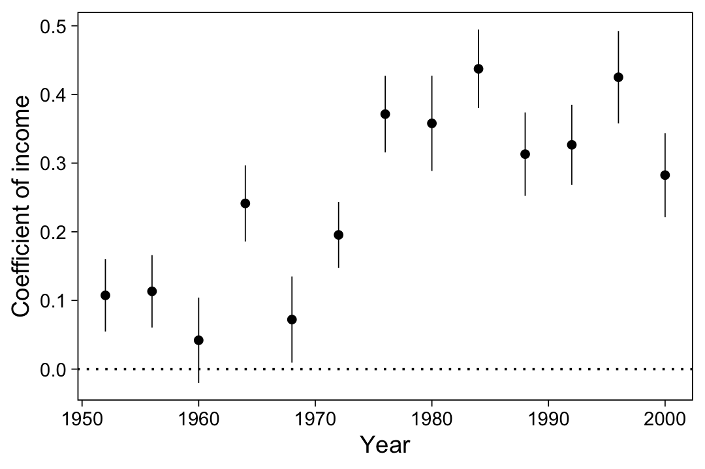
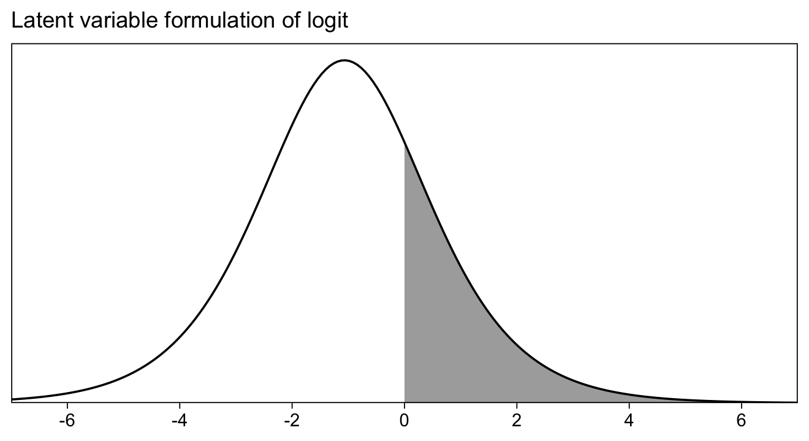
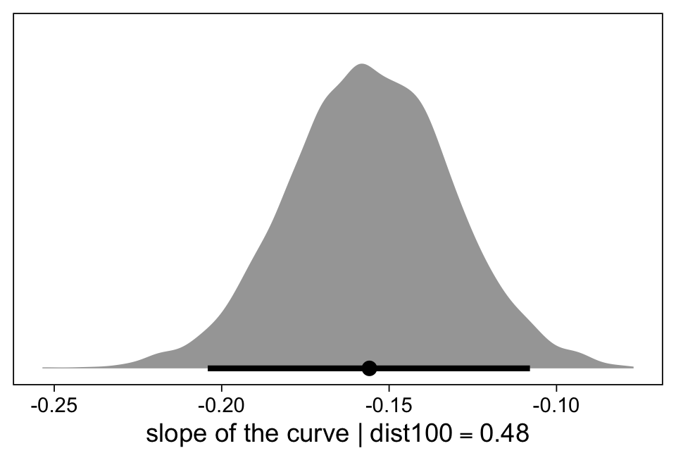
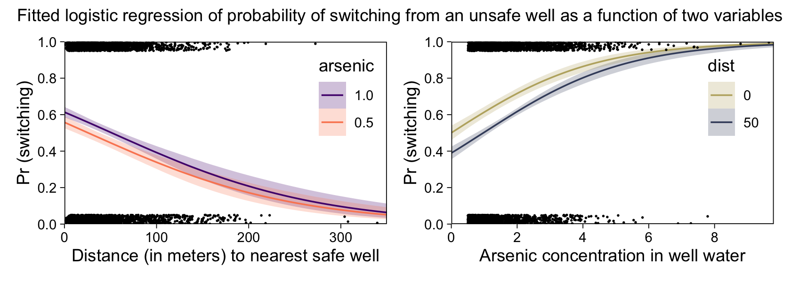

Chapter 13: Logistic regression
================
A Solomon Kurz
2023-04-16

# Logistic regression

> Linear regression is an additive model, which does not work for binary
> outcomes–that is, data y that take on the values 0 or 1. To model
> binary data, we need to add two features to the base model
> $y = a + bx$: a nonlinear transformation that bounds the output
> between 0 and 1 (unlike $a + bx$, which is unbounded), and a model
> that treats the resulting numbers as probabilities and maps them into
> random binary outcomes. This chapter and the next describe one such
> model–logistic regression. (p. 217)

## 13.1 Logistic regression with a single predictor

On page 217, we read:

> The *logistic* function,
>
> $$\operatorname{logit}(x) = \log \left (\frac{x}{1 - x} \right),$$
>
> maps the range $(0, 1)$ to $(-\infty, \infty)$ and is useful for
> modeling probabilities. Its inverse function, graphed in Figure 13.1a,
> maps back to the unit range:
>
> $$\operatorname{logit}^{-1}(x) = \log \left (\frac{e^x}{1 + e^x} \right).$$

Base **R** already includes these functions, named as `qlogis()` and
`plogis()`. Since the names aren’t the most intuitive, we might follow
the authors’ lead and duplicate those functions, but with more
straightforward names:

``` r
logit <- qlogis 
invlogit <- plogis
```

Now use our newly-named `invlogit()` function to make Figure 13.1.

``` r
library(tidyverse)
library(patchwork)

# set the global plotting theme
theme_set(theme_linedraw() +
            theme(panel.grid = element_blank()))

# left
p1 <-
  tibble(x = seq(from = -6.5, to = 6.5, length.out = 100)) %>% 
  mutate(invlogit = invlogit(x)) %>% 
  
  ggplot(aes(x = x, y = invlogit)) +
  geom_line() +
  geom_segment(x = -0.2, xend = 0.6,
               y = .4, yend = .6,
               arrow = arrow(length = unit(0.15, "cm")),
               color = "grey50", size = 1/4) +
  annotate(geom = "text",
           x = 0.3, y = 0.5, label = "slope = 1/4", 
           hjust = 0, size = 4, color = "grey50") +
  scale_x_continuous(breaks = -3:3 * 2, expand = c(0, 0)) +
  scale_y_continuous(expression(logit^-1*(x)), breaks = 0:5 / 5, 
                     expand = c(0, 0), limits = 0:1) +
  labs(subtitle = expression(y==logit^-1*(x)))

# right
p2 <-
  tibble(x = seq(from = -15, to = 23, length.out = 100)) %>% 
  mutate(invlogit = invlogit(-1.40 + 0.33 * x)) %>% 
  
  ggplot(aes(x = x, y = invlogit)) +
  geom_line() +
  geom_segment(x = 3.04040404 + 0.6, xend = 5.34343434 + 0.6,
               y = 0.402113472, yend = 0.589847100,
               arrow = arrow(length = unit(0.15, "cm")),
               color = "grey50", size = 1/4) +
  annotate(geom = "text",
           x = 5.1, y = 0.5, label = "slope = 0.33/4", 
           hjust = 0, size = 4, color = "grey50") +
  scale_x_continuous(breaks = -1:2 * 10, expand = c(0, 0)) +
  scale_y_continuous(expression(logit^-1*(-1.40+0.33*x)), breaks = 0:5 / 5, 
                     expand = c(0, 0), limits = 0:1) +
  labs(subtitle = expression(y==logit^-1*(-1.40+0.33*x)))

# combine
(p1 + p2) &
  theme(axis.ticks.x = element_blank(),
        plot.subtitle = element_text(hjust = .5))
```


### 13.1.1 Example: modeling political preference given income.

Load the `nes.txt` data.

``` r
nes <- read.table("ROS-Examples-master/NES/data/nes.txt", header = T)

head(nes)
```

    ##     year resid weight1 weight2 weight3 age gender race educ1 urban region
    ## 536 1952     1       1       1       1  25      2    1     2     2      1
    ## 537 1952     2       1       1       1  33      2    1     1     2      1
    ## 538 1952     3       1       1       1  26      2    1     2     2      1
    ## 539 1952     4       1       1       1  63      1    1     2     2      1
    ## 540 1952     5       1       1       1  66      2    1     2     2      2
    ## 541 1952     6       1       1       1  48      2    1     2     2      2
    ##     income occup1 union religion educ2 educ3 martial_status occup2 icpsr_cty
    ## 536      4      2     1        1     3     3              1      2        NA
    ## 537      4      6     1        1     1     1              1      6        NA
    ## 538      3      6     2        2     3     3              1      6        NA
    ## 539      3      3     1        1     2     2              1      3        NA
    ## 540      1      6     2        1     4     4              1      6        NA
    ## 541      4      6     1        1     2     2              1      6        NA
    ##     fips_cty partyid7 partyid3 partyid3_b str_partyid father_party mother_party
    ## 536       NA        6        3          3           3            3            3
    ## 537       NA        5        3          3           2            2            2
    ## 538       NA        4        2          2           1            1            1
    ## 539       NA        7        3          3           4            1           NA
    ## 540       NA        7        3          3           4            1            1
    ## 541       NA        3        1          1           2            1            1
    ##     dlikes rlikes dem_therm rep_therm regis vote regisvote presvote
    ## 536      0      1        NA        NA     2    2         3        2
    ## 537     -1      3        NA        NA     2    2         3        1
    ## 538      0      5        NA        NA     2    2         3        2
    ## 539     -1      3        NA        NA     1    2         3        2
    ## 540     -2      0        NA        NA     2    2         3        2
    ## 541      0      4        NA        NA     2    2         3        2
    ##     presvote_2party presvote_intent ideo_feel ideo7 ideo cd state inter_pre
    ## 536               2               2        NA    NA   NA NA    13        50
    ## 537               1               2        NA    NA   NA NA    13        50
    ## 538               2               2        NA    NA   NA NA    13        50
    ## 539               2               2        NA    NA   NA NA    13        50
    ## 540               2               2        NA    NA   NA NA    24        49
    ## 541               2               2        NA    NA   NA NA    24        49
    ##     inter_post black female age_sq rep_presvote rep_pres_intent south real_ideo
    ## 536         NA     0      1    625            1               1     0        NA
    ## 537         NA     0      1   1089            0               1     0        NA
    ## 538         NA     0      1    676            1               1     0        NA
    ## 539         NA     0      0   3969            1               1     0        NA
    ## 540         NA     0      1   4356            1               1     0        NA
    ## 541         NA     0      1   2304            1               1     0        NA
    ##     presapprov perfin1 perfin2 perfin presadm age_10 age_sq_10 newfathe newmoth
    ## 536         NA      NA      NA     NA      -1    2.5  6.250000        1       1
    ## 537         NA      NA      NA     NA      -1    3.3 10.889999        0       0
    ## 538         NA      NA      NA     NA      -1    2.6  6.759999       -1      -1
    ## 539         NA      NA      NA     NA      -1    6.3 39.690002       -1      NA
    ## 540         NA      NA      NA     NA      -1    6.6 43.559998       -1      -1
    ## 541         NA      NA      NA     NA      -1    4.8 23.040001       -1      -1
    ##     parent_party white year_new income_new   age_new vote.1 age_discrete
    ## 536            2     1        1          1 -2.052455      1            1
    ## 537            0     1        1          1 -1.252455      1            2
    ## 538           -2     1        1          0 -1.952455      1            1
    ## 539           NA     1        1          0  1.747545      1            3
    ## 540           -2     1        1         -2  2.047545      1            4
    ## 541           -2     1        1          1  0.247545      1            3
    ##     race_adj dvote rvote
    ## 536        1     0     1
    ## 537        1     1     0
    ## 538        1     0     1
    ## 539        1     0     1
    ## 540        1     0     1
    ## 541        1     0     1

Note how the `nes` data contains values from multiple years (the `year`
column). Since we only want to use data form 1991, we’ll make a subset
called `nes92`.

``` r
nes92 <-
  nes %>% 
  filter(year == 1992) %>% 
  drop_na(rvote, dvote) %>% 
  filter(rvote == 1 | dvote == 1)

# what are the #rows and #columns of the new subset?
dim(nes92)
```

    ## [1] 1179   70

Note how, with the `drop_na()` line, we excluded cases with missing data
on either `rvote` or `dvote` columns. What may not be clear is that some
cases neither selected a republican nor a democrat. With the second
`filer()` line, we excluded those cases. Now the data are cleaned, we
can fit a model.

Much like with **rstanarm**, fitting this model with **brms** requires
we specify `family = binomial`. We could have also explicitly specified
the logit link, as Gelman et al did with their `link="logit"` code, in
the text. But since **brms** defaults to the logit link when
`family = binomial`, there was no need. The other important thing to
notice is the left hand side of the `formula` argument,
`rvote | trials(1)`. **brms** allows users to specify supplementary
information about the criterion variable using the `y | fun(<variable>)`
syntax, where `y` is the criterion, `fun()` is a generic stand-in for
some function, and `<variable>` is a generic stand-in for either a
variable in the data set or a value manually set by the user. In the
case of logistic regression, we use the `trials()` function, which tells
**brms** how many trials each value in the criterion `rvote` is out of.
In the case of our data, that value is always one. In that case, you can
simply manually add in a `1` within the `trials()` argument.

``` r
library(brms)

m13.1 <-
  brm(data = nes92,
      family = binomial,
      rvote | trials(1) ~ income,
      seed = 13,
      file = "fits/m13.01")
```

Check the summary.

``` r
print(m13.1, robust = T)
```

    ##  Family: binomial 
    ##   Links: mu = logit 
    ## Formula: rvote | trials(1) ~ income 
    ##    Data: nes92 (Number of observations: 1179) 
    ##   Draws: 4 chains, each with iter = 2000; warmup = 1000; thin = 1;
    ##          total post-warmup draws = 4000
    ## 
    ## Population-Level Effects: 
    ##           Estimate Est.Error l-95% CI u-95% CI Rhat Bulk_ESS Tail_ESS
    ## Intercept    -1.40      0.20    -1.79    -1.03 1.00     2368     2288
    ## income        0.33      0.06     0.22     0.44 1.00     2270     2300
    ## 
    ## Draws were sampled using sampling(NUTS). For each parameter, Bulk_ESS
    ## and Tail_ESS are effective sample size measures, and Rhat is the potential
    ## scale reduction factor on split chains (at convergence, Rhat = 1).

We can get a quick plot of the model with `conditional_effects()`.

``` r
conditional_effects(m13.1)
```


To customize the plot to look more like the one in Figure 13.2a, I
prefer the `posterior_epred()` method.

``` r
library(tidybayes)

# define the new data
nd <- 
  tibble(income = seq(from = -2, to = 8, length.out = 100),
         row    = 1:100)

# extract the posterior expectations
posterior_epred(m13.1, newdata = nd) %>% 
  data.frame() %>% 
  pivot_longer(everything()) %>% 
  mutate(row = str_remove(name, "X") %>% as.double()) %>% 
  left_join(nd, by = "row") %>% 
  group_by(income) %>% 
  median_qi(value) %>% 
  
  # plot!
  ggplot(aes(x = income)) +
  geom_ribbon(aes(ymin = .lower, max = .upper),
              fill = "grey75") +
  geom_line(aes(y = value, size = income >= 1 & income <= 5)) +
  geom_jitter(data = mutate(nes92, rvote = if_else(rvote == 0, 0.03, 0.97)),
              aes(y = rvote),
              size = 1/10, width = .3, height = .025) +
  # just for fun, we'll annotate
  annotate(geom = "text",
           x = c(0, 6), y = .4, 
           label = c("95% interval", "posterior mdn"),
           size = 3) +
  annotate(geom = "segment",
           x = c(0, 6), xend = c(0.2, 5.7),
           y = c(.36, .44), yend = c(.28, .6),
           arrow = arrow(length = unit(0.15, "cm"))) +
  scale_size_manual("data range?", values = c(1/4, 1.5), labels = c("no", "yes")) +
  scale_fill_grey(start = 0.9, end = 0.6) +
  scale_x_continuous(breaks = 1:5, labels = c("1\n(poor)", "2", "3", "4", "5\n(rich)"),
                     expand = c(0, 0)) +
  scale_y_continuous("Pr (Republican vote)", breaks = 0:5 / 5,
                     expand = c(0, 0), limits = 0:1)
```


We’ll make the right panel of the figure a couple sections down.

### 13.1.2 The logistic regression model.

> We would run into problems if we tried to fit a linear regression
> model, $X \beta + \text{error}$, to data $y$ that take on the values 0
> and 1. The coefficients in such a model could be interpreted as
> differences in probabilities, but we could have difficulties using the
> model for prediction–it would be possible to have predicted
> probabilities below 0 or above 1–and information would be lost by
> modeling discrete outcomes as if they were continuous. (p. 219)

If we ignore priors, one way to express the model we just fit is

$$
\begin{align*}
\text{rvote}_i & \sim \operatorname{Binomial}(n = 1, p_i) \\
\operatorname{logit}(p_i) & = a + b\ \text{income}_i,
\end{align*}
$$

where the first line indicates we’re modeling the criterion variable
with the binomial likelihood (typical with logistic regression). The
binomial likelihood has two arguments, $n$, which tells us how many
trials each case is our of, and $p$, which is the probability of a 1
within a given trial. When the criterion variable is a series of 0’s and
1’s, $n$ is fixed to 1. If we take our focus from the binomial
likelihood function, we might express the model as

$$\Pr(\text{rvote}_i = 1) = \operatorname{logit}^{-1}(a + b\ \text{income}_i),$$

which Gelman et al more generically expressed as
$\Pr(y_i = 1) = \operatorname{logit}^{-1}(X_i \beta)$. Since
$\Pr(y_i = 1) = p_i$, we can also write the generic model as

$$\operatorname{logit}(p_i) = X_i \beta,$$

which brings us back full circle to how we expressed our statistical
model from above.

Now use our `logit()` function to convert two values out of the
probability metric.

``` r
logit(c(.5, .6))
```

    ## [1] 0.0000000 0.4054651

Here are two more.

``` r
logit(c(.9, .93))
```

    ## [1] 2.197225 2.586689

“In general, any particular change on the logit scale is compressed at
the ends of the probability scale, which is needed to keep probabilities
bounded between 0 and 1” (p. 219).

### 13.1.3 Fitting the model using ~~stan_glm~~ `brms::brm()`and displaying uncertainty in the fitted model.

To make Figure 20.3b, we’ll make use of the `ndraws` argument within
`posterior_epred()`. By setting `ndraws = 20`, we’ll follow Gelman and
colleges (p. 219), who took 20 random draws from the posterior.

``` r
set.seed(13)

posterior_epred(m13.1, 
                newdata = nd,
                ndraws = 20) %>% 
  data.frame() %>% 
  mutate(iter = 1:n()) %>% 
  
  pivot_longer(-iter) %>% 
  mutate(row = str_remove(name, "X") %>% as.double()) %>% 
  left_join(nd, by = "row") %>% 
  
  ggplot(aes(x = income)) +
  geom_line(aes(y = value, group = iter),
            size = 1/4, color = "grey50", alpha = 1/2) +
  stat_function(fun = ~ invlogit(fixef(m13.1, robust = T)[1, 1] + fixef(m13.1, robust = T)[2, 1] * .x),
                size = 1) +
  geom_jitter(data = mutate(nes92, rvote = if_else(rvote == 0, 0.03, 0.97)),
              aes(y = rvote),
              size = 1/10, width = .3, height = .025) +
  # just for fun, we'll annotate
  annotate(geom = "text",
           x = c(1, 5), y = c(.55, .35), 
           label = c("some random\nposterior draw", "posterior mdn"),
           size = 3) +
  annotate(geom = "segment",
           x = c(1, 5), xend = c(1, 5),
           y = c(.46, .39), yend = c(.32, .54),
           color = c("grey60", "black"), size = c(1/4, 1/2),
           arrow = arrow(length = unit(0.15, "cm"))) +
  scale_size_manual("data range?", values = c(1/4, 1.5), labels = c("no", "yes")) +
  scale_fill_grey(start = 0.9, end = 0.6) +
  scale_x_continuous(breaks = 1:5, labels = c("1\n(poor)", "2", "3", "4", "5\n(rich)")) +
  scale_y_continuous("Pr (Republican vote)", breaks = 0:5 / 5,
                     expand = c(0, 0), limits = 0:1) +
  coord_cartesian(xlim = c(0.5, 5.5))
```



Alternatively, we might just take the first posterior draws from
`as_draws_df()` and wrangle a bit.

``` r
set.seed(13)

as_draws_df(m13.1) %>% 
  slice_sample(n = 20) %>% 
  expand_grid(income = seq(from = -2, to = 8, length.out = 100)) %>% 
  
  ggplot(aes(x = income)) +
  geom_line(aes(y = invlogit(b_Intercept + b_income * income), group = .draw),
            size = 1/4, color = "grey50", alpha = 1/2) +
  scale_x_continuous(breaks = 1:5, labels = c("1\n(poor)", "2", "3", "4", "5\n(rich)")) +
  scale_y_continuous("Pr (Republican vote)", breaks = 0:5 / 5,
                     expand = c(0, 0), limits = 0:1) +
  coord_cartesian(xlim = c(0.5, 5.5))
```



## 13.2 Interpreting logistic regression coefficients and the divide-by-4 rule

“Coefficients in logistic regression can be challenging to interpret
because of the nonlinearity just noted” (p. 220).

### 13.2.1 Evaluation at and near the mean of the data.

Here’s the model-implied probability of supporting candidate Bush, given
you’re in the largest `income` bracket (`income == 5`), computed with
the equation

$$\operatorname{logit}^{-1}(a + b \times 5).$$

``` r
invlogit(fixef(m13.1, robust = T)[1, 1] + fixef(m13.1, robust = T)[2, 1] * 5)
```

    ## [1] 0.5570165

Here’s the same, given you’re at the observed mean of the `income`
distribution,

$$\operatorname{logit}^{-1}(a + b \times \overline{\text{income}}_i).$$

``` r
invlogit(fixef(m13.1, robust = T)[1, 1] + fixef(m13.1, robust = T)[2, 1] * mean(nes92$income))
```

    ## [1] 0.4016432

Here’s the point estimate for the difference in probability for those
for whom `income == 3` compared to those for whom `income == 2`.

``` r
invlogit(fixef(m13.1, robust = T)[1, 1] + fixef(m13.1, robust = T)[2, 1] * 3) - invlogit(fixef(m13.1, robust = T)[1, 1] + fixef(m13.1, robust = T)[2, 1] * 2)
```

    ## [1] 0.07478807

### 13.2.2 The divide-by-4 rule.

> The logistic curve is steepest at its center, at which point
> $\alpha + \beta x = 0$ so that
> $\operatorname{logit}^{-1}(\alpha + \beta x) = 0.5$; see Figure 13.1.
> The slope of the curve–the derivative of the logistic function–is
> maximized at this point and attains the value
> $\beta e^0 / (1 + e^0)^2 = \beta / 4$. Thus, $\beta / 4$ is the
> maximum difference in $\Pr(y = 1)$ corresponding to a unit difference
> in $x$.
>
> As a rule of convenience, we can take logistic regression coefficients
> (other than the constant term) and divide them by 4 to get an upper
> bound of the predictive difference corresponding to a unit difference
> in $x$. This upper bound is a reasonable approximation near the
> midpoint of the logistic curve, where probabilities are close to 0.5.
> (p. 220)

Here’s what the divide-by-4 rule implies for our $\beta_\text{income}$
coefficient from our model `m13.1`.

``` r
fixef(m13.1, robust = T)[2, 1] / 4
```

    ## [1] 0.08153827

Thus, “a difference of 1 in income category corresponds to no more than
an 8% positive difference in the probability of supporting Bush”
(p. 220).

### 13.2.3 Interpretation of coefficients as odds ratios.

> Another way to interpret logistic regression coefficients is in terms
> of *odds ratios*. If two outcomes have the probabilities $(p, 1 - p)$,
> then $\frac{p}{1 - p}$ is called the *odds*… Dividing two odds,
> $\frac{p_1}{1 - p_1} / \frac{p_2}{1 - p_2}$, gives an odds ratio.
> (pp. 220–221, *emphasis* in the original)

To give a sense, here’s a plot of odds values corresponding to
probabilities in the range $[.01, .99]$.

``` r
tibble(p = seq(from = 0.01, to = .99, by = .01)) %>% 
  mutate(odds = p / (1 - p)) %>% 
  
  ggplot(aes(x = p, y = odds)) +
  geom_line() +
  xlab(expression(italic(p)))
```


Here’s the odds ratio for when you have two probabilities, one of .33
and other of .5.

``` r
p1 <- .33
p2 <- .5

odds <- function(p) {
  p / (1 - p)
}

odds(p1) / odds(p2)
```

    ## [1] 0.4925373

``` r
odds(p2) / odds(p1)
```

    ## [1] 2.030303

You’ll note how the odds ratio depends on which variable is in the
numerator. Here are the odds ratios when your two probabilities are .5
and .67.

``` r
p1 <- .5
p2 <- .67

odds(p1) / odds(p2)
```

    ## [1] 0.4925373

``` r
odds(p2) / odds(p1)
```

    ## [1] 2.030303

“Exponentiated logistic regression coefficients can be interpreted as
odds ratios” (p. 221). Here’s what means if $\beta = 0.2$.

``` r
exp(0.2)
```

    ## [1] 1.221403

“We find that the concept of odds can be somewhat difficult to
understand, and odds ratios are even more obscure. Therefore we prefer
to interpret coefficients on the original scale of the data when
possible” (p. 221). I agree. Probabilities are the way to go.

### 13.2.4 Coefficient estimates and standard errors.

Figure 13.3 is a throwback to the first plot from Chapter 4.

``` r
labels <- c("-2~s.e.", "hat(beta)", "2~s.e.")

tibble(x = seq(from = -5, to = 5, by = .01)) %>% 
  mutate(d = dnorm(x, mean = 0, sd = 1)) %>% 
  
  ggplot(aes(x = x, y = d)) +
  geom_area(data = . %>% filter(x >= -1 & x <= 1),
            fill = "grey90") +
  geom_line() +
  annotate(geom = "text",
           x = 0, y = .2,
           label = "''%<-%hat(beta)%+-%1~s.e.%->%''",
           parse = T) +
  scale_x_continuous(NULL, breaks = c(-2, 0, 2),
                     labels = function(x) parse(text = labels)) +
  scale_y_continuous(NULL, breaks = NULL, expand = expansion(mult = c(0, 0.05))) +
  labs(subtitle = "Distribution representing uncertainty in an estimated regression coefficient")
```


Here’s what that looks like for our $\beta_\text{income}$ posterior.

``` r
# x-axis breaks and annotation
breaks <-
  tibble(breaks = fixef(m13.1)[2, c(3, 1, 4)]) %>% 
  mutate(labels = round(breaks, digits = 2),
         text   = c("-2~s.e.", "hat(beta)", "+2~s.e."))

# plot!
as_draws_df(m13.1) %>% 
  ggplot() +
  stat_slab(aes(x = b_income)) +
  geom_text(data = breaks,
            aes(x = breaks, label = text),
            y = 0.05, parse = T, color = "white", size = 3) +
  scale_x_continuous(expression(beta[income]), 
                     breaks = pull(breaks, breaks),
                     labels = pull(breaks, labels)) +
  scale_y_continuous(NULL, breaks = NULL,
                     expand = expansion(mult = c(0, 0.05)))
```



Here’s that standard error, as operationalized as the posterior standard
deviation.

``` r
fixef(m13.1)[2, 2]
```

    ## [1] 0.05832091

### 13.2.5 Statistical significance.

> As with linear regression, an estimate is conventionally labeled as
> statistically significant if it is at least 2 standard errors away
> from zero or, more formally, if its 95% confidence interval excludes
> zero.
>
> For reasons discussed in earlier chapters, we do *not* recommend using
> statistical significance to make decisions in logistic regression
> about whether to include predictors or whether to interpret effects as
> real. (pp. 221–222, *emphasis* in the original)

### 13.2.6 Displaying the results of several logistic regressions.

We can refit our `m13.1` for multiple election years by using the
`purrr::map()` method and `brms::update()`.

``` r
fits <-
  nes %>% 
  filter(year %in% seq(from = 1952, to = 2000, by = 4)) %>% 
  drop_na(rvote, dvote) %>% 
  filter(rvote == 1 | dvote == 1) %>% 
  select(year, rvote, dvote, income) %>% 
  nest(data = c(rvote, dvote, income)) %>% 
  mutate(f = map(data, ~update(m13.1, newdata = ., seed = 13, cores = 4) %>% 
                   fixef() %>% 
                   data.frame() %>% 
                   rownames_to_column("parameter")))
```

Now make the coefficient plot of Figure 13.4.

``` r
fits %>% 
  select(-data) %>% 
  unnest(f) %>% 
  filter(parameter == "income") %>% 
  
  ggplot(aes(x = year, y = Estimate, ymin = Estimate - Est.Error, ymax = Estimate + Est.Error)) +
  geom_hline(yintercept = 0, linetype = 3) +
  geom_pointrange(linewidth = 1/4, fatten = 3/2) +
  labs(x = "Year",
       y = "Coefficient of income")
```



## 13.3 Predictions and comparisons

As with conventional regression we can use

- `predict()` for point predictions for the expected value of a new
  observation,
- `posterior_linpred()` posterior simulations representing uncertainty
  about the linear predictor $X^\text{new} \beta$,
- `posterior_epred()` for the predicted probability
  $\operatorname{logit}^{-1}(X^\text{new} \beta)$, and
- `posterior_predict()` for the random binary outcome $y^\text{new}$.

### 13.3.1 Point prediction using `predict`.

Here we use the `predict()` function to predict the expected vote
preference of someone for whom `income = 5`.

``` r
new <- tibble(income = 5)

set.seed(13)

predict(m13.1, 
        newdata = new)
```

    ##      Estimate Est.Error Q2.5 Q97.5
    ## [1,]  0.55525 0.4970002    0     1

That’s about 56% chance preference for Bush. Be warned that unlike with
`rstanarm::predict()`, `brms::predict()` does **not** have a `type`
argument. Thus, the results are always on the same scale as the
variable, not the linear model. If you want that point estimate in the
log-odds scale, you’ll have to transform using `logit()`.

``` r
set.seed(13)

predict(m13.1, 
        newdata = new)[1] %>% 
  # transform the probability to the log-odds scale
  logit()
```

    ## [1] 0.2219061

Note that the default for `predict()` is `summary = TRUE`. If you
instead set `summary = FALSE`, you’ll get a vector of `1`’s and `0`’s
with as many rows as there are posterior draws (4,000 by default).

``` r
set.seed(13)

predict(m13.1, 
        newdata = new,
        summary = FALSE) %>% 
  str()
```

    ##  int [1:4000, 1] 0 1 1 1 0 1 1 1 1 0 ...
    ##  - attr(*, "dimnames")=List of 2
    ##   ..$ : NULL
    ##   ..$ : NULL

This is why the 95% range is 0 and 1 for `predict()` with
logistic-regression models. Those are the only two values possible for
quantiles.

### 13.3.2 Linear predictor with uncertainty using `posterior_linpred`.

Here’s what happens when we use `posterior_linpred()`.

``` r
linpred <- posterior_linpred(m13.1, newdata = new)
str(linpred)
```

    ##  num [1:4000, 1] 0.3019 0.307 0.2706 0.3889 0.0979 ...

We returned a vector of posterior draws for $a + b \times 5$. Here’s a a
plot of the results.

``` r
tibble(linpred = linpred) %>% 
  ggplot(aes(x = linpred, y = 0)) +
  stat_halfeye(.width = .95) +
  scale_y_continuous(NULL, breaks = NULL) +
  labs(title = "This is on the log-odds scale",
       x = expression(italic(a)+italic(b)%*%5))
```


### 13.3.3 Expected outcome with uncertainty using `posterior_epred`.

Now see what we get with `posterior_epred()`.

``` r
epred <- posterior_epred(m13.1, newdata = new)
str(epred)
```

    ##  num [1:4000, 1] 0.575 0.576 0.567 0.596 0.524 ...

Now we have a vector of probabilities,
$\Pr(y^\text{new} | x^\text{new})$. Here’s what that looks like in a
plot.

``` r
tibble(epred = epred) %>% 
  ggplot(aes(x = epred, y = 0)) +
  stat_halfeye(.width = .95) +
  scale_y_continuous(NULL, breaks = NULL) +
  labs(title = "This is on the probability scale",
       x = expression(Pr(italic(y)^new*'|'*italic(x)^new)))
```


Here are the mean and standard deviation values for `epred`.

``` r
tibble(epred = epred) %>% 
  summarise(mean = mean(epred),
            sd = sd(epred))
```

    ## # A tibble: 1 × 2
    ##    mean     sd
    ##   <dbl>  <dbl>
    ## 1 0.557 0.0302

Also note `posterior_linpred()` and `posterior_epred()` can be converted
to one another using the `logit()` and `invlogit()` functions. Check it
out.

``` r
tibble(linpred = linpred,
       epred   = epred) %>% 
  mutate(`invlogit(linpred)` = invlogit(linpred),
         `logit(epred)`      = logit(epred))
```

    ## # A tibble: 4,000 × 4
    ##    linpred[,1] epred[,1] `invlogit(linpred)`[,1] `logit(epred)`[,1]
    ##          <dbl>     <dbl>                   <dbl>              <dbl>
    ##  1     0.302       0.575                   0.575            0.302  
    ##  2     0.307       0.576                   0.576            0.307  
    ##  3     0.271       0.567                   0.567            0.271  
    ##  4     0.389       0.596                   0.596            0.389  
    ##  5     0.0979      0.524                   0.524            0.0979 
    ##  6     0.262       0.565                   0.565            0.262  
    ##  7    -0.124       0.469                   0.469           -0.124  
    ##  8    -0.00478     0.499                   0.499           -0.00478
    ##  9    -0.0784      0.480                   0.480           -0.0784 
    ## 10    -0.0908      0.477                   0.477           -0.0908 
    ## # … with 3,990 more rows

### 13.3.4 Predictive distribution for a new observation using `posterior_predict`.

Here’s what happens when we use `posterior_predict()`.

``` r
postpred <- posterior_predict(m13.1, newdata=new)

str(postpred)
```

    ##  int [1:4000, 1] 0 1 1 1 0 0 0 0 1 0 ...
    ##  - attr(*, "dimnames")=List of 2
    ##   ..$ : NULL
    ##   ..$ : NULL

We got a vector of 0’s and 1’s. Here they are in a bar chart.

``` r
tibble(postpred = postpred %>% as.factor()) %>%
  count(postpred) %>% 
  mutate(percent = str_c(round(100 * (n / sum(n)), digits = 3), "%")) %>% 
  
  ggplot(aes(x = postpred)) +
  geom_col(aes(y = n)) +
  geom_text(aes(y = n + 75, label = percent),
            size = 3) +
  scale_y_continuous("count", expand = expansion(mult = c(0, 0.05)))
```


Here’s the mean.

``` r
tibble(postpred = postpred) %>% 
  summarise(mean = mean(postpred))
```

    ## # A tibble: 1 × 1
    ##    mean
    ##   <dbl>
    ## 1 0.553

You could also say that’s
$\operatorname E (y^\text{new} | x^\text{new})$.

### 13.3.5 Prediction given a range of input values.

We can use all of the above methods over a range of $X^\text{new}$
values, too.

``` r
new <- tibble(income = 1:5)

set.seed(13)

pred     <- predict(m13.1, newdata = new) 
linpred  <- posterior_linpred(m13.1, newdata = new) 
epred    <- posterior_epred(m13.1, newdata = new) 
postpred <- posterior_predict(m13.1, newdata = new)
```

Here’s what we end up with.

``` r
str(pred)
```

    ##  num [1:5, 1:4] 0.261 0.324 0.403 0.464 0.549 ...
    ##  - attr(*, "dimnames")=List of 2
    ##   ..$ : NULL
    ##   ..$ : chr [1:4] "Estimate" "Est.Error" "Q2.5" "Q97.5"

``` r
str(linpred)
```

    ##  num [1:4000, 1:5] -1.08 -1.2 -1.12 -1.28 -1.02 ...

``` r
str(epred)
```

    ##  num [1:4000, 1:5] 0.254 0.232 0.246 0.217 0.265 ...

``` r
str(postpred)
```

    ##  int [1:4000, 1:5] 0 1 1 0 0 0 0 1 0 0 ...
    ##  - attr(*, "dimnames")=List of 2
    ##   ..$ : NULL
    ##   ..$ : NULL

Whereas `pred` contains one summary *row* for each $X^\text{new}$ value,
the other three objects contain one *column* of posterior draws for each
$X^\text{new}$ value.

We might use `epred` to see how many of our posterior draws support the
hypothesis
$\Pr (y^\text{new} | \text{income} = 5) > \Pr (y^\text{new} | \text{income} = 4)$.

``` r
epred %>% 
  data.frame() %>% 
  count(X5 > X4)
```

    ##   X5 > X4    n
    ## 1    TRUE 4000

Turns out this was always the case. That’d be the same as a probability
of 1.

``` r
epred %>% 
  data.frame() %>%
  summarise(p = mean(X5 > X4))
```

    ##   p
    ## 1 1

But we might want the median and 95% percentile summaries for the
difference between `epred[, 5]` and `epred[, 4]`.

``` r
epred %>% 
  data.frame() %>%
  median_qi(X5 - X4)
```

    ## # A tibble: 1 × 6
    ##   `X5 - X4` .lower .upper .width .point .interval
    ##       <dbl>  <dbl>  <dbl>  <dbl> <chr>  <chr>    
    ## 1    0.0812 0.0535  0.109   0.95 median qi

Here’s what that looks like as a full posterior distribution.

``` r
epred %>% 
  data.frame() %>% 
  mutate(difference = X5 - X4) %>% 
  
  ggplot(aes(x = difference, y = 0)) +
  stat_halfeye(.width = .95) +
  scale_y_continuous(NULL, breaks = NULL) +
  expand_limits(x = 0) +
  xlab(expression(Pr(italic(y)^new*'|'*income==5)-Pr(italic(y)^new*'|'*income==4)))
```


With `postpred`, we can see how many people would endorse Bush across
all levels of $X^\text{new}$, within a given iteration.

``` r
postpred %>% 
  data.frame() %>% 
  mutate(total = rowSums(.)) %>% 
  head()
```

    ##   X1 X2 X3 X4 X5 total
    ## 1  0  0  1  1  0     2
    ## 2  1  0  0  1  1     3
    ## 3  1  0  1  0  1     3
    ## 4  0  0  0  0  0     0
    ## 5  0  0  0  1  1     2
    ## 6  0  1  1  1  1     4

Here’s the model-implied probability at least three persons will endorse
Bush.

``` r
postpred %>% 
  data.frame() %>% 
  mutate(total = rowSums(.)) %>% 
  summarise(p_at_least_3 = mean(total >= 3))
```

    ##   p_at_least_3
    ## 1      0.30675

### 13.3.6 Logistic regression with just an intercept.

“Logistic regression with just an intercept is equivalent to the
estimate of a proportion” (p. 224). We’ll test that with some data.

``` r
simple <- tibble(y = rep(0:1, times = c(40, 10)))

glimpse(simple)
```

    ## Rows: 50
    ## Columns: 1
    ## $ y <int> 0, 0, 0, 0, 0, 0, 0, 0, 0, 0, 0, 0, 0, 0, 0, 0, 0, 0, 0, 0, 0, 0, 0,…

Fit the intercept-only model.

``` r
m13.2 <-
  brm(data = simple,
      family = binomial,
      y | trials(1) ~ 1,
      seed = 13,
      file = "fits/m13.02")
```

Check the summary.

``` r
print(m13.2, robust = T)
```

    ##  Family: binomial 
    ##   Links: mu = logit 
    ## Formula: y | trials(1) ~ 1 
    ##    Data: simple (Number of observations: 50) 
    ##   Draws: 4 chains, each with iter = 2000; warmup = 1000; thin = 1;
    ##          total post-warmup draws = 4000
    ## 
    ## Population-Level Effects: 
    ##           Estimate Est.Error l-95% CI u-95% CI Rhat Bulk_ESS Tail_ESS
    ## Intercept    -1.39      0.34    -2.12    -0.73 1.00     1440     1691
    ## 
    ## Draws were sampled using sampling(NUTS). For each parameter, Bulk_ESS
    ## and Tail_ESS are effective sample size measures, and Rhat is the potential
    ## scale reduction factor on split chains (at convergence, Rhat = 1).

Here we convert the intercept into the probability metric using
`invlogit()`.

``` r
fixef(m13.2, robust = T)[, -2] %>% invlogit()
```

    ##  Estimate      Q2.5     Q97.5 
    ## 0.2000473 0.1070167 0.3247655

That matches up with the sample statistic.

``` r
simple %>% 
  summarise(p = mean(y))
```

    ## # A tibble: 1 × 1
    ##       p
    ##   <dbl>
    ## 1   0.2

Here are the point estimates for
$\operatorname{logit}^{-1}(\hat \beta \pm \text{s.e.})$.

``` r
invlogit(fixef(m13.2, robust = T)[, 1] + fixef(m13.2, robust = T)[, 2])
```

    ## [1] 0.2604218

``` r
invlogit(fixef(m13.2, robust = T)[, 1] - fixef(m13.2, robust = T)[, 2])
```

    ## [1] 0.1508153

If we want to get the “standard error” in the probability metric, we’ll
have to work directly with the posterior draws.

``` r
as_draws_df(m13.2) %>% 
  mutate(p = invlogit(b_Intercept)) %>% 
  summarise(se = sd(p))
```

    ## # A tibble: 1 × 1
    ##       se
    ##    <dbl>
    ## 1 0.0561

Thus the posterior SD for $\hat p$ is very close to the expected
standard error using the conventional formula
$\sqrt{0.2 \times 0.8 / 50} = 0.05656854$.

``` r
sqrt(0.2 * (0.8 / 50))
```

    ## [1] 0.05656854

Here we compute the summary for the probability using the
`posterior_epred()` method.

``` r
new <- tibble(x = 0)

 data.frame(epred = posterior_epred(m13.2, newdata = new)) %>% 
  summarise(mean = mean(epred), 
            sd = sd(epred))
```

    ##        mean         sd
    ## 1 0.2048699 0.05612192

#### 13.3.6.1 Data on the boundary.

Now see what happens when the data are at the boundary, where the
criterion is always 0.

``` r
simple <- tibble(y = rep(0:1, times = c(50, 0)))

glimpse(simple)
```

    ## Rows: 50
    ## Columns: 1
    ## $ y <int> 0, 0, 0, 0, 0, 0, 0, 0, 0, 0, 0, 0, 0, 0, 0, 0, 0, 0, 0, 0, 0, 0, 0,…

Fit the model.

``` r
m13.3 <-
  brm(data = simple,
      family = binomial,
      y | trials(1) ~ 1,
      seed = 13,
      control = list(adapt_delta = .85),
      file = "fits/m13.03")
```

Check the summary.

``` r
print(m13.3, robust = T)
```

    ##  Family: binomial 
    ##   Links: mu = logit 
    ## Formula: y | trials(1) ~ 1 
    ##    Data: simple (Number of observations: 50) 
    ##   Draws: 4 chains, each with iter = 2000; warmup = 1000; thin = 1;
    ##          total post-warmup draws = 4000
    ## 
    ## Population-Level Effects: 
    ##           Estimate Est.Error l-95% CI u-95% CI Rhat Bulk_ESS Tail_ESS
    ## Intercept    -6.05      2.61   -24.18    -3.01 1.01      385      283
    ## 
    ## Draws were sampled using sampling(NUTS). For each parameter, Bulk_ESS
    ## and Tail_ESS are effective sample size measures, and Rhat is the potential
    ## scale reduction factor on split chains (at convergence, Rhat = 1).

I believe the reason our results differ a little from those in the text
is due to differences in the default priors. Here’s the **brms**
default.

``` r
m13.3$prior
```

    ## Intercept ~ student_t(3, 0, 2.5)

Here’s the 95% interval, on the probability scale.

``` r
fixef(m13.3, robust = T)[, -2] %>% invlogit() %>% round(digits = 3)
```

    ## Estimate     Q2.5    Q97.5 
    ##    0.002    0.000    0.047

We might compare that to the maximum likelihood formula

$$
\hat p \pm \sqrt{\hat p (1 - \hat p) / (n + 4)}, \;\;\; \text{where} \\
\hat p = (y + 2) / (n + 4).
$$

Here we do that by hand.

``` r
y <- 0
n <- 50

p_hat <- (y + 2) / (n + 4)

ll <- p_hat - sqrt(p_hat * (1 - p_hat) / (n + 4))
ul <- p_hat + sqrt(p_hat * (1 - p_hat) / (n + 4))

c(p_hat, ll, ul) %>% round(digits = 3)
```

    ## [1] 0.037 0.011 0.063

Even weak priors help reign the posterior in from the abyss.

### 13.3.7 Logistic regression with a single binary predictor.

“Logistic regression on an indicator variable is equivalent to a
comparison of proportions” (p. 225)

Define the new data.

``` r
simple <- 
  tibble(x = rep(0:1, times = c(50, 60)),
         y = rep(c(0:1, 0:1), times = c(40, 10, 40, 20)))
```

Here are the sample proportions, by `x`.

``` r
simple %>% 
  group_by(x) %>% 
  summarise(p = mean(y))
```

    ## # A tibble: 2 × 2
    ##       x     p
    ##   <int> <dbl>
    ## 1     0 0.2  
    ## 2     1 0.333

Fit the logistic regression model with the single binary predictor, `x`.

``` r
m13.4 <-
  brm(data = simple,
      family = binomial,
      y | trials(1) ~ 1 + x,
      seed = 13,
      file = "fits/m13.04")
```

Check the summary.

``` r
print(m13.4, robust = T)
```

    ##  Family: binomial 
    ##   Links: mu = logit 
    ## Formula: y | trials(1) ~ 1 + x 
    ##    Data: simple (Number of observations: 110) 
    ##   Draws: 4 chains, each with iter = 2000; warmup = 1000; thin = 1;
    ##          total post-warmup draws = 4000
    ## 
    ## Population-Level Effects: 
    ##           Estimate Est.Error l-95% CI u-95% CI Rhat Bulk_ESS Tail_ESS
    ## Intercept    -1.41      0.35    -2.16    -0.78 1.00     2511     2274
    ## x             0.72      0.46    -0.12     1.63 1.00     2892     2527
    ## 
    ## Draws were sampled using sampling(NUTS). For each parameter, Bulk_ESS
    ## and Tail_ESS are effective sample size measures, and Rhat is the potential
    ## scale reduction factor on split chains (at convergence, Rhat = 1).

We can’t use $\beta_1$ directly to compare the two proportions on the
probability scale. Rather, their contrast is

$$\operatorname{logit}^{-1}(\beta_0 + \beta_1) - \operatorname{logit}^{-1}(\beta_0).$$

Here is the `posterior_epred()` method to find the posterior mean and
standard deviation for the difference in probability between the two
levels of `x`.

``` r
new <- tibble(x = 0:1)

posterior_epred(m13.4, newdata = new) %>% 
  data.frame() %>% 
  set_names("p0", "p1") %>% 
  mutate(difference = p1 - p0) %>% 
  summarise(mean = mean(difference),
            sd = sd(difference))
```

    ##        mean         sd
    ## 1 0.1353204 0.08263431

Using the formulas from Chapter 4, where we see the classical estimate
for the standard error of a proportion is

$$\text{standard error of a proportion} = \sqrt{\hat p (1 - \hat p) / n},$$

and the classical estimate for the standard error for a difference in
proportions is

$$\text{standard error of the difference} = \sqrt{\text{se}_1^2 + \text{se}_2^2},$$

we can compute the classical estimate analogues to our posterior mean
and standard deviation values like so.

``` r
p_hat_0 <- 10 / (40 + 10)
p_hat_1 <- 20 / (40 + 20)

p_had_dif <- p_hat_1 - p_hat_0

se_0 <- sqrt(p_hat_0 * (1 - p_hat_0) / (40 + 10))
se_1 <- sqrt(p_hat_1 * (1 - p_hat_1) / (40 + 20))

sd_dif <- sqrt(se_0^2 + se_1^2)

c(p_had_dif, sd_dif)
```

    ## [1] 0.13333333 0.08308853

The classical estimates are very close to the summary values for our
Bayesian posterior.

## 13.4 Latent-data formulation

With latent-variable formulation,

> each discrete outcome $y_i$ is associated with a continuous,
> unobserved outcome $z_i$ , defined as follows:
>
> $$
> \begin{align*}
> y_i & = \left \{
>   \begin{array}{@{}ll@{}}
>     1 & \text{if}\ z_i > 0 \\
>     0 & \text{if}\ z_i < 0
>   \end{array} \right. \\
> z_i & = X_i \beta + \epsilon_i, 
> \end{align*}
> $$
>
> with independent errors $\epsilon_i$ that have the *logistic*
> probability distribution. The logistic distribution is shown in Figure
> 13.5 and is defined so that
>
> $$\Pr(\epsilon_i < x) = \operatorname{logit}^{-1} (x)\ \text{for all}\ x.$$
>
> Thus,
> $\Pr(y_i = 1) = \Pr(z_i > 0) = \Pr(\epsilon_i > -X_i \beta) = \operatorname{logit}^{-1}(X_i \beta)$.
> (p. 226, *emphasis* in the original)

We can plot the logistic density function of Figure 13.5 with aid from
the `dlogis()` function.

``` r
tibble(x = seq(from = -7, to = 7, length.out = 200)) %>% 
  mutate(d = dlogis(x, location = 0, scale = 1)) %>% 
  
  ggplot(aes(x = x, y = d)) +
  geom_line() +
  scale_x_continuous("logistic distribution", breaks = -3:3 * 2, expand = c(0, 0)) +
  scale_y_continuous(NULL, breaks = NULL, expand = expansion(mult = c(0, 0.05))) +
  labs(subtitle = "Logistic probability density function")
```


Now here’s our version of Figure 13.6, the probability density function
of the latent variable $z_i$ when the linear predictor, $X_i \beta$, is
equal to -1.07.

``` r
tibble(x = seq(from = -7, to = 7, length.out = 201)) %>% 
  mutate(d = dlogis(x, location = -1.07, scale = 1)) %>% 
  
  ggplot(aes(x = x, y = d)) +
  geom_ribbon(aes(ymin = 0, ymax = d, fill = x > 0)) +
  geom_line() +
  scale_fill_manual(values = c("white", "grey67"), breaks = NULL) +
  scale_x_continuous(NULL, breaks = -3:3 * 2, expand = c(0, 0)) +
  scale_y_continuous(NULL, breaks = NULL, expand = expansion(mult = c(0, 0.05))) +
  labs(subtitle = "Latent variable formulation of logit")
```



We can use our `invlogit()` function to compute the proportion of that
density that’s within the gray shaded region.

``` r
invlogit(-1.07)
```

    ## [1] 0.2554031

### 13.4.1 Interpretation of the latent variables.

“Latent variables are a computational trick but they can also be
interpreted substantively” (p. 226).

### 13.4.2 Nonidentifiability of the latent scale parameter.

Similar to the Gaussian, the logistic density function is parameterized
in terms of location ($\mu$) and scale ($s$). The latent-variable
logistic regression model

$$
z_i = X_i \beta + \epsilon_i, \; \epsilon_i \sim \operatorname{Logistic}(0, s = 1) 
$$

is very close to the conventional regression model

$$
z_i = X_i \beta + \epsilon_i, \; \epsilon_i \sim \operatorname{Normal}(0, 
\sigma = 1.6).
$$

It might be easiest to explore that in a plot.

``` r
tibble(x = seq(from = -7, to = 7, length.out = 200)) %>% 
  mutate(l = dlogis(x, location = 0, scale = 1),
         n = dnorm(x, mean = 0, sd = 1.6)) %>% 
  pivot_longer(l:n, values_to = "d") %>% 
  mutate(likelihood = if_else(name == "l", "Logistic", "Normal")) %>% 
  
  ggplot(aes(x = x, ymin = 0, ymax = d, fill = likelihood)) +
  geom_ribbon(alpha = 1/2) +
  scale_fill_viridis_d(option = "A", begin = .25, end = .75) +
  scale_x_continuous(NULL, breaks = -3:3 * 2, expand = c(0, 0)) +
  scale_y_continuous(NULL, breaks = NULL, expand = expansion(mult = c(0, 0.05))) +
  labs(subtitle = "Overlapping logistic and normal density functions") +
  theme(legend.position = c(.9, .8))
```


The logistic has slightly thicker tails. Unlike with conventional
regression, the latent-variable framework for binomial data will not
allow one to directly estimate $\sigma$ independently from $\beta$. The
model

> has an essential indeterminacy when fit to binary data, and it is
> standard to resolve this by setting the variance parameter $\sigma$ to
> a fixed value such as 1.6, chosen because the normal distribution with
> standard deviation 1.6 is close to the unit logistic distribution.
> (p. 228)

## 13.5 Maximum likelihood and Bayesian inference for logistic regression

### 13.5.1 Maximum likelihood using iteratively weighted least squares.

### 13.5.2 Bayesian inference with a uniform prior distribution.

> If the prior distribution on the parameters is uniform, then the
> posterior density is proportional to the likelihood function, and the
> posterior mode–the vector of coefficients $\beta$ that maximizes the
> posterior density–is the same as the maximum likelihood estimate.
> (p. 228)

### 13.5.3 Default prior in ~~stan_glm~~ `brms::brm()`

Similar to `rstanarm::stan_glm()`, the **brms** `brm()` function
defaults to weakly informative priors on the intercept. However, the
current default priors for the $\beta$ coefficients are flat. If there
is ever any question about the exact default priors used in a model, use
the `get_prior()` function. For example, here is the `get_prior()`
output for the last model we fit.

``` r
get_prior(
  data = simple,
  family = binomial,
  y | trials(1) ~ 1 + x
  )
```

    ##                 prior     class coef group resp dpar nlpar lb ub       source
    ##                (flat)         b                                       default
    ##                (flat)         b    x                             (vectorized)
    ##  student_t(3, 0, 2.5) Intercept                                       default

As expected, the prior for the `x` coefficient is flat. The intercept
was assigned $t(3, 0, 2.5)$.

### 13.5.4 Bayesian inference with some prior information.

“When prior information is available, it can be used to increase the
precision of estimates and predictions” (p. 229). Say you have a simple
univariable logistic model where you expect the $\beta$ parameter will
likely fall between 0 and 1. The $\operatorname N(0.5, 0.5)$ prior would
be a good candidate in that the bulk of the probability mass would
reside between 0 and 1, but it would still be possible the the
coefficient to exceed those bounds. Here’s what that might look like.

``` r
tibble(x = seq(from = -1, to = 2, by = 0.01)) %>% 
  mutate(d = dnorm(x, mean = 0.5, sd = 0.5)) %>% 
  
  ggplot(aes(x = x, y = d)) +
  geom_ribbon(aes(ymin = 0, ymax = d, fill = x > 0 & x < 1)) +
  geom_line() +
  annotate(geom = "text",
           x = 0.5, y = 0.35,
           label = "We think\nthe parameter will\nbe somewhere in here.",
           color = "white") +
  scale_fill_manual(values = c("white", "grey67"), breaks = NULL) +
  scale_x_continuous(NULL, expand = c(0, 0)) +
  scale_y_continuous(NULL, breaks = NULL, expand = expansion(mult = c(0, 0.05))) +
  labs(subtitle = expression(The~Normal(0.5*', '*0.5)~prior))
```


That gray zone contains about 68% of the probability mass. Verify that
with `pnorm()`.

``` r
pnorm(1, mean = 0.5, sd = 0.5) - pnorm(0, mean = 0.5, sd = 0.5)
```

    ## [1] 0.6826895

Here’s the probability mass this prior places between -0.5 and 1.5.

``` r
pnorm(1.5, mean = 0.5, sd = 0.5) - pnorm(-0.5, mean = 0.5, sd = 0.5)
```

    ## [1] 0.9544997

This is a soft constraint.

### 13.5.5 Comparing maximum likelihood and Bayesian inference using a simulation study.

To follow along with the text, we’ll make our own version of the
simulation code. Before doing so, it will help if we first fit a simple
logistic regression model following the format in the simulation. Make
the `fake` data.

``` r
# population values
a <- -2
b <- 0.8

# how many cases?
n <- 10

# simulate
set.seed(13)

fake <- tibble(x = runif(n, min = -1, max = 1)) %>% 
  mutate(z = rlogis(n, location = a + b * x, scale = 1)) %>% 
  mutate(y = ifelse(z > 0, 1, 0))

# what did we do?
print(fake)
```

    ## # A tibble: 10 × 3
    ##         x       z     y
    ##     <dbl>   <dbl> <dbl>
    ##  1  0.421 -0.995      0
    ##  2 -0.508 -0.429      0
    ##  3 -0.221 -0.0801     0
    ##  4 -0.817 -2.39       0
    ##  5  0.924 -0.882      0
    ##  6 -0.978 -3.34       0
    ##  7  0.149 -2.47       0
    ##  8  0.529 -1.21       0
    ##  9  0.747  0.459      1
    ## 10 -0.918 -1.98       0

Fit the model.

``` r
m13.5 <-
  brm(data = fake,
      family = binomial,
      y | trials(1) ~ 1 + x,
      prior = prior(normal(0.5, 0.5), class = b),
      seed = 13,
      file = "fits/m13.05")
```

Check the results.

``` r
print(m13.5, robust = T)
```

    ##  Family: binomial 
    ##   Links: mu = logit 
    ## Formula: y | trials(1) ~ 1 + x 
    ##    Data: fake (Number of observations: 10) 
    ##   Draws: 4 chains, each with iter = 2000; warmup = 1000; thin = 1;
    ##          total post-warmup draws = 4000
    ## 
    ## Population-Level Effects: 
    ##           Estimate Est.Error l-95% CI u-95% CI Rhat Bulk_ESS Tail_ESS
    ## Intercept    -2.12      0.94    -4.39    -0.48 1.00     2818     2172
    ## x             0.63      0.48    -0.30     1.52 1.00     3101     2426
    ## 
    ## Draws were sampled using sampling(NUTS). For each parameter, Bulk_ESS
    ## and Tail_ESS are effective sample size measures, and Rhat is the potential
    ## scale reduction factor on split chains (at convergence, Rhat = 1).

The whole reason for this step is so we can avoid re-compilation by way
of `brms::update()`. Now make our version of the `bayes_sim()` function.

``` r
bayes_sim <- function(n, a = -2, b = 0.8, seed = 1, digits = 2) {
  
  # simulate the data
  n <- n
  a <- a
  b <- b
  
  set.seed(seed)
  
  fake <-
    tibble(x = runif(n, min = -1, max = 1)) %>% 
    mutate(z = rlogis(n, location = a + b * x, scale = 1)) %>% 
    mutate(y = if_else(z > 0, 1, 0))
  
  # fit the frequentist glm
  glm_fit <-
    glm(data = fake, 
        family = binomial(link = "logit"), 
        y ~ x) 
  
  # fit the Bayesian model with `brms::update()`
  brm_fit <- 
    update(m13.5, 
           newdata = fake, 
           seed = 13, 
           refresh = 0, open_progress = F)
  
  # wrangle the result summary
  coefs <-
    bind_rows(
      # glm
      broom::tidy(glm_fit)[, 1:3] %>% 
        set_names("term", "est.", "s.e.") %>% 
        mutate(`function` = "glm") %>% 
        select(`function`, everything()),
      
      # brm
      fixef(brm_fit, robust = T)[, 1:2] %>% 
        data.frame() %>% 
        rownames_to_column() %>% 
        set_names("term", "est.", "s.e.") %>% 
        mutate(`function` = "brm") %>% 
        select(`function`, everything())
    ) %>% 
    mutate_if(is.double, round, digits = digits)
  
  # return the summary
  return(coefs)
  
}
```

As indicated in the text, this function will not run properly when
`n = 0`.

``` r
bayes_sim(n = 0)
```

Here’s an example of the results when `n = 10`.

``` r
bayes_sim(n = 10)
```

    ## # A tibble: 4 × 4
    ##   `function` term         est.  s.e.
    ##   <chr>      <chr>       <dbl> <dbl>
    ## 1 glm        (Intercept) -2.34  1.21
    ## 2 glm        x            0.72  1.9 
    ## 3 brm        Intercept   -2.15  0.96
    ## 4 brm        x            0.51  0.5

For simplicity, this output glosses over the distinctions between GLM
estimates and Bayesian posterior means and between GLM standard errors
and Bayesian mad sd’s. Anyway, our results are a little different from
those in the text due to simulation variance. Yet the general pattern
held: The Bayesian posteriors were more certain than those from maximum
likelihood. Here are the results when `n = 100`.

``` r
bayes_sim(n = 100,
          # we can adjust the `digits`
          digits = 1)
```

    ## # A tibble: 4 × 4
    ##   `function` term         est.  s.e.
    ##   <chr>      <chr>       <dbl> <dbl>
    ## 1 glm        (Intercept)  -2.3   0.4
    ## 2 glm        x             2.1   0.7
    ## 3 brm        Intercept    -2     0.3
    ## 4 brm        x             1.1   0.4

The maximum likelihood estimate is still extreme, but the standard
errors shrank a bit. Now set `n = 1000`.

``` r
bayes_sim(n = 1000,
          # we can change the `seed`
          seed = 13)
```

    ## # A tibble: 4 × 4
    ##   `function` term         est.  s.e.
    ##   <chr>      <chr>       <dbl> <dbl>
    ## 1 glm        (Intercept) -2.05  0.1 
    ## 2 glm        x            0.89  0.18
    ## 3 brm        Intercept   -2.04  0.1 
    ## 4 brm        x            0.85  0.16

The two have nearly converged. “In this particular example, once $n$ is
as large as 1000, the prior distribution doesn’t really make a
difference” (p. 230).

## 13.6 Cross validation and log score for logistic regression

> We can use cross validation to avoid the overfitting associated with
> using the same data for model fitting and evaluation. Thus, rather
> than evaluating log predictive probabilities directly, we can compute
> leave-one-out (LOO) log prediction probabilities, which can be used to
> compute the LOO log score (or, if desired, the LOO Brier score, LOO
> $R^2$, or any other measure of fit). (pp. 230–231)

### 13.6.1 Understanding the log score for discrete predictions.

> Consider the following scenario: We fit a logistic regression model
> with estimated parameters $\hat \beta$ and apply it to $n^\text{new}$
> new data points with predictor matrix $X^\text{new}$, thus yielding a
> vector of predictive probabilities
> $p^\text{new} = \operatorname{logit}^{-1}(X_i^\text{new}, \hat \beta)$.
> We then find out the outcomes $y^\text{new}$ for the new cases and
> evaluate the model fit using
>
> $$
> \text{out-of-sample log score} = \sum_{i = 1}^{n^\text{new}} \left \{
>   \begin{array}{@{}ll@{}}
>     \log p_i^\text{new} & \text{if}\ y^\text{new} = 1 \\
>     \log (1 - p_i^\text{new}) & \text{if}\ y^\text{new} = 0.
>   \end{array} \right.
> $$
>
> The same idea applies more generally to any statistical model: the
> predictive log score is the sum of the logarithms of the predicted
> probabilities of each data point.
>
> Probabilities are between 0 and 1, and the logarithm of any number
> less than 1 is negative, with $\log(1) = 0$. Thus the log score is
> necessarily negative (except in the trivial case of a model that
> predicts events with perfect probabilities of 1). In general, higher
> values of log score are better. (p. 231)

Here’s how to use that formula in the simple case where we have a
population parameter $p = .5$.

``` r
(0.5 * log(0.5) + 0.5 * log(0.5))
```

    ## [1] -0.6931472

For this simple null model, $\log 0 = -0.693$.

Here are the probabilities for the model
$\operatorname{logit}^{-1}(0.4 + x_i)$, where $x$ can be either 0 or 1.

``` r
invlogit(0.4 + c(0, 1))
```

    ## [1] 0.5986877 0.8021839

Given these two probabilities are on target with the population
parameters and given the population consists of an even $50/50$ mix of
each, here’s how we can use the formula from above to compute the
expected log score for a new observation chosen at random.

``` r
0.5 * (0.8 * log(0.8) + 0.2 * log(0.2)) + 0.5 * (0.6 * log(0.6) + 0.4 * log(0.4))
```

    ## [1] -0.586707

Here’s the difference in these two log scores.

``` r
log_score_1 <- (0.5 * log(0.5) + 0.5 * log(0.5))
log_score_2 <- 0.5 * (0.8 * log(0.8) + 0.2 * log(0.2)) + 0.5 * (0.6 * log(0.6) + 0.4 * log(0.4))

log_score_2 - log_score_1
```

    ## [1] 0.1064401

This is “an improvement of about 1 in the log score per 10 data points”
(p. 231).

### 13.6.2 Log score for logistic regression.

Back to the `nes92` data from Section 13.1, for which there are 1,179
cases.

``` r
n <- count(nes92)
n
```

    ##      n
    ## 1 1179

Here is the log score for the full sample given a null model $p = .5$.

``` r
log_score_null <- 1179 * log(.5)
log_score_null
```

    ## [1] -817.2205

Now consider a model based simply on the observed percentages of Clinton
and Bush votes.

``` r
nes92 %>% 
  mutate(vote = if_else(dvote == 1, "Clinton", "Bush")) %>% 
  count(vote) %>% 
  mutate(percent = (100 * n / sum(n)) %>% round(digits = 1))
```

    ##      vote   n percent
    ## 1    Bush 477    40.5
    ## 2 Clinton 702    59.5

Now compute the log score.

``` r
477 * log(0.405) + 702 * log(.595)
```

    ## [1] -795.6192

Time to fit an intercept-only model for `rvote`.

``` r
m13.6 <-
  brm(data = nes92,
      family = binomial,
      rvote | trials(1) ~ 1,
      seed = 13,
      file = "fits/m13.06")
```

Check the results.

``` r
print(m13.6, robust = T)
```

    ##  Family: binomial 
    ##   Links: mu = logit 
    ## Formula: rvote | trials(1) ~ 1 
    ##    Data: nes92 (Number of observations: 1179) 
    ##   Draws: 4 chains, each with iter = 2000; warmup = 1000; thin = 1;
    ##          total post-warmup draws = 4000
    ## 
    ## Population-Level Effects: 
    ##           Estimate Est.Error l-95% CI u-95% CI Rhat Bulk_ESS Tail_ESS
    ## Intercept    -0.39      0.06    -0.51    -0.26 1.00     1601     2099
    ## 
    ## Draws were sampled using sampling(NUTS). For each parameter, Bulk_ESS
    ## and Tail_ESS are effective sample size measures, and Rhat is the potential
    ## scale reduction factor on split chains (at convergence, Rhat = 1).

Here’s the `brms::predict()` workflow to sum the logs of the predicted
probabilities.

``` r
# compute the posterior predictive probabilities for each case
set.seed(13)
pred <- predict(m13.6)[, 1]

# isolate the `rvote` values
y <- pull(nes92, rvote)

# compute the sum
log_score_m13.6 <- sum(y * log(pred) + (1 - y) * log(1 - pred))
log_score_m13.6
```

    ## [1] -796.4539

Now fit the new model with `income` as a predictor.

``` r
m13.7 <-
  brm(data = nes92,
      family = binomial,
      rvote | trials(1) ~ income,
      seed = 13,
      file = "fits/m13.07")
```

Check the results.

``` r
print(m13.7, robust = T)
```

    ##  Family: binomial 
    ##   Links: mu = logit 
    ## Formula: rvote | trials(1) ~ income 
    ##    Data: nes92 (Number of observations: 1179) 
    ##   Draws: 4 chains, each with iter = 2000; warmup = 1000; thin = 1;
    ##          total post-warmup draws = 4000
    ## 
    ## Population-Level Effects: 
    ##           Estimate Est.Error l-95% CI u-95% CI Rhat Bulk_ESS Tail_ESS
    ## Intercept    -1.40      0.20    -1.79    -1.03 1.00     2368     2288
    ## income        0.33      0.06     0.22     0.44 1.00     2270     2300
    ## 
    ## Draws were sampled using sampling(NUTS). For each parameter, Bulk_ESS
    ## and Tail_ESS are effective sample size measures, and Rhat is the potential
    ## scale reduction factor on split chains (at convergence, Rhat = 1).

Compute the new log score.

``` r
# compute the posterior predictive probabilities for each case
set.seed(13)
pred <- predict(m13.7)[, 1]

# compute the sum
log_score_m13.7 <- sum(y * log(pred) + (1 - y) * log(1 - pred))
log_score_m13.7
```

    ## [1] -779.2179

Here’s the per-observation improvement in log score in the
intercept-only model, `m13.6`, versus the null model.

``` r
(log_score_null - log_score_m13.6) / pull(n)
```

    ## [1] -0.01761379

Here’s the per-observation improvement in log score for the univariable
`income` model, versus the intercept-only model.

``` r
(log_score_m13.6 - log_score_m13.7) / pull(n)
```

    ## [1] -0.0146191

Here we compute the LOO estimates for `m13.6` and `m13.7`.

``` r
m13.6 <- add_criterion(m13.6, "loo")
m13.7 <- add_criterion(m13.7, "loo")
```

Their summaries are as follows.

``` r
loo(m13.6)
```

    ## 
    ## Computed from 4000 by 1179 log-likelihood matrix
    ## 
    ##          Estimate   SE
    ## elpd_loo   -796.7  6.5
    ## p_loo         1.1  0.0
    ## looic      1593.4 13.1
    ## ------
    ## Monte Carlo SE of elpd_loo is 0.0.
    ## 
    ## All Pareto k estimates are good (k < 0.5).
    ## See help('pareto-k-diagnostic') for details.

``` r
loo(m13.7)
```

    ## 
    ## Computed from 4000 by 1179 log-likelihood matrix
    ## 
    ##          Estimate   SE
    ## elpd_loo   -780.5  8.6
    ## p_loo         2.1  0.1
    ## looic      1561.0 17.1
    ## ------
    ## Monte Carlo SE of elpd_loo is 0.0.
    ## 
    ## All Pareto k estimates are good (k < 0.5).
    ## See help('pareto-k-diagnostic') for details.

The `elpd_loo` estimates are just below the log scores.

``` r
log_score_m13.6
```

    ## [1] -796.4539

``` r
log_score_m13.7
```

    ## [1] -779.2179

## 13.7 Building a logistic regression model: wells in Bangladesh

Load the `wells.csv` data.

``` r
wells <- read_csv("ROS-Examples-master/Arsenic/data/wells.csv")

glimpse(wells)
```

    ## Rows: 3,020
    ## Columns: 7
    ## $ switch  <dbl> 1, 1, 0, 1, 1, 1, 1, 1, 1, 1, 1, 1, 1, 1, 1, 1, 1, 1, 1, 1, 1,…
    ## $ arsenic <dbl> 2.36, 0.71, 2.07, 1.15, 1.10, 3.90, 2.97, 3.24, 3.28, 2.52, 3.…
    ## $ dist    <dbl> 16.826, 47.322, 20.967, 21.486, 40.874, 69.518, 80.711, 55.146…
    ## $ dist100 <dbl> 0.16826, 0.47322, 0.20967, 0.21486, 0.40874, 0.69518, 0.80711,…
    ## $ assoc   <dbl> 0, 0, 0, 0, 1, 1, 1, 0, 1, 1, 1, 0, 1, 1, 1, 1, 0, 1, 1, 0, 1,…
    ## $ educ    <dbl> 0, 0, 10, 12, 14, 9, 4, 10, 0, 0, 5, 0, 0, 0, 0, 7, 7, 7, 0, 1…
    ## $ educ4   <dbl> 0.00, 0.00, 2.50, 3.00, 3.50, 2.25, 1.00, 2.50, 0.00, 0.00, 1.…

### 13.7.1 Background.

Given the provided data, it’s not clear we can reproduce the nice plot
in Figure 13.7. The criterion variable, `switch`, shows whether people
switched from unsafe wells to nearby private or community wells or to
new wells of their own construction. Here are the raw counts.

``` r
wells %>% 
  count(switch) %>% 
  mutate(percent = (100 * n / sum(n)) %>% round(digits = 1))
```

    ## # A tibble: 2 × 3
    ##   switch     n percent
    ##    <dbl> <int>   <dbl>
    ## 1      0  1283    42.5
    ## 2      1  1737    57.5

### 13.7.2 Logistic regression with just one predictor.

Make the histogram of Figure 13.8a.

``` r
p1 <-
  wells %>% 
  ggplot(aes(x = dist)) +
  geom_histogram(boundary = 0, binwidth = 10) +
  scale_x_continuous("Distance (in meters) to nearest safe well",
                     expand = expansion(mult = c(0, 0.05))) +
  scale_y_continuous(expand = expansion(mult = c(0, 0.05)))

p1
```


Fit the univariable logistic regression model.

``` r
m13.8 <-
  brm(data = wells,
      family = binomial,
      switch | trials(1) ~ dist,
      seed = 13,
      file = "fits/m13.08")
```

Check the results.

``` r
print(m13.8, robust = T, digits = 3)
```

    ##  Family: binomial 
    ##   Links: mu = logit 
    ## Formula: switch | trials(1) ~ dist 
    ##    Data: wells (Number of observations: 3020) 
    ##   Draws: 4 chains, each with iter = 2000; warmup = 1000; thin = 1;
    ##          total post-warmup draws = 4000
    ## 
    ## Population-Level Effects: 
    ##           Estimate Est.Error l-95% CI u-95% CI  Rhat Bulk_ESS Tail_ESS
    ## Intercept    0.607     0.060    0.488    0.725 1.001     1777     2053
    ## dist        -0.006     0.001   -0.008   -0.004 0.999     4378     2730
    ## 
    ## Draws were sampled using sampling(NUTS). For each parameter, Bulk_ESS
    ## and Tail_ESS are effective sample size measures, and Rhat is the potential
    ## scale reduction factor on split chains (at convergence, Rhat = 1).

Make the `dist100` column.

``` r
wells <-
  wells %>% 
  mutate(dist100 = dist / 100)
```

Fit the adjusted model.

``` r
m13.9 <-
  brm(data = wells,
      family = binomial,
      switch | trials(1) ~ dist100,
      seed = 13,
      file = "fits/m13.09")
```

Check the new results.

``` r
print(m13.9, robust = T, digits = 1)
```

    ##  Family: binomial 
    ##   Links: mu = logit 
    ## Formula: switch | trials(1) ~ dist100 
    ##    Data: wells (Number of observations: 3020) 
    ##   Draws: 4 chains, each with iter = 2000; warmup = 1000; thin = 1;
    ##          total post-warmup draws = 4000
    ## 
    ## Population-Level Effects: 
    ##           Estimate Est.Error l-95% CI u-95% CI Rhat Bulk_ESS Tail_ESS
    ## Intercept      0.6       0.1      0.5      0.7  1.0     3749     2825
    ## dist100       -0.6       0.1     -0.8     -0.4  1.0     3475     2499
    ## 
    ## Draws were sampled using sampling(NUTS). For each parameter, Bulk_ESS
    ## and Tail_ESS are effective sample size measures, and Rhat is the potential
    ## scale reduction factor on split chains (at convergence, Rhat = 1).

### 13.7.3 Graphing the fitted model.

Make the `jitter_binary()` function.

``` r
jitter_binary <- function(a, jitt = 0.05) {
  
  ifelse(a==0, runif(length(a), 0, jitt), runif(length(a), 1 - jitt, 1))
  
}
```

Here’s how the `jitter_binary()` function works.

``` r
tibble(y = rep(0:1, each = 3)) %>% 
  mutate(y_jittered = jitter_binary(y))
```

    ## # A tibble: 6 × 2
    ##       y y_jittered
    ##   <int>      <dbl>
    ## 1     0     0.0498
    ## 2     0     0.0374
    ## 3     0     0.0292
    ## 4     1     0.961 
    ## 5     1     0.970 
    ## 6     1     0.996

Now make the `switch_jitter` column.

``` r
wells <-
  wells %>% 
  mutate(switch_jitter = jitter_binary(switch))

head(wells)
```

    ## # A tibble: 6 × 8
    ##   switch arsenic  dist dist100 assoc  educ educ4 switch_jitter
    ##    <dbl>   <dbl> <dbl>   <dbl> <dbl> <dbl> <dbl>         <dbl>
    ## 1      1    2.36  16.8   0.168     0     0  0          0.959  
    ## 2      1    0.71  47.3   0.473     0     0  0          0.952  
    ## 3      0    2.07  21.0   0.210     0    10  2.5        0.00867
    ## 4      1    1.15  21.5   0.215     0    12  3          0.951  
    ## 5      1    1.1   40.9   0.409     1    14  3.5        0.963  
    ## 6      1    3.9   69.5   0.695     1     9  2.25       0.985

Now make the rest of Figure 13.8.

``` r
newdata <- tibble(dist = seq(from = 0, to = 350, length.out = 100))

p2 <-
  fitted(m13.8, 
         newdata = newdata,
         robust = T) %>% 
  data.frame() %>%
  bind_cols(newdata) %>% 
  
  ggplot(aes(x = dist)) +
  geom_ribbon(aes(ymin = Q2.5, ymax = Q97.5),
              fill = "grey75") +
  geom_line(aes(y = Estimate)) +
  geom_point(data = wells,
             aes(y = switch_jitter),
             size = 1/10) +
  scale_x_continuous("Distance (in meters) to nearest safe well",
                     expand = c(0, 0), limits = c(0, 350)) +
  scale_y_continuous("Pr (switching)", expand = c(0, 0), limits = 0:1)

# combine
p1 + p2
```


Note how the gray band marks off the 95% intervals. In the text, Gelman
et al remarked it might be informative to compare the histograms for
`dist`, grouped by `switch`. Here’s the `tidybayes::stat_histinterval()`
approach to that plot.

``` r
wells %>% 
  mutate(switch = if_else(switch == 1, "switched", "didn't switch")) %>% 
  
  ggplot(aes(x = dist, y = switch)) +
  stat_histinterval(.width = .5) +
  scale_x_continuous("Distance (in meters) to nearest safe well",
                     expand = c(0, 0), limits = c(0, 350)) +
  ylab(NULL) +
  coord_cartesian(ylim = c(1.5, 2.5))
```


The dots and horizontal lines mark off the medians and interquartile
ranges, for each.

### 13.7.4 Interpreting the logistic regression coefficients.

To help interpret the model `m13.9` in this section, we’ll extract the
posterior draws.

``` r
draws <- as_draws_df(m13.9)
```

If we use the `invlogit()` on the model intercept, we’ll get the
probability `switch ==`, given `dist100 == 0`.

``` r
draws %>% 
  mutate(p = invlogit(b_Intercept)) %>% 
  ggplot(aes(x = p, y = 0)) +
  stat_halfeye(.width = .95) +
  scale_y_continuous(NULL, breaks = NULL) +
  xlab(expression(italic(p)(switching==1~'|'~dist100==0)))
```


The mean value of `dist100` is about 0.48.

``` r
wells %>% 
  summarise(mean = mean(dist100))
```

    ## # A tibble: 1 × 1
    ##    mean
    ##   <dbl>
    ## 1 0.483

Here is the slope of the curve at the mean of `dist100`.

``` r
draws %>% 
  # the value of the linear predictor
  mutate(vlp = b_Intercept + b_dist100 * 0.48) %>% 
  mutate(slope = b_dist100 * exp(vlp) / (1 + exp(vlp))^2) %>% 
  
  ggplot(aes(x = slope, y = 0)) +
  stat_halfeye(.width = .95) +
  scale_y_continuous(NULL, breaks = NULL) +
  xlab(expression('slope of the curve |'~dist100==0.48))
```


The divide-by-4 rule gives us a similar value.

``` r
draws %>% 
  mutate(slope = b_dist100 / 4) %>% 
  
  ggplot(aes(x = slope, y = 0)) +
  stat_halfeye(.width = .95) +
  scale_y_continuous(NULL, breaks = NULL) +
  xlab(expression('slope of the curve |'~dist100==0.48))
```



Here are the typical summary statistics for the `dist100` slope.

``` r
fixef(m13.9)["dist100", ] %>% round(digits = 2)
```

    ##  Estimate Est.Error      Q2.5     Q97.5 
    ##     -0.62      0.10     -0.82     -0.43

We can use `brms::predict()` to compute the overall probability of
switching a well.

``` r
set.seed(13)
pred <- predict(m13.9)[, 1]

tibble(pred = pred) %>% 
  ggplot(aes(x = pred, y = 0)) +
  stat_halfeye(.width = .95) +
  scale_y_continuous(NULL, breaks = NULL) +
  xlab("overall probability of switching a well")
```


By “overall probability,” we mean the
$\Pr(\text{switch} = 1 \mid \text{dist100})$ averaged over the sample
distribution of `dist100` values.

Here’s the corresponding log score.

``` r
y <- pull(wells, switch)

(log_score_m13.9 <- sum(y * log(pred) + (1 - y) * log(1 - pred)))
```

    ## [1] -2039.03

Now we compute the LOO.

``` r
m13.9 <- add_criterion(m13.9, "loo")

loo(m13.9)
```

    ## 
    ## Computed from 4000 by 3020 log-likelihood matrix
    ## 
    ##          Estimate   SE
    ## elpd_loo  -2040.1 10.4
    ## p_loo         2.0  0.0
    ## looic      4080.2 20.8
    ## ------
    ## Monte Carlo SE of elpd_loo is 0.0.
    ## 
    ## All Pareto k estimates are good (k < 0.5).
    ## See help('pareto-k-diagnostic') for details.

The `elpd_loo` estimate is just shy of the log score.

### 13.7.5 Adding a second input variable.

Fit the bivariable model.

``` r
m13.10 <-
  brm(data = wells,
      family = binomial,
      switch | trials(1) ~ dist100 + arsenic,
      seed = 13,
      file = "fits/m13.10")
```

Check the results.

``` r
print(m13.10, robust = T)
```

    ##  Family: binomial 
    ##   Links: mu = logit 
    ## Formula: switch | trials(1) ~ dist100 + arsenic 
    ##    Data: wells (Number of observations: 3020) 
    ##   Draws: 4 chains, each with iter = 2000; warmup = 1000; thin = 1;
    ##          total post-warmup draws = 4000
    ## 
    ## Population-Level Effects: 
    ##           Estimate Est.Error l-95% CI u-95% CI Rhat Bulk_ESS Tail_ESS
    ## Intercept     0.00      0.08    -0.16     0.16 1.00     4006     2931
    ## dist100      -0.90      0.11    -1.12    -0.70 1.00     2741     2161
    ## arsenic       0.46      0.04     0.39     0.54 1.00     2818     2806
    ## 
    ## Draws were sampled using sampling(NUTS). For each parameter, Bulk_ESS
    ## and Tail_ESS are effective sample size measures, and Rhat is the potential
    ## scale reduction factor on split chains (at convergence, Rhat = 1).

“For a quick interpretation, we divide each of the coefficients by 4”
(p. 236).

``` r
fixef(m13.10, robust = T)[2:3, c(1, 3:4)] / 4
```

    ##           Estimate        Q2.5      Q97.5
    ## dist100 -0.2248434 -0.27901708 -0.1742457
    ## arsenic  0.1154216  0.09652981  0.1357818

> Comparing these two coefficients, it would at first seem that distance
> is a more important factor than arsenic level in determining the
> probability of switching. Such a statement is misleading, however,
> because in our data `dist100` shows less variation than `arsenic`
> (p. 236)

Here we solve that problem by multiplying the coefficients by the sample
standard deviations of their respective variables.

``` r
# dist100
fixef(m13.10, robust = T)["dist100", c(1, 3:4)] * sd(wells$dist100)
```

    ##   Estimate       Q2.5      Q97.5 
    ## -0.3460671 -0.4294483 -0.2681897

``` r
# arsenic
fixef(m13.10, robust = T)["arsenic", c(1, 3:4)] * sd(wells$arsenic)
```

    ##  Estimate      Q2.5     Q97.5 
    ## 0.5112654 0.4275834 0.6014522

We might then divide these by 4.

``` r
# dist100
fixef(m13.10, robust = T)["dist100", c(1, 3:4)] * sd(wells$dist100) / 4
```

    ##    Estimate        Q2.5       Q97.5 
    ## -0.08651676 -0.10736207 -0.06704742

``` r
# arsenic
fixef(m13.10, robust = T)["arsenic", c(1, 3:4)] * sd(wells$arsenic) / 4
```

    ##  Estimate      Q2.5     Q97.5 
    ## 0.1278163 0.1068959 0.1503631

Like we did toward the end of the previous section, we can use
`predict()` to compute the posterior predictive distribution for the
overall probability of switching a well, given this model and its
inputs.

``` r
set.seed(13)
pred <- predict(m13.10)[, 1]

tibble(pred = pred) %>% 
  ggplot(aes(x = pred, y = 0)) +
  stat_halfeye(.width = .95) +
  scale_y_continuous(NULL, breaks = NULL) +
  xlab("overall probability of switching a well,\ngiven the bivariable model")
```


Here’s the corresponding log score.

``` r
(log_score_m13.10 <- sum(y * log(pred) + (1 - y) * log(1 - pred)))
```

    ## [1] -1965.166

Compute the LOO for `m13.10`.

``` r
m13.10 <- add_criterion(m13.10, "loo")

loo(m13.10)
```

    ## 
    ## Computed from 4000 by 3020 log-likelihood matrix
    ## 
    ##          Estimate   SE
    ## elpd_loo  -1968.4 15.7
    ## p_loo         3.2  0.1
    ## looic      3936.9 31.4
    ## ------
    ## Monte Carlo SE of elpd_loo is 0.0.
    ## 
    ## All Pareto k estimates are good (k < 0.5).
    ## See help('pareto-k-diagnostic') for details.

Now compute the LOO difference between `m13.9` and `m13.10`.

``` r
loo_compare(m13.9, m13.10) %>% print(simplify = F)
```

    ##        elpd_diff se_diff elpd_loo se_elpd_loo p_loo   se_p_loo looic   se_looic
    ## m13.10     0.0       0.0 -1968.4     15.7         3.2     0.1   3936.9    31.4 
    ## m13.9    -71.6      12.2 -2040.1     10.4         2.0     0.0   4080.2    20.8

Based on the LOO, adding `arsenic` substantially improved the model.

### 13.7.6 Comparing the coefficient estimates when adding a predictor.

We might compare the two versions of the $\beta_\text{dist100}$
coefficient with a coefficient plot.

``` r
rbind(
  fixef(m13.9, robust = T)["dist100", ],
  fixef(m13.10, robust = T)["dist100", ]
) %>% 
  data.frame() %>% 
  mutate(fit = c("m13.9", "m13.10")) %>% 
  
  ggplot(aes(x = Estimate, xmin = Q2.5, xmax = Q97.5, y = fit)) +
  geom_pointrange() +
  scale_x_continuous(expression(beta[dist100]), limits = c(-2, 0)) +
  labs(subtitle = "The coefficient changes when you add another predictor",
       y = NULL) +
  theme(axis.text.y = element_text(hjust = 0),
        axis.ticks.y = element_blank())
```


### 13.7.7 Graphing the fitted model with two predictors.

We’ll make Figure 13.10 in three steps. First we make the left panel.

``` r
newdata <- 
  crossing(arsenic = c(0.5, 1.0),
           dist100 = seq(from = 0, to = 3.5, length.out = 100))

p1 <-
  fitted(m13.10, 
         newdata = newdata,
         robust = T) %>% 
  data.frame() %>%
  bind_cols(newdata) %>% 
  mutate(arsenic = factor(arsenic,
                          levels = c(1.0, 0.5),
                          labels = c("1.0", "0.5"))) %>% 
  
  ggplot(aes(x = dist100)) +
  geom_lineribbon(aes(y = Estimate, ymin = Q2.5, ymax = Q97.5, 
                      fill = arsenic),
                  alpha = 1/4, size = 0) +
  geom_line(aes(y = Estimate, color = arsenic),
            size = 1/2) +
  geom_point(data = wells,
             aes(y = switch_jitter),
             size = 1/10) +
  scale_fill_viridis_d(option = "A", begin = .25, end = .75) +
  scale_color_viridis_d(option = "A", begin = .25, end = .75) +
  scale_x_continuous("Distance (in meters) to nearest safe well",
                     breaks = 0:3, labels = 0:3 * 100,
                     expand = c(0, 0), limits = c(0, 3.5)) +
  scale_y_continuous("Pr (switching)", breaks = 0:5 * 0.2, 
                     expand = c(0, 0), limits = 0:1) +
  theme(legend.position = c(.875, .7))
```

Make Figure 13.10b.

``` r
newdata <- 
  crossing(arsenic = seq(from = 0, to = 10, length.out = 100),
           dist100 = c(0, 0.5))

p2 <-
  fitted(m13.10, 
         newdata = newdata,
         robust = T) %>% 
  data.frame() %>%
  bind_cols(newdata) %>% 
  mutate(dist100 = factor(dist100,
                          levels = c(0, 0.5),
                          labels = c("0", "50"))) %>% 
  
  ggplot(aes(x = arsenic)) +
  geom_lineribbon(aes(y = Estimate, ymin = Q2.5, ymax = Q97.5, 
                      fill = dist100),
                  alpha = 1/4, size = 0) +
  geom_line(aes(y = Estimate, color = dist100),
            size = 1/2) +
  geom_point(data = wells,
             aes(y = switch_jitter),
             size = 1/10) +
  scale_fill_viridis_d("dist", option = "E", begin = .25, end = .75, direction = -1) +
  scale_color_viridis_d("dist", option = "E", begin = .25, end = .75, direction = -1) +
  scale_x_continuous("Arsenic concentration in well water",
                     breaks = 0:4 * 2,
                     expand = c(0, 0), limits = c(0, 9.8)) +
  scale_y_continuous("Pr (switching)", breaks = 0:5 * 0.2, 
                     expand = c(0, 0), limits = 0:1) +
  theme(legend.background = element_rect(fill = "transparent"),
        legend.position = c(.875, .7))
```

Now combine the two panels and display the whole Figure 13.10.

``` r
p1 + p2 + 
  plot_annotation(subtitle = "Fitted logistic regression of probability of switching from an unsafe well as a function of two variables")
```



## 13.8 ~~Bibliographic note~~ Bonus: Thresholds

In some cases, it might be of interest to know which value of $x$ marks
off where $p(y = 1) = .5$. This is sometimes called the *threshold*.
Given the univariable case, you can find the threshold value with
$-\beta_0 /\beta_1$. To get a sense, we’ll walk through two examples.

Working with point estimates, here’s the threshold value for our first
model, `m13.1`.

``` r
thres <- (-fixef(m13.1)[1, 1] / fixef(m13.1)[2, 1])
thres
```

    ## [1] 4.300966

Let’s see how this looks in a plot.

``` r
line <-
  tibble(income = c(0, thres, thres),
         p      = c(.5, .5, 0))

nd <- tibble(income = seq(from = 0, to = 6, length.out = 100))

fitted(m13.1, newdata = nd) %>% 
  data.frame() %>% 
  bind_cols(nd) %>% 
  
  # plot!
  ggplot(aes(x = income)) +
  geom_ribbon(aes(ymin = Q2.5, max = Q97.5),
              fill = "grey75") +
  geom_line(aes(y = Estimate)) +
  geom_path(data = line,
            aes(y = p),
            color = "red3") +
  scale_size_manual("data range?", values = c(1/4, 1.5), labels = c("no", "yes")) +
  scale_fill_grey(start = 0.9, end = 0.6) +
  scale_x_continuous(breaks = 1:5, labels = c("1\n(poor)", "2", "3", "4", "5\n(rich)"),
                     expand = c(0, 0)) +
  scale_y_continuous("Pr (Republican vote)", breaks = 0:5 / 5,
                     expand = c(0, 0), limits = 0:1)
```


We used the red lines to mark off the point estimate for the threshold.
Looks like we nailed it.

To practice with another example, where where the threshold is for one
of our models for the `wells` data, `m13.9`.

``` r
thres <- (-fixef(m13.9)[1, 1] / fixef(m13.9)[2, 1])
thres
```

    ## [1] 0.9726349

Here’s what this looks like in a plot.

``` r
line <-
  tibble(dist100 = c(0, thres, thres),
         p       = c(.5, .5, 0))

nd <- tibble(dist100 = seq(from = 0, to = 3.5, length.out = 100))

fitted(m13.9, newdata = nd) %>% 
  data.frame() %>% 
  bind_cols(nd) %>% 
  
  # plot!
  ggplot(aes(x = dist100)) +
  geom_ribbon(aes(ymin = Q2.5, max = Q97.5),
              fill = "grey75") +
  geom_line(aes(y = Estimate)) +
  geom_path(data = line,
            aes(y = p),
            color = "red3") +
  scale_size_manual("data range?", values = c(1/4, 1.5), labels = c("no", "yes")) +
  scale_fill_grey(start = 0.9, end = 0.6) +
  scale_x_continuous("Distance (in meters * 100) to nearest safe well",
                     expand = c(0, 0)) +
  scale_y_continuous("Pr (switching)", breaks = 0:5 / 5,
                     expand = c(0, 0), limits = 0:1)
```


However, it’s important to understand that just like all model
parameters carry uncertainty, combinations of those model parameters
carry uncertainty, too. Since we use $\beta_0$ and $\beta_1$, we might
want to see what kinds of uncertainty they bring into our threshold
computations. Here are the threshold posteriors for our two model under
consideration.

``` r
bind_rows(
  as_draws_df(m13.1) %>% transmute(thresh = -b_Intercept / b_income),
  as_draws_df(m13.9) %>% transmute(thresh = -b_Intercept / b_dist100)
) %>% 
  mutate(model = rep(c("m13.1", "m13.9"), each = n() / 2)) %>% 
  
  ggplot(aes(x = thresh, y = 0)) +
  stat_halfeye(.width = .95, normalize = "panels") +
  scale_y_continuous(NULL, breaks = NULL) +
  xlab(expression(-beta[0]*'/'*beta[1]~(threshold))) +
  facet_wrap(~ model, scales = "free")
```


It’s possible to compute 2D thresholds for logistic models with two
predictors. However, the computation becomes more demanding and I’m not
interested in shouldering that burden, here. For practice along those
lines, Kruschke worked through some examples in Chapter 21 of his (2015)
text, starting with Section 21.1.2 (p. 626).

## Session info

``` r
sessionInfo()
```

    ## R version 4.2.3 (2023-03-15)
    ## Platform: x86_64-apple-darwin17.0 (64-bit)
    ## Running under: macOS Big Sur ... 10.16
    ## 
    ## Matrix products: default
    ## BLAS:   /Library/Frameworks/R.framework/Versions/4.2/Resources/lib/libRblas.0.dylib
    ## LAPACK: /Library/Frameworks/R.framework/Versions/4.2/Resources/lib/libRlapack.dylib
    ## 
    ## locale:
    ## [1] en_US.UTF-8/en_US.UTF-8/en_US.UTF-8/C/en_US.UTF-8/en_US.UTF-8
    ## 
    ## attached base packages:
    ## [1] stats     graphics  grDevices utils     datasets  methods   base     
    ## 
    ## other attached packages:
    ##  [1] tidybayes_3.0.4 brms_2.19.0     Rcpp_1.0.10     patchwork_1.1.2
    ##  [5] lubridate_1.9.2 forcats_1.0.0   stringr_1.5.0   dplyr_1.1.0    
    ##  [9] purrr_1.0.1     readr_2.1.4     tidyr_1.3.0     tibble_3.2.0   
    ## [13] ggplot2_3.4.1   tidyverse_2.0.0
    ## 
    ## loaded via a namespace (and not attached):
    ##   [1] minqa_1.2.5          TH.data_1.1-1        colorspace_2.1-0    
    ##   [4] ellipsis_0.3.2       estimability_1.4.1   markdown_1.1        
    ##   [7] base64enc_0.1-3      rstudioapi_0.14      farver_2.1.1        
    ##  [10] rstan_2.21.8         bit64_4.0.5          svUnit_1.0.6        
    ##  [13] DT_0.24              fansi_1.0.4          mvtnorm_1.1-3       
    ##  [16] bridgesampling_1.1-2 codetools_0.2-19     splines_4.2.3       
    ##  [19] knitr_1.42           shinythemes_1.2.0    projpred_2.2.1      
    ##  [22] bayesplot_1.10.0     nloptr_2.0.3         broom_1.0.4         
    ##  [25] ggdist_3.2.1.9000    shiny_1.7.2          compiler_4.2.3      
    ##  [28] emmeans_1.8.0        backports_1.4.1      Matrix_1.5-3        
    ##  [31] fastmap_1.1.0        cli_3.6.0            later_1.3.0         
    ##  [34] htmltools_0.5.3      prettyunits_1.1.1    tools_4.2.3         
    ##  [37] igraph_1.3.4         coda_0.19-4          gtable_0.3.2        
    ##  [40] glue_1.6.2           reshape2_1.4.4       posterior_1.4.1     
    ##  [43] vctrs_0.6.0          nlme_3.1-162         crosstalk_1.2.0     
    ##  [46] tensorA_0.36.2       xfun_0.37            ps_1.7.2            
    ##  [49] lme4_1.1-31          timechange_0.2.0     mime_0.12           
    ##  [52] miniUI_0.1.1.1       lifecycle_1.0.3      gtools_3.9.4        
    ##  [55] MASS_7.3-58.2        zoo_1.8-10           scales_1.2.1        
    ##  [58] vroom_1.6.1          rstanarm_2.21.3      colourpicker_1.1.1  
    ##  [61] hms_1.1.2            promises_1.2.0.1     Brobdingnag_1.2-8   
    ##  [64] parallel_4.2.3       sandwich_3.0-2       inline_0.3.19       
    ##  [67] shinystan_2.6.0      gamm4_0.2-6          yaml_2.3.5          
    ##  [70] gridExtra_2.3        loo_2.5.1            StanHeaders_2.21.0-7
    ##  [73] stringi_1.7.8        highr_0.9            dygraphs_1.1.1.6    
    ##  [76] checkmate_2.1.0      boot_1.3-28.1        pkgbuild_1.3.1      
    ##  [79] rlang_1.1.0          pkgconfig_2.0.3      matrixStats_0.63.0  
    ##  [82] distributional_0.3.1 evaluate_0.18        lattice_0.20-45     
    ##  [85] labeling_0.4.2       rstantools_2.2.0     htmlwidgets_1.5.4   
    ##  [88] bit_4.0.4            tidyselect_1.2.0     processx_3.8.0      
    ##  [91] plyr_1.8.7           magrittr_2.0.3       R6_2.5.1            
    ##  [94] generics_0.1.3       multcomp_1.4-20      DBI_1.1.3           
    ##  [97] mgcv_1.8-42          pillar_1.8.1         withr_2.5.0         
    ## [100] xts_0.12.1           survival_3.5-3       abind_1.4-5         
    ## [103] crayon_1.5.2         arrayhelpers_1.1-0   utf8_1.2.3          
    ## [106] tzdb_0.3.0           rmarkdown_2.20       grid_4.2.3          
    ## [109] callr_3.7.3          threejs_0.3.3        digest_0.6.31       
    ## [112] xtable_1.8-4         httpuv_1.6.5         RcppParallel_5.1.5  
    ## [115] stats4_4.2.3         munsell_0.5.0        viridisLite_0.4.1   
    ## [118] shinyjs_2.1.0
