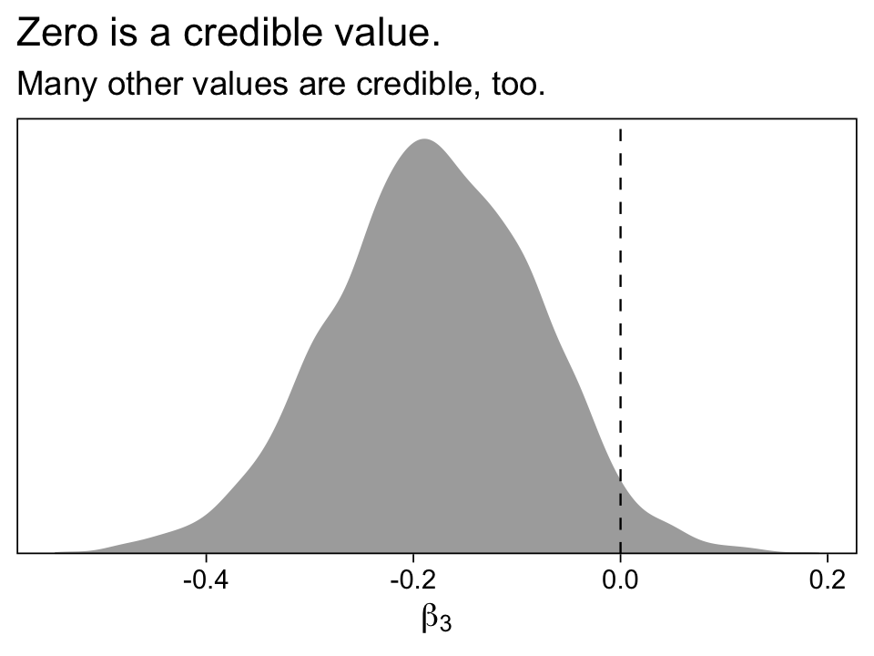
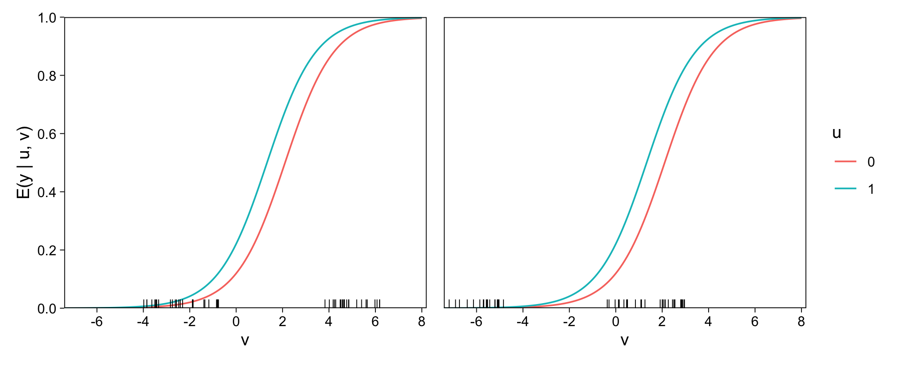
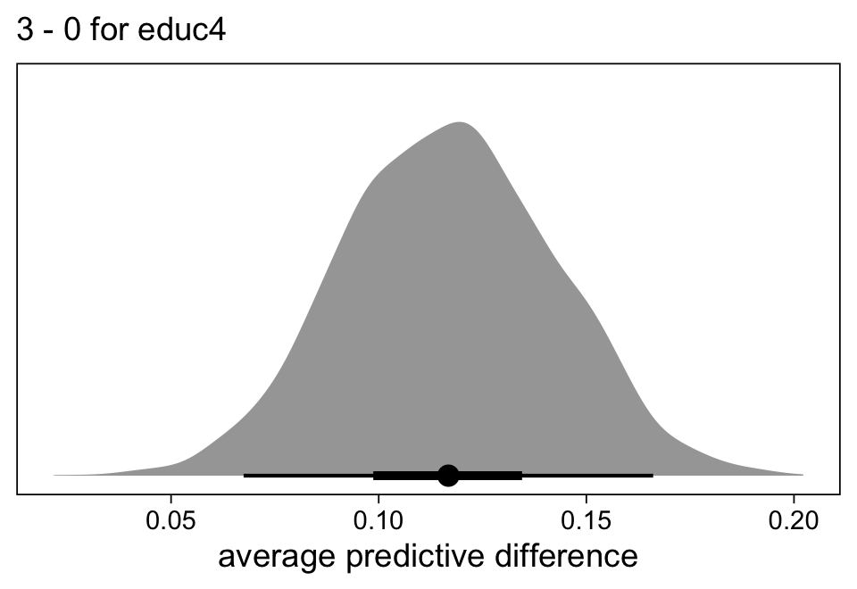
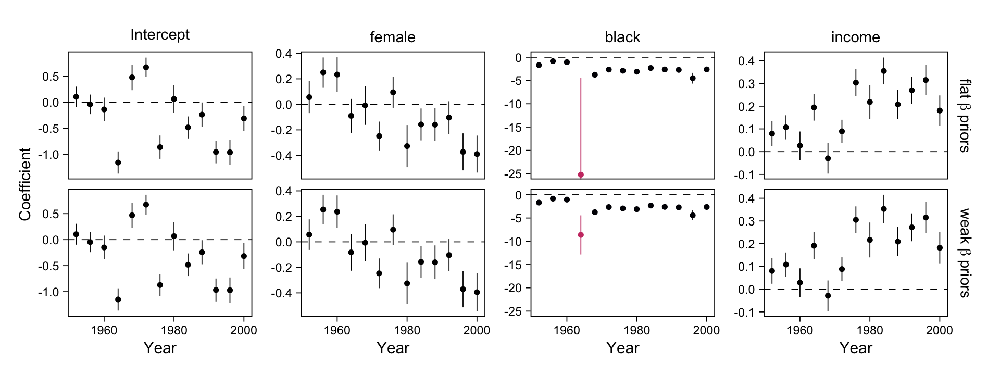

Chapter 14: Working with logistic regression
================
A Solomon Kurz
2023-05-23

# Working with logistic regression

“With logistic, as with linear regression, fitting is only part of the
story” (p. 241).

## 14.1 Graphing logistic regression and binary data

To make Figure 14.1, we’ll need to simulate some data.

``` r
library(tidyverse)

# set light-weight wrappers around the base R functions
logit <- qlogis
invlogit <- plogis

# how many do you want?
n <- 50

# set the population parameters
a <- 2
b <- 3

# simulate
set.seed(14)

fake_1 <- 
  tibble(x = rnorm(n, mean = -a / b, sd = 4 / b),
         y = rbinom(n, size = 1, p = invlogit(a + b * x)))

# what did we do?
head(fake_1)
```

    ## # A tibble: 6 × 2
    ##        x     y
    ##    <dbl> <int>
    ## 1 -1.55      0
    ## 2  1.63      1
    ## 3  2.16      1
    ## 4  1.33      1
    ## 5 -0.715     0
    ## 6  0.976     1

Let’s fit a quick logistic regression model with **brms**.

``` r
library(brms)

m14.1 <-
  brm(data = fake_1,
      family = binomial,
      y | trials(1) ~ x,
      seed = 14,
      file = "fits/m14.01")
```

Check the parameter summary.

``` r
print(m14.1, robust = T)
```

    ##  Family: binomial 
    ##   Links: mu = logit 
    ## Formula: y | trials(1) ~ x 
    ##    Data: fake_1 (Number of observations: 50) 
    ##   Draws: 4 chains, each with iter = 2000; warmup = 1000; thin = 1;
    ##          total post-warmup draws = 4000
    ## 
    ## Population-Level Effects: 
    ##           Estimate Est.Error l-95% CI u-95% CI Rhat Bulk_ESS Tail_ESS
    ## Intercept     3.69      1.39     1.54     7.21 1.00     1186     1205
    ## x             6.62      2.09     3.38    12.34 1.00     1348     1362
    ## 
    ## Draws were sampled using sampling(NUTS). For each parameter, Bulk_ESS
    ## and Tail_ESS are effective sample size measures, and Rhat is the potential
    ## scale reduction factor on split chains (at convergence, Rhat = 1).

Now make Figure 14.1a.

``` r
# set the global plotting theme
theme_set(theme_linedraw() +
            theme(panel.grid = element_blank()))

nd <- tibble(x = seq(from = -4, to = 2, length.out = 100))

# left
p1 <-
  fitted(m14.1, newdata = nd) %>% 
  data.frame() %>% 
  bind_cols(nd) %>% 
  rename(y = Estimate) %>% 
  
  ggplot(aes(x = x, y = y)) +
  geom_point(data = fake_1 %>% mutate(y = ifelse(y == 0, 0.01, 0.99)),
             size = 3/4) +
  geom_ribbon(aes(ymin = Q2.5, ymax = Q97.5),
              alpha = 1/4) +
  geom_line(linetype = 2, linewidth = 1/3) +
  geom_function(fun = function(x) invlogit(a + b * x),
                color = "blue", linewidth = 1) +
  annotate(geom = "text",
           x = c(-0.8, -0.5), y = c(0.5, 0.2),
           label = c("True Curve\ny = invlogit(2 + 3x)",
                     "Fitted curve,\ny = invlogit(3.7 + 6.6x)"),
           color = c("blue", "black"), hjust = c(1, 0), size = 3) +
  scale_x_continuous(breaks = -3:2, expand = expansion(mult = 0.01)) +
  scale_y_continuous(breaks = 0:5 / 5, expand = c(0, 0), limits = 0:1) +
  labs(subtitle = "Data and curves") +
  coord_cartesian(xlim = range(fake_1$x))

# right
p2 <- 
  # make binned averages
  fake_1 %>% 
  mutate(bin = cut(x, breaks = -5:2 + 0.5)) %>%
  mutate(x = as.numeric(bin) - 5) %>% 
  group_by(bin, x) %>% 
  summarise(p = mean(y)) %>%  # these are the binned averages
  # adjust for the plot
  mutate(y = ifelse(p == 0, 0.02,
                    ifelse(p == 1, 0.98, p))) %>% 
  
  ggplot(aes(x = x, y = y)) +
  geom_point(shape = 1, size = 2.25, color = "green2", stroke = 1.25) +
  geom_point(data = fake_1 %>% mutate(y = ifelse(y == 0, 0.01, 0.99)),
             size = 3/4) +
  scale_x_continuous(breaks = -3:2, expand = expansion(mult = 0.01)) +
  scale_y_continuous(breaks = 0:5 / 5, expand = c(0, 0), limits = 0:1) +
  labs(subtitle = "Data and binned averages") +
  coord_cartesian(xlim = range(fake_1$x))

# combine
library(patchwork)
p1 + p2
```


Now simulate binary data with two Gaussian predictors.

``` r
# how many would you like?
n <- 100

# set the population parameters
beta <- c(2, 3, 4)

# simulate
set.seed(14)

fake_2 <-
  tibble(x1 = rnorm(n, mean = 0,    sd = 0.4),
         x2 = rnorm(n, mean = -0.5, sd = 0.4)) %>% 
  mutate(y = rbinom(n, size = 1, p = invlogit(beta[1] + beta[2] * x1 + beta[3] * x2)))

# what did we do?
head(fake_2)
```

    ## # A tibble: 6 × 3
    ##        x1     x2     y
    ##     <dbl>  <dbl> <int>
    ## 1 -0.265   0.177     1
    ## 2  0.688  -0.237     1
    ## 3  0.849  -0.522     1
    ## 4  0.599  -1.43      0
    ## 5 -0.0145 -0.447     0
    ## 6  0.493  -0.613     1

Fit the bivariable logistic regression model.

``` r
m14.2 <-
  brm(data = fake_2,
      family = binomial,
      y | trials(1) ~ x1 + x2,
      seed = 14,
      file = "fits/m14.02")
```

Check the parameter summary.

``` r
print(m14.2, robust = T)
```

    ##  Family: binomial 
    ##   Links: mu = logit 
    ## Formula: y | trials(1) ~ x1 + x2 
    ##    Data: fake_2 (Number of observations: 100) 
    ##   Draws: 4 chains, each with iter = 2000; warmup = 1000; thin = 1;
    ##          total post-warmup draws = 4000
    ## 
    ## Population-Level Effects: 
    ##           Estimate Est.Error l-95% CI u-95% CI Rhat Bulk_ESS Tail_ESS
    ## Intercept     1.45      0.44     0.60     2.40 1.00     3940     2543
    ## x1            1.87      0.67     0.54     3.23 1.00     3197     2929
    ## x2            3.65      0.83     2.16     5.39 1.00     3378     2503
    ## 
    ## Draws were sampled using sampling(NUTS). For each parameter, Bulk_ESS
    ## and Tail_ESS are effective sample size measures, and Rhat is the potential
    ## scale reduction factor on split chains (at convergence, Rhat = 1).

Now we’ll make our version of Figure 14.2, which will have an extra
section.

``` r
# right
p1 <-
  fake_2 %>% 
  mutate(y = factor(y)) %>% 
  
  ggplot(aes(x = x1, y = x2)) +
  geom_point(aes(shape = y)) +
  geom_abline(intercept = -beta[1] / beta[3], slope = -beta[2] / beta[3]) +
  geom_abline(intercept = (logit(0.9) - beta[1]) / beta[3], slope = -beta[2] / beta[3], 
              linetype = 2, size = 1/4) +
  geom_abline(intercept = (logit(0.1) - beta[1]) / beta[3], slope = -beta[2] / beta[3], 
              linetype = 2, size = 1/4) +
  scale_shape_manual(values = c(19, 1), breaks = NULL) +
  labs(subtitle = "Data and 10%, 50%, 90% discrimination lines\nfrom idealized logistic regression")
```

    ## Warning: Using `size` aesthetic for lines was deprecated in ggplot2 3.4.0.
    ## ℹ Please use `linewidth` instead.
    ## This warning is displayed once every 8 hours.
    ## Call `lifecycle::last_lifecycle_warnings()` to see where this warning was generated.

``` r
# range(fake_2$x1)
# range(fake_2$x2)

nd <-
  crossing(x1 = seq(from = -0.9, to = 0.9, length.out = 50),
           x2 = seq(from = -1.7, to = 0.5, length.out = 50))

# left
p2 <-
  fitted(m14.2, newdata = nd) %>% 
  data.frame() %>% 
  bind_cols(nd) %>% 

  ggplot(aes(x = x1, y = x2)) +
  geom_raster(aes(fill = Estimate),
              interpolate = T) +
  geom_point(data = fake_2,
             aes(shape = as.factor(y))) +
  scale_shape_manual(values = c(19, 1), breaks = NULL) +
  scale_fill_viridis_c(expression(hat(italic(p))), option = "C", 
                       breaks = 0:2 / 2, limits = 0:1) +
  scale_y_continuous(NULL, breaks = NULL) +
  coord_cartesian(xlim = range(fake_2$x1),
                  ylim = range(fake_2$x2)) +
  labs(subtitle = "Data and expected probabilities\nfrom fitted logistic regression")

# combine
p1 + p2
```


“These dotted lines in Figure 14.2\[a\] do *not* represent uncertainty
in the line; rather, they convey the variation inherent in the logistic
regression model” (p. 242, *emphasis* in the original). Note the fill
gradient on the plot in the right panel is based on the mean of the
posterior for $\hat p \mid x_1, x_2$.

## 14.2 Logistic regression with interactions

Load the `wells.csv` data.

``` r
wells <- read_csv("ROS-Examples-master/Arsenic/data/wells.csv")

glimpse(wells)
```

    ## Rows: 3,020
    ## Columns: 7
    ## $ switch  <dbl> 1, 1, 0, 1, 1, 1, 1, 1, 1, 1, 1, 1, 1, 1, 1, 1, 1, 1, 1, 1, 1, 1, 1, 1, 1, 1, 1, 1…
    ## $ arsenic <dbl> 2.36, 0.71, 2.07, 1.15, 1.10, 3.90, 2.97, 3.24, 3.28, 2.52, 3.13, 3.04, 2.91, 3.21…
    ## $ dist    <dbl> 16.826, 47.322, 20.967, 21.486, 40.874, 69.518, 80.711, 55.146, 52.647, 75.072, 29…
    ## $ dist100 <dbl> 0.16826, 0.47322, 0.20967, 0.21486, 0.40874, 0.69518, 0.80711, 0.55146, 0.52647, 0…
    ## $ assoc   <dbl> 0, 0, 0, 0, 1, 1, 1, 0, 1, 1, 1, 0, 1, 1, 1, 1, 0, 1, 1, 0, 1, 0, 1, 0, 0, 1, 0, 0…
    ## $ educ    <dbl> 0, 0, 10, 12, 14, 9, 4, 10, 0, 0, 5, 0, 0, 0, 0, 7, 7, 7, 0, 10, 7, 0, 5, 0, 8, 8,…
    ## $ educ4   <dbl> 0.00, 0.00, 2.50, 3.00, 3.50, 2.25, 1.00, 2.50, 0.00, 0.00, 1.25, 0.00, 0.00, 0.00…

Fit an interaction model.

``` r
m14.3 <-
  brm(data = wells,
      family = binomial,
      switch | trials(1) ~ dist100 + arsenic + dist100:arsenic,
      seed = 14,
      file = "fits/m14.03")
```

Check the results.

``` r
print(m14.3, robust = T)
```

    ##  Family: binomial 
    ##   Links: mu = logit 
    ## Formula: switch | trials(1) ~ dist100 + arsenic + dist100:arsenic 
    ##    Data: wells (Number of observations: 3020) 
    ##   Draws: 4 chains, each with iter = 2000; warmup = 1000; thin = 1;
    ##          total post-warmup draws = 4000
    ## 
    ## Population-Level Effects: 
    ##                 Estimate Est.Error l-95% CI u-95% CI Rhat Bulk_ESS Tail_ESS
    ## Intercept          -0.15      0.12    -0.38     0.07 1.00     1962     2232
    ## dist100            -0.58      0.20    -0.97    -0.17 1.00     1842     2008
    ## arsenic             0.56      0.07     0.43     0.70 1.00     1894     1984
    ## dist100:arsenic    -0.18      0.10    -0.38     0.01 1.00     1685     1773
    ## 
    ## Draws were sampled using sampling(NUTS). For each parameter, Bulk_ESS
    ## and Tail_ESS are effective sample size measures, and Rhat is the potential
    ## scale reduction factor on split chains (at convergence, Rhat = 1).

Since `arsenic` levels are never zero in the data, the coefficients are
difficult to interpret directly.

### 14.2.1 Centering the input variables.

“As we discussed in the context of linear regression, before fitting
interactions it makes sense to center the input variables so that we can
more easily interpret the coefficients” (p. 243). Here we make centered
versions of our predictors.

``` r
wells <-
  wells %>% 
  mutate(c_dist100 = dist100 - mean(dist100),
         c_arsenic = arsenic - mean(arsenic))
```

### 14.2.2 Re-fitting the interaction model using the centered inputs.

Refit the interaction model with centered predictors.

``` r
m14.4 <-
  update(m14.3,
         newdata = wells,
         family = binomial,
         switch | trials(1) ~ c_dist100 + c_arsenic + c_dist100:c_arsenic,
         seed = 14,
         file = "fits/m14.04")
```

Check the results.

``` r
print(m14.4, robust = T)
```

    ##  Family: binomial 
    ##   Links: mu = logit 
    ## Formula: switch | trials(1) ~ c_dist100 + c_arsenic + c_dist100:c_arsenic 
    ##    Data: wells (Number of observations: 3020) 
    ##   Draws: 4 chains, each with iter = 2000; warmup = 1000; thin = 1;
    ##          total post-warmup draws = 4000
    ## 
    ## Population-Level Effects: 
    ##                     Estimate Est.Error l-95% CI u-95% CI Rhat Bulk_ESS Tail_ESS
    ## Intercept               0.35      0.04     0.27     0.43 1.00     3963     3004
    ## c_dist100              -0.88      0.11    -1.08    -0.67 1.00     3860     2873
    ## c_arsenic               0.47      0.04     0.39     0.55 1.00     3321     2239
    ## c_dist100:c_arsenic    -0.18      0.10    -0.37     0.02 1.00     3634     3077
    ## 
    ## Draws were sampled using sampling(NUTS). For each parameter, Bulk_ESS
    ## and Tail_ESS are effective sample size measures, and Rhat is the potential
    ## scale reduction factor on split chains (at convergence, Rhat = 1).

Now the coefficients are a little easier to interpret, particularly
$\beta_0$, which is the expected log-odds when the two predictors are at
their sample mean values. When comparing the two models, keep in mind
“the predictions for new observations are unchanged” (p. 244). We can
verify this with a posterior-predictive check.

``` r
set.seed(14)
p1 <- pp_check(m14.3, type = "bars", ndraws = 1000, linewidth = 1/3, fatten = 1) +
  scale_x_continuous(breaks = 0:1) +
  ylim(0, 1900) +
  ggtitle("m14.3\n(non-centered predictors)")

set.seed(14)
p2 <- pp_check(m14.4, type = "bars", ndraws = 1000, linewidth = 1/3, fatten = 1) +
  scale_x_continuous(breaks = 0:1) +
  scale_y_continuous(NULL, breaks = NULL, limits = c(0, 1900)) +
  ggtitle("m14.4\n(centered predictors)")

# combine
p1 + p2 + plot_layout(guides = "collect")
```


Yes, the overall distributions are the same. We can also check this by
plotting the $\hat p_i$ values for each model against one another in a
scatter plot.

``` rv
set.seed(14)
tibble(m14.3 = posterior_epred(m14.3, ndraws = 1) %>% as.vector(),
       m14.4 = posterior_epred(m14.4, ndraws = 1) %>% as.vector()) %>% 
  ggplot(aes(x = m14.3, y = m14.4)) +
  geom_point(size = 1/4) +
  scale_x_continuous(expression(hat(italic(p))[italic(i)]*" | m14.3"), limits = 0:1) +
  scale_y_continuous(expression(hat(italic(p))[italic(i)]*" | m14.4"), limits = 0:1) +
  coord_equal()
```

The correlation isn’t perfect, but it’s very close. I suspect the subtle
differences are largely a function of MCMC simulation variance and our
reliance on default priors. But the correlation is very high.

``` r
# correlation on log-odds scale
set.seed(14)
tibble(m14.3 = posterior_linpred(m14.3, ndraws = 1) %>% as.vector(),
       m14.4 = posterior_linpred(m14.4, ndraws = 1) %>% as.vector()) %>%
  summarise(r = cor(m14.3, m14.4))
```

    ## # A tibble: 1 × 1
    ##       r
    ##   <dbl>
    ## 1 0.988

``` r
# correlation on p scale
set.seed(14)
tibble(m14.3 = posterior_epred(m14.3, ndraws = 1) %>% as.vector(),
       m14.4 = posterior_epred(m14.4, ndraws = 1) %>% as.vector()) %>%
  summarise(r = cor(m14.3, m14.4))
```

    ## # A tibble: 1 × 1
    ##       r
    ##   <dbl>
    ## 1 0.985

### 14.2.3 Statistical significance of the interaction.

Whether it be the model with the centered or non-centered predictors,
the interaction term is not statistically significant in the
conventional sense. The 95% intervals cross zero.

``` r
fixef(m14.3, robust = T)[4, ] %>% round(digits = 2)
```

    ##  Estimate Est.Error      Q2.5     Q97.5 
    ##     -0.18      0.10     -0.38      0.01

``` r
fixef(m14.4, robust = T)[4, ] %>% round(digits = 2)
```

    ##  Estimate Est.Error      Q2.5     Q97.5 
    ##     -0.18      0.10     -0.37      0.02

We might compare the interaction model with one without the interaction.
Here we’ll just use the un-centered versions of the predictors.

``` r
m14.5 <-
  update(m14.3,
         newdata = wells,
         family = binomial,
         switch | trials(1) ~ dist100 + arsenic,
         seed = 14,
         file = "fits/m14.05")
```

Compute the LOO estimates.

``` r
m14.3 <- add_criterion(m14.3, criterion = "loo")
m14.5 <- add_criterion(m14.5, criterion = "loo")
```

Compare the two models by their LOO estimates.

``` r
loo_compare(m14.3, m14.5) %>% print(simplify = F)
```

    ##       elpd_diff se_diff elpd_loo se_elpd_loo p_loo   se_p_loo looic   se_looic
    ## m14.3     0.0       0.0 -1968.1     15.9         4.4     0.3   3936.1    31.8 
    ## m14.5    -0.4       1.9 -1968.5     15.7         3.2     0.1   3936.9    31.4

The LOO difference is trivial. Even so, it’s still not necessarily wise
to move forward as if the interaction term is exactly zero. To get a
sense, let’s plot.

``` r
as_draws_df(m14.3) %>% 
  ggplot(aes(x = `b_dist100:arsenic`)) +
  geom_density(size = 0, fill = "grey67") +
  geom_vline(xintercept = 0, linetype = 2, size = 1/3) +
  scale_y_continuous(NULL, breaks = NULL, expand = expansion(mult = c(0, 0.05))) +
  labs(title = "Zero is a credible value.",
       subtitle = "Many other values are credible, too.",
       x = expression(beta[3]))
```



> The estimate is not quite two standard errors away from zero and so is
> not quite “statistically significant.” However, as discussed before,
> this does not mean that we should treat the underlying coefficient as
> zero. Rather we must accept our uncertainty in the context that it is
> plausible that arsenic level becomes a less important predictor for
> households that are farther from the nearest safe well, and the
> magnitude of the association is also plausible. (p. 244)

### 14.2.4 Graphing the model with interactions.

Make the `jitter_binary()` function from last chapter.

``` r
jitter_binary <- function(a, jitt = 0.05) {
  
  ifelse(a == 0, runif(length(a), 0, jitt), runif(length(a), 1 - jitt, 1))
  
}

wells <-
  wells %>% 
  mutate(jitter_switch = jitter_binary(switch))
```

Now make Figure 14.3.

``` r
nd <-
  crossing(dist100 = seq(from = 0, to = 3.5, length.out = 100),
           arsenic = c(0.5, 1))

# left 
p1 <-
  fitted(m14.3, newdata = nd) %>% 
  data.frame() %>% 
  bind_cols(nd) %>% 
  mutate(arsenic = factor(arsenic)) %>% 
  
  ggplot(aes(x = dist100)) +
  geom_ribbon(aes(ymin = Q2.5, ymax = Q97.5,
                  fill = arsenic),
              alpha = 1/3) +
  geom_line(aes(y = Estimate, color = arsenic)) +
  geom_point(data = wells,
             aes(y = jitter_switch),
             size = 1/10) +
  scale_color_viridis_d(option = "A", end = .5) +
  scale_fill_viridis_d(option = "A", end = .5) +
  scale_x_continuous("Distance (in meters) to nearest safe well", 
                     expand = c(0, 0), limits = c(0, 3.5),
                     breaks = 0:3, labels = 0:3 * 100) +
  scale_y_continuous("Pr (switching)", expand = c(0, 0), limits = 0:1) +
  theme(legend.background = element_rect(fill = "transparent"),
        legend.position = c(.85, .75))

# range(wells$arsenic)
nd <-
  crossing(dist100 = c(0, 0.5),
           arsenic = seq(from = 0, to = 10, length.out = 100))

# right
p2 <-
  fitted(m14.3, newdata = nd) %>% 
  data.frame() %>% 
  bind_cols(nd) %>% 
  mutate(dist = (dist100 * 100) %>% as.factor()) %>% 

  ggplot(aes(x = arsenic)) +
  geom_ribbon(aes(ymin = Q2.5, ymax = Q97.5,
                  fill = dist),
              alpha = 1/3) +
  geom_line(aes(y = Estimate, color = dist)) +
  geom_point(data = wells,
             aes(y = jitter_switch),
             size = 1/10) +
  scale_color_viridis_d(option = "D", end = .5, direction = -1) +
  scale_fill_viridis_d(option = "D", end = .5, direction = -1) +
  scale_x_continuous("Arsenic concentration in well water", 
                     expand = c(0, 0), limits = c(0, 9.7),
                     breaks = 0:4 * 2) +
  scale_y_continuous(NULL, breaks = NULL, expand = c(0, 0), limits = 0:1) +
  theme(legend.background = element_rect(fill = "transparent"),
        legend.position = c(.85, .75))

# combine
p1 + p2
```


“The interaction is small in the range of most of the data” (p. 245).

### 14.2.5 Adding social predictors.

Now fit the model that drops the interaction term and adds to other
predictors.

``` r
m14.6 <-
  brm(data = wells,
      family = binomial,
      switch | trials(1) ~ dist100 + arsenic + educ4 + assoc,
      seed = 14,
      file = "fits/m14.06")
```

Check the results.

``` r
print(m14.6, robust = T)
```

    ##  Family: binomial 
    ##   Links: mu = logit 
    ## Formula: switch | trials(1) ~ dist100 + arsenic + educ4 + assoc 
    ##    Data: wells (Number of observations: 3020) 
    ##   Draws: 4 chains, each with iter = 2000; warmup = 1000; thin = 1;
    ##          total post-warmup draws = 4000
    ## 
    ## Population-Level Effects: 
    ##           Estimate Est.Error l-95% CI u-95% CI Rhat Bulk_ESS Tail_ESS
    ## Intercept    -0.16      0.10    -0.35     0.04 1.00     5262     2778
    ## dist100      -0.90      0.11    -1.10    -0.70 1.00     4346     3057
    ## arsenic       0.47      0.04     0.39     0.55 1.00     4530     3230
    ## educ4         0.17      0.04     0.09     0.24 1.00     4644     2932
    ## assoc        -0.13      0.08    -0.28     0.02 1.00     4552     3393
    ## 
    ## Draws were sampled using sampling(NUTS). For each parameter, Bulk_ESS
    ## and Tail_ESS are effective sample size measures, and Rhat is the potential
    ## scale reduction factor on split chains (at convergence, Rhat = 1).

Now drop the `assoc` predictor.

``` r
m14.7 <-
  brm(data = wells,
      family = binomial,
      switch | trials(1) ~ dist100 + arsenic + educ4,
      seed = 14,
      file = "fits/m14.07")
```

Check the results.

``` r
print(m14.7, robust = T)
```

    ##  Family: binomial 
    ##   Links: mu = logit 
    ## Formula: switch | trials(1) ~ dist100 + arsenic + educ4 
    ##    Data: wells (Number of observations: 3020) 
    ##   Draws: 4 chains, each with iter = 2000; warmup = 1000; thin = 1;
    ##          total post-warmup draws = 4000
    ## 
    ## Population-Level Effects: 
    ##           Estimate Est.Error l-95% CI u-95% CI Rhat Bulk_ESS Tail_ESS
    ## Intercept    -0.22      0.09    -0.40    -0.03 1.00     5317     3042
    ## dist100      -0.90      0.11    -1.11    -0.69 1.00     4222     3299
    ## arsenic       0.47      0.04     0.39     0.55 1.00     3673     2311
    ## educ4         0.17      0.04     0.10     0.25 1.00     4524     3284
    ## 
    ## Draws were sampled using sampling(NUTS). For each parameter, Bulk_ESS
    ## and Tail_ESS are effective sample size measures, and Rhat is the potential
    ## scale reduction factor on split chains (at convergence, Rhat = 1).

Compute the LOO estimates for both.

``` r
m14.6 <- add_criterion(m14.6, criterion = "loo")
m14.7 <- add_criterion(m14.7, criterion = "loo")
```

We’ll put the LOO estimates for `m14.6` on the back burner. Here we
compare the LOO estimates for `m14.7` and `m14.3`, the model withough
the social predictors.

``` r
loo_compare(m14.7, m14.3) %>% print(simplify = F)
```

    ##       elpd_diff se_diff elpd_loo se_elpd_loo p_loo   se_p_loo looic   se_looic
    ## m14.7     0.0       0.0 -1959.4     16.1         4.3     0.1   3918.8    32.2 
    ## m14.3    -8.7       4.8 -1968.1     15.9         4.4     0.3   3936.1    31.8

“Adding education improves predictive log score, but there is
considerable uncertainty” (p 246).

### 14.2.6 Adding further interactions.

“When inputs have large main effects, it is our general practice to
include their interactions as well” (p. 246).

Make a centered version of the `educ4` variable.

``` r
wells <-
  wells %>% 
  mutate(c_educ4 = educ4 - mean(educ4))
```

Now include it in a couple interactions.

``` r
m14.8 <-
  brm(data = wells,
      family = binomial,
      switch | trials(1) ~ c_dist100 + c_arsenic + c_educ4 + c_dist100:c_educ4 + c_arsenic:c_educ4,
      seed = 14,
      file = "fits/m14.08")
```

Check the results.

``` r
print(m14.8, robust = T)
```

    ##  Family: binomial 
    ##   Links: mu = logit 
    ## Formula: switch | trials(1) ~ c_dist100 + c_arsenic + c_educ4 + c_dist100:c_educ4 + c_arsenic:c_educ4 
    ##    Data: wells (Number of observations: 3020) 
    ##   Draws: 4 chains, each with iter = 2000; warmup = 1000; thin = 1;
    ##          total post-warmup draws = 4000
    ## 
    ## Population-Level Effects: 
    ##                   Estimate Est.Error l-95% CI u-95% CI Rhat Bulk_ESS Tail_ESS
    ## Intercept             0.34      0.04     0.27     0.42 1.00     5026     2946
    ## c_dist100            -0.92      0.11    -1.13    -0.71 1.00     4603     2682
    ## c_arsenic             0.49      0.04     0.41     0.58 1.00     4963     3229
    ## c_educ4               0.19      0.04     0.11     0.27 1.00     4957     3408
    ## c_dist100:c_educ4     0.34      0.11     0.12     0.54 1.00     4465     3319
    ## c_arsenic:c_educ4     0.08      0.04    -0.01     0.16 1.00     4467     3673
    ## 
    ## Draws were sampled using sampling(NUTS). For each parameter, Bulk_ESS
    ## and Tail_ESS are effective sample size measures, and Rhat is the potential
    ## scale reduction factor on split chains (at convergence, Rhat = 1).

The results reported in the text are odd in that the authors appear to
have used `educ4` as the lower-order term, but used the centered version
`c_educ4` in the interactions. However, if you look at Vehtari’s
rendered examples (see
[here](https://avehtari.github.io/ROS-Examples/Arsenic/arsenic_logistic_building.html#More_predictors)),
you’ll see he used our method where we only used `c_educ4`. Thus, our
posterior for $\beta_0$ will match the one posted by Vehtari, not the
one in the text.

Compute the LOO estimates.

``` r
m14.8 <- add_criterion(m14.8, criterion = "loo")
```

Use the LOO estimates to compare this model to the earlier one which
only included `dist100` and `arsenic`.

``` r
loo_compare(m14.5, m14.8) %>% print(simplify = F)
```

    ##       elpd_diff se_diff elpd_loo se_elpd_loo p_loo   se_p_loo looic   se_looic
    ## m14.8     0.0       0.0 -1952.7     16.5         6.3     0.3   3905.4    32.9 
    ## m14.5   -15.8       6.3 -1968.5     15.7         3.2     0.1   3936.9    31.4

“Adding interactions with `educ4` further improved the LOO log score”
(p. 247).

### 14.2.7 Standardizing predictors.

“We should think seriously about standardizing all predictors as a
default option when fitting models with interactions” (p. 247).

## 14.3 Predictive simulation

“We can use the inferences from ~~`stan_glm`~~ `brms::brm()` to obtain
simulations that we can then use to make probabilistic predictions”
(p. 247).

### 14.3.1 Simulating the uncertainty in the estimated coefficients.

Fit a simplified model with `dist100` as the only predictor.

``` r
m14.9 <-
  brm(data = wells,
      family = binomial,
      switch | trials(1) ~ dist100,
      seed = 14,
      file = "fits/m14.09")
```

Check the results.

``` r
print(m14.9, robust = T)
```

    ##  Family: binomial 
    ##   Links: mu = logit 
    ## Formula: switch | trials(1) ~ dist100 
    ##    Data: wells (Number of observations: 3020) 
    ##   Draws: 4 chains, each with iter = 2000; warmup = 1000; thin = 1;
    ##          total post-warmup draws = 4000
    ## 
    ## Population-Level Effects: 
    ##           Estimate Est.Error l-95% CI u-95% CI Rhat Bulk_ESS Tail_ESS
    ## Intercept     0.61      0.06     0.49     0.73 1.00     3736     2506
    ## dist100      -0.62      0.10    -0.82    -0.43 1.00     3564     2647
    ## 
    ## Draws were sampled using sampling(NUTS). For each parameter, Bulk_ESS
    ## and Tail_ESS are effective sample size measures, and Rhat is the potential
    ## scale reduction factor on split chains (at convergence, Rhat = 1).

Make Figure 14.4.

``` r
# save the posterior draws
draws <- as_draws_df(m14.9)

# left
p1 <-
  draws %>% 
  ggplot(aes(x = b_Intercept, y = b_dist100)) +
  geom_point(size = 1/10, alpha = 2/3) +
  labs(x = expression(beta[0]),
       y = expression(beta[1])) +
  coord_cartesian(ylim = c(NA, 0),
                  xlim = c(0.2, 1))

# how many posterior lines would you like
n <- 20

# right
p2 <-
  wells %>% 
  ggplot(aes(x = dist100, y = jitter_switch)) + 
  geom_point(size = 1/10) +
  geom_line(data = draws %>% 
              slice(1:n) %>% 
              expand_grid(dist100 = seq(from = 0, to = 3.5, length.out = 100)) %>% 
              mutate(jitter_switch = invlogit(b_Intercept + b_dist100 * dist100)),
            aes(group = .draw),
            size = 1/8, alpha = 1/2) +
  geom_function(fun = function(x) invlogit(fixef(m14.9, robust = T)[1, 1] + fixef(m14.9, robust = T)[2, 1] * x),
                color = "blue") +
  scale_x_continuous("Distance (in meters) to nearest safe well", 
                     expand = c(0, 0), limits = c(0, 3.5),
                     breaks = 0:3, labels = 0:3 * 100) +
  scale_y_continuous("Pr (switching)", expand = c(0, 0), limits = 0:1) 

# combine
p1 + p2 + plot_layout(widths = c(2, 3))
```


### 14.3.2 Predictive simulation using the binomial distribution.

We’ll make the bulk of the table in Figure 14.5 in this block.

``` r
# define the new data, X^new
set.seed(14)
nd <- tibble(dist100 = runif(n = 10, min = 0, max = 2))

post_sim <-
  bind_cols(
    # posterior draws
    draws %>% 
      transmute(sim = 1:n(),
                beta0 = b_Intercept,
                beta1 = b_dist100),
    
    # posterior simulations
    predict(m14.9,
            newdata = nd, 
            summary = F) %>% 
      data.frame() %>% 
      set_names(str_c("y0", 1:9), "y10")
  )
```

    ## Warning: Dropping 'draws_df' class as required metadata was removed.

``` r
post_sim %>% 
  select(-(y03:y09)) %>% 
  slice(1:2, 4000)
```

    ## # A tibble: 3 × 6
    ##     sim beta0  beta1   y01   y02   y10
    ##   <int> <dbl>  <dbl> <int> <int> <int>
    ## 1     1 0.652 -0.628     0     0     1
    ## 2     2 0.608 -0.735     1     1     0
    ## 3  4000 0.646 -0.683     1     1     1

Now compute the means depicted in the bottom row.

``` r
post_sim %>%
  pivot_longer(-sim) %>% 
  group_by(name) %>% 
  summarise(mean = mean(value) %>% round(digits = 2)) %>% 
  pivot_wider(names_from = name, values_from = mean) %>% 
  select(-(y03:y09))
```

    ## # A tibble: 1 × 5
    ##   beta0 beta1   y01   y02   y10
    ##   <dbl> <dbl> <dbl> <dbl> <dbl>
    ## 1  0.61 -0.62  0.59  0.46  0.54

You’ll note our mean value for `beta1` is much lower than the one Gelman
et al reported in their table. I’m pretty sure their value is the result
of a typo.

### 14.3.3 Predictive simulation using the latent logistic distribution.

Recall the latent-variable formulation from Section 13.4, where

> each discrete outcome $y_i$ is associated with a continuous,
> unobserved outcome $z_i$ , defined as follows:
>
> $$
> \begin{align*}
> y_i & = \left \{
>   \begin{array}{@{}ll@{}}
>     1 & \text{if}\ z_i > 0 \\
>     0 & \text{if}\ z_i < 0
>   \end{array} \right. \\
> z_i & = X_i \beta + \epsilon_i, 
> \end{align*}
> $$
>
> with independent errors $\epsilon_i$ that have the *logistic*
> probability distribution. The logistic distribution is shown in Figure
> 13.5 and is defined so that
>
> $$\Pr(\epsilon_i < x) = \operatorname{logit}^{-1} (x)\ \text{for all}\ x.$$
>
> Thus,
> $\Pr(y_i = 1) = \Pr(z_i > 0) = \Pr(\epsilon_i > -X_i \beta) = \operatorname{logit}^{-1}(X_i \beta)$.
> (p. 226, *emphasis* in the original)

As far as I can tell, the **brms**-convenience-function based approach
to simulating “logistic regression predictions us\[ing\] the latent-data
formulation” (p. 248) is a little cumbersome. Here are the steps. First,
we poll the log-odds probabilities for the $X^\text{new}$ values (`nd`)
using `fitted()`.

``` r
log_odds_p <-
  fitted(m14.9,
         newdata = nd, 
         summary = F, 
         scale = "linear") %>% 
  data.frame() %>% 
  set_names(str_c("f0", 1:9), "f10")

glimpse(log_odds_p)
```

    ## Rows: 4,000
    ## Columns: 10
    ## $ f01 <dbl> 0.3330309, 0.2344679, 0.2736297, 0.3151960, 0.2618315, 0.2555124, 0.2762326, 0.2185459…
    ## $ f02 <dbl> -0.14922676, -0.32934614, -0.20050460, -0.14634146, -0.25090783, -0.20908423, -0.28740…
    ## $ f03 <dbl> -0.5505218, -0.7985057, -0.5950400, -0.5303949, -0.6775672, -0.5956832, -0.7564096, -0…
    ## $ f04 <dbl> -0.042067070, -0.204064265, -0.095149956, -0.043785871, -0.136974965, -0.105848880, -0…
    ## $ f05 <dbl> -0.5830395, -0.8365226, -0.6270100, -0.5615155, -0.7121403, -0.6270101, -0.7944143, -0…
    ## $ f06 <dbl> 0.009543242, -0.143725938, -0.044408991, 0.005607007, -0.082102554, -0.056128615, -0.1…
    ## $ f07 <dbl> -0.5199055, -0.7627117, -0.5649394, -0.5010940, -0.6450158, -0.5661881, -0.7206271, -0…
    ## $ f08 <dbl> 0.113895277, -0.021726535, 0.058185291, 0.105475564, 0.028845191, 0.044401892, 0.02012…
    ## $ f09 <dbl> 0.0420738526, -0.1056939525, -0.0124263409, 0.0367399419, -0.0475158030, -0.0247893243…
    ## $ f10 <dbl> 0.17267125, 0.04698926, 0.11597121, 0.16172623, 0.09133617, 0.10102540, 0.08881414, 0.…

Second, we make a $4{,}000 \times 10$ data frame for the
$\epsilon^\text{new}$ values.

``` r
set.seed(14)

epsilon_new <-
  tibble(name  = c(str_c("e0", 1:9), "e10"),
         value = logit(runif(10, 0, 1)),
         count = 4000) %>% 
  uncount(count, .id = "sim") %>% 
  pivot_wider(names_from = name, values_from = value) %>% 
  select(-sim)

glimpse(epsilon_new)
```

    ## Rows: 4,000
    ## Columns: 10
    ## $ e01 <dbl> -1.077213, -1.077213, -1.077213, -1.077213, -1.077213, -1.077213, -1.077213, -1.077213…
    ## $ e02 <dbl> 0.5659464, 0.5659464, 0.5659464, 0.5659464, 0.5659464, 0.5659464, 0.5659464, 0.5659464…
    ## $ e03 <dbl> 3.107197, 3.107197, 3.107197, 3.107197, 3.107197, 3.107197, 3.107197, 3.107197, 3.1071…
    ## $ e04 <dbl> 0.2109659, 0.2109659, 0.2109659, 0.2109659, 0.2109659, 0.2109659, 0.2109659, 0.2109659…
    ## $ e05 <dbl> 4.061421, 4.061421, 4.061421, 4.061421, 4.061421, 4.061421, 4.061421, 4.061421, 4.0614…
    ## $ e06 <dbl> 0.04590353, 0.04590353, 0.04590353, 0.04590353, 0.04590353, 0.04590353, 0.04590353, 0.…
    ## $ e07 <dbl> 2.63089, 2.63089, 2.63089, 2.63089, 2.63089, 2.63089, 2.63089, 2.63089, 2.63089, 2.630…
    ## $ e08 <dbl> -0.2882689, -0.2882689, -0.2882689, -0.2882689, -0.2882689, -0.2882689, -0.2882689, -0…
    ## $ e09 <dbl> -0.05767544, -0.05767544, -0.05767544, -0.05767544, -0.05767544, -0.05767544, -0.05767…
    ## $ e10 <dbl> -0.4825412, -0.4825412, -0.4825412, -0.4825412, -0.4825412, -0.4825412, -0.4825412, -0…

Third, combine those two to make a data frame for the $x^\text{new}$
scores.

``` r
z_new <- log_odds_p + epsilon_new

glimpse(z_new)
```

    ## Rows: 4,000
    ## Columns: 10
    ## $ f01 <dbl> -0.7441825, -0.8427454, -0.8035837, -0.7620173, -0.8153818, -0.8217009, -0.8009807, -0…
    ## $ f02 <dbl> 0.4167196, 0.2366002, 0.3654418, 0.4196049, 0.3150385, 0.3568622, 0.2785458, 0.2317382…
    ## $ f03 <dbl> 2.556675, 2.308691, 2.512157, 2.576802, 2.429630, 2.511514, 2.350787, 2.313032, 2.5049…
    ## $ f04 <dbl> 0.1688988674, 0.0069016727, 0.1158159813, 0.1671800658, 0.0739909722, 0.1051170568, 0.…
    ## $ f05 <dbl> 3.478382, 3.224899, 3.434411, 3.499906, 3.349281, 3.434411, 3.267007, 3.229986, 3.4261…
    ## $ f06 <dbl> 0.055446773, -0.097822407, 0.001494540, 0.051510538, -0.036199023, -0.010225084, -0.05…
    ## $ f07 <dbl> 2.110985, 1.868179, 2.065951, 2.129796, 1.985875, 2.064702, 1.910263, 1.871818, 2.0598…
    ## $ f08 <dbl> -0.1743736, -0.3099954, -0.2300836, -0.1827933, -0.2594237, -0.2438670, -0.2681485, -0…
    ## $ f09 <dbl> -1.560159e-02, -1.633694e-01, -7.010178e-02, -2.093550e-02, -1.051912e-01, -8.246477e-…
    ## $ f10 <dbl> -0.3098700, -0.4355520, -0.3665700, -0.3208150, -0.3912051, -0.3815159, -0.3937271, -0…

Fourth, convert the $z$ scores to 0’s and 1’s.

``` r
y_new <-
  z_new %>% 
  mutate_all(.funs = ~ ifelse(. > 0, 1, 0)) %>% 
  set_names(str_c("y0", 1:9), "y10")

glimpse(y_new)
```

    ## Rows: 4,000
    ## Columns: 10
    ## $ y01 <dbl> 0, 0, 0, 0, 0, 0, 0, 0, 0, 0, 0, 0, 0, 0, 0, 0, 0, 0, 0, 0, 0, 0, 0, 0, 0, 0, 0, 0, 0,…
    ## $ y02 <dbl> 1, 1, 1, 1, 1, 1, 1, 1, 1, 1, 1, 1, 1, 1, 1, 1, 1, 1, 1, 1, 1, 1, 1, 1, 1, 1, 1, 1, 1,…
    ## $ y03 <dbl> 1, 1, 1, 1, 1, 1, 1, 1, 1, 1, 1, 1, 1, 1, 1, 1, 1, 1, 1, 1, 1, 1, 1, 1, 1, 1, 1, 1, 1,…
    ## $ y04 <dbl> 1, 1, 1, 1, 1, 1, 1, 0, 1, 1, 1, 1, 1, 1, 1, 1, 1, 1, 1, 1, 1, 1, 1, 1, 1, 1, 1, 1, 1,…
    ## $ y05 <dbl> 1, 1, 1, 1, 1, 1, 1, 1, 1, 1, 1, 1, 1, 1, 1, 1, 1, 1, 1, 1, 1, 1, 1, 1, 1, 1, 1, 1, 1,…
    ## $ y06 <dbl> 1, 0, 1, 1, 0, 0, 0, 0, 1, 1, 1, 0, 1, 1, 0, 1, 1, 0, 1, 0, 1, 0, 0, 1, 0, 1, 0, 1, 0,…
    ## $ y07 <dbl> 1, 1, 1, 1, 1, 1, 1, 1, 1, 1, 1, 1, 1, 1, 1, 1, 1, 1, 1, 1, 1, 1, 1, 1, 1, 1, 1, 1, 1,…
    ## $ y08 <dbl> 0, 0, 0, 0, 0, 0, 0, 0, 0, 0, 0, 0, 0, 0, 0, 0, 0, 0, 0, 0, 0, 0, 0, 0, 0, 0, 0, 0, 0,…
    ## $ y09 <dbl> 0, 0, 0, 0, 0, 0, 0, 0, 0, 0, 0, 0, 1, 1, 0, 0, 0, 0, 1, 0, 1, 0, 0, 0, 0, 1, 0, 0, 0,…
    ## $ y10 <dbl> 0, 0, 0, 0, 0, 0, 0, 0, 0, 0, 0, 0, 0, 0, 0, 0, 0, 0, 0, 0, 0, 0, 0, 0, 0, 0, 0, 0, 0,…

Here are the counts, by column.

``` r
y_new %>% 
  pivot_longer(everything(), values_to = "count") %>% 
  group_by(name) %>% 
  count(count) %>% 
  pivot_wider(names_from = name, 
              values_from = n, 
              values_fill = 0)
```

    ## # A tibble: 2 × 11
    ##   count   y01   y02   y03   y04   y05   y06   y07   y08   y09   y10
    ##   <dbl> <int> <int> <int> <int> <int> <int> <int> <int> <int> <int>
    ## 1     0  4000     0     0   159     0  1592     0  4000  3295  4000
    ## 2     1     0  4000  4000  3841  4000  2408  4000     0   705     0

## 14.4 Average predictive comparisons on the probability scale

> Logistic regressions are nonlinear on the probability scale and linear
> on the logit scale. This is because logistic regression is linear in
> the parameters but nonlinear in the relation of inputs to outcome. A
> specified difference in one of the $x$ variables does *not* correspond
> to a constant difference in $\Pr(y = 1)$. As a result, logistic
> regression coefficients cannot directly be interpreted on the scale of
> the data. Logistic regressions are inherently more difficult than
> linear regressions to interpret.
>
> \[Even still,\] it is helpful to have a summary, comparable to the
> linear regression coefficient, which gives the expected, or average,
> difference in $\Pr(y = 1)$ corresponding to a unit difference in each
> of the input variables. In this section we describe a way to construct
> such a summary. (p. 249, *emphasis* in the original)

Imagine modeling a binary $y$ variable with input data $x$. Those $x$
input data can be divided into the data from the predictor of interest,
$u$, and the remaining predictors, $v$. Thus our input data are
$x = (u, v)$.

We can compare a high ($u^\text{high}$) and low ($u^\text{low}$) value
for our predictor of interest with all other inputs ($v$) held constant,
following the formula

$$\text{predictive difference} = \operatorname E(y | u^\text{high}, v, \theta) - \operatorname E(y | u^\text{low}, v, \theta),$$

where $\theta$ is a stand-in for the model parameters and the
*predictive difference* is our summary. An important thing to grasp,
here, is this isn’t a simple counterfactual of the kind we’d plot with
`conditional_effects()`. The predictive difference is based systemically
varying the $u$ values while retaining all the $v$ inputs from the
original data. Thus, the validity of the predictive difference approach
is tethered to the validity of the sample data.

This approach is also what our friends in epidemiology call
*standardization*.

### 14.4.1 Problems with evaluating predictive comparisons at a central value.

Other approaches, such as more conventional counterfactual approaches
done with `conditional_effects()` or `fitted()`, can fail if the $v$
input data are binary, bimodal, or widely dispersed. In those cases,
it’s hard to know what values to fix the counterfactual $v$ values on.
This will generally be the case whenever you’re using a link function.

I find Figure 14.6 baffling and perhaps mis-drawn, so we’ll move
forward. It looks like we don’t have the data underlying Figure 14.7,
but it’s worth taking the time to simulate similar data. Here’s an
attempt with $N = 1{,}000$ cases.

``` r
# how many do you want?
n <- 1000

# set the population parameters
b0 <- logit(0.1)
b1 <- logit(0.2) - logit(0.1)
b2 <- 1

# simulate
set.seed(14)

fake_3 <- 
  tibble(u = rbinom(n = n, size = 1, prob = 0.5),
         v = runif(n = n, min = -8, max = 8)) %>% 
  mutate(y = rbinom(n, size = 1, p = invlogit(b0 + b1 * u + b2 * v)))

# what?
glimpse(fake_3)
```

    ## Rows: 1,000
    ## Columns: 3
    ## $ u <int> 0, 1, 1, 1, 1, 1, 1, 0, 0, 0, 1, 0, 0, 1, 1, 1, 0, 1, 1, 1, 0, 0, 1, 1, 1, 1, 0, 1, 1, 0…
    ## $ v <dbl> 1.1090501, -0.7905615, -7.0902564, 0.5215526, 7.0852751, 0.7854604, 4.6039564, 5.4145189…
    ## $ y <int> 0, 0, 0, 0, 1, 0, 1, 1, 0, 0, 1, 0, 1, 1, 0, 1, 0, 1, 1, 0, 1, 1, 0, 0, 0, 0, 0, 0, 0, 1…

Here for simplicity, I’m just going to fit a quick ML-baesd logistic
regression model with `glm()`.

``` r
# fit
glm1 <- glm(
  data = fake_3,
  family = binomial,
  y ~ 1 + u + v
)

# summarize
summary(glm1)
```

    ## 
    ## Call:
    ## glm(formula = y ~ 1 + u + v, family = binomial, data = fake_3)
    ## 
    ## Coefficients:
    ##             Estimate Std. Error z value Pr(>|z|)    
    ## (Intercept) -1.99754    0.21973  -9.091   <2e-16 ***
    ## u            0.73682    0.25808   2.855   0.0043 ** 
    ## v            0.94824    0.06604  14.358   <2e-16 ***
    ## ---
    ## Signif. codes:  0 '***' 0.001 '**' 0.01 '*' 0.05 '.' 0.1 ' ' 1
    ## 
    ## (Dispersion parameter for binomial family taken to be 1)
    ## 
    ##     Null deviance: 1333.85  on 999  degrees of freedom
    ## Residual deviance:  411.03  on 997  degrees of freedom
    ## AIC: 417.03
    ## 
    ## Number of Fisher Scoring iterations: 7

Here we’ll plot a prototype of Figure 14.7, to which we’ll add in a
moment.

``` r
nd_lines <- 
  crossing(u = 0:1,
           v = seq(from = -8, to = 8, by = 0.1))

nd_lines %>% 
  mutate(p = predict(glm1, newdata = nd_lines, type = "response"),
         u = factor(u)) %>%
  
  ggplot(aes(x = v, y = p, group = u, color = u)) +
  geom_line() +
  scale_x_continuous(breaks = -4:4 * 2) +
  scale_y_continuous("E(y | u, v)", breaks = 0:5 / 5, 
                     limits = 0:1, expand = expansion(mult = 0)) +
  coord_cartesian(xlim = c(-6.7, 7.5))
```


Looks like our simulated `fake_3` data got pretty close to whatever was
underlying Figure 14.7 in the text.

Now as far as I can tell, the lines in the two panels of Figure 14.7 are
identical, which leads me to believe they are not based on models fit to
small-sample data. Thus, I believe the small sample subsets depicted in
the rub plots of the two panels of Figure 14.7 were not used to actually
make the curves. But those two small sample subsets were used to compute
the values called “avg pred diff” and “pred diff at E(v).”

Here’s how we might take two $n = 50$ subsets of our full `fake_3` data,
which match the broad distributional qualities in the subsets in the
figure.

``` r
# left panel
set.seed(14)

subset_1 <- 
  fake_3 %>% 
  filter(between(v, -4, -0.7) | between(v, 3.8, 6.2)) %>% 
  slice_sample(n = 50)

# right panel
set.seed(14)

subset_2 <- 
  fake_3 %>% 
  filter(between(v, -7.3, -4.8) | between(v, -0.4, 3)) %>%
  slice_sample(n = 50)
```

Now we can make our two panels for Figure 14.7, with the sample subsets
depicted with rug plots.

``` r
p1 <- nd_lines %>% 
  mutate(p = predict(glm1, newdata = nd_lines, type = "response"),
         u = factor(u)) %>%
  
  ggplot(aes(x = v)) +
  geom_line(aes(y = p, group = u, color = u)) +
  geom_rug(data = subset_1,
           linewidth = 1/4) +
  scale_x_continuous(breaks = -4:4 * 2) +
  scale_y_continuous("E(y | u, v)", breaks = 0:5 / 5, 
                     limits = 0:1, expand = expansion(mult = 0)) +
  coord_cartesian(xlim = c(-6.7, 7.5))

p2 <- nd_lines %>% 
  mutate(p = predict(glm1, newdata = nd_lines, type = "response"),
         u = factor(u)) %>%
  
  ggplot(aes(x = v)) +
  geom_line(aes(y = p, group = u, color = u)) +
  geom_rug(data = subset_2,
           linewidth = 1/4) +
  scale_x_continuous(breaks = -4:4 * 2) +
  scale_y_continuous(NULL, breaks = NULL, 
                     limits = 0:1, expand = expansion(mult = 0)) +
  coord_cartesian(xlim = c(-6.7, 7.5))

# combine 
p1 + p2 + plot_layout(guides = "collect")
```



It will be easiest to compute our “avg pred diff” and “pred diff at
E(v)” values with the **marginaleffects** package.

``` r
library(marginaleffects)
```

Here are the “avg pred diff” and “pred diff at E(v)” estimates for the
first subset.

``` r
# avg pred diff
avg_comparisons(glm1, 
                # averaged over the cases in subset_1
                newdata = subset_1,
                variable = "u") %>% 
  data.frame() %>% 
  select(estimate, starts_with("conf")) %>% 
  mutate_all(round, digits = 3)
```

    ##   estimate conf.low conf.high
    ## 1     0.03    0.008     0.051

``` r
# pred diff at E(v)
predictions(glm1, 
            # based on the average of v in subset_1
            newdata = tibble(u = 0:1, v = mean(subset_1$v)), 
            hypothesis = "revpairwise") %>% 
  data.frame() %>% 
  select(estimate, starts_with("conf")) %>% 
  mutate_all(round, digits = 3)
```

    ##   estimate conf.low conf.high
    ## 1    0.164    0.052     0.276

Our estimates aren’t identical to those in the text, but they’re in the
ballpark, and they make the same overall point. Here are the results for
the second subset.

``` r
# avg pred diff
avg_comparisons(glm1, 
                # averaged over the cases in subset_2
                newdata = subset_2,
                variable = "u") %>% 
  data.frame() %>% 
  select(estimate, starts_with("conf")) %>% 
  mutate_all(round, digits = 3)
```

    ##   estimate conf.low conf.high
    ## 1    0.091     0.03     0.151

``` r
# pred diff at E(v)
predictions(glm1, 
            # based on the average of v in subset_2
            newdata = tibble(u = 0:1, v = mean(subset_2$v)), 
            hypothesis = "revpairwise") %>% 
  data.frame() %>% 
  select(estimate, starts_with("conf")) %>% 
  mutate_all(round, digits = 3)
```

    ##   estimate conf.low conf.high
    ## 1    0.043     0.01     0.076

As before, not identical, but they make the same overall point.

Even though we got lazy and used the frequentist `glm()`, we could have
made the same overall point with `brm()`. Many of the functions from
**marginaleffects** will work with **brms** models.

### 14.4.2 Demonstration with the well-switching example.

Review the summary from model `m14.7`.

``` r
print(m14.7, robust = T)
```

    ##  Family: binomial 
    ##   Links: mu = logit 
    ## Formula: switch | trials(1) ~ dist100 + arsenic + educ4 
    ##    Data: wells (Number of observations: 3020) 
    ##   Draws: 4 chains, each with iter = 2000; warmup = 1000; thin = 1;
    ##          total post-warmup draws = 4000
    ## 
    ## Population-Level Effects: 
    ##           Estimate Est.Error l-95% CI u-95% CI Rhat Bulk_ESS Tail_ESS
    ## Intercept    -0.22      0.09    -0.40    -0.03 1.00     5317     3042
    ## dist100      -0.90      0.11    -1.11    -0.69 1.00     4222     3299
    ## arsenic       0.47      0.04     0.39     0.55 1.00     3673     2311
    ## educ4         0.17      0.04     0.10     0.25 1.00     4524     3284
    ## 
    ## Draws were sampled using sampling(NUTS). For each parameter, Bulk_ESS
    ## and Tail_ESS are effective sample size measures, and Rhat is the potential
    ## scale reduction factor on split chains (at convergence, Rhat = 1).

Note that this model does not include interaction terms. The points to
follow would work for models with those, too, but we won’t need them.
The only thing we need is a non-identity link function. You’ll see.

#### 14.4.2.1 Average predictive difference in probability of switching.

On page 251 we read:

> We average the predictive differences over the $n$ households in the
> data to obtain:
>
> $$\text{average predictive difference:} = \frac{1}{n} \sum_{i=1}^n \delta (\text{arsenic}_i, \text{educ4}_i).$$

Here’s how to do this in code for a low value of `dist100 == 0` and a
high value of `dist100 == 1`.

``` r
# pull the posterior medians of the beta's
b <- fixef(m14.7, robust = T)[, 1]

# set the high and low values for the predictor of interest, dist100
lo <- 0
hi <- 1

# compute the delta distribution using the values, above, and the data
delta <- invlogit(b[1] + b[2]*hi + b[3]*wells$arsenic + b[4]*wells$educ4) -
         invlogit(b[1] + b[2]*lo + b[3]*wells$arsenic + b[4]*wells$educ4)

# what is the mean for delta?
round(mean(delta), 2)
```

    ## [1] -0.21

Here’s a more tibble-centric way of walking out that computation.

``` r
wells %>% 
  select(arsenic, educ4) %>% 
  mutate(hi = hi,
         lo = lo,
         b0 = b[1],
         b1 = b[2],
         b2 = b[3],
         b3 = b[4]) %>% 
  mutate(e_hi = invlogit(b0 + b1 * hi + b2 * arsenic + b3 * educ4),
         e_lo = invlogit(b0 + b1 * lo + b2 * arsenic + b3 * educ4)) %>% 
  mutate(delta = e_hi - e_lo) %>% 
  summarise(mu_delta = mean(delta))
```

    ## # A tibble: 1 × 1
    ##   mu_delta
    ##      <dbl>
    ## 1   -0.205

To good sense of what’s going on with that workflow, execute all the
lines before the final `summarise()` line. It’ll be like checking the
work. Another thing that might help is to look at the distribution of
the `delta` values.

``` r
wells %>% 
  select(arsenic, educ4) %>% 
  mutate(hi = hi,
         lo = lo,
         b0 = b[1],
         b1 = b[2],
         b2 = b[3],
         b3 = b[4]) %>% 
  mutate(e_hi = invlogit(b0 + b1 * hi + b2 * arsenic + b3 * educ4),
         e_lo = invlogit(b0 + b1 * lo + b2 * arsenic + b3 * educ4)) %>% 
  mutate(delta = e_hi - e_lo) %>% 
  
  ggplot(aes(x = delta)) +
  geom_histogram(binwidth = 0.01, boundary = 0) +
  # add in the mean of delta as a reference point
  geom_vline(xintercept = mean(delta), color = "red3", linetype = 2)
```


The crucial point for this computation is that it is *on average in the
sample data*:

> The result is −0.21, implying that, on average in the data, households
> that are 100 meters from the nearest safe well are 21% less likely to
> switch, compared to households that are right next to the nearest safe
> well, at the same arsenic and education levels. (p. 251)

Just to keep clarifying what’s going on, here’s an alternative approach.
First we define a data grid with the original values for `arsenic` and
`educ4`, but with counterfactual values for the focal predictor
`dist100`. Also notice we’ve added a `case` index for clarity.

``` r
nd <- wells %>% 
  mutate(case = 1:n()) %>% 
  select(case, arsenic, educ4) %>% 
  expand_grid(dist100 = c(lo, hi))
  
# what?
glimpse(nd)
```

    ## Rows: 6,040
    ## Columns: 4
    ## $ case    <int> 1, 1, 2, 2, 3, 3, 4, 4, 5, 5, 6, 6, 7, 7, 8, 8, 9, 9, 10, 10, 11, 11, 12, 12, 13, …
    ## $ arsenic <dbl> 2.36, 2.36, 0.71, 0.71, 2.07, 2.07, 1.15, 1.15, 1.10, 1.10, 3.90, 3.90, 2.97, 2.97…
    ## $ educ4   <dbl> 0.00, 0.00, 0.00, 0.00, 2.50, 2.50, 3.00, 3.00, 3.50, 3.50, 2.25, 2.25, 1.00, 1.00…
    ## $ dist100 <dbl> 0, 1, 0, 1, 0, 1, 0, 1, 0, 1, 0, 1, 0, 1, 0, 1, 0, 1, 0, 1, 0, 1, 0, 1, 0, 1, 0, 1…

Now we compute the counterfactual predictions with `fitted()`. Note how
we’ve used the `[, "Estimate"]` notation to just pull the posterior
medians for each prediction.

``` r
nd <-
  nd %>% 
  mutate(p_hat = fitted(m14.7, newdata = nd, robust = T)[, "Estimate"])

# what?
head(nd)
```

    ## # A tibble: 6 × 5
    ##    case arsenic educ4 dist100 p_hat
    ##   <int>   <dbl> <dbl>   <dbl> <dbl>
    ## 1     1    2.36   0         0 0.710
    ## 2     1    2.36   0         1 0.498
    ## 3     2    0.71   0         0 0.530
    ## 4     2    0.71   0         1 0.314
    ## 5     3    2.07   2.5       0 0.766
    ## 6     3    2.07   2.5       1 0.571

Now we use `pivot_wider()` and `mutate()` to compute the casewise
contrasts for those posterior medians, and then plot.

``` r
nd_delta <- nd %>% 
  pivot_wider(names_from = dist100, values_from = p_hat) %>% 
  mutate(delta = `1` - `0`) 

nd_delta %>% 
  ggplot(aes(x = delta)) +
  geom_histogram(binwidth = 0.01, boundary = 0) +
  # add in the mean of delta as a reference point
  geom_vline(xintercept = mean(nd_delta$delta), color = "red3", linetype = 2)
```


Note how these results are similar with, but not identical to, the
results from before. That’s because of subtle differences in the
methods. In the method from the text, we used the posterior medians from
the model parameters to make point predictions, and their contrasts. In
the method just above, we used the full posterior to make the
predictions, but then summarized those predictions by their posterior
medians. Frankly, I don’t know that one is more right than the other,
but I prefer this one to the one in the text.

#### 14.4.2.2 Comparing probabilities of switching for households differing in arsenic levels.

Now use this approach holding `dist100` and `educ4` constant, but
varying `arsenic` such that the low value is `arsenic == 0.5` and the
high value is `arsenic == 1`.

``` r
lo <- 0.5
hi <- 1

wells %>% 
  select(dist100, educ4) %>% 
  mutate(hi = hi,
         lo = lo,
         b0 = b[1],
         b1 = b[2],
         b2 = b[3],
         b3 = b[4]) %>% 
  mutate(e_hi = invlogit(b0 + b1 * dist100 + b2 * hi + b3 * educ4),
         e_lo = invlogit(b0 + b1 * dist100 + b2 * lo + b3 * educ4)) %>% 
  mutate(delta = e_hi - e_lo) %>% 
  summarise(mu_delta = mean(delta))
```

    ## # A tibble: 1 × 1
    ##   mu_delta
    ##      <dbl>
    ## 1   0.0568

Here’s a histogram of the new $\delta$ distribution.

``` r
wells %>% 
  select(dist100, educ4) %>% 
  mutate(hi = hi,
         lo = lo,
         b0 = b[1],
         b1 = b[2],
         b2 = b[3],
         b3 = b[4]) %>% 
  mutate(e_hi = invlogit(b0 + b1 * dist100 + b2 * hi + b3 * educ4),
         e_lo = invlogit(b0 + b1 * dist100 + b2 * lo + b3 * educ4)) %>% 
  mutate(delta = e_hi - e_lo) %>% 
  
  ggplot(aes(x = delta)) +
  geom_histogram(binwidth = 0.001, boundary = 0)
```


“So this comparison corresponds to a \[about\] 6% difference in
probability of switching” (p. 252).

If you want proper 95% CI’s around that posterior, you can use this very
thrifty `avg_comparisons()` code.

``` r
avg_comparisons(m14.7, variable = list(arsenic = c(hi, lo)))
```

    ## 
    ##     Term Contrast Estimate  2.5 % 97.5 %
    ##  arsenic  1 - 0.5   0.0566 0.0471 0.0659
    ## 
    ## Columns: term, contrast, estimate, conf.low, conf.high

If you’d like to plot the full posterior distribution of that weighted
$\delta$, you can feed the `avg_comparisons()` output into
`posterior_draws()` and then showcase the results with `stat_halfeye()`.

``` r
library(tidybayes)
```

    ## 
    ## Attaching package: 'tidybayes'

    ## The following objects are masked from 'package:brms':
    ## 
    ##     dstudent_t, pstudent_t, qstudent_t, rstudent_t

``` r
avg_comparisons(m14.7, variable = list(arsenic = c(hi, lo))) %>% 
  posterior_draws() %>% 
  
  ggplot(aes(x = draw)) +
  stat_halfeye(.width = c(0.5, 0.95)) +
  scale_y_continuous(NULL, breaks = NULL) +
  labs(subtitle = "1 - 0.5 for arsenic",
       x = "average predictive difference")
```


#### 14.4.2.3 Average predictive difference in probability of switching, comparing householders with 0 and 12 years of education.

Now use this approach holding `dist100` and `arsenic` constant, but
varying `educ4` such that the low value is `educ4 == 0` and the high
value is `educ4 == 3`.

``` r
lo <- 0
hi <- 3

wells %>% 
  select(dist100, arsenic) %>% 
  mutate(hi = hi,
         lo = lo,
         b0 = b[1],
         b1 = b[2],
         b2 = b[3],
         b3 = b[4]) %>% 
  mutate(e_hi = invlogit(b0 + b1 * dist100 + b2 * arsenic + b3 * hi),
         e_lo = invlogit(b0 + b1 * dist100 + b2 * arsenic + b3 * lo)) %>% 
  mutate(delta = e_hi - e_lo) %>% 
  summarise(mu_delta = mean(delta))
```

    ## # A tibble: 1 × 1
    ##   mu_delta
    ##      <dbl>
    ## 1    0.117

Here’s a histogram of the new $\delta$ distribution.

``` r
wells %>% 
  select(dist100, arsenic) %>% 
  mutate(hi = hi,
         lo = lo,
         b0 = b[1],
         b1 = b[2],
         b2 = b[3],
         b3 = b[4]) %>% 
  mutate(e_hi = invlogit(b0 + b1 * dist100 + b2 * arsenic + b3 * hi),
         e_lo = invlogit(b0 + b1 * dist100 + b2 * arsenic + b3 * lo)) %>% 
  mutate(delta = e_hi - e_lo) %>% 
  
  ggplot(aes(x = delta)) +
  geom_histogram(binwidth = 0.005, boundary = 0)
```


This “comes to \[about\] 0.12, a difference of \[about\] 12 percentage
points” (p. 252).

Here’s the fuller posterior summary with `avg_comparisons()`.

``` r
avg_comparisons(m14.7, variable = list(educ4 = c(hi, lo)))
```

    ## 
    ##   Term Contrast Estimate  2.5 % 97.5 %
    ##  educ4    3 - 0    0.117 0.0675  0.166
    ## 
    ## Columns: term, contrast, estimate, conf.low, conf.high

Here’s the full posterior for that sample-averaged contrast in a plot.

``` r
avg_comparisons(m14.7, variable = list(educ4 = c(hi, lo))) %>% 
  posterior_draws() %>% 
  
  ggplot(aes(x = draw)) +
  stat_halfeye(.width = c(0.5, 0.95)) +
  scale_y_continuous(NULL, breaks = NULL) +
  labs(subtitle = "3 - 0 for educ4",
       x = "average predictive difference")
```



### 14.4.3 Average predictive comparisons in the presence of interactions.

Review the parameter summary for the double-interaction model, `m14.8`.

``` r
print(m14.8, robust = T)
```

    ##  Family: binomial 
    ##   Links: mu = logit 
    ## Formula: switch | trials(1) ~ c_dist100 + c_arsenic + c_educ4 + c_dist100:c_educ4 + c_arsenic:c_educ4 
    ##    Data: wells (Number of observations: 3020) 
    ##   Draws: 4 chains, each with iter = 2000; warmup = 1000; thin = 1;
    ##          total post-warmup draws = 4000
    ## 
    ## Population-Level Effects: 
    ##                   Estimate Est.Error l-95% CI u-95% CI Rhat Bulk_ESS Tail_ESS
    ## Intercept             0.34      0.04     0.27     0.42 1.00     5026     2946
    ## c_dist100            -0.92      0.11    -1.13    -0.71 1.00     4603     2682
    ## c_arsenic             0.49      0.04     0.41     0.58 1.00     4963     3229
    ## c_educ4               0.19      0.04     0.11     0.27 1.00     4957     3408
    ## c_dist100:c_educ4     0.34      0.11     0.12     0.54 1.00     4465     3319
    ## c_arsenic:c_educ4     0.08      0.04    -0.01     0.16 1.00     4467     3673
    ## 
    ## Draws were sampled using sampling(NUTS). For each parameter, Bulk_ESS
    ## and Tail_ESS are effective sample size measures, and Rhat is the potential
    ## scale reduction factor on split chains (at convergence, Rhat = 1).

We can extend the approach from the past few sections to our interaction
model. Here we hold `c_arsenic` and `c_educ4`, while we vary `c_dist100`
such that the low value is `c_dist100 == 0` and the high value is
`c_dist100 == 1`.

``` r
b <- fixef(m14.8, robust = T)[, 1]
lo <- 0
hi <- 1

wells %>% 
  select(c_dist100, c_arsenic, c_educ4) %>% 
  mutate(hi = hi,
         lo = lo,
         b0 = b[1],
         b1 = b[2],
         b2 = b[3],
         b3 = b[4],
         b4 = b[5],
         b5 = b[6]) %>% 
  mutate(e_hi = invlogit(b0 + b1 * hi + b2 * c_arsenic + b3 * c_educ4 + b4 * hi * c_educ4 + b5 * c_arsenic * c_educ4),
         e_lo = invlogit(b0 + b1 * lo + b2 * c_arsenic + b3 * c_educ4 + b4 * lo * c_educ4 + b5 * c_arsenic * c_educ4)) %>% 
  mutate(delta = e_hi - e_lo) %>% 
  summarise(mu_delta = mean(delta))
```

    ## # A tibble: 1 × 1
    ##   mu_delta
    ##      <dbl>
    ## 1   -0.206

Here’s the histogram for our new $\delta$ distribution.

``` r
wells %>% 
  select(c_dist100, c_arsenic, c_educ4) %>% 
  mutate(hi = hi,
         lo = lo,
         b0 = b[1],
         b1 = b[2],
         b2 = b[3],
         b3 = b[4],
         b4 = b[5],
         b5 = b[6]) %>% 
  mutate(e_hi = invlogit(b0 + b1 * hi + b2 * c_arsenic + b3 * c_educ4 + b4 * hi * c_educ4 + b5 * c_arsenic * c_educ4),
         e_lo = invlogit(b0 + b1 * lo + b2 * c_arsenic + b3 * c_educ4 + b4 * lo * c_educ4 + b5 * c_arsenic * c_educ4)) %>% 
  mutate(delta = e_hi - e_lo) %>% 
  
  ggplot(aes(x = delta)) +
  geom_histogram(binwidth = 0.01, boundary = 0) +
  geom_vline(xintercept = -0.2063539, color = "red3", linetype = 2) +
  xlab(expression(delta))
```


Here’s the full posterior for that sample-averaged contrast in a plot.

``` r
avg_comparisons(m14.8, variable = list(c_dist100 = c(hi, lo))) %>% 
  posterior_draws() %>% 
  
  ggplot(aes(x = draw)) +
  stat_halfeye(.width = c(0.5, 0.95)) +
  scale_y_continuous(NULL, breaks = NULL) +
  labs(subtitle = "1 - 0 for c_dist100",
       x = "average predictive difference")
```


## 14.5 Residuals for discrete-data regression

### 14.5.1 Residuals and binned residuals

> We can define residuals for logistic regression, as with linear
> regression, as observed minus expected values:
>
> $$\text{residual}_i = y_i - \operatorname E(y_i | X_i) = y_i - \operatorname{logit}^{-1} (X_i \beta).$$
>
> The data $y_i$ are discrete and so are the residuals. For example, if
> $\operatorname{logit}^{-1} (X_i \beta) = 0.7$, then
> $\text{residual}_i = −0.7$ or $+0.3$, depending on whether $y_i = 0$
> or $1$. As a result, plots of raw residuals from logistic regression
> are generally not useful. (p. 253)

We’ve already seen in Chapter 11, residuals for Bayesian models have
uncertainty, just like the posterior distributions have uncertainty.
Figure 14.8 in the text is based on using just the point estimates for
both the posterior ($x$-axis) and the residuals ($y$-axis). Here we’ll
augment our version of the plot by adding the 95% intervals for the
residuals.

``` r
# left
r <- residuals(m14.8)
f <- fitted(m14.8)

p1 <-
  tibble(res = r[, 1],
         rll = r[, 3],
         rul = r[, 4],
         ftd = f[, 1]) %>% 
  ggplot(aes(x = ftd, y = res, ymin = rll, ymax = rul)) +
  geom_hline(yintercept = 0, linewidth = 1/4, color = "grey75") +
  scale_x_continuous(breaks = 0:5 / 5, expand = c(0, 0), limits = 0:1) +
  geom_pointrange(linewidth = 1/10, fatten = 1/4) +
  labs(subtitle = "Residual plot",
       x = "Estimated Pr (switching)",
       y = "Observed - Estimated")


p1
```


> We \[can\] plot *binned residuals* by dividing the data into
> categories (bins) based on their fitted values, and then plotting the
> average residual versus the average fitted value for each bin. The
> result appears in Figure 14.8b; here we divided the data into 40 bins
> of equal size. There is typically some arbitrariness in choosing the
> number of bins: we want each bin to contain enough points so that the
> averaged residuals are not too noisy, but it helps to have many bins
> to see local patterns in the residuals. For this example, 40 bins
> seemed to give sufficient resolution, while still having enough points
> per bin. (p. 253, *emphasis* in the original)

You can go
[here](https://avehtari.github.io/ROS-Examples/Arsenic/arsenic_logistic_residuals.html#Binned_residual_plots)
to see the base **R** Vehtari used to make the version of the binned
residuals plot in the text. Our approach will be to use
`brms::pp_check()` with `type = "error_binned"`, which is a thin wrapper
around `bayesplot::ppc_error_binned()`. To follow along with the text,
we’ll use 40 bins by setting `bins = 40`.

``` r
# right
set.seed(14)

p2 <-
  pp_check(m14.8, type = "error_binned", ndraws = 1, bins = 40) +
  labs(subtitle = "Binned residual plot",
       x = "Estimated Pr (switching)",
       y = "Average residual")

# combine
p1 + p2
```


You may have noticed we set a seed value, above. Making binned
residuals, like this, is a stochastic process. To get a sense, here we
set `ndraws = 9`.

``` r
pp_check(m14.8, type = "error_binned", ndraws = 9, bins = 40) +
  ggtitle("Binned residual plots have random elements.",
          subtitle = "Here are nine random draws.")
```


### 14.5.2 Plotting binned residuals versus inputs of interest.

I’m not aware that the variants of the binned residual plots of Figure
14.9 are possible with wither `brms::pp_check()` or with its parent
function, `bayesplot::ppc_error_binned()`. Here we’ll make the plots in
Figure 14.9 using Vehtari’s `binned_resids()` function, which you can
find
[here](https://avehtari.github.io/ROS-Examples/Arsenic/arsenic_logistic_residuals.html#Binned_residual_plots).
First, define the `binned_resids()` function.

``` r
binned_resids <- function(x, y, nclass = sqrt(length(x))) {
  
  breaks.index <- floor(length(x) * (1:(nclass - 1)) / nclass)
  breaks   <- c(-Inf, sort(x)[breaks.index], Inf)
  output   <- NULL
  xbreaks  <- NULL
  x.binned <- as.numeric (cut (x, breaks))
  
  for (i in 1:nclass) {
    items   <- (1:length(x))[x.binned == i]
    x.range <- range(x[items])
    xbar    <- mean(x[items])
    ybar    <- mean(y[items])
    n       <- length(items)
    sdev    <- sd(y[items])
    output  <- rbind(output, c(xbar, ybar, n, x.range, 2 * sdev / sqrt(n)))
  }
  
  colnames (output) <- c("xbar", "ybar", "n", "x.lo", "x.hi", "2se")
  
  return (list (binned = output, xbreaks = xbreaks))
  
}
```

Now make the plots.

``` r
# left
p1 <-
  binned_resids(x = wells$dist100, y = r[, 1], nclass = 40)$binned %>% 
  data.frame() %>% 
  
  ggplot(aes(x = xbar)) +
  geom_ribbon(aes(ymin = -X2se, ymax = X2se),
              # colors from https://www.color-hex.com/color/ffa500#:~:text=%23ffa500%20color%20name%20is%20Orange,of%20its%20RGB%20is%200.
              fill = "#fff6e5", color = "#ffdb99") +
  geom_hline(yintercept = 0, color = "#ffb732", linewidth = 1/4, linetype = 2) +
  geom_point(aes(y = ybar),
             size = 1/3) +
  scale_x_continuous("Distance to nearest safe well",
                     breaks = 0:3 * 0.5, labels = 0:3 * 0.5 * 100) +
  ylab("Average residual")

# right
p2 <-
  binned_resids(x = wells$arsenic, y = r[, 1], nclass = 40)$binned %>% 
  data.frame() %>% 
  
  ggplot(aes(x = xbar)) +
  geom_ribbon(aes(ymin = -X2se, ymax = X2se),
              # colors from https://www.colorhexa.com/800080
              fill = "#ffe2ff", color = "#ffbbff") +
  geom_hline(yintercept = 0, color = "#ff80ff", linewidth = 1/4, linetype = 2) +
  geom_point(aes(y = ybar),
             size = 1/3) +
  scale_x_continuous("Arsenic level", breaks = 0:5, limits = c(0, NA)) +
  ylab("Average residual")

# combine
p1 + p2 + plot_annotation(title = "Binned residual plots")
```


### 14.5.3 Improving a model by transformation.

> To experienced regression modelers, a rising and then falling pattern
> of residuals such as in Figure 14.9b is a signal to consider taking
> the logarithm of the predictor on the $x$-axis–in this case, arsenic
> level. Another option would be to add a quadratic term to the
> regression; however, since arsenic is an all-positive variable, it
> makes sense to consider its logarithm. (p. 254)

First, make a `log_arsenic` variable and a centered version of the same,
`c_log_arsenic`.

``` r
wells <-
  wells %>% 
  mutate(log_arsenic = log(arsenic)) %>% 
  mutate(c_log_arsenic = log_arsenic - mean(log_arsenic))
```

Now fit an updated version of `m14.8`, called `m14.10`.

``` r
m14.10 <-
  brm(data = wells,
      family = binomial,
      switch | trials(1) ~ c_dist100 + c_log_arsenic + c_educ4 + c_dist100:c_educ4 + c_log_arsenic:c_educ4,
      seed = 14,
      file = "fits/m14.10")
```

Check the results.

``` r
print(m14.10, robust = T)
```

    ##  Family: binomial 
    ##   Links: mu = logit 
    ## Formula: switch | trials(1) ~ c_dist100 + c_log_arsenic + c_educ4 + c_dist100:c_educ4 + c_log_arsenic:c_educ4 
    ##    Data: wells (Number of observations: 3020) 
    ##   Draws: 4 chains, each with iter = 2000; warmup = 1000; thin = 1;
    ##          total post-warmup draws = 4000
    ## 
    ## Population-Level Effects: 
    ##                       Estimate Est.Error l-95% CI u-95% CI Rhat Bulk_ESS Tail_ESS
    ## Intercept                 0.34      0.04     0.26     0.41 1.00     4938     3465
    ## c_dist100                -1.01      0.11    -1.22    -0.79 1.00     4491     2860
    ## c_log_arsenic             0.91      0.07     0.77     1.04 1.00     4563     3145
    ## c_educ4                   0.18      0.04     0.10     0.26 1.00     5220     2911
    ## c_dist100:c_educ4         0.35      0.11     0.14     0.56 1.00     4537     3182
    ## c_log_arsenic:c_educ4     0.06      0.07    -0.07     0.20 1.00     4232     3139
    ## 
    ## Draws were sampled using sampling(NUTS). For each parameter, Bulk_ESS
    ## and Tail_ESS are effective sample size measures, and Rhat is the potential
    ## scale reduction factor on split chains (at convergence, Rhat = 1).

Compute LOO estimate.

``` r
m14.10 <- add_criterion(m14.10, criterion = "loo")
```

Compare this model with the earlier one, `m14.8`.

``` r
loo_compare(m14.8, m14.10, criterion = "loo") %>% print(simplify = F)
```

    ##        elpd_diff se_diff elpd_loo se_elpd_loo p_loo   se_p_loo looic   se_looic
    ## m14.10     0.0       0.0 -1937.9     17.2         6.0     0.2   3875.8    34.3 
    ## m14.8    -14.8       4.3 -1952.7     16.5         6.3     0.3   3905.4    32.9

Yep, taking the log of `arsenic` seemed to help. Now make Figure 14.10.

``` r
# left
nd <-
  crossing(c_educ4 = 0,
           c_dist100 = c(0, 0.5) - mean(wells$dist100),
           c_log_arsenic = seq(from = min(wells$c_log_arsenic), to = max(wells$c_log_arsenic), length.out = 100)) %>% 
  mutate(dist100 = c_dist100 + mean(wells$dist100),
         arsenic = exp(c_log_arsenic + mean(wells$log_arsenic)))

p1 <-
  fitted(m14.10, newdata = nd) %>% 
  data.frame() %>% 
  bind_cols(nd) %>% 
  
  mutate(dist = (dist100 * 100) %>% as.factor()) %>%
  ggplot(aes(x = arsenic)) +
  geom_ribbon(aes(ymin = Q2.5, ymax = Q97.5,
                  fill = dist),
              alpha = 1/3) +
  geom_line(aes(y = Estimate, color = dist)) +
  geom_point(data = wells,
             aes(y = jitter_switch),
             size = 1/10) +
  scale_color_viridis_d(option = "D", end = .5, direction = -1) +
  scale_fill_viridis_d(option = "D", end = .5, direction = -1) +
  scale_x_continuous("Arsenic concentration in well water", 
                     expand = c(0, 0), limits = c(0, 9.7),
                     breaks = 0:4 * 2) +
  scale_y_continuous("Pr (switching)", expand = c(0, 0), limits = 0:1) +
  labs(subtitle = "Fitted logistic regression of probability") +
  theme(legend.background = element_rect(fill = "transparent"),
        legend.position = c(.85, .67))

# right
p2 <-
  binned_resids(x = wells$arsenic, y = residuals(m14.10)[, 1], nclass = 40)$binned %>% 
  data.frame() %>% 
  
  ggplot(aes(x = xbar)) +
  geom_ribbon(aes(ymin = -X2se, ymax = X2se),
              # colors from https://www.colorhexa.com/800080
              fill = "#ffe2ff", color = "#ffbbff") +
  geom_hline(yintercept = 0, color = "#ff80ff", linewidth = 1/4, linetype = 2) +
  geom_point(aes(y = ybar),
             size = 1/3) +
  scale_x_continuous("Arsenic level", breaks = 0:5, limits = c(0, NA)) +
  labs(subtitle = "Binned residuals",
       y = "Average residual")

# combine
p1 + p2 + plot_annotation(title = "Plots for model with log (arsenic)")
```


“Compared to the earlier model, the residuals look better, but a problem
remains at the very low end. Users of wells with arsenic levels just
above 0.50 are less likely to switch than predicted by the model”
(p. 254).

### 14.5.4 Error rate and comparison to the null model.

“The *error rate* is defined as the proportion of cases for which the
deterministic prediction-guessing
$y_i = 1\ \text{if}\ \operatorname{logit}^{−1} (X_i \beta) > 0.5$ and
guessing
$y_i = 0\ \text{if}\ \operatorname{logit}^{−1} (X_i \beta) < 0.5$–is
wrong” (p. 255, *emphasis* in the original).

Here’s the error rate for the *null model*, the model that only has an
intercept, which is the same as the proportion of 1’s in the data.

``` r
wells %>% 
  select(switch) %>% 
  # compute the intercept of the null model, the proportion of 1's
  mutate(e_prob = mean(switch)) %>% 
  summarise(mean = mean((e_prob > 0.5 & switch == 0) | (e_prob < 0.5 & switch == 1)))
```

    ## # A tibble: 1 × 1
    ##    mean
    ##   <dbl>
    ## 1 0.425

Here’s the error rate for our last model, `m14.10`.

``` r
wells %>% 
  select(switch) %>% 
  # pull the means of the summaries from fitted()
  mutate(e_prob = fitted(m14.10)[, 1]) %>% 
  summarise(mean = mean((e_prob > 0.5 & switch == 0) | (e_prob < 0.5 & switch == 1)))
```

    ## # A tibble: 1 × 1
    ##    mean
    ##   <dbl>
    ## 1 0.364

“An error rate of 36%, is only 6 percentage points better than the 42%
error rate obtainable in this dataset by simply guessing that all people
will switch” (p. 255).

### 14.5.5 Where error rate can mislead.

“The error rate can be a useful summary, but it does not tell the whole
story, especially in settings where predicted probabilities are close to
zero” (p. 255).

## 14.6 Identification and separation

Two reasons a logistic regression model might be non-identified are:

- if two or more predictors are highly collinear, or
- if there is complete separation of the criterion based on a threshold
  value $T$ in one of the predictors (i.e., perfect prediction).

Load the `nes.txt` data.

``` r
nes <- 
  read.table("ROS-Examples-master/NES/data/nes.txt", header = T)

glimpse(nes)
```

    ## Rows: 34,908
    ## Columns: 70
    ## $ year            <int> 1952, 1952, 1952, 1952, 1952, 1952, 1952, 1952, 1952, 1952, 1952, 1952, 19…
    ## $ resid           <int> 1, 2, 3, 4, 5, 6, 7, 8, 10, 11, 12, 13, 14, 15, 16, 17, 18, 19, 20, 21, 22…
    ## $ weight1         <dbl> 1, 1, 1, 1, 1, 1, 1, 1, 1, 1, 1, 1, 1, 1, 1, 1, 1, 1, 1, 1, 1, 1, 1, 1, 1,…
    ## $ weight2         <dbl> 1, 1, 1, 1, 1, 1, 1, 1, 1, 1, 1, 1, 1, 1, 1, 1, 1, 1, 1, 1, 1, 1, 1, 1, 1,…
    ## $ weight3         <dbl> 1, 1, 1, 1, 1, 1, 1, 1, 1, 1, 1, 1, 1, 1, 1, 1, 1, 1, 1, 1, 1, 1, 1, 1, 1,…
    ## $ age             <int> 25, 33, 26, 63, 66, 48, 70, 25, 35, 33, 50, 62, 53, 61, 43, 66, 64, 28, 28…
    ## $ gender          <int> 2, 2, 2, 1, 2, 2, 2, 1, 2, 2, 2, 2, 2, 2, 2, 2, 2, 1, 2, 2, 2, 2, 1, 2, 2,…
    ## $ race            <int> 1, 1, 1, 1, 1, 1, 1, 2, 1, 1, 1, 1, 1, 1, 1, 1, 1, 1, 1, 1, 1, 1, 1, 1, 1,…
    ## $ educ1           <int> 2, 1, 2, 2, 2, 2, 1, 2, 1, 2, 4, 2, 1, 2, 2, 1, 1, 2, 2, 2, 2, 1, 1, 2, 2,…
    ## $ urban           <int> 2, 2, 2, 2, 2, 2, 3, 1, 1, 1, 1, 1, 3, 1, 1, 1, 3, 2, 3, 1, 3, 1, 3, 3, 3,…
    ## $ region          <int> 1, 1, 1, 1, 2, 2, 4, 2, 2, 2, 2, 2, 2, 1, 2, 1, 2, 1, 2, 1, 2, 1, 2, 2, 2,…
    ## $ income          <int> 4, 4, 3, 3, 1, 4, 1, 2, 4, 3, 4, 4, 1, 1, 3, 4, 1, 2, 3, 4, 3, 4, 2, 2, 1,…
    ## $ occup1          <int> 2, 6, 6, 3, 6, 6, 6, 4, 6, 6, 6, 6, 6, 3, 2, 6, 6, 2, 6, 6, 6, 6, 2, 6, 6,…
    ## $ union           <int> 1, 1, 2, 1, 2, 1, NA, 2, 1, 1, 2, 1, 2, 2, 2, 1, 2, 1, 2, 2, 2, 1, 2, 2, 2…
    ## $ religion        <int> 1, 1, 2, 1, 1, 1, 1, 1, 1, 1, 1, 1, 1, 1, 1, 2, 1, 2, 1, 1, 1, 1, 1, 1, 1,…
    ## $ educ2           <int> 3, 1, 3, 2, 4, 2, 1, 4, 1, 3, 6, 2, 1, 2, 4, 1, 1, 2, 3, 2, 4, 1, 1, 3, 2,…
    ## $ educ3           <int> 3, 1, 3, 2, 4, 2, 1, 4, 1, 3, 6, 2, 1, 2, 4, 1, 1, 2, 3, 2, 4, 1, 1, 3, 2,…
    ## $ martial_status  <int> 1, 1, 1, 1, 1, 1, NA, 1, 1, 1, 1, 1, 1, NA, NA, 1, 1, NA, 1, 1, 1, 1, 1, 1…
    ## $ occup2          <int> 2, 6, 6, 3, 6, 6, 6, 4, 6, 6, 6, 6, 6, 3, 2, 6, 6, 2, 6, 6, 6, 6, 2, 6, 6,…
    ## $ icpsr_cty       <int> NA, NA, NA, NA, NA, NA, NA, NA, NA, NA, NA, NA, NA, NA, NA, NA, NA, NA, NA…
    ## $ fips_cty        <int> NA, NA, NA, NA, NA, NA, NA, NA, NA, NA, NA, NA, NA, NA, NA, NA, NA, NA, NA…
    ## $ partyid7        <int> 6, 5, 4, 7, 7, 3, 4, 2, 6, 2, 7, 3, 2, 7, 2, 1, 1, 7, 2, 6, 5, 7, 3, NA, 3…
    ## $ partyid3        <int> 3, 3, 2, 3, 3, 1, 2, 1, 3, 1, 3, 1, 1, 3, 1, 1, 1, 3, 1, 3, 3, 3, 1, 9, 1,…
    ## $ partyid3_b      <int> 3, 3, 2, 3, 3, 1, 2, 1, 3, 1, 3, 1, 1, 3, 1, 1, 1, 3, 1, 3, 3, 3, 1, 2, 1,…
    ## $ str_partyid     <int> 3, 2, 1, 4, 4, 2, 1, 3, 3, 3, 4, 2, 3, 4, 3, 4, 4, 4, 3, 3, 2, 4, 2, 1, 2,…
    ## $ father_party    <int> 3, 2, 1, 1, 1, 1, NA, 1, 1, 3, 3, NA, 1, 3, 3, NA, NA, 3, 1, NA, 2, 3, NA,…
    ## $ mother_party    <int> 3, 2, 1, NA, 1, 1, NA, 1, 3, 3, 3, NA, NA, 3, 3, NA, NA, 3, 1, 1, 2, 3, NA…
    ## $ dlikes          <int> 0, -1, 0, -1, -2, 0, 0, 0, -1, -1, -1, 0, 0, 2, 1, 2, 0, 0, 0, -2, -1, -4,…
    ## $ rlikes          <int> 1, 3, 5, 3, 0, 4, 3, 0, -1, 3, 1, 0, -1, 1, -1, -3, -2, 5, -1, 2, 1, 2, 0,…
    ## $ dem_therm       <int> NA, NA, NA, NA, NA, NA, NA, NA, NA, NA, NA, NA, NA, NA, NA, NA, NA, NA, NA…
    ## $ rep_therm       <int> NA, NA, NA, NA, NA, NA, NA, NA, NA, NA, NA, NA, NA, NA, NA, NA, NA, NA, NA…
    ## $ regis           <int> 2, 2, 2, 1, 2, 2, 2, 2, 2, 2, 2, 2, 2, 1, 2, 2, 2, 1, 2, 2, 2, 2, 2, 2, 2,…
    ## $ vote            <int> 2, 2, 2, 2, 2, 2, 2, 2, 2, 2, 2, 2, 2, 2, 2, 2, 2, 2, 2, NA, 2, 2, 2, 1, 2…
    ## $ regisvote       <int> 3, 3, 3, 3, 3, 3, 3, 3, 3, 3, 3, 3, 3, 3, 3, 3, 3, 3, 3, NA, 3, 3, 3, 2, 3…
    ## $ presvote        <int> 2, 1, 2, 2, 2, 2, 2, 1, 2, 2, 2, 1, 2, 1, 1, 1, 1, 2, 1, NA, 2, 2, 1, NA, …
    ## $ presvote_2party <int> 2, 1, 2, 2, 2, 2, 2, 1, 2, 2, 2, 1, 2, 1, 1, 1, 1, 2, 1, NA, 2, 2, 1, NA, …
    ## $ presvote_intent <int> 2, 2, 2, 2, 2, 2, NA, 1, 3, 2, 2, 1, NA, 2, 1, 1, 1, 2, NA, 2, 2, 2, 1, NA…
    ## $ ideo_feel       <int> NA, NA, NA, NA, NA, NA, NA, NA, NA, NA, NA, NA, NA, NA, NA, NA, NA, NA, NA…
    ## $ ideo7           <int> NA, NA, NA, NA, NA, NA, NA, NA, NA, NA, NA, NA, NA, NA, NA, NA, NA, NA, NA…
    ## $ ideo            <int> NA, NA, NA, NA, NA, NA, NA, NA, NA, NA, NA, NA, NA, NA, NA, NA, NA, NA, NA…
    ## $ cd              <int> NA, NA, NA, NA, NA, NA, NA, NA, NA, NA, NA, NA, NA, NA, NA, NA, NA, NA, NA…
    ## $ state           <int> 13, 13, 13, 13, 24, 24, 63, 23, 24, 24, 24, 24, 35, 13, 23, 3, 35, 13, 35,…
    ## $ inter_pre       <int> 50, 50, 50, 50, 49, 49, 49, 50, 49, 49, 49, 49, 50, 49, 48, 48, 50, 48, 50…
    ## $ inter_post      <int> NA, NA, NA, NA, NA, NA, NA, NA, NA, NA, NA, NA, NA, NA, NA, NA, NA, NA, NA…
    ## $ black           <int> 0, 0, 0, 0, 0, 0, 0, 1, 0, 0, 0, 0, 0, 0, 0, 0, 0, 0, 0, 0, 0, 0, 0, 0, 0,…
    ## $ female          <int> 1, 1, 1, 0, 1, 1, 1, 0, 1, 1, 1, 1, 1, 1, 1, 1, 1, 0, 1, 1, 1, 1, 0, 1, 1,…
    ## $ age_sq          <int> 625, 1089, 676, 3969, 4356, 2304, 4900, 625, 1225, 1089, 2500, 3844, 2809,…
    ## $ rep_presvote    <int> 1, 0, 1, 1, 1, 1, 1, 0, 1, 1, 1, 0, 1, 0, 0, 0, 0, 1, 0, NA, 1, 1, 0, NA, …
    ## $ rep_pres_intent <int> 1, 1, 1, 1, 1, 1, NA, 0, NA, 1, 1, 0, NA, 1, 0, 0, 0, 1, NA, 1, 1, 1, 0, N…
    ## $ south           <int> 0, 0, 0, 0, 0, 0, 0, 0, 0, 0, 0, 0, 0, 0, 0, 0, 0, 0, 0, 0, 0, 0, 0, 0, 0,…
    ## $ real_ideo       <int> NA, NA, NA, NA, NA, NA, NA, NA, NA, NA, NA, NA, NA, NA, NA, NA, NA, NA, NA…
    ## $ presapprov      <int> NA, NA, NA, NA, NA, NA, NA, NA, NA, NA, NA, NA, NA, NA, NA, NA, NA, NA, NA…
    ## $ perfin1         <int> NA, NA, NA, NA, NA, NA, NA, NA, NA, NA, NA, NA, NA, NA, NA, NA, NA, NA, NA…
    ## $ perfin2         <int> NA, NA, NA, NA, NA, NA, NA, NA, NA, NA, NA, NA, NA, NA, NA, NA, NA, NA, NA…
    ## $ perfin          <int> NA, NA, NA, NA, NA, NA, NA, NA, NA, NA, NA, NA, NA, NA, NA, NA, NA, NA, NA…
    ## $ presadm         <int> -1, -1, -1, -1, -1, -1, -1, -1, -1, -1, -1, -1, -1, -1, -1, -1, -1, -1, -1…
    ## $ age_10          <dbl> 2.5, 3.3, 2.6, 6.3, 6.6, 4.8, 7.0, 2.5, 3.5, 3.3, 5.0, 6.2, 5.3, 6.1, 4.3,…
    ## $ age_sq_10       <dbl> 6.250000, 10.889999, 6.759999, 39.690002, 43.559998, 23.040001, 49.000000,…
    ## $ newfathe        <int> 1, 0, -1, -1, -1, -1, NA, -1, -1, 1, 1, NA, -1, 1, 1, NA, NA, 1, -1, NA, 0…
    ## $ newmoth         <int> 1, 0, -1, NA, -1, -1, NA, -1, 1, 1, 1, NA, NA, 1, 1, NA, NA, 1, -1, -1, 0,…
    ## $ parent_party    <int> 2, 0, -2, NA, -2, -2, NA, -2, 0, 2, 2, NA, NA, 2, 2, NA, NA, 2, -2, NA, 0,…
    ## $ white           <int> 1, 1, 1, 1, 1, 1, 1, 0, 1, 1, 1, 1, 1, 1, 1, 1, 1, 1, 1, 1, 1, 1, 1, 1, 1,…
    ## $ year_new        <int> 1, 1, 1, 1, 1, 1, 1, 1, 1, 1, 1, 1, 1, 1, 1, 1, 1, 1, 1, 1, 1, 1, 1, 1, 1,…
    ## $ income_new      <int> 1, 1, 0, 0, -2, 1, -2, -1, 1, 0, 1, 1, -2, -2, 0, 1, -2, -1, 0, 1, 0, 1, -…
    ## $ age_new         <dbl> -2.052455, -1.252455, -1.952455, 1.747545, 2.047545, 0.247545, 2.447545, -…
    ## $ vote.1          <int> 1, 1, 1, 1, 1, 1, NA, 0, NA, 1, 1, 0, NA, 1, 0, 0, 0, 1, NA, 1, 1, 1, 0, N…
    ## $ age_discrete    <int> 1, 2, 1, 3, 4, 3, 4, 1, 2, 2, 3, 3, 3, 3, 2, 4, 3, 1, 1, 3, 1, 4, 3, 1, 3,…
    ## $ race_adj        <dbl> 1, 1, 1, 1, 1, 1, 1, 2, 1, 1, 1, 1, 1, 1, 1, 1, 1, 1, 1, 1, 1, 1, 1, 1, 1,…
    ## $ dvote           <int> 0, 1, 0, 0, 0, 0, 0, 1, 0, 0, 0, 1, 0, 1, 1, 1, 1, 0, 1, NA, 0, 0, 1, NA, …
    ## $ rvote           <int> 1, 0, 1, 1, 1, 1, 1, 0, 1, 1, 1, 0, 1, 0, 0, 0, 0, 1, 0, NA, 1, 1, 0, NA, …

Drop missing cases and make sure the remaining votes were only for the
Republican or Democratic candidates.

``` r
nes <-
  nes %>% 
  filter(!is.na(rvote) & !is.na(dvote) & (rvote == 1 | dvote == 1))

dim(nes)
```

    ## [1] 13757    70

Now fit four models. In each, we’ll predict `rvote` with the covariates
`female`, `black`, and `income`. The models will be separated by the
four years in the `year` column.

``` r
m14.11 <-
  brm(data = nes %>% filter(year == 1960),
      family = binomial,
      rvote | trials(1) ~ 1 + female + black + income,
      seed = 14,
      file = "fits/m14.11")

m14.12 <-
  update(m14.11,
         newdata = nes %>% filter(year == 1964),
         seed = 14,
         file = "fits/m14.12")

m14.13 <-
  update(m14.11,
         newdata = nes %>% filter(year == 1968),
         seed = 14,
         file = "fits/m14.13")

m14.14 <-
  update(m14.11,
         newdata = nes %>% filter(year == 1972),
         seed = 14,
         file = "fits/m14.14")
```

You can check the results with `print()`, if you want. To avoid clutter,
I’m going to instead show the parameter summaries with a faceted
coefficient plot.

``` r
tibble(year = factor(c(1960, 1964, 1968, 1972)),
       fit  = str_c("m14.1", 1:4)) %>% 
  mutate(fixef = map(fit, ~get(.) %>% 
                       fixef(robust = T) %>% 
                       data.frame() %>% 
                       rownames_to_column("parameter"))) %>% 
  unnest(fixef) %>% 
  
  ggplot(aes(x = Estimate, xmin = Q2.5, xmax = Q97.5, y = year)) +
  geom_pointrange(aes(color = Est.Error > 20),
                  fatten = 1) +
  scale_color_viridis_d(option = "A", end = .55, breaks = NULL) +
  xlab(expression("Marginal posterior for "*beta[x])) +
  ylab(NULL) +
  facet_wrap(~ parameter, scales = "free_x")
```


The $\beta_x$ estimates bounce around from year to year, as one would
expect. But holy smokes look at the disaster for $\beta_\text{black}$
for 1964! Here are the numbers from `fixef()`.

``` r
fixef(m14.12, robust = T)["black", ]
```

    ##    Estimate   Est.Error        Q2.5       Q97.5 
    ##  -25.232179   20.798025 -132.859653   -5.019143

For a logistic regression model, those are some rough numbers. To get a
sense of where the trouble is coming from, we’ll make a tile plot.

``` r
nes %>% 
  filter(year == 1964) %>%
  mutate(black = factor(black),
         rvote = factor(rvote)) %>% 
  count(black, rvote, .drop = F) %>%
  
  ggplot(aes(x = black, y = rvote)) +
  geom_tile(aes(fill = n)) +
  geom_text(aes(label = n, color = n > 400)) +
  scale_fill_viridis_c(expression(italic(n)), option = "A", 
                       limits = c(0, 1058), breaks = c(0, 1058 / 2, 1058)) +
  scale_color_manual(values = c("white", "black"), breaks = NULL) +
  theme(legend.text.align = 1)
```


Turns out that in the this sample of the data for the 1964 election,
none of the Black voters endorsed the Republican candidate, Barry
Goldwater (see
[here](https://en.wikipedia.org/wiki/1964_United_States_presidential_election)).
This is and example of separation.

It’s beyond my current skill set to make a *profile likelihood* plot for
the maximum likelihood version of our $\beta_\text{black | 1964}$
coefficient. But to further help us get a sense of what’s going on, here
we’ll plot the marginal fitted trajectories of $\beta_\text{black}$ for
1964.

``` r
nd <-
  tibble(female = 0.5406427,
         income = 3.007561,
         black = seq(from = 0, to = 1, length.out = 500))

#left
p1 <-
  fitted(m14.12,
         newdata = nd,
         scale = "linear") %>% 
  data.frame() %>% 
  bind_cols(nd) %>% 
  
  ggplot(aes(x = black)) +
  geom_ribbon(aes(ymin= Q2.5, ymax = Q97.5),
              alpha = 1/4) +
  geom_line(aes(y = Estimate)) +
  scale_x_continuous(breaks = 0:1) +
  scale_y_continuous("log-odds probability", limits = c(NA, 0))

# right
p2 <-
  fitted(m14.12, newdata = nd) %>% 
  data.frame() %>% 
  bind_cols(nd) %>% 
  
  ggplot(aes(x = black)) +
  geom_ribbon(aes(ymin= Q2.5, ymax = Q97.5),
              alpha = 1/4) +
  geom_line(aes(y = Estimate)) +
  scale_x_continuous(breaks = 0:1) +
  scale_y_continuous("probability", limits = c(0, 0.5))

# combine
p1 + p2 + plot_annotation(title = "Marginal fitted trajectories of black for 1964")
```


The extreme certainty that $p \rightarrow 0$ for Black voters depicted
in the plot on the right has to be understood in the massive uncertainty
of how to best express that probability on the log-odds scale, as shown
in the plot on the left. Basically, values much below -4 all mean
“virtually never” on the log-odds-probability scale. Thus it’s hard to
distinguish between whether the posterior should be -5, -50, or even
-500. They’re all basically zero after you convert them to the
probability metric.

Now we prep for Figure 14.14. Our approach will be a little different
from the one in the text. Whereas Gelman et al fit a series of models
using maximum likelihood for the top row plots, we will be fitting the
models with **brms** using the default flat priors on the $\beta$
coefficients. To streamline the process, it’ll help if we make a custom
function into which we’ll feed different subsets of the data, by `year`,
fit the desired model, and extract the coefficient summaries for the
parameters of interest. We’ll call our function `update_fit()`

``` r
update_fit <- function(data, ...) {
  
  update(m14.11, 
         newdata = data,
         cores = 4, 
         seed = 14,
         ...) %>%
    fixef(robust = T) %>% 
    data.frame() %>% 
    rownames_to_column("parameter")

}
```

Now fit the models and save their results into an object called `fits1`.

``` r
fits1 <-
  nes %>% 
  nest(data = -year) %>% 
  filter(year %in% c(1952 + 0:12 * 4)) %>% 
  mutate(fixef = map(data, update_fit)) %>% 
  select(-data)
```

To prepare for the plots in the bottom row of Figure 14.14, we’ll fit a
series of models using weakly-regularizing priors on the $\beta$
parameters. In the text, Gelman et al reported they used the default
priors from `stan_glm()`. Back on pages 228–229, we learned for logistic
regression models of this kind, `stan_glm()` defaults to
weakly-informative priors “with mean 0 and standard deviation
$2.5/\operatorname{sd}(x_k)$,” where $x_k$ is the $k$<sup>th</sup>
predictor connected to the $k$<sup>th</sup> $\beta$ coefficient. To make
this work for **brms**, we’ll need to redefine our `update_fit()`
function.

``` r
update_fit <- function(data, ...) {
  
  sd_female <- sd(data$female)
  sd_black  <- sd(data$black)
  sd_income <- sd(data$income)
  
  stanvars <- 
    stanvar(sd_female, name = "sd_female") +
    stanvar(sd_black,  name = "sd_black") +
    stanvar(sd_income, name = "sd_income")
  
  priors <- 
    prior(normal(0, 2.5 / sd_female), class = b, coef = female) +
    prior(normal(0, 2.5 / sd_black),  class = b, coef = black) +
    prior(normal(0, 2.5 / sd_income), class = b, coef = income)
  
  update(m14.11, 
         newdata = data,
         prior = priors,
         cores = 4, 
         seed = 14,
         stanvars = stanvars,
         ...) %>%
    fixef(robust = T) %>% 
    data.frame() %>% 
    rownames_to_column("parameter")
  
}
```

Now fit the models with the `stan_glm()`-based weakly-informative
$\beta$ priors, saving the summary results in an object called `fits2`.

``` r
fits2 <-
  nes %>% 
  nest(data = -year) %>% 
  filter(year %in% c(1952 + 0:12 * 4)) %>% 
  mutate(fixef = map(data, update_fit)) %>% 
  select(-data)
```

Combine the two batches of parameter summaries into a single object
called `fits`

``` r
fits <-
  bind_rows(fits1 %>% unnest(fixef) %>% mutate(prior = "flat~beta~priors"),
            fits2 %>% unnest(fixef) %>% mutate(prior = "weak~beta~priors"))
```

We’re finally ready to make Figure 14.14.

``` r
# Intercept
p1 <-
  fits %>%
  filter(parameter == "Intercept") %>%

  ggplot(aes(x = year, y = Estimate, ymin = Estimate - Est.Error, ymax = Estimate + Est.Error)) +
  ylab("Coefficient") +
  theme(strip.background = element_blank(),
        strip.text.x = element_text(color = "black"),
        strip.text.y = element_blank())

# female
p2 <-
  fits %>%
  filter(parameter == "female") %>%

  ggplot(aes(x = year, y = Estimate, ymin = Estimate - Est.Error, ymax = Estimate + Est.Error)) +
  ylab(NULL) +
  theme(strip.background = element_blank(),
        strip.text.x = element_text(color = "black"),
        strip.text.y = element_blank())

# black
p3 <-
  fits %>%
  filter(parameter == "black") %>%

  ggplot(aes(x = year, y = Estimate, ymin = Estimate - Est.Error, ymax = Estimate + Est.Error,
             color = year == 1964)) +
  scale_color_viridis_d(option = "A", end = .55, breaks = NULL) +
  ylab(NULL) +
  coord_cartesian(ylim = c(-25, NA)) +
  theme(strip.background = element_blank(),
        strip.text.x = element_text(color = "black"),
        strip.text.y = element_blank())

# income
p4 <-
  fits %>% 
  filter(parameter == "income") %>% 
  
  ggplot(aes(x = year, y = Estimate, ymin = Estimate - Est.Error, ymax = Estimate + Est.Error)) +
  ylab(NULL) +
  theme(strip.background = element_blank(),
        strip.text = element_text(color = "black"))

# combine!
(p1 | p2 | p3 | p4) &
  geom_hline(yintercept = 0, linetype = 2, linewidth = 1/4) &
  geom_pointrange(linewidth = 1/4, fatten = 1/2) &
  scale_x_continuous("Year", breaks = 0:2 * 20 + 1960) &
  facet_grid(prior ~ parameter, labeller = label_parsed) &
  theme(axis.text = element_text(size = 7),
        axis.title = element_text(size = 9))
```



The results of our fully Bayesian models resemble those from the text.

### 14.6.1 Weakly informative default prior compared to actual prior information.

> The default prior distribution used by `stan_glm` does not represent
> our prior knowledge about the coefficient for black in the logistic
> regression for 1964 or any other year…. We feel comfortable using a
> default model that excludes much potentially useful information,
> recognizing that we could add such information if it were judged to be
> worth the trouble (for example, instead of performing separate
> estimates for each election year, setting up a hierarchical model
> allowing the coefficients to gradually vary over time and including
> election-level predictors including information such as the
> candidates’ positions on economic and racial issues). (p. 259)

## Session info

``` r
sessionInfo()
```

    ## R version 4.3.0 (2023-04-21)
    ## Platform: x86_64-apple-darwin20 (64-bit)
    ## Running under: macOS Monterey 12.4
    ## 
    ## Matrix products: default
    ## BLAS:   /Library/Frameworks/R.framework/Versions/4.3-x86_64/Resources/lib/libRblas.0.dylib 
    ## LAPACK: /Library/Frameworks/R.framework/Versions/4.3-x86_64/Resources/lib/libRlapack.dylib;  LAPACK version 3.11.0
    ## 
    ## locale:
    ## [1] en_US.UTF-8/en_US.UTF-8/en_US.UTF-8/C/en_US.UTF-8/en_US.UTF-8
    ## 
    ## time zone: America/Chicago
    ## tzcode source: internal
    ## 
    ## attached base packages:
    ## [1] stats     graphics  grDevices utils     datasets  methods   base     
    ## 
    ## other attached packages:
    ##  [1] tidybayes_3.0.4        marginaleffects_0.12.0 patchwork_1.1.2        brms_2.19.0           
    ##  [5] Rcpp_1.0.10            lubridate_1.9.2        forcats_1.0.0          stringr_1.5.0         
    ##  [9] dplyr_1.1.2            purrr_1.0.1            readr_2.1.4            tidyr_1.3.0           
    ## [13] tibble_3.2.1           ggplot2_3.4.2          tidyverse_2.0.0       
    ## 
    ## loaded via a namespace (and not attached):
    ##   [1] tensorA_0.36.2       rstudioapi_0.14      magrittr_2.0.3       TH.data_1.1-2       
    ##   [5] estimability_1.4.1   farver_2.1.1         nloptr_2.0.3         rmarkdown_2.21      
    ##   [9] vctrs_0.6.2          minqa_1.2.5          base64enc_0.1-3      htmltools_0.5.5     
    ##  [13] distributional_0.3.2 StanHeaders_2.26.25  htmlwidgets_1.6.2    plyr_1.8.8          
    ##  [17] sandwich_3.0-2       emmeans_1.8.6        zoo_1.8-12           igraph_1.4.2        
    ##  [21] mime_0.12            lifecycle_1.0.3      pkgconfig_2.0.3      colourpicker_1.2.0  
    ##  [25] Matrix_1.5-4         R6_2.5.1             fastmap_1.1.1        shiny_1.7.4         
    ##  [29] collapse_1.9.5       digest_0.6.31        colorspace_2.1-0     ps_1.7.5            
    ##  [33] crosstalk_1.2.0      projpred_2.5.0       labeling_0.4.2       fansi_1.0.4         
    ##  [37] timechange_0.2.0     abind_1.4-5          mgcv_1.8-42          compiler_4.3.0      
    ##  [41] bit64_4.0.5          withr_2.5.0          backports_1.4.1      inline_0.3.19       
    ##  [45] shinystan_2.6.0      gamm4_0.2-6          pkgbuild_1.4.0       highr_0.10          
    ##  [49] MASS_7.3-58.4        gtools_3.9.4         loo_2.6.0            tools_4.3.0         
    ##  [53] httpuv_1.6.11        threejs_0.3.3        glue_1.6.2           callr_3.7.3         
    ##  [57] nlme_3.1-162         promises_1.2.0.1     grid_4.3.0           checkmate_2.2.0     
    ##  [61] reshape2_1.4.4       generics_0.1.3       gtable_0.3.3         tzdb_0.4.0          
    ##  [65] data.table_1.14.8    hms_1.1.3            utf8_1.2.3           ggdist_3.3.0        
    ##  [69] pillar_1.9.0         markdown_1.7         vroom_1.6.3          posterior_1.4.1     
    ##  [73] later_1.3.1          splines_4.3.0        lattice_0.21-8       survival_3.5-5      
    ##  [77] bit_4.0.5            tidyselect_1.2.0     miniUI_0.1.1.1       knitr_1.42          
    ##  [81] arrayhelpers_1.1-0   gridExtra_2.3        stats4_4.3.0         xfun_0.39           
    ##  [85] rstanarm_2.21.4      bridgesampling_1.1-2 matrixStats_0.63.0   DT_0.27             
    ##  [89] rstan_2.21.8         stringi_1.7.12       yaml_2.3.7           boot_1.3-28.1       
    ##  [93] evaluate_0.21        codetools_0.2-19     cli_3.6.1            RcppParallel_5.1.7  
    ##  [97] shinythemes_1.2.0    xtable_1.8-4         munsell_0.5.0        processx_3.8.1      
    ## [101] coda_0.19-4          svUnit_1.0.6         parallel_4.3.0       rstantools_2.3.1    
    ## [105] ellipsis_0.3.2       prettyunits_1.1.1    dygraphs_1.1.1.6     bayesplot_1.10.0    
    ## [109] Brobdingnag_1.2-9    lme4_1.1-33          viridisLite_0.4.2    mvtnorm_1.1-3       
    ## [113] scales_1.2.1         xts_0.13.1           insight_0.19.1       crayon_1.5.2        
    ## [117] rlang_1.1.1          multcomp_1.4-23      shinyjs_2.1.0
