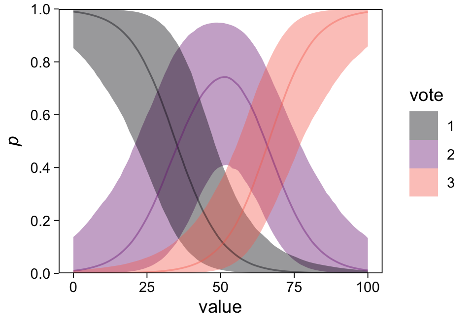

Chapter 15: Other generalized linear models
================
A Solomon Kurz
2021-03-21

# Other generalized linear models

> We can apply the principle of logistic regression—taking a linear
> “link function” *y* = *a* + *b**x* and extending it through a
> nonlinear transformation and a probability model–to allow it to
> predict bounded or discrete data of different forms. This chapter
> presents this generalized linear modeling framework and goes through
> several important special cases, including Poisson or negative
> binomial regression for count data, the logistic-binomial and probit
> models, ordered logistic regression, robust regression, and some
> extensions. (p. 263)

## 15.1 Definition and notation

The *generalized linear modeling* framework involves (or may involve)

-   a vector of data for some criterion *y*,
-   a matrix of *X* predictors and their corresponding *β* coefficients,
-   a link function *g*, and
-   a probability distribution for the criterion (also called a
    likelihood).

### 15.1.1 Fitting generalized linear models in R.

We can fit all of the models to come with **brms**, which offers a wide
variety of modeling options. To get a sense, check out the
[*Parameterization of response distributions in
brms*](https://cran.r-project.org/web/packages/brms/vignettes/brms_families.html)
vignette.

## 15.2 Poisson and negative binomial regression

The Poisson and negative binomial likelihoods are commonly used to model
count data.

### 15.2.1 Poisson model.

> The simplest regression model for count data is,
>
> *y*<sub>*i*</sub> ∼ Poisson (*e*<sup>*X*<sub>*i*</sub>*β*</sup>),
>
> so that the linear predictor *X*<sub>*i*</sub>*β* is the logarithm of
> the expected value of measurement *y*<sub>*i*</sub>. Under the Poisson
> model, $\\operatorname{sd}(y\_i) = \\sqrt{\\operatorname E(y\_i)}$;
> thus if the model accurately describes the data, we also have a sense
> of how much variation we would expect from the fitted curve.
> (pp. 264–265)

We can simulate data using the Poisson likelihood with the `rpois()`
function.

``` r
library(tidyverse)

# how many do you want?
n <- 50

# set the population parameters
a <- 1
b <- 2

# simulate
set.seed(15)

fake <- 
  tibble(x = runif(n, -2, 2)) %>% 
  mutate(y = rpois(n, lambda = exp(a + b * x)))

# what did we do?
head(fake)
```

    ## # A tibble: 6 x 2
    ##        x     y
    ##    <dbl> <int>
    ## 1  0.408     7
    ## 2 -1.22      0
    ## 3  1.87    121
    ## 4  0.604     7
    ## 5 -0.532     2
    ## 6  1.96    139

The key to fitting a Poisson regression model with **brms** is to set
`family = poisson`. By default, this uses the conventional log link.

``` r
library(brms)

m15.1 <-
  brm(data = fake,
      family = poisson,
      y ~ x,
      seed = 15,
      file = "fits/m15.01")
```

Check the parameter summary.

``` r
print(m15.1, robust = T)
```

    ##  Family: poisson 
    ##   Links: mu = log 
    ## Formula: y ~ x 
    ##    Data: fake (Number of observations: 50) 
    ## Samples: 4 chains, each with iter = 2000; warmup = 1000; thin = 1;
    ##          total post-warmup samples = 4000
    ## 
    ## Population-Level Effects: 
    ##           Estimate Est.Error l-95% CI u-95% CI Rhat Bulk_ESS Tail_ESS
    ## Intercept     1.15      0.10     0.97     1.34 1.00      819     1051
    ## x             1.93      0.06     1.81     2.05 1.00      841     1047
    ## 
    ## Samples were drawn using sampling(NUTS). For each parameter, Bulk_ESS
    ## and Tail_ESS are effective sample size measures, and Rhat is the potential
    ## scale reduction factor on split chains (at convergence, Rhat = 1).

We can make our version of Figure 15.1 with `conditional_effects()` and
a little follow-up **ggplot2** adjustment.

``` r
# set the global plotting theme
theme_set(theme_linedraw() +
            theme(panel.grid = element_blank()))

ce <- conditional_effects(m15.1)

plot(ce,
     points = T, 
     point_args = list(size = 1/2),
     plot = F)[[1]] +
  scale_y_continuous(expand = expansion(mult = c(0, 0.05)), limits = c(-1, 200)) +
  labs(subtitle = "Simulated data from Poisson regression")
```


> The Poisson distribution has its own internal scale of variation:
> unlike with the normal distribution, there is no `sigma` parameter to
> be fit. From the Poisson distribution, we would expect the variation
> on the order of $\\sqrt{\\operatorname E(y)}$: for example, where
> expected number of counts is 10, prediction errors should be mostly in
> the range  ± 3, where expected number of counts is 100, prediction
> errors should be mostly in the range  ± 10, and so on. (p. 265)

### 15.2.2 Overdispersion and underdispersion.

“Overdispersion and underdispersion refer to data that show more or less
variation than expected based on a fitted probability model” (p. 266).

### 15.2.3 Negative binomial model for overdispersion.

> To generalize the Poisson model to allow for overdispersion, we use
> the *negative binomial*–a probability distribution whose name comes
> from a sampling procedure that we do not discuss here–which includes
> an additional “reciprocal dispersion” parameter *ϕ* so that
> $\\operatorname{sd}(y \| x) = \\sqrt{\\operatorname E(y \| x) + \\operatorname E(y \| x)^2 / \\phi}$.
> In this parameterization, the parameter *ϕ* is restricted to be
> positive, with lower values corresponding to more overdispersion, and
> the limit *ϕ* → ∞ representing the Poisson model (that is, zero
> overdispersion). (p. 266, *emphasis* in the original)

Instead of repeating the for-loop code from Gelman et al, we’ll take a
nested tibble approach to fitting these three negative binomial models.
First, we’ll compile a negative binomial model of the same form they
will all take. Take special note of (a) how we set
`family = negbinomial` and (b) how `chains = 0`. The former is how we
instruct **brms** to fit a negative binomial model using the
conventional log link. The latter will instruct **brms** to only compile
the model without taking any samples. We’ll take those in a bit.

``` r
m15.2 <- 
  brm(data = fake, 
      family = negbinomial,
      y ~ x, 
      chains = 0,
      file = "fits/m15.02")
```

Now define our three population-level *ϕ* parameters. Then use those to
define the `y_nb` data. In the `nest()` line, we convert the data frame
to a nested tibble. In the second `mutate()` line, we fit three models,
one for each of the levels of `phi`.

``` r
set.seed(15)

nb_fits <-
  fake %>% 
  expand(nesting(x, y), phi = c(0.1, 1, 10)) %>% 
  mutate(y_nb = MASS::rnegbin(n(), mu = exp(a + b * x), theta = phi)) %>% 
  nest(data = c(x, y, y_nb)) %>% 
  mutate(fit = map(data, ~update(m15.2,
                                 newdata = .,
                                 formula = y_nb ~ x,
                                 seed = 15)))
```

What have we done?

``` r
nb_fits
```

    ## # A tibble: 3 x 3
    ##     phi data              fit      
    ##   <dbl> <list>            <list>   
    ## 1   0.1 <tibble [50 × 3]> <brmsfit>
    ## 2   1   <tibble [50 × 3]> <brmsfit>
    ## 3  10   <tibble [50 × 3]> <brmsfit>

Here’s how we might inspect the model summaries when they’re saved in a
nested tibble.

``` r
nb_fits$fit[1:3] %>% print()
```

    ## [[1]]
    ##  Family: negbinomial 
    ##   Links: mu = log; shape = identity 
    ## Formula: y_nb ~ x 
    ##    Data: . (Number of observations: 50) 
    ## Samples: 4 chains, each with iter = 2000; warmup = 1000; thin = 1;
    ##          total post-warmup samples = 4000
    ## 
    ## Population-Level Effects: 
    ##           Estimate Est.Error l-95% CI u-95% CI Rhat Bulk_ESS Tail_ESS
    ## Intercept     0.68      0.57    -0.32     1.92 1.00     2998     2184
    ## x             2.68      0.62     1.62     4.09 1.00     2436     1745
    ## 
    ## Family Specific Parameters: 
    ##       Estimate Est.Error l-95% CI u-95% CI Rhat Bulk_ESS Tail_ESS
    ## shape     0.10      0.03     0.05     0.18 1.00     2861     2287
    ## 
    ## Samples were drawn using sampling(NUTS). For each parameter, Bulk_ESS
    ## and Tail_ESS are effective sample size measures, and Rhat is the potential
    ## scale reduction factor on split chains (at convergence, Rhat = 1).
    ## 
    ## [[2]]
    ##  Family: negbinomial 
    ##   Links: mu = log; shape = identity 
    ## Formula: y_nb ~ x 
    ##    Data: . (Number of observations: 50) 
    ## Samples: 4 chains, each with iter = 2000; warmup = 1000; thin = 1;
    ##          total post-warmup samples = 4000
    ## 
    ## Population-Level Effects: 
    ##           Estimate Est.Error l-95% CI u-95% CI Rhat Bulk_ESS Tail_ESS
    ## Intercept     1.10      0.22     0.70     1.53 1.00     2619     2538
    ## x             1.93      0.20     1.55     2.34 1.00     2556     2545
    ## 
    ## Family Specific Parameters: 
    ##       Estimate Est.Error l-95% CI u-95% CI Rhat Bulk_ESS Tail_ESS
    ## shape     0.99      0.26     0.56     1.56 1.00     2683     2648
    ## 
    ## Samples were drawn using sampling(NUTS). For each parameter, Bulk_ESS
    ## and Tail_ESS are effective sample size measures, and Rhat is the potential
    ## scale reduction factor on split chains (at convergence, Rhat = 1).
    ## 
    ## [[3]]
    ##  Family: negbinomial 
    ##   Links: mu = log; shape = identity 
    ## Formula: y_nb ~ x 
    ##    Data: . (Number of observations: 50) 
    ## Samples: 4 chains, each with iter = 2000; warmup = 1000; thin = 1;
    ##          total post-warmup samples = 4000
    ## 
    ## Population-Level Effects: 
    ##           Estimate Est.Error l-95% CI u-95% CI Rhat Bulk_ESS Tail_ESS
    ## Intercept     1.04      0.14     0.76     1.31 1.00     1599     1840
    ## x             1.94      0.11     1.73     2.16 1.00     1634     1786
    ## 
    ## Family Specific Parameters: 
    ##       Estimate Est.Error l-95% CI u-95% CI Rhat Bulk_ESS Tail_ESS
    ## shape    11.07      4.90     4.61    23.49 1.00     2466     2158
    ## 
    ## Samples were drawn using sampling(NUTS). For each parameter, Bulk_ESS
    ## and Tail_ESS are effective sample size measures, and Rhat is the potential
    ## scale reduction factor on split chains (at convergence, Rhat = 1).

Here’s how we might make and combine the three panels of Figure 15.2.

``` r
# left, phi = 0.1
ce <-
  nb_fits$fit[[1]] %>% 
  conditional_effects()

p1 <-
  plot(ce,
       points = T,
       point_args = list(size = 1/2),
       plot = F)[[1]] +
  scale_y_continuous(expand = expansion(mult = c(0, 0.05))) +
  labs(subtitle = expression(phi==0.1))

# middle, phi = 1
ce <-
  nb_fits$fit[[2]] %>% 
  conditional_effects()

p2 <-
  plot(ce,
       points = T,
       point_args = list(size = 1/2),
       plot = F)[[1]] +
  scale_y_continuous(NULL, breaks = NULL,
                     expand = expansion(mult = c(0, 0.05))) +
  labs(subtitle = expression(phi==1))

# right, phi = 10
ce <-
  nb_fits$fit[[3]] %>% 
  conditional_effects()

p3 <-
  plot(ce,
       points = T,
       point_args = list(size = 1/2),
       plot = F)[[1]] +
  scale_y_continuous(NULL, breaks = NULL,
                     expand = expansion(mult = c(0, 0.05))) +
  labs(subtitle = expression(phi==10))

# combine
library(patchwork)

(
  (p1 + p2 + p3) &
  coord_cartesian(ylim = c(-1, 200))
) + plot_annotation(title = "Simulated data from overdispersed Poisson (negative binomial) regression")
```


### 15.2.4 Interpreting Poisson or negative binomial regression coefficients.

“The coefficients *β* in a logarithmic regression model can be
exponentiated and treated as multiplicative effects” (p. 267).

### 15.2.5 Exposure.

> In most applications of count-data regression, there is a baseline or
> *exposure*… We can model *y*<sub>*i*</sub> as the number of cases in a
> process with rate *θ*<sub>*i*</sub> and exposure *u*<sub>*i*</sub> .
>
> *y*<sub>*i*</sub> ∼ negativebinomial (*u*<sub>*i*</sub>, *θ*<sub>*i*</sub>, *ϕ*),
>
> where, as before,
> *θ*<sub>*i*</sub> = *e*<sup>*X*<sub>*i*</sub>*β*</sup>. Expression
> (15.2) includes Poisson regression as the special case of *ϕ* → ∞,
>
> The logarithm of the exposure, log (*u*<sub>*i*</sub>), is called the
> *offset* in generalized linear model terminology. The regression
> coefficients *β* now reflect the associations between the predictors
> and *θ*<sub>*i*</sub>. (p. 267, *emphasis* in the original)

### 15.2.6 Including log(exposure) as a predictor in a Poisson or negative binomial regression.

> Putting the logarithm of the exposure into the model as an offset, as
> in model (15.2), is equivalent to including it as a regression
> predictor, but with its coefficient fixed to the value 1; see Exercise
> 15.2. Another option is to include it as a predictor and let its
> coefficient be estimated from the data. (p. 268)

Both options are possible with **brms**.

### 15.2.7 Differences between the binomial and Poisson or negative binomial models.

### 15.2.8 Example: zeroes in count data.

Load the `roaches.csv` data and make the `roach100` variable.

``` r
roaches <- 
  read_csv("ROS-Examples-master/Roaches/data/roaches.csv", 
           col_types = cols(X1 = col_skip())) %>% 
  mutate(roach100 = roach1 / 100)

glimpse(roaches)
```

    ## Rows: 262
    ## Columns: 6
    ## $ y         <dbl> 153, 127, 7, 7, 0, 0, 73, 24, 2, 2, 0, 21, 0, 179, 136, 104, 2, 5, 1, 203, 32, 1…
    ## $ roach1    <dbl> 308.00, 331.25, 1.67, 3.00, 2.00, 0.00, 70.00, 64.56, 1.00, 14.00, 138.25, 16.00…
    ## $ treatment <dbl> 1, 1, 1, 1, 1, 1, 1, 1, 0, 0, 0, 0, 0, 0, 0, 0, 0, 0, 0, 0, 0, 0, 0, 0, 0, 0, 0,…
    ## $ senior    <dbl> 0, 0, 0, 0, 0, 0, 0, 0, 0, 0, 0, 0, 0, 0, 0, 0, 0, 0, 0, 0, 0, 0, 0, 0, 0, 0, 0,…
    ## $ exposure2 <dbl> 0.8000000, 0.6000000, 1.0000000, 1.0000000, 1.1428571, 1.0000000, 0.8000000, 1.1…
    ## $ roach100  <dbl> 3.0800, 3.3125, 0.0167, 0.0300, 0.0200, 0.0000, 0.7000, 0.6456, 0.0100, 0.1400, …

Now fit our first count model with an offset,

$$
\\begin{align\*}
y\_i & \\sim \\operatorname{negative binomial}(u\_i, \\theta\_i, \\phi) \\\\
u\_i & = \\log(\\text{exposure2}\_i) \\\\
\\log(\\theta\_i) & = \\beta\_0 + \\beta\_1 \\text{roach100}\_i + \\beta\_2 \\text{treatment}\_i + \\beta\_3 \\text{senior}\_i \\\\
\\phi & = \\eta\_0,
\\end{align\*}
$$

where the coefficient for the *u*<sub>*i*</sub> offset is defined as 1,
rather than estimated from the data. With **brms**, one defines an
offset in this way by inserting the relevant variable within the
`offset()` function, which is included in the right-hand side of the
model `formula`.

``` r
m15.3 <- 
  brm(data = roaches, 
      family = negbinomial,
      y ~ roach100 + treatment + senior + offset(log(exposure2)), 
      seed = 15,
      file = "fits/m15.03")
```

Review the parameter summary.

``` r
print(m15.3, robust = T)
```

    ##  Family: negbinomial 
    ##   Links: mu = log; shape = identity 
    ## Formula: y ~ roach100 + treatment + senior + offset(log(exposure2)) 
    ##    Data: roaches (Number of observations: 262) 
    ## Samples: 4 chains, each with iter = 2000; warmup = 1000; thin = 1;
    ##          total post-warmup samples = 4000
    ## 
    ## Population-Level Effects: 
    ##           Estimate Est.Error l-95% CI u-95% CI Rhat Bulk_ESS Tail_ESS
    ## Intercept     2.84      0.24     2.38     3.34 1.00     4912     2660
    ## roach100      1.31      0.25     0.86     1.88 1.00     4363     2871
    ## treatment    -0.78      0.25    -1.27    -0.30 1.00     3975     2650
    ## senior       -0.34      0.27    -0.85     0.22 1.00     4616     2757
    ## 
    ## Family Specific Parameters: 
    ##       Estimate Est.Error l-95% CI u-95% CI Rhat Bulk_ESS Tail_ESS
    ## shape     0.27      0.02     0.22     0.32 1.00     4770     2974
    ## 
    ## Samples were drawn using sampling(NUTS). For each parameter, Bulk_ESS
    ## and Tail_ESS are effective sample size measures, and Rhat is the potential
    ## scale reduction factor on split chains (at convergence, Rhat = 1).

Since the *u*<sub>*i*</sub> coefficient is set to 1, we don’t even get a
summary for it in the model. The summaries for *ϕ* are displayed in the
`shape` row. These are the reciprocal of the overdispersion parameter.
We can use `posterior_samples()` and some wrangling to inspect the
overdispersion parameter in a plot.

``` r
library(tidybayes)

posterior_samples(m15.3) %>% 
  mutate(od = 1 / shape) %>% 
  ggplot(aes(x = od, y = 0)) +
  stat_halfeye(.width = .95) +
  scale_y_continuous(NULL, breaks = NULL) +
  xlab(expression(overdispersion~parameter~(1/phi)))
```


#### 15.2.8.1 Checking model fit by comparing the data, *y*, to replicated datasets, *y*<sup>rep</sup>.

Normally, we’d make a plot like Figure 15.3b with `brms::pp_check()`.
However, I’m not aware of a simple way to transform the *x*-axis to the
log<sub>10</sub> + 1 scale. Thus, we’ll follow a workflow like in the
text and do things by hand. First, ectrace 100 simulated data sets of
the same sample size as the original `roaches` data.

``` r
set.seed(15)

y_rep_1 <- posterior_predict(m15.3, nsamples = 100)

str(y_rep_1)
```

    ##  num [1:100, 1:262] 0 3 68 15 0 ...
    ##  - attr(*, "dimnames")=List of 2
    ##   ..$ : NULL
    ##   ..$ : NULL

Now use the `ppc_dens_overlay()` function from **bayesplot**.

``` r
library(bayesplot)

p1 <-
  ppc_dens_overlay(log10(roaches$y + 1), log10(y_rep_1 + 1)) +
  labs(subtitle = "negative−binomial",
       x = "log10(y+1)")

p1
```


Here we test the proportion of counts at zero, within a given
simulation.

``` r
# make a function
test <- function (y) { 
  mean(y == 0)
}

# apply the function to the simulations
test_rep_1 <- apply(y_rep_1, 1, test)

# summarize
test_rep_1 %>% 
  mean_qi(.width = c(1, .8)) %>% 
  mutate_if(is.double, round, digits = 2)
```

    ##      y ymin ymax .width .point .interval
    ## 1 0.34 0.22 0.45    1.0   mean        qi
    ## 2 0.34 0.29 0.39    0.8   mean        qi

Across the simulations the mean proportion *y* = 0 was 0.34, with a
range of \[0.22, 0.45\] and a percentile-based 80% interval of
\[0.29, 0.39\]. The observed proportion of zero’s is 0.36.

``` r
roaches %>% 
  summarise(observed_proportion_zero = mean(y == 0) %>% round(digits = 2))
```

    ## # A tibble: 1 x 1
    ##   observed_proportion_zero
    ##                      <dbl>
    ## 1                     0.36

However, the maximum counts in the replications are high.

``` r
test_rep_1 <- apply(y_rep_1, 1, max)

# summarize
test_rep_1 %>% 
  mean_qi(.width = 1) %>% 
  mutate_if(is.double, round, digits = 2)
```

    ##         y ymin   ymax .width .point .interval
    ## 1 11945.4  275 129631      1   mean        qi

The average maximum count across the replications is 11,945, with the
highest valuess amonb the replications as 129,631. These are
staggeringly larger than the observed maximum.

``` r
roaches %>% 
  summarise(observed_maximum. = max(y))
```

    ## # A tibble: 1 x 1
    ##   observed_maximum.
    ##               <dbl>
    ## 1               357

#### 15.2.8.2 What if we had used Poisson regression?

The `offset()` function works for Poisson models just the way it does
for negative binomial models.

``` r
m15.4 <- 
  brm(data = roaches, 
      family = poisson,
      y ~ roach100 + treatment + senior + offset(log(exposure2)), 
      seed = 15,
      file = "fits/m15.04")
```

Review the parameter summary.

``` r
print(m15.4, robust = T)
```

    ##  Family: poisson 
    ##   Links: mu = log 
    ## Formula: y ~ roach100 + treatment + senior + offset(log(exposure2)) 
    ##    Data: roaches (Number of observations: 262) 
    ## Samples: 4 chains, each with iter = 2000; warmup = 1000; thin = 1;
    ##          total post-warmup samples = 4000
    ## 
    ## Population-Level Effects: 
    ##           Estimate Est.Error l-95% CI u-95% CI Rhat Bulk_ESS Tail_ESS
    ## Intercept     3.09      0.02     3.05     3.13 1.00     3891     3093
    ## roach100      0.70      0.01     0.68     0.72 1.00     3689     3101
    ## treatment    -0.52      0.02    -0.57    -0.47 1.00     3869     2684
    ## senior       -0.38      0.03    -0.45    -0.31 1.00     4052     2850
    ## 
    ## Samples were drawn using sampling(NUTS). For each parameter, Bulk_ESS
    ## and Tail_ESS are effective sample size measures, and Rhat is the potential
    ## scale reduction factor on split chains (at convergence, Rhat = 1).

#### 15.2.8.3 Checking the fit of the non-overdispersed Poisson regression.

Again use the `ppc_dens_overlay()` function to complete Figure 15.3.

``` r
# simulate
set.seed(15)

y_rep_2 <- posterior_predict(m15.4, nsamples = 100)

# define the first subplot
p2 <-
  ppc_dens_overlay(log10(roaches$y + 1), log10(y_rep_2 + 1)) +
  labs(subtitle = "Poisson",
       x = "log10(y+1)")

# combine
p2 + p1 + plot_layout(guides = "collect")
```


The Poisson fit looks awful. Unlike the observed data, the simulated
Poisson data almost never have zero values.

``` r
# observed
mean(roaches$y == 0)
```

    ## [1] 0.3587786

``` r
# Poisson simulations
mean(y_rep_2 == 0)
```

    ## [1] 0.0005725191

Here’s the range for the Poisson simulations.

``` r
apply(y_rep_2, 1, test) %>% range()
```

    ## [1] 0.000000000 0.003816794

## 15.3 Logistic-binomial model

We can apply the logistic-binomial model when the multiple 0/1 trials
are aggregated into each cell of the data. Here we simulate some.

``` r
# how many do you want?
n <- 100

# simulate
set.seed(15)

data <-
  tibble(size   = 20,
         height = rnorm(n, mean = 72, sd = 3)) %>% 
  mutate(y = rbinom(n, size = size, p = 0.4 + 0.1 * (height - 72) / 3))

# take a look
head(data)
```

    ## # A tibble: 6 x 3
    ##    size height     y
    ##   <dbl>  <dbl> <int>
    ## 1    20   72.8     8
    ## 2    20   77.5    11
    ## 3    20   71.0     7
    ## 4    20   74.7    11
    ## 5    20   73.5     6
    ## 6    20   68.2     7

The `size` column tells us that the numbers in the `y` column are all
out of 20 trials. We might look at the data with a couple plots.

``` r
# marginal distribution
p1 <-
  data %>% 
  ggplot(aes(x = y)) +
  geom_bar() +
  scale_x_continuous(expand = c(0, 0), limits = c(0, 20)) +
  coord_flip() +
  theme_void()

# scatter plot
p2 <-
  data %>% 
  ggplot(aes(x = height, y = y)) +
  geom_point() +
  scale_y_continuous(expand = c(0, 0), limits = c(0, 20))

# combine
p2 + p1 + plot_layout(widths = c(4, 1))
```


To fit a logistic-binomial model with **brms**, we augment the
`<criterion> | trials()` syntax where the value that goes in the
`trials()` function is either a fixed number or variable in the data
indexing *n*. In this case, we’ll feed the `size` column into the
`trials()` function. Hover, given that *n* = 20 for all cases in the
data, we would get the same results by hand-coding `trials(20)`.

``` r
m15.5 <- 
  brm(data = data, 
      family = binomial,
      y | trials(size) ~ height,
      seed = 15,
      file = "fits/m15.05")
```

Check the summary.

``` r
print(m15.5, robust = T)
```

    ##  Family: binomial 
    ##   Links: mu = logit 
    ## Formula: y | trials(size) ~ height 
    ##    Data: data (Number of observations: 100) 
    ## Samples: 4 chains, each with iter = 2000; warmup = 1000; thin = 1;
    ##          total post-warmup samples = 4000
    ## 
    ## Population-Level Effects: 
    ##           Estimate Est.Error l-95% CI u-95% CI Rhat Bulk_ESS Tail_ESS
    ## Intercept    -8.28      1.22   -10.49    -6.08 1.00     3693     2640
    ## height        0.11      0.02     0.08     0.14 1.00     3715     2714
    ## 
    ## Samples were drawn using sampling(NUTS). For each parameter, Bulk_ESS
    ## and Tail_ESS are effective sample size measures, and Rhat is the potential
    ## scale reduction factor on split chains (at convergence, Rhat = 1).

We might use `brms::fitted()` to plot the model expectations against the
data.

``` r
nd <- 
  tibble(size   = 20,
         height = seq(from = 60, to = 85, length.out = 100))

fitted(m15.5,
       newdata = nd,
       scale = "response") %>% 
  data.frame() %>% 
  bind_cols(nd) %>% 
  
  ggplot(aes(x = height)) +
  geom_ribbon(aes(ymin = Q2.5, ymax = Q97.5),
              alpha = 1/4) +
  geom_line(aes(y = Estimate)) +
  geom_point(data = data,
             aes(y = y)) +
  ylab("height") +
  coord_cartesian(xlim = range(data$height))
```


### 15.3.1 The binomial model for count data, applied to death sentences.

It does not appear the authors have provided a data file for this
example. It looks like this example has its origins in Gelman et al
(2004,
[here](http://stat.columbia.edu/~gelman/research/published/jels.pdf)).
You can download the data file and analysis notes from
<http://www.stat.columbia.edu/~gelman/arm/examples/death.sentences/>.
I’ve saved them on Github within the `death penalty data` folder.

``` r
death <- haven::read_sas("death penalty data/a14.sas7bdat", NULL)

# there are a lot of columns
dim(death)
```

    ## [1] 657 202

Here we simplify and reformat the data.

``` r
death <-
  death %>% 
  filter(TOTLDF >= 1) %>% 
  select(CNTRELF, TOTLDF, YEAR, STATE) %>% 
  rename_all(tolower) %>% 
  mutate(year1 = year - 1973 + 1,
         year_c = year - 1984)

head(death)
```

    ## # A tibble: 6 x 6
    ##   cntrelf totldf  year state year1 year_c
    ##     <dbl>  <dbl> <dbl> <chr> <dbl>  <dbl>
    ## 1       2      3  1976 al        4     -8
    ## 2      12     20  1977 al        5     -7
    ## 3      20     22  1978 al        6     -6
    ## 4       9     16  1979 al        7     -5
    ## 5       4      8  1980 al        8     -4
    ## 6      12     16  1981 al        9     -3

Here’s how to fit the model with an overall linear effect for time and
33 state-specific deviations from a reference state (`state == 'al'`,
Alabama).

``` r
m15.6 <- 
  brm(data = death, 
      family = binomial,
      cntrelf | trials(totldf) ~ state + year_c,
      seed = 15,
      file = "fits/m15.06")
```

Check the summary.

``` r
print(m15.6, robust = T)
```

    ##  Family: binomial 
    ##   Links: mu = logit 
    ## Formula: cntrelf | trials(totldf) ~ state + year_c 
    ##    Data: death (Number of observations: 519) 
    ## Samples: 4 chains, each with iter = 2000; warmup = 1000; thin = 1;
    ##          total post-warmup samples = 4000
    ## 
    ## Population-Level Effects: 
    ##           Estimate Est.Error l-95% CI u-95% CI Rhat Bulk_ESS Tail_ESS
    ## Intercept     0.18      0.13    -0.07     0.45 1.01      461      959
    ## statear      -0.29      0.28    -0.88     0.29 1.00     1543     2535
    ## stateaz      -0.47      0.20    -0.87    -0.10 1.00      913     1720
    ## stateca      -1.38      0.17    -1.74    -1.05 1.00      730     1459
    ## stateco      -0.59      0.77    -2.27     0.88 1.00     3835     2576
    ## statect      -0.49      1.35    -3.88     1.91 1.00     3535     1692
    ## statede      -1.52      0.62    -2.88    -0.39 1.00     2980     2735
    ## statefl       0.16      0.15    -0.16     0.45 1.01      571     1229
    ## statega      -0.24      0.19    -0.61     0.12 1.00      723     1453
    ## stateid      -0.60      0.42    -1.43     0.19 1.00     3788     2922
    ## stateil      -0.30      0.20    -0.69     0.07 1.00      777     1527
    ## statein      -0.36      0.28    -0.91     0.20 1.00     1634     2269
    ## stateky      -0.44      0.31    -1.07     0.17 1.00     1947     2690
    ## statela      -0.31      0.23    -0.76     0.16 1.00     1144     2363
    ## statemd       1.08      0.35     0.41     1.80 1.00     2045     2818
    ## statemo      -1.55      0.29    -2.15    -0.98 1.00     1829     2452
    ## statems       0.79      0.25     0.28     1.25 1.00     1245     2053
    ## statemt      -0.64      0.77    -2.16     0.93 1.00     4256     2853
    ## statenc       0.59      0.19     0.21     0.94 1.00      865     1326
    ## statene      -0.88      0.52    -1.91     0.17 1.00     3713     2750
    ## statenj       1.33      0.38     0.59     2.10 1.00     2369     2336
    ## statenm      -1.64      0.93    -3.69    -0.04 1.00     3728     1959
    ## statenv      -0.78      0.26    -1.31    -0.25 1.00     1515     2337
    ## stateoh      -1.31      0.26    -1.83    -0.84 1.00     1109     1839
    ## stateok      -0.24      0.20    -0.65     0.15 1.00      993     1462
    ## stateor       1.42      0.43     0.61     2.26 1.00     3287     2900
    ## statepa      -0.96      0.20    -1.36    -0.55 1.00      981     2153
    ## statesc       0.34      0.23    -0.13     0.79 1.00      973     1832
    ## statetn      -0.75      0.25    -1.23    -0.28 1.00     1471     2352
    ## statetx      -1.08      0.16    -1.42    -0.77 1.01      628     1477
    ## stateut      -1.23      0.49    -2.18    -0.27 1.00     2261     2750
    ## stateva      -1.82      0.34    -2.51    -1.19 1.00     2322     2665
    ## statewa       0.20      0.59    -0.94     1.34 1.00     3604     2719
    ## statewy      -0.01      1.01    -2.03     2.23 1.00     4859     2576
    ## year_c       -0.19      0.01    -0.20    -0.17 1.00     5393     3215
    ## 
    ## Samples were drawn using sampling(NUTS). For each parameter, Bulk_ESS
    ## and Tail_ESS are effective sample size measures, and Rhat is the potential
    ## scale reduction factor on split chains (at convergence, Rhat = 1).

It might help to get a sense of these parameters with a few plots. First
we’ll plot the state-level probabilities, with `year_c` held constant at
0 (i.e., `year == 1984`). Then we’ll get a sense of the overall change
in probability over time.

``` r
# left
p1 <-
  posterior_samples(m15.6, add_chain = T) %>% 
  mutate(b_stateal = 0) %>% 
  pivot_longer(starts_with("b_state")) %>% 
  mutate(state = str_remove(name, "b_state")) %>% 
  mutate(p = inv_logit_scaled(b_Intercept + value)) %>% 
  group_by(state) %>% 
  mean_qi(p) %>% 
  
  ggplot(aes(x = p, xmin = .lower, xmax = .upper, y = reorder(state, p))) +
  geom_pointrange(fatten = 1, size = 1/4) +
  scale_x_continuous(expression(italic(p)), expand = c(0, 0), 
                     breaks = 0:5 / 5, limits = 0:1) +
  ylab(NULL) +
  theme(axis.text.y = element_text(hjust = 0, size = 6))

# right
p2 <-
  posterior_samples(m15.6, add_chain = T) %>% 
  expand(nesting(iter, b_year_c), year_c = -11:11) %>% 
  mutate(year = year_c + 1984,
         p = inv_logit_scaled(b_year_c * year_c)) %>% 
  
  ggplot(aes(x = year, y = p)) +
  stat_lineribbon(.width = .95, fill = "grey75", size = 1/2) +
  scale_y_continuous(expression(italic(p)), expand = c(0, 0), 
                     breaks = 0:5 / 5, limits = 0:1)

# combine
p1 + p2
```


We might further interrogate the model with a series of plots connecting
the model predictions to the underlying data. To simplify, we’ll just
focus on two states: my state of birth, Washington, and my current state
of residence, Texas. First, we plot the fitted intervals for number of
death sentences overturned, versus the observed values.

``` r
p1 <-
  fitted(m15.6, scale = "response") %>% 
  data.frame() %>% 
  bind_cols(death) %>% 
  filter(state %in% c("tx", "wa")) %>% 
  
  ggplot(aes(x = year)) +
  geom_linerange(aes(ymin = Q2.5, ymax = Q97.5),
                 size = 3, color = "grey67") +
  geom_point(aes(y = cntrelf),
             color = "red3") +
  ylab("# death sentences overturned") +
  theme(strip.background = element_blank(),
        strip.text = element_blank()) +
  facet_grid(state ~ .)
```

Second, we plot the fitted intervals for the probability of overturning
a death sentences, versus the observed values.

``` r
p2 <-
  fitted(m15.6, scale = "linear") %>% 
  inv_logit_scaled() %>% 
  data.frame() %>% 
  bind_cols(death) %>% 
  filter(state %in% c("tx", "wa")) %>% 
  
  ggplot(aes(x = year)) +
  geom_linerange(aes(ymin = Q2.5, ymax = Q97.5),
                 size = 3, color = "grey67") +
  geom_point(aes(y = cntrelf / totldf),
             color = "red3") +
  scale_y_continuous("probability overturning a death sentence",
                     breaks = 0:5 / 5) +
  theme(strip.background = element_blank(),
        strip.text = element_blank()) +
  facet_grid(state ~ .)
```

Third, we plot the observed number of cases and then combine all three
types of plot.

``` r
p3 <-
  death %>% 
  filter(state %in% c("tx", "wa")) %>% 
  
  ggplot(aes(x = year, y = totldf, label = totldf)) +
  geom_text(color = "red3", size = 2) +
  ylab("# of total death sentence cases") +
  facet_grid(state ~ .)

# combine
p1 + p2 + p3
```


At the end of this section, Gelmen et al commented: “In this sort of
problem we prefer to fit a multilevel model with a varying intercept for
state, but that is beyond the scope of this book” (p. 271). Here’s how
to fit such a model, which allows both intercepts and time slopes to
vary by state.

``` r
m15.7 <- 
  brm(data = death, 
      family = binomial,
      cntrelf | trials(totldf) ~ 1 + year_c + (1 + year_c | state),
      seed = 15,
      file = "fits/m15.07")
```

Check the summary.

``` r
print(m15.7, robust = T)
```

    ##  Family: binomial 
    ##   Links: mu = logit 
    ## Formula: cntrelf | trials(totldf) ~ 1 + year_c + (1 + year_c | state) 
    ##    Data: death (Number of observations: 519) 
    ## Samples: 4 chains, each with iter = 2000; warmup = 1000; thin = 1;
    ##          total post-warmup samples = 4000
    ## 
    ## Group-Level Effects: 
    ## ~state (Number of levels: 34) 
    ##                       Estimate Est.Error l-95% CI u-95% CI Rhat Bulk_ESS Tail_ESS
    ## sd(Intercept)             0.82      0.12     0.61     1.10 1.00     1289     1850
    ## sd(year_c)                0.09      0.02     0.06     0.13 1.00     1848     2457
    ## cor(Intercept,year_c)     0.05      0.25    -0.42     0.52 1.00     1817     2579
    ## 
    ## Population-Level Effects: 
    ##           Estimate Est.Error l-95% CI u-95% CI Rhat Bulk_ESS Tail_ESS
    ## Intercept    -0.21      0.16    -0.51     0.11 1.01      706     1519
    ## year_c       -0.19      0.02    -0.23    -0.15 1.00     1547     2479
    ## 
    ## Samples were drawn using sampling(NUTS). For each parameter, Bulk_ESS
    ## and Tail_ESS are effective sample size measures, and Rhat is the potential
    ## scale reduction factor on split chains (at convergence, Rhat = 1).

Here’s the updated posterior predictive check.

``` r
# left
p1 <-
  fitted(m15.7, scale = "response") %>% 
  data.frame() %>% 
  bind_cols(death) %>% 
  filter(state %in% c("tx", "wa")) %>% 
  
  ggplot(aes(x = year)) +
  geom_linerange(aes(ymin = Q2.5, ymax = Q97.5),
                 size = 3, color = "grey67") +
  geom_point(aes(y = cntrelf),
             color = "blue3") +
  ylab("# death sentences overturned") +
  theme(strip.background = element_blank(),
        strip.text = element_blank()) +
  facet_grid(state ~ .)

# middle
p2 <-
  fitted(m15.7, scale = "linear") %>% 
  inv_logit_scaled() %>% 
  data.frame() %>% 
  bind_cols(death) %>% 
  filter(state %in% c("tx", "wa")) %>% 
  
  ggplot(aes(x = year)) +
  geom_linerange(aes(ymin = Q2.5, ymax = Q97.5),
                 size = 3, color = "grey67") +
  geom_point(aes(y = cntrelf / totldf),
             color = "blue3") +
  scale_y_continuous("probability overturning a death sentence",
                     breaks = 0:5 / 5) +
  theme(strip.background = element_blank(),
        strip.text = element_blank()) +
  facet_grid(state ~ .)

# right
p3 <-
  death %>% 
  filter(state %in% c("tx", "wa")) %>% 
  
  ggplot(aes(x = year, y = totldf, label = totldf)) +
  geom_text(color = "blue3", size = 2) +
  ylab("# of total death sentence cases") +
  facet_grid(state ~ .)

# combine
p1 + p2 + p3
```


### 15.3.2 Overdispersion.

> When logistic regression is applied to count data, it is possible–in
> fact, usual–for the data to have more variation than is explained by
> the model. This overdispersion problem arises because the logistic
> regression model does not have a variance parameter *σ*.
>
> More specifically, if data *y* have a binomial distribution with
> parameters *n* and *p*, then the mean of *y* is *n**p* and the
> standard deviation of *y* is $\\sqrt{np (1 - p)}$ (p. 271)

When working within the single-level framework, the beta-binomial model
is a popular solution to overdispersion in binomial count data. Though
**brms** does not natively support the beta-binomial likelihood, one can
do so by defining a custom likelihood function, as demonstrated in the
[*Define custom response distributions with
brms*](https://cran.r-project.org/web/packages/brms/vignettes/brms_customfamilies.html#the-beta-binomial-distribution)
vignette.

### 15.3.3 Binary-data model as a special case of the count-data model.

“Overdispersion at the level of the individual data points cannot occur
in the binary model, which is why we did not introduce overdispersed
models in those earlier chapters” (p. 272).

### 15.3.4 Count-data model as a special case of the binary-data model.

One can expand the data from a logistic-binomial model to conventional
binary data with a little wrangling. Here we’ll practice with the `data`
data from the beginning of Section 15.3, above.

``` r
data_binary <-
  data %>% 
  mutate(binary = map2(y, size, ~ c(rep(1, times = .x), rep(0, times = .y - .x)))) %>% 
  unnest(binary) %>% 
  select(height, binary)

glimpse(data_binary)
```

    ## Rows: 2,000
    ## Columns: 2
    ## $ height <dbl> 72.77647, 72.77647, 72.77647, 72.77647, 72.77647, 72.77647, 72.77647, 72.77647, 72.…
    ## $ binary <dbl> 1, 1, 1, 1, 1, 1, 1, 1, 0, 0, 0, 0, 0, 0, 0, 0, 0, 0, 0, 0, 1, 1, 1, 1, 1, 1, 1, 1,…

I got this data-wrangling trick from alistaire’s answer to [this
question](https://stackoverflow.com/questions/56821928/how-to-de-aggregate-binomial-response-data-from-individuals-with-the-same-covari)
on Stack Overflow.

Now refit model `m15.5`, but with the conventional binary data +
logistic regression model approach.

``` r
m15.8 <- 
  brm(data = data_binary, 
      family = binomial,
      binary | trials(1) ~ height,
      seed = 15,
      file = "fits/m15.08")
```

Compare the results with those from the original logistic-binomial
model, `m15.5`.

``` r
fixef(m15.5, robust = T) %>% round(digits = 2)
```

    ##           Estimate Est.Error   Q2.5 Q97.5
    ## Intercept    -8.28      1.22 -10.49 -6.08
    ## height        0.11      0.02   0.08  0.14

``` r
fixef(m15.8, robust = T) %>% round(digits = 2)
```

    ##           Estimate Est.Error   Q2.5 Q97.5
    ## Intercept    -8.28      1.19 -10.58 -6.00
    ## height        0.11      0.02   0.08  0.14

They’re the same within a little simulation error.

## 15.4 Probit regression: normally distributed latent data

Probit regression is like logistic regression, but using the probit link
such that,

Pr (*y*<sub>*i*</sub> = 1) = *Φ*(*X*<sub>*i*</sub>*β*),

where *Φ* is the cumulative density function for the standard normal
distribution. We can express this using the latent-data formulation as

$$
\\begin{align\*}
y\_i & = \\left \\{
  \\begin{array}{@{}ll@{}}
    1 & \\text{if}\\ z\_i &gt; 0 \\\\
    0 & \\text{if}\\ z\_i &lt; 0
  \\end{array} \\right. \\\\
z\_i & = X\_i \\beta + \\epsilon\_i \\\\
\\epsilon\_i & \\sim \\operatorname N(0, 1).
\\end{align\*}
$$

### 15.4.1 Probit or logit?

Here’s a mash-up of Figure 13.5 and 15.4.

``` r
tibble(x = seq(from = -7, to = 7, length.out = 200)) %>% 
  mutate(l = dlogis(x, location = 0, scale = 1),
         n = dnorm(x, mean = 0, sd = 1.6)) %>% 
  
  ggplot(aes(x = x)) +
  geom_line(aes(y = l)) +
  geom_line(aes(y = n),
            color = "red3") +
  annotate(geom = "text",
           x = c(-1.2, 1.8), y = c(0.15, 0.15),
           label = c("logistic PDF", "N(0, 1.6) PDF"),
           color = c("black", "red3"), hjust = 0) +
  scale_x_continuous(NULL, breaks = -3:3 * 2, expand = c(0, 0)) +
  scale_y_continuous(NULL, breaks = NULL, expand = expansion(mult = c(0, 0.05))) +
  labs(subtitle = "Different probability density functions for binary regression")
```


Once again, load the `wells.csv` data.

``` r
wells <- read_csv("ROS-Examples-master/Arsenic/data/wells.csv")

glimpse(wells)
```

    ## Rows: 3,020
    ## Columns: 7
    ## $ switch  <dbl> 1, 1, 0, 1, 1, 1, 1, 1, 1, 1, 1, 1, 1, 1, 1, 1, 1, 1, 1, 1, 1, 1, 1, 1, 1, 1, 1, 1…
    ## $ arsenic <dbl> 2.36, 0.71, 2.07, 1.15, 1.10, 3.90, 2.97, 3.24, 3.28, 2.52, 3.13, 3.04, 2.91, 3.21…
    ## $ dist    <dbl> 16.826, 47.322, 20.967, 21.486, 40.874, 69.518, 80.711, 55.146, 52.647, 75.072, 29…
    ## $ dist100 <dbl> 0.16826, 0.47322, 0.20967, 0.21486, 0.40874, 0.69518, 0.80711, 0.55146, 0.52647, 0…
    ## $ assoc   <dbl> 0, 0, 0, 0, 1, 1, 1, 0, 1, 1, 1, 0, 1, 1, 1, 1, 0, 1, 1, 0, 1, 0, 1, 0, 0, 1, 0, 0…
    ## $ educ    <dbl> 0, 0, 10, 12, 14, 9, 4, 10, 0, 0, 5, 0, 0, 0, 0, 7, 7, 7, 0, 10, 7, 0, 5, 0, 8, 8,…
    ## $ educ4   <dbl> 0.00, 0.00, 2.50, 3.00, 3.50, 2.25, 1.00, 2.50, 0.00, 0.00, 1.25, 0.00, 0.00, 0.00…

Let’s first bring back model `m13.9` from Chapter 13.

``` r
m13.9 <-
  brm(data = wells,
      family = binomial,
      switch | trials(1) ~ dist100,
      seed = 13,
      file = "fits/m13.09")
```

Now fit the probit alternative by setting
`family = binomial(link = "probit")`.

``` r
m15.9 <-
  brm(data = wells,
      family = binomial(link = "probit"),
      switch | trials(1) ~ dist100,
      seed = 15,
      file = "fits/m15.09")
```

“Coefficients in a probit regression are typically close to logistic
regression coefficients divided by 1.6” (p. 272). Let’s see.

``` r
(fixef(m13.9, robust = T)[, -2] / 1.6) %>% round(digits = 2)  # logistic divided by 1.6
```

    ##           Estimate  Q2.5 Q97.5
    ## Intercept     0.38  0.30  0.45
    ## dist100      -0.39 -0.51 -0.27

``` r
fixef(m15.9, robust = T)[, -2] %>% round(digits = 2)  # probit
```

    ##           Estimate  Q2.5 Q97.5
    ## Intercept     0.38  0.30  0.45
    ## dist100      -0.39 -0.51 -0.27

Yep, the results of these two model types are really close after using
the 1.6 correction. For kicks and giggles, we might compare them by the
LOO.

``` r
m13.9 <- add_criterion(m13.9, criterion = "loo")
m15.9 <- add_criterion(m15.9, criterion = "loo")

loo_compare(m13.9, m15.9, criterion = "loo") %>% print(simplify = F)
```

    ##       elpd_diff se_diff elpd_loo se_elpd_loo p_loo   se_p_loo looic   se_looic
    ## m13.9     0.0       0.0 -2040.1     10.4         2.0     0.0   4080.3    20.8 
    ## m15.9     0.0       0.0 -2040.1     10.4         2.0     0.1   4080.3    20.8

They’re basically the same. Here are their fitted probability lines,
with respect to `dist100`.

``` r
# fitted()
nd <- tibble(dist100 = seq(from = 0, to = 3.5, length.out = 100))

f_m13.9 <- fitted(m13.9, newdata = nd)
f_m15.9 <- fitted(m15.9, newdata = nd)

# wrangle
cbind(rbind(f_m13.9, f_m15.9),
      rbind(nd, nd)) %>% 
  data.frame() %>% 
  mutate(link = rep(c("logit", "probit"), each = n() / 2)) %>% 
  
  # plot!
  ggplot(aes(x = dist100, y = Estimate, ymin = Q2.5, ymax = Q97.5, 
             color = link, fill = link)) +
  geom_ribbon(alpha = 1/2, size = 0) +
  geom_line() +
  scale_fill_viridis_d(option = "A", end = .67) +
  scale_color_viridis_d(option = "A", end = .67) +
  scale_x_continuous(expand = expansion(mult = c(0, 0.05))) +
  scale_y_continuous("Pr (switching)", breaks = 0:5 / 5, 
                     expand = c(0, 0), limits = 0:1) +
  theme(legend.position = c(.85, .75))
```


## 15.5 Ordered and unordered categorical regression

“Logistic and probit regression can be extended to multiple categories,
which can be ordered or unordered” (p. 273).

### 15.5.1 The ordered multinomial logit model.

> Consider a categorical outcome *y* that can take on the values
> 1, 2, …, *K*. The ordered logistic model can be written in two
> equivalent ways. First we express it as a series of logistic
> regressions:
>
> The parameters ck (which are called thresholds or *cutpoints*, for
> reasons that we shall explain shortly) are constrained to increase:
> 0 = *c*<sub>1</sub> &lt; *c*<sub>2</sub> &lt; … &lt; *c*<sub>*K* − 1</sub>
> , because the probabilities in (15.6) are strictly decreasing
> (assuming that all *K* outcomes have nonzero probabilities of
> occurring). Since *c*<sub>1</sub> is defined to be 0, the model with
> *K* categories has *K* − 2 free parameters *c*<sub>*k*</sub> in
> addition to *β*. This makes sense since *K* = 2 for the usual logistic
> regression, for which only *β* needs to be estimated….
>
> The expressions in (15.6) can be subtracted to get the probabilities
> of individual outcomes:
>
> <div style="text-align: right">
>
> (pp. 273–274, *emphasis* in the original)
>
> </div>

We might walk this out, a bit, for clarification. Say we have an
instance where *K* = 4. Here are their individual probabilities, which
do indeed sum to 1.

``` r
# define four probabilities
pk1 <- .25
pk2 <- .30
pk3 <- .35
pk4 <- .10

# sum them all
pk1 + pk2 + pk3 + pk4
```

    ## [1] 1

Say we want to compute Pr (*y* = 1). In this instance,
Pr (*y* &gt; *k* − 1) = 1 because *k* − 1 = 0 and all of our *K* values
are above 0 (they range from 1 to 4). To compute Pr (*y* &gt; *k*), we
can simply sum Pr (*y* = 2) + Pr (*y* = 3) + Pr (*y* = 4). Then we
subtract the first value from the second.

``` r
# this should equal pk1, which is .25
1 - (pk2 + pk3 + pk4)
```

    ## [1] 0.25

Using a similar workflow, here’s how we might compute Pr (*y* = 2).

``` r
# this should equal pk2, which is .30
(1 - pk1) - (pk3 + pk4)
```

    ## [1] 0.3

Here’s Pr (*y* = 3).

``` r
# this should equal pk3, which is .35
(1 - pk1 - pk2) - pk4
```

    ## [1] 0.35

Finally, here’s how we might compute Pr (*y* = 4).

``` r
# this should equal pk4, which is .10
(1 - pk1 - pk2 - pk3) - 0
```

    ## [1] 0.1

Note how Pr (*y* &gt; *k*) = 0 because our values for *K* only range
from 1 to 4, thus there is no chance we’ll have a value for *y* &gt; 4.

### 15.5.2 Latent variable interpretation with cutpoints.

> The ordered categorical model is easiest to understand by generalizing
> the latent variable formulation (13.5) to *K* categories:
>
> with independent errors *ϵ*<sub>*i*</sub> that have the logistic
> distribution. (p. 274)

To give a sense of how the cutpoints work, here’s our version of Figure
15.5.

``` r
# cutpoint lines
lines <-
  crossing(x  = c(0, 0.8, 1.8),
           xb = c(-0.7, 1.2, 2.8)) %>% 
  mutate(d     = dlogis(x, location = xb, scale = 0.4),
         facet = str_c("italic(X)*beta==", xb))

# densities
crossing(x  = seq(from = -4, to = 6, length.out = 201),
         xb = c(-0.7, 1.2, 2.8)) %>% 
  mutate(d     = dlogis(x, location = xb, scale = 0.4),
         facet = str_c("italic(X)*beta==", xb)) %>% 
  
  #  plot!
  ggplot(aes(x = x)) +
  geom_line(aes(y = d)) +
  geom_segment(data = lines,
               aes(xend = x, y = 0, yend = d),
               linetype = 2, size = 1/4) +
  scale_y_continuous(NULL, breaks = NULL,
                     expand = expansion(mult = c(0, 0.05)), limits = c(0, NA)) +
  xlab(expression(italic(z)==italic(X)*beta+epsilon)) +
  facet_wrap(~ facet, labeller = label_parsed)
```


“The lowest and highest categories in (15.7) are unbounded, so if the
linear predictor *X**β* is high enough, *y* will almost certainly take
on the highest possible value, and if *X**β* is low enough, *y* will
almost certainly equal the lowest possible value” (p. 274)

### 15.5.3 Example of ordered categorical regression.

Load the `2playergames.csv`, `3playergames.csv`, and `6playergames.csv`
data files.

``` r
# load the individual data files
data_2player <- read_csv("ROS-Examples-master/Storable/data/2playergames.csv")
data_3player <- read_csv("ROS-Examples-master/Storable/data/3playergames.csv")
data_6player <- read_csv("ROS-Examples-master/Storable/data/6playergames.csv")

# combine them
data_all <-
  bind_rows(data_2player, data_3player, data_6player) %>% 
  # make an ordered factor version of the vote variable
  mutate(factor_vote = factor(vote, 
                              levels = 1:3, 
                              labels = c("1", "2", "3"), 
                              ordered = T))

# take a look
glimpse(data_all)
```

    ## Rows: 2,509
    ## Columns: 10
    ## $ school      <dbl> 1, 1, 1, 1, 1, 1, 1, 1, 1, 1, 1, 1, 1, 1, 1, 1, 1, 1, 1, 1, 1, 1, 1, 1, 1, 1, …
    ## $ person      <dbl> 301, 301, 301, 301, 301, 301, 301, 301, 301, 301, 301, 301, 301, 301, 301, 301…
    ## $ round       <dbl> 1, 2, 3, 4, 5, 6, 7, 8, 9, 10, 11, 12, 13, 14, 15, 16, 17, 18, 19, 20, 21, 22,…
    ## $ proposal    <dbl> 1, 1, 1, 1, 1, 1, 1, 1, 1, 1, 1, 1, 1, 1, 1, 1, 1, 1, 1, 1, 1, 1, 1, 1, 1, 1, …
    ## $ value       <dbl> 61, 43, 6, 11, 99, 13, 21, 97, 16, 68, 53, 84, 35, 93, 36, 79, 70, 92, 9, 58, …
    ## $ vote        <dbl> 2, 2, 1, 1, 3, 1, 1, 3, 1, 2, 2, 3, 1, 3, 1, 3, 3, 3, 1, 2, 2, 2, 3, 3, 3, 1, …
    ## $ cutoff.12   <dbl> 40.145, 40.145, 40.145, 40.145, 40.145, 40.145, 40.145, 40.145, 40.145, 40.145…
    ## $ cutoff.23   <dbl> 71.465, 71.465, 71.465, 71.465, 71.465, 71.465, 71.465, 71.465, 71.465, 71.465…
    ## $ sd.logit    <dbl> 3.155500, 3.155500, 3.155500, 3.155500, 3.155500, 3.155500, 3.155500, 3.155500…
    ## $ factor_vote <ord> 2, 2, 1, 1, 3, 1, 1, 3, 1, 2, 2, 3, 1, 3, 1, 3, 3, 3, 1, 2, 2, 2, 3, 3, 3, 1, …

We aren’t ready to make the full version of Figure 15.6, but we can get
a sense of the data by making a partial version.

``` r
# 6 participants
plotted <- c(101, 303, 409, 405, 504, 112)

# participant descriptors
story <- c("Perfectly monotonic", "One fuzzy and one sharp cutpoint", "Monotonic with one outlier", 
           "Only 1's and 3's", "Almost only 3's", "Erratic")

# wrangle
data_all %>% 
  filter(person %in% plotted) %>% 
  mutate(person = factor(person,
                         levels = plotted,
                         labels = story)) %>%

  # plot!
  ggplot(aes(x = value, y = vote)) +
  geom_point(alpha = 1/2) +
  scale_y_continuous(breaks = 1:3) +
  facet_wrap(~ person)
```


#### 15.5.3.1 Three parameterizations of the ordered logistic model.

#### 15.5.3.2 Fitting the model in R.

In this section, we’ll be fitting the model for `person == 401`. Here’s
a look at their data.

``` r
data_all %>% 
  filter(person == 401) %>%
  ggplot(aes(x = value, y = vote)) +
  geom_point(alpha = 1/2) +
  scale_y_continuous(breaks = 1:3)
```


$$
\\begin{align\*}
\\operatorname{Pr}(y\_i = 1 \| z\_i) & = \\operatorname{logit}^{-1}(c\_1 - z\_i) \\\\
\\operatorname{Pr}(y\_i = 2 \| z\_i) & = \\operatorname{logit}^{-1}(c\_2 - z\_i) - \\operatorname{logit}^{-1}(c\_1 - z\_i) \\\\
\\operatorname{Pr}(y\_i = 3 \| z\_i) & = 1 - \\operatorname{logit}^{-1}(c\_2 - z\_i)
\\end{align\*}
$$

$$
\\begin{align\*}
\\operatorname{Pr}(y\_i = 1) & = \\operatorname{logit}^{-1}(c\_1 - X\_i \\beta) \\\\
\\operatorname{Pr}(y\_i = 2) & = \\operatorname{logit}^{-1}(c\_2 - X\_i \\beta) - \\operatorname{logit}^{-1}(c\_1 - X\_i \\beta) \\\\
\\operatorname{Pr}(y\_i = 3) & = 1 - \\operatorname{logit}^{-1}(c\_2 - X\_i \\beta)
\\end{align\*}
$$

**brms** allows for a variety of categorical models, all with the
`brm()` function. Though they didn’t spell it out as clearly as they
might have, Gelman et fit an ordered categorical model with the probit
link in this section of the text (their `fit_1`). For the **brms**
analogue, we set `family = cumulative(probit)`.

If you look closely at Gelman et al’s `fit_1`, you’ll note they set
`prior=R2(0.3, "mean")`. I’m not going to walk out the details for the
**rstanarm** `R2()` prior, but you can find them at
<https://mc-stan.org/rstanarm/reference/priors.html>. The important
thing to know is there is no corresponding prior for **brms**. To
compensate a little, we’ll set a weakly-regularizing N (0, 0.5) prior on
the coefficient for `value`.

``` r
m15.10 <-
  brm(data = data_all %>% filter(person == 401), 
      family = cumulative(logit),
      factor_vote ~ value,
      prior = prior(normal(0, 0.5), class = b),
      seed = 15,
      file = "fits/m15.10")
```

Review the summary.

``` r
print(m15.10, robust = T)
```

    ##  Family: cumulative 
    ##   Links: mu = logit; disc = identity 
    ## Formula: factor_vote ~ value 
    ##    Data: data_all %>% filter(person == 401) (Number of observations: 20) 
    ## Samples: 4 chains, each with iter = 2000; warmup = 1000; thin = 1;
    ##          total post-warmup samples = 4000
    ## 
    ## Population-Level Effects: 
    ##              Estimate Est.Error l-95% CI u-95% CI Rhat Bulk_ESS Tail_ESS
    ## Intercept[1]     4.61      1.71     1.75     8.79 1.00     1807     1479
    ## Intercept[2]     8.80      2.54     4.52    14.93 1.00     1188     1066
    ## value            0.13      0.04     0.07     0.22 1.00     1187     1128
    ## 
    ## Family Specific Parameters: 
    ##      Estimate Est.Error l-95% CI u-95% CI Rhat Bulk_ESS Tail_ESS
    ## disc     1.00      0.00     1.00     1.00 1.00     4000     4000
    ## 
    ## Samples were drawn using sampling(NUTS). For each parameter, Bulk_ESS
    ## and Tail_ESS are effective sample size measures, and Rhat is the potential
    ## scale reduction factor on split chains (at convergence, Rhat = 1).

The results for our **brms** model look a bit different from those
Gelman et al reported for their `fit_1`. I believe this is largely
because (a) of how small these data are (*n* = 20) and (b) the
differences in our priors. If you want to do so as a sanity check, refit
the model to the entire `data_all` data set using both **brms** and
**rstanarm**. You’ll see the results then converge very nicely. Another
point, though: notice how increadibly wide the posterior are for our
`Intercept[i]` parameters and the corresponding `Cutpoints` parameters
are on page 276. Even though our point estimates look very different,
there is a lot of overlap between our posterior and theirs.

Anyway, for **brms** models of this kind, the `Intercept[i]` rows in the
output are the cutpoints. Our `Intercept[1]` parameter corresponds to
Gelman et al’s `1|2` and our `Intercept[2]` corresponds to their `2|3`.
I’m not going to walk out the `disc` line in this output. But I will say
that you should notice that it’s acting as a constant, here. For
details, see Bürkner & Vuorre’s (2019) tutorial paper
([here](https://journals.sagepub.com/doi/10.1177/2515245918823199)).

As seen at the top of page 277, here’s how we might rescale our
parameters to the anternative parameterization.

``` r
posterior_samples(m15.10) %>% 
  transmute(`italic(c)[1.5]` = `b_Intercept[1]` / b_value,
            `italic(c)[2.5]` = `b_Intercept[2]` / b_value,
            sigma = 1 / b_value) %>% 
  pivot_longer(everything()) %>% 
  
  ggplot(aes(x = value, y = 0)) +
  stat_halfeye(.width = .95, normalize = "panels") +
  scale_y_continuous(NULL, breaks = NULL) +
  xlab("marginal posterior") +
  facet_wrap(~ name, scales = "free", labeller = label_parsed)
```


#### 15.5.3.3 Displaying the fitted model.

I’m going to expand this section.

First, here’s what we get with `brms::conditional_effects()`. Note our
use of `categorical = TRUE`.

``` r
conditional_effects(m15.10, categorical = T)
```


It can be instructive to help walk out how one might make such a plot
using the parameter draws from `posterior_samples()`.

``` r
posterior_samples(m15.10, add_chain = T) %>% 
  expand(nesting(iter, `b_Intercept[1]`, `b_Intercept[2]`, b_value),
         value = 0:100) %>% 
  mutate(mu = b_value * value) %>% 
  mutate(`1` = inv_logit_scaled(`b_Intercept[1]` - mu),
         `2` = inv_logit_scaled(`b_Intercept[2]` - mu) - inv_logit_scaled(`b_Intercept[1]` - mu),
         `3` = 1 - inv_logit_scaled(`b_Intercept[2]` - mu)) %>% 
  pivot_longer(`1`:`3`, values_to = "p", names_to = "vote") %>% 
  
  ggplot(aes(x = value, y = p, 
             color = vote, fill = vote)) +
  stat_lineribbon(.width = .95, size = 1/2, alpha = .4) +
  scale_fill_viridis_d(option = "A", end = .7) +
  scale_color_viridis_d(option = "A", end = .7) +
  scale_y_continuous(expression(italic(p)), expand = c(0, 0), 
                     breaks = 0:5 / 5, limits = 0:1)
```



We computed the probability trajectories for each of the *K* = 3
categories of `y` using the formulas

$$
\\begin{align\*}
\\operatorname{Pr}(y\_i = 1) & = \\operatorname{logit}^{-1}(c\_1 - X\_i \\beta) \\\\
\\operatorname{Pr}(y\_i = 2) & = \\operatorname{logit}^{-1}(c\_2 - X\_i \\beta) - \\operatorname{logit}^{-1}(c\_1 - X\_i \\beta) \\\\
\\operatorname{Pr}(y\_i = 3) & = 1 - \\operatorname{logit}^{-1}(c\_2 - X\_i \\beta),
\\end{align\*}
$$

where the last lines comes from the insight that
Pr (*y*<sub>*i*</sub> &gt; *k*) = 1 − Pr (*y*<sub>*i*</sub> ≤ *k*)
([see](https://stats.idre.ucla.edu/r/faq/ologit-coefficients/)). If
you’re curious where those formulas came from, execute `m15.10$model`
and study the Stan code within the `cumulative_logit_lpmf()` block. They
follow an alternative parameterization to the elements in the formula
Gelman et al presented in their Equation 15.11 (p. 277).

Also, if you look back at either of our last two plots, you might make
special notice where the trajectory for `y == 1` intersected with the
one for `y == 2` and where the trajectory for `y == 2` intersected with
the one for `y == 3` Using the posterior mean lines as our guides, those
happened at about 35 and 65 on the *x*-axis. It turns out that those
intersection points are the same as our *c*<sub>1.5</sub> and
*c*<sub>2.5</sub> parameters from the end of the last section.
Restricting ourselves to point estimates, here they are, again.

``` r
f <- fixef(m15.10)[, 1]

f[1] / f[3]
```

    ## Intercept[1] 
    ##     35.05487

``` r
f[2] / f[3]
```

    ## Intercept[2] 
    ##     66.20589

Now we can use that information to make a version of the plots in Figure
15.6, but for our `m15.10` model based on the data from `person == 401`.

``` r
# for the cutpoints
lines <-
  tibble(value = rep(c(f[1] / f[3], f[2] / f[3]), each = 2),
         vote = c(1, 2, 2, 3))

# wrangle
posterior_samples(m15.10, add_chain = T) %>% 
  expand(nesting(iter, `b_Intercept[1]`, `b_Intercept[2]`, b_value),
         value = 0:100) %>% 
  mutate(mu = b_value * value) %>% 
  mutate(p1 = inv_logit_scaled(`b_Intercept[1]` - mu),
         p2 = inv_logit_scaled(`b_Intercept[2]` - mu) - inv_logit_scaled(`b_Intercept[1]` - mu),
         p3 = 1 - inv_logit_scaled(`b_Intercept[2]` - mu)) %>% 
  mutate(vote = p1 * 1 + p2 * 2 + p3 * 3) %>% 
  
  # plot!
  ggplot(aes(x = value, y = vote)) +
  stat_lineribbon(.width = .95, size = 1/2, fill = "grey85") +
  geom_path(data = lines,
            aes(group = value),
            color = "red3") +
  geom_point(data = filter(data_all, person == 401),
             alpha = 1/2) +
  scale_y_continuous(breaks = 1:3) +
  ggtitle("Participant 401",
          subtitle = "One fuzzy and one sharp cutpoint") +
  theme(legend.position = c(.85, .2))
```


We marked off the point estimates for our cutpoints with the vertical
red lines.

Now we have a better sense of what’s going on, we might fit six more
models in preparation for our full version of 15.6. As a preparatory
step, we’ll first compile an adjusted version of `m15.10` that (a)
explicitly instructs `brm()` to fit two thresholds for each model (via
the `thres(2)` argument) and (b) puts a weakly-regularizing prior on the
thresholds (`prior(normal(0, 5), class = Intercept)`).

``` r
m15.11 <-
  brm(data = data_all %>% filter(person == 401),
      family = cumulative(logit),
      factor_vote | thres(2) ~ value,
      prior = c(prior(normal(0, 5), class = Intercept),
                prior(normal(0, 0.5), class = b)),
      chains = 0,
      seed = 15,
      file = "fits/m15.11")
```

Now use `update(fit15.11, ...)` to fit that model with the data of the
six participants highlighted in Figure 15.6. We’ll save the results in a
nested tibble called `ol_fits`.

``` r
ol_fits <-
  data_all %>% 
  # subset to the participants of interest
  filter(person %in% plotted) %>% 
  # nest the data
  nest(data = c(school, round, proposal, value, vote, cutoff.12, cutoff.23, sd.logit, factor_vote, value_c)) %>%
  # fit the models!
  mutate(fit = map(data, ~update(m15.11,
                                 newdata = .,
                                 factor_vote | thres(2) ~ value,
                                 seed = 15)))
```

Finally, we’re ready to make the full version of Figure 15.6.

``` r
# cutpoints
lines <-
  ol_fits %>% 
  mutate(post = map(fit, ~fixef(.) %>% 
                      data.frame() %>% 
                      rownames_to_column("parameter") %>% 
                      select(parameter, Estimate))) %>% 
  select(-data, -fit) %>% 
  unnest(post) %>% 
  pivot_wider(names_from = parameter, values_from = Estimate) %>% 
  mutate(c1 = `Intercept[1]` / value,
         c2 = `Intercept[2]` / value) %>% 
  expand(nesting(person, c1, c2),
         vote = c(1, 1.99, 2.01, 3)) %>% 
  mutate(value = if_else(vote < 2, c1, c2),
         person = factor(person,
                         levels = plotted,
                         labels = story))

# wrangle to get the fitted trajectories, by participant
ol_fits %>% 
  mutate(post = map(fit, ~posterior_samples(., add_chain = T))) %>% 
  select(-data, -fit) %>% 
  unnest(post) %>% 
  expand(nesting(person, iter, `b_Intercept[1]`, `b_Intercept[2]`, b_value),
         value = 0:100) %>% 
  mutate(mu = b_value * value) %>% 
  mutate(p1 = inv_logit_scaled(`b_Intercept[1]` - mu),
         p2 = inv_logit_scaled(`b_Intercept[2]` - mu) - inv_logit_scaled(`b_Intercept[1]` - mu),
         p3 = 1 - inv_logit_scaled(`b_Intercept[2]` - mu)) %>% 
  mutate(vote   = p1 * 1 + p2 * 2 + p3 * 3,
         person = factor(person,
                         levels = plotted,
                         labels = story)) %>% 
  
  # plot!
  ggplot(aes(x = value, y = vote)) +
  stat_lineribbon(.width = .95, size = 1/2, fill = "grey85") +
  geom_path(data = lines,
            aes(group = value),
            color = "red3") +
  geom_point(data = filter(data_all, person %in% plotted) %>% 
               mutate(person = factor(person,
                         levels = plotted,
                         labels = story)),
             alpha = 1/2) +
  scale_y_continuous(breaks = 1:3) +
  theme(legend.position = c(.85, .2)) +
  coord_cartesian(xlim = c(0, 100)) +
  facet_wrap(~ person)
```


Models like this are rough when the date with a given participants are
small and sparse. A more powerful and stable approach would be to fit a
multilevel model with the data from all participants, where you could
get the benefits of partial pooling.

### 15.5.4 Alternative approaches to modeling ordered categorical data.

Bürkner and Vuorre covered many of the alternative ways to model ordered
categorical data in their (2019) tutorial paper
([here](https://journals.sagepub.com/doi/10.1177/2515245918823199)).

### 15.5.5 Unordered categorical regression.

This is sometimes called (unordered) multinomial regression. It’s
possible in **brms** when using `family = categorical()`. McElreath
covered it in Section 11.3 in his (2020) text and Kruschke covered it in
Chapter 23 of his (2015) text.

## 15.6 Robust regression using the *t* model

### 15.6.1 The *t* distribution instead of the normal.

> When a regression model can have occasional very large errors, it is
> generally more appropriate to use a *t* distribution rather than a
> normal distribution for the errors… Regressions estimated using the
> *t* model are said to be *robust* in that the coefficient estimates
> are less influenced by individual outlying data points. (p. 278,
> *emphasis* in the original)

Gelman et al didn’t work through an example of a robust Stuent-*t* model
in the main portion of the text. However, they did recommend their
readers do so in their Exercise 15.8 (p. 287). To get a sense, we’ll
take their suggestion, which requires we load the `congress.csv` file.

``` r
congress <- read_csv("ROS-Examples-master/Congress/data/congress.csv")

head(congress)
```

    ## # A tibble: 6 x 9
    ##   inc86 inc88 inc90   v86   v88   v90 v86_adj v88_adj v90_adj
    ##   <dbl> <dbl> <dbl> <dbl> <dbl> <dbl>   <dbl>   <dbl>   <dbl>
    ## 1     1     1     1 0.745 0.772 0.714   0.745   0.772   0.714
    ## 2     1     1     1 0.674 0.636 0.597   0.674   0.636   0.597
    ## 3     1     1     0 0.696 0.665 0.521   0.696   0.665   0.521
    ## 4    -1    -1    -1 0.465 0.274 0.234   0.465   0.274   0.234
    ## 5    -1    -1     0 0.391 0.264 0.477   0.391   0.264   0.477
    ## 6    -1    -1    -1 0.358 0.334 0.256   0.358   0.334   0.256

Juse like we did back in Chapter 10, we’ll make a subset of the data
based on using `inc88` and `v86_adj` to predict `v88_adj`.

``` r
data88 <-
  congress %>% 
  transmute(vote      = v88_adj, 
            past_vote = v86_adj, 
            inc       = inc88)

head(data88)
```

    ## # A tibble: 6 x 3
    ##    vote past_vote   inc
    ##   <dbl>     <dbl> <dbl>
    ## 1 0.772     0.745     1
    ## 2 0.636     0.674     1
    ## 3 0.665     0.696     1
    ## 4 0.274     0.465    -1
    ## 5 0.264     0.391    -1
    ## 6 0.334     0.358    -1

Back in Chapter 10, we already fit a conventional Gaussian model with
`vote ~ past_vote + inc`, which we saved as `m10.14`. Here we’ll fit the
equivalent model, but using the *t* distribution. With **brms**, you do
this by setting `family = student`.

``` r
# Gaussian
m10.14 <-
  brm(data = data88,
      vote ~ past_vote + inc,
      seed = 10,
      file = "fits/m10.14")

# Student-t
m15.12 <-
  brm(data = data88,
      family = student,
      vote ~ past_vote + inc,
      seed = 15,
      file = "fits/m15.12")
```

Compare the parameter summaries of the two models.

``` r
print(m10.14, robust = T)
```

    ##  Family: gaussian 
    ##   Links: mu = identity; sigma = identity 
    ## Formula: vote ~ past_vote + inc 
    ##    Data: data88 (Number of observations: 435) 
    ## Samples: 4 chains, each with iter = 2000; warmup = 1000; thin = 1;
    ##          total post-warmup samples = 4000
    ## 
    ## Population-Level Effects: 
    ##           Estimate Est.Error l-95% CI u-95% CI Rhat Bulk_ESS Tail_ESS
    ## Intercept     0.24      0.02     0.21     0.27 1.00     1865     2517
    ## past_vote     0.52      0.03     0.46     0.58 1.00     1800     2191
    ## inc           0.10      0.01     0.08     0.11 1.00     1916     2341
    ## 
    ## Family Specific Parameters: 
    ##       Estimate Est.Error l-95% CI u-95% CI Rhat Bulk_ESS Tail_ESS
    ## sigma     0.07      0.00     0.06     0.07 1.00     2444     2093
    ## 
    ## Samples were drawn using sampling(NUTS). For each parameter, Bulk_ESS
    ## and Tail_ESS are effective sample size measures, and Rhat is the potential
    ## scale reduction factor on split chains (at convergence, Rhat = 1).

``` r
print(m15.12, robust = T)
```

    ##  Family: student 
    ##   Links: mu = identity; sigma = identity; nu = identity 
    ## Formula: vote ~ past_vote + inc 
    ##    Data: data88 (Number of observations: 435) 
    ## Samples: 4 chains, each with iter = 2000; warmup = 1000; thin = 1;
    ##          total post-warmup samples = 4000
    ## 
    ## Population-Level Effects: 
    ##           Estimate Est.Error l-95% CI u-95% CI Rhat Bulk_ESS Tail_ESS
    ## Intercept     0.22      0.02     0.19     0.26 1.00     1877     2310
    ## past_vote     0.55      0.03     0.49     0.61 1.00     1870     2192
    ## inc           0.09      0.01     0.08     0.11 1.00     2018     2493
    ## 
    ## Family Specific Parameters: 
    ##       Estimate Est.Error l-95% CI u-95% CI Rhat Bulk_ESS Tail_ESS
    ## sigma     0.05      0.00     0.05     0.06 1.00     1877     2184
    ## nu        5.56      1.69     3.41    11.72 1.00     1830     1966
    ## 
    ## Samples were drawn using sampling(NUTS). For each parameter, Bulk_ESS
    ## and Tail_ESS are effective sample size measures, and Rhat is the potential
    ## scale reduction factor on split chains (at convergence, Rhat = 1).

Note the `nu` parameter at the bottom of the summary for `m15.12`.
That’s *ν*, what frequentists often call the degrees of freedom
parameter. As a general rule, when the posterior distribution for *ν* is
in the single digits, it’s a good sign the Student-*t* model is an
improvement over the conventional Gaussian.

Let’s start comparing the models more directly. From the perspective of
the *R*<sub>Bayes</sub><sup>2</sup>, both models are close and very
good. A slight edge goes to the robust Student-*t* model.

``` r
tibble(Gaussian    = bayes_R2(m10.14, summary = F)[, 1],
       `Student-t` = bayes_R2(m15.12, summary = F)[, 1]) %>% 
  pivot_longer(everything()) %>% 
  ggplot(aes(x = value, y = name)) +
  stat_halfeye(.width = .95, height = 1.3) +
  scale_x_continuous(expression(italic(R)[Bayes]^2), limits = c(.8, 1)) +
  ylab(NULL) +
  coord_cartesian(ylim = c(1.5, 2.7))
```


We might compare the two models by their LOO estimates.

``` r
m10.14 <- add_criterion(m10.14, criterion = "loo")
m15.12 <- add_criterion(m15.12, criterion = "loo")

loo_compare(m10.14, m15.12, criterion = "loo") %>% print(simplify = F)
```

    ##        elpd_diff se_diff elpd_loo se_elpd_loo p_loo   se_p_loo looic   se_looic
    ## m15.12     0.0       0.0   565.5     19.2         5.5     0.5  -1131.0    38.4 
    ## m10.14   -11.3       5.5   554.2     19.6         5.8     1.3  -1108.3    39.3

Again, a slight edge goes to the robust Student-*t* model, `m15.12`.
Finally, we might also compare the two model types with a posterior
predictive check. Here we’ll use the `type = "dens_overlay_grouped"`
approach.

``` r
p1 <-
  pp_check(m10.14, 
           type = "dens_overlay_grouped", 
           nsamples = 100, 
           group = "inc") + 
  scale_x_continuous(NULL, breaks = c(0, .5, 1), labels = NULL) +
  coord_cartesian(xlim = 0:1) +
  labs(subtitle = "Conventional Gaussian model")

p2 <-
  pp_check(m15.12, 
           type = "dens_overlay_grouped", 
           nsamples = 100, 
           group = "inc") + 
  scale_x_continuous("past_vote", breaks = c(0, .5, 1)) +
  coord_cartesian(xlim = 0:1) +
  labs(subtitle = "Robust Student-t model")

p1 / p2 + plot_layout(guides = "collect")
```


From the perspective of this kind of comparison, the two are very close.

### 15.6.2 Robit instead of logit or probit

> Logistic regression (and the essentially equivalent probit regression)
> are flexible and convenient for modeling binary data, but they can run
> into problems with outliers. Outliers are usually thought of as
> extreme observations, but in the context of discrete data, an
> “outlier” is more of an *unexpected* observation. (p. 278, *emphasis*
> in the original)

We’ll explore what an unexpected observation might look like when we get
to making Figure 15.7a. For now, we’ll focus on the solution. From the
perspective of the latent-data conceptualization,

$$
\\begin{align\*}
y\_i & = \\left \\{
  \\begin{array}{@{}ll@{}}
    0 & \\text{if}\\ z\_i &lt; 0 \\\\
    1 & \\text{if}\\ z\_i &gt; 0, \\;\\;\\; \\text{where}
  \\end{array} \\right. \\\\
z\_i & = X\_i \\beta + \\epsilon\_i,
\\end{align\*}
$$

you can make logistic regression more robust by modeling the errors with
a low-*ν* Student-*t* distribution

$$
\\epsilon\_i \\sim \\operatorname{Student-t} \\left (\\nu, 0, \\sqrt{\\frac{\\nu - 2}{\\nu}} \\right),
$$

where the degrees of freedom parameter *ν* is some value between 2 and
7, the location is zero, and the scale is a function of *ν*. The reason
you want *ν* to be no lower than two is to avoid negative values for the
scale. The reason for the complex definition of the scale is because the
variance for Student-t (*ν*, 0, 1) is

$$\\operatorname{var}(t) = \\frac{\\nu - 2}{\\nu},$$

and squaring that will give us the standard deviation. Thus, using
$\\operatorname{Student-t} \\left (\\nu, 0, \\sqrt{\\frac{\\nu - 2}{\\nu}} \\right)$
returns residuals based on a *standardized* version of
*t*<sub>*ν*</sub>. The standard deviation of the residuals should be 1
(for more, see comments
[\#6](https://discourse.mc-stan.org/t/translating-robust-logistic-regression-from-rstan-to-brms/5244/6)
and
[\#7](https://discourse.mc-stan.org/t/translating-robust-logistic-regression-from-rstan-to-brms/5244/7)
from [this
thread](https://discourse.mc-stan.org/t/translating-robust-logistic-regression-from-rstan-to-brms/5244)
on the Stan forums).

To give a quick example, here’s what happens when you compute the
variance and standard deviation for 100,000 draws from
Student-t (7, 0, 1).

``` r
nu <- 7

set.seed(15)

tibble(t = rt(n = 1e5, df = nu)) %>% 
  summarise(var = var(t),
            sd = sd(t))
```

    ## # A tibble: 1 x 2
    ##     var    sd
    ##   <dbl> <dbl>
    ## 1  1.41  1.19

Here’s what happens when we compute those same sample statistics for
$\\operatorname{Student-t} \\left (\\nu = 7, 0, \\sqrt{\\frac{\\nu - 2}{\\nu}} \\right)$.

``` r
set.seed(15)

tibble(t = rt(n = 1e5, df = 7) * sqrt((nu - 2) / nu)) %>% 
  summarise(var = var(t),
            sd = sd(t))
```

    ## # A tibble: 1 x 2
    ##     var    sd
    ##   <dbl> <dbl>
    ## 1  1.01  1.00

Anyway, Gelman et al didn’t walk through an example of how to fit a
robit model with `rstanarm::stan_glm()` in this section, nor did they
share the data underlying Figure 15.7. Based on a helpful exchange in
[this
thread](https://discourse.mc-stan.org/t/robit-regression-not-robust/21245)
on the Stan forums, it appears these were data Gelman simulated and
analyzed with Bugs way back in 2003. The original data are lost within
the dust of time. However, here’s how Gelman simulated very similar data
during the course of the thread exchange.

``` r
n <- 50

set.seed(1234)

a <- 0
b <- 0.8

d <-
  tibble(x = runif(n, min = -9, max = 9)) %>% 
  mutate(y = rbinom(n, size = 1, prob = plogis(a + b * x))) %>% 
  arrange(x) %>% 
  mutate(id = 1:n()) %>% 
  select(id, everything()) %>% 
  mutate(y_c = ifelse(id == 4, 1, y))

d
```

    ## # A tibble: 50 x 4
    ##       id     x     y   y_c
    ##    <int> <dbl> <int> <dbl>
    ##  1     1 -8.83     0     0
    ##  2     2 -8.28     0     0
    ##  3     3 -8.18     0     0
    ##  4     4 -6.95     0     1
    ##  5     5 -6.14     0     0
    ##  6     6 -5.74     0     0
    ##  7     7 -5.64     0     0
    ##  8     8 -5.38     0     0
    ##  9     9 -5.06     0     0
    ## 10    10 -4.82     0     0
    ## # … with 40 more rows

Here’s a quick maximum-likelihood-based version of the logistic
regression results from Figure 15.7.

``` r
p1 <-
  d %>% 
  ggplot(aes(x = x, y = y_c)) +
  geom_point(shape = 1, size = 2) +
  stat_smooth(method = "glm", 
              method.args = list(family = "binomial"),
              linetype = 2, size = 1/2) +
  labs(subtitle = "Contaminated data")

p2 <-
  d %>% 
  ggplot(aes(x = x, y = y)) +
  geom_point(shape = 1, size = 2) +
  stat_smooth(method = "glm", 
              method.args = list(family = "binomial"),
              linetype = 2, size = 1/2) +
  labs(subtitle = "Data from a logistic regression")

# combine
p1 + p2
```


Look to the upper-left corner of the leftmost plot to see what an
*unexpected observation* for such modes might look like. Most of the
time, negative values in `x` are accompanied with `y == 0` and
`y_c == 0`. Yet in the `y_c` data, one of the lowest `x` values also has
`y_c == 1`, which is very unexpected.

Anyway, a consequence of this one unexpected `y_c` value is the
*β*<sub>1</sub> slope for `x` is less steep for the model on the
contaminated `y_c` data than is is for the model on the clean `y` data.
A well-performing robit model can help us fit a steeper *β*<sub>1</sub>
slope.

I don’t know what the deal may be for **rstanarm**, but I do know that
**brms** is not set up to natively support robit models. But you can fit
them with a little extra work. Below, we’ll be modeling the `y_c` data
in three ways. First, we’ll fit an old fashioned logistic model. Second,
we’ll fit a robit model wherein we estimate the *ν* parameter using a
weakly-informative Gamma (2, 0.1) prior. For the third model, we’ll fit
a robit model where we fix *ν* = 4.

``` r
# logistic
m15.13 <- 
  brm(data = d,
      family = binomial,
      y_c | trials(1) ~ 1 + x, 
      prior = c(prior(normal(0, 1), class = Intercept),
                prior(normal(0, 1), class = b)),
      cores = 4,
      seed = 15,
      file = "fits/m15.13")

# robit estimating nu
stan_inv_robit <- "
  real inv_robit(real y, real nu) {
    return(student_t_cdf(y, nu, 0, sqrt((nu - 2) / nu)));
  }
"
stanvar_inv_robit <- stanvar(scode = stan_inv_robit, block = "functions")

robit_formula <- 
  bf(y_c | trials(1) ~ inv_robit(eta, nu),
     nlf(eta ~ b0 + b1 * x),
     b0 + b1 ~ 1,
     nu ~ 1,
     nl = TRUE)

m15.14 <- 
  brm(data = d,
      family = binomial("identity"),
      formula = robit_formula, 
      prior = c(prior(normal(0, 1), nlpar = b0),
                prior(normal(0, 1), nlpar = b1),
                prior(gamma(2, 0.1), nlpar = nu, lb = 2)),
      stanvars = stanvar_inv_robit,
      cores = 4,
      seed = 15,
      file = "fits/m15.14")

# robit fixing nu = 4
stan_inv_robit_4 <- "
  real inv_robit_4(real y) {
    return(student_t_cdf(y, 4.0, 0, sqrt((4.0 - 2) / 4.0)));
  }
"
stanvar_inv_robit_4 <- stanvar(scode = stan_inv_robit_4, block = "functions")

robit_4_formula <- 
  bf(y_c | trials(1) ~ inv_robit_4(eta),
     nlf(eta ~ b0 + b1 * x),
     b0 + b1 ~ 1,
     nl = TRUE)

m15.15 <- 
  brm(data = d,
      family = binomial("identity"),
      formula = robit_4_formula, 
      prior = c(prior(normal(0, 1), nlpar = b0),
                prior(normal(0, 1), nlpar = b1)),
      stanvars = stanvar_inv_robit_4,
      cores = 4,
      seed = 15,
      file = "fits/m15.15")
```

Here are the model summaries.

``` r
print(m15.13, robust = T)
```

    ##  Family: binomial 
    ##   Links: mu = logit 
    ## Formula: y_c | trials(1) ~ 1 + x 
    ##    Data: d (Number of observations: 50) 
    ## Samples: 4 chains, each with iter = 2000; warmup = 1000; thin = 1;
    ##          total post-warmup samples = 4000
    ## 
    ## Population-Level Effects: 
    ##           Estimate Est.Error l-95% CI u-95% CI Rhat Bulk_ESS Tail_ESS
    ## Intercept     0.10      0.44    -0.73     1.02 1.00     2670     2467
    ## x             0.69      0.17     0.42     1.08 1.00     2636     2011
    ## 
    ## Samples were drawn using sampling(NUTS). For each parameter, Bulk_ESS
    ## and Tail_ESS are effective sample size measures, and Rhat is the potential
    ## scale reduction factor on split chains (at convergence, Rhat = 1).

``` r
print(m15.14, robust = T)
```

    ##  Family: binomial 
    ##   Links: mu = identity 
    ## Formula: y_c | trials(1) ~ inv_robit(eta, nu) 
    ##          eta ~ b0 + b1 * x
    ##          b0 ~ 1
    ##          b1 ~ 1
    ##          nu ~ 1
    ##    Data: d (Number of observations: 50) 
    ## Samples: 4 chains, each with iter = 2000; warmup = 1000; thin = 1;
    ##          total post-warmup samples = 4000
    ## 
    ## Population-Level Effects: 
    ##              Estimate Est.Error l-95% CI u-95% CI Rhat Bulk_ESS Tail_ESS
    ## b0_Intercept     0.02      0.26    -0.51     0.56 1.00     2566     2500
    ## b1_Intercept     0.39      0.10     0.22     0.66 1.00     2426     1686
    ## nu_Intercept    12.02      9.62     2.78    50.05 1.00     2714     2159
    ## 
    ## Samples were drawn using sampling(NUTS). For each parameter, Bulk_ESS
    ## and Tail_ESS are effective sample size measures, and Rhat is the potential
    ## scale reduction factor on split chains (at convergence, Rhat = 1).

``` r
print(m15.15, robust = T)
```

    ##  Family: binomial 
    ##   Links: mu = identity 
    ## Formula: y_c | trials(1) ~ inv_robit_4(eta) 
    ##          eta ~ b0 + b1 * x
    ##          b0 ~ 1
    ##          b1 ~ 1
    ##    Data: d (Number of observations: 50) 
    ## Samples: 4 chains, each with iter = 2000; warmup = 1000; thin = 1;
    ##          total post-warmup samples = 4000
    ## 
    ## Population-Level Effects: 
    ##              Estimate Est.Error l-95% CI u-95% CI Rhat Bulk_ESS Tail_ESS
    ## b0_Intercept    -0.06      0.28    -0.65     0.48 1.00     2295     2125
    ## b1_Intercept     0.43      0.14     0.23     0.86 1.00     1723     1583
    ## 
    ## Samples were drawn using sampling(NUTS). For each parameter, Bulk_ESS
    ## and Tail_ESS are effective sample size measures, and Rhat is the potential
    ## scale reduction factor on split chains (at convergence, Rhat = 1).

It’s hard to compare the summaries from the logistic model to those from
the robit models because they’re on different metrics (‘mu = logit’
versus ‘mu = identity’). But we can compare their results in a version
of Figure 15.7a. First, we’ll need to execute `expose_functions()` to
give us access to the post processing functions for the robit models.

``` r
expose_functions(m15.14, vectorize = T)
expose_functions(m15.15, vectorize = T)
```

``` r
# extract and wrangle the fitted draws
nd <- data.frame(x = seq(from = -9, to = 9, length.out = 100))

p1 <-
  rbind(
    fitted(m15.13, newdata = nd),
    fitted(m15.14, newdata = nd),
    fitted(m15.15, newdata = nd)
  ) %>% 
  data.frame() %>% 
  bind_cols(bind_rows(nd, nd, nd)) %>% 
  mutate(fit = rep(c("logistic", "robit", "robit 4"), each = n() / 3)) %>% 
  
  ggplot(aes(x = x)) +
  geom_point(data = d,
             aes(y = y_c),
             shape = 1, size = 2) +
  geom_ribbon(aes(ymin = Q2.5, ymax = Q97.5, fill = fit),
              size = 0, alpha = 1/5) +
  geom_line(aes(y = Estimate, color = fit, linetype = fit)) +
  scale_fill_viridis_d(NULL, option = "A", end = .65) +
  scale_color_viridis_d(NULL, option = "A", end = .65) +
  scale_linetype_manual(NULL, values = 3:1) +
  scale_y_continuous("y", breaks = 0:1) +
  labs(subtitle = "Contaminated data")

p1
```


Both versions of the robit model are more robust than the conventional
logistic model. However, `m15.15`, for which we fixed *ν* = 4, is
notably more robust than `m15.14`, for which we estimated *ν* with that
weak gamma prior. It might be helpful if we take a look at the posterior
for *ν* compared to the prior.

``` r
tibble(x = seq(from = 2, to = 110, length.out = 200)) %>% 
  mutate(d = dgamma(x, shape = 2, rate = 0.1)) %>% 
  ggplot() +
  geom_area(aes(x = x, y = d),
            fill = "black") +
  geom_density(data = posterior_samples(m15.14),
               aes(x = b_nu_Intercept),
               size = 0, fill = "red3", alpha = 2/3) +
  annotate(geom = "text",
           x = c(28, 13), y = c(0.02, 0.04),
           label = c("prior", "posterior"),
           color = c("black", "red3"),
           size = 3, hjust = 0) +
  scale_x_continuous(expression(nu[m15.14]), breaks = 0:5 / 0.05,
                     expand = expansion(mult = c(0, 0.05))) +
  scale_y_continuous(NULL, breaks = NULL, 
                     expand = expansion(mult = c(0, 0.05))) +
  coord_cartesian(xlim = c(0, 100))
```


There’s a lot of overlap, there. Turns out it’s difficult to do a good
job estimating *ν* when you only have a sample of *N* = 50. Sure, the
posterior mode for *ν* is fairly small.

``` r
Mode(posterior_samples(m15.14)$b_nu_Intercept)
```

    ## [1] 5.523089

But look at the width of the 95% intervals.

``` r
qi(posterior_samples(m15.14)$b_nu_Intercept)
```

    ##          [,1]     [,2]
    ## [1,] 2.780322 50.05399

Wide. That’s why we also fit `m15.15`, where we fixed *ν* = 4. It took a
precisely defined small *ν* to make the model robust. Now let’s see how
the models perform when they’re based on the clean `y` data.

``` r
# logistic
m15.16 <- 
  update(m15.13,
         newdata = d,
         y | trials(1) ~ 1 + x, 
         cores = 4,
         seed = 15,
         file = "fits/m15.16")

# robit estimating nu
robit_formula <- 
  bf(y | trials(1) ~ inv_robit(eta, nu),
     nlf(eta ~ b0 + b1 * x),
     b0 + b1 ~ 1,
     nu ~ 1,
     nl = TRUE)

m15.17 <- 
  update(m15.14,
         newdata = d,
         formula = robit_formula,
         stanvars = stanvar_inv_robit,
         cores = 4,
         seed = 15,
         control = list(adapt_delta = .99),
         file = "fits/m15.17")

# robit fixing nu = 4
robit_4_formula <- 
  bf(y | trials(1) ~ inv_robit_4(eta),
     nlf(eta ~ b0 + b1 * x),
     b0 + b1 ~ 1,
     nl = TRUE)

m15.18 <- 
  update(m15.15,
         newdata = d,
         formula = robit_4_formula,
         stanvars = stanvar_inv_robit_4,
         cores = 4,
         seed = 15,
         control = list(adapt_delta = .9),
         file = "fits/m15.18")
```

Now make the full version of Figure 15.7.

``` r
p2 <-
  rbind(
    fitted(m15.16, newdata = nd),
    fitted(m15.17, newdata = nd),
    fitted(m15.18, newdata = nd)
  ) %>% 
  data.frame() %>% 
  bind_cols(bind_rows(nd, nd, nd)) %>% 
  mutate(fit = rep(c("logistic", "robit", "robit 4"), each = n() / 3)) %>% 
  
  ggplot(aes(x = x)) +
  geom_point(data = d,
             aes(y = y),
             shape = 1, size = 2) +
  geom_ribbon(aes(ymin = Q2.5, ymax = Q97.5, fill = fit),
              size = 0, alpha = 1/5) +
  geom_line(aes(y = Estimate, color = fit, linetype = fit)) +
  scale_fill_viridis_d(NULL, option = "A", end = .65) +
  scale_color_viridis_d(NULL, option = "A", end = .65) +
  scale_linetype_manual(NULL, values = 3:1) +
  scale_y_continuous("y", breaks = 0:1) +
  labs(subtitle = "Data from a logistic regression")

# combine
p1 + p2 + plot_layout(guides = "collect")
```


For the clean data, the three models are a little bit closer. To be
thorough, we’ll compute the LOO estimates for all six models.

``` r
# contaminated y_c data
m15.13 <- add_criterion(m15.13, criterion = "loo")
m15.14 <- add_criterion(m15.14, criterion = "loo")
m15.15 <- add_criterion(m15.15, criterion = "loo")

# clean y data
m15.16 <- add_criterion(m15.16, criterion = "loo")
m15.17 <- add_criterion(m15.17, criterion = "loo")
m15.18 <- add_criterion(m15.18, criterion = "loo")
```

Compare the three `y_c` models and the three `y` models.

``` r
# contaminated y_c data
loo_compare(m15.13, m15.14, m15.15) %>% print(simplify = F)
```

    ##        elpd_diff se_diff elpd_loo se_elpd_loo p_loo se_p_loo looic se_looic
    ## m15.15   0.0       0.0   -16.7      6.6         2.8   1.5     33.4  13.2   
    ## m15.13  -0.2       0.6   -16.9      6.3         2.5   1.7     33.8  12.6   
    ## m15.14  -1.4       1.1   -18.1      7.3         3.7   2.6     36.2  14.6

``` r
# clean y data
loo_compare(m15.16, m15.17, m15.18) %>% print(simplify = F)
```

    ##        elpd_diff se_diff elpd_loo se_elpd_loo p_loo se_p_loo looic se_looic
    ## m15.16   0.0       0.0   -10.4      3.8         1.4   0.8     20.7   7.5   
    ## m15.17  -0.6       0.8   -11.0      4.4         2.2   1.3     21.9   8.7   
    ## m15.18  -0.6       1.0   -11.0      4.4         2.2   1.1     21.9   8.8

## 15.7 Constructive choice models

> So far, we have considered regression modeling as a descriptive tool
> for studying how an outcome can be predicted given some input
> variables. A completely different approach is to model a decision
> outcome as a balancing of goals or utilities…
>
> To set up a choice model, we must specify a *value function*, which
> represents the strength of preference for one decision over the
> other–in this case, the preference for switching as compared to not
> switching. The value function is scaled so that zero represents
> indifference, positive values correspond to a preference for
> switching, and negative values result in not switching. (p. 279,
> *emphasis* in the original)

We’ve already loaded the `wells` data. In case you forgot, here’s a
quick `glmipse()`.

``` r
glimpse(wells)
```

    ## Rows: 3,020
    ## Columns: 7
    ## $ switch  <dbl> 1, 1, 0, 1, 1, 1, 1, 1, 1, 1, 1, 1, 1, 1, 1, 1, 1, 1, 1, 1, 1, 1, 1, 1, 1, 1, 1, 1…
    ## $ arsenic <dbl> 2.36, 0.71, 2.07, 1.15, 1.10, 3.90, 2.97, 3.24, 3.28, 2.52, 3.13, 3.04, 2.91, 3.21…
    ## $ dist    <dbl> 16.826, 47.322, 20.967, 21.486, 40.874, 69.518, 80.711, 55.146, 52.647, 75.072, 29…
    ## $ dist100 <dbl> 0.16826, 0.47322, 0.20967, 0.21486, 0.40874, 0.69518, 0.80711, 0.55146, 0.52647, 0…
    ## $ assoc   <dbl> 0, 0, 0, 0, 1, 1, 1, 0, 1, 1, 1, 0, 1, 1, 1, 1, 0, 1, 1, 0, 1, 0, 1, 0, 0, 1, 0, 0…
    ## $ educ    <dbl> 0, 0, 10, 12, 14, 9, 4, 10, 0, 0, 5, 0, 0, 0, 0, 7, 7, 7, 0, 10, 7, 0, 5, 0, 8, 8,…
    ## $ educ4   <dbl> 0.00, 0.00, 2.50, 3.00, 3.50, 2.25, 1.00, 2.50, 0.00, 0.00, 1.25, 0.00, 0.00, 0.00…

### 15.7.1 Logistic or probit regression as a choice model in one dimension.

The initial model under scrutiny is `m13.9`, which we’ve already loaded.
Once again, here’s the summary.

``` r
print(m13.9, robust = T)
```

    ##  Family: binomial 
    ##   Links: mu = logit 
    ## Formula: switch | trials(1) ~ dist100 
    ##    Data: wells (Number of observations: 3020) 
    ## Samples: 4 chains, each with iter = 2000; warmup = 1000; thin = 1;
    ##          total post-warmup samples = 4000
    ## 
    ## Population-Level Effects: 
    ##           Estimate Est.Error l-95% CI u-95% CI Rhat Bulk_ESS Tail_ESS
    ## Intercept     0.61      0.06     0.49     0.73 1.00     3777     2797
    ## dist100      -0.62      0.10    -0.82    -0.43 1.00     3612     2537
    ## 
    ## Samples were drawn using sampling(NUTS). For each parameter, Bulk_ESS
    ## and Tail_ESS are effective sample size measures, and Rhat is the potential
    ## scale reduction factor on split chains (at convergence, Rhat = 1).

> For household *i*, define
>
> -   *a*<sub>*i*</sub> : the benefit of switching from an unsafe to a
>     safe well,
> -   *b*<sub>*i*</sub> + *c*<sub>*i*</sub>*x*<sub>*i*</sub> : the cost
>     of switching to a new well a distance *x*<sub>*i*</sub> away.
>
> We are assuming a utility theory in which the benefit (in reduced risk
> of disease) can be expressed on the same scale as the cost (the
> inconvenience of no longer using one’s own well, plus the additional
> effort–proportional to distance–required to carry the water). (p. 280)

#### 15.7.1.1 Logit model.

> Under the utility model, household *i* will switch if
> *a*<sub>*i*</sub> &gt; *b*<sub>*i*</sub> + *c*<sub>*i*</sub>*x*<sub>*i*</sub>.
> However, we do not have direct measurements of the
> *a*<sub>*i*</sub>’s, *b*<sub>*i*</sub>’s, and *c*<sub>*i*</sub>’s. All
> we can learn from the data is the probability of switching as a
> function of *x*<sub>*i*</sub>; that is,
>
> Pr (switch) = Pr (*y*<sub>*i*</sub> = 1) = Pr (*a*<sub>*i*</sub> &gt; *b*<sub>*i*</sub> + *c*<sub>*i*</sub>*x*<sub>*i*</sub>)
>
> treating *a*<sub>*i*</sub>, *b*<sub>*i*</sub>, *c*<sub>*i*</sub> as
> random variables whose distribution is determined by the (unknown)
> values of these parameters in the population. (p. 280)

We can rewrite that equation as

$$\\operatorname{Pr}(y\_i = 1) = \\operatorname{Pr} \\left ( \\frac{a\_i - b\_i}{c\_i} &gt; x\_i\\right)$$

and we might strategically just call $\\frac{a\_i - b\_i}{c\_i} = d$,
where *d* can be described in words as “the net benefit of switching to
a neighboring well, divided by the cost per distance traveled to a new
well.”

> If *d*<sub>*i*</sub> has a logistic distribution with center *μ* and
> scale *σ*, then *d*<sub>*i*</sub> = *μ* + *σ**ϵ*<sub>*i*</sub>, where
> *ϵ*<sub>*i*</sub> has the unit logistic density; see Figure 13.1. Then
>
> which is simply a logistic regression with coefficients *μ*/*σ* and
>  − 1/*σ*. We can then fit the logistic regression and solve for *μ*
> and *σ*. (pp. 280–281)

What can be easy to miss is that given our univariable model, we can
define

$$\\mu = \\frac{- \\beta\_0}{\\beta\_1}$$

and

$$\\sigma = \\frac{- 1}{\\beta\_1}.$$

To bring this all down to earth, pull the posterior samples and compute
*μ* and *σ*.

``` r
post <-
  posterior_samples(m13.9, add_chain = T) %>% 
  mutate(mu    = - b_Intercept / b_dist100,
         sigma = - 1 / b_dist100)
```

Here’s a look at their posterior distributions. Just for the fun of it,
we’ll make the plot fancy.

``` r
# marginal mu
p1 <-
  post %>% 
  ggplot(aes(x = mu)) +
  stat_halfeye(.width = .95, size = 1/2) +
  theme_void()

# marginal sigma
p2 <-
  post %>% 
  ggplot(aes(y = sigma)) +
  stat_halfeye(.width = .95, size = 1/2) +
  theme_void()

# scatter plot
p3 <-
  post %>% 
  ggplot(aes(x = mu, y = sigma)) +
  geom_point(size = 1/4, alpha = 1/2) +
  labs(x = expression(mu),
       y = expression(sigma))

# blank
p4 <- plot_spacer()

# top and bottom row
p5 <- (p1 + p4) + plot_layout(widths = c(4, 1))
p6 <- (p3 + p2) + plot_layout(widths = c(4, 1))

# combine
(p5 / p6) + 
  plot_layout(heights = c(1, 4)) +
  plot_annotation(title = expression("Logit-based "*mu~and~sigma))
```


Here’s how we might make Figure 15.8a.

``` r
post %>% 
  # note we're taking means
  summarise(mu    = mean(mu),
            sigma = mean(sigma)) %>% 
  expand(nesting(mu, sigma),
         x = seq(from = -11, to = 11, length.out = 200)) %>% 
  # compute d
  mutate(d = dlogis(x, location = mu, scale = sigma)) %>% 
  
  # plot!
  ggplot(aes(x = x, y = d)) +
  geom_line() +
  scale_x_continuous(expression(italic(d)), expand = c(0, 0)) +
  scale_y_continuous(NULL, breaks = NULL, expand = expansion(mult = c(0, 0.05))) +
  labs(subtitle = expression("Posterior mean for the logistic population distribution for "*italic(d)))
```


Note, however, that that figure is based on the posterior means of *μ*
and *σ*. One way to express the uncertainty of those parameters, and
thus the uncetainty in the distribution of *d*, is to take a few random
samples from the posterior and plot the *d* distribution from each.
Here’s what that looks like with 30 draws.

``` r
set.seed(15)

p1 <-
  post %>% 
  slice_sample(n = 30) %>%
  expand(nesting(iter, mu, sigma),
         x = seq(from = -11, to = 11, length.out = 200)) %>% 
  mutate(d = dlogis(x, location = mu, scale = sigma)) %>% 
  
  ggplot(aes(x = x, y = d, group = iter)) +
  geom_line(size = 1/4, alpha = 1/2) +
  scale_x_continuous(expression(italic(d)), expand = c(0, 0)) +
  scale_y_continuous(NULL, breaks = NULL, expand = expansion(mult = c(0, 0.05))) +
  labs(subtitle = expression("30 draws from the logistic posterior distribution for "*italic(d)))

p1
```


Now we make the left panel and combine the two to make the full version
of Figure 15.8.

``` r
p2 <-
  post %>% 
  expand(nesting(iter, mu, sigma),
         x = seq(from = -11, to = 11, length.out = 50)) %>% 
  mutate(d = inv_logit_scaled((mu - x) / sigma)) %>% 
  
  ggplot(aes(x = x, y = d)) +
  annotate(geom = "rect", 
           xmin = min(wells$dist100), xmax = max(wells$dist100), 
           ymin = 0, ymax = 1,
           fill = "grey95") +
  annotate(geom = "text",
           x = (max(wells$dist100) + min(wells$dist100)) / 2, y = .85,
           label = "range of x\nin the data",
           vjust = 1, size = 2.75) +
  geom_hline(yintercept = .5, linetype = 2, size = 1/4) +
  stat_lineribbon(.width = .95, fill = "grey75", size = 1/2) +
  scale_x_continuous(expand = c(0, 0)) +
  scale_y_continuous(NULL, breaks = 0:5 / 5, 
                     expand = c(0, 0), limits = 0:1) +
  labs(subtitle = "Logistic Pr (d > x) as a function of x")

# combine
p1 + p2
```


If you study the code, you’ll see that the equation in the `mutate()`
line is the operationalization of
$\\operatorname{logit}^{-1} \\left( \\frac{\\mu - x}{\\sigma} \\right)$,
from the equation above. The panel on the right indicates the costs of
switching outweigh the benefits for many of the cases with larger x
values.

#### 15.7.1.2 Probit model.

> A similar model is obtained by starting with a normal distribution for
> the utility parameter: *d* ∼ N (*μ*, *σ*<sup>2</sup>). In this case,
>
> which is simply a probit regression. (p. 281)

If you recall, from above, we’ve already fit a probit version of the
univariable `switch` model. We called it `m15.9`. Here’s a glance at the
parameters.

``` r
fixef(m15.9, robust = T) %>% round(digits = 2)
```

    ##           Estimate Est.Error  Q2.5 Q97.5
    ## Intercept     0.38      0.04  0.30  0.45
    ## dist100      -0.39      0.06 -0.51 -0.27

Now grab the posterior draws from `m15.9` and compute the probit-based
*μ* and *σ*.

``` r
post <-
  posterior_samples(m15.9, add_chain = T) %>% 
  mutate(mu    = - b_Intercept / b_dist100,
         sigma = - 1 / b_dist100)
```

Like before, here’s a fancy plot for *μ* and *σ*.

``` r
# marginal mu
p1 <-
  post %>% 
  ggplot(aes(x = mu)) +
  stat_halfeye(.width = .95, size = 1/2) +
  theme_void()

# marginal sigma
p2 <-
  post %>% 
  ggplot(aes(y = sigma)) +
  stat_halfeye(.width = .95, size = 1/2) +
  theme_void()

# scatter plot
p3 <-
  post %>% 
  ggplot(aes(x = mu, y = sigma)) +
  geom_point(size = 1/4, alpha = 1/2) +
  labs(x = expression(mu),
       y = expression(sigma))

# blank
p4 <- plot_spacer()

# top and bottom row
p5 <- (p1 + p4) + plot_layout(widths = c(4, 1))
p6 <- (p3 + p2) + plot_layout(widths = c(4, 1))

# combine
(p5 / p6) + 
  plot_layout(heights = c(1, 4)) +
  plot_annotation(title = expression("Probit-based "*mu~and~sigma))
```


Now we can use our `post` object to make our version of both panels of
Figure 15.9.

``` r
# left
set.seed(15)

p1 <-
  post %>% 
  slice_sample(n = 30) %>%
  expand(nesting(iter, mu, sigma),
         x = seq(from = -11, to = 11, length.out = 200)) %>% 
  # note we use dnorm() instead of dlogis()
  mutate(d = dnorm(x, mean = mu, sd = sigma)) %>% 
  
  ggplot(aes(x = x, y = d, group = iter)) +
  geom_line(size = 1/4, alpha = 1/2) +
  scale_x_continuous(expression(italic(d)), expand = c(0, 0)) +
  scale_y_continuous(NULL, breaks = NULL, expand = expansion(mult = c(0, 0.05))) +
  labs(subtitle = expression("30 draws from the probit posterior distribution for "*italic(d)))

# right
p2 <-
  post %>% 
  expand(nesting(iter, mu, sigma),
         x = seq(from = -11, to = 11, length.out = 50)) %>% 
  # note we use pnorm() instead of inv_logit_scaled()
  mutate(d = pnorm((mu - x) / sigma)) %>% 
  
  ggplot(aes(x = x, y = d)) +
  annotate(geom = "rect", 
           xmin = min(wells$dist100), xmax = max(wells$dist100), 
           ymin = 0, ymax = 1,
           fill = "grey95") +
  annotate(geom = "text",
           x = (max(wells$dist100) + min(wells$dist100)) / 2, y = .85,
           label = "range of x\nin the data",
           vjust = 1, size = 2.75) +
  geom_hline(yintercept = .5, linetype = 2, size = 1/4) +
  stat_lineribbon(.width = .95, fill = "grey75", size = 1/2) +
  scale_x_continuous(expand = c(0, 0)) +
  scale_y_continuous(NULL, breaks = 0:5 / 5, 
                     expand = c(0, 0), limits = 0:1) +
  labs(subtitle = "Probit Pr (d > x) as a function of x")

# combine
p1 + p2
```


### 15.7.2 Choice models, discrete data regressions, and latent data.

> Choice models are defined at the level of the individual, as we can
> see in the well-switching example, where each household *i* has, along
> with its own data *X*<sub>*i*</sub>, *y*<sub>*i*</sub>, its own
> parameters *a*<sub>*i*</sub>, *b*<sub>*i*</sub>, *c*<sub>*i*</sub>
> that determine its utility function and thus its decision of whether
> to switch. (p. 281)

### 15.7.3 Logistic or probit regression as a choice model in multiple dimensions.

### 15.7.4 Insights from decision models.

## 15.8 Going beyond generalized linear models

“Here we briefly describe some situations where it is helpful to
consider other options” (p. 283).

### 15.8.1 Extending existing models.

> The usual linear regression model,
> *y*<sub>*i*</sub> ∼ N (*a* + *b**x*<sub>*i*</sub>, *σ*<sup>2</sup>),
> assumes a constant error standard deviation, *σ*; this assumption is
> called homoscedasticity and is mentioned in Section 11.1. We can also
> allow the residual standard deviation to vary (heteroscedasticity) and
> build a model for the error variance, for example, as
> *y*<sub>*i*</sub> ∼ N (*a* + *b**x*<sub>*i*</sub>, *e*<sup>*c* + *d**x*<sub>*i*</sub></sup>).
> (p. 283)

Load the `earnings.csv` data file.

``` r
library(tidyverse)

earnings <- read_csv("ROS-Examples-master/Earnings/data/earnings.csv")

glimpse(earnings)
```

    ## Rows: 1,816
    ## Columns: 15
    ## $ height           <dbl> 74, 66, 64, 65, 63, 68, 63, 64, 62, 73, 72, 72, 72, 70, 63, 68, 68, 71, 6…
    ## $ weight           <dbl> 210, 125, 126, 200, 110, 165, 190, 125, 200, 230, 176, 265, 160, 225, 107…
    ## $ male             <dbl> 1, 0, 0, 0, 0, 0, 0, 0, 0, 1, 1, 1, 1, 1, 0, 1, 1, 1, 0, 0, 0, 0, 0, 0, 1…
    ## $ earn             <dbl> 50000, 60000, 30000, 25000, 50000, 62000, 51000, 9000, 29000, 32000, 2000…
    ## $ earnk            <dbl> 50.00, 60.00, 30.00, 25.00, 50.00, 62.00, 51.00, 9.00, 29.00, 32.00, 2.00…
    ## $ ethnicity        <chr> "White", "White", "White", "White", "Other", "Black", "White", "White", "…
    ## $ education        <dbl> 16, 16, 16, 17, 16, 18, 17, 15, 12, 17, 15, NA, 12, 16, 14, 11, 12, 18, 1…
    ## $ mother_education <dbl> 16, 16, 16, 17, 16, 18, 17, 15, 12, 17, 15, 99, 12, 16, 14, NA, 12, 18, 1…
    ## $ father_education <dbl> 16, 16, 16, NA, 16, 18, 17, 15, 12, 17, 15, 99, 12, NA, 14, NA, 12, 18, 1…
    ## $ walk             <dbl> 3, 6, 8, 8, 5, 1, 3, 7, 2, 7, 8, 1, 1, 4, 7, 7, 6, 4, 5, 8, 4, 1, 5, 5, 7…
    ## $ exercise         <dbl> 3, 5, 1, 1, 6, 1, 1, 4, 2, 1, 1, 1, 2, 1, 4, 4, 5, 6, 1, 1, 2, 4, 1, 4, 4…
    ## $ smokenow         <dbl> 2, 1, 2, 2, 2, 2, 2, 1, 2, 1, 2, 2, 2, 2, 2, 2, 2, 2, 2, 1, 1, 1, 2, 2, 2…
    ## $ tense            <dbl> 0, 0, 1, 0, 0, 2, 4, 4, 0, 0, 0, 0, 1, 0, 2, 0, 2, 0, 1, 0, 7, 0, 1, 1, 0…
    ## $ angry            <dbl> 0, 0, 1, 0, 0, 2, 4, 4, 0, 0, 0, 0, 1, 0, 2, 0, 2, 0, 1, 0, 7, 0, 1, 1, 0…
    ## $ age              <dbl> 45, 58, 29, 57, 91, 54, 39, 26, 49, 46, 21, 53, 26, 65, 50, 34, 27, 51, 5…

Here we’ll present an adjustment from `m12.8` from Chapter 12. We might
express our statistical model as

$$
\\begin{align\*}
\\log(\\text{earn}^+) & \\sim \\operatorname{Normal}(\\mu\_i, \\sigma\_i) \\\\
\\mu\_i & = a + b\_1 \\text{height}\_i + b\_2 \\text{male}\_i \\\\
\\log(\\sigma\_i) & = c + d\_1 \\text{male}\_i,
\\end{align\*}
$$

where we continue to use default priors. Note that instead of modeling
*σ* directly, we model log *σ* to insure the model avoids predicting
negative values for *σ*. When fitting a model like this with **brms**,
you wrap the two submodels (one for *μ*<sub>*i*</sub> and the other for
log *σ*<sub>*i*</sub>) within the `bf()` function.

``` r
m15.19 <-
  brm(data = earnings %>% filter(earn > 0),  # subset the data
      family = gaussian,
      bf(log(earn) ~ height + male, 
         sigma ~ male),
      seed = 15,
      file = "fits/m15.19")
```

Check the parameter summary.

``` r
print(m15.19, robust = T)
```

    ##  Family: gaussian 
    ##   Links: mu = identity; sigma = log 
    ## Formula: log(earn) ~ height + male 
    ##          sigma ~ male
    ##    Data: earnings %>% filter(earn > 0) (Number of observations: 1629) 
    ## Samples: 4 chains, each with iter = 2000; warmup = 1000; thin = 1;
    ##          total post-warmup samples = 4000
    ## 
    ## Population-Level Effects: 
    ##                 Estimate Est.Error l-95% CI u-95% CI Rhat Bulk_ESS Tail_ESS
    ## Intercept           7.94      0.48     6.97     8.90 1.00     3083     3017
    ## sigma_Intercept    -0.12      0.02    -0.16    -0.07 1.00     4922     2857
    ## height              0.02      0.01     0.01     0.04 1.00     3031     2991
    ## male                0.37      0.06     0.25     0.49 1.00     3028     3107
    ## sigma_male         -0.06      0.04    -0.13     0.01 1.00     4896     3114
    ## 
    ## Samples were drawn using sampling(NUTS). For each parameter, Bulk_ESS
    ## and Tail_ESS are effective sample size measures, and Rhat is the potential
    ## scale reduction factor on split chains (at convergence, Rhat = 1).

It might be instructive to visually compare the posteriors for *σ*, by
both levels of `male`.

``` r
posterior_samples(m15.19) %>% 
  mutate(`sigma[male]`   = exp(b_sigma_Intercept + b_sigma_male),
         `sigma[female]` = exp(b_sigma_Intercept)) %>% 
  pivot_longer(`sigma[male]`:`sigma[female]`) %>% 
  
  ggplot(aes(x = value, y = name)) +
  stat_halfeye(.width = .95) +
  scale_y_discrete(NULL, labels = ggplot2:::parse_safe) +
  coord_cartesian(ylim = c(1.5, 2.3))
```


Though *σ*<sub>female</sub> is a little larger than *σ*<sub>male</sub>,
there’s a lot of overlap. Now here’s a version of the fitted lines, by
`male`, that also depicts the difference in *σ*.

``` r
# define the new data
nd <- 
  crossing(height = seq(from = 57, to = 82, length.out = 50),
           male   = 0:1)

# predict
p <-
  predict(m15.19, newdata = nd) %>% 
  data.frame() %>% 
  bind_cols(nd) %>% 
  rename(earn = Estimate)

# fitted
fitted(m15.19, newdata = nd) %>% 
  data.frame() %>% 
  bind_cols(nd) %>% 
  rename(earn = Estimate) %>% 
  
  # plot
  ggplot(aes(x = height, y = earn, fill = factor(male))) +
  geom_ribbon(data = p,
              aes(ymin = Q2.5, ymax = Q97.5),
              alpha = 1/10) +
  geom_ribbon(aes(ymin = Q2.5, ymax = Q97.5),
              alpha = 1/5) +
  geom_line() +
  geom_jitter(data = earnings %>% 
                filter(earn > 0) %>% 
                mutate(earn = log(earn)),
              width = 0.25, size = 1/4) +
  scale_fill_manual(values = c("red4", "blue4"), breaks = NULL) +
  ylab("log(earn)") +
  facet_wrap(~ male, labeller = label_both)
```


See how the wider fuzzy interval band in the left plot is slightly wider
(taller) than the one on the right? That’s a consequence of the
differences in *σ*.

### 15.8.2 Mixed discrete/continuous data.

I’m not aware that **brms** will allow users to fit a binomial model
with something like `(earn > 0)` on the left side of the `formula`.
However, one can get around that by making a binary version of the
variable, first.

``` r
earnings <-
  earnings %>% 
  mutate(earn01 = ifelse(earn > 0, 1, 0))

earnings %>% 
  count(earn01)
```

    ## # A tibble: 2 x 2
    ##   earn01     n
    ##    <dbl> <int>
    ## 1      0   187
    ## 2      1  1629

Now fit the first part of the two-part model for `earn01` and `earn`.

``` r
m15.20 <-
  brm(data = earnings,
      family = binomial,
      earn01 | trials(1) ~ height + male,
      seed = 15,
      file = "fits/m15.20")
```

``` r
print(m15.20, robust = T)
```

    ##  Family: binomial 
    ##   Links: mu = logit 
    ## Formula: earn01 | trials(1) ~ height + male 
    ##    Data: earnings (Number of observations: 1816) 
    ## Samples: 4 chains, each with iter = 2000; warmup = 1000; thin = 1;
    ##          total post-warmup samples = 4000
    ## 
    ## Population-Level Effects: 
    ##           Estimate Est.Error l-95% CI u-95% CI Rhat Bulk_ESS Tail_ESS
    ## Intercept    -2.79      1.97    -6.83     1.18 1.00     2370     2316
    ## height        0.07      0.03     0.01     0.13 1.00     2358     2330
    ## male          1.70      0.34     1.09     2.40 1.00     1834     1680
    ## 
    ## Samples were drawn using sampling(NUTS). For each parameter, Bulk_ESS
    ## and Tail_ESS are effective sample size measures, and Rhat is the potential
    ## scale reduction factor on split chains (at convergence, Rhat = 1).

However, one can fit a model with `(earn > 0)` as the criterion using
`family = categorical`.

``` r
m15.21 <-
  brm(data = earnings,
      family = categorical,
      (earn > 0) ~ height + male,
      seed = 15,
      file = "fits/m15.21")
```

``` r
print(m15.21, robust = T)
```

    ##  Family: categorical 
    ##   Links: muTRUE = logit 
    ## Formula: (earn > 0) ~ height + male 
    ##    Data: earnings (Number of observations: 1816) 
    ## Samples: 4 chains, each with iter = 2000; warmup = 1000; thin = 1;
    ##          total post-warmup samples = 4000
    ## 
    ## Population-Level Effects: 
    ##                  Estimate Est.Error l-95% CI u-95% CI Rhat Bulk_ESS Tail_ESS
    ## muTRUE_Intercept    -2.83      1.97    -6.71     1.18 1.00     2316     2302
    ## muTRUE_height        0.07      0.03     0.01     0.13 1.00     2296     2263
    ## muTRUE_male          1.69      0.32     1.09     2.34 1.00     2365     2792
    ## 
    ## Samples were drawn using sampling(NUTS). For each parameter, Bulk_ESS
    ## and Tail_ESS are effective sample size measures, and Rhat is the potential
    ## scale reduction factor on split chains (at convergence, Rhat = 1).

Here’s an easier way to compare the coefficients of the two versions of
the binary model.

``` r
fixef(m15.20, robust = T) %>% round(digits = 2)
```

    ##           Estimate Est.Error  Q2.5 Q97.5
    ## Intercept    -2.79      1.97 -6.83  1.18
    ## height        0.07      0.03  0.01  0.13
    ## male          1.70      0.34  1.09  2.40

``` r
fixef(m15.21, robust = T) %>% round(digits = 2)
```

    ##                  Estimate Est.Error  Q2.5 Q97.5
    ## muTRUE_Intercept    -2.83      1.97 -6.71  1.18
    ## muTRUE_height        0.07      0.03  0.01  0.13
    ## muTRUE_male          1.69      0.32  1.09  2.34

They’re really close.

We’ve already fit the second continuous version of this two-part model.
Back in Chapter 12, we called it `m12.8`. Here it is, again.

``` r
m12.8 <-
  brm(data = earnings %>% filter(earn > 0),  # subset the data
      log(earn) ~ 1 + height + male,
      seed = 12,
      file = "fits/m12.08")
```

Check the parameter summary.

``` r
print(m12.8, robust = T)
```

    ##  Family: gaussian 
    ##   Links: mu = identity; sigma = identity 
    ## Formula: log(earn) ~ 1 + height + male 
    ##    Data: earnings %>% filter(earn > 0) (Number of observations: 1629) 
    ## Samples: 4 chains, each with iter = 2000; warmup = 1000; thin = 1;
    ##          total post-warmup samples = 4000
    ## 
    ## Population-Level Effects: 
    ##           Estimate Est.Error l-95% CI u-95% CI Rhat Bulk_ESS Tail_ESS
    ## Intercept     7.97      0.51     6.97     8.98 1.00     3012     2643
    ## height        0.02      0.01     0.01     0.04 1.00     2977     2573
    ## male          0.37      0.06     0.25     0.50 1.00     2981     2800
    ## 
    ## Family Specific Parameters: 
    ##       Estimate Est.Error l-95% CI u-95% CI Rhat Bulk_ESS Tail_ESS
    ## sigma     0.87      0.02     0.84     0.90 1.00     3721     2462
    ## 
    ## Samples were drawn using sampling(NUTS). For each parameter, Bulk_ESS
    ## and Tail_ESS are effective sample size measures, and Rhat is the potential
    ## scale reduction factor on split chains (at convergence, Rhat = 1).

“Combining these gives a mixture of a spike at 0 and a lognormal
distribution” (p. 284).

### 15.8.3 Latent-data models.

> Another way to model mixed data is through latent data, for example,
> positing an “underlying” income level *z*<sub>*i*</sub>–the income
> that person *i* would have if he or she were employed–that is observed
> only if *y*<sub>*i*</sub> &gt; 0. *Tobit regression* is one such model
> that is popular in econometrics. (p. 284, *emphasis* in the original)

I’m not exactly sure if this is what Gelman et al mean by a *tobit*
model, but I believe one can do this using the missing data features in
**brms**. As a first step, we’ll make a new version of the `earn`
variable, this time with all `0` values set to `NA`. We’ll call the new
variable `earn_na`.

``` r
earnings <-
  earnings %>% 
  mutate(earn_na = ifelse(earn > 0, earn, NA))

# what is the NA breakdown?
earnings %>% 
  count(is.na(earn_na))
```

    ## # A tibble: 2 x 2
    ##   `is.na(earn_na)`     n
    ##   <lgl>            <int>
    ## 1 FALSE             1629
    ## 2 TRUE               187

``` r
m15.22 <-
  brm(data = earnings,
      log(earn_na) | mi() ~ 1 + height + male,
      seed = 15,
      file = "fits/m15.22")
```

The overall parameter summary for this model is near identical to the
one for `m12.8`, above.

``` r
print(m15.22, robust = T)
```

    ##  Family: gaussian 
    ##   Links: mu = identity; sigma = identity 
    ## Formula: log(earn_na) | mi() ~ 1 + height + male 
    ##    Data: earnings (Number of observations: 1816) 
    ## Samples: 4 chains, each with iter = 2000; warmup = 1000; thin = 1;
    ##          total post-warmup samples = 4000
    ## 
    ## Population-Level Effects: 
    ##           Estimate Est.Error l-95% CI u-95% CI Rhat Bulk_ESS Tail_ESS
    ## Intercept     7.99      0.49     7.02     8.98 1.00     6661     3330
    ## height        0.02      0.01     0.01     0.04 1.00     6696     3249
    ## male          0.37      0.06     0.26     0.49 1.00     6200     2966
    ## 
    ## Family Specific Parameters: 
    ##       Estimate Est.Error l-95% CI u-95% CI Rhat Bulk_ESS Tail_ESS
    ## sigma     0.87      0.01     0.84     0.90 1.00     5958     3092
    ## 
    ## Samples were drawn using sampling(NUTS). For each parameter, Bulk_ESS
    ## and Tail_ESS are effective sample size measures, and Rhat is the potential
    ## scale reduction factor on split chains (at convergence, Rhat = 1).

What’s new is the bountiful output you get from `posterior_summary()`.
To keep things manageable, here we’ll just look at the first 10 rows.

``` r
posterior_summary(m15.22, robust = T)[1:10, ] %>% round(digits = 2)
```

    ##             Estimate Est.Error Q2.5 Q97.5
    ## b_Intercept     7.99      0.49 7.02  8.98
    ## b_height        0.02      0.01 0.01  0.04
    ## b_male          0.37      0.06 0.26  0.49
    ## sigma           0.87      0.01 0.84  0.90
    ## Ymi[15]         9.49      0.84 7.81 11.17
    ## Ymi[21]         9.42      0.87 7.66 11.10
    ## Ymi[29]         9.57      0.91 7.83 11.39
    ## Ymi[41]         9.97      0.86 8.29 11.77
    ## Ymi[45]         9.41      0.83 7.70 11.14
    ## Ymi[47]         9.59      0.84 7.91 11.30

Here, in addition to the usual parameter summaries, we also have a bunch
of `Ymi[i]` parameters, where the `i` values stand for the row numbers
with missing data in the criterion `earn_na`. Each missing value get a
full posterior distribution, “the \[log\] income that person *i* would
have if he or she were employed.” Here plot the posterior summaries for
each of those model-based log income values, by the two predictors
`male` and `height`.

``` r
posterior_summary(m15.22, robust = T)[5:191, ] %>% 
  data.frame() %>% 
  bind_cols(earnings %>% filter(is.na(earn_na))) %>% 
  
  ggplot(aes(x = height, y = Estimate, ymin = Q2.5, ymax = Q97.5, 
             color = factor(male))) +
  geom_pointrange(alpha = 1/2, fatten = 1, size = 1/4,
                  position = position_jitter(width = 0.25)) +
  scale_color_manual(values = c("red4", "blue4"), breaks = NULL) +
  ylab("log(earn)") +
  facet_wrap(~ male, labeller = label_both)
```


### 15.8.4 Cockroaches and the zero-inflated negative binomial model.

We can account for unexpectedly high numbers of zero’s in a count model
with zero-inflated Poisson or zero-inflated negative-binomial models.
Recall the negative binomial model from Section 15.2.8, `m15.3`. Here’s
that summary, again.

``` r
print(m15.3, robust = T)
```

    ##  Family: negbinomial 
    ##   Links: mu = log; shape = identity 
    ## Formula: y ~ roach100 + treatment + senior + offset(log(exposure2)) 
    ##    Data: roaches (Number of observations: 262) 
    ## Samples: 4 chains, each with iter = 2000; warmup = 1000; thin = 1;
    ##          total post-warmup samples = 4000
    ## 
    ## Population-Level Effects: 
    ##           Estimate Est.Error l-95% CI u-95% CI Rhat Bulk_ESS Tail_ESS
    ## Intercept     2.84      0.24     2.38     3.34 1.00     4912     2660
    ## roach100      1.31      0.25     0.86     1.88 1.00     4363     2871
    ## treatment    -0.78      0.25    -1.27    -0.30 1.00     3975     2650
    ## senior       -0.34      0.27    -0.85     0.22 1.00     4616     2757
    ## 
    ## Family Specific Parameters: 
    ##       Estimate Est.Error l-95% CI u-95% CI Rhat Bulk_ESS Tail_ESS
    ## shape     0.27      0.02     0.22     0.32 1.00     4770     2974
    ## 
    ## Samples were drawn using sampling(NUTS). For each parameter, Bulk_ESS
    ## and Tail_ESS are effective sample size measures, and Rhat is the potential
    ## scale reduction factor on split chains (at convergence, Rhat = 1).

If we set `family = zero_inflated_negbinomial`, we can fit the model

$$
\\begin{align\*}
y\_i & \\sim \\operatorname{zero inflated negative binomial}(u\_i, \\theta\_i, \\phi, z) \\\\
u\_i & = \\log(\\text{exposure2}\_i) \\\\
\\log(\\theta\_i) & = \\beta\_0 + \\beta\_1 \\text{roach100}\_i + \\beta\_2 \\text{treatment}\_i + \\beta\_3 \\text{senior}\_i \\\\
\\phi & = \\eta\_0 \\\\
z & = \\zeta\_0,
\\end{align\*}
$$

where *u*<sub>*i*</sub> is the exposure offset, log (*θ*<sub>*i*</sub>)
is the linear formula for the mean of the distribution, *ϕ* is the
reciprocal of the overdispersion parameter, and logit (*z*) is the
probability of a value greater than zero. Here we fit the model.

``` r
m15.23 <- 
  brm(data = roaches, 
      family = zero_inflated_negbinomial,
      y ~ roach100 + treatment + senior + offset(log(exposure2)), 
      seed = 15,
      file = "fits/m15.23")
```

Review the parameter summary.

``` r
print(m15.23, robust = T)
```

    ##  Family: zero_inflated_negbinomial 
    ##   Links: mu = log; shape = identity; zi = identity 
    ## Formula: y ~ roach100 + treatment + senior + offset(log(exposure2)) 
    ##    Data: roaches (Number of observations: 262) 
    ## Samples: 4 chains, each with iter = 2000; warmup = 1000; thin = 1;
    ##          total post-warmup samples = 4000
    ## 
    ## Population-Level Effects: 
    ##           Estimate Est.Error l-95% CI u-95% CI Rhat Bulk_ESS Tail_ESS
    ## Intercept     2.91      0.23     2.46     3.39 1.00     2819     2457
    ## roach100      1.24      0.24     0.83     1.80 1.00     2607     2287
    ## treatment    -0.76      0.24    -1.25    -0.29 1.00     3375     2846
    ## senior       -0.32      0.26    -0.81     0.21 1.00     3171     2563
    ## 
    ## Family Specific Parameters: 
    ##       Estimate Est.Error l-95% CI u-95% CI Rhat Bulk_ESS Tail_ESS
    ## shape     0.30      0.04     0.23     0.40 1.00     1845     1671
    ## zi        0.05      0.05     0.00     0.18 1.00     1540     1775
    ## 
    ## Samples were drawn using sampling(NUTS). For each parameter, Bulk_ESS
    ## and Tail_ESS are effective sample size measures, and Rhat is the potential
    ## scale reduction factor on split chains (at convergence, Rhat = 1).

Now we can compare `m15.3` and our new `m15.23` by way of
posterior-predictive checks using the `bayesplot::ppc_dens_overlay()`
method.

``` r
set.seed(15)

y_rep_m15.3 <- posterior_predict(m15.3, nsamples = 100)
y_rep_m15.23 <- posterior_predict(m15.23, nsamples = 100)

p1 <-
  ppc_dens_overlay(log10(roaches$y + 1), log10(y_rep_m15.3 + 1)) +
  labs(subtitle = "negative−binomial",
       x = "log10(y+1)") +
  coord_cartesian(xlim = c(NA, 3.25))

p2 <-
  ppc_dens_overlay(log10(roaches$y + 1), log10(y_rep_m15.23 + 1)) +
  labs(subtitle = "zero-inflated negative−binomial",
       x = "log10(y+1)") +
  coord_cartesian(xlim = c(NA, 3.25))

p1 + p2 + plot_layout(guides = "collect")
```


To my eye, the models predict very similar data. Let’s compare them by
the LOO.

``` r
m15.3 <- add_criterion(m15.3, criterion = "loo")
m15.23 <- add_criterion(m15.23, criterion = "loo")

loo_compare(m15.3, m15.23) %>% print(simplify = F)
```

    ##        elpd_diff se_diff elpd_loo se_elpd_loo p_loo  se_p_loo looic  se_looic
    ## m15.3     0.0       0.0  -895.5     37.8         6.5    2.5   1791.1   75.5  
    ## m15.23   -0.8       0.5  -896.3     37.8         6.9    2.6   1792.7   75.6

Each fit had one high `pareto_k` value. Here they are.

``` r
tibble(m15.3  = m15.3$criteria$loo$diagnostics$pareto_k,
       m15.23 = m15.23$criteria$loo$diagnostics$pareto_k) %>% 
  mutate(row = 1:n()) %>% 
  pivot_longer(-row, 
               names_to = "fit",
               values_to = "pareto_k") %>% 
  filter(pareto_k > 0.7)
```

    ## # A tibble: 2 x 3
    ##     row fit    pareto_k
    ##   <int> <chr>     <dbl>
    ## 1    93 m15.3     0.827
    ## 2    93 m15.23    0.904

Neither model fully accounted for one oddball case.

### 15.8.5 Prediction and Bayesian inference.

We can generally do this with `posterior_predict()`.

``` r
new <- 
  tibble(height = 68, 
         male   = 0)

set.seed(15)

pred_m15.20 <- posterior_predict(m15.20, newdata = new) 
pred_m12.8 <- posterior_predict(m12.8, newdata = new) 

pred <- 
  ifelse(pred_m15.20 == 1, exp(pred_m12.8), 0)

# what have we done?
str(pred)
```

    ##  num [1:4000, 1] 23956 8555 0 11091 55553 ...
    ##  - attr(*, "dimnames")=List of 2
    ##   ..$ : NULL
    ##   ..$ : NULL

Let’s compare these values with the original data.

``` r
p1 <-
  tibble(earn = pred) %>% 
  ggplot(aes(x = earn, fill = earn == 0)) + 
  geom_histogram(binwidth = 5e3) +
  scale_fill_viridis_d(option = "B", end = .5) +
  coord_cartesian(xlim = c(0, 2e5)) +
  labs(subtitle = "model-implied")

p2 <-
  earnings %>% 
  filter(male == 0 & height == 68) %>% 
  
  ggplot(aes(x = earn, fill = earn == 0)) +
  geom_histogram(binwidth = 5e3) +
  scale_fill_viridis_d(option = "B", end = .5) +
  coord_cartesian(xlim = c(0, 2e5)) +
  labs(subtitle = "original data")

# combine
p2 + p1 + 
  plot_layout(guides = "collect") +
  plot_annotation(title = "Earnings distribution for women 68 inches tall")
```


## Session info

``` r
sessionInfo()
```

    ## R version 4.0.4 (2021-02-15)
    ## Platform: x86_64-apple-darwin17.0 (64-bit)
    ## Running under: macOS Catalina 10.15.7
    ## 
    ## Matrix products: default
    ## BLAS:   /Library/Frameworks/R.framework/Versions/4.0/Resources/lib/libRblas.dylib
    ## LAPACK: /Library/Frameworks/R.framework/Versions/4.0/Resources/lib/libRlapack.dylib
    ## 
    ## locale:
    ## [1] en_US.UTF-8/en_US.UTF-8/en_US.UTF-8/C/en_US.UTF-8/en_US.UTF-8
    ## 
    ## attached base packages:
    ## [1] stats     graphics  grDevices utils     datasets  methods   base     
    ## 
    ## other attached packages:
    ##  [1] bayesplot_1.8.0 tidybayes_2.3.1 patchwork_1.1.1 brms_2.15.0     Rcpp_1.0.6      forcats_0.5.1  
    ##  [7] stringr_1.4.0   dplyr_1.0.5     purrr_0.3.4     readr_1.4.0     tidyr_1.1.3     tibble_3.1.0   
    ## [13] ggplot2_3.3.3   tidyverse_1.3.0
    ## 
    ## loaded via a namespace (and not attached):
    ##   [1] readxl_1.3.1         backports_1.2.1      RcppEigen_0.3.3.7.0  plyr_1.8.6          
    ##   [5] igraph_1.2.6         svUnit_1.0.3         splines_4.0.4        crosstalk_1.1.0.1   
    ##   [9] TH.data_1.0-10       rstantools_2.1.1     inline_0.3.17        digest_0.6.27       
    ##  [13] htmltools_0.5.1.1    rsconnect_0.8.16     fansi_0.4.2          BH_1.75.0-0         
    ##  [17] magrittr_2.0.1       modelr_0.1.8         RcppParallel_5.0.2   matrixStats_0.57.0  
    ##  [21] xts_0.12.1           sandwich_3.0-0       prettyunits_1.1.1    colorspace_2.0-0    
    ##  [25] rvest_0.3.6          ggdist_2.4.0.9000    haven_2.3.1          xfun_0.22           
    ##  [29] callr_3.5.1          crayon_1.4.1         jsonlite_1.7.2       lme4_1.1-25         
    ##  [33] survival_3.2-7       zoo_1.8-8            glue_1.4.2           gtable_0.3.0        
    ##  [37] emmeans_1.5.2-1      V8_3.4.0             distributional_0.2.2 pkgbuild_1.2.0      
    ##  [41] rstan_2.21.2         abind_1.4-5          scales_1.1.1         mvtnorm_1.1-1       
    ##  [45] DBI_1.1.0            miniUI_0.1.1.1       viridisLite_0.3.0    xtable_1.8-4        
    ##  [49] stats4_4.0.4         StanHeaders_2.21.0-7 DT_0.16              htmlwidgets_1.5.2   
    ##  [53] httr_1.4.2           threejs_0.3.3        arrayhelpers_1.1-0   ellipsis_0.3.1      
    ##  [57] pkgconfig_2.0.3      loo_2.4.1            farver_2.0.3         dbplyr_2.0.0        
    ##  [61] utf8_1.1.4           tidyselect_1.1.0     labeling_0.4.2       rlang_0.4.10        
    ##  [65] reshape2_1.4.4       later_1.1.0.1        munsell_0.5.0        cellranger_1.1.0    
    ##  [69] tools_4.0.4          cli_2.3.1            generics_0.1.0       broom_0.7.5         
    ##  [73] ggridges_0.5.2       evaluate_0.14        fastmap_1.0.1        yaml_2.2.1          
    ##  [77] processx_3.4.5       knitr_1.31           fs_1.5.0             nlme_3.1-152        
    ##  [81] mime_0.10            projpred_2.0.2       rstanarm_2.21.1      xml2_1.3.2          
    ##  [85] compiler_4.0.4       shinythemes_1.1.2    rstudioapi_0.13      gamm4_0.2-6         
    ##  [89] curl_4.3             reprex_0.3.0         statmod_1.4.35       stringi_1.5.3       
    ##  [93] highr_0.8            ps_1.6.0             Brobdingnag_1.2-6    lattice_0.20-41     
    ##  [97] Matrix_1.3-2         nloptr_1.2.2.2       markdown_1.1         shinyjs_2.0.0       
    ## [101] vctrs_0.3.6          pillar_1.5.1         lifecycle_1.0.0      bridgesampling_1.0-0
    ## [105] estimability_1.3     httpuv_1.5.4         R6_2.5.0             promises_1.1.1      
    ## [109] gridExtra_2.3        codetools_0.2-18     boot_1.3-26          colourpicker_1.1.0  
    ## [113] MASS_7.3-53          gtools_3.8.2         assertthat_0.2.1     withr_2.4.1         
    ## [117] shinystan_2.5.0      multcomp_1.4-16      mgcv_1.8-33          parallel_4.0.4      
    ## [121] hms_0.5.3            grid_4.0.4           coda_0.19-4          minqa_1.2.4         
    ## [125] rmarkdown_2.7        shiny_1.5.0          lubridate_1.7.9.2    base64enc_0.1-3     
    ## [129] dygraphs_1.1.1.6
