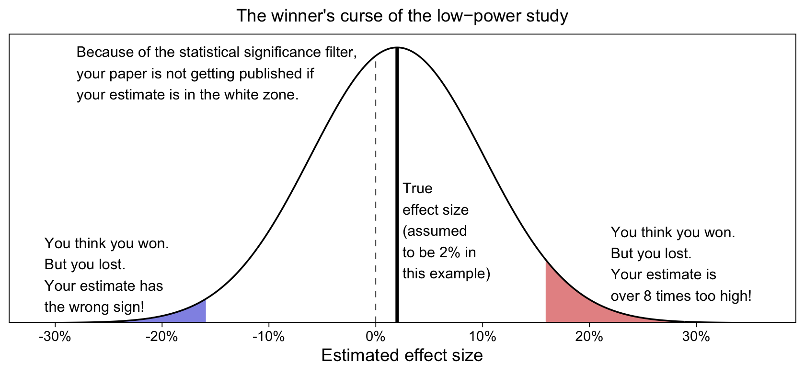
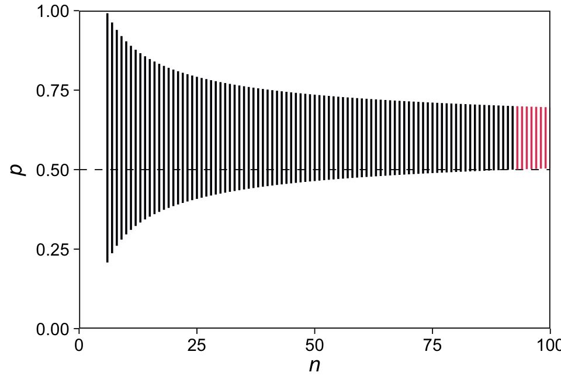
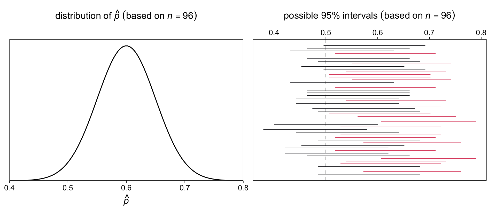
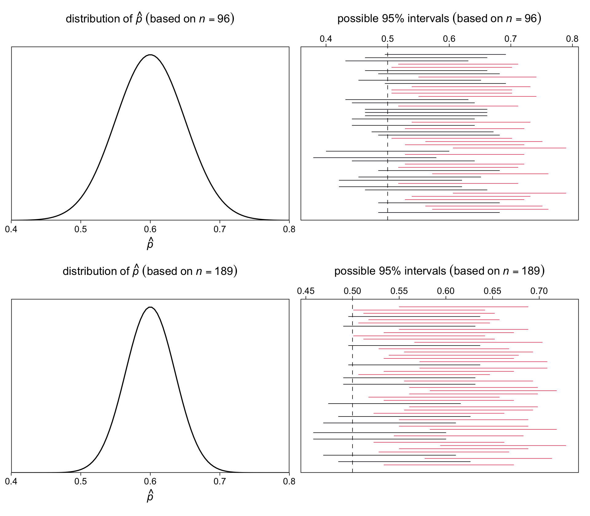
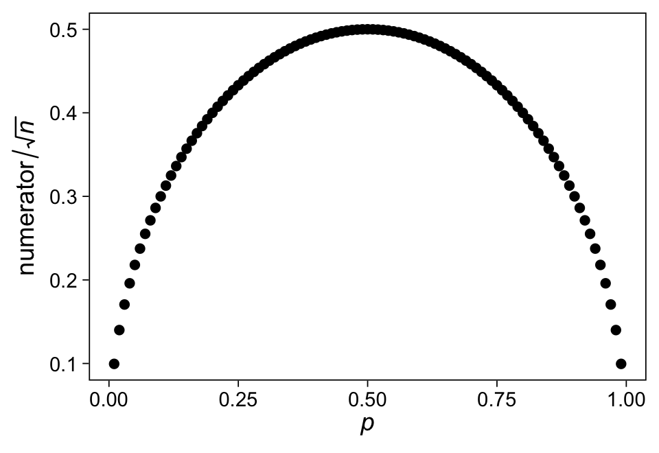
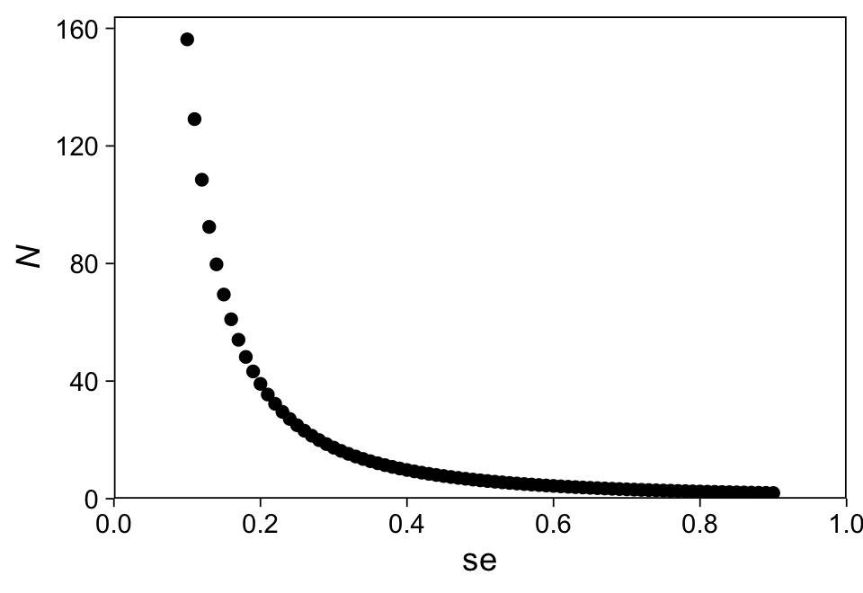

Chapter 16: Design and sample size decisions
================
A Solomon Kurz
2021-03-28

# Design and sample size decisions

> In the present chapter, we consider the design of studies, in
> particular asking the question of what sample size is required to
> estimate a quantity of interest to some desired precision. We focus on
> the paradigmatic inferential tasks of estimating population averages,
> proportions, and comparisons in sample surveys, or estimating
> treatment effects in experiments and observational studies… As we
> frame it, the goal of design is not to attain statistical significance
> with some high probability, but rather to have a sense–before and
> after data have been collected–about what can realistically be learned
> from statistical analysis of an empirical study. (p. 291)

## 16.1 The problem with statistical power

> Statistical *power* is defined as the probability, before a study is
> performed, that a particular comparison will achieve “statistical
> significance” at some predetermined level (typically a *p*-value below
> 0.05), given some assumed true effect size. A power analysis is
> performed by first hypothesizing an effect size, then making some
> assumptions about the variation in the data and the sample size of the
> study to be conducted, and finally using probability calculations to
> determine the chance of the *p*-value being below the threshold.
>
> The conventional view is that you should avoid low-power studies
> because they are unlikely to succeed. (p. 291, *emphasis* in the
> original)

### 16.1.1 The winner’s curse in low-power studies.

> The problem with the conventional reasoning is that, in a low-power
> study, the seeming “win” of statistical significance can actually be a
> trap. Economists speak of a “winner’s curse” in which the highest
> bidder in an auction will, on average, be overpaying. Research
> studies–even randomized experiments–suffer from a similar winner’s
> curse, that by focusing on comparisons that are statistically
> significant, we (the scholarly community as well as individual
> researchers) get a systematically biased and over-optimistic picture
> of the world.
>
> Put simply, when signal is low and noise is high, statistically
> significant patterns in data are likely to be wrong, in the sense that
> the results are unlikely to replicate.
>
> To put it in technical terms, statistically significant results are
> subject to type M and type S errors. (p. 292)

Here’s how to make Figure 16.1.

``` r
library(tidyverse)

# set the global plotting theme
theme_set(theme_linedraw() +
            theme(panel.grid = element_blank()))

# set parameters
true_effect <- 2
se <- 8.1

# simulate
tibble(x = seq(from = -31, to = 36, by = 0.1)) %>% 
  mutate(d = dnorm(x, true_effect, sd = se)) %>% 
  mutate(fill = ifelse(x < se * -1.96, "a", 
                       ifelse(x > se * 1.96, "c", "b"))) %>% 
  
  # plot!
  ggplot(aes(x = x, y = d)) +
  geom_area(aes(fill = fill)) +
  geom_linerange(data = . %>% filter(x %in% c(0, true_effect)),
                 aes(ymin = 0, ymax = d, 
                     size = x > 0, linetype = x > 0)) +
  geom_line() +
  annotate(geom = "text",
           x = c(-31, 2.5, 22, -28), y = c(0.002, 0.008, 0.004, 0.04),
           label = c("You think you won.\nBut you lost.\nYour estimate has\nthe wrong sign!",
                     "True\neffect size\n(assumed\nto be 2% in\nthis example)",
                     "You think you won.\nBut you lost.\nYour estimate is\nover 8 times too high!",
                     "Because of the statistical significance filter,\nyour paper is not getting published if\nyour estimate is in the white zone."),
           hjust = 0, vjust = 0, size = 3.25) +
  scale_fill_manual(values = c(alpha("blue3", 1/2), "white", alpha("red3", 1/2))) +
  scale_size_manual(values = c(1/4, 1)) +
  scale_linetype_manual(values = c(2, 1)) +
  scale_x_continuous("Estimated effect size", breaks = -3:3 * 10,
                     labels = function(x) str_c(x, "%")) +
  scale_y_continuous(NULL, breaks = NULL, expand = expansion(mult = c(0, 0.05))) +
  labs(subtitle = "The winner's curse of the low−power study") +
  theme(plot.subtitle = element_text(hjust = 0.5),
        legend.position = "none")
```



“We can examine the statistical properties of the estimate using the
normal distribution: conditional on it being statistically significant
(that is, at least two standard errors from zero), the estimate has at
least a 24% probability of being in the wrong direction” (p. 292). The
`pnorm()` will come in handy, for that.

``` r
# probability of being negative, given the statistical significance filter
(p_negative <- pnorm(-1.96 * se, mean = true_effect, sd = se))
```

    ## [1] 0.01366005

``` r
# probability of being positive, given the statistical significance filter
(p_positive <- 1 - pnorm(1.96 * se, mean = true_effect, sd = se))
```

    ## [1] 0.04334832

``` r
# probability of being the wrong sign if published
p_negative / (p_negative + p_positive)
```

    ## [1] 0.2396148

Further, your estimate “is, by necessity, over 8 times larger than the
true effect” (p. 292). Here’s how to compute that.

``` r
(1.96 * se) / true_effect
```

    ## [1] 7.938

“A study with these characteristics has essentially no chance of
providing useful information, and we can say this even before the data
have been collected. Given the numbers above for standard error and
possible effect size, the study has a power of at most 6%” (p. 292).
Since we already have `p_negative` and `p_positive`, this is just
addition.

``` r
p_negative + p_positive
```

    ## [1] 0.05700837

“Thus, a key risk for a low-power study is not so much that it has a
small chance of succeeding, but rather that an apparent success merely
masks a larger failure” (p. 292).

### 16.1.2 Hypothesizing an effect size.

Some strategies for choosing an effect size for a power analysis are:

-   entertaining a range of values consistent with the literature, or
-   using the smallest effect size of interest.

## 16.2 General principles of design, as illustrated by estimates of proportions

### 16.2.1 Effect sizes and sample sizes.

“In designing a study, it is generally better, if possible, to double
the effect size *θ* than to double the sample size *n*, since standard
errors of estimation decrease with the square root of the sample size”
(p. 293).

### 16.2.2 Published results tend to be overestimates.

“There are various reasons why we would typically expect future effects
to be smaller than published estimates” (p. 293).

### 16.2.3 Design calculations.

“Before data are collected, it can be useful to estimate the precision
of inferences that one expects to achieve with a given sample size, or
to estimate the sample size required to attain a certain precision”
(p. 294). This can be done with the conventional
statistical-significance framework, but can also be operationalized in
terms of the size of the standard error or the width of the 95%
intervals.

### 16.2.4 Sample size to achieve a specified standard error.

Recall that we can compute the standard error of a proportion by

$$se = \\sqrt{p(1 - p) / n},$$

where *p* is the proportion and *n* the sample size. If you work out the
algebra, we can then solve for the required *n* given *p* and a *s**e*
threshold by

$$n = \\left( \\frac{\\sqrt{p(1 - p)}}{se} \\right)^2$$

We might make that into a custom function called `n_given_p_and_se()`.

``` r
n_given_p_and_se <- function(p, se) {
  (sqrt(p * (1 - p)) / se)^2
}
```

Here are the minimum sample sizes for *s**e* ≤ 0.05 and *p* of .5 and
.6.

``` r
n_given_p_and_se(p = .5, se = 0.05)
```

    ## [1] 100

``` r
n_given_p_and_se(p = .6, se = 0.05)
```

    ## [1] 96

### 16.2.5 Sample size to achieve a specified probability of obtaining statistical significance.

Here’s how we might compute the 95% CI’s under the assumption *p* = .6,
using

$$se = \\sqrt{p(1 - p) / n}.$$

``` r
p <- .6

tibble(n = 6:100) %>% 
  mutate(se = sqrt(p * (1 - p) / n)) %>% 
  mutate(ll = p + -1.96 * se,
         ul = p + +1.96 * se) %>% 
  mutate(powered = ifelse(ll > .5, TRUE, FALSE)) %>% 
  
  ggplot(aes(x = n, ymin = ll, ymax = ul, group = n)) + 
  geom_hline(yintercept = .5, linetype = 2, size = 1/4) +
  geom_linerange(aes(color = powered == TRUE)) +
  scale_color_viridis_d(option = "A", end = .6, breaks = NULL) +
  scale_x_continuous(expression(italic(n)), breaks = 0:4 * 25, 
                     expand = c(0, 0), limits = c(0, 100)) +
  scale_y_continuous(expression(italic(p)),
                     expand = c(0, 0), limits = 0:1)
```



If you subset the data, you’ll see the study is sufficiently powered at
*n* = 93.

``` r
tibble(n = 6:100) %>% 
  mutate(se = sqrt(p * (1 - p) / n)) %>% 
  mutate(ll = p + -1.96 * se,
         ul = p + +1.96 * se) %>% 
  mutate(powered = ifelse(ll > .5, TRUE, FALSE)) %>% 
  filter(powered == TRUE)
```

    ## # A tibble: 8 x 5
    ##       n     se    ll    ul powered
    ##   <int>  <dbl> <dbl> <dbl> <lgl>  
    ## 1    93 0.0508 0.500 0.700 TRUE   
    ## 2    94 0.0505 0.501 0.699 TRUE   
    ## 3    95 0.0503 0.501 0.699 TRUE   
    ## 4    96 0.05   0.502 0.698 TRUE   
    ## 5    97 0.0497 0.503 0.697 TRUE   
    ## 6    98 0.0495 0.503 0.697 TRUE   
    ## 7    99 0.0492 0.503 0.697 TRUE   
    ## 8   100 0.0490 0.504 0.696 TRUE

Here’s how this plays out if we use the different formula,
$se = .5 / \\sqrt{n}$.

``` r
tibble(n = 6:100) %>% 
  mutate(se = .5 / sqrt(n)) %>% 
  mutate(ll = p + -1.96 * se,
         ul = p + +1.96 * se) %>% 
  mutate(powered = ifelse(ll > .5, TRUE, FALSE)) %>% 
  filter(powered == TRUE)
```

    ## # A tibble: 4 x 5
    ##       n     se    ll    ul powered
    ##   <int>  <dbl> <dbl> <dbl> <lgl>  
    ## 1    97 0.0508 0.500 0.700 TRUE   
    ## 2    98 0.0505 0.501 0.699 TRUE   
    ## 3    99 0.0503 0.502 0.698 TRUE   
    ## 4   100 0.05   0.502 0.698 TRUE

Thus, we would need *n* &gt; 96 for adequate power. Yet,

> this is mistaken, however, because it confuses the assumption that
> *p* = 0.6 with the claim that *p̂* &gt; 0.6. In fact, if *p* = 0.6,
> then *p̂* depends on the sample, and it has an approximate normal
> distribution with mean 0.6 and standard deviation
> $\\sqrt{0.6 ∗ 0.4/n} = 0.49/ \\sqrt n$ (p 294)

With that in mind, here’s the top row of Figure 16.2.

``` r
# left
p1 <-
  tibble(x = seq(from = .4, to = .8, length.out = 100)) %>% 
  mutate(d = dnorm(x, mean = .6, sd = 0.49 / sqrt(96))) %>% 
  
  ggplot(aes(x = x, y = d)) +
  geom_line() +
  scale_x_continuous(expression(hat(italic(p))), expand = c(0, 0)) +
  scale_y_continuous(NULL, breaks = NULL, expand = expansion(mult = c(0, 0.05))) +
  labs(subtitle = expression(distribution~of~hat(italic(p))~(based~on~italic(n)==96))) +
  theme(plot.subtitle = element_text(hjust = 0.5))

# right
set.seed(16)

p2 <-
  tibble(iter = 1:50) %>% 
  mutate(n = rbinom(n(), size = 96, p = .6)) %>% 
  mutate(p_hat = n / 96) %>% 
  mutate(se = sqrt(p_hat * (1 - p_hat) / 96)) %>% 
  mutate(ll = p_hat + -1.96 * se,
         ul = p_hat + +1.96 * se) %>% 
  mutate(powered = ifelse(ll > .5, TRUE, FALSE)) %>% 
  
  ggplot(aes(xmin = ll, xmax = ul, y = iter, group = iter)) + 
  geom_vline(xintercept = .5, linetype = 2, size = 1/4) +
  geom_linerange(aes(color = powered == TRUE),
                 size = 1/4) +
  scale_color_viridis_d(option = "A", end = .6, breaks = NULL) +
  scale_x_continuous(NULL, position = "top") +
  scale_y_continuous(NULL, breaks = NULL) +
  labs(subtitle = expression("possible 95% intervals"~(based~on~italic(n)==96))) +
  theme(plot.subtitle = element_text(hjust = 0.5))

# combine
library(patchwork)
p1 + p2
```



> To determine the appropriate sample size, we must specify the desired
> *power*–that is, the probability that a 95% interval will be entirely
> above the comparison point of 0.5. Under the assumption that
> *p* = 0.6, choosing *n* = 96 yields 50% power: there is a 50% chance
> that *p̂* will be more than 1.96 standard deviations away from 0.5, and
> thus a 50% chance that the 95% interval will be entirely greater than
> 0.5. (p. 294, *emphasis* in the original)

If you look at the red and black interval lines in the right plot,
above, you can get a sense of that 50% chance. Here’s the sample
behavior of *n* = 10, 000 such intervals.

``` r
set.seed(16)

tibble(iter = 1:1e4) %>% 
  mutate(n = rbinom(n(), size = 96, p = .6)) %>% 
  mutate(p_hat = n / 96) %>% 
  mutate(se = sqrt(p_hat * (1 - p_hat) / 96)) %>% 
  mutate(ll = p_hat + -1.96 * se,
         ul = p_hat + +1.96 * se) %>% 
  summarise(power = mean(ll > .5))
```

    ## # A tibble: 1 x 1
    ##   power
    ##   <dbl>
    ## 1 0.509

See? We’re approaching the asymptotic behavior of 50% power.

> To find the value of n such that exactly 80% of the estimates will be
> at least 1.96 standard errors from 0.5, we need
>
> 0.5 + 1.96 ∗ s.e. = 0.6 − 0.84 ∗ s.e.
>
> Some algebra then yields (1.96 + 0.84) ∗ s.e.. = 0.1. We can then
> substitute $\\text{s.e.} = 0.5 / \\sqrt n$ and solve for *n*, as we
> discuss next. (p. 294)

If you work through the equations, you might wonder where that
0.84 ∗ s.e. part came from. Well, consider what  − 0.84 is on the *z*
scale.

``` r
pnorm(-0.84, mean = 0, sd = 1)
```

    ## [1] 0.2004542

In standard normal distribution, *z* =  − 0.84 is the threshold dividing
the lower 20% from the upper 80% of the distribution. Anyway, “in
summary, *to have* *80%* *power, the true value of the parameter must
be* *2.8* *standard errors away from the comparison point*” (p. 295,
*emphasis* in the original). Here’s where we get 2.8.

``` r
1.96 + 0.84
```

    ## [1] 2.8

Now in the text, we see: *n* = (2.8 ∗ 0.49/0.1)<sup>2</sup> = 196. This
is incorrect and I suspect the authors meant
*n* = (2.8 ∗ 0.49/0.1)<sup>2</sup> = 188.2 or
*n* = (2.8 ∗ 0.5/0.1)<sup>2</sup> = 196. Look:

``` r
(2.8 * 0.49 / 0.1)^2 
```

    ## [1] 188.2384

``` r
(2.8 * 0.5 / 0.1)^2 
```

    ## [1] 196

Let’s use our power workflow, from above, to compare the two sample
sizes.

``` r
# 189
sample_n <- 189

set.seed(16)

tibble(iter = 1:1e6) %>% 
  mutate(n = rbinom(n(), size = sample_n, p = .6)) %>% 
  mutate(p_hat = n / sample_n) %>% 
  mutate(se = sqrt(p_hat * (1 - p_hat) / sample_n)) %>% 
  mutate(ll = p_hat + -1.96 * se,
         ul = p_hat + +1.96 * se) %>% 
  summarise(power = mean(ll > .5))
```

    ## # A tibble: 1 x 1
    ##   power
    ##   <dbl>
    ## 1 0.810

``` r
# 196
sample_n <- 196

set.seed(16)

tibble(iter = 1:1e6) %>% 
  mutate(n = rbinom(n(), size = sample_n, p = .6)) %>% 
  mutate(p_hat = n / sample_n) %>% 
  mutate(se = sqrt(p_hat * (1 - p_hat) / sample_n)) %>% 
  mutate(ll = p_hat + -1.96 * se,
         ul = p_hat + +1.96 * se) %>% 
  summarise(power = mean(ll > .5))
```

    ## # A tibble: 1 x 1
    ##   power
    ##   <dbl>
    ## 1 0.813

It looks like *n* = (2.8 ∗ 0.49/0.1)<sup>2</sup> = 188.2 is the real
deal. With that correction, here’s the full reversion of Figure 16.2.

``` r
# left
p3 <-
  tibble(x = seq(from = .4, to = .8, length.out = 100)) %>% 
  mutate(d = dnorm(x, mean = .6, sd = 0.49 / sqrt(189))) %>% 
  
  ggplot(aes(x = x, y = d)) +
  geom_line() +
  scale_x_continuous(expression(hat(italic(p))), expand = c(0, 0)) +
  scale_y_continuous(NULL, breaks = NULL, expand = expansion(mult = c(0, 0.05))) +
  labs(subtitle = expression(distribution~of~hat(italic(p))~(based~on~italic(n)==189))) +
  theme(plot.subtitle = element_text(hjust = 0.5))

# right
set.seed(16)

p4 <-
  tibble(iter = 1:50) %>% 
  mutate(n = rbinom(n(), size = 189, p = .6)) %>% 
  mutate(p_hat = n / 189) %>% 
  mutate(se = sqrt(p_hat * (1 - p_hat) / 189)) %>% 
  mutate(ll = p_hat + -1.96 * se,
         ul = p_hat + +1.96 * se) %>% 
  mutate(powered = ifelse(ll > .5, TRUE, FALSE)) %>% 
  
  ggplot(aes(xmin = ll, xmax = ul, y = iter, group = iter)) + 
  geom_vline(xintercept = .5, linetype = 2, size = 1/4) +
  geom_linerange(aes(color = powered == TRUE),
                 size = 1/4) +
  scale_color_viridis_d(option = "A", end = .6, breaks = NULL) +
  scale_x_continuous(NULL, position = "top") +
  scale_y_continuous(NULL, breaks = NULL) +
  labs(subtitle = expression("possible 95% intervals"~(based~on~italic(n)==189))) +
  theme(plot.subtitle = element_text(hjust = 0.5))

# combine
(p1 + p2) / (p3 + p4)
```



### 16.2.6 Estimates of hypothesized proportions.

When considering the standard error and it’s size relative to *p*, we
get the following relation:

``` r
tibble(p = seq(from = .01, to = .99, by = .01)) %>% 
  mutate(numerator = sqrt(p * (1 - p))) %>% 
  
  ggplot(aes(x = p, y = numerator)) +
  geom_point() +
  labs(x = expression(italic(p)),
       y = expression(numerator/sqrt(italic(n))))
```



The exact value on the *y*-axis will depend on *n*. But you get a sense
of the overall relation. Standard errors for proportions are largest
when *p* = .5. Thus basing your standard errors on their values for when
*p* = .5 will produce conservative estimates.

### 16.2.7 Simple comparisons of proportions: equal sample sizes.

> The standard error of a difference between two proportions is, by a
> simple probability calculation,
> $\\sqrt{p\_1 (1 - p\_1) / n\_1 + p\_2 (1 - p\_2) / n\_2}$, which has
> an upper bound of $0.5 \\sqrt{1 / n\_1 + 1 / n\_2}$. If we assume
> *n*<sub>1</sub> = *n*<sub>2</sub> = *n*/2 (equal sample sizes in the
> two groups), the upper bound on the standard error becomes simply
> $1/ \\sqrt n$. A specified standard error can then be attained with a
> sample size of *n* = 1/(s.e.)<sup>2</sup>. If the goal is 80% power to
> distinguish between hypothesized proportions *p*<sub>1</sub> and
> *p*<sub>2</sub> with a study of size *n*, equally divided between the
> two groups, a conservative sample size is
> *n* = ((2.8/(*p*<sub>1</sub> − *p*<sub>2</sub>))<sup>2</sup> or, more
> precisely,
> *n* = 2(*p*<sub>1</sub>(1 − *p*<sub>1</sub>) + *p*<sub>2</sub>(1 − *p*<sub>2</sub>))(2.8/(*p*<sub>1</sub> − *p*<sub>2</sub>))<sup>2</sup>.
> (p. 296)

Here’s how to use the conservative equation to compute the necessary
total sample size *N* for an expected difference of 10% between two
equal-sized groups.

``` r
# total N
(2.8 / .1)^2
```

    ## [1] 784

``` r
# per group
(2.8 / .1)^2 / 2
```

    ## [1] 392

### 16.2.8 Simple comparisons of proportions: unequal sample sizes.

Using the equation, *N* = (1.25/s.e.)<sup>2</sup>, we can plot the
relation for the total sample size *N* for a given standard error like
this.

``` r
tibble(se = seq(from = .1, to = .9, by = .01)) %>% 
  mutate(n = (1.25 / se)^2) %>% 
  
  ggplot(aes(x = se, y = n)) +
  geom_point() +
  scale_x_continuous(expand = c(0, 0), limits = 0:1, breaks = 0:5 / 5) +
  scale_y_continuous(expression(italic(N)), limits = c(0, NA),
                     expand = expansion(mult = c(0, 0.05)))
```



If you have an expected difference in proportion of 10% for groups you
anticipate will have an *n*<sub>1</sub>/*n*<sub>2</sub> = 1/5 split,
here’s how to compute the total and group-specific sample sizes.

``` r
# total N
(2.8 * 1.25 / 0.1)^2
```

    ## [1] 1225

``` r
# 20/80% split
(2.8 * 1.25 / 0.1)^2 * c(0.2, 0.8)
```

    ## [1] 245 980

## 16.3 Sample size and design calculations for continuous outcomes

## Session info

``` r
sessionInfo()
```

    ## R version 4.0.4 (2021-02-15)
    ## Platform: x86_64-apple-darwin17.0 (64-bit)
    ## Running under: macOS Catalina 10.15.7
    ## 
    ## Matrix products: default
    ## BLAS:   /Library/Frameworks/R.framework/Versions/4.0/Resources/lib/libRblas.dylib
    ## LAPACK: /Library/Frameworks/R.framework/Versions/4.0/Resources/lib/libRlapack.dylib
    ## 
    ## locale:
    ## [1] en_US.UTF-8/en_US.UTF-8/en_US.UTF-8/C/en_US.UTF-8/en_US.UTF-8
    ## 
    ## attached base packages:
    ## [1] stats     graphics  grDevices utils     datasets  methods   base     
    ## 
    ## other attached packages:
    ##  [1] patchwork_1.1.1 forcats_0.5.1   stringr_1.4.0   dplyr_1.0.5     purrr_0.3.4     readr_1.4.0    
    ##  [7] tidyr_1.1.3     tibble_3.1.0    ggplot2_3.3.3   tidyverse_1.3.0
    ## 
    ## loaded via a namespace (and not attached):
    ##  [1] tidyselect_1.1.0  xfun_0.22         haven_2.3.1       colorspace_2.0-0  vctrs_0.3.6      
    ##  [6] generics_0.1.0    viridisLite_0.3.0 htmltools_0.5.1.1 yaml_2.2.1        utf8_1.1.4       
    ## [11] rlang_0.4.10      pillar_1.5.1      glue_1.4.2        withr_2.4.1       DBI_1.1.0        
    ## [16] dbplyr_2.0.0      modelr_0.1.8      readxl_1.3.1      lifecycle_1.0.0   munsell_0.5.0    
    ## [21] gtable_0.3.0      cellranger_1.1.0  rvest_0.3.6       evaluate_0.14     labeling_0.4.2   
    ## [26] knitr_1.31        fansi_0.4.2       highr_0.8         broom_0.7.5       Rcpp_1.0.6       
    ## [31] scales_1.1.1      backports_1.2.1   jsonlite_1.7.2    farver_2.0.3      fs_1.5.0         
    ## [36] hms_0.5.3         digest_0.6.27     stringi_1.5.3     grid_4.0.4        cli_2.3.1        
    ## [41] tools_4.0.4       magrittr_2.0.1    crayon_1.4.1      pkgconfig_2.0.3   ellipsis_0.3.1   
    ## [46] xml2_1.3.2        reprex_0.3.0      lubridate_1.7.9.2 assertthat_0.2.1  rmarkdown_2.7    
    ## [51] httr_1.4.2        rstudioapi_0.13   R6_2.5.0          compiler_4.0.4
