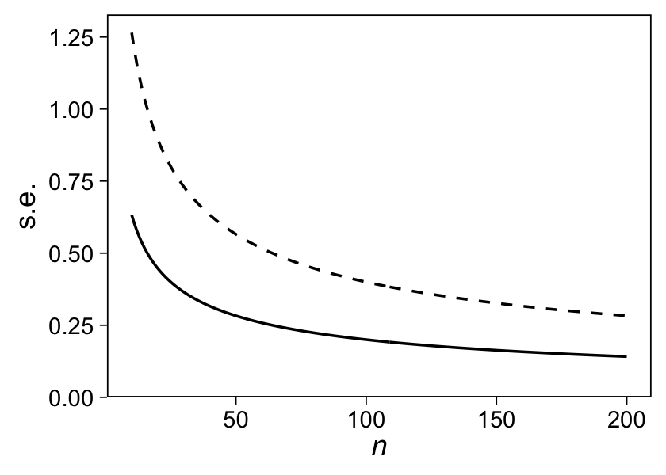

Chapter 16: Design and sample size decisions
================
A Solomon Kurz
2021-04-28

# Design and sample size decisions

> In the present chapter, we consider the design of studies, in
> particular asking the question of what sample size is required to
> estimate a quantity of interest to some desired precision. We focus on
> the paradigmatic inferential tasks of estimating population averages,
> proportions, and comparisons in sample surveys, or estimating
> treatment effects in experiments and observational studies… As we
> frame it, the goal of design is not to attain statistical significance
> with some high probability, but rather to have a sense–before and
> after data have been collected–about what can realistically be learned
> from statistical analysis of an empirical study. (p. 291)

## 16.1 The problem with statistical power

> Statistical *power* is defined as the probability, before a study is
> performed, that a particular comparison will achieve “statistical
> significance” at some predetermined level (typically a *p*-value below
> 0.05), given some assumed true effect size. A power analysis is
> performed by first hypothesizing an effect size, then making some
> assumptions about the variation in the data and the sample size of the
> study to be conducted, and finally using probability calculations to
> determine the chance of the *p*-value being below the threshold.
>
> The conventional view is that you should avoid low-power studies
> because they are unlikely to succeed. (p. 291, *emphasis* in the
> original)

### 16.1.1 The winner’s curse in low-power studies.

> The problem with the conventional reasoning is that, in a low-power
> study, the seeming “win” of statistical significance can actually be a
> trap. Economists speak of a “winner’s curse” in which the highest
> bidder in an auction will, on average, be overpaying. Research
> studies–even randomized experiments–suffer from a similar winner’s
> curse, that by focusing on comparisons that are statistically
> significant, we (the scholarly community as well as individual
> researchers) get a systematically biased and over-optimistic picture
> of the world.
>
> Put simply, when signal is low and noise is high, statistically
> significant patterns in data are likely to be wrong, in the sense that
> the results are unlikely to replicate.
>
> To put it in technical terms, statistically significant results are
> subject to type M and type S errors. (p. 292)

Here’s how to make Figure 16.1.

``` r
library(tidyverse)

# set the global plotting theme
theme_set(theme_linedraw() +
            theme(panel.grid = element_blank()))

# set parameters
true_effect <- 2
se <- 8.1

# simulate
tibble(x = seq(from = -31, to = 36, by = 0.1)) %>% 
  mutate(d = dnorm(x, true_effect, sd = se)) %>% 
  mutate(fill = ifelse(x < se * -1.96, "a", 
                       ifelse(x > se * 1.96, "c", "b"))) %>% 
  
  # plot!
  ggplot(aes(x = x, y = d)) +
  geom_area(aes(fill = fill)) +
  geom_linerange(data = . %>% filter(x %in% c(0, true_effect)),
                 aes(ymin = 0, ymax = d, 
                     size = x > 0, linetype = x > 0)) +
  geom_line() +
  annotate(geom = "text",
           x = c(-31, 2.5, 22, -28), y = c(0.002, 0.008, 0.004, 0.04),
           label = c("You think you won.\nBut you lost.\nYour estimate has\nthe wrong sign!",
                     "True\neffect size\n(assumed\nto be 2% in\nthis example)",
                     "You think you won.\nBut you lost.\nYour estimate is\nover 8 times too high!",
                     "Because of the statistical significance filter,\nyour paper is not getting published if\nyour estimate is in the white zone."),
           hjust = 0, vjust = 0, size = 3.25) +
  scale_fill_manual(values = c(alpha("blue3", 1/2), "white", alpha("red3", 1/2))) +
  scale_size_manual(values = c(1/4, 1)) +
  scale_linetype_manual(values = c(2, 1)) +
  scale_x_continuous("Estimated effect size", breaks = -3:3 * 10,
                     labels = function(x) str_c(x, "%")) +
  scale_y_continuous(NULL, breaks = NULL, expand = expansion(mult = c(0, 0.05))) +
  labs(subtitle = "The winner's curse of the low−power study") +
  theme(plot.subtitle = element_text(hjust = 0.5),
        legend.position = "none")
```


“We can examine the statistical properties of the estimate using the
normal distribution: conditional on it being statistically significant
(that is, at least two standard errors from zero), the estimate has at
least a 24% probability of being in the wrong direction” (p. 292). The
`pnorm()` will come in handy, for that.

``` r
# probability of being negative, given the statistical significance filter
(p_negative <- pnorm(-1.96 * se, mean = true_effect, sd = se))
```

    ## [1] 0.01366005

``` r
# probability of being positive, given the statistical significance filter
(p_positive <- 1 - pnorm(1.96 * se, mean = true_effect, sd = se))
```

    ## [1] 0.04334832

``` r
# probability of being the wrong sign if published
p_negative / (p_negative + p_positive)
```

    ## [1] 0.2396148

Further, your estimate “is, by necessity, over 8 times larger than the
true effect” (p. 292). Here’s how to compute that.

``` r
(1.96 * se) / true_effect
```

    ## [1] 7.938

“A study with these characteristics has essentially no chance of
providing useful information, and we can say this even before the data
have been collected. Given the numbers above for standard error and
possible effect size, the study has a power of at most 6%” (p. 292).
Since we already have `p_negative` and `p_positive`, this is just
addition.

``` r
p_negative + p_positive
```

    ## [1] 0.05700837

“Thus, a key risk for a low-power study is not so much that it has a
small chance of succeeding, but rather that an apparent success merely
masks a larger failure” (p. 292).

### 16.1.2 Hypothesizing an effect size.

Some strategies for choosing an effect size for a power analysis are:

-   entertaining a range of values consistent with the literature, or
-   using the smallest effect size of interest.

## 16.2 General principles of design, as illustrated by estimates of proportions

### 16.2.1 Effect sizes and sample sizes.

“In designing a study, it is generally better, if possible, to double
the effect size *θ* than to double the sample size *n*, since standard
errors of estimation decrease with the square root of the sample size”
(p. 293).

### 16.2.2 Published results tend to be overestimates.

“There are various reasons why we would typically expect future effects
to be smaller than published estimates” (p. 293).

### 16.2.3 Design calculations.

“Before data are collected, it can be useful to estimate the precision
of inferences that one expects to achieve with a given sample size, or
to estimate the sample size required to attain a certain precision”
(p. 294). This can be done with the conventional
statistical-significance framework, but can also be operationalized in
terms of the size of the standard error or the width of the 95%
intervals.

### 16.2.4 Sample size to achieve a specified standard error.

Recall that we can compute the standard error of a proportion by

$$se = \\sqrt{p(1 - p) / n},$$

where *p* is the proportion and *n* the sample size. If you work out the
algebra, we can then solve for the required *n* given *p* and a *s**e*
threshold by

$$n = \\left( \\frac{\\sqrt{p(1 - p)}}{se} \\right)^2$$

We might make that into a custom function called `n_given_p_and_se()`.

``` r
n_given_p_and_se <- function(p, se) {
  (sqrt(p * (1 - p)) / se)^2
}
```

Here are the minimum sample sizes for *s**e* ≤ 0.05 and *p* of .5 and
.6.

``` r
n_given_p_and_se(p = .5, se = 0.05)
```

    ## [1] 100

``` r
n_given_p_and_se(p = .6, se = 0.05)
```

    ## [1] 96

### 16.2.5 Sample size to achieve a specified probability of obtaining statistical significance.

Here’s how we might compute the 95% CI’s under the assumption *p* = .6,
using

$$se = \\sqrt{p(1 - p) / n}.$$

``` r
p <- .6

tibble(n = 6:100) %>% 
  mutate(se = sqrt(p * (1 - p) / n)) %>% 
  mutate(ll = p + -1.96 * se,
         ul = p + +1.96 * se) %>% 
  mutate(powered = ifelse(ll > .5, TRUE, FALSE)) %>% 
  
  ggplot(aes(x = n, ymin = ll, ymax = ul, group = n)) + 
  geom_hline(yintercept = .5, linetype = 2, size = 1/4) +
  geom_linerange(aes(color = powered == TRUE)) +
  scale_color_viridis_d(option = "A", end = .6, breaks = NULL) +
  scale_x_continuous(expression(italic(n)), breaks = 0:4 * 25, 
                     expand = c(0, 0), limits = c(0, 100)) +
  scale_y_continuous(expression(italic(p)),
                     expand = c(0, 0), limits = 0:1)
```


If you subset the data, you’ll see the study is sufficiently powered at
*n* = 93.

``` r
tibble(n = 6:100) %>% 
  mutate(se = sqrt(p * (1 - p) / n)) %>% 
  mutate(ll = p + -1.96 * se,
         ul = p + +1.96 * se) %>% 
  mutate(powered = ifelse(ll > .5, TRUE, FALSE)) %>% 
  filter(powered == TRUE)
```

    ## # A tibble: 8 x 5
    ##       n     se    ll    ul powered
    ##   <int>  <dbl> <dbl> <dbl> <lgl>  
    ## 1    93 0.0508 0.500 0.700 TRUE   
    ## 2    94 0.0505 0.501 0.699 TRUE   
    ## 3    95 0.0503 0.501 0.699 TRUE   
    ## 4    96 0.05   0.502 0.698 TRUE   
    ## 5    97 0.0497 0.503 0.697 TRUE   
    ## 6    98 0.0495 0.503 0.697 TRUE   
    ## 7    99 0.0492 0.503 0.697 TRUE   
    ## 8   100 0.0490 0.504 0.696 TRUE

Here’s how this plays out if we use the different formula,
$se = .5 / \\sqrt{n}$.

``` r
tibble(n = 6:100) %>% 
  mutate(se = .5 / sqrt(n)) %>% 
  mutate(ll = p + -1.96 * se,
         ul = p + +1.96 * se) %>% 
  mutate(powered = ifelse(ll > .5, TRUE, FALSE)) %>% 
  filter(powered == TRUE)
```

    ## # A tibble: 4 x 5
    ##       n     se    ll    ul powered
    ##   <int>  <dbl> <dbl> <dbl> <lgl>  
    ## 1    97 0.0508 0.500 0.700 TRUE   
    ## 2    98 0.0505 0.501 0.699 TRUE   
    ## 3    99 0.0503 0.502 0.698 TRUE   
    ## 4   100 0.05   0.502 0.698 TRUE

Thus, we would need *n* &gt; 96 for adequate power. Yet,

> this is mistaken, however, because it confuses the assumption that
> *p* = 0.6 with the claim that *p̂* &gt; 0.6. In fact, if *p* = 0.6,
> then *p̂* depends on the sample, and it has an approximate normal
> distribution with mean 0.6 and standard deviation
> $\\sqrt{0.6 ∗ 0.4/n} = 0.49/ \\sqrt n$ (p 294)

With that in mind, here’s the top row of Figure 16.2.

``` r
# left
p1 <-
  tibble(x = seq(from = .4, to = .8, length.out = 100)) %>% 
  mutate(d = dnorm(x, mean = .6, sd = 0.49 / sqrt(96))) %>% 
  
  ggplot(aes(x = x, y = d)) +
  geom_line() +
  scale_x_continuous(expression(hat(italic(p))), expand = c(0, 0)) +
  scale_y_continuous(NULL, breaks = NULL, expand = expansion(mult = c(0, 0.05))) +
  labs(subtitle = expression(distribution~of~hat(italic(p))~(based~on~italic(n)==96))) +
  theme(plot.subtitle = element_text(hjust = 0.5))

# right
set.seed(16)

p2 <-
  tibble(iter = 1:50) %>% 
  mutate(n = rbinom(n(), size = 96, p = .6)) %>% 
  mutate(p_hat = n / 96) %>% 
  mutate(se = sqrt(p_hat * (1 - p_hat) / 96)) %>% 
  mutate(ll = p_hat + -1.96 * se,
         ul = p_hat + +1.96 * se) %>% 
  mutate(powered = ifelse(ll > .5, TRUE, FALSE)) %>% 
  
  ggplot(aes(xmin = ll, xmax = ul, y = iter, group = iter)) + 
  geom_vline(xintercept = .5, linetype = 2, size = 1/4) +
  geom_linerange(aes(color = powered == TRUE),
                 size = 1/4) +
  scale_color_viridis_d(option = "A", end = .6, breaks = NULL) +
  scale_x_continuous(NULL, position = "top") +
  scale_y_continuous(NULL, breaks = NULL) +
  labs(subtitle = expression("possible 95% intervals"~(based~on~italic(n)==96))) +
  theme(plot.subtitle = element_text(hjust = 0.5))

# combine
library(patchwork)
p1 + p2
```


> To determine the appropriate sample size, we must specify the desired
> *power*–that is, the probability that a 95% interval will be entirely
> above the comparison point of 0.5. Under the assumption that
> *p* = 0.6, choosing *n* = 96 yields 50% power: there is a 50% chance
> that *p̂* will be more than 1.96 standard deviations away from 0.5, and
> thus a 50% chance that the 95% interval will be entirely greater than
> 0.5. (p. 294, *emphasis* in the original)

If you look at the red and black interval lines in the right plot,
above, you can get a sense of that 50% chance. Here’s the sample
behavior of *n* = 10, 000 such intervals.

``` r
set.seed(16)

tibble(iter = 1:1e4) %>% 
  mutate(n = rbinom(n(), size = 96, p = .6)) %>% 
  mutate(p_hat = n / 96) %>% 
  mutate(se = sqrt(p_hat * (1 - p_hat) / 96)) %>% 
  mutate(ll = p_hat + -1.96 * se,
         ul = p_hat + +1.96 * se) %>% 
  summarise(power = mean(ll > .5))
```

    ## # A tibble: 1 x 1
    ##   power
    ##   <dbl>
    ## 1 0.509

See? We’re approaching the asymptotic behavior of 50% power.

> To find the value of n such that exactly 80% of the estimates will be
> at least 1.96 standard errors from 0.5, we need
>
> 0.5 + 1.96 ∗ s.e. = 0.6 − 0.84 ∗ s.e.
>
> Some algebra then yields (1.96 + 0.84) ∗ s.e.. = 0.1. We can then
> substitute $\\text{s.e.} = 0.5 / \\sqrt n$ and solve for *n*, as we
> discuss next. (p. 294)

If you work through the equations, you might wonder where that
0.84 ∗ s.e. part came from. Well, consider what  − 0.84 is on the *z*
scale.

``` r
pnorm(-0.84, mean = 0, sd = 1)
```

    ## [1] 0.2004542

In standard normal distribution, *z* =  − 0.84 is the threshold dividing
the lower 20% from the upper 80% of the distribution. Anyway, “in
summary, *to have* *80%* *power, the true value of the parameter must
be* *2.8* *standard errors away from the comparison point*” (p. 295,
*emphasis* in the original). Here’s where we get 2.8.

``` r
1.96 + 0.84
```

    ## [1] 2.8

Now in the text, we see: *n* = (2.8 ∗ 0.49/0.1)<sup>2</sup> = 196. This
is incorrect and I suspect the authors meant
*n* = (2.8 ∗ 0.49/0.1)<sup>2</sup> = 188.2 or
*n* = (2.8 ∗ 0.5/0.1)<sup>2</sup> = 196. Look:

``` r
(2.8 * 0.49 / 0.1)^2 
```

    ## [1] 188.2384

``` r
(2.8 * 0.5 / 0.1)^2 
```

    ## [1] 196

Let’s use our power workflow, from above, to compare the two sample
sizes.

``` r
# 189
sample_n <- 189

set.seed(16)

tibble(iter = 1:1e6) %>% 
  mutate(n = rbinom(n(), size = sample_n, p = .6)) %>% 
  mutate(p_hat = n / sample_n) %>% 
  mutate(se = sqrt(p_hat * (1 - p_hat) / sample_n)) %>% 
  mutate(ll = p_hat + -1.96 * se,
         ul = p_hat + +1.96 * se) %>% 
  summarise(power = mean(ll > .5))
```

    ## # A tibble: 1 x 1
    ##   power
    ##   <dbl>
    ## 1 0.810

``` r
# 196
sample_n <- 196

set.seed(16)

tibble(iter = 1:1e6) %>% 
  mutate(n = rbinom(n(), size = sample_n, p = .6)) %>% 
  mutate(p_hat = n / sample_n) %>% 
  mutate(se = sqrt(p_hat * (1 - p_hat) / sample_n)) %>% 
  mutate(ll = p_hat + -1.96 * se,
         ul = p_hat + +1.96 * se) %>% 
  summarise(power = mean(ll > .5))
```

    ## # A tibble: 1 x 1
    ##   power
    ##   <dbl>
    ## 1 0.813

It looks like *n* = (2.8 ∗ 0.49/0.1)<sup>2</sup> = 188.2 is the real
deal. With that correction, here’s the full reversion of Figure 16.2.

``` r
# left
p3 <-
  tibble(x = seq(from = .4, to = .8, length.out = 100)) %>% 
  mutate(d = dnorm(x, mean = .6, sd = 0.49 / sqrt(189))) %>% 
  
  ggplot(aes(x = x, y = d)) +
  geom_line() +
  scale_x_continuous(expression(hat(italic(p))), expand = c(0, 0)) +
  scale_y_continuous(NULL, breaks = NULL, expand = expansion(mult = c(0, 0.05))) +
  labs(subtitle = expression(distribution~of~hat(italic(p))~(based~on~italic(n)==189))) +
  theme(plot.subtitle = element_text(hjust = 0.5))

# right
set.seed(16)

p4 <-
  tibble(iter = 1:50) %>% 
  mutate(n = rbinom(n(), size = 189, p = .6)) %>% 
  mutate(p_hat = n / 189) %>% 
  mutate(se = sqrt(p_hat * (1 - p_hat) / 189)) %>% 
  mutate(ll = p_hat + -1.96 * se,
         ul = p_hat + +1.96 * se) %>% 
  mutate(powered = ifelse(ll > .5, TRUE, FALSE)) %>% 
  
  ggplot(aes(xmin = ll, xmax = ul, y = iter, group = iter)) + 
  geom_vline(xintercept = .5, linetype = 2, size = 1/4) +
  geom_linerange(aes(color = powered == TRUE),
                 size = 1/4) +
  scale_color_viridis_d(option = "A", end = .6, breaks = NULL) +
  scale_x_continuous(NULL, position = "top") +
  scale_y_continuous(NULL, breaks = NULL) +
  labs(subtitle = expression("possible 95% intervals"~(based~on~italic(n)==189))) +
  theme(plot.subtitle = element_text(hjust = 0.5))

# combine
(p1 + p2) / (p3 + p4)
```


### 16.2.6 Estimates of hypothesized proportions.

When considering the standard error and it’s size relative to *p*, we
get the following relation:

``` r
tibble(p = seq(from = .01, to = .99, by = .01)) %>% 
  mutate(numerator = sqrt(p * (1 - p))) %>% 
  
  ggplot(aes(x = p, y = numerator)) +
  geom_point() +
  labs(x = expression(italic(p)),
       y = expression(numerator/sqrt(italic(n))))
```


The exact value on the *y*-axis will depend on *n*. But you get a sense
of the overall relation. Standard errors for proportions are largest
when *p* = .5. Thus basing your standard errors on their values for when
*p* = .5 will produce conservative estimates.

### 16.2.7 Simple comparisons of proportions: equal sample sizes.

> The standard error of a difference between two proportions is, by a
> simple probability calculation,
> $\\sqrt{p\_1 (1 - p\_1) / n\_1 + p\_2 (1 - p\_2) / n\_2}$, which has
> an upper bound of $0.5 \\sqrt{1 / n\_1 + 1 / n\_2}$. If we assume
> *n*<sub>1</sub> = *n*<sub>2</sub> = *n*/2 (equal sample sizes in the
> two groups), the upper bound on the standard error becomes simply
> $1/ \\sqrt n$. A specified standard error can then be attained with a
> sample size of *n* = 1/(s.e.)<sup>2</sup>. If the goal is 80% power to
> distinguish between hypothesized proportions *p*<sub>1</sub> and
> *p*<sub>2</sub> with a study of size *n*, equally divided between the
> two groups, a conservative sample size is
> *n* = ((2.8/(*p*<sub>1</sub> − *p*<sub>2</sub>))<sup>2</sup> or, more
> precisely,
> *n* = 2(*p*<sub>1</sub>(1 − *p*<sub>1</sub>) + *p*<sub>2</sub>(1 − *p*<sub>2</sub>))(2.8/(*p*<sub>1</sub> − *p*<sub>2</sub>))<sup>2</sup>.
> (p. 296)

Here’s how to use the conservative equation to compute the necessary
total sample size *N* for an expected difference of 10% between two
equal-sized groups.

``` r
# total N
(2.8 / .1)^2
```

    ## [1] 784

``` r
# per group
(2.8 / .1)^2 / 2
```

    ## [1] 392

### 16.2.8 Simple comparisons of proportions: unequal sample sizes.

Using the equation, *N* = (1.25/s.e.)<sup>2</sup>, we can plot the
relation for the total sample size *N* for a given standard error like
this.

``` r
tibble(se = seq(from = .1, to = .9, by = .01)) %>% 
  mutate(n = (1.25 / se)^2) %>% 
  
  ggplot(aes(x = se, y = n)) +
  geom_point() +
  scale_x_continuous(expand = c(0, 0), limits = 0:1, breaks = 0:5 / 5) +
  scale_y_continuous(expression(italic(N)), limits = c(0, NA),
                     expand = expansion(mult = c(0, 0.05)))
```


If you have an expected difference in proportion of 10% for groups you
anticipate will have an *n*<sub>1</sub>/*n*<sub>2</sub> = 1/5 split,
here’s how to compute the total and group-specific sample sizes.

``` r
# total N
(2.8 * 1.25 / 0.1)^2
```

    ## [1] 1225

``` r
# 20/80% split
(2.8 * 1.25 / 0.1)^2 * c(0.2, 0.8)
```

    ## [1] 245 980

## 16.3 Sample size and design calculations for continuous outcomes

“Sample size calculations proceed much the same way with continuous
outcomes, with the added difficulty that the population standard
deviation must also be specified along with the hypothesized effect
size” (p. 297).

### 16.3.1 Estimates of means.

> Suppose we are trying to estimate a population mean value *θ* from
> data *y*<sub>1</sub>, …, *y*<sub>*n*</sub>, an random sample of size
> *n*. The quick estimate of *θ* is the sample mean, *ȳ*, which has a
> standard error of $\\sigma / \\sqrt{n}$, where *σ* is the standard
> deviation of *y* in the population. So if the goal is to achieve a
> specified s.e. for *ȳ*, then the sample size must be at least
> *n* = (*σ*/s.e.)<sup>2</sup>. If the goal is 80% power to distinguish
> *θ* from a specified value *θ*<sub>0</sub>, then a conservative
> required sample is *n* = (2.8*σ*/(*θ* − *θ*<sub>0</sub>))<sup>2</sup>.
> (p. 297)

We might walk that out, a bit. Say we have data
*y*<sub>*i*</sub> ∼ Normal (0, 1) and our parameter of interest, *θ*, is
the mean. Let’s further suppose we’d like to estimate *θ* with a
standard error of 0.1 or below. The equation
*n* = (*σ*/s.e.)<sup>2</sup> will tell us how many cases we need.

``` r
# population parameters
mu    <- 0
sigma <- 1

# desired se
se <- 0.1

# required n
(sigma / se)^2
```

    ## [1] 100

Let’s simulate some data and see how this shakes out.

``` r
# how many would you like?
n <- 100

# simulate!
set.seed(16)

d <- tibble(y = rnorm(n, mean = mu, sd = sigma))
```

Now see how well this works out by fitting an intercept-only model to
the data. The intercept will be *θ*. Here we’ll use **brms** with
default weakly-regularizing priors.

``` r
library(brms)

m16.1 <- 
  brm(data = d, 
      family = gaussian,
      y ~ 1, 
      seed = 16,
      file = "fits/m16.01")
```

Check the results.

``` r
print(m16.1, robust = T, digits = 3)
```

    ##  Family: gaussian 
    ##   Links: mu = identity; sigma = identity 
    ## Formula: y ~ 1 
    ##    Data: d (Number of observations: 100) 
    ## Samples: 4 chains, each with iter = 2000; warmup = 1000; thin = 1;
    ##          total post-warmup samples = 4000
    ## 
    ## Population-Level Effects: 
    ##           Estimate Est.Error l-95% CI u-95% CI  Rhat Bulk_ESS Tail_ESS
    ## Intercept    0.058     0.094   -0.142    0.249 1.002     3183     2402
    ## 
    ## Family Specific Parameters: 
    ##       Estimate Est.Error l-95% CI u-95% CI  Rhat Bulk_ESS Tail_ESS
    ## sigma    1.016     0.072    0.892    1.173 1.000     3556     2493
    ## 
    ## Samples were drawn using sampling(NUTS). For each parameter, Bulk_ESS
    ## and Tail_ESS are effective sample size measures, and Rhat is the potential
    ## scale reduction factor on split chains (at convergence, Rhat = 1).

The ‘Est.Error’ column for the intercept parameter is our Bayesian
equivalent of a standard error. It looks like were were just under our
desired s.e. = 0.1. Now let’s explore the second equation,
*n* = (2.8*σ*/(*θ* − *θ*<sub>0</sub>))<sup>2</sup>, which defined the
necessary sample size to differentiate *θ* from some value
*θ*<sub>0</sub>. We’ll continue to use *y*<sub>*i*</sub> ∼ Normal (0, 1)
data for which *μ* = *θ*. Our comparison point might be
*θ*<sub>0</sub> = 0.2. Here’s the minimum sample size.

``` r
theta0 <- 0.25

(2.8 * sigma / (mu - theta0))^2
```

    ## [1] 125.44

Now let’s simulate based on *N* = 126.

``` r
# how many would you like?
n <- 126

# simulate!
set.seed(16)

d <- tibble(y = rnorm(n, mean = mu, sd = sigma))
```

Fit another intercept-only model.

``` r
m16.2 <- 
  brm(data = d, 
      family = gaussian,
      y ~ 1, 
      seed = 16,
      file = "fits/m16.02")
```

These results might be easiest to examine in a couple plots.

``` r
library(tidybayes)

p1 <-
  posterior_samples(m16.2) %>% 
  
  ggplot(aes(x = b_Intercept, y = 0)) +
  stat_halfeye(.width = .95) +
  geom_vline(xintercept = theta0, linetype = 2) +
  scale_y_continuous(NULL, breaks = NULL) +
  xlab(expression(theta))

p2 <-
  posterior_samples(m16.2) %>% 
  transmute(diff = b_Intercept - theta0) %>% 
  
  ggplot(aes(x = diff, y = 0)) +
  stat_halfeye(.width = .95) +
  scale_y_continuous(NULL, breaks = NULL) +
  xlab(expression(theta-theta[0]))

p1 + p2
```


It looks like our *N* = 126 was indeed just large enough to
differentiate our *θ* from *θ*<sub>0</sub>.

### 16.3.2 The *t* distribution and uncertainty in standard deviations.

To see where the 2.8 number from above, came from, execute the
following.

``` r
qnorm(0.8) + qnorm(0.975)
```

    ## [1] 2.801585

Both `qrnorm()` functions presumed `mean = 0` and `sd = 1`. They used
the standard normal. When the sample size is very small, it might be
better to presume the standard *t* distribution for which *ν* is the
degrees of freedom for the statistical procedure. If you would like to
compare the mean of some variable between two groups, each of which is
composed of *n* = 6 people, you’d have 10 degrees of freedom–you lost
one degree of freedom for each group’s mean. Thus, the error
distribution for this issue might be *t*(10, 0, 1). Here’s the
multiplier in that case.

``` r
qt(0.8, df = 10) + qt(0.975, df = 10)
```

    ## [1] 3.107197

### 16.3.3 Simple comparisons of means.

> The standard error of *ȳ*<sub>1</sub> − *ȳ*<sub>2</sub> is
> $\\sqrt{\\sigma\_1^2 / n\_1 + \\sigma\_2^2 / n\_2}$. If we make the
> restriction *n*<sub>1</sub> = *n*<sub>2</sub> = *n*/2 (equal sample
> sizes in the two groups), the standard error becomes simply
> $\\text{s.e.} = \\sqrt{2(\\sigma\_1^2 + \\sigma\_2^2) / n}$. A
> specified standard error can then be attained with a sample size of
> *n* = 2(*σ*<sub>1</sub><sup>2</sup> + *σ*<sub>2</sub><sup>2</sup>)/(s.e.)<sup>2</sup>.
> If we further suppose that the variation is the same within each of
> the groups (*σ*<sub>1</sub> = *σ*<sub>2</sub> = *σ*), then
> $\\text{s.e.} = 2\\sigma / \\sqrt{n}$, and the required sample size is
> *n* = (2*σ*/s.e.)<sup>2</sup>.
>
> If the goal is 80% power to detect a difference of *Δ*, with a study
> of size *n*, equally divided between the two groups, then the required
> sample size is
> *n* = 2(*σ*<sub>1</sub><sup>2</sup> + *σ*<sub>2</sub><sup>2</sup>)(2.8/*Δ*)<sup>2</sup>.
> If *σ*<sub>1</sub> = *σ*<sub>2</sub> = *σ*, this simplifies to
> (5.6*σ*/*Δ*)<sup>2</sup>. (pp. 297–298)

Consider the case where *Δ* = 0.5*σ*, where you have an expected
experimental change in 0.5 standard scores. If you had two groups of
equal size and you expect homogeneity of variance, here’s the required
total *N*.

``` r
sigma <- 1
delta <- 0.5

(5.6 * sigma / delta)^2
```

    ## [1] 125.44

You’d need at least *N* = 126, or *n* = 63 per condition. But where did
that 5.6 come from, again?

``` r
(qnorm(0.8) + qnorm(0.975)) * 2
```

    ## [1] 5.60317

### 16.3.4 Estimating standard deviations using results from previous studies.

Here’s the information from the Rosado et al (1997) study from Figure
16.4.

``` r
library(tidyverse)

rosado <-
  tibble(treatment = c("placebo", "iron", "zinc", "zinc + iron"),
         n         = c(56, 54, 54, 55),
         mu        = c(1.1, 1.4, 0.7, 0.8),
         se        = c(0.2, 0.2, 0.1, 0.1))

rosado %>% 
  flextable::flextable() %>% 
  flextable::width(width = 1)
```

It you collapse across iron status, treatment is the composite of zinc
and zinc + iron and control is the composite placebo + iron. Here, then,
is how to compute *Δ*.

``` r
m1 <- rosado[1, 3] %>% pull()
m2 <- rosado[2, 3] %>% pull()
m3 <- rosado[3, 3] %>% pull()
m4 <- rosado[4, 3] %>% pull()

(rosado_delta <- 0.5 * (m1 + m2) - 0.5 * (m3 + m4))
```

    ## [1] 0.5

Here’s the s.e..

``` r
se1 <- rosado[1, 4] %>% pull()
se2 <- rosado[2, 4] %>% pull()
se3 <- rosado[3, 4] %>% pull()
se4 <- rosado[4, 4] %>% pull()

(se <- sqrt(0.25 * (se1^2 + se2^2) + 0.25 * (se3^2 + se4^2)))
```

    ## [1] 0.1581139

Thus, if you think in terms of *Δ* ± s.e., here’s the expected range of
the effect size in the population.

``` r
c(rosado_delta - se, rosado_delta + se)
```

    ## [1] 0.3418861 0.6581139

Now we compute the within-group standard deviations using
$\\sigma = \\text{s.e.} \\times \\sqrt n$.

``` r
n1 <- rosado[1, 2] %>% pull()
n2 <- rosado[2, 2] %>% pull()
n3 <- rosado[3, 2] %>% pull()
n4 <- rosado[4, 2] %>% pull()

(s1 <- se1 * sqrt(n1))
```

    ## [1] 1.496663

``` r
(s2 <- se2 * sqrt(n2))
```

    ## [1] 1.469694

``` r
(s3 <- se3 * sqrt(n3))
```

    ## [1] 0.7348469

``` r
(s4 <- se4 * sqrt(n4))
```

    ## [1] 0.7416198

It might be helpful to compute the pooled standard deviations for the
control and treatment composites.

``` r
(s_pooled_c <- sqrt(((n1 - 1) * s1^2 + (n2 - 1) * s2^2) / (n1 + n2 - 2)))
```

    ## [1] 1.483489

``` r
(s_pooled_t <- sqrt(((n3 - 1) * s3^2 + (n4 - 1) * s4^2) / (n3 + n4 - 2)))
```

    ## [1] 0.7382728

Now recall that $\\sqrt{a / b} = \\sqrt a / \\sqrt b$. We can then
compute the expected standard error of the difference, given *n*, as

$$
\\begin{align\*}
\\text{s.e.} & = \\sqrt{2 (\\sigma\_1^2 + \\sigma\_2^2) / n} \\\\
& = \\sqrt{2 (\\sigma\_1^2 + \\sigma\_2^2)} / \\sqrt n.
\\end{align\*}
$$

Here’s equal group sizes, here’s
$\\sqrt{2 (\\sigma\_1^2 + \\sigma\_2^2)}$.

``` r
sqrt(2 * (s_pooled_c^2 + s_pooled_t^2))
```

    ## [1] 2.343411

Thus, here’s our minimum sample size to compare two groups.

``` r
(2.8 * sqrt(2 * (s_pooled_c^2 + s_pooled_t^2)) / rosado_delta)^2
```

    ## [1] 172.2158

Our *N* differs from the 180 in the text due to rounding differences.
Also, though we don’t need it here, it’ll come in handy in the next
section if we save the average observed rate of the composite control
group.

``` r
(mu_c_rosado <- (m1 * n1 + m2 * n2) / (n1 + n2))
```

    ## [1] 1.247273

OKay, now here’s the information from the Ruel et al (1997) study from
Figure 16.4.

``` r
ruel <-
  tibble(treatment = c("placebo", "zinc"),
         n         = c(44, 45),
         mu        = c(8.1, 6.3),
         ll        = c(5.8, 4.2),
         ul        = c(10.2, 8.9))

ruel %>% 
  flextable::flextable() %>% 
  flextable::width(width = 0.8)
```

Here’s how we might compute the standard errors from the 95% CI values.

``` r
ruel <-
  ruel %>% 
  mutate(se = (ul - ll) / (2 * 1.96))

ruel
```

    ## # A tibble: 2 x 6
    ##   treatment     n    mu    ll    ul    se
    ##   <chr>     <dbl> <dbl> <dbl> <dbl> <dbl>
    ## 1 placebo      44   8.1   5.8  10.2  1.12
    ## 2 zinc         45   6.3   4.2   8.9  1.20

Here we compute *Δ*.

``` r
m1 <- ruel[1, 3] %>% pull()
m2 <- ruel[2, 3] %>% pull()

(ruel_delta <- m1 - m2)
```

    ## [1] 1.8

By $\\sqrt{\\sigma\_1^2 / n\_1 + \\sigma\_2^2 / n\_2}$, compute the
standard error for *Δ*.

``` r
# sample sizes
n1 <- ruel[1, 2] %>% pull()
n2 <- ruel[2, 2] %>% pull()

# standard errors
se1 <- ruel[1, "se"] %>% pull()
se2 <- ruel[2, "se"] %>% pull()

# sigma's
s1 <- se1 * sqrt(n1)
s2 <- se2 * sqrt(n2)

# the se for the difference
(se_delta <- sqrt(s1^2 / n1 + s2^2 / n2))
```

    ## [1] 1.64239

> When compared to the average observed rate in the control group, the
> estimated treatment effect from this study \[Ruel et al, 1997\] is
> about half that of the Rosado et al. (1997) experiment: 1.8/8.1 =
> 0.22, compared to 0.5/1.15 = 0.43, which suggests a higher sample size
> might be required. (p. 299)

Here are those ratios.

``` r
ruel_delta / m1
```

    ## [1] 0.2222222

``` r
rosado_delta / mu_c_rosado
```

    ## [1] 0.4008746

I’m pretty sure the value for `mu_c_rosado` reported in the text, and
thus the value of the ratio resulting from that value, is wrong. I’ve
opened up a [GitHub
issue](https://github.com/avehtari/ROS-Examples/issues/82) for the
claim. We’ll see.

Now consider Lira et al. (1998).

``` r
lira <-
  tibble(treatment = c("placebo", "1 mg zinc", "5 mg zinc"),
         n         = c(66, 68, 71),
         diarrhea  = c(5, 5, 3),
         p_ratio   = c(1, 1, 0.68),
         ll        = c(1, 0.72, 0.49),
         ul        = c(1, 1.40, 0.95))

lira %>% 
  flextable::flextable() %>% 
  flextable::width(width = 0.8)
```

Here we compute the log of the 95% CIs, use those values to compute the
standard error of the treatment effect, and compute the log of the
p-ratio.

``` r
lira <-
  lira %>% 
  mutate(log_ll = log(ll),
         log_ul = log(ul)) %>% 
  mutate(se = (log_ul - log_ll) / (2 * 1.96),
         log_p_ratio = log(p_ratio))

lira
```

    ## # A tibble: 3 x 10
    ##   treatment     n diarrhea p_ratio    ll    ul log_ll  log_ul    se log_p_ratio
    ##   <chr>     <dbl>    <dbl>   <dbl> <dbl> <dbl>  <dbl>   <dbl> <dbl>       <dbl>
    ## 1 placebo      66        5    1     1     1     0      0      0           0    
    ## 2 1 mg zinc    68        5    1     0.72  1.4  -0.329  0.336  0.170       0    
    ## 3 5 mg zinc    71        3    0.68  0.49  0.95 -0.713 -0.0513 0.169      -0.386

``` r
# the effect size for 5 mg zinc
(m1 <- lira[3, "log_p_ratio"] %>% pull())
```

    ## [1] -0.3856625

``` r
# the se for 5 mg zinc
(se1 <- lira[3, "se"] %>% pull())
```

    ## [1] 0.168892

``` r
# how many standard errors away form zero is the effect size?
abs(m1 / se1)
```

    ## [1] 2.283486

For 80% power, we want the effect to be 2.8*σ* away from zero. Here’s
the factor we’d want to increase our *N*.

``` r
(2.8 / abs(m1 / se1))^2
```

    ## [1] 1.503555

That’d give us *N* = 107.

``` r
1.5 * lira[3, "n"] %>% pull()
```

    ## [1] 106.5

“Finally, Muller et al. (2001) compare the proportion of days with
diarrhea” (p. 299). Here are those data.

``` r
muller <-
  tibble(treatment = c("placebo", "zinc"),
         n         = c(329, 332),
         diarrhea  = c(997, 869),
         total     = c(49021, 49086)) %>% 
  mutate(ratio = diarrhea / total)

muller %>% 
  flextable::flextable() %>% 
  flextable::width(width = 0.8)
```

Thus, we have about a 13% decrease in diarrhea in treatment, relative to
control.

``` r
m1 <- muller[1, "ratio"] %>% pull()
m2 <- muller[2, "ratio"] %>% pull()

1 - m2 / m1
```

    ## [1] 0.1295394

There isn’t enough information in the `muller` to compute the standard
error.

### 16.3.5 Including more regression predictors.

Consider a case where we include covariates.

> Sample size calculations for this new study are exactly as before,
> except that the within-group standard deviation *σ* is replaced by the
> residual standard deviation of the regression. This can be
> hypothesized in its own right or in terms of the added predictive
> power of the pre-treatment data. For example, if we hypothesize a
> within-group standard deviation of 0.2, then a residual standard
> deviation of 0.14 would imply that half the variance within any group
> is explained by the regression model, which would actually be pretty
> good.
>
> Adding relevant predictors should decrease the residual standard
> deviation and thus reduce the required sample size for any specified
> level of precision or power. (pp. 299–300)

It might be helpful to walk out the computation with the two standard
deviations.

``` r
tibble(example     = c("no covariate", "covariate"),
       residual_sd = c(.2, .14)) %>% 
  mutate(residual_variance = residual_sd^2)
```

    ## # A tibble: 2 x 3
    ##   example      residual_sd residual_variance
    ##   <chr>              <dbl>             <dbl>
    ## 1 no covariate        0.2             0.04  
    ## 2 covariate           0.14            0.0196

Thus, the addition of a covariate would eat up about half of the
residual variance, increasing power.

### 16.3.6 Estimation of regression coefficients more generally.

> More generally, sample sizes for regression coefficients and other
> estimands can be calculated using the rule that standard errors are
> proportional to $1 / \\sqrt n$; thus, if inferences exist under a
> current sample size, effect sizes can be estimated and standard errors
> extrapolated for other hypothetical samples. (p. 300)

Here’s what that looks like.

``` r
tibble(n = 10:1000) %>% 
  mutate(se = 1 / sqrt(n)) %>% 
  
  ggplot(aes(x = n, y = se)) +
  geom_line() +
  scale_x_continuous(expression(italic(n)), 
                     expand = expansion(mult = c(0, 0.05)), limits = c(0, NA)) +
  scale_y_continuous("standard error", 
                     expand = expansion(mult = c(0, 0.05)), limits = c(0, NA)) 
```


Next, we read:

> We illustrate with the example of the survey earnings and height
> discussed in Chapter 4. The coefficient for the sex-earnings
> interaction in model (12.2) is plausible (a positive interaction,
> implying that an extra inch of height is worth 0.7% more for men than
> for women), but it is not statistically significant—the standard error
> is 1.9%, yielding a 95% interval of \[−3.1, 4.5\], which contains
> zero. (p. 300)

As far as I can tell, this paragraph is completely misleading and I have
reported as much in a [GitHub
issue](https://github.com/avehtari/ROS-Examples/issues/83). The only
interaction model that seems plausible, here, is what we called `m12.9`,
from back in [Section
12.4.3.4](https://github.com/ASKurz/Working-through-Regression-and-other-stories/blob/main/12.md#12434-including-an-interaction)
(p. 193). Here’s the model.

``` r
m12.9 <-
  brm(data = earnings %>% filter(earn > 0),  # subset the data
      log(earn) ~ 1 + height + male + height:male,
      seed = 12,
      file = "fits/m12.09")
```

Summarize the parameters.

``` r
print(m12.9, robust = T, digits = 3)
```

    ##  Family: gaussian 
    ##   Links: mu = identity; sigma = identity 
    ## Formula: log(earn) ~ 1 + height + male + height:male 
    ##    Data: earnings %>% filter(earn > 0) (Number of observations: 1629) 
    ## Samples: 4 chains, each with iter = 2000; warmup = 1000; thin = 1;
    ##          total post-warmup samples = 4000
    ## 
    ## Population-Level Effects: 
    ##             Estimate Est.Error l-95% CI u-95% CI  Rhat Bulk_ESS Tail_ESS
    ## Intercept      8.577     0.685    7.215    9.898 1.004     1769     2312
    ## height         0.015     0.011   -0.006    0.036 1.004     1762     2312
    ## male          -0.969     1.031   -3.026    1.195 1.003     1473     1832
    ## height:male    0.020     0.015   -0.012    0.050 1.004     1447     1902
    ## 
    ## Family Specific Parameters: 
    ##       Estimate Est.Error l-95% CI u-95% CI  Rhat Bulk_ESS Tail_ESS
    ## sigma    0.867     0.015    0.839    0.899 1.001     2767     2600
    ## 
    ## Samples were drawn using sampling(NUTS). For each parameter, Bulk_ESS
    ## and Tail_ESS are effective sample size measures, and Rhat is the potential
    ## scale reduction factor on split chains (at convergence, Rhat = 1).

I have no idea what the authors meant when they wrote: “The coefficient
for the sex-earnings interaction in model (12.2).” That value does not
resemble any of the point estimates or standard errors, here. I’m also
unclear how they came up with the interpretation “a positive
interaction, implying that an extra inch of height is worth 0.7% more
for men than for women.” We can, at least, propose that their claim the
standard error for the interaction was 19% by multiplying our standard
error by 100, which yields 15%. That value is plausible after accounting
for simulation error and so on. However, the lower level of the 95%
interval is way off from our value.

These discrepancies, which bleed into the next paragraph in the text,
make it difficulty to follow along with the examples.

### 16.3.6 Sample size, design, and interactions.

> Sample size is never large enough. As *n* increases, we can estimate
> more interactions, which typically are smaller and have relatively
> larger standard errors than main effects; for example, see the fitted
> regression on page 193 of log earnings on sex, standardized height,
> and their interaction. Estimating interactions is similar to comparing
> coefficients estimated from subsets of the data (for example, the
> coefficient for height among men, compared to the coefficient among
> women), thus reducing power because the sample size for each subset is
> halved, and also the differences themselves may be small (pp. 300–301)

We called the model under discussion `m12.10`. Here it is, again.

``` r
m12.10 <-
  brm(data = earnings %>% filter(earn > 0),  # subset the data
      log(earn) ~ 1 + z_height + male + z_height:male,
      seed = 12,
      file = "fits/m12.10")
```

``` r
print(m12.10, robust = T)
```

    ##  Family: gaussian 
    ##   Links: mu = identity; sigma = identity 
    ## Formula: log(earn) ~ 1 + z_height + male + z_height:male 
    ##    Data: earnings %>% filter(earn > 0) (Number of observations: 1629) 
    ## Samples: 4 chains, each with iter = 2000; warmup = 1000; thin = 1;
    ##          total post-warmup samples = 4000
    ## 
    ## Population-Level Effects: 
    ##               Estimate Est.Error l-95% CI u-95% CI Rhat Bulk_ESS Tail_ESS
    ## Intercept         9.54      0.03     9.48     9.61 1.00     3381     2742
    ## z_height          0.06      0.04    -0.02     0.14 1.00     2989     2640
    ## male              0.35      0.06     0.23     0.48 1.00     3154     2597
    ## z_height:male     0.08      0.06    -0.04     0.19 1.00     2946     2758
    ## 
    ## Family Specific Parameters: 
    ##       Estimate Est.Error l-95% CI u-95% CI Rhat Bulk_ESS Tail_ESS
    ## sigma     0.87      0.02     0.84     0.90 1.00     4053     2891
    ## 
    ## Samples were drawn using sampling(NUTS). For each parameter, Bulk_ESS
    ## and Tail_ESS are effective sample size measures, and Rhat is the potential
    ## scale reduction factor on split chains (at convergence, Rhat = 1).

The standard error for the interaction is almost as large as its
posterior median.

## 16.4 Interactions are harder to estimate than main effects

“In causal inference, it is often important to study varying effects”
(p. 301).

### 16.4.1 You need 4 times the sample size to estimate an interaction that is the same size as the main effect.

> Suppose a study is designed to have 80% power to detect a main effect
> at a 95% confidence level. As discussed earlier in this chapter, that
> implies that the true effect size is 2.8 standard errors from zero.
> That is, the *z*-score has a mean of 2.8 and standard deviation of 1,
> and there’s an 80% chance that the *z*-score exceeds 1.96 (in R,
> `pnorm(2.8,1.96,1)` = 0.8). (p. 301)

Let’s execute that code.

``` r
pnorm(2.8, mean = 1.96, sd = 1)
```

    ## [1] 0.7995458

The value 2.8, again, comes from Section 16.2.5, where we learned
2.8 = 1.96 + 0.84 and in standard normal distribution, *z* =  − 0.84 is
the threshold dividing the lower 20% from the upper 80% of the
distribution.

> Further suppose that an interaction of interest is the same size as
> the main effect. For example, if the average treatment effect on the
> entire population is *θ*, with an effect of 0.5 *θ* among women and
> 1.5 *θ* among men, then the interaction–the difference in treatment
> effect comparing men to women–is the same size as the main effect.
> (p. 301)

To work that out a little more, here’s how that exmaple shows an
interaction of the same size of the main effect.

``` r
theta_m <- 1.5
theta_w <- 0.5

# main effect
(theta_m + theta_w) / 2
```

    ## [1] 1

``` r
# interaction
theta_m - theta_w
```

    ## [1] 1

In this case, “the standard error of an interaction is roughly twice the
standard error of the main effect” (p. 301). Presuming equal sample
sizes and variances, this is because the overall effect
*ȳ*<sub>*T*</sub> − *ȳ*<sub>*C*</sub> has a standard error of

$$
\\begin{align\*}
\\text{s.e.}\_{\\bar y\_T - \\bar y\_C} & = \\sqrt{\\sigma^2 / (n / 2) + \\sigma^2 / (n / 2)} \\\\
& = 2 \\sigma / \\sqrt n.
\\end{align\*}
$$

The estimate for the interaction between men and women,
(*ȳ*<sub>*T*, men</sub> − *ȳ*<sub>*C*, men</sub>) − (*ȳ*<sub>*T*, women</sub> − *ȳ*<sub>*C*, women</sub>),
has a standard error of

$$
\\begin{align\*}
\\text{s.e.}\_{(\\bar y\_{T, \\text{men}} - \\bar y\_{C, \\text{men}}) - (\\bar y\_{T, \\text{women}} - \\bar y\_{C, \\text{women}})} & = \\sqrt{\\sigma^2 / (n / 4) + \\sigma^2 / (n / 4) + \\sigma^2 / (n / 4) + \\sigma^2 / (n / 4)} \\\\
& = 4 \\sigma / \\sqrt n,
\\end{align\*}
$$

presuming the residual standard deviation, *σ* (or *σ*<sub>*ϵ*</sub>),
is the same in both scenarios, which also presumes negligible
*Δ**R*<sup>2</sup> between the two models. To make this all concrete, we
might simulate an example. First we’ll make a couple functions based on
the formulas for s.e.<sub>*ȳ*<sub>*T*</sub> − *ȳ*<sub>*C*</sub></sub>
and
s.e.<sub>(*ȳ*<sub>*T*, men</sub> − *ȳ*<sub>*C*, men</sub>) − (*ȳ*<sub>*T*, women</sub> − *ȳ*<sub>*C*, women</sub>)</sub>.

``` r
se_main <- function(n, sigma = 1) {
  sqrt(sigma^2 / (n / 2) + sigma^2 / (n / 2))
}

se_interaction <- function(n, sigma = 1) {
  sqrt(sigma^2 / (n / 4) + sigma^2 / (n / 4) + sigma^2 / (n / 4) + sigma^2 / (n / 4))
}
```

Now use those functions to compute the two kinds of standard errors for
*n* = 10 through *n* = 200. Then plot.

``` r
d <-
  tibble(n = 10:200) %>% 
  mutate(se_main        = se_main(n),
         se_interaction = se_interaction(n))

d %>% 
  ggplot(aes(x = n)) +
  geom_line(aes(y = se_main)) +
  geom_line(aes(y = se_interaction), 
            linetype = 2) +
  scale_y_continuous("s.e.", expand = expansion(mult = c(0, 0.05)), limits = c(0, NA)) +
  xlab(expression(italic(n)))
```



In the plot, the dashed line is for the standard error for the
interaction. The plot shows that holding *n* constant,
s.e.<sub>(*ȳ*<sub>*T*, men</sub> − *ȳ*<sub>*C*, men</sub>) − (*ȳ*<sub>*T*, women</sub> − *ȳ*<sub>*C*, women</sub>)</sub>
is always twice the size of
s.e.<sub>*ȳ*<sub>*T*</sub> − *ȳ*<sub>*C*</sub></sub>. If we want a
target standard error of 0.5, here are the minimum sample sizes, by the
kind of standard error.

``` r
target_se <- 0.5

d %>% 
  filter(se_main <= target_se) %>% 
  slice(1)
```

    ## # A tibble: 1 x 3
    ##       n se_main se_interaction
    ##   <int>   <dbl>          <dbl>
    ## 1    16     0.5              1

``` r
d %>% 
  filter(se_interaction <= target_se) %>% 
  slice(1)
```

    ## # A tibble: 1 x 3
    ##       n se_main se_interaction
    ##   <int>   <dbl>          <dbl>
    ## 1    64    0.25            0.5

What’s the ratio?

``` r
64 / 16
```

    ## [1] 4

Yep, we need about four times the *n* when computing an interaction.

> What is the power of the estimate of the interaction, as estimated
> from the original experiment of size *n*? The probability of seeing a
> difference that is “statistically significant” at the 5% level is the
> probability that the *z*-score exceeds 1.96; that is,
> `pnorm(1.4,1.96,1)` = 0.29. (p. 301)

Work that through.

``` r
pnorm(1.4, mean = 1.96, sd = 1)
```

    ## [1] 0.2877397

> And, if you do perform the analysis and report it if the 95% interval
> excludes zero, you will overestimate the size of the interaction by a
> lot, as we can see by simulating a million runs of the experiment.
> (p. 301)

Here’s a **tidyverse** version of the siumulation.

``` r
# how many would you like?
n <- 1e6

# simulate
set.seed(16)

tibble(raw = rnorm(n, mean = 1.4, sd = 1)) %>% 
  mutate(significant = raw > 1.96 ) %>% 
  # condition on whether z > 1.96
  filter(significant == TRUE) %>% 
  # now compute the average of the esitmate
  summarise(mean_of_the_significant_iterations = mean(raw))
```

    ## # A tibble: 1 x 1
    ##   mean_of_the_significant_iterations
    ##                                <dbl>
    ## 1                               2.59

This is about twice the size as the original `mean = 1.4`.

### 16.4.2 You need 16 times the sample size to estimate an interaction that is half the size as the main effect.

> The message we take from this analysis is *not* that interactions are
> too difficult to estimate and should be ignored. Rather, interactions
> can be important; we just need to accept that in many settings we
> won’t be able to attain anything like near-certainty regarding the
> magnitude or even direction of particular interactions. It is
> typically not appropriate to aim for “statistical significance” or 95%
> intervals that exclude zero, and it often will be appropriate to use
> prior information to get more stable and reasonable estimates, and to
> accept uncertainty, not acting as if interactions of interest are zero
> just because their estimate is not statistically significant. (p. 302,
> *emphasis* in the original)

### 16.4.3 Understanding the problem by simulating regressions in R.

Let’s simulate our first batch of `fake` data.

``` r
# how many would you like?
n <- 1000

# set population scale
sigma <- 10

set.seed(16)

fake <-
  tibble(y  = rnorm(n, mean = 0, sd = sigma),
         x1 = sample(c(-0.5, 0.5), size = n, replace = TRUE),
         x2 = sample(c(-0.5, 0.5), size = n, replace = TRUE))

# what did we do?
head(fake)
```

    ## # A tibble: 6 x 3
    ##        y    x1    x2
    ##    <dbl> <dbl> <dbl>
    ## 1   4.76   0.5   0.5
    ## 2  -1.25  -0.5  -0.5
    ## 3  11.0    0.5   0.5
    ## 4 -14.4    0.5   0.5
    ## 5  11.5   -0.5   0.5
    ## 6  -4.68  -0.5  -0.5

Fit a univariable model with only `x1` and then a bivariable interaction
model with both `x1` and `x2`.

``` r
m16.3 <- 
  brm(data = fake, 
      family = gaussian,
      y ~ x1, 
      seed = 16,
      file = "fits/m16.03")

m16.4 <- 
  brm(data = fake, 
      family = gaussian,
      y ~ x1 + x2 + x1:x2, 
      seed = 16,
      file = "fits/m16.04")
```

Check the model results.

``` r
print(m16.3, robust = T)
```

    ##  Family: gaussian 
    ##   Links: mu = identity; sigma = identity 
    ## Formula: y ~ x1 
    ##    Data: fake (Number of observations: 1000) 
    ## Samples: 4 chains, each with iter = 2000; warmup = 1000; thin = 1;
    ##          total post-warmup samples = 4000
    ## 
    ## Population-Level Effects: 
    ##           Estimate Est.Error l-95% CI u-95% CI Rhat Bulk_ESS Tail_ESS
    ## Intercept     0.43      0.30    -0.20     1.05 1.00     4062     2897
    ## x1            0.29      0.60    -0.93     1.48 1.00     4044     2676
    ## 
    ## Family Specific Parameters: 
    ##       Estimate Est.Error l-95% CI u-95% CI Rhat Bulk_ESS Tail_ESS
    ## sigma     9.78      0.23     9.36    10.23 1.00     3578     2804
    ## 
    ## Samples were drawn using sampling(NUTS). For each parameter, Bulk_ESS
    ## and Tail_ESS are effective sample size measures, and Rhat is the potential
    ## scale reduction factor on split chains (at convergence, Rhat = 1).

``` r
print(m16.4, robust = T)
```

    ##  Family: gaussian 
    ##   Links: mu = identity; sigma = identity 
    ## Formula: y ~ x1 + x2 + x1:x2 
    ##    Data: fake (Number of observations: 1000) 
    ## Samples: 4 chains, each with iter = 2000; warmup = 1000; thin = 1;
    ##          total post-warmup samples = 4000
    ## 
    ## Population-Level Effects: 
    ##           Estimate Est.Error l-95% CI u-95% CI Rhat Bulk_ESS Tail_ESS
    ## Intercept     0.39      0.33    -0.24     1.01 1.00     4832     3269
    ## x1            0.32      0.64    -0.91     1.53 1.00     5312     3178
    ## x2            0.86      0.63    -0.34     2.11 1.00     5016     3191
    ## x1:x2        -1.77      1.26    -4.24     0.60 1.00     4946     2705
    ## 
    ## Family Specific Parameters: 
    ##       Estimate Est.Error l-95% CI u-95% CI Rhat Bulk_ESS Tail_ESS
    ## sigma     9.77      0.21     9.36    10.22 1.00     5442     3173
    ## 
    ## Samples were drawn using sampling(NUTS). For each parameter, Bulk_ESS
    ## and Tail_ESS are effective sample size measures, and Rhat is the potential
    ## scale reduction factor on split chains (at convergence, Rhat = 1).

Our numbers won’t match up exactly with those in the text because Gelman
et all did not report a seed value and the number of cases in the
simulation isn’t large enough to expect asymptotic results. Gelman et al
encouraged us to focus on the standard errors, rather than the posterior
medians. If we follow the formula $2 \\sigma / \\sqrt n$, we can compute
the expected standard errors for the first order parameters. Here we do
so in **R** using the population values.

``` r
2 * sigma / sqrt(n)
```

    ## [1] 0.6324555

This is very close to the standard error values for `x1` and `x2` in our
parameter summaries. Now, if we follow the formula
$4 \\sigma / \\sqrt n$ for the interaction, we can compute the expected
standard error for the interaction in model `m16.4`.

``` r
4 * sigma / sqrt(n)
```

    ## [1] 1.264911

Yep, that’s very close to the standard error for our `x1:x2` term.

Now simulate our second batch of `fake` data. This time, the two
predictor variables will take on values `0` and `1`.

``` r
set.seed(16)

fake <-
  tibble(y  = rnorm(n, mean = 0, sd = sigma),
         x1 = sample(0:1, size = n, replace = TRUE),
         x2 = sample(0:1, size = n, replace = TRUE))

# what did we do?
head(fake)
```

    ## # A tibble: 6 x 3
    ##        y    x1    x2
    ##    <dbl> <int> <int>
    ## 1   4.76     1     1
    ## 2  -1.25     0     0
    ## 3  11.0      1     1
    ## 4 -14.4      1     1
    ## 5  11.5      0     1
    ## 6  -4.68     0     0

Fit another two models.

``` r
m16.5 <- 
  brm(data = fake, 
      family = gaussian,
      y ~ x1, 
      seed = 16,
      file = "fits/m16.05")

m16.6 <- 
  brm(data = fake, 
      family = gaussian,
      y ~ x1 + x2 + x1:x2, 
      seed = 16,
      file = "fits/m16.06")
```

Check the results for the new models.

``` r
print(m16.5, robust = T)
```

    ##  Family: gaussian 
    ##   Links: mu = identity; sigma = identity 
    ## Formula: y ~ x1 
    ##    Data: fake (Number of observations: 1000) 
    ## Samples: 4 chains, each with iter = 2000; warmup = 1000; thin = 1;
    ##          total post-warmup samples = 4000
    ## 
    ## Population-Level Effects: 
    ##           Estimate Est.Error l-95% CI u-95% CI Rhat Bulk_ESS Tail_ESS
    ## Intercept     0.28      0.43    -0.58     1.14 1.00     4061     2765
    ## x1            0.29      0.60    -0.93     1.48 1.00     4044     2676
    ## 
    ## Family Specific Parameters: 
    ##       Estimate Est.Error l-95% CI u-95% CI Rhat Bulk_ESS Tail_ESS
    ## sigma     9.78      0.23     9.36    10.23 1.00     3578     2804
    ## 
    ## Samples were drawn using sampling(NUTS). For each parameter, Bulk_ESS
    ## and Tail_ESS are effective sample size measures, and Rhat is the potential
    ## scale reduction factor on split chains (at convergence, Rhat = 1).

``` r
print(m16.6, robust = T)
```

    ##  Family: gaussian 
    ##   Links: mu = identity; sigma = identity 
    ## Formula: y ~ x1 + x2 + x1:x2 
    ##    Data: fake (Number of observations: 1000) 
    ## Samples: 4 chains, each with iter = 2000; warmup = 1000; thin = 1;
    ##          total post-warmup samples = 4000
    ## 
    ## Population-Level Effects: 
    ##           Estimate Est.Error l-95% CI u-95% CI Rhat Bulk_ESS Tail_ESS
    ## Intercept    -0.63      0.64    -1.90     0.63 1.00     2356     2676
    ## x1            1.20      0.91    -0.53     3.00 1.00     2101     2394
    ## x2            1.72      0.89     0.01     3.48 1.00     2166     2374
    ## x1:x2        -1.72      1.26    -4.34     0.58 1.00     1852     2374
    ## 
    ## Family Specific Parameters: 
    ##       Estimate Est.Error l-95% CI u-95% CI Rhat Bulk_ESS Tail_ESS
    ## sigma     9.77      0.22     9.33    10.22 1.00     4082     2605
    ## 
    ## Samples were drawn using sampling(NUTS). For each parameter, Bulk_ESS
    ## and Tail_ESS are effective sample size measures, and Rhat is the potential
    ## scale reduction factor on split chains (at convergence, Rhat = 1).

Though the standard errors are as expected for the sole predictor in
`m16.5` and for the interaction in `m16.6`, they aren’t what we might
have initially expected for the two lower-order terms in `m16.6`. Those
are now hovering around 0.9.

> What happened was that the main effects are now estimated at the edge
> of the data: the estimated coefficient of *x*<sub>1</sub> is now the
> difference in *y*, comparing the two values of *x*<sub>1</sub> , just
> at *x*<sub>2</sub> = 0. So its standard error is
> $\\sqrt{\\sigma^2 / (n/4) + \\sigma^2 / (n/4)} = 2 \\sqrt 2 \\sigma / \\sqrt n$.
> Under this parameterization, the coefficient of *x*<sub>1</sub> is
> estimated just from the half of the data for which
> *x*<sub>2</sub> = 0, so the standard error is $\\sqrt 2$ big as
> before. Similarly for *x*<sub>2</sub>. (p. 303)

Here’s how to work that through using our population values.

``` r
sqrt(sigma^2 / (n / 4) + sigma^2 / (n / 4))
```

    ## [1] 0.8944272

And indeed, that value is very close to the standard errors for our
lower-order coefficients in `m16.6`. Importantly,

> these aren’t really “main effects”; in the context of the above
> problem, the main effect of the treatment is the average over men and
> women. If we put the problem in a regression framework, we should be
> coding the predictors not as 0, 1 but as −0.5, 0.5, so that the main
> effect for each predictor corresponds to the other predictor set to
> its average level. (p. 303)

Now consider what happens when we reset the predictors to take on values
of -1 and 1.

``` r
# simulate the data
set.seed(16)

fake <-
  tibble(y  = rnorm(n, mean = 0, sd = sigma),
         x1 = sample(c(-1, 1), size = n, replace = TRUE),
         x2 = sample(c(-1, 1), size = n, replace = TRUE))

# fit the models
m16.7 <- 
  brm(data = fake, 
      family = gaussian,
      y ~ x1, 
      seed = 16,
      file = "fits/m16.07")

m16.8 <- 
  brm(data = fake, 
      family = gaussian,
      y ~ x1 + x2 + x1:x2, 
      seed = 16,
      file = "fits/m16.08")
```

Check the results for these models.

``` r
print(m16.7, robust = T)
```

    ##  Family: gaussian 
    ##   Links: mu = identity; sigma = identity 
    ## Formula: y ~ x1 
    ##    Data: fake (Number of observations: 1000) 
    ## Samples: 4 chains, each with iter = 2000; warmup = 1000; thin = 1;
    ##          total post-warmup samples = 4000
    ## 
    ## Population-Level Effects: 
    ##           Estimate Est.Error l-95% CI u-95% CI Rhat Bulk_ESS Tail_ESS
    ## Intercept     0.41      0.32    -0.22     1.00 1.00     3788     3166
    ## x1            0.13      0.31    -0.52     0.75 1.00     4321     2919
    ## 
    ## Family Specific Parameters: 
    ##       Estimate Est.Error l-95% CI u-95% CI Rhat Bulk_ESS Tail_ESS
    ## sigma     9.78      0.23     9.36    10.27 1.00     4869     2992
    ## 
    ## Samples were drawn using sampling(NUTS). For each parameter, Bulk_ESS
    ## and Tail_ESS are effective sample size measures, and Rhat is the potential
    ## scale reduction factor on split chains (at convergence, Rhat = 1).

``` r
print(m16.8, robust = T)
```

    ##  Family: gaussian 
    ##   Links: mu = identity; sigma = identity 
    ## Formula: y ~ x1 + x2 + x1:x2 
    ##    Data: fake (Number of observations: 1000) 
    ## Samples: 4 chains, each with iter = 2000; warmup = 1000; thin = 1;
    ##          total post-warmup samples = 4000
    ## 
    ## Population-Level Effects: 
    ##           Estimate Est.Error l-95% CI u-95% CI Rhat Bulk_ESS Tail_ESS
    ## Intercept     0.38      0.31    -0.25     1.00 1.00     5087     2779
    ## x1            0.17      0.32    -0.44     0.77 1.00     4942     3144
    ## x2            0.43      0.31    -0.17     1.01 1.00     4627     2968
    ## x1:x2        -0.45      0.31    -1.05     0.15 1.00     4908     3039
    ## 
    ## Family Specific Parameters: 
    ##       Estimate Est.Error l-95% CI u-95% CI Rhat Bulk_ESS Tail_ESS
    ## sigma     9.76      0.22     9.36    10.23 1.00     4612     3228
    ## 
    ## Samples were drawn using sampling(NUTS). For each parameter, Bulk_ESS
    ## and Tail_ESS are effective sample size measures, and Rhat is the potential
    ## scale reduction factor on split chains (at convergence, Rhat = 1).

Now the standard errors for all of the *β* coefficients are much smaller
than before–all are around 0.3.

> The factor of 2 for the main effect is clear enough: If you multiply
> *x* by 2, and *β* ∗ *x* doesn’t change, then you have to divide *β* by
> 2 to compensate, and its standard error gets divided by 2 as well. But
> what happened to the interaction? That’s clear too: we’ve multiplied
> *x*<sub>1</sub> and *x*<sub>2</sub> each by 2, so
> *x*<sub>1</sub>*x*<sub>2</sub> is multiplied by 4. (p. 304)

I gotta be honest. This doesn’t make sense, to me, at all. If you
understand where the authors are getting the notion of multiplying *x*
by 2, and so on, feel free to [share your insights on
GitHub](https://github.com/ASKurz/Working-through-Regression-and-other-stories/issues).

## 16.5 Design calculations after the data have been collected

Load the `sexratio.rda` data.

``` r
load("ROS-Examples-master/SexRatio/data/sexratio.rda")

# what is this?
sexratio
```

    ##    x  y
    ## 1 -2 50
    ## 2 -1 44
    ## 3  0 50
    ## 4  1 47
    ## 5  2 56

We read:

> For our discussion here we shall work with the simple analysis from
> Section 9.4, comparing the “very attractive” parents in the survey
> (56% of their children were girls) to the other parents (only 44% of
> their children were girls). The difference was 8% with a standard
> error of 3%. (p. 304)

I’m pretty sure there’s a typo and the second percentage should be 48%,
which I worked through in [GitHub issue
\#85](https://github.com/avehtari/ROS-Examples/issues/85). Here’s the
quick proof:

``` r
56 - 8
```

    ## [1] 48

Here’s the slightly slower proof:

``` r
sexratio %>% 
  filter(x < 2) %>% 
  summarise(mean = mean(y))
```

    ##    mean
    ## 1 47.75

If we use `2` rather than the more precise `1.96`, here’s how we might
compute the classical 95% confidence intervals around the difference.

``` r
8 + c(-2, 2) * 3
```

    ## [1]  2 14

Thus, the classical difference is 8%, 95%CI \[2%, 14%\], which, now that
I write that all out, contains a ridiculous number of percentage signs.

Anyway, with a standard error of 3, a study of this size and design
would require an absolute difference of at least 6 to pass through the
typical statistical-significance-publishing filter. Gelman et al
proposed the prior literature suggests we should expect differences in
the \[ − 0.5, 0.5\] range.

If the true difference is 0, we should expect a *p*-value-based error
rate of 1/20. That is, when you use the conventional *α* = .05, you’ll
get statistically-significant *p*-values about 5 times in 100.

Now consider when true difference is 0.2 and we’re still powered for a
standard error of 3. Here is “the probability of the estimate being at
least 6% (two standard errors away from zero, thus ‘statistically
significant’)” (p. 305).

``` r
p_positive <- 1 - pnorm(6, mean = 0.2, sd = 3)
p_positive
```

    ## [1] 0.02659757

Notice that was for a positive difference. Here’s the probability of a
*negative* difference of 6 percentage points.

``` r
p_negative <- pnorm(-6, mean = 0.2, sd = 3)
p_negative
```

    ## [1] 0.01938279

We can compute the type S error rate (the rate we’d expect to get a
statistically-significant result in the wrong direction) with the
following ratio.

``` r
p_negative / (p_negative + p_positive)
```

    ## [1] 0.4215449

Using the statistical-significance filter, the observed power of the
study, and the presumption of a true difference of 0.5, we’d expect to
see the authors publish a result in the wrong direction about 42% of the
time.

Now we work through the same series of calculations under the
presumption the true difference is 0.5.

``` r
# probability of a positive difference
(p_positive <- 1 - pnorm(6, mean = 0.5, sd = 3))
```

    ## [1] 0.03337651

``` r
# probability of a negative difference (i.e., in the wrong direction)
(p_negative <- pnorm(-6, mean = 0.5, sd = 3))
```

    ## [1] 0.01513014

``` r
# type S error rate
p_negative / (p_negative + p_positive)
```

    ## [1] 0.3119189

The type S error rate is 31%.

## 16.6 Design analysis using fake-data simulation

> The most general and often the clearest method for studying the
> statistical properties of a proposed design is to simulate the data
> that might be collected along with the analyses that could be
> performed. We demonstrate with an artificial example of a randomized
> experiment on 100 students designed to test an intervention for
> improving final exam scores. (p. 306)

The point to keep in mind, here, is this is a two-group design where the
DV is *only* measured after the intervention. In that sense, the data
are cross-sectional.

### 16.6.1 Simulating a randomized experiment.

Simulate the data where the treatment effect, *θ*, is 5 points.

``` r
# how many would you like?
# note. this should be an even number
n <- 100

# simulate
set.seed(16)

fake <-
  tibble(z = sample(rep(0:1, times = n / 2))) %>% 
  mutate(y = ifelse(z == 0,
                    rnorm(n(), mean = 60, sd = 20),
                    rnorm(n(), mean = 65, sd = 20)))

# what did we do?
fake
```

    ## # A tibble: 100 x 2
    ##        z     y
    ##    <int> <dbl>
    ##  1     0  57.7
    ##  2     0  77.7
    ##  3     0  60.3
    ##  4     0  75.5
    ##  5     0  61.5
    ##  6     1  89.5
    ##  7     1 117. 
    ##  8     1  27.4
    ##  9     0  78.8
    ## 10     1  45.9
    ## # … with 90 more rows

Here’s a quick look at the data.

``` r
fake %>% 
  mutate(z = factor(z)) %>% 
  
  ggplot(aes(x = y, y = z, fill = z)) +
  stat_dotsinterval(.width = .5, slab_size = 0) +
  scale_fill_viridis_d(option = "B", begin = .5, end = .8) +
  coord_cartesian(ylim = c(1.5, 2.25)) +
  theme(legend.position = "none")
```


Here we compute the sample difference and its standard error.

``` r
# conditional means
mean_0 <- filter(fake, z == 0) %>% summarise(m = mean(y)) %>% pull()
mean_1 <- filter(fake, z == 1) %>% summarise(m = mean(y)) %>% pull()

# conditional SDs
sd_0 <- filter(fake, z == 0) %>% summarise(s = sd(y)) %>% pull()
sd_1 <- filter(fake, z == 1) %>% summarise(s = sd(y)) %>% pull()

# sample sizes
n_0 <- filter(fake, z == 0) %>% count() %>% pull()
n_1 <- filter(fake, z == 0) %>% count() %>% pull()

# sample difference
mean_1 - mean_0
```

    ## [1] 2.78815

``` r
# standard error for the difference
sqrt(sd_0^2 / n_0 + sd_1^2 / n_1)
```

    ## [1] 3.832598

Now fit the Bayesian model using **brms** default priors.

``` r
m16.9 <- 
  brm(data = fake, 
      family = gaussian,
      y ~ z, 
      seed = 16,
      file = "fits/m16.09")
```

Check the results.

``` r
print(m16.9, robust = T)
```

    ##  Family: gaussian 
    ##   Links: mu = identity; sigma = identity 
    ## Formula: y ~ z 
    ##    Data: fake (Number of observations: 100) 
    ## Samples: 4 chains, each with iter = 2000; warmup = 1000; thin = 1;
    ##          total post-warmup samples = 4000
    ## 
    ## Population-Level Effects: 
    ##           Estimate Est.Error l-95% CI u-95% CI Rhat Bulk_ESS Tail_ESS
    ## Intercept    62.29      2.57    56.98    67.56 1.00     3409     2581
    ## z             2.78      3.87    -4.66    10.31 1.00     3527     3032
    ## 
    ## Family Specific Parameters: 
    ##       Estimate Est.Error l-95% CI u-95% CI Rhat Bulk_ESS Tail_ESS
    ## sigma    19.19      1.38    16.89    22.16 1.00     3125     2470
    ## 
    ## Samples were drawn using sampling(NUTS). For each parameter, Bulk_ESS
    ## and Tail_ESS are effective sample size measures, and Rhat is the potential
    ## scale reduction factor on split chains (at convergence, Rhat = 1).

The sample values we computed by hand, above, are very close to the
posterior median and scale for the `z` parameter.

Now repeat the process of simulating data and fitting the model, with a
new batch of `fake` data produced by our use of a different seed value.

``` r
# set a different seed
set.seed(160)

# simulate
fake <-
  tibble(z = sample(rep(0:1, times = n / 2))) %>% 
  mutate(y = ifelse(z == 0,
                    rnorm(n(), mean = 60, sd = 20),
                    rnorm(n(), mean = 65, sd = 20)))

# fit
m16.10 <- 
  update(m16.9,
         newdata = fake,
         seed = 16,
         file = "fits/m16.10")
```

Here we use `fixef()` to make a focused comparison of the `z`
coefficients for this model and the last.

``` r
fixef(m16.9, robust = T)["z", ] %>% round(digits = 2)
```

    ##  Estimate Est.Error      Q2.5     Q97.5 
    ##      2.78      3.87     -4.66     10.31

``` r
fixef(m16.10, robust = T)["z", ] %>% round(digits = 2)
```

    ##  Estimate Est.Error      Q2.5     Q97.5 
    ##      9.04      4.27      0.49     17.86

Though the standard errors are fairly consistent between the two, the
absolute value of the posterior mean is quite different.

> A naive read of this table would be that the design with 100 students
> is just fine, as the estimate is \[about\] two standard errors away
> from zero. But that conclusion would be a mistake, as the coefficient
> estimate here is too noisy to be useful.
>
> The above simulation indicates that, under the given assumptions, the
> randomized design with 100 students gives an estimate of the treatment
> effect with standard error of approximately 4 points. If that is
> acceptable, fine. If not, one approach would be to increase the sample
> size. (p. 307)

### 16.6.2 Including a pre-treatment predictor.

“Another approach to increase efficiency is to consider a pre-test.
Suppose pre-test scores *x* have the same distribution as post-test
scores *y* but with a slightly lower average” (p. 307). Here we add in
the pre-score, which we call `x`.

``` r
set.seed(16)

fake <-
  fake %>% 
  mutate(x = rnorm(n, mean = 50, sd = 20))

# what did we do?
head(fake)
```

    ## # A tibble: 6 x 3
    ##       z     y     x
    ##   <int> <dbl> <dbl>
    ## 1     1  83.0  59.5
    ## 2     1  78.5  47.5
    ## 3     0  94.9  71.9
    ## 4     0  90.3  21.1
    ## 5     1  83.1  73.0
    ## 6     1  13.7  40.6

To get a sense of the data, here they are in a faceted line plot.

``` r
fake %>% 
  mutate(id = 1:n()) %>% 
  pivot_longer(y:x) %>% 
  mutate(time = ifelse(name == "x", 0, 1)) %>% 
  
  ggplot(aes(x = time, y = value)) +
  geom_line(aes(group = id),
            size = 1/4, alpha = 3/4) +
  stat_smooth(method = "lm", se = F, size = 2.5) +
  scale_x_continuous(NULL, breaks = 0:1, labels = c("pre", "post")) +
  ylab("test score") +
  facet_wrap(~ z, labeller = label_both)
```


The participant-level scores are depicted by the thin black lines. The
thicker blue lines are the group averages. Now fit the corresponding
model with **brms**.

``` r
m16.11 <- 
  brm(data = fake, 
      family = gaussian,
      y ~ z + x, 
      seed = 16,
      file = "fits/m16.11")
```

Check the summary.

``` r
print(m16.11, robust = T)
```

    ##  Family: gaussian 
    ##   Links: mu = identity; sigma = identity 
    ## Formula: y ~ z + x 
    ##    Data: fake (Number of observations: 100) 
    ## Samples: 4 chains, each with iter = 2000; warmup = 1000; thin = 1;
    ##          total post-warmup samples = 4000
    ## 
    ## Population-Level Effects: 
    ##           Estimate Est.Error l-95% CI u-95% CI Rhat Bulk_ESS Tail_ESS
    ## Intercept    59.37      6.04    47.34    71.04 1.00     4264     3185
    ## z             9.12      4.35     0.78    17.48 1.00     4214     3079
    ## x             0.02      0.11    -0.19     0.23 1.00     3901     3166
    ## 
    ## Family Specific Parameters: 
    ##       Estimate Est.Error l-95% CI u-95% CI Rhat Bulk_ESS Tail_ESS
    ## sigma    21.68      1.60    19.00    25.13 1.00     4267     2610
    ## 
    ## Samples were drawn using sampling(NUTS). For each parameter, Bulk_ESS
    ## and Tail_ESS are effective sample size measures, and Rhat is the potential
    ## scale reduction factor on split chains (at convergence, Rhat = 1).

In this case, including the pre-treatment covariate `x` didn’t reduce
the standard error much for `z`. This is because of how we simulated the
`x` and `y` values independent from one another. Now make a different
version of the trial data, called `fake_2`. This time, `y` is
conditional on both `z` and the true score underlying `x`.

``` r
set.seed(16)

fake_2 <-
  tibble(z            = sample(rep(0:1, times = n / 2)),
         true_ability = rnorm(n, mean = 50, sd = 16)) %>% 
  mutate(x = true_ability + rnorm(n(), mean = 0, sd = 12)) %>% 
  mutate(y = ifelse(z == 0,
                    true_ability + rnorm(n(), mean = 10, sd = 12),
                    true_ability + rnorm(n(), mean = 15, sd = 12)))
```

Here’s the faceted line plot of the `fake_2` data.

``` r
fake_2 %>% 
  mutate(id = 1:n()) %>% 
  pivot_longer(y:x) %>% 
  mutate(time = ifelse(name == "x", 0, 1)) %>% 
  
  ggplot(aes(x = time, y = value)) +
  geom_line(aes(group = id),
            size = 1/4, alpha = 3/4) +
  stat_smooth(method = "lm", se = F, size = 2.5) +
  scale_x_continuous(NULL, breaks = 0:1, labels = c("pre", "post")) +
  ylab("test score") +
  facet_wrap(~ z, labeller = label_both)
```


Now fit the two model types to the new `fake` data.

``` r
# univariable (y ~ z)
m16.12 <- 
  brm(data = fake_2, 
      family = gaussian,
      y ~ z, 
      seed = 16,
      file = "fits/m16.12")

# bivariable (y ~ z + x)
m16.13 <- 
  brm(data = fake_2, 
      family = gaussian,
      y ~ z + x, 
      seed = 16,
      file = "fits/m16.13")
```

Check the summaries for the two models.

``` r
print(m16.12, robust = T)
```

    ##  Family: gaussian 
    ##   Links: mu = identity; sigma = identity 
    ## Formula: y ~ z 
    ##    Data: fake_2 (Number of observations: 100) 
    ## Samples: 4 chains, each with iter = 2000; warmup = 1000; thin = 1;
    ##          total post-warmup samples = 4000
    ## 
    ## Population-Level Effects: 
    ##           Estimate Est.Error l-95% CI u-95% CI Rhat Bulk_ESS Tail_ESS
    ## Intercept    61.22      2.55    55.96    66.20 1.00     3967     2887
    ## z             5.13      3.71    -2.23    12.58 1.00     3530     2674
    ## 
    ## Family Specific Parameters: 
    ##       Estimate Est.Error l-95% CI u-95% CI Rhat Bulk_ESS Tail_ESS
    ## sigma    19.01      1.41    16.70    22.18 1.00     4260     3397
    ## 
    ## Samples were drawn using sampling(NUTS). For each parameter, Bulk_ESS
    ## and Tail_ESS are effective sample size measures, and Rhat is the potential
    ## scale reduction factor on split chains (at convergence, Rhat = 1).

``` r
print(m16.13, robust = T)
```

    ##  Family: gaussian 
    ##   Links: mu = identity; sigma = identity 
    ## Formula: y ~ z + x 
    ##    Data: fake_2 (Number of observations: 100) 
    ## Samples: 4 chains, each with iter = 2000; warmup = 1000; thin = 1;
    ##          total post-warmup samples = 4000
    ## 
    ## Population-Level Effects: 
    ##           Estimate Est.Error l-95% CI u-95% CI Rhat Bulk_ESS Tail_ESS
    ## Intercept    31.73      5.13    21.54    41.90 1.00     3678     2868
    ## z             7.86      3.22     1.47    14.31 1.00     4269     2989
    ## x             0.55      0.09     0.39     0.72 1.00     4014     3053
    ## 
    ## Family Specific Parameters: 
    ##       Estimate Est.Error l-95% CI u-95% CI Rhat Bulk_ESS Tail_ESS
    ## sigma    15.93      1.11    14.01    18.46 1.00     4044     2993
    ## 
    ## Samples were drawn using sampling(NUTS). For each parameter, Bulk_ESS
    ## and Tail_ESS are effective sample size measures, and Rhat is the potential
    ## scale reduction factor on split chains (at convergence, Rhat = 1).

Now `x` is a better predictor of `y` and, as a consequence, the standard
error for the `z` coefficient is reduced. This might be easier to see if
we make use `fixef()` to focus the comparisons.

``` r
fixef(m16.12, robust = T)["z", ] %>% round(digits = 2)
```

    ##  Estimate Est.Error      Q2.5     Q97.5 
    ##      5.13      3.71     -2.23     12.58

``` r
fixef(m16.13, robust = T)["z", ] %>% round(digits = 2)
```

    ##  Estimate Est.Error      Q2.5     Q97.5 
    ##      7.86      3.22      1.47     14.31

We can make a similarly-focused comparison of the *σ* parameter using
`posterior_summary()`.

``` r
posterior_summary(m16.12, robust = T)["sigma", ] %>% round(digits = 2)
```

    ##  Estimate Est.Error      Q2.5     Q97.5 
    ##     19.01      1.41     16.70     22.18

``` r
posterior_summary(m16.13, robust = T)["sigma", ] %>% round(digits = 2)
```

    ##  Estimate Est.Error      Q2.5     Q97.5 
    ##     15.93      1.11     14.01     18.46

The posterior is about 1/4 smaller in the bivariable model.

### 16.6.3 Simulating an experiment with selection bias.

Now

> suppose that school administrators, out of kindness, are more likely
> to give the treatment to students who are performing poorly. We could
> simulate this behavior with an unequal-probability assignment rule
> such as
> Pr (*z*<sub>*i*</sub> = 1) = logit<sup> − 1</sup>( − (*x*<sub>*i*</sub> − 50)/20),
> where we have chosen the logistic curve for convenience and set its
> parameters so that the probability averages to approximately 0.5, with
> a bit of variation from one end of the data to the other.
> (pp. 308–309)

Here’s how to simulate such data.

``` r
# define the invlogit() function
invlogit <- plogis

# update the simulation
set.seed(16)

fake_3 <-
  fake_2 %>% 
  # change the treatment assignment
  mutate(z = rbinom(n, 1, invlogit(-(x - 50) / 20))) %>% 
  # update the consequences for the post-treatment test scores
  mutate(y = ifelse(z == 0,
                    true_ability + rnorm(n(), mean = 10, sd = 12),
                    true_ability + rnorm(n(), mean = 15, sd = 12)))
```

Like before, now we make the faceted line plot of the `fake_3` data.

``` r
fake_3 %>% 
  mutate(id = 1:n()) %>% 
  pivot_longer(y:x) %>% 
  mutate(time = ifelse(name == "x", 0, 1)) %>% 
  
  ggplot(aes(x = time, y = value)) +
  geom_line(aes(group = id),
            size = 1/4, alpha = 3/4) +
  stat_smooth(method = "lm", se = F, size = 2.5) +
  scale_x_continuous(NULL, breaks = 0:1, labels = c("pre", "post")) +
  ylab("test score") +
  facet_wrap(~ z, labeller = label_both)
```


To look at the data in another way, here’s our version of Figure 16.5.

``` r
fake_3 %>% 
  mutate(z = ifelse(z == 0, 0.015, 0.985)) %>% 
  
  ggplot(aes(x = x, y = z)) +
  geom_point(alpha = 2/3) +
  stat_function(fun = ~ invlogit(-(.x - 50) / 20)) +
  annotate(geom = "text",
           x = c(58, 48), y = c(0.075, 0.925),
           label = c("(assigned to control group, z=0)",
                     "(assigned to treatment group, z=1)"),
           size = 3, color = "grey25") +
  scale_x_continuous("Pre-test score", breaks = 0:5 * 20, 
                     expand = c(0, 0), limits = c(-15, 105)) +
  scale_y_continuous(expression(Pr(z==1)), breaks = 0:2 / 2,
                     expand = c(0, 0), limits = 0:1)
```


“By construction, the true treatment effect is 5 points, as before, but
a simple comparison yields a biased estimate, while the linear
regression adjusting for pre-test is better” (p. 309). Gelman et al
didn’t show the results of the model for this version of the data. Let’s
fit and summarize, real quick.

``` r
# fit univariable (y ~ z)
m16.14 <- 
  brm(data = fake_3, 
      family = gaussian,
      y ~ z, 
      seed = 16,
      file = "fits/m16.14")

# fit bivariable (y ~ z + x)
m16.15 <- 
  brm(data = fake_3, 
      family = gaussian,
      y ~ z + x, 
      seed = 16,
      file = "fits/m16.15")

# summarize and compare
fixef(m16.14, robust = T)["z", ] %>% round(digits = 2)
```

    ##  Estimate Est.Error      Q2.5     Q97.5 
    ##     -5.15      3.52    -11.87      1.89

``` r
fixef(m16.15, robust = T)["z", ] %>% round(digits = 2)
```

    ##  Estimate Est.Error      Q2.5     Q97.5 
    ##      3.50      3.24     -3.00     10.15

Holy smokes! Yep, like they said, the “simple comparison yields a biased
estimate, while the linear regression adjusting for pre-test is better.”

Now, like in the text, we’ll prepare to make simulation-based
comparisons of this kind in bulk. Our approach will be to wrap the data
simulation, model fitting, and model summarizing steps into a single
function. We’ll call our function `sim_fit_compare()`. It has two
arguments, which will allow us to adjust the `seed` values and the total
sample size.

``` r
sim_fit_compare <- function(seed = 1, n = 100, ...){
  
  # simulate
  set.seed(seed)
  
  fake_sim <-
    tibble(true_ability = rnorm(n, mean = 50, sd = 16)) %>% 
    mutate(x = true_ability + rnorm(n, mean = 0, sd = 12)) %>% 
    mutate(z = rbinom(n, 1, invlogit(-(x - 50) / 20))) %>% 
    mutate(y = ifelse(z == 0,
                      true_ability + rnorm(n(), mean = 10, sd = 12),
                      true_ability + rnorm(n(), mean = 15, sd = 12)))
  
  ## fit the two models
  # univariable (y ~ z)
  m_univariable <- 
    update(m16.14,
           newdata = fake_sim, 
           seed = seed)
  
  # fit bivariable (y ~ z + x)
  m_bivariable <- 
    update(m16.15,
           newdata = fake_sim, 
           seed = seed)
  
  # summarize and compare
  type <- c("univariable", "bivariable")
  
  summary <-
    data.frame(
      model = factor(type, levels = type),
      rbind(fixef(m_univariable, robust = T)["z", ],
            fixef(m_bivariable,  robust = T)["z", ])
    )
  
  return(summary)
  
}
```

Now we run the simulation 100 times, saving the results in a nested
tibble called `sim`.

``` r
sim <-
  tibble(seed = 1:100) %>% 
  mutate(z = map(seed, sim_fit_compare))
```

Like in the text, we summarize the posterior medians and MAD SDs by
their means.

``` r
sim %>% 
  unnest(z) %>% 
  group_by(model) %>% 
  summarise(Estimate = mean(Estimate),
            Est.Error = mean(Est.Error)) %>% 
  mutate_if(is.double, round, digits = 2)
```

    ## # A tibble: 2 x 3
    ##   model       Estimate Est.Error
    ##   <fct>          <dbl>     <dbl>
    ## 1 univariable    -5.39      3.9 
    ## 2 bivariable      5.14      3.43

The bivariable model did a reasonable job capturing the true effect size
of 5.

## Session info

``` r
sessionInfo()
```

    ## R version 4.0.4 (2021-02-15)
    ## Platform: x86_64-apple-darwin17.0 (64-bit)
    ## Running under: macOS Catalina 10.15.7
    ## 
    ## Matrix products: default
    ## BLAS:   /Library/Frameworks/R.framework/Versions/4.0/Resources/lib/libRblas.dylib
    ## LAPACK: /Library/Frameworks/R.framework/Versions/4.0/Resources/lib/libRlapack.dylib
    ## 
    ## locale:
    ## [1] en_US.UTF-8/en_US.UTF-8/en_US.UTF-8/C/en_US.UTF-8/en_US.UTF-8
    ## 
    ## attached base packages:
    ## [1] stats     graphics  grDevices utils     datasets  methods   base     
    ## 
    ## other attached packages:
    ##  [1] tidybayes_2.3.1 brms_2.15.0     Rcpp_1.0.6      patchwork_1.1.1 forcats_0.5.1   stringr_1.4.0  
    ##  [7] dplyr_1.0.5     purrr_0.3.4     readr_1.4.0     tidyr_1.1.3     tibble_3.1.0    ggplot2_3.3.3  
    ## [13] tidyverse_1.3.0
    ## 
    ## loaded via a namespace (and not attached):
    ##   [1] uuid_0.1-4           readxl_1.3.1         backports_1.2.1      systemfonts_1.0.1   
    ##   [5] plyr_1.8.6           igraph_1.2.6         svUnit_1.0.3         splines_4.0.4       
    ##   [9] crosstalk_1.1.0.1    TH.data_1.0-10       rstantools_2.1.1     inline_0.3.17       
    ##  [13] digest_0.6.27        htmltools_0.5.1.1    rsconnect_0.8.16     fansi_0.4.2         
    ##  [17] magrittr_2.0.1       modelr_0.1.8         RcppParallel_5.0.2   matrixStats_0.57.0  
    ##  [21] officer_0.3.17       xts_0.12.1           sandwich_3.0-0       prettyunits_1.1.1   
    ##  [25] colorspace_2.0-0     rvest_0.3.6          ggdist_2.4.0.9000    haven_2.3.1         
    ##  [29] xfun_0.22            callr_3.5.1          crayon_1.4.1         jsonlite_1.7.2      
    ##  [33] lme4_1.1-25          survival_3.2-10      zoo_1.8-8            glue_1.4.2          
    ##  [37] gtable_0.3.0         emmeans_1.5.2-1      webshot_0.5.2        V8_3.4.0            
    ##  [41] distributional_0.2.2 pkgbuild_1.2.0       rstan_2.21.2         abind_1.4-5         
    ##  [45] scales_1.1.1         mvtnorm_1.1-1        DBI_1.1.0            miniUI_0.1.1.1      
    ##  [49] viridisLite_0.3.0    xtable_1.8-4         stats4_4.0.4         StanHeaders_2.21.0-7
    ##  [53] DT_0.16              htmlwidgets_1.5.2    httr_1.4.2           threejs_0.3.3       
    ##  [57] arrayhelpers_1.1-0   ellipsis_0.3.1       pkgconfig_2.0.3      loo_2.4.1           
    ##  [61] farver_2.0.3         dbplyr_2.0.0         utf8_1.1.4           tidyselect_1.1.0    
    ##  [65] labeling_0.4.2       rlang_0.4.10         reshape2_1.4.4       later_1.1.0.1       
    ##  [69] munsell_0.5.0        cellranger_1.1.0     tools_4.0.4          cli_2.3.1           
    ##  [73] generics_0.1.0       broom_0.7.5          ggridges_0.5.2       evaluate_0.14       
    ##  [77] fastmap_1.0.1        yaml_2.2.1           processx_3.4.5       knitr_1.31          
    ##  [81] fs_1.5.0             zip_2.1.1            nlme_3.1-152         mime_0.10           
    ##  [85] projpred_2.0.2       rstanarm_2.21.1      xml2_1.3.2           compiler_4.0.4      
    ##  [89] bayesplot_1.8.0      shinythemes_1.1.2    rstudioapi_0.13      gamm4_0.2-6         
    ##  [93] curl_4.3             reprex_0.3.0         statmod_1.4.35       stringi_1.5.3       
    ##  [97] highr_0.8            ps_1.6.0             Brobdingnag_1.2-6    gdtools_0.2.2       
    ## [101] lattice_0.20-41      Matrix_1.3-2         nloptr_1.2.2.2       markdown_1.1        
    ## [105] shinyjs_2.0.0        vctrs_0.3.6          pillar_1.5.1         lifecycle_1.0.0     
    ## [109] bridgesampling_1.0-0 estimability_1.3     data.table_1.14.0    flextable_0.6.4     
    ## [113] httpuv_1.5.4         R6_2.5.0             promises_1.1.1       gridExtra_2.3       
    ## [117] codetools_0.2-18     boot_1.3-26          colourpicker_1.1.0   MASS_7.3-53         
    ## [121] gtools_3.8.2         assertthat_0.2.1     withr_2.4.1          shinystan_2.5.0     
    ## [125] multcomp_1.4-16      mgcv_1.8-33          parallel_4.0.4       hms_0.5.3           
    ## [129] grid_4.0.4           coda_0.19-4          minqa_1.2.4          rmarkdown_2.7       
    ## [133] shiny_1.5.0          lubridate_1.7.9.2    base64enc_0.1-3      dygraphs_1.1.1.6
