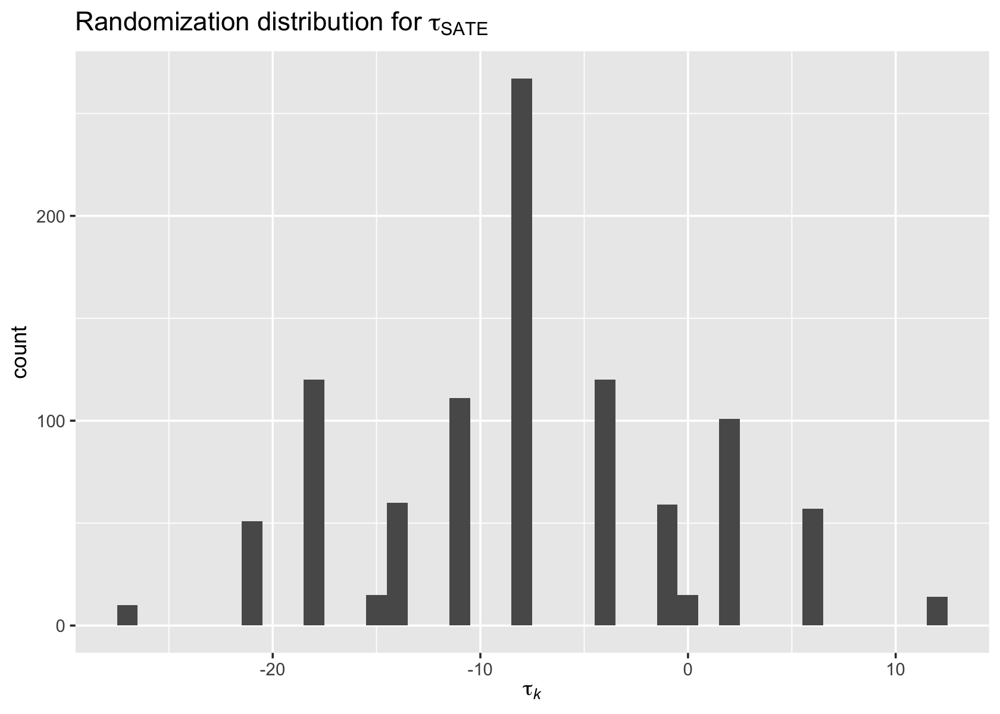
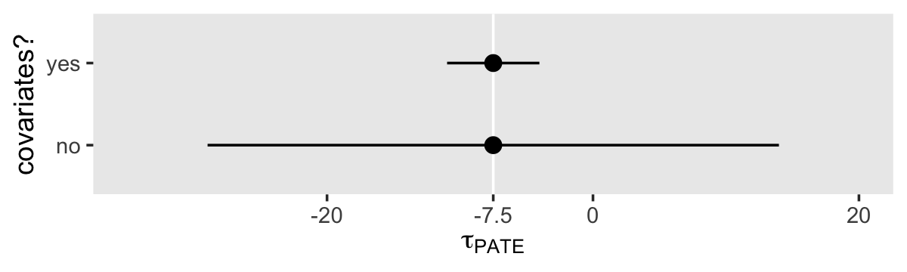

Chapter 18: Causal inference and randomized experiments
================
A Solomon Kurz
2023-01-30

# Causal inference and randomized experiments

> This section of the book considers *causal inference*, which concerns
> what *would happen* to an outcome $y$ as a result of a treatment,
> intervention, or exposure $z$, given pre-treatment information $x$.
> This chapter introduces the notation and ideas of causal inference in
> the context of randomized experiments, which allow clean inference for
> average causal effects and serve as a starting point for understanding
> the tools and challenges of causal estimation. (p. 339, *emphasis* in
> the original)

## 18.1 Basics of causal inference

> For most statisticians, ourselves included, causal effects are
> conceptualized as a comparison between different potential outcomes of
> what might have occurred under different scenarios. This comparison
> could be between a factual state (what did happen) and one or more
> counterfactual states (representing what might have happened), or it
> could be a comparison among various counterfactuals. (p. 339)

### 18.1.1 Running example.

- 4 friends are in a treatment condition where they 3 grams of fish oil
  supplement daily for a year
- another 4 friends are in the control condition where they do not take
  the fish oil supplement for that same year
- at the end of the year, you take systolic blood pressure for all 8
  friends
- 60 mmHg and higher are considered *high blood pressure*
- you presume everyone complied with the study parameters

### 18.1.2 Potential outcomes, counterfactuals, and causal effects.

- $z = 0$ denotes “no fish oil supplements ingested”
- $z = 1$ denotes “3 grams per day of fish oil supplements ingested”

The *potential outcomes* are:

- $y_i^0$: the blood pressure that would result if the person had no
  supplement
- $y_i^1$: the blood pressure that would result if the person had
  received the prescribed supplement

The *factual state* is what actually occurred for the participants; it
is observed. The *counterfactual state* is what we infer would have
occurred had the participants been in different conditions; it is not
observed.

The causal effect of the supplement is $\tau_i = y_i^1 - y_i^0$.

### 18.1.3 The fundamental problem of causal inference.

“The problem inherent in determining the effect for any given
individual, however, is that we can never observe both potential
outcomes $y_i^0$ *and* $y_i^1$” (p. 340).

Here’s the data for the table in Figure 18.1.

``` r
library(tidyverse)

d <-
  tibble(i         = c("Audrey", "Anna", "Bob", "Bill", "Caitlin", "Cara", "Dave", "Doug"),
         female    = c(1, 1, 0, 0, 1, 1, 0, 0),
         age       = rep(4:7 * 10, each = 2),
         treatment = rep(0:1, each = 4),
         y0        = c(140, 140, 150, 150, NA, NA, NA, NA),
         y1        = c(NA, NA, NA, NA, 155, 155, 160, 160),
         y         = ifelse(is.na(y1), y0, y1))

d
```

    ## # A tibble: 8 × 7
    ##   i       female   age treatment    y0    y1     y
    ##   <chr>    <dbl> <dbl>     <int> <dbl> <dbl> <dbl>
    ## 1 Audrey       1    40         0   140    NA   140
    ## 2 Anna         1    40         0   140    NA   140
    ## 3 Bob          0    50         0   150    NA   150
    ## 4 Bill         0    50         0   150    NA   150
    ## 5 Caitlin      1    60         1    NA   155   155
    ## 6 Cara         1    60         1    NA   155   155
    ## 7 Dave         0    70         1    NA   160   160
    ## 8 Doug         0    70         1    NA   160   160

“If treatments are randomly assigned, we can estimate an average causal
effect, but even then this will not tell us about the effect on any
given person” (p. 340).

### 18.1.4 Close substitutes.

Because of potential history effects, you cannot simply substitute
someone’s pre-treatment measure of the criterion for what their post
measure would have been had they not been in the treatment condition.
Say we’re talking about the $j$th participant. Maybe
$y_j^\text{before} = y_j^0$, or maybe $y_j^\text{before} \neq y_j^0$.
Even if you do some kind of ABA design, this is only valid if the
treatment in B has short-term effects. Sometimes you can overcome this
with a *washout period*, ABCA. Randomizing large numbers of people to
treatment conditions helps, some.

But also notice that even with an ABA or ABCA design, you still don’t
really overcome the missing-data problem with causal inference. A person
is only in one given phase at a time. At best, only 50% of the data are
ever present in the real world.

### 18.1.5 More than two treatment levels, continuous treatments, and multiple treatment factors.

> Going beyond a simple treatment-and-control setting, multiple
> treatment effects can be defined relative to a baseline level. With
> random assignment, this simply follows general principles of
> regression modeling….
>
> With several discrete treatments that are unordered, as in a
> comparison of three different sorts of psychotherapy, we can move to
> multilevel modeling, with the group index indicating the treatment
> assigned to each unit, and a second-level model on the group
> coefficients, or treatment effects.
>
> Additionally, multiple treatments can be administered in combination.
> For instance, depressed individuals could be randomly assigned to
> receive nothing, drugs, counseling sessions, or both drugs and
> counseling sessions. These combinations could be modeled as two
> treatments and their interaction or as four distinct treatments.
> (p. 342)

## 18.2 Average causal effects

“In experiments in which only one treatment is applied to each
individual, it will not be possible to estimate individual-level causal
effects, $y_i^1 - y_i^0$” (p. 342).

To make the table in Figure 18.2, update our `d` data.

``` r
d %>% 
  mutate(y0 = rep(14:17 * 10, each = 2),
         y1 = rep(c(27:28, 31:32) * 5, each = 2))
```

    ## # A tibble: 8 × 7
    ##   i       female   age treatment    y0    y1     y
    ##   <chr>    <dbl> <dbl>     <int> <dbl> <dbl> <dbl>
    ## 1 Audrey       1    40         0   140   135   140
    ## 2 Anna         1    40         0   140   135   140
    ## 3 Bob          0    50         0   150   140   150
    ## 4 Bill         0    50         0   150   140   150
    ## 5 Caitlin      1    60         1   160   155   155
    ## 6 Cara         1    60         1   160   155   155
    ## 7 Dave         0    70         1   170   160   160
    ## 8 Doug         0    70         1   170   160   160

If we actually had this information, we could compute
$\tau_i = y_i^1 - y_i^0$, the individual treatment effect for all $i$
cases. Thus, here are the $\tau_i$ values.

``` r
d %>% 
  mutate(y0 = rep(14:17 * 10, each = 2),
         y1 = rep(c(27:28, 31:32) * 5, each = 2)) %>% 
  mutate(tau = y1 - y0)
```

    ## # A tibble: 8 × 8
    ##   i       female   age treatment    y0    y1     y   tau
    ##   <chr>    <dbl> <dbl>     <int> <dbl> <dbl> <dbl> <dbl>
    ## 1 Audrey       1    40         0   140   135   140    -5
    ## 2 Anna         1    40         0   140   135   140    -5
    ## 3 Bob          0    50         0   150   140   150   -10
    ## 4 Bill         0    50         0   150   140   150   -10
    ## 5 Caitlin      1    60         1   160   155   155    -5
    ## 6 Cara         1    60         1   160   155   155    -5
    ## 7 Dave         0    70         1   170   160   160   -10
    ## 8 Doug         0    70         1   170   160   160   -10

A careful eye will notice how the men (`female == 0`) all have $\tau_i$
values if -10, whereas the women all have values of -5.

### 18.2.1 Sample average treatment effect (SATE).

Here’s how we might compute the average treatment effect, if we had all
the data.

``` r
d %>% 
  mutate(y0 = rep(14:17 * 10, each = 2),
         y1 = rep(c(27:28, 31:32) * 5, each = 2)) %>% 
  mutate(tau = y1 - y0) %>% 
  summarise(average_tx_effect = mean(tau))
```

    ## # A tibble: 1 × 1
    ##   average_tx_effect
    ##               <dbl>
    ## 1              -7.5

You call this the *sample average treatment effect* (SATE), which may be
defined as

$$\tau_\text{SATE} = \frac{1}{n} \sum_{i = 1}^n (y_i^1 - y_i^0).$$

We can also compute the SATE by subtracting the average of the $y_i^0$
values from the average of the $y_i^1$ values.

``` r
d %>% 
  mutate(y0 = rep(14:17 * 10, each = 2),
         y1 = rep(c(27:28, 31:32) * 5, each = 2)) %>% 
  summarise(y0_bar = mean(y0, na.rm = T),
            y1_bar = mean(y1, na.rm = T)) %>% 
  mutate(sate = y1_bar - y0_bar)
```

    ## # A tibble: 1 × 3
    ##   y0_bar y1_bar  sate
    ##    <dbl>  <dbl> <dbl>
    ## 1    155   148.  -7.5

### 18.2.2 Conditional average treatment effect (CATE).

The average treatment effect for a subset (e.g., based on race or sex)
is the *conditional average treatment effect* (CATE). Here’s the CATE by
`female`.

``` r
d %>% 
  mutate(y0 = rep(14:17 * 10, each = 2),
         y1 = rep(c(27:28, 31:32) * 5, each = 2)) %>% 
  mutate(y = y1 - y0) %>% 
  group_by(female) %>% 
  summarise(mean_tx_effect = mean(y))
```

    ## # A tibble: 2 × 2
    ##   female mean_tx_effect
    ##    <dbl>          <dbl>
    ## 1      0            -10
    ## 2      1             -5

Within the context of a regression model, you can also compute these for
continuous variables and for combinations of several variables.

### 18.2.3 Population average treatment effect (PATE).

Going beyond the sample, the *population average treatment effect*
(PATE) may be defined as

$$\tau_\text{PATE} = \frac{1}{N} \sum_{i = 1}^N (y_i^1 - y_i^0),$$

which is the same as the $\tau_\text{SATE}$, but with $N$ rather than
$n$. From the PATE perspective, we now have missing data for (a) the
counterfactual values within our sample and (b) all potential outcomes
for those within the population but not in our sample.

### 18.2.4 Problems with self-selection into treatment groups.

You can run into problems when experimental groups are not balanced on
all relevant variables. For example, our two `treatment` differ
substantially by their average `age`.

``` r
d %>% 
  group_by(treatment) %>% 
  summarise(mean_age = mean(age))
```

    ## # A tibble: 2 × 2
    ##   treatment mean_age
    ##       <int>    <dbl>
    ## 1         0       45
    ## 2         1       65

As a consequence of this and other similar randomization issues, the
true SATE will differ from the observed SATE.

``` r
d %>% 
  mutate(y0 = rep(14:17 * 10, each = 2),
         y1 = rep(c(27:28, 31:32) * 5, each = 2)) %>% 
  mutate(tau = y1 - y0) %>% 
  summarise(true_sate = mean(tau))
```

    ## # A tibble: 1 × 1
    ##   true_sate
    ##       <dbl>
    ## 1      -7.5

``` r
d %>% 
  summarise(y0_bar = mean(y0, na.rm = T),
            y1_bar = mean(y1, na.rm = T)) %>% 
  mutate(observed_sate = y1_bar - y0_bar)
```

    ## # A tibble: 1 × 3
    ##   y0_bar y1_bar observed_sate
    ##    <dbl>  <dbl>         <dbl>
    ## 1    145   158.          12.5

### 18.2.5 Using design and analysis to address imbalance and lack of overlap between treatment and control groups.

> In practice, we can never ensure that treatment and control groups are
> balanced on all relevant pre-treatment characteristics. However, there
> are statistical approaches that may bring us closer. At the design
> stage, we can use *randomization* to ensure that treatment and control
> groups are balanced in expectation, and we can use *blocking* to
> reduce the variation in any imbalance. At the analysis stage, we can
> *adjust* for pre-treatment variables to correct for differences
> between the two groups to reduce bias in our estimate of the sample
> average treatment effect. We can further adjust for differences
> between sample and population if our goal is to estimate the
> population average treatment effect. (p. 344, *emphasis* in the
> original)

## 18.3 Randomized experiments

We can randomly assign using the `sample()` function.

``` r
set.seed(18)

sample(c(0, 0, 0, 0, 1, 1, 1, 1), size = 8, replace = F)
```

    ## [1] 0 0 0 1 1 1 1 0

Here’s a more compact way to achieve the same kind of thing.

``` r
set.seed(18)

sample(0:1, size = 8, replace = T)
```

    ## [1] 1 1 0 1 1 1 1 0

Or also this.

``` r
set.seed(18)

sample(rep(0:1, each = 4), size = 8, replace = F)
```

    ## [1] 0 0 0 1 1 1 1 0

### 18.3.1 Completely randomized experiments.

“In a *completely randomized experiment*, the probability of being
assigned to the treatment is the same for each unit in the sample”
(p. 345, *emphasis* in the original).

#### 18.3.1.1 An idealized outcome from a completely randomized experiment.

Here’s our version of the table in Figure 18.3, if `treatment` condition
was assigned sequentially to every other participant.

``` r
d %>% 
  mutate(treatment = rep(0:1, times = 4)) %>% 
  mutate(y0 = rep(14:17 * 10, each = 2),
         y1 = rep(c(27:28, 31:32) * 5, each = 2)) %>% 
  mutate(y = ifelse(treatment == 0, y0, y1))
```

    ## # A tibble: 8 × 7
    ##   i       female   age treatment    y0    y1     y
    ##   <chr>    <dbl> <dbl>     <int> <dbl> <dbl> <dbl>
    ## 1 Audrey       1    40         0   140   135   140
    ## 2 Anna         1    40         1   140   135   135
    ## 3 Bob          0    50         0   150   140   150
    ## 4 Bill         0    50         1   150   140   140
    ## 5 Caitlin      1    60         0   160   155   160
    ## 6 Cara         1    60         1   160   155   155
    ## 7 Dave         0    70         0   170   160   170
    ## 8 Doug         0    70         1   170   160   160

Granted the values, above, here would be our $\tau_\text{SATE}$ value.

``` r
d %>% 
  mutate(treatment = rep(0:1, times = 4)) %>% 
  mutate(y0 = rep(14:17 * 10, each = 2),
         y1 = rep(c(27:28, 31:32) * 5, each = 2)) %>% 
  mutate(y = ifelse(treatment == 0, y0, y1)) %>% 
  group_by(treatment) %>% 
  summarise(y = mean(y)) %>% 
  pivot_wider(names_from = treatment, values_from = y) %>% 
  mutate(tau = `1` - `0`)
```

    ## # A tibble: 1 × 3
    ##     `0`   `1`   tau
    ##   <dbl> <dbl> <dbl>
    ## 1   155  148.  -7.5

We could also estimate this with the regression model
$y_i = a + \tau z_i + \text{error}_i$. However, the estimand from such a
model would be better thought of as a $\tau_\text{PATE}$.

#### 18.3.1.2 A less idealized randomized result.

Here we make the table of Figure 18.4, where randomization was
imperfect.

``` r
d %>% 
  mutate(treatment = rep(c(1, 0, 1), times = c(3, 4, 1))) %>% 
  mutate(y0 = rep(14:17 * 10, each = 2),
         y1 = rep(c(27:28, 31:32) * 5, each = 2)) %>% 
  mutate(y = ifelse(treatment == 0, y0, y1))
```

    ## # A tibble: 8 × 7
    ##   i       female   age treatment    y0    y1     y
    ##   <chr>    <dbl> <dbl>     <dbl> <dbl> <dbl> <dbl>
    ## 1 Audrey       1    40         1   140   135   135
    ## 2 Anna         1    40         1   140   135   135
    ## 3 Bob          0    50         1   150   140   140
    ## 4 Bill         0    50         0   150   140   150
    ## 5 Caitlin      1    60         0   160   155   160
    ## 6 Cara         1    60         0   160   155   160
    ## 7 Dave         0    70         0   170   160   170
    ## 8 Doug         0    70         1   170   160   160

Now `treatment` groups still differ notably by `age`.

``` r
d %>% 
  mutate(treatment = rep(c(1, 0, 1), times = c(3, 4, 1))) %>% 
  mutate(y0 = rep(14:17 * 10, each = 2),
         y1 = rep(c(27:28, 31:32) * 5, each = 2)) %>% 
  mutate(y = ifelse(treatment == 0, y0, y1)) %>% 
  group_by(treatment) %>% 
  summarise(mean_age = mean(age))
```

    ## # A tibble: 2 × 2
    ##   treatment mean_age
    ##       <dbl>    <dbl>
    ## 1         0       60
    ## 2         1       50

Granted the values, above, our estimate of $\tau$ comes out biased.

``` r
d %>% 
  mutate(treatment = rep(c(1, 0, 1), times = c(3, 4, 1))) %>% 
  mutate(y0 = rep(14:17 * 10, each = 2),
         y1 = rep(c(27:28, 31:32) * 5, each = 2)) %>% 
  mutate(y = ifelse(treatment == 0, y0, y1)) %>% 
  group_by(treatment) %>% 
  summarise(y = mean(y)) %>% 
  pivot_wider(names_from = treatment, values_from = y) %>% 
  mutate(tau = `1` - `0`)
```

    ## # A tibble: 1 × 3
    ##     `0`   `1`   tau
    ##   <dbl> <dbl> <dbl>
    ## 1   160  142. -17.5

In another way of speaking, out $\tau_\text{SATE}$ is a biased estimator
of the $\tau_\text{PATE}$.

## 18.4 Sampling distributions, randomization distributions, and bias in estimation

The authors suggested an alternative way to think about sampling
distributions is to suppose we had all the true values for $y_i^0$,
$y_i^1$, and the relevant baseline covariates in our sample, and we
randomly assigned participants to receive either treatment or control
again and again, each time computing the estimate for $\tau$ conditional
on their observed treatment. Here’s a simulation function which can do
just that.

``` r
sim_tau <- function(seed){
  
  set.seed(seed)
  
  d %>% 
    mutate(treatment = sample(rep(0:1, each = 4), size = 8, replace = F)) %>% 
    mutate(y0 = rep(14:17 * 10, each = 2),
           y1 = rep(c(27:28, 31:32) * 5, each = 2)) %>% 
    mutate(y = ifelse(treatment == 0, y0, y1)) %>% 
    group_by(treatment) %>% 
    summarise(y = mean(y)) %>% 
    pivot_wider(names_from = treatment, values_from = y) %>% 
    mutate(tau = `1` - `0`) %>% 
    pull(tau)
  
}

# how does it work?
sim_tau(seed = 1)
```

    ## [1] 6.25

Run the simulation 1,000 times.

``` r
sim1 <- tibble(k = 1:1000) %>% 
  mutate(tau = map_dbl(k, sim_tau))
```

This simulation took about 20 seconds on my laptop. Anyway, here’s our
sampling distribution for the $\tau_\text{SATE}$.

``` r
sim1 %>% 
  ggplot(aes(x = tau)) +
  geom_histogram(binwidth = 1) +
  labs(title = expression("Randomization distribution for "*tau[SATE]),
       x = expression(tau[italic(k)]))
```



Here are the descriptive statistics.

``` r
sim1 %>% 
  summarise(mean = mean(tau),
            sd = sd(tau))
```

    ## # A tibble: 1 × 2
    ##    mean    sd
    ##   <dbl> <dbl>
    ## 1  -7.5  7.86

Happily, the mean of our sampling distribution is the true value -7.5.
Thus, the estimator is unbiased. The standard deviation for the sampling
distribution is how we assess the efficiency. It’s hard to assess this
in the abstract, but an $\textit{SD}$ of that size in this context is a
little large, suggesting we have an inefficient estimator of $\tau$.
Given our tiny $N = 8$ design, this should be of no surprise.

> When considering the population average treatment effect, we can
> conceptualize drawing a random sample of size $n_1$ from a population
> to receive the treatment, drawing a random sample of size $n_0$ from
> the same population to receive the control, and taking the difference
> between the average response in each as an estimate of the population
> average treatment effect. If this were done over and over, the
> estimates would form a sampling distribution for this estimate. For
> the estimate to be unbiased, we would need the mean of this sampling
> distribution to be centered on the true $\tau_\text{PATE}$. A stricter
> criterion that would also lead to an unbiased treatment effect
> estimate would require the sampling distributions of the mean of $y$
> for the control and treated units to be centered on the population
> average of $y_0$ and the population average of $y_1$, respectively.
>
> Even if an estimate is unbiased, this does not guarantee that the
> estimate from any particular random assignment will be close to the
> true value of the estimand, particularly when the sample is small.
> (pp. 346–347)

## 18.5 Using additional information in experimental design

“In many experimental settings, pre-treatment information is available
that can be used in the experimental design to yield more precise and
less biased estimates of treatment effects” (p. 347). The reason the
`treatment` assignment from the data in Figure 18.3 yielded an unbiased
estimate is because of how every two rows (e.g., 1 and 2, 3 and 4, …)
were effectively grouped by `age`. By assigning `treatment` to every
other row, it was effectively randomized by *blocks*.

### 18.5.1 Randomized blocks experiments.

Here are the data for the expanded experiment of Figure 18.5, where
`treatment` is not equal across `age` blocks.

``` r
d <-
  tibble(i         = c("Audrey", "Abigail", "Arielle", "Anna", "Bob", "Bill", "Burt", "Brad", "Caitlin", "Cara", "Cassie", "Cindy", "Dave", "Doug", "Dylan", "Derik"),
         female    = rep(c(0, 1, 0, 1), each = 4),
         age       = rep(4:7 * 10, each = 4),
         treatment = rep(c(0, 1, 0, 1, 0, 1, 0, 1), times = c(3, 1, 3, 1, 1, 3, 1, 3)),
         y0        = rep(14:17 * 10, each = 4),
         y1        = rep(c(27:28, 31:32) * 5, each = 4)) %>% 
  mutate(y = ifelse(treatment == 0, y0, y1))

d
```

    ## # A tibble: 16 × 7
    ##    i       female   age treatment    y0    y1     y
    ##    <chr>    <dbl> <dbl>     <dbl> <dbl> <dbl> <dbl>
    ##  1 Audrey       0    40         0   140   135   140
    ##  2 Abigail      0    40         0   140   135   140
    ##  3 Arielle      0    40         0   140   135   140
    ##  4 Anna         0    40         1   140   135   135
    ##  5 Bob          1    50         0   150   140   150
    ##  6 Bill         1    50         0   150   140   150
    ##  7 Burt         1    50         0   150   140   150
    ##  8 Brad         1    50         1   150   140   140
    ##  9 Caitlin      0    60         0   160   155   160
    ## 10 Cara         0    60         1   160   155   155
    ## 11 Cassie       0    60         1   160   155   155
    ## 12 Cindy        0    60         1   160   155   155
    ## 13 Dave         1    70         0   170   160   170
    ## 14 Doug         1    70         1   170   160   160
    ## 15 Dylan        1    70         1   170   160   160
    ## 16 Derik        1    70         1   170   160   160

Now the “number of treated units is no longer equal to the number of
control units within each \[age\] block” (p. 347). We can shake this out
with `count()`. The last `pivot_wider()` line just reformats the output.

``` r
d %>% 
  count(age, treatment) %>% 
  pivot_wider(names_from = age, values_from = n)
```

    ## # A tibble: 2 × 5
    ##   treatment  `40`  `50`  `60`  `70`
    ##       <dbl> <int> <int> <int> <int>
    ## 1         0     3     3     1     1
    ## 2         1     1     1     3     3

As a consequence, the overall sample estimate for $\tau$ is biased.

``` r
d %>% 
  group_by(treatment) %>% 
  summarise(y = mean(y)) %>% 
  pivot_wider(names_from = treatment, values_from = y) %>% 
  mutate(tau = `1` - `0`)
```

    ## # A tibble: 1 × 3
    ##     `0`   `1`   tau
    ##   <dbl> <dbl> <dbl>
    ## 1   150  152.   2.5

Here’s what happens if we compute $\hat \tau_j$ within each of the $j$
`age` block.

``` r
d %>% 
  group_by(age, treatment) %>% 
  summarise(y = mean(y)) %>% 
  pivot_wider(names_from = treatment, values_from = y) %>% 
  mutate(tau_j = `1` - `0`)
```

    ## # A tibble: 4 × 4
    ## # Groups:   age [4]
    ##     age   `0`   `1` tau_j
    ##   <dbl> <dbl> <dbl> <dbl>
    ## 1    40   140   135    -5
    ## 2    50   150   140   -10
    ## 3    60   160   155    -5
    ## 4    70   170   160   -10

If we take the average of the $\hat \tau_j$’s, we’ll get an unbiased
estimate.

``` r
d %>% 
  group_by(age, treatment) %>% 
  summarise(y = mean(y)) %>% 
  pivot_wider(names_from = treatment, values_from = y) %>% 
  mutate(tau_j = `1` - `0`) %>% 
  ungroup() %>% 
  summarise(tau = mean(tau_j))
```

    ## # A tibble: 1 × 1
    ##     tau
    ##   <dbl>
    ## 1  -7.5

More formally, this was

$$
\tau_\text{SATE} = \sum_j n_j \hat \tau_j \Big / \sum_j n_j.
$$

You can also get an unbiased estimate by fitting the model

$$y_i = a + \tau_\text{RB} z_i + \gamma_1 b_{1i} + \gamma_2 b_{2i} + \gamma_3 b_{3i} + \text{error}_i,$$

where $\tau_\text{RB}$ is the focal parameter, and the treatment effect
given a random block design. The $a$ parameter is the typical intercept,
and the three $\gamma$ parameters denote the deviations based on the
block dummies. Here’s how to fit the model with \*`lm()`.

``` r
m18.1 <-
  lm(data = d,
     y ~ 1 + treatment + factor(age))
```

Check the model summary.

``` r
summary(m18.1)
```

    ## 
    ## Call:
    ## lm(formula = y ~ 1 + treatment + factor(age), data = d)
    ## 
    ## Residuals:
    ##    Min     1Q Median     3Q    Max 
    ## -1.875 -0.625  0.000  0.625  1.875 
    ## 
    ## Coefficients:
    ##               Estimate Std. Error t value Pr(>|t|)    
    ## (Intercept)   140.6250     0.6794 206.970  < 2e-16 ***
    ## treatment      -7.5000     0.7538  -9.950 7.77e-07 ***
    ## factor(age)50   8.7500     0.9232   9.478 1.26e-06 ***
    ## factor(age)60  21.2500     0.9972  21.311 2.70e-10 ***
    ## factor(age)70  27.5000     0.9972  27.578 1.66e-11 ***
    ## ---
    ## Signif. codes:  0 '***' 0.001 '**' 0.01 '*' 0.05 '.' 0.1 ' ' 1
    ## 
    ## Residual standard error: 1.306 on 11 degrees of freedom
    ## Multiple R-squared:  0.9873, Adjusted R-squared:  0.9827 
    ## F-statistic: 213.6 on 4 and 11 DF,  p-value: 2.406e-10

The parameter in the `treatment` line is our causal effect,
$\tau_\text{RB}$.

#### 18.5.1.1 Motivations for randomization in blocks.

#### 18.5.1.2 Defining blocks in practice.

> How do we choose blocks when our goal is to increase statistical
> efficiency? The goal when creating blocks is to minimize the variation
> of each type of potential outcome, $y^0$ and $y^1$, within the block…
> In practice researchers only have access to observed pre-treatment
> variables when making decisions regarding how to define blocks… To the
> extent possible, the predictors used to define the blocks should be
> those that are believed to be predictive of the outcome based on
> either theory or on results from previous studies. (p. 349)

### 18.5.2 Matched pairs experiments.

Matched pairs randomized experiments are special cases of a randomized
block design where each matched pair is a 2-unit block, such as in the
case of twins. Within each pair, you randomize one to each of the two
levels of treatment. This can make more efficient estimation due to the
high homogeneity within blocks.

### 18.5.3 Group or cluster-randomized experiments.

> Sometimes it is difficult or problematic to randomize treatment
> assignments to individual units, and so researchers instead randomize
> groups or clusters to receive the treatment. This design choice might
> be motivated by how a treatment is implemented. For instance, group
> therapy strategies typically are implemented at the group level–that
> is, with every person in a group receiving the same treatment.
> (p. 349)

### 18.5.4 Using design-relevant information in subsequent data analysis.

Though blocking is sometimes more efficient than pure randomization,
cluster randomizing is often less efficient.

> It is best to include pre-treatment information in the design if this
> is feasible. But in any case, whether or not this information is
> accounted for in the design, it should be included in the analysis by
> including relevant pre-treatment information as predictors. (p. 350)

## 18.6 Properties, assumptions, and limitations of randomized experiments

> When the design yields no average differences between groups, a simple
> difference in means will yield an unbiased estimate of the sample
> average treatment effect, and a regression on treatment indicator,
> also adjusting for pre-treatment predictors, will also be unbiased but
> can do even better by reducing variance. (p. 350)

### 18.6.1 Ignorability.

#### 18.6.1.1 Completely randomized experiments.

“In a completely randomized design, the treatment assignment is a random
variable that is independent of the potential outcomes” (p. 350). This
implies that there will be no difference, on average, in potential
outcomes across repeated randomizations, a condition called
*ignorability*. We can express this as $z \perp y^0, y^1$.

> Another important property of randomized experiments is that they
> create independence between treatment assignment and all variables $x$
> that occur before treatment assignment, so that $x \perp z$. In
> general, the relevant cutoff time is when the treatment is *assigned*,
> not when it is *implemented*, because people can adjust their behavior
> based on the anticipation of a treatment to which they have been
> assigned. (p. 351, *emphasis* in the original)

#### 18.6.1.2 Randomized blocks experiments.

“When we randomize within blocks, the independence between potential
outcomes and the treatment variable holds only conditional on block
membership, $w$” (p. 351). We can express this formally as
$z \perp y^0, y^1 | w$. “Intuitively, we can think of a randomized block
experiment as a collection of experiments, each of which is performed
within the members of a specific block” (p. 351). The implication is we
want to include $w$ as a covariate in the primary data analysis.

#### 18.6.1.3 Matched pairs experiments.

> The most straightforward approach to treatment effect estimation that
> accounts for the matched pairs design is to calculate pair-specific
> differences in outcomes, $d_j = y_j^T - y_j^C$ (where $y_j^T$ is the
> outcome of the treated unit in pair $j$ and $y_j^C$ is the outcome of
> the control unit in pair $j$), and then calculate an average of those
> $K$ differences, $\overline d = \frac{1}{K} \sum_{k=1}^K d_j$.
> Including a predictor for each pair makes such models noisy to
> estimate using simple regression; data from such designs can often be
> more efficiently fit using multilevel models. (p. 352)

### 18.6.2 Efficiency.

> The more similar the potential outcomes are across treatment groups,
> the *closer* our estimate will be on average to the value of the
> estimand. Said another way, the more similar are the units being
> compared across treatment groups, the smaller the variance of the
> randomization or sampling distribution will be. (p. 352, *emphasis* in
> the original)

#### 18.6.2.1 Randomized blocks experiments.

> Ideally, the randomized block experiment creates subgroups (blocks)
> within which the $y_i^0$’s are more similar to each other and the
> $y_i^1$’s are more similar to each other across treatment groups. This
> makes it possible to get sharper estimates of block-specific treatment
> effects, which can then be combined using a weighted average into an
> estimate of the average treatment effect across the entire
> experimental sample or population. (p. 352)

#### 18.6.2.2 Increasing precision by adjusting for pre-treatment variables.

Once again, here are the data from Figure 18.3.

``` r
d <-
  tibble(i         = c("Audrey", "Anna", "Bob", "Bill", "Caitlin", "Cara", "Dave", "Doug"),
         female    = c(1, 1, 0, 0, 1, 1, 0, 0),
         age       = rep(4:7 * 10, each = 2),
         treatment = rep(0:1, times = 4),
         y0        = rep(14:17 * 10, each = 2),
         y1        = rep(c(27:28, 31:32) * 5, each = 2)) %>% 
  mutate(y = ifelse(treatment == 0, y0, y1))

d
```

    ## # A tibble: 8 × 7
    ##   i       female   age treatment    y0    y1     y
    ##   <chr>    <dbl> <dbl>     <int> <dbl> <dbl> <dbl>
    ## 1 Audrey       1    40         0   140   135   140
    ## 2 Anna         1    40         1   140   135   135
    ## 3 Bob          0    50         0   150   140   150
    ## 4 Bill         0    50         1   150   140   140
    ## 5 Caitlin      1    60         0   160   155   160
    ## 6 Cara         1    60         1   160   155   155
    ## 7 Dave         0    70         0   170   160   170
    ## 8 Doug         0    70         1   170   160   160

On page 352, the authors commented on the standard errors for the models

$$
\begin{align*}
y_i & \sim \operatorname N(\mu_i, \sigma) \\
\mu_i & = a + \tau\ \text{treatment}_i
\end{align*}
$$

and

$$
\begin{align*}
y_i & \sim \operatorname N(\mu_i, \sigma) \\
\mu_i & = a + \tau\ \text{treatment}_i + b_1 \text{female}_i + b_2 \text{age}_i.
\end{align*}
$$

Though they didn’t show example code fitting these in the text, here we
fit them with `lm()`.

``` r
m18.2 <-
  lm(data = d,
     y ~ 1 + treatment)

m18.3 <-
  lm(data = d,
     y ~ 1 + treatment + female + age)
```

Compare the model summaries.

``` r
summary(m18.2)
```

    ## 
    ## Call:
    ## lm(formula = y ~ 1 + treatment, data = d)
    ## 
    ## Residuals:
    ##    Min     1Q Median     3Q    Max 
    ## -15.00  -8.75   0.00   8.75  15.00 
    ## 
    ## Coefficients:
    ##             Estimate Std. Error t value Pr(>|t|)    
    ## (Intercept)  155.000      6.208  24.967 2.72e-07 ***
    ## treatment     -7.500      8.780  -0.854    0.426    
    ## ---
    ## Signif. codes:  0 '***' 0.001 '**' 0.01 '*' 0.05 '.' 0.1 ' ' 1
    ## 
    ## Residual standard error: 12.42 on 6 degrees of freedom
    ## Multiple R-squared:  0.1084, Adjusted R-squared:  -0.04016 
    ## F-statistic: 0.7297 on 1 and 6 DF,  p-value: 0.4258

``` r
summary(m18.3)
```

    ## 
    ## Call:
    ## lm(formula = y ~ 1 + treatment + female + age, data = d)
    ## 
    ## Residuals:
    ##     1     2     3     4     5     6     7     8 
    ## -1.25  1.25  1.25 -1.25 -1.25  1.25  1.25 -1.25 
    ## 
    ## Coefficients:
    ##             Estimate Std. Error t value Pr(>|t|)    
    ## (Intercept)  98.7500     3.9031  25.300 1.45e-05 ***
    ## treatment    -7.5000     1.2500  -6.000  0.00388 ** 
    ## female        2.5000     1.3975   1.789  0.14815    
    ## age           1.0000     0.0625  16.000 8.92e-05 ***
    ## ---
    ## Signif. codes:  0 '***' 0.001 '**' 0.01 '*' 0.05 '.' 0.1 ' ' 1
    ## 
    ## Residual standard error: 1.768 on 4 degrees of freedom
    ## Multiple R-squared:  0.988,  Adjusted R-squared:  0.9789 
    ## F-statistic: 109.3 on 3 and 4 DF,  p-value: 0.0002711

Note how the standard error values for `treatment` are right in line
with the values discussed in the bottom of page 352 in the text.
Importantly, this highlights the advantage of high-quality covariates
when analyzing RCT data. They shrink the standard error for the focal
parameter $\tau$. To get a full sense of the magnitude of the shrinkage,
we might look at a coefficient plot.

``` r
library(broom)

bind_rows(
  tidy(m18.2, conf.int = T),
  tidy(m18.3, conf.int = T)
) %>% 
  filter(term == "treatment") %>% 
  mutate(covariates = c("no", "yes")) %>% 
  
  ggplot(aes(x = estimate, xmin = conf.low, xmax = conf.high, y = covariates)) +
  geom_vline(xintercept = -7.5, color = "white") +
  geom_pointrange() +
  scale_x_continuous(expression(tau[PATE]), expand = expansion(mult = 0.2),
                     breaks = c(-20, -7.5, 0, 20), labels = c("-20", -7.5, "0", "20")) +
  ylab("covariates?") +
  theme(panel.grid = element_blank())
```



In this case, the shrinkage was particularly extreme because of the tiny
sample size.

### 18.6.3 Stable unit treatment value assumption (SUTVA): no interference among units and no hidden versions of the treatment.

The *stable unit treatment value assumption* (SUTVA) is “the potential
outcome for unit $i$ depends only on the treatment” (p. 353), which
means the treatment status of a given participant does not effect the
status of other participants. It also means that the kind or intensity
of treatment is stable across time and participants.

### 18.6.4 External validity: Difficulty of extrapolating to new individuals and situations.

“To the extent that the sample is not representative of the population,
and that the environment in the study does not reflect the outside
world, we say that the design lacks *external validity*” (p. 353,
*emphasis* in the original).

### 18.6.5 How the experiment affects the participants.

### 18.6.6 Missing data and noncompliance.

## Session info

``` r
sessionInfo()
```

    ## R version 4.2.2 (2022-10-31)
    ## Platform: x86_64-apple-darwin17.0 (64-bit)
    ## Running under: macOS Big Sur ... 10.16
    ## 
    ## Matrix products: default
    ## BLAS:   /Library/Frameworks/R.framework/Versions/4.2/Resources/lib/libRblas.0.dylib
    ## LAPACK: /Library/Frameworks/R.framework/Versions/4.2/Resources/lib/libRlapack.dylib
    ## 
    ## locale:
    ## [1] en_US.UTF-8/en_US.UTF-8/en_US.UTF-8/C/en_US.UTF-8/en_US.UTF-8
    ## 
    ## attached base packages:
    ## [1] stats     graphics  grDevices utils     datasets  methods   base     
    ## 
    ## other attached packages:
    ##  [1] broom_1.0.2     forcats_0.5.1   stringr_1.4.1   dplyr_1.0.10   
    ##  [5] purrr_1.0.1     readr_2.1.2     tidyr_1.2.1     tibble_3.1.8   
    ##  [9] ggplot2_3.4.0   tidyverse_1.3.2
    ## 
    ## loaded via a namespace (and not attached):
    ##  [1] tidyselect_1.2.0    xfun_0.35           haven_2.5.1        
    ##  [4] gargle_1.2.0        colorspace_2.0-3    vctrs_0.5.1        
    ##  [7] generics_0.1.3      htmltools_0.5.3     yaml_2.3.5         
    ## [10] utf8_1.2.2          rlang_1.0.6         pillar_1.8.1       
    ## [13] withr_2.5.0         glue_1.6.2          DBI_1.1.3          
    ## [16] dbplyr_2.2.1        modelr_0.1.8        readxl_1.4.1       
    ## [19] lifecycle_1.0.3     munsell_0.5.0       gtable_0.3.1       
    ## [22] cellranger_1.1.0    rvest_1.0.2         evaluate_0.18      
    ## [25] labeling_0.4.2      knitr_1.40          tzdb_0.3.0         
    ## [28] fastmap_1.1.0       fansi_1.0.3         highr_0.9          
    ## [31] scales_1.2.1        backports_1.4.1     googlesheets4_1.0.1
    ## [34] jsonlite_1.8.4      farver_2.1.1        fs_1.5.2           
    ## [37] hms_1.1.1           digest_0.6.31       stringi_1.7.8      
    ## [40] grid_4.2.2          cli_3.6.0           tools_4.2.2        
    ## [43] magrittr_2.0.3      crayon_1.5.2        pkgconfig_2.0.3    
    ## [46] ellipsis_0.3.2      xml2_1.3.3          reprex_2.0.2       
    ## [49] googledrive_2.0.0   lubridate_1.8.0     assertthat_0.2.1   
    ## [52] rmarkdown_2.16      httr_1.4.4          rstudioapi_0.13    
    ## [55] R6_2.5.1            compiler_4.2.2
