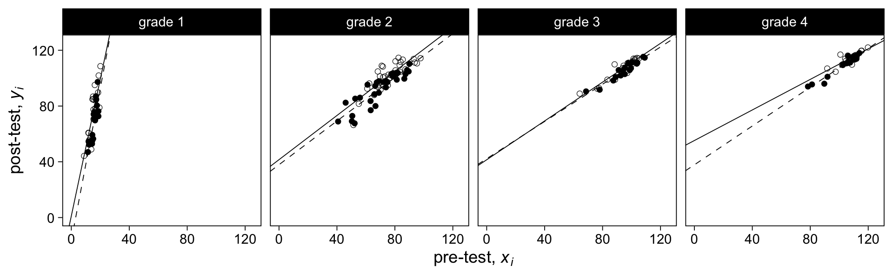

Chapter 19: Causal inference using regression on the treatment variable
================
A Solomon Kurz
2021-01-03

# Causal inference using regression on the treatment variable

> This chapter illustrates the use of regression in the setting of
> controlled experiments, going through issues of adjustment for
> pre-treatment predictors, interactions, and pitfalls that can arise
> when building a regression using experimental data and interpreting
> coefficients causally. (p. 363)

## 19.1 Pre-treatment covariates, treatments, and potential outcomes

Three kinds of data are

  - pre-treatment measurements (*covariates*),
  - treatment status (\(z_i\)), and
  - potential outcomes (\(y_i\)).

## 19.2 Example: the effect of showing children an educational television show

Load the `electric.csv` data.

``` r
library(tidyverse)
library(tidybayes)

electric <- read_csv("ROS-Examples-master/ElectricCompany/data/electric.csv")

head(electric)
```

    ## # A tibble: 6 x 7
    ##      X1 post_test pre_test grade treatment  supp pair_id
    ##   <dbl>     <dbl>    <dbl> <dbl>     <dbl> <dbl>   <dbl>
    ## 1     1      48.9     13.8     1         1     1       1
    ## 2     2      70.5     16.5     1         1     0       2
    ## 3     3      89.7     18.5     1         1     1       3
    ## 4     4      44.2      8.8     1         1     0       4
    ## 5     5      77.5     15.3     1         1     1       5
    ## 6     6      84.7     15       1         1     0       6

### 19.2.1 Displaying the data two different ways.

To help get a sense of the data, here are the `X1`-level trajectories
for the `pre_test` and `post_test` scores, faceted by `grade` and
`treatment`.

``` r
# set the global plotting theme
theme_set(theme_linedraw() +
            theme(panel.grid = element_blank()))

# wrangle
electric %>% 
  pivot_longer(ends_with("test"), values_to = "score") %>% 
  mutate(grade     = str_c("grade ", grade),
         time      = ifelse(name == "pre_test", 0, 1),
         treatment = factor(treatment, 
                            levels = 0:1,
                            labels = c("control", "treatment"))) %>% 
  
  # plot
  ggplot(aes(x = time, y = score, group = X1, color = treatment)) +
  geom_line(size = 1/6) +
  scale_color_viridis_d(option = "A", end = .67, breaks = NULL) +
  scale_x_continuous(NULL, limits = c(-0.2, 1.2), 
                     breaks = 0:1, labels = c("pre_test", "post_test")) +
  facet_grid(grade~treatment)
```


Before we make Figure 19.2, which focuses on the `post_test`
distributions, we’ll first want to make a data set summarizing the mean
and sd values.

``` r
text <-
  electric %>% 
  mutate(grade     = str_c("Grade ", grade),
         treatment = factor(treatment, 
                            levels = 0:1,
                            labels = c("Test scores in control classes", "Test scores in treated classes"))) %>% 
  group_by(grade, treatment) %>% 
  summarise(mean = mean(post_test),
            sd   = sd(post_test)) %>% 
  mutate_if(is.double, round, digits = 0) %>% 
  mutate(mean = str_c("mean = ", mean),
         sd   = str_c("sd = ", sd)) %>% 
  pivot_longer(mean:sd, values_to = "label") %>% 
  mutate(post_test = if_else(name == "mean", 5, 10),
         count     = if_else(name == "mean", 8, 6))

text
```

    ## # A tibble: 16 x 6
    ## # Groups:   grade [4]
    ##    grade   treatment                      name  label      post_test count
    ##    <chr>   <fct>                          <chr> <chr>          <dbl> <dbl>
    ##  1 Grade 1 Test scores in control classes mean  mean = 69          5     8
    ##  2 Grade 1 Test scores in control classes sd    sd = 13           10     6
    ##  3 Grade 1 Test scores in treated classes mean  mean = 77          5     8
    ##  4 Grade 1 Test scores in treated classes sd    sd = 16           10     6
    ##  5 Grade 2 Test scores in control classes mean  mean = 93          5     8
    ##  6 Grade 2 Test scores in control classes sd    sd = 12           10     6
    ##  7 Grade 2 Test scores in treated classes mean  mean = 102         5     8
    ##  8 Grade 2 Test scores in treated classes sd    sd = 10           10     6
    ##  9 Grade 3 Test scores in control classes mean  mean = 106         5     8
    ## 10 Grade 3 Test scores in control classes sd    sd = 7            10     6
    ## 11 Grade 3 Test scores in treated classes mean  mean = 107         5     8
    ## 12 Grade 3 Test scores in treated classes sd    sd = 8            10     6
    ## 13 Grade 4 Test scores in control classes mean  mean = 110         5     8
    ## 14 Grade 4 Test scores in control classes sd    sd = 7            10     6
    ## 15 Grade 4 Test scores in treated classes mean  mean = 114         5     8
    ## 16 Grade 4 Test scores in treated classes sd    sd = 4            10     6

Now make Figure 19.2 with help from `facet_grid()`, which will divide
the plot into a \(4 \times 2\) grid.

``` r
# wrangle
electric %>% 
  mutate(grade     = str_c("Grade ", grade),
         treatment = factor(treatment, 
                            levels = 0:1,
                            labels = c("Test scores in control classes", "Test scores in treated classes"))) %>% 
  
  # plot
  ggplot(aes(x = post_test)) +
  geom_histogram(boundary = 0, binwidth = 5,
                 fill = "grey75", color = "black", size = 1/4) +
  geom_text(data = text,
            aes(y = count, label = label),
            hjust = 0) +
  scale_x_continuous(NULL, breaks = 0:2 * 50, 
                     limits = c(0, 125), expand = c(0, 0)) +
  scale_y_continuous(NULL, breaks = NULL, expand = expansion(mult = c(0, 0.05))) +
  theme(axis.ticks.x = element_blank()) +
  facet_grid(grade~treatment)
```


To visualize the data as in Figure 19.3, we’ll want to first make a
`vline` tibble that has the mean values for each of the `grade` by
`treatment` groupings.

``` r
vline <-
  electric %>% 
  mutate(grade     = str_c("Grade ", grade),
         treatment = factor(treatment, 
                            levels = 0:1,
                            labels = c("Control classes", "Treated classes"))) %>% 
  group_by(grade, treatment) %>% 
  summarise(mean = mean(post_test))

vline
```

    ## # A tibble: 8 x 3
    ## # Groups:   grade [4]
    ##   grade   treatment        mean
    ##   <chr>   <fct>           <dbl>
    ## 1 Grade 1 Control classes  68.8
    ## 2 Grade 1 Treated classes  77.1
    ## 3 Grade 2 Control classes  93.2
    ## 4 Grade 2 Treated classes 102. 
    ## 5 Grade 3 Control classes 106. 
    ## 6 Grade 3 Treated classes 107. 
    ## 7 Grade 4 Control classes 110. 
    ## 8 Grade 4 Treated classes 114.

Now make Figure 19.3.

``` r
# wrangle
electric %>% 
  mutate(grade     = str_c("Grade ", grade),
         treatment = factor(treatment, 
                            levels = 0:1,
                            labels = c("Control classes", "Treated classes"))) %>% 
  
  # plot
  ggplot(aes(x = post_test)) +
  geom_histogram(boundary = 0, binwidth = 5,
                 fill = "grey75", color = "black", size = 1/4) +
  geom_vline(data = vline,
             aes(xintercept = mean),
             size = 1, color = "royalblue") +
  scale_x_continuous(NULL, breaks = 2:4 * 25, 
                     limits = c(40, 125), expand = c(0, 0)) +
  scale_y_continuous(NULL, breaks = NULL, expand = expansion(mult = c(0, 0.05))) +
  theme(axis.ticks.x = element_blank()) +
  facet_grid(treatment~grade)
```


### 19.2.2 Paired comparisons design.

The study used a a matched pairs design, which is depicted in the
`pair_id` column.

``` r
electric %>% 
  count(pair_id)
```

    ## # A tibble: 96 x 2
    ##    pair_id     n
    ##      <dbl> <int>
    ##  1       1     2
    ##  2       2     2
    ##  3       3     2
    ##  4       4     2
    ##  5       5     2
    ##  6       6     2
    ##  7       7     2
    ##  8       8     2
    ##  9       9     2
    ## 10      10     2
    ## # … with 86 more rows

However, Gelman et al adopted to keep things simple and analyze these
data without accounting for this pairing.

### 19.2.3 Simple difference estimate (equivalently, regression on an indicator for treatment), appropriate for a completely randomized experiment with no pre-treatment variables.

We start by fitting the simple model

\[
\begin{align*}
\text{post_test}_i & \sim \operatorname N(\mu_i, \sigma) \\
\mu_i & = a + b\ \text{treatment}_i.
\end{align*}
\]

If we use more generic notation where the post-intervention criterion is
\(y_i\), the treatment is denoted \(z_i\), and the coefficient for the
treatment effect is \(\theta\), we might re-write the model as

\[
\begin{align*}
y_i & \sim \operatorname N(\mu_i, \sigma) \\
\mu_i & = a + \theta z_i.
\end{align*}
\]

Fit the model with **brms**.

``` r
library(brms)

m19.1 <-
  brm(data = electric,
      post_test ~ treatment,
      seed = 19,
      file = "fits/m19.01")
```

Check the model summary.

``` r
print(m19.1, robust = T)
```

    ##  Family: gaussian 
    ##   Links: mu = identity; sigma = identity 
    ## Formula: post_test ~ treatment 
    ##    Data: electric (Number of observations: 192) 
    ## Samples: 4 chains, each with iter = 2000; warmup = 1000; thin = 1;
    ##          total post-warmup samples = 4000
    ## 
    ## Population-Level Effects: 
    ##           Estimate Est.Error l-95% CI u-95% CI Rhat Bulk_ESS Tail_ESS
    ## Intercept    94.35      1.81    90.83    97.91 1.00     4034     2784
    ## treatment     5.62      2.48     0.66    10.61 1.00     4809     3132
    ## 
    ## Family Specific Parameters: 
    ##       Estimate Est.Error l-95% CI u-95% CI Rhat Bulk_ESS Tail_ESS
    ## sigma    17.60      0.90    16.04    19.52 1.00     3933     3005
    ## 
    ## Samples were drawn using sampling(NUTS). For each parameter, Bulk_ESS
    ## and Tail_ESS are effective sample size measures, and Rhat is the potential
    ## scale reduction factor on split chains (at convergence, Rhat = 1).

### 19.2.4 Separate analysis within each grade.

To serially fit the model individually by `grade`, we’ll use the
`purrr::map()` approach to iteration.

``` r
fits1 <-
  electric %>% 
  nest(data = c(X1, post_test, pre_test, treatment, supp, pair_id)) %>% 
  mutate(fit = map(data, ~update(m19.1,
                                 newdata = .,
                                 seed = 19)))
```

Here’s how we might work with output to make the left panel of Figure
19.4.

``` r
p1 <-
  fits1 %>% 
  mutate(post = map(fit, posterior_samples)) %>% 
  select(-data, -fit) %>% 
  unnest(post) %>% 
  mutate(grade = factor(str_c("Grade ", grade),
                        levels = str_c("Grade ", 4:1))) %>% 
  
  ggplot(aes(x = b_treatment, y = grade)) +
  geom_vline(xintercept = 0, linetype = 2, size = 1/4) +
  stat_pointinterval(.width = c(.5, .95)) +
  scale_x_continuous("Regression on treatment indicator", position = "top") +
  ylab("Subpopulation") +
  theme(axis.ticks.y = element_blank())

p1
```


## 19.3 Including pre-treatment predictors

### 19.3.1 Adjusting for pre-test to get more precise estimates.

Now we’ll fit the following model

\[
\begin{align*}
\text{post_test}_i & \sim \operatorname N(\mu_i, \sigma) \\
\mu_i & = a + b\ \text{treatment}_i + \text{pre_test}_i,
\end{align*}
\]

separately by `grade`, where the treatment effect is conditioned on
`pre_test` scores.

``` r
fits2 <-
  electric %>% 
  nest(data = c(X1, post_test, pre_test, treatment, supp, pair_id)) %>% 
  mutate(fit = map(data, ~update(m19.1,
                                 newdata = .,
                                 formula = post_test ~ treatment + pre_test,
                                 seed = 19)))
```

Now make the complete version of Figure 19.4.

``` r
p2 <-
  fits2 %>% 
  mutate(post = map(fit, posterior_samples)) %>% 
  select(-data, -fit) %>% 
  unnest(post) %>% 
  mutate(grade = factor(str_c("Grade ", grade),
                        levels = str_c("Grade ", 4:1))) %>% 
  
  ggplot(aes(x = b_treatment, y = grade)) +
  geom_vline(xintercept = 0, linetype = 2, size = 1/4) +
  stat_pointinterval(.width = c(.5, .95)) +
  scale_x_continuous("Regression on treatment indicator,\ncontrolling for pre", position = "top") +
  scale_y_discrete(NULL, breaks = NULL) +
  theme(axis.ticks.y = element_blank())

# combine
library(patchwork)
(p1 + p2) &
  coord_cartesian(xlim = c(-3.8, 17))
```


Now the treatment effects, \(\theta\), are more orderly and precise.
Before we make our version of Figure 19.5, we’ll want to summarize the
posteriors by the intercept and slopes, with respect to `pre_test`.

``` r
abline <-
  fits2 %>% 
  mutate(fixef = map(fit, ~fixef(.) %>% 
                       data.frame() %>% 
                       rownames_to_column("parameter"))) %>% 
  unnest(fixef) %>% 
  select(grade, parameter, Estimate) %>% 
  pivot_wider(names_from = parameter, values_from = Estimate) %>% 
  set_names("grade", "a", "theta", "b") %>% 
  expand(nesting(grade, a, theta, b),
         treatment = 0:1) %>% 
  mutate(intercept = a + theta * treatment,
         slope = b) %>% 
  mutate(treatment = factor(treatment),
         grade     = str_c("grade ", grade))

abline
```

    ## # A tibble: 8 x 7
    ##   grade       a theta     b treatment intercept slope
    ##   <chr>   <dbl> <dbl> <dbl> <fct>         <dbl> <dbl>
    ## 1 grade 1 -10.6  8.82 5.09  0            -10.6  5.09 
    ## 2 grade 1 -10.6  8.82 5.09  1             -1.82 5.09 
    ## 3 grade 2  37.5  4.25 0.789 0             37.5  0.789
    ## 4 grade 2  37.5  4.25 0.789 1             41.7  0.789
    ## 5 grade 3  40.6  1.91 0.685 0             40.6  0.685
    ## 6 grade 3  40.6  1.91 0.685 1             42.5  0.685
    ## 7 grade 4  42.0  1.70 0.656 0             42.0  0.656
    ## 8 grade 4  42.0  1.70 0.656 1             43.7  0.656

Now make Figure 19.5.

``` r
electric %>% 
  mutate(treatment = factor(treatment),
         grade     = str_c("grade ", grade)) %>% 
  
  ggplot(aes(x = pre_test, y = post_test)) +
  geom_abline(data = abline,
              aes(intercept = intercept, slope = slope, linetype = treatment),
              size = 1/4) +
  geom_point(aes(fill = treatment),
             shape = 21, stroke = 1/4) +
  scale_linetype_manual(values = 2:1, breaks = NULL) +
  scale_fill_manual(values = c("black", "transparent"), breaks = NULL) +
  scale_x_continuous(expression("pre-test, "*italic(x[i])), 
                                breaks = 0:3 * 40, limits = c(0, 125)) +
  scale_y_continuous(expression("post-test, "*italic(y[i])),
                     breaks = 0:3 * 40, limits = c(0, 125)) +
  facet_wrap(~grade, nrow = 1)
```


The big difference in slopes for first grade versus all other grades is
the pre-test measure was based on a subset of the post-test questions.

### 19.3.2 Benefits of adjusting for pre-treatment score.

> To get a sense of what we get by adjusting for a pre-treatment
> predictor, suppose that in a particular grade the average pre-test
> score is \(\Delta_x\) points higher for the treatment than the control
> group. Such a difference would not necessarily represent a failure of
> assumptions; it could just be chance variation that happened to occur
> in this particular randomization. In any case, *not* adjusting for
> this pre-treatment imbalance would be a mistake: scores on pre-test
> and post-test are positively correlated, and so the unadjusted
> comparison would tend to overestimate the treatment effect by an
> amount \(b \Delta_x\) , in this case. Performing the regression
> automatically performs this adjustment on the estimate of \(\theta\).
> (p. 368, *emphasis* in the original)

### 19.3.3 Problems with simple before-after comparisons.

> Given that we have pre-test and post-test measurements, why not simply
> summarize the treatment effect by their difference? Why bother with a
> controlled experiment at all? The problem with the simple before-after
> estimate is that, when estimating causal effects we are interested in
> the difference between treatment and control conditions, not in the
> simple improvement from pre-test to post-test. The improvement is not
> a causal effect (except under the assumption, unreasonable in this
> case, that under the control there would be no change in reading
> ability during the school year). (p 369)

### 19.3.4 Gain scores: a special case of regression in which the coefficient for pre-test is fixed at 1.

We can compute a gain score (\(g_i\)) by subtracting the
pre-intervention score (x\_i) from the post-intervention score
(\(y_i\)),

\[g_i = y_i - x_i.\]

With the `electric` data, this would be

\[\text{gain}_i = \text{post_test}_i - \text{pre_test}_i.\]

Why not make a `gain` column?

``` r
electric <-
  electric %>% 
  mutate(gain = post_test - pre_test)
```

To get a sense of `gain`, make a \(2 \times 3\) grid of histograms.

``` r
# wrangle
electric %>% 
  filter(grade > 1) %>% 
  mutate(grade     = str_c("Grade ", grade),
         treatment = factor(treatment, 
                            levels = 0:1,
                            labels = c("Control classes", "Treated classes"))) %>% 
  
  # plot
  ggplot(aes(x = gain)) +
  geom_histogram(boundary = 0, binwidth = 2.5,
                 fill = "grey75", color = "black", size = 1/4) +
  scale_y_continuous(NULL, breaks = NULL, expand = expansion(mult = c(0, 0.05))) +
  xlab("gain score") +
  theme(axis.ticks.x = element_blank()) +
  facet_grid(treatment~grade)
```


To practice the gain score approach, here we’ll fit the model

\[
\begin{align*}
g_i & \sim \operatorname N(\mu_i, \sigma) \\
\mu_i & = \alpha + \tau z_i,
\end{align*}
\]

where \(z_i\) is the treatment assignment and \(\tau\) is the causal
effect. To keep things simple, we’ll only fit the model for grade 2.

``` r
m19.2 <-
  brm(data = electric %>% filter(grade == 2),
      gain ~ treatment,
      seed = 19,
      file = "fits/m19.02")
```

Check the model summary.

``` r
print(m19.2, robust = T)
```

    ##  Family: gaussian 
    ##   Links: mu = identity; sigma = identity 
    ## Formula: gain ~ treatment 
    ##    Data: electric %>% filter(grade == 2) (Number of observations: 68) 
    ## Samples: 4 chains, each with iter = 2000; warmup = 1000; thin = 1;
    ##          total post-warmup samples = 4000
    ## 
    ## Population-Level Effects: 
    ##           Estimate Est.Error l-95% CI u-95% CI Rhat Bulk_ESS Tail_ESS
    ## Intercept    22.49      1.03    20.43    24.53 1.00     3192     2760
    ## treatment     3.16      1.47     0.23     6.10 1.00     3503     2428
    ## 
    ## Family Specific Parameters: 
    ##       Estimate Est.Error l-95% CI u-95% CI Rhat Bulk_ESS Tail_ESS
    ## sigma     6.05      0.52     5.16     7.20 1.00     4199     3092
    ## 
    ## Samples were drawn using sampling(NUTS). For each parameter, Bulk_ESS
    ## and Tail_ESS are effective sample size measures, and Rhat is the potential
    ## scale reduction factor on split chains (at convergence, Rhat = 1).

If the estimate for the treatment effect for the model we just fit,

\[g_i = \alpha + \tau z_i + \text{error}_i,\]

can be expressed as

\[\hat \tau = \bar g^T - \bar g^C,\]

then we might compare our \(\hat \tau\) posterior median, above, with
the sample statistics.

``` r
electric %>% 
  filter(grade == 2) %>% 
  group_by(treatment) %>% 
  summarise(g_bar = mean(gain)) %>% 
  pivot_wider(names_from = treatment, values_from = g_bar) %>% 
  summarise(tau_hat = `1` - `0`)
```

    ## # A tibble: 1 x 1
    ##   tau_hat
    ##     <dbl>
    ## 1    3.17

However,

> one perspective on the analysis of gain scores is that it implicitly
> makes an unnecessary assumption, namely, that \(\beta = 1\) in model
> (19.1). To see this, note the algebraic equivalence between
> \(y_i = \alpha + \tau z_i + x_i + \text{error}_i\) and
> \(y_i - x_i= \alpha + \tau z_i + \text{error}_i\). On the other hand,
> if this assumption is close to being true, then \(\tau\) may be
> estimated more precisely. (p. 369)

For comparison, here are the \(\beta\) parameters from the `fits2`
models from above.

``` r
fits2 %>% 
  mutate(fixef = map(fit, ~fixef(., robust = T) %>% 
                       data.frame() %>% 
                       rownames_to_column("parameter"))) %>% 
  unnest(fixef) %>% 
  select(-data, -fit) %>% 
  filter(grade > 1 & parameter == "pre_test") %>% 
  mutate_if(is.double, round, digits = 2)
```

    ## # A tibble: 3 x 6
    ##   grade parameter Estimate Est.Error  Q2.5 Q97.5
    ##   <dbl> <chr>        <dbl>     <dbl> <dbl> <dbl>
    ## 1     2 pre_test      0.79      0.05 0.68   0.9 
    ## 2     3 pre_test      0.68      0.04 0.6    0.77
    ## 3     4 pre_test      0.66      0.04 0.570  0.74

The posteriors were somewhat close to 1.

> One way to resolve this concern about misspecification would simply be
> to include the pre-test score as a predictor as well,
> \(g_i = \alpha + \tau z_i + \gamma x_i + \text{error}_i\). However, in
> this case, \(\hat \tau\), the estimate of the coefficient for \(z\),
> is equivalent to the estimated coefficient from the original model,
> \(y_i = \alpha + \tau z_i + \beta x_i + \text{error}_i\). (p. 369)

Let’s see.

``` r
m19.3 <-
  brm(data = electric %>% filter(grade == 2),
      gain ~ treatment + pre_test,
      seed = 19,
      file = "fits/m19.03")
```

Check the model summary.

``` r
print(m19.3, robust = T)
```

    ##  Family: gaussian 
    ##   Links: mu = identity; sigma = identity 
    ## Formula: gain ~ treatment + pre_test 
    ##    Data: electric %>% filter(grade == 2) (Number of observations: 68) 
    ## Samples: 4 chains, each with iter = 2000; warmup = 1000; thin = 1;
    ##          total post-warmup samples = 4000
    ## 
    ## Population-Level Effects: 
    ##           Estimate Est.Error l-95% CI u-95% CI Rhat Bulk_ESS Tail_ESS
    ## Intercept    37.36      4.09    29.15    45.53 1.00     4062     2871
    ## treatment     4.29      1.36     1.47     7.13 1.00     3448     1938
    ## pre_test     -0.21      0.06    -0.32    -0.10 1.00     3946     2737
    ## 
    ## Family Specific Parameters: 
    ##       Estimate Est.Error l-95% CI u-95% CI Rhat Bulk_ESS Tail_ESS
    ## sigma     5.52      0.48     4.69     6.61 1.00     3888     2895
    ## 
    ## Samples were drawn using sampling(NUTS). For each parameter, Bulk_ESS
    ## and Tail_ESS are effective sample size measures, and Rhat is the potential
    ## scale reduction factor on split chains (at convergence, Rhat = 1).

Now compare the `treatment` posterior with the posterior summary from
the model from earlier.

``` r
fits2 %>% 
  mutate(fixef = map(fit, ~fixef(., robust = T) %>% 
                       data.frame() %>% 
                       rownames_to_column("parameter"))) %>% 
  unnest(fixef) %>% 
  select(-data, -fit) %>% 
  filter(grade == 2 & parameter == "treatment") %>% 
  mutate_if(is.double, round, digits = 2)
```

    ## # A tibble: 1 x 6
    ##   grade parameter Estimate Est.Error  Q2.5 Q97.5
    ##   <dbl> <chr>        <dbl>     <dbl> <dbl> <dbl>
    ## 1     2 treatment     4.24      1.37   1.5  6.98

Yep, they’re the same within simulation variance.

> Another motivation for use of gain scores is the desire to interpret
> effects on changes in the outcome rather than the effect on the
> outcome on its own. Compare this interpretation to the interpretation
> of a treatment effect estimate from a model that adjusts for the
> pre-test; in this case we could interpret an effect on the outcome for
> those with the same value of the pre-test. The difference between
> these interpretations is subtle. (p. 370)

## 19.4 Varying treatment effects, interactions, and poststratification

“Once we include pre-test in the model, it is natural to interact it
with the treatment effect” (p. 370).

Fit three competing models, only for grade 4.

``` r
m19.4 <-
  brm(data = electric %>% filter(grade == 4),
      post_test ~ treatment,
      seed = 19,
      file = "fits/m19.04")

m19.5 <-
  brm(data = electric %>% filter(grade == 4),
      post_test ~ treatment + pre_test,
      seed = 19,
      file = "fits/m19.05")

m19.6 <-
  brm(data = electric %>% filter(grade == 4),
      post_test ~ treatment + pre_test + treatment:pre_test,
      seed = 19,
      file = "fits/m19.06")
```

Check, the summaries, for each.

``` r
print(m19.4, robust = T)
```

    ##  Family: gaussian 
    ##   Links: mu = identity; sigma = identity 
    ## Formula: post_test ~ treatment 
    ##    Data: electric %>% filter(grade == 4) (Number of observations: 42) 
    ## Samples: 4 chains, each with iter = 2000; warmup = 1000; thin = 1;
    ##          total post-warmup samples = 4000
    ## 
    ## Population-Level Effects: 
    ##           Estimate Est.Error l-95% CI u-95% CI Rhat Bulk_ESS Tail_ESS
    ## Intercept   110.47      1.32   107.93   113.10 1.00     3843     2879
    ## treatment     3.66      1.85     0.06     7.35 1.00     3626     2947
    ## 
    ## Family Specific Parameters: 
    ##       Estimate Est.Error l-95% CI u-95% CI Rhat Bulk_ESS Tail_ESS
    ## sigma     5.95      0.66     4.89     7.46 1.00     3438     2553
    ## 
    ## Samples were drawn using sampling(NUTS). For each parameter, Bulk_ESS
    ## and Tail_ESS are effective sample size measures, and Rhat is the potential
    ## scale reduction factor on split chains (at convergence, Rhat = 1).

``` r
print(m19.5, robust = T)
```

    ##  Family: gaussian 
    ##   Links: mu = identity; sigma = identity 
    ## Formula: post_test ~ treatment + pre_test 
    ##    Data: electric %>% filter(grade == 4) (Number of observations: 42) 
    ## Samples: 4 chains, each with iter = 2000; warmup = 1000; thin = 1;
    ##          total post-warmup samples = 4000
    ## 
    ## Population-Level Effects: 
    ##           Estimate Est.Error l-95% CI u-95% CI Rhat Bulk_ESS Tail_ESS
    ## Intercept    42.01      4.48    33.26    50.85 1.00     3780     2761
    ## treatment     1.72      0.72     0.28     3.13 1.00     3731     2743
    ## pre_test      0.66      0.04     0.57     0.74 1.00     3679     2849
    ## 
    ## Family Specific Parameters: 
    ##       Estimate Est.Error l-95% CI u-95% CI Rhat Bulk_ESS Tail_ESS
    ## sigma     2.23      0.27     1.79     2.85 1.00     3416     2647
    ## 
    ## Samples were drawn using sampling(NUTS). For each parameter, Bulk_ESS
    ## and Tail_ESS are effective sample size measures, and Rhat is the potential
    ## scale reduction factor on split chains (at convergence, Rhat = 1).

``` r
print(m19.6, robust = T)
```

    ##  Family: gaussian 
    ##   Links: mu = identity; sigma = identity 
    ## Formula: post_test ~ treatment + pre_test + treatment:pre_test 
    ##    Data: electric %>% filter(grade == 4) (Number of observations: 42) 
    ## Samples: 4 chains, each with iter = 2000; warmup = 1000; thin = 1;
    ##          total post-warmup samples = 4000
    ## 
    ## Population-Level Effects: 
    ##                    Estimate Est.Error l-95% CI u-95% CI Rhat Bulk_ESS Tail_ESS
    ## Intercept             37.83      4.92    27.84    47.67 1.00     2116     2255
    ## treatment             17.61      9.66    -1.51    36.81 1.00     1469     1702
    ## pre_test               0.70      0.05     0.60     0.79 1.00     2144     2277
    ## treatment:pre_test    -0.15      0.09    -0.33     0.03 1.00     1467     1740
    ## 
    ## Family Specific Parameters: 
    ##       Estimate Est.Error l-95% CI u-95% CI Rhat Bulk_ESS Tail_ESS
    ## sigma     2.17      0.25     1.76     2.79 1.00     2361     2153
    ## 
    ## Samples were drawn using sampling(NUTS). For each parameter, Bulk_ESS
    ## and Tail_ESS are effective sample size measures, and Rhat is the potential
    ## scale reduction factor on split chains (at convergence, Rhat = 1).

We can get a quick sense of what the interaction means with
`conditional_effects()`.

``` r
conditional_effects(m19.6, effects = "treatment:pre_test")
```


By default, `conditional_effects()` depicts interactions based on the
mean and the mean \(\pm 1\) standard deviation of the second variable in
the interaction term, which is `pre_test`, in this case.

``` r
post <- posterior_samples(m19.6) 

post %>% 
  expand(nesting(b_treatment, `b_treatment:pre_test`),
         pre_test = c(80, 120)) %>% 
  mutate(tau_hat = b_treatment + `b_treatment:pre_test` * pre_test) %>% 
  group_by(pre_test) %>% 
  median_qi(tau_hat) %>% 
  mutate_if(is.double, round, digits = 2)
```

    ## # A tibble: 2 x 7
    ##   pre_test tau_hat .lower .upper .width .point .interval
    ##      <dbl>   <dbl>  <dbl>  <dbl>  <dbl> <chr>  <chr>    
    ## 1       80    5.65   0.63   10.6   0.95 median qi       
    ## 2      120   -0.32  -3.09    2.6   0.95 median qi

Our estimates don’t look quite like the point estimates presented in the
middle of pate 317. However, if you look at the `.lower` and `.upper`
columns, you’ll see there’s massive uncertainty in those posteriors. It
might be easier to appreciate this with a coefficient plot.

``` r
post %>% 
  expand(nesting(b_treatment, `b_treatment:pre_test`),
         pre_test = c(80, 120)) %>% 
  mutate(tau_hat = b_treatment + `b_treatment:pre_test` * pre_test) %>% 
  
  ggplot(aes(x = tau_hat, y = factor(pre_test))) +
  geom_vline(xintercept = c(4.4, 0.8),
             color = "royalblue", linetype = 2, size = 1/4) +
  stat_pointinterval(.width = c(.5, .95)) +
  labs(x = expression(hat(tau)),
       y = "pre_test")
```


We can also examine this with `conditional_effects()`, where we can
specify our desired `pre_test` values with the `int_conditions`
argument.

``` r
conditional_effects(m19.6, 
                    effects = "treatment:pre_test",
                    int_conditions = list(pre_test = c(80, 120)))
```


We can get a further sense of the variability in \(\hat \tau\) by making
our version of Figure 19.7.

``` r
set.seed(19)

post %>% 
  mutate(iter = 1:n()) %>% 
  slice_sample(n = 20) %>% 
  expand(nesting(b_treatment, `b_treatment:pre_test`, iter),
         pre_test = c(70, 130)) %>% 
  mutate(tau_hat = b_treatment + `b_treatment:pre_test` * pre_test) %>% 
  
  ggplot(aes(x = pre_test, y = tau_hat, group = iter)) +
  geom_line(size = 1/2, alpha = 1/2) +
  geom_hline(yintercept = 0, linetype = 2, size = 1/4, color = "grey50") +
  labs(subtitle = "treatment effect in grade 4",
       x = "pre-test",
       y = "treatment effect") +
  coord_cartesian(xlim = c(80, 120),
                  ylim = c(-5, 10))
```


We randomly selected the 20 posterior draws by way of `set.seed()` and
`slice_sample()`.

If you only follow along in the text, the bit of code at the top of page
372 can be confusing. The second line includes the bit `sum(grade==4)`,
which appears to be summing a subset of the object `grade`. However,
none of the prior code in this chapter of the text had us making a
`grade` object. This gets clarified in the
`/ROS-Examples-master/ElectricCompany/electric.Rmd` file, where we find
this.

``` r
grade <- rep(electric_wide$grade, 2)
```

A slight complication is we have been working with the `electric.csv`
data, whereas this line of code is dependent on the `electric_wide.txt`
data. If you do a little more legwork, you’ll find out that bit of code
is the same as if we had done this with our `electric` data.

``` r
pull(electric, grade)
```

    ##   [1] 1 1 1 1 1 1 1 1 1 1 1 2 2 2 2 2 2 2 2 2 2 2 2 2 2 3 3 3 3 3 3 3 3 3 3 4 4
    ##  [38] 4 4 4 4 4 4 4 4 4 1 1 1 1 1 1 1 1 1 1 2 2 2 2 2 2 2 2 2 2 2 2 2 2 2 2 2 2
    ##  [75] 2 2 3 3 3 3 3 3 3 3 3 3 4 4 4 4 4 4 4 4 4 4 1 1 1 1 1 1 1 1 1 1 1 2 2 2 2
    ## [112] 2 2 2 2 2 2 2 2 2 2 3 3 3 3 3 3 3 3 3 3 4 4 4 4 4 4 4 4 4 4 4 1 1 1 1 1 1
    ## [149] 1 1 1 1 2 2 2 2 2 2 2 2 2 2 2 2 2 2 2 2 2 2 2 2 3 3 3 3 3 3 3 3 3 3 4 4 4
    ## [186] 4 4 4 4 4 4 4

It’s a vector of the `grade` values. Here’s an alternative way to get
what that bit of code is trying to do.

``` r
grade <- pull(electric, grade)
sum(grade==4)
```

    ## [1] 42

That second line is simply counting the number of cells in the vector
that satisfy the logical criterion, `grade == 4`. Here’s a more
**tidyverse**-centric way of computing that value.

``` r
electric %>% 
  summarise(sum_grade_4 = sum(grade==4))
```

    ## # A tibble: 1 x 1
    ##   sum_grade_4
    ##         <int>
    ## 1          42

Anyway, we can achieve what Gelman et al did with that block of code by
working with our `post` object, which, recall, is the result of
`posterior_samples()`.

``` r
post %>% 
  # add an iteration index (i.e., a row number)
  mutate(iter = 1:n()) %>% 
  # expand the data frame to include the desired pre_test values
  expand(nesting(iter, b_treatment, `b_treatment:pre_test`),
         pre_test = filter(electric, grade == 4) %>% pull(pre_test)) %>% 
  # compute the treatment effect
  mutate(effect = b_treatment + `b_treatment:pre_test` * pre_test) %>% 
  # summarize
  group_by(iter) %>% 
  summarise(avg_effect = mean(effect)) %>% 
  summarise(median = median(avg_effect), 
            mad = mad(avg_effect))
```

    ## # A tibble: 1 x 2
    ##   median   mad
    ##    <dbl> <dbl>
    ## 1   1.83 0.682

The average treatment in the sample effect is about 1.8, with a mad of
about 0.7, which is “similar to the result from the model adjusting for
pre-test but with no interactions” (p. 372). Check that, again.

``` r
fixef(m19.5, robust = T) %>% round(digits = 2)
```

    ##           Estimate Est.Error  Q2.5 Q97.5
    ## Intercept    42.01      4.48 33.26 50.85
    ## treatment     1.72      0.72  0.28  3.13
    ## pre_test      0.66      0.04  0.57  0.74

Yep, that’s close.

> In general, for a linear regression model, the estimate obtained by
> including the interaction, and then averaging over the data, reduces
> to the estimate with no interaction. The motivation for including the
> interaction is thus to get a better idea of how the treatment effect
> varies with pre-treatment predictors, not to simply estimate an
> average effect. (p. 372)

#### 19.4.0.1 Bonus: Fit the model 4 times to make the figure

Backing up a bit, since we only fit the interaction mofel for `grade
== 4`, we were unprepared to remake Figure 19.6. To make that figure,
we’ll use the `purrr::map()` approach to iterate fitting the
interaction model across each level of `grade`.

``` r
fits3 <-
  electric %>% 
  nest(data = c(X1, post_test, pre_test, treatment, supp, pair_id, gain)) %>% 
  mutate(fit = map(data, ~update(m19.6,
                                 newdata = .,
                                 seed = 19)))
```

Now our workflow will be very similar to what we used for Figure 19.5.
First, we make our supplementary `abline` data.

``` r
abline <-
  fits3 %>% 
  mutate(fixef = map(fit, ~fixef(.) %>% 
                       data.frame() %>% 
                       rownames_to_column("parameter"))) %>% 
  unnest(fixef) %>% 
  select(grade, parameter, Estimate) %>% 
  pivot_wider(names_from = parameter, values_from = Estimate) %>% 
  set_names("grade", "a", "theta", "b", "int") %>% 
  expand(nesting(grade, a, theta, b, int),
         treatment = 0:1) %>% 
  mutate(intercept = a + theta * treatment,
         slope = b + int * treatment) %>% 
  mutate(treatment = factor(treatment),
         grade     = str_c("grade ", grade))

abline
```

    ## # A tibble: 8 x 8
    ##   grade       a  theta     b      int treatment intercept slope
    ##   <chr>   <dbl>  <dbl> <dbl>    <dbl> <fct>         <dbl> <dbl>
    ## 1 grade 1 -16.5 17.6   5.47  -0.562   0            -16.5  5.47 
    ## 2 grade 1 -16.5 17.6   5.47  -0.562   1              1.12 4.90 
    ## 3 grade 2  37.9  3.61  0.784  0.00902 0             37.9  0.784
    ## 4 grade 2  37.9  3.61  0.784  0.00902 1             41.5  0.793
    ## 5 grade 3  42.2 -0.760 0.668  0.0280  0             42.2  0.668
    ## 6 grade 3  42.2 -0.760 0.668  0.0280  1             41.5  0.696
    ## 7 grade 4  37.8 17.4   0.696 -0.148   0             37.8  0.696
    ## 8 grade 4  37.8 17.4   0.696 -0.148   1             55.3  0.548

Second, we make Figure 19.6.

``` r
electric %>% 
  mutate(treatment = factor(treatment),
         grade     = str_c("grade ", grade)) %>% 
  
  ggplot(aes(x = pre_test, y = post_test)) +
  geom_abline(data = abline,
              aes(intercept = intercept, slope = slope, linetype = treatment),
              size = 1/4) +
  geom_point(aes(fill = treatment),
             shape = 21, stroke = 1/4) +
  scale_linetype_manual(values = 2:1, breaks = NULL) +
  scale_fill_manual(values = c("black", "transparent"), breaks = NULL) +
  scale_x_continuous(expression("pre-test, "*italic(x[i])), 
                                breaks = 0:3 * 40, limits = c(0, 125)) +
  scale_y_continuous(expression("post-test, "*italic(y[i])),
                     breaks = 0:3 * 40, limits = c(0, 125)) +
  facet_wrap(~grade, nrow = 1)
```



We might also want to go beyond point estimates to get a sense of the
uncertainty in the interaction effects. One way might be with a
coefficient plot.

``` r
fits3 %>% 
  mutate(post = map(fit, posterior_samples)) %>% 
  select(-data, -fit) %>% 
  unnest(post) %>% 
  mutate(grade = factor(str_c("grade ", grade),
                        levels = str_c("grade ", 4:1))) %>%
  
  ggplot(aes(x = `b_treatment:pre_test`, y = grade)) +
  geom_vline(xintercept = 0, linetype = 2, size = 1/4) +
  stat_halfeye(.width = .95, size = 1) +
  scale_x_continuous("interaction coefficient", position = "top") +
  ylab("subpopulation") +
  coord_cartesian(ylim = c(1.5, 3.8)) +
  theme(axis.ticks.y = element_blank())
```


### 19.4.1 Poststratification of conditional treatment effects gives an average treatment effect.

> In survey sampling, *stratification* refers to the procedure of
> dividing the population into disjoint subsets (strata), sampling
> separately within each stratum, and then combining the stratum samples
> to get a population estimate. Poststratification is the analysis of an
> unstratified sample, breaking the data into strata and reweighting as
> would have been done had the survey actually been stratified.
> Stratification can adjust for potential differences between sample and
> population using the survey design; poststratification makes such
> adjustments in the data analysis. (p. 372, *emphasis* in the original)

## 19.5 Challenges of interpreting regression coefficients as treatment effects

To follow along, load the `incentives.csv` data.

``` r
incentives <- read_csv("ROS-Examples-master/Incentives/data/incentives.csv")
glimpse(incentives)
```

    ## Rows: 62
    ## Columns: 5
    ## $ rr_diff <dbl> 3, 6, 9, 4, 6, 13, 10, 15, 16, -1, 7, 12, 8, 15, 12, 6, 7, 11…
    ## $ value   <dbl> 1.241506, 2.466235, 14.713524, 24.628795, 43.117169, 17.31397…
    ## $ prepay  <dbl> 1, 1, 0, 0, 0, 0, 0, 0, 0, 0, 0, 0, 0, 0, 1, 0, 0, 0, 0, 0, 0…
    ## $ gift    <dbl> 0, 1, 0, 0, 0, 0, 0, 0, 0, 0, 0, 0, 0, 0, 0, 0, 0, 0, 0, 0, 0…
    ## $ burden  <dbl> 0, 0, 1, 1, 1, 1, 1, 1, 1, 1, 1, 1, 1, 1, 1, 1, 1, 0, 0, 0, 0…

The columns in the data are:

  - `rr_diff` is the change in response rate from the baseline
    condition,
  - `value` is the difference in dollar value of the incentive compared
    to baseline,
  - `prepay` indicates whether the incentive was given before the survey
    was conducted,
  - `gift` indicates whether the incentive was in gift form (with the
    default condition being cash), and
  - `burden` indicates whether the survey was assessed as requiring high
    burden of effort on respondents.

Fit the model.

``` r
m19.7 <-
  brm(data = incentives,
   rr_diff ~ value + prepay + gift + burden,
      seed = 19,
      file = "fits/m19.07")
```

Check the summary.

``` r
print(m19.7, robust = T)
```

    ##  Family: gaussian 
    ##   Links: mu = identity; sigma = identity 
    ## Formula: rr_diff ~ value + prepay + gift + burden 
    ##    Data: incentives (Number of observations: 62) 
    ## Samples: 4 chains, each with iter = 2000; warmup = 1000; thin = 1;
    ##          total post-warmup samples = 4000
    ## 
    ## Population-Level Effects: 
    ##           Estimate Est.Error l-95% CI u-95% CI Rhat Bulk_ESS Tail_ESS
    ## Intercept     1.56      1.69    -1.81     4.96 1.00     4947     2571
    ## value         0.12      0.04     0.03     0.21 1.00     5226     2997
    ## prepay        3.96      2.08    -0.08     8.07 1.00     4166     3080
    ## gift         -5.36      2.26    -9.62    -1.02 1.00     4197     3218
    ## burden        2.97      1.60    -0.16     6.12 1.00     5800     3008
    ## 
    ## Family Specific Parameters: 
    ##       Estimate Est.Error l-95% CI u-95% CI Rhat Bulk_ESS Tail_ESS
    ## sigma     6.01      0.56     5.06     7.27 1.00     5043     2996
    ## 
    ## Samples were drawn using sampling(NUTS). For each parameter, Bulk_ESS
    ## and Tail_ESS are effective sample size measures, and Rhat is the potential
    ## scale reduction factor on split chains (at convergence, Rhat = 1).

Our intercept and beta parameters make up the values displayed in the
table in Figure 19.8. Even though this model summary comes from values
taken from a meta-analysis, Gelman et al still caution us not to
interpret them as causal. The crux of their argument is:

> The resolution is that, although the incentive conditions were
> assigned randomly *within* each experiment, the differences in the
> conditions were not assigned at random *between* experiments. The
> difference in response rate comparing two incentive conditions within
> a survey is an unbiased estimate of the effect of that particular
> implementation of the incentive for that particular survey–but when
> comparing incentives implemented in different surveys, what we have is
> an observational study. (p. 374, *emphasis* in the original)

## 19.6 Do not adjust for post-treatment variables

“Naively adjusting for a post-treatment variable can bias the estimate
of the treatment effect, *even when the treatment has been randomly
assigned to study participants*” (p. 374, *emphasis* in the original).

  - y as the child’s IQ score measured 2 years after the treatment
    regime has been completed,
  - q as a continuous parenting quality measure (ranging from 0 to 1)
    measured one year after treatment completion,
  - z as the randomly assigned binary treatment, and
  - x as the pre-treatment measure reflecting whether both parents have
    a high school education (in general this could be a vector of
    pre-treatment predictors).

## 19.7 Intermediate outcomes and causal paths

> Randomized experimentation is often described as a “black box”
> approach to causal inference. We see what goes into the box
> (treatments) and we see what comes out (outcomes), and we can make
> inferences about the relation between these inputs and outputs,
> without the need to see what happens *inside* the box. This section
> discusses some difficulties that arise from using naive techniques to
> try to ascertain the role of post-treatment *mediating* variables in
> the causal path between treatment and outcomes, as part of a
> well-intentioned attempt to peer inside the black box. (p. 376,
> *emphasis* in the original)

### 19.7.1 Hypothetical example of a binary intermediate outcome

Simply “adjusting for \[a non-randomized\] intermediate outcome will
lead to biased estimates of the average treatment effect” (p. 376).

### 19.7.2 Regression adjusting for intermediate outcomes cannot, in general, estimate “mediating” effects.

“Some researchers who perform these analyses will say that these models
are still useful… These sorts of conclusions are generally not
appropriate, however, as we illustrate with a hypothetical example”
(p. 377).

#### 19.7.2.1 Hypothetical scenario with direct and indirect effects.

We might simulate data based on the table displayed in Figure 19.10.
Here’s the first step.

``` r
total_n <- 1000

d <-
  tibble(effected = c(0, 1, 0),
         p_c = c(0, 0, 1),
         p_t = c(0, 1, 1),
         i_c = c(60, 65, 90),
         i_t = c(70, 80, 100),
         prop = c(.1, .7, .2))

d
```

    ## # A tibble: 3 x 6
    ##   effected   p_c   p_t   i_c   i_t  prop
    ##      <dbl> <dbl> <dbl> <dbl> <dbl> <dbl>
    ## 1        0     0     0    60    70   0.1
    ## 2        1     0     1    65    80   0.7
    ## 3        0     1     1    90   100   0.2

Now we’ll use those proportions to expand the data set using
`uncount()`. Then we’ll add a `treatment` variable, which will be evenly
distributed across the response types.

``` r
# what would you like the total sample size to be?
total_n <- 1000

d <-
  d %>% 
  uncount(weights = prop * total_n) %>% 
  select(-prop) %>% 
  mutate(treatment = rep(0:1, times = n() / 2))

glimpse(d)
```

    ## Rows: 1,000
    ## Columns: 6
    ## $ effected  <dbl> 0, 0, 0, 0, 0, 0, 0, 0, 0, 0, 0, 0, 0, 0, 0, 0, 0, 0, 0, 0,…
    ## $ p_c       <dbl> 0, 0, 0, 0, 0, 0, 0, 0, 0, 0, 0, 0, 0, 0, 0, 0, 0, 0, 0, 0,…
    ## $ p_t       <dbl> 0, 0, 0, 0, 0, 0, 0, 0, 0, 0, 0, 0, 0, 0, 0, 0, 0, 0, 0, 0,…
    ## $ i_c       <dbl> 60, 60, 60, 60, 60, 60, 60, 60, 60, 60, 60, 60, 60, 60, 60,…
    ## $ i_t       <dbl> 70, 70, 70, 70, 70, 70, 70, 70, 70, 70, 70, 70, 70, 70, 70,…
    ## $ treatment <int> 0, 1, 0, 1, 0, 1, 0, 1, 0, 1, 0, 1, 0, 1, 0, 1, 0, 1, 0, 1,…

Now we’ll assign observed `p` and `i` values based on `treatment`.

``` r
d <-
  d %>% 
  mutate(i = if_else(treatment == 0, i_c, i_t),
         p = if_else(treatment == 0, p_c, p_t))

head(d)
```

    ## # A tibble: 6 x 8
    ##   effected   p_c   p_t   i_c   i_t treatment     i     p
    ##      <dbl> <dbl> <dbl> <dbl> <dbl>     <int> <dbl> <dbl>
    ## 1        0     0     0    60    70         0    60     0
    ## 2        0     0     0    60    70         1    70     0
    ## 3        0     0     0    60    70         0    60     0
    ## 4        0     0     0    60    70         1    70     0
    ## 5        0     0     0    60    70         0    60     0
    ## 6        0     0     0    60    70         1    70     0

Now fit the model separately based on whether the person was `effected`.

``` r
m19.8 <-
  brm(data = d %>% filter(effected == 0),
      i ~ treatment,
      seed = 19,
      file = "fits/m19.08")

m19.9 <-
  brm(data = d %>% filter(effected == 1),
      i ~ treatment,
      seed = 19,
      file = "fits/m19.09")
```

Check the summary for each.

``` r
print(m19.8, robust = T)
```

    ##  Family: gaussian 
    ##   Links: mu = identity; sigma = identity 
    ## Formula: i ~ treatment 
    ##    Data: d %>% filter(effected == 0) (Number of observations: 300) 
    ## Samples: 4 chains, each with iter = 2000; warmup = 1000; thin = 1;
    ##          total post-warmup samples = 4000
    ## 
    ## Population-Level Effects: 
    ##           Estimate Est.Error l-95% CI u-95% CI Rhat Bulk_ESS Tail_ESS
    ## Intercept    80.05      1.18    77.75    82.37 1.00     3860     2902
    ## treatment     9.98      1.71     6.61    13.19 1.00     3797     2694
    ## 
    ## Family Specific Parameters: 
    ##       Estimate Est.Error l-95% CI u-95% CI Rhat Bulk_ESS Tail_ESS
    ## sigma    14.20      0.59    13.10    15.41 1.00     4491     2729
    ## 
    ## Samples were drawn using sampling(NUTS). For each parameter, Bulk_ESS
    ## and Tail_ESS are effective sample size measures, and Rhat is the potential
    ## scale reduction factor on split chains (at convergence, Rhat = 1).

``` r
print(m19.9, robust = T)
```

    ## Warning: Parts of the model have not converged (some Rhats are > 1.05). Be
    ## careful when analysing the results! We recommend running more iterations and/or
    ## setting stronger priors.

    ## Warning: There were 1246 divergent transitions after warmup.
    ## Increasing adapt_delta above 0.8 may help. See http://mc-stan.org/misc/
    ## warnings.html#divergent-transitions-after-warmup

    ##  Family: gaussian 
    ##   Links: mu = identity; sigma = identity 
    ## Formula: i ~ treatment 
    ##    Data: d %>% filter(effected == 1) (Number of observations: 700) 
    ## Samples: 4 chains, each with iter = 2000; warmup = 1000; thin = 1;
    ##          total post-warmup samples = 4000
    ## 
    ## Population-Level Effects: 
    ##           Estimate Est.Error l-95% CI u-95% CI Rhat Bulk_ESS Tail_ESS
    ## Intercept    65.00      0.00    65.00    65.00 1.09     1856     1452
    ## treatment    15.00      0.00    15.00    15.00 1.10     1672      857
    ## 
    ## Family Specific Parameters: 
    ##       Estimate Est.Error l-95% CI u-95% CI Rhat Bulk_ESS Tail_ESS
    ## sigma     0.00      0.00     0.00     0.00 2.59        5       12
    ## 
    ## Samples were drawn using sampling(NUTS). For each parameter, Bulk_ESS
    ## and Tail_ESS are effective sample size measures, and Rhat is the potential
    ## scale reduction factor on split chains (at convergence, Rhat = 1).

Both `treatment` effects are as expected bases on the text. We have an
effect of 10 for those whose parenting styles are not effected by
treatment and an effect of 15 for those whose parenting styles were
effected. But notice the warning message we get for the second model.
This is because we fit a model on data with a purely deterministic
relation between the outcome and treatment. Because there was no other
source of variability in the data, the \(\sigma\) posterior went to
zero, which made it rough on the sampler.

#### 19.7.2.2 A regression adjusting for the intermediate outcome does not generally work.

Now try adding in `p` as a covariate.

``` r
m19.10 <-
  brm(data = d,
      i ~ treatment + p,
      seed = 19,
      file = "fits/m19.10")
```

Check the summary.

``` r
print(m19.10, robust = T)
```

    ##  Family: gaussian 
    ##   Links: mu = identity; sigma = identity 
    ## Formula: i ~ treatment + p 
    ##    Data: d (Number of observations: 1000) 
    ## Samples: 4 chains, each with iter = 2000; warmup = 1000; thin = 1;
    ##          total post-warmup samples = 4000
    ## 
    ## Population-Level Effects: 
    ##           Estimate Est.Error l-95% CI u-95% CI Rhat Bulk_ESS Tail_ESS
    ## Intercept    65.19      0.29    64.63    65.77 1.00     4870     3399
    ## treatment    -1.64      0.51    -2.66    -0.58 1.00     2976     2649
    ## p            21.62      0.52    20.55    22.65 1.00     2723     2387
    ## 
    ## Family Specific Parameters: 
    ##       Estimate Est.Error l-95% CI u-95% CI Rhat Bulk_ESS Tail_ESS
    ## sigma     6.00      0.14     5.74     6.28 1.00     4034     2734
    ## 
    ## Samples were drawn using sampling(NUTS). For each parameter, Bulk_ESS
    ## and Tail_ESS are effective sample size measures, and Rhat is the potential
    ## scale reduction factor on split chains (at convergence, Rhat = 1).

The conditional effect on `treatment` became moderately negative\!

### 19.7.3 What can theoretically be estimated: principal stratification.

Treatment effects can vary depending on the extent to which the
mediating variable (in this example, parenting practices) is affected by
the treatment. The key theoretical step here is to divide the population
into categories based on their potential outcomes for the mediating
variable–what would happen under each of the two treatment conditions.
In statistical parlance, these categories are sometimes called principal
strata. The problem is that the *principal strata* are generally
unobserved. (p. 378, *emphasis* in the original)

### 19.7.4 Intermediate outcomes in the context of observational studies.

> If trying to adjust directly for mediating variables is problematic in
> the context of controlled experiments, it should come as no surprise
> that it generally is also problematic for observational studies. The
> concern is nonignorability–systematic differences between groups
> defined conditional on the post-treatment intermediate outcome.
> (p. 378)

## Session info

``` r
sessionInfo()
```

    ## R version 4.0.3 (2020-10-10)
    ## Platform: x86_64-apple-darwin17.0 (64-bit)
    ## Running under: macOS Catalina 10.15.7
    ## 
    ## Matrix products: default
    ## BLAS:   /Library/Frameworks/R.framework/Versions/4.0/Resources/lib/libRblas.dylib
    ## LAPACK: /Library/Frameworks/R.framework/Versions/4.0/Resources/lib/libRlapack.dylib
    ## 
    ## locale:
    ## [1] en_US.UTF-8/en_US.UTF-8/en_US.UTF-8/C/en_US.UTF-8/en_US.UTF-8
    ## 
    ## attached base packages:
    ## [1] stats     graphics  grDevices utils     datasets  methods   base     
    ## 
    ## other attached packages:
    ##  [1] patchwork_1.1.0 brms_2.14.4     Rcpp_1.0.5      tidybayes_2.3.1
    ##  [5] forcats_0.5.0   stringr_1.4.0   dplyr_1.0.2     purrr_0.3.4    
    ##  [9] readr_1.4.0     tidyr_1.1.2     tibble_3.0.4    ggplot2_3.3.2  
    ## [13] tidyverse_1.3.0
    ## 
    ## loaded via a namespace (and not attached):
    ##   [1] readxl_1.3.1         backports_1.2.0      plyr_1.8.6          
    ##   [4] igraph_1.2.6         splines_4.0.3        svUnit_1.0.3        
    ##   [7] crosstalk_1.1.0.1    rstantools_2.1.1     inline_0.3.17       
    ##  [10] digest_0.6.27        htmltools_0.5.0      rsconnect_0.8.16    
    ##  [13] fansi_0.4.1          magrittr_2.0.1       modelr_0.1.8        
    ##  [16] RcppParallel_5.0.2   matrixStats_0.57.0   xts_0.12.1          
    ##  [19] prettyunits_1.1.1    colorspace_2.0-0     rvest_0.3.6         
    ##  [22] ggdist_2.3.0         haven_2.3.1          xfun_0.19           
    ##  [25] callr_3.5.1          crayon_1.3.4         jsonlite_1.7.1      
    ##  [28] lme4_1.1-25          survival_3.2-7       zoo_1.8-8           
    ##  [31] glue_1.4.2           gtable_0.3.0         emmeans_1.5.2-1     
    ##  [34] V8_3.4.0             distributional_0.2.1 pkgbuild_1.1.0      
    ##  [37] rstan_2.21.2         abind_1.4-5          scales_1.1.1        
    ##  [40] mvtnorm_1.1-1        DBI_1.1.0            miniUI_0.1.1.1      
    ##  [43] viridisLite_0.3.0    xtable_1.8-4         stats4_4.0.3        
    ##  [46] StanHeaders_2.21.0-6 DT_0.16              htmlwidgets_1.5.2   
    ##  [49] httr_1.4.2           threejs_0.3.3        arrayhelpers_1.1-0  
    ##  [52] ellipsis_0.3.1       pkgconfig_2.0.3      loo_2.3.1           
    ##  [55] farver_2.0.3         dbplyr_2.0.0         utf8_1.1.4          
    ##  [58] tidyselect_1.1.0     labeling_0.4.2       rlang_0.4.9         
    ##  [61] reshape2_1.4.4       later_1.1.0.1        munsell_0.5.0       
    ##  [64] cellranger_1.1.0     tools_4.0.3          cli_2.2.0           
    ##  [67] generics_0.1.0       broom_0.7.2          ggridges_0.5.2      
    ##  [70] evaluate_0.14        fastmap_1.0.1        yaml_2.2.1          
    ##  [73] processx_3.4.5       knitr_1.30           fs_1.5.0            
    ##  [76] nlme_3.1-149         mime_0.9             projpred_2.0.2      
    ##  [79] rstanarm_2.21.1      xml2_1.3.2           compiler_4.0.3      
    ##  [82] bayesplot_1.7.2      shinythemes_1.1.2    rstudioapi_0.13     
    ##  [85] gamm4_0.2-6          curl_4.3             reprex_0.3.0        
    ##  [88] statmod_1.4.35       stringi_1.5.3        ps_1.5.0            
    ##  [91] Brobdingnag_1.2-6    lattice_0.20-41      Matrix_1.2-18       
    ##  [94] nloptr_1.2.2.2       markdown_1.1         shinyjs_2.0.0       
    ##  [97] vctrs_0.3.5          pillar_1.4.7         lifecycle_0.2.0     
    ## [100] bridgesampling_1.0-0 estimability_1.3     httpuv_1.5.4        
    ## [103] R6_2.5.0             promises_1.1.1       gridExtra_2.3       
    ## [106] codetools_0.2-16     boot_1.3-25          colourpicker_1.1.0  
    ## [109] MASS_7.3-53          gtools_3.8.2         assertthat_0.2.1    
    ## [112] withr_2.3.0          shinystan_2.5.0      mgcv_1.8-33         
    ## [115] parallel_4.0.3       hms_0.5.3            grid_4.0.3          
    ## [118] coda_0.19-4          minqa_1.2.4          rmarkdown_2.5       
    ## [121] shiny_1.5.0          lubridate_1.7.9.2    base64enc_0.1-3     
    ## [124] dygraphs_1.1.1.6
